author: Leon Yen, Zack Drach
id: leveraging_kumo_for_smarter_recommendations
summary: This guide will provide step-by-step details for generating product recommendations and performing customer LTV calculation using Kumo in a Snowflake Native App
categories: Getting-Started, data-science, retail
environments: web
status: Draft
feedback link: <https://github.com/Snowflake-Labs/sfguides/issues>
tags: Getting Started, Recommendations, Data Engineering, Snowpark Container Services, Machine Learning, Lifetime Value, Data Science, Retail


# Product Recommendations for High LTV Customers using Kumo in Snowflake Native Apps
<!-- ------------------------ -->
## Overview

Duration: 5

In this guide, you will use Kumo as a Snowflake native app to recommend the top ten products your highest value customers are most likely to buy. These predictions can be used to make product recommendations that users are more likely to buy, leading to increase engagement and sales.

Specifically, you will learn how to develop the following two models using Snowflake's TPC-DS retail dataset.

- **Customer LTV Prediction**: Predict how much money each customer will spend in the next 30 days
- **Product Recommendation**: Predict the top 10 products that each user is most likely to buy

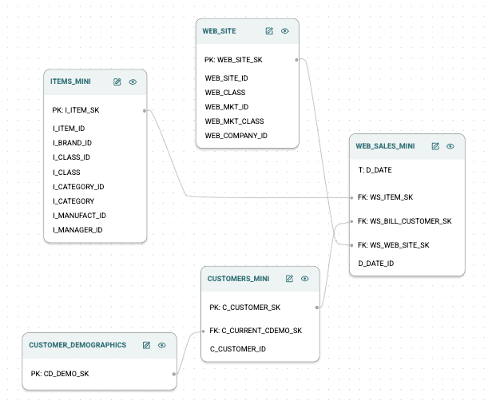

#### What is Kumo?

Kumo is an advanced ML platform that leverages _graph neural networks_ to deliver predictions directly from your Snowflake relational data. Kumo ML models are powered by a GNN architecture, inspired by several academic papers in recent history. Data scientists simply need to write a _predictive query_, and then the Kumo platform will automatically craft the proper neural architecture for their data. As a result of this approach, Kumo is able to achieve great predictive performance out of the box, across a wide range of challenging scenarios.

Kumo simplifies the end-to-end ML process by eliminating the need for extensive data preparation, model tuning, and feature engineering, allowing data scientists to focus on generating valuable predictions and insights.

To learn more, please visit [Kumo’s documentation](https://docs.kumo.ai/docs/welcome-to-kumo).

#### What are Graph Neural Networks?

Graph neural networks (GNNs) are an emerging family of deep learning algorithms that bring together all the advantages from traditional deep learning to graphs. GNNs can learn patterns and relations on a grand scale, combining features from neighboring nodes and training predictive models across the entire network.

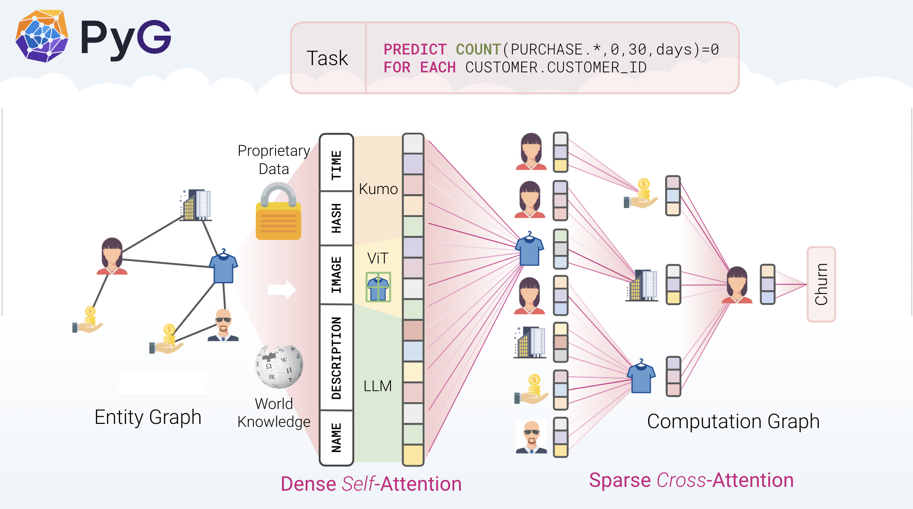

#### What is a Kumo predictive query?

Kumo predictive queries are easy-to-use programming interfaces that automate the major steps in a typical ML pipeline, including target label engineering, feature engineering, model architecture, hyperparameter search, and model deployment. Predictive queries are written using Kumo’s predictive query language (PQL), a SQL-like scripting language for describing ML predictions.

#### What you will learn

In summary, you will learn how to:

* Connect Snowflake's TPC-DS retail dataset  
* Create Kumo predictive queries to predict your highest value customers (i.e., highest “lifetime value” customers) and the products they are most likely to buy in the next 30 days  
* Train your predictive queries  
* Evaluate your predictive models using Kumo’s explainable AI tools   
* Create batch predictions for production use

#### What you'll build

Using Kumo as a Snowflake native app, you will build predictive models for determining customer lifetime value (LTV) and delivering top ten product recommendations to those customers, all within your Snowflake environment. You can easily access those predictions from within a Snowflake worksheet, and deploy these predictions to your production website or email notification system.

Please note that starting and using Kumo as a Snowflake native app will incur metered costs for running the required compute pool. Be sure to [shut down Kumo](https://docs.kumo.ai/docs/installing-kumo-on-spcs\#step-3-optional-shutting-down-kumo) to suspend the compute pool when the app is not in use.

#### Pre-requisites

* Familiarity with [Snowflake](https://quickstarts.snowflake.com/guide/getting\_started\_with\_snowflake/index.html\#0) and a Snowflake account  
* A valid Kumo account installed as a [native Snowflake app](https://app.snowflake.com/marketplace/listing/GZTYZBN5P0/kumo-ai-kumo)  
* Snowflake’s TPC-DS sample dataset from [https://docs.snowflake.com/en/user-guide/sample-data](https://docs.snowflake.com/en/user-guide/sample-data)

> aside positive
> NOTE:  If you haven’t already done so, please [follow these instructions](https://docs.kumo.ai/docs/installing-kumo-on-spcs) to install Kumo as a native Snowflake app. 

## Setting Up Data in Snowflake

Duration: 10

You will first need to install and downsample the public TPC-DS dataset that comes with your Snowflake deployment. The TPC-DS dataset models the decision support functions of a retail product supplier, containing vital business information such as customer, order, and product data. Although you will be downsampling the data for demonstration purposes, Kumo as a native Snowflake app can scale to billions of rows and terabytes of data. 

To learn more about the TPC-DS sample dataset, please visit [Snowflake’s documentation.](https://docs.snowflake.com/en/user-guide/sample-data-tpcds)

The following SQL code will install and downsample the sample dataset—you can run it as a worksheet inside of your Snowdrift web interface:

```
-- Create a database from the share.
CREATE DATABASE SNOWFLAKE_SAMPLE_DATA FROM SHARE SFC_SAMPLES.SAMPLE_DATA;

-- Grant the PUBLIC role access to the database.
-- Optionally change the role name to restrict access to a subset of users.
GRANT IMPORTED PRIVILEGES ON DATABASE SNOWFLAKE_SAMPLE_DATA TO ROLE PUBLIC;

-- Create simplified versions of the dataset
CREATE DATABASE KUMO_REC_DEMO;
USE DATABASE KUMO_REC_DEMO;
CREATE SCHEMA TPCDS_WEB_MINI;
USE SCHEMA TPCDS_WEB_MINI;

-- Create smaller copy of web_sales. Join in the date information for convenience.
CREATE TABLE WEB_SALES_MINI AS
    SELECT *  FROM SNOWFLAKE_SAMPLE_DATA.TPCDS_SF10TCL.WEB_SALES WEB_SALES
    JOIN SNOWFLAKE_SAMPLE_DATA.TPCDS_SF10TCL.DATE_DIM DATE_DIM
    ON DATE_DIM.D_DATE_SK = WEB_SALES.WS_SOLD_DATE_SK
    LIMIT 30000000;

-- Create smaller copy of customers, only containing ones with sales
CREATE TABLE CUSTOMERS_MINI AS
    SELECT CUSTOMER.*  FROM SNOWFLAKE_SAMPLE_DATA.TPCDS_SF10TCL.CUSTOMER CUSTOMER
    JOIN (
        SELECT DISTINCT WS_BILL_CUSTOMER_SK
        FROM WEB_SALES_MINI
    ) CUSTOMER_IDS
    ON CUSTOMER.C_CUSTOMER_SK = CUSTOMER_IDS.WS_BILL_CUSTOMER_SK;

-- Create smaller copy of items, only containing items with sales
CREATE TABLE ITEMS_MINI AS
    SELECT ITEM.*  FROM SNOWFLAKE_SAMPLE_DATA.TPCDS_SF10TCL.ITEM ITEM
    JOIN (
        SELECT DISTINCT WS_ITEM_SK
        FROM WEB_SALES_MINI
    ) ITEM_IDS
    ON ITEM.I_ITEM_SK = ITEM_IDS.WS_ITEM_SK;

-- Copy over the smaller tables into the same schema for convenience;
CREATE TABLE CUSTOMER_DEMOGRAPHICS AS SELECT * FROM SNOWFLAKE_SAMPLE_DATA.TPCDS_SF10TCL.CUSTOMER_DEMOGRAPHICS;
CREATE TABLE WEB_SITE AS SELECT * FROM SNOWFLAKE_SAMPLE_DATA.TPCDS_SF10TCL.WEB_SITE;
```

Once the sample dataset has been created, you will see the new `KUMO_REC_DEMO` database under the Databases pane.

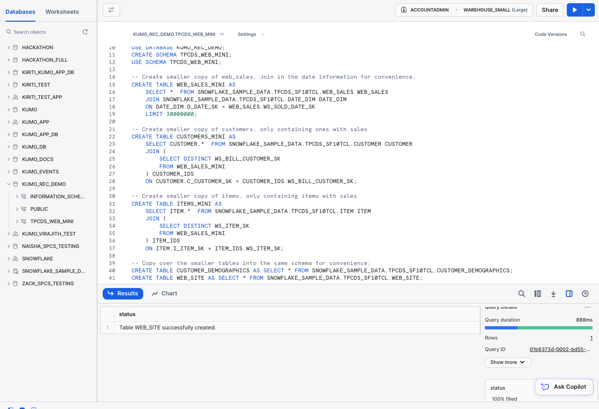

## Registering Your Schema in Kumo

Duration: 10

This step assumes that you have already installed Kumo as a Snowflake native app. If not, [follow these directions](https://docs.kumo.ai/docs/installing-kumo-on-spcs\#4-create-a-compute-pool-and-launch-the-kumo-container) to set up, install, and launch Kumo as a Snowflake native app. 

After importing the sample dataset into your Snowflake environment, you will start up Kumo as a Snowflake native app, log in through the Kumo app UI, and register the sample dataset’s schema.

#### Set Up Connector

After logging in to the Kumo app UI with your Snowflake credentials, click on `Connectors` from the left-hand navigation, followed by the `Configure Connector` button in the top right-hand corner. If you have enrolled in multi-factor authentication (MFA), you will need to first approve and configure the app for this to continue.  
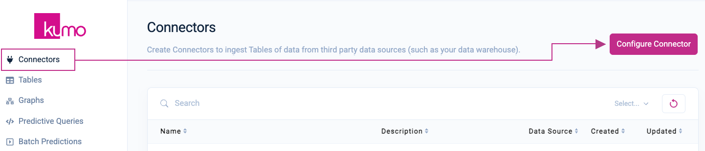

In the `Snowflake Connector` modal window, provide a unique `Name` for your connector, as well as your `Account Identifier`, `User`, and `Password`.

> aside positive
> NOTE: You can identify your `Account Identifier` by analyzing the URL of your Kumo app: 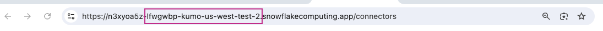

Input the following values for the remaining fields:

* Database: `KUMO_REC_DEMO`  
* Warehouse: `WAREHOUSE SMALL`  
* Schema: `TPCDS_WEB_MINI`

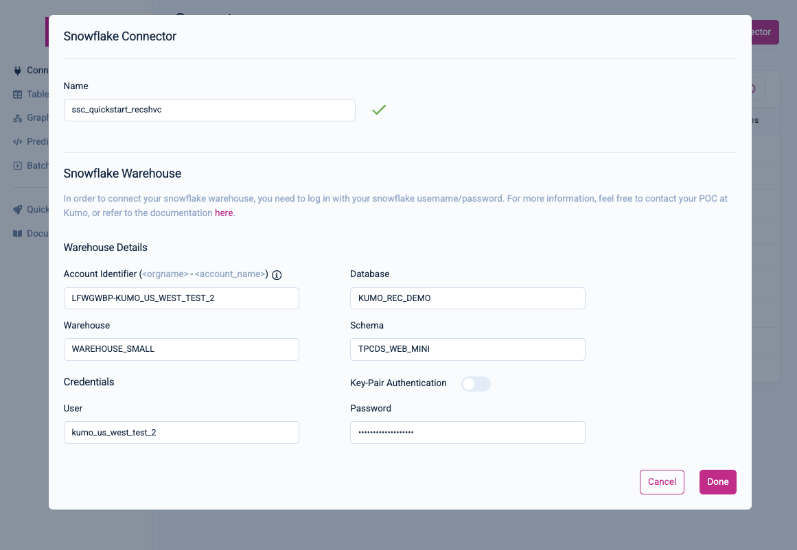

Click on the `Done` button to finish creating your connector. You should now see your new connector under the Connectors page.

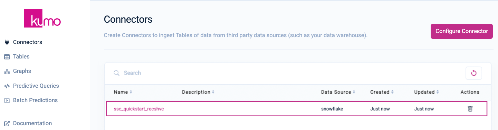

#### Register Your Table Schemas

Click on `Tables` from the left-hand navigation, followed by the `Connect Table` button in the top right-hand corner.

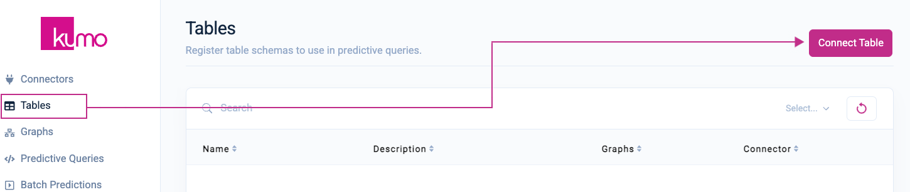

You will now connect your first table: **CUSTOMERS\_MINI**.

Under `Connector`, make sure the name of the connector you created in the previous step is selected by default. If not, use the drop-down menu to select it; the options for the `Source Table` drop-down menu will then be populated with the five tables required for this quickstart. 

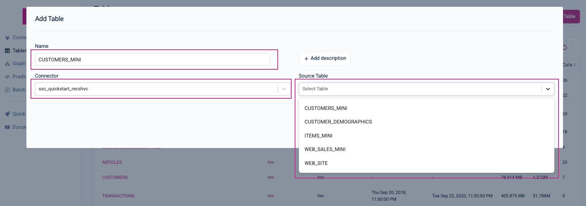

Under `Source Table`, select the `CUSTOMERS_MINI` table—Kumo will then automatically fill in the `Name` value (you can accept the default) and load the table’s pre-processing settings for you to configure. Provide an optional description for your table. Set the `C_CUSTOMER_SK` column as the primary key and its Type to `ID`.

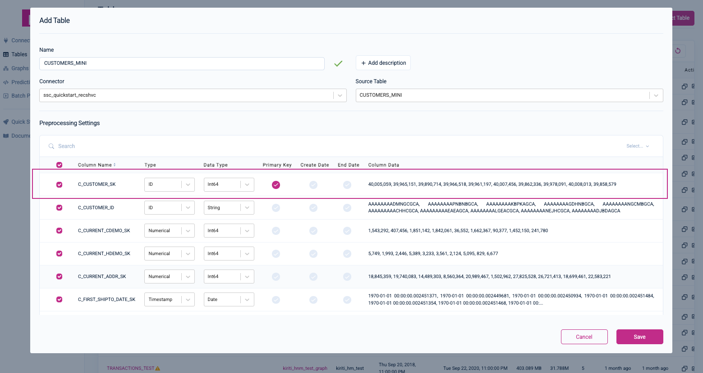

Click the `Save` button to continue. You will be routed to your new table’s detail page. Click on the `Connect Another Table` button to connect the rest of your tables.

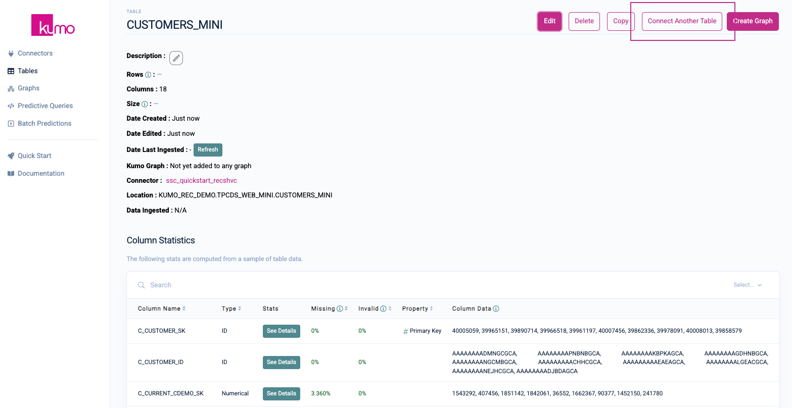

Follow the same steps to create each of the remaining tables (**CUSTOMER\_DEMOGRAPHICS**, **ITEMS\_MINI**, **WEB\_SALES\_MINI**, **WEB\_SITE**). When creating these tables, please take note of the following per table settings:

* **CUSTOMER\_DEMOGRAPHICS** \- Set the `CD_DEMO_SK` column as the primary key and its Type to `ID`.  
* **ITEMS\_MINI** \- Set the `I_ITEM_SK` column as the primary key and its Type to `ID`.  
* **WEB\_SALES\_MINI** \- Deselect the `WS_SOLD_TIME_SK` and `WS_SHIP_DATE_SK` columns; set the `D_DATE` as the Create Date.   
* **WEB\_SITE** \- Set the `WEB_SITE_SK` column as the primary key and its Type to `ID`.

#### Create Your Graph

After creating your last table, click on the `Create Graph` button in the top right-hand corner.

On the `Graph Setup` page, provide a name and optional description for your graph. Select the `WEB_SITE`, `WEB_SALES_MINI`, `ITEMS_MINI`, `CUSTOMER_DEMOGRAPHICS`, and `CUSTOMERS_MINI` tables to add them to your new Kumo graph

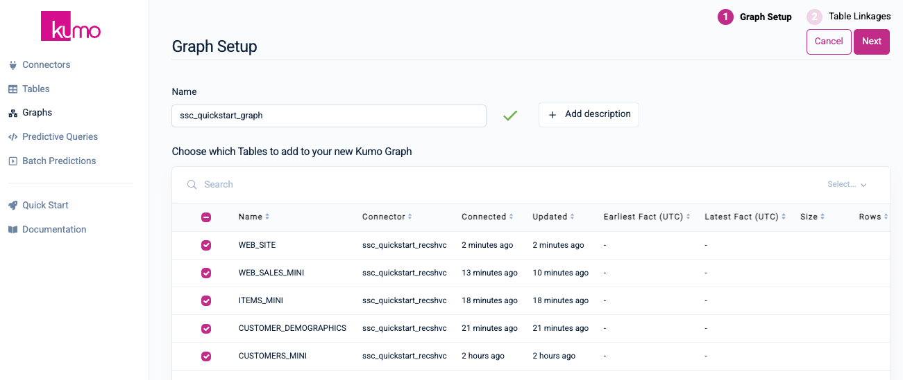

Click the `Next` button to continue.

On the `Set Links Between Tables` page, set the following linkages between your tables:

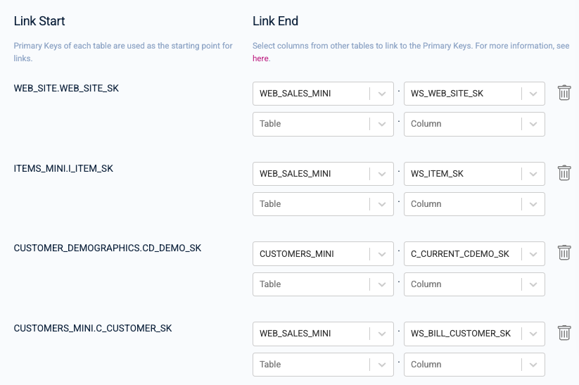

Your data model graph links should look like the following when you are done:  


Click the `Complete Graph Creation` button to continue.

## Building Your Predictive Queries

Duration: 5

To create product recommendations for your highest value customers, you will first predict *who* your highest LTV customers are, followed by predictions regarding which products they are most likely to purchase. This entails writing predictive queries using Kumo’s predictive query language (PQL), an easy-to-use, SQL-like language interface for querying the future.

To learn more about predictive queries, please visit [Kumo’s documentation.](https://docs.kumo.ai/docs/predictive-query)

#### Predicting Your Highest LTV Customers

Customer LTV represents the total amount of money a customer is expected to spend on your business during their lifetime. For this quickstart, you can assume that the customers with the highest LTV are the most likely to buy something. Predicting LTV falls under the category of a regression problem.

###### What is a regression problem?

Because the target variable of this prediction is a real-valued number, the task type of this predictive query is a regression problem. Regression problems involve predicting a continuous outcome based on the value of one or more predictor variables.

The following PQL statement predicts customer LTV, as measured by the total amount of sales each customer is likely to make in the next 30 days:

```

PREDICT SUM(WEB_SALES_MINI.WS_EXT_SALES_PRICE, 0, 30)
FOR EACH CUSTOMERS_MINI.C_CUSTOMER_SK
```

###### Creating and Training the LTV Predictive Query

Click on `Predictive Queries` from the left-hand navigation, followed by the `Write Predictive Queries` button in the top right-hand corner.

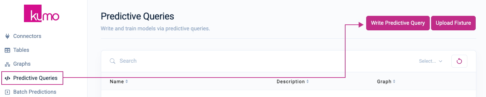

On the `Predictive Query` page, provide a name and option description for your predictive query. Under `Graph Source`, select the graph you just created in the previous step.

In the `PQuery` text area, insert the following PQL statement for predicting how much each customer will spend over the next 30 days:

```
PREDICT SUM(WEB_SALES_MINI.WS_EXT_SALES_PRICE, 0, 30)
FOR EACH CUSTOMERS_MINI.C_CUSTOMER_SK
```

Once you have inserted a valid predictive query, Kumo will display the task type/description beneath the PQuery text box.

Click on the `Next` button in the top right-hand corner to continue.

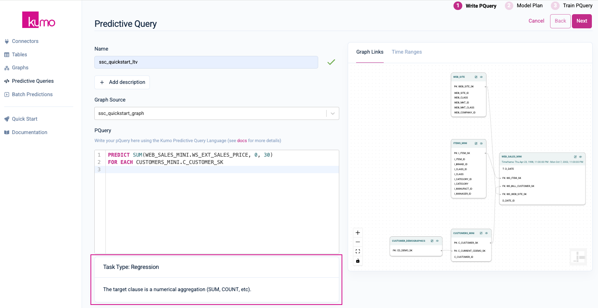

On the `Model Plan` page, you can review your `Run Mode` and `Model Planner` settings. You can accept the default values on this page. Click the `Save and Train` button in the top right-hand corner.

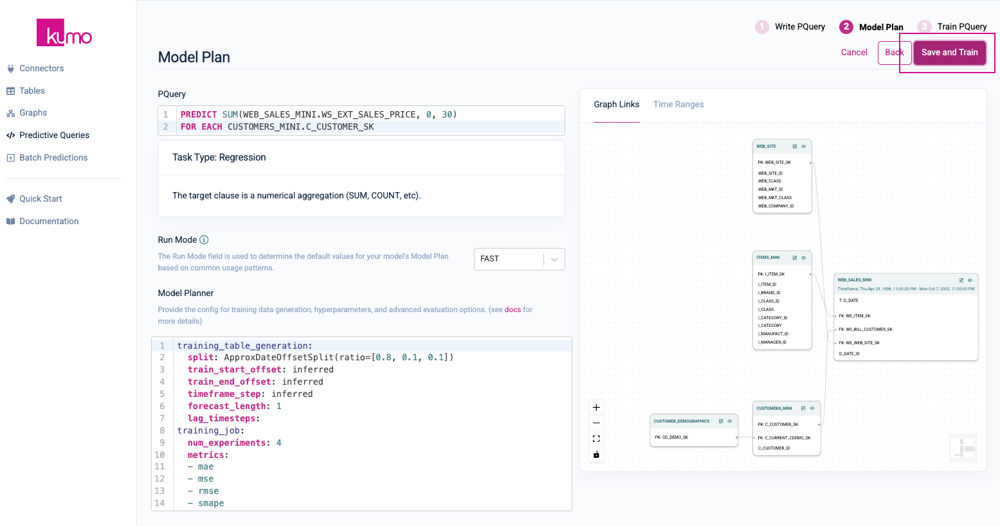

Once the predictive query starts the training process, you will be routed to your predictive query’s training page, where you can monitor its progress in real-time.

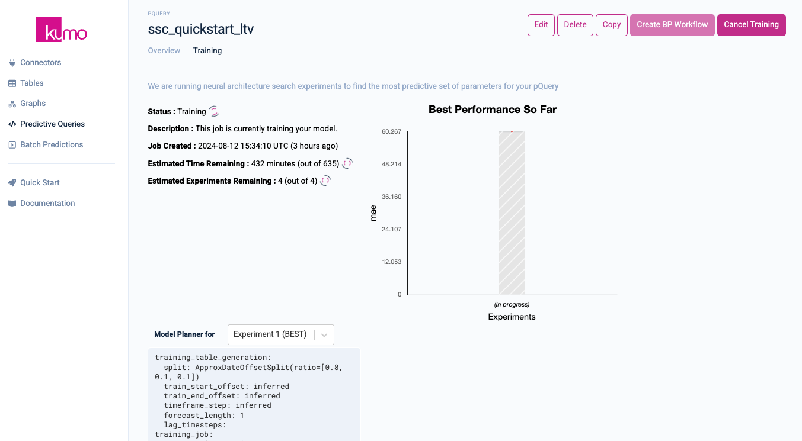

#### Predicting What Products to Recommend

Once you have generated your predictions for customer LTV, you can then extract the customers with the highest LTV, and actively make recommendations to them by predicting which products they are most likely to purchase. GNNs are highly-suitable for recommendation tasks because, unlike traditional models, they can leverage rich graph connectivity patterns to gain a deeper understanding of user preferences and insights that are often missed by other algorithms.

###### What is a link prediction problem?

The recommendation problem forms a bipartite graph between users and items, where nodes represent the users and items, and edges represent the user-item interactions. Edges often come with timestamps. Moreover, multiple edges may exist between pairs of nodes, since a user may repeatedly interact with the same item (e.g., repeat ordering of the same product in e-commerce).  

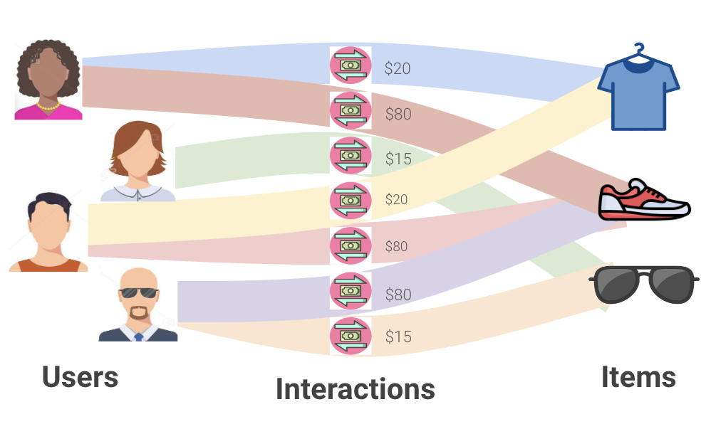  

Given the bipartite graph of the past interactions, a recommendation task can be cast as a link prediction task—one that calls for predicting future interactions between user nodes and item nodes. 

The following PQL statement predicts the top ten products your highest LTV customers are likely to purchase in the next 30 days:

```

PREDICT LIST_DISTINCT(WEB_SALES_MINI.WS_ITEM_SK, 0, 30)
RANK TOP 10
FOR EACH CUSTOMERS_MINI.C_CUSTOMER_SK
```

As you can see, in only three lines of code, you are getting the best, state-of-the-art recommender model used by companies like Pinterest, Uber, and Amazon.

To learn more, read about [Kumo’s hybrid GNN model](https://docs.kumo.ai/docs/hybrid-graph-neural-networks) for recommendation systems.

###### Creating and Training Your Recommendation System

Click on `Predictive Queries` from the left-hand navigation, followed by the `Write Predictive Queries` button in the top right-hand corner.

On the `Predictive Query` page, provide a name and option description for your predictive query. Under `Graph Source`, select the graph you just created in the previous step.

In the `PQuery` text area, insert the following PQL statement for predicting how much each customer will spend over the next 30 days:

```
PREDICT LIST_DISTINCT(WEB_SALES_MINI.WS_ITEM_SK, 0, 30)
RANK TOP 10
FOR EACH CUSTOMERS_MINI.C_CUSTOMER_SK
```

Once you have inserted a valid predictive query, Kumo will display the task type/description beneath the PQuery text box.

Click on the `Next` button in the top right-hand corner to continue.

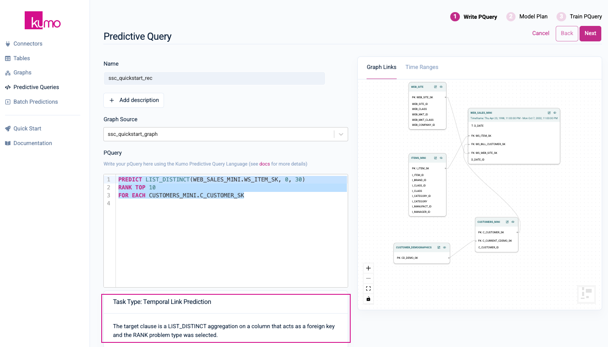

On the `Model Plan` page, you can review your `Run Mode` and `Model Planner` settings. You can accept the default values on this page. Click the `Save and Train` button in the top right-hand corner.

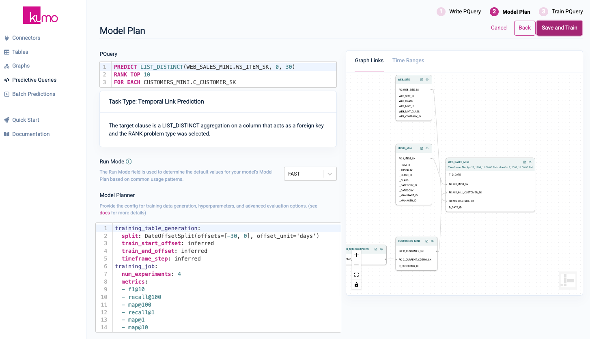

Once the predictive query starts the training process, you will be routed to your predictive query’s training page, where you can monitor its progress in real-time.

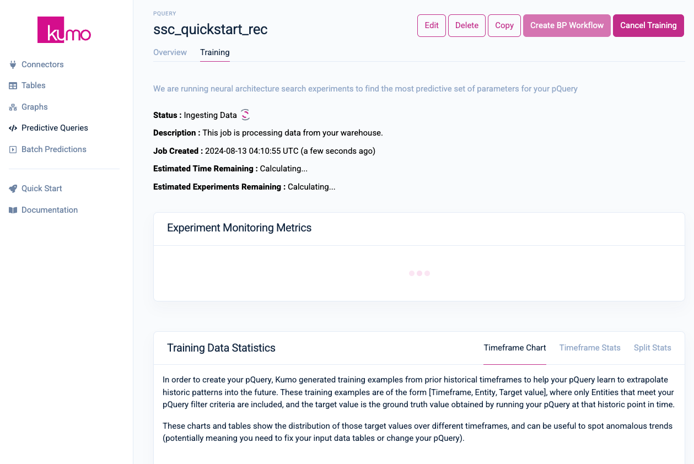

## Evaluating the Model Performance

Duration: 5

Kumo provides a wide range of mechanisms for gauging the efficacy of your predictive models. On the `Training` tab of your predictive query, Kumo will display various metrics and statistics explaining the results of various neural architecture experiments and model planner parameters.

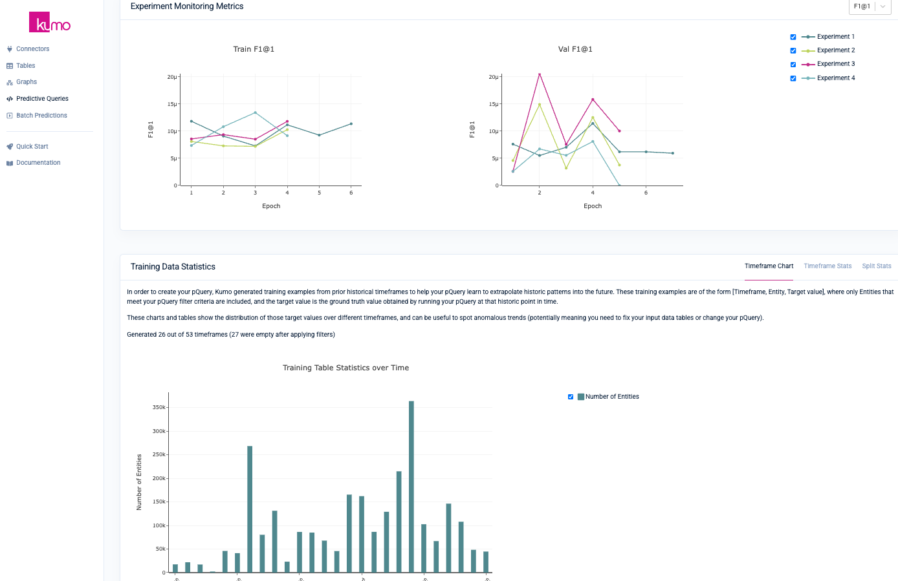

#### The Evaluation Tab

You can also access evaluation metrics under the `Evaluation` tab of your predictive query’s detail page, as well as access your holdout predictions within a Snowflake worksheet.

For example, after training your predictive query for determining LTV—a regression task—Kumo will export the standard evaluation metrics for regression, as described [here](https://docs.kumo.ai/docs/regression). Similarly, after training your predictive query for creating customer recommendations, Kumo provides evaluation metrics for link prediction, as described [here](https://docs.kumo.ai/docs/link-prediction).

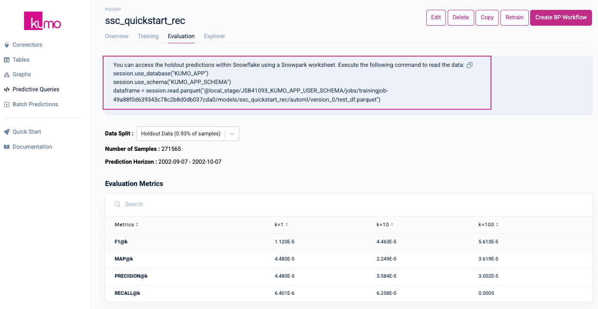

Please note that due to the randomly generated nature of the TPC-DS dataset, your evaluation metrics will display less-than-optimal results.

###### Accessing Your Holdout Predictions in Snowpark

To access your holdout predictions in Snowpark, first click the `Copy` 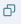 icon in the message directly under the `Evaluation` tab to copy the command to your clipboard.

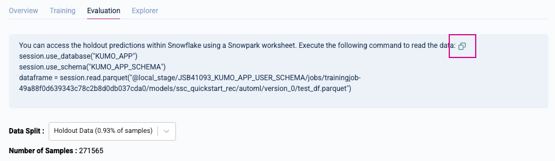

Log in to your Snowflake account’s Snowsight interface and create a new Python worksheet by clicking on either of the Python Worksheet links/buttons.  
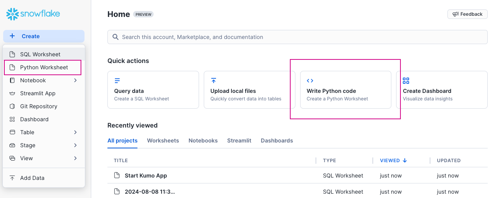

Snowsight will load a barebones Python worksheet with some sample code in place. Paste the code from your predictive query’s `Evaluation` tab (currently in your clipboard) into the worksheet, inside the `main` handler. Be sure to keep the `dataframe.show()` and `return dataframe` lines in place so your results appear in the `Results` tab.

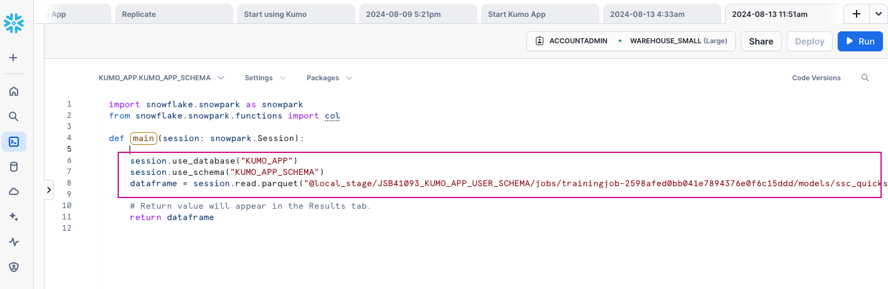

Click the `Run` button in the top right-hand corner. You should now see your prediction results in the `Results` tab of your Python worksheet.  
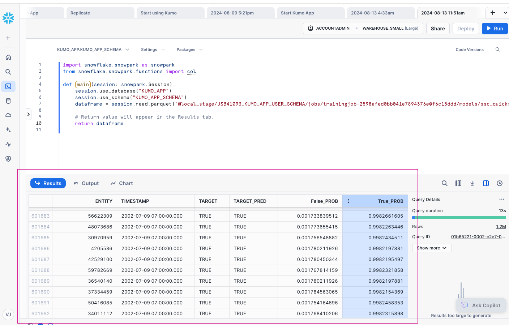

#### The Explorer Tab

If you click on the `Explorer` tab of your predictive query’s detail page, you can view specific insights regarding individual entity-level predictions. For example, in the case of predicting top recommendation (a link prediction task), Kumo will display a list of selectable entity categories for viewing and comparing predictions against historical and ground truth data. You can also analyze the importance score that indicates the significance of each column in the prediction

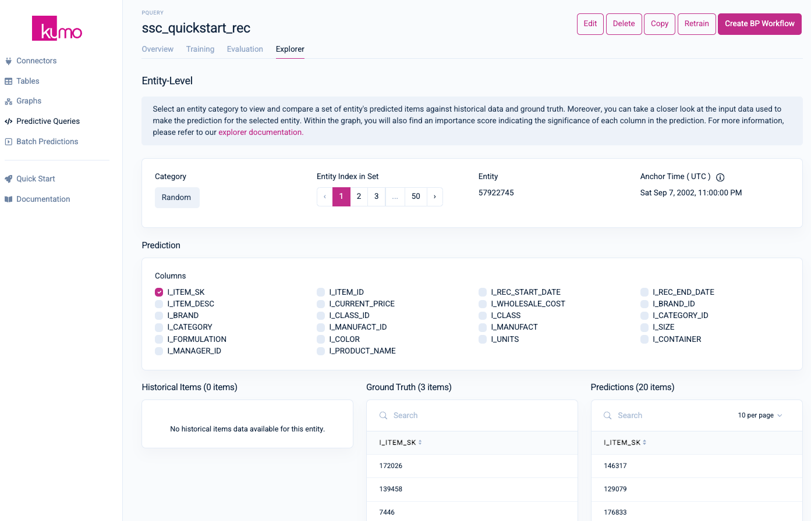

Please refer to [Kumo’s documentation](https://docs.kumo.ai/docs/explorer) to learn more about the `Explorer` tab.

## Productionize Your Model

Duration: 10

After training your predictive query, you can set up a batch prediction workflow and jobs to run your predictive query on a regular basis. From your predictive query’s detail page, click on `Create BP Workflow` in the top right-hand corner.

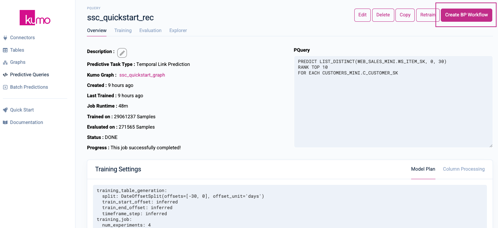

From the `Create a Batch Prediction Workflow` page, provide a name for your batch prediction workflow and an optional description. Make sure that your predictive query is selected in the `PQuery` drop-down menu. You can also click the `Edit PQuery Filters` to override some of your initial predictive query filters for your batch prediction.

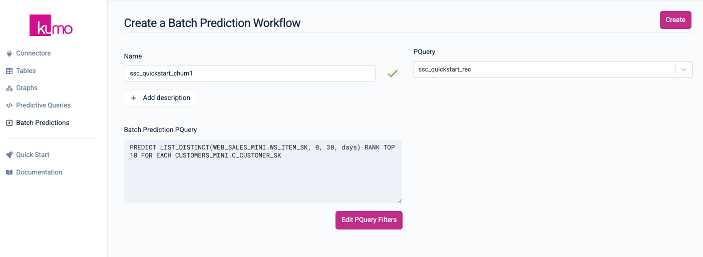  
Click on the `Create` button on the top right-hand corner to finish creating your batch prediction workflow.

On your new batch prediction workflow’s detail page, click on the `Run Batch Prediction Job` button to configure your batch prediction job settings.  
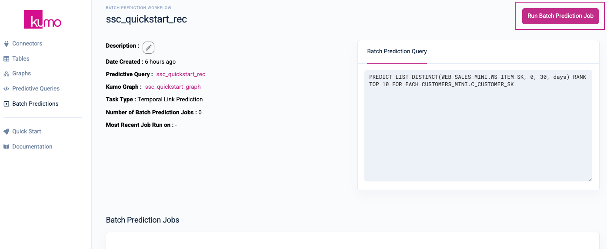

In the Job Settings modal window, you can provide a `Prediction Anchor Time`, or starting date for your predictions. For this quickstart, leave `Prediction Anchor Time` blank (Kumo will use the latest timestamp in the fact table specified by your predictive query’s target formula) and accept all the default values, but make sure that the connector you created previously is selected under the `Connector` drop-down menu.

Kumo will write your batch predictions to your Snowflake environment, in the table specified under `Table Name` (in this case, `SSC_QUICKSTART_REC_PREDICTIONS`).

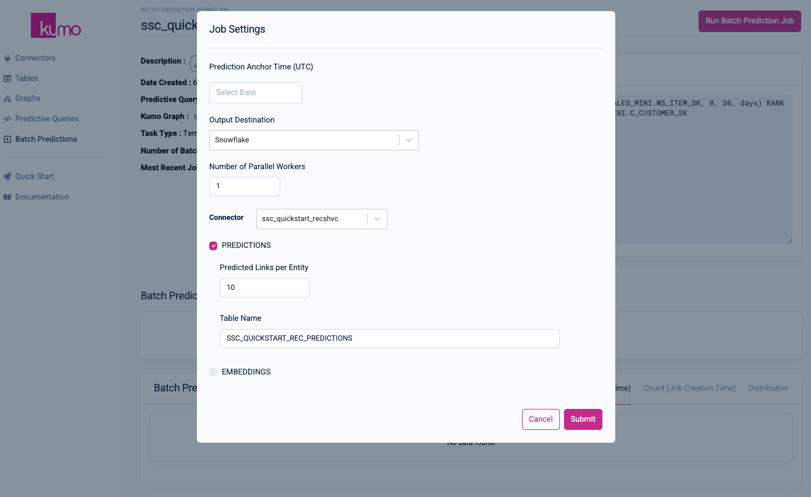

Click the `Submit` button to start your batch prediction job. You will be routed to your batch prediction job’s detail page, where you can monitor its progress in real-time.

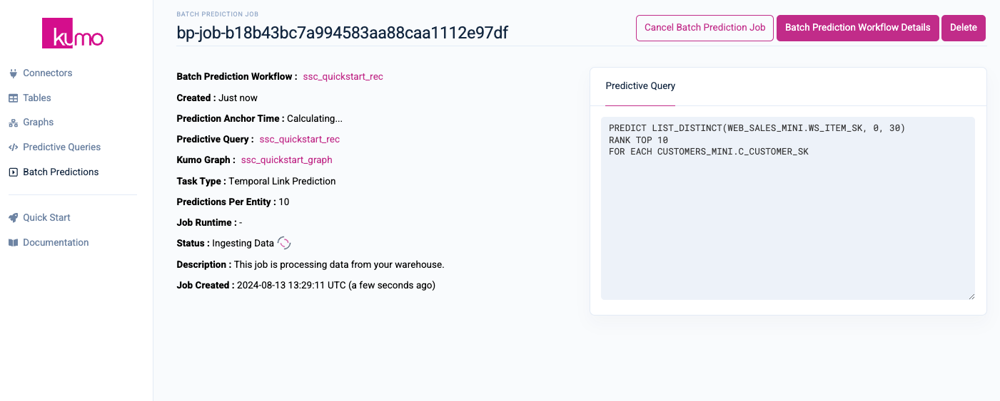

Once your batch prediction job is completed, copy the `Output Destination` to your clipboard by clicking on the `Copy`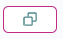 button.

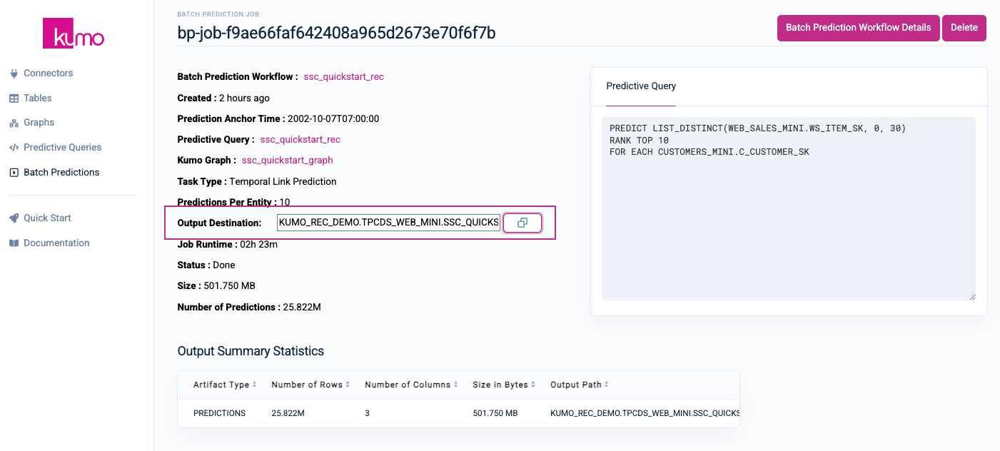

Log in to your Snowflake account’s Snowsight interface and create a new SQL worksheet by clicking on either of the SQL Worksheet links/buttons.

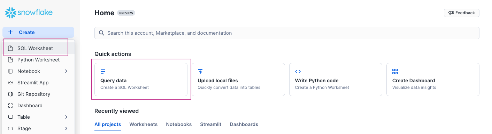

Snowsight will load a blank SQL worksheet. Paste your batch prediction job’s  `Output Destination` (currently in your clipboard) into the worksheet and click the `Run` button in the top right-hand corner. Your batch predictions should appear in the `Results` tab of your SQL worksheet.

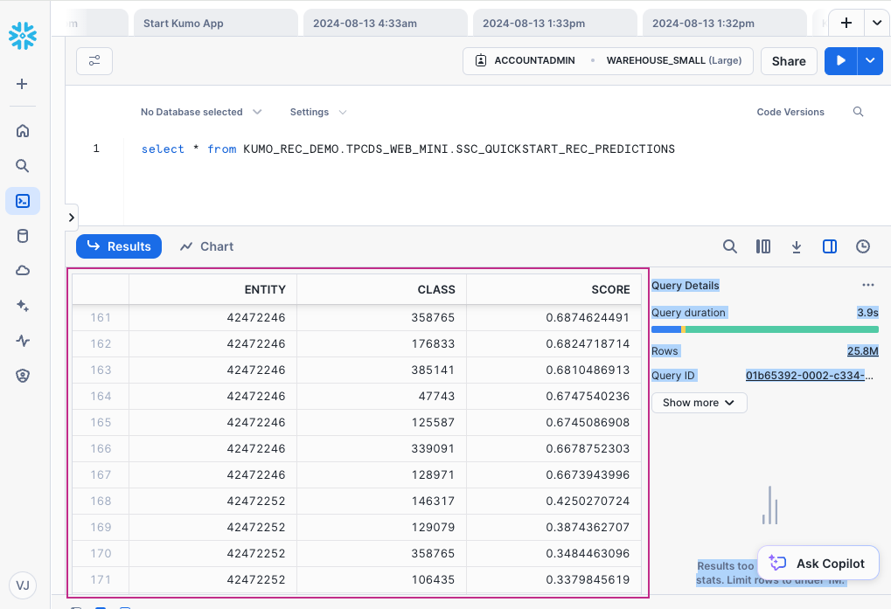

For production use cases, your batch prediction jobs can be automated and integrated into a custom application using Kumo’s REST API, or used to power notifications through a multi-channel provider such as Braze.

Please refer to [Kumo’s Documentation](https://docs.kumo.ai/docs/batch-prediction) to learn more about Batch Predictions.

## Cleanup and Shutdown

Duration: 5

Once you’re done using the Kumo native app, you should shut it down so as not to incur additional metered costs. You can do this by running the following command in a SQL worksheet:

```

SET KUMOAPP_STOP = CONCAT(($KUMOAPP_NAME),'.KUMO_APP_SCHEMA.SHUTDOWN_APP');
CALL IDENTIFIER($KUMOAPP_STOP)('USER_SCHEMA');
```

Snowflake will automatically suspend the underlying compute pool when the app is idle. However, you can also completely shut down the compute pool if you aren’t using the Kumo app for an extended period:

```

DROP COMPUTE POOL IF EXISTS KUMO_COMPUTE_POOL;
```

You can always restart the compute pool and app at a later time, if needed. For more information about starting/stopping Kumo as a native Snowflake app, please refer to [Kumo’s documentation](https://docs.kumo.ai/docs/installing-kumo-on-spcs\#4-launch-and-use-kumo).

## Conclusion and Resources

Duration: 5

#### Conclusion

After importing our sample retail dataset, we developed and trained two predictive queries: one for predicting customer LTV, and the other for making top10 product recommendations for those customers. We then used Kumo’s explainable AI tools for evaluating our models’ performance, and set up our predictive models for production use.

#### What you learned

* How to connect your Snowflake data to Kumo’s Snowflake native app  
* How to register your schemas and create graphs in Kumo  
* How to create Kumo predictive queries for predicting customer LTV and making product recommendations  
* How to evaluate model performance with Kumo’s explainable AI tools  
* How to productionize your Kumo predictive models

#### Resources

* [Kumo Documentation](https://docs.kumo.ai/docs/)  
* [Installing Kumo on SPCS](https://docs.kumo.ai/docs/installing-kumo-on-spcs)  
* [Kumo Native Snowflake App Troubleshooting Guide](https://docs.kumo.ai/docs/troubleshooting-and-support)  
* [Predictive Query Tutorial](https://docs.kumo.ai/docs/tutorial)  
* [Predictive Query Reference](https://docs.kumo.ai/docs/primary-commands)
* [Fork Repo on GitHub](https://github.com/Snowflake-Labs/sf-samples/tree/main/samples/leveraging_kumo_for_smarter_recommendations)
* [Download Reference Architecture](https://www.snowflake.com/content/dam/snowflake-site/developers/2024/09/Making-Product-Recommendations-to-High-Value-Customers-Reference-Architecture.pdf)
* [Read the Blog](https://medium.com/snowflake/using-kumo-in-snowflake-for-smarter-product-recommendation-79f64ba3b8c8)
* [Watch the Demo](https://youtu.be/UtwLQgoHHss?list=TLGGrjSJvHTYVnYyNDA5MjAyNQ)

If you have any questions, reach out to your Kumo account manager or Snowflake account team\!
