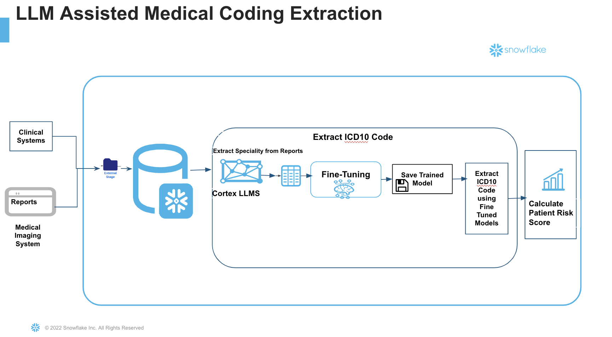

author: Kala Govindarajan
id: llm-assisted-medical-coding-extraction-for-healthcare
categories: snowflake-site:taxonomy/solution-center/certification/quickstart, snowflake-site:taxonomy/industry/healthcare-and-life-sciences, snowflake-site:taxonomy/product/data-engineering, snowflake-site:taxonomy/snowflake-feature/unstructured-data-analysis
language: en
summary: Clinical coding is the task of transforming medical records, usually presented as free texts written by clinicians or as typed texts, into structured codes in a classification system like ICD-10. By completing this QuickStart guide, you will see how fine tuning alleviates the workload on physicians and medical coders, as we aim to advance the implementation of autonomous medical coding. This approach will not only ensure high accuracy and clinical specificity in Medical code extraction but also support various healthcare models paving the way for a more sustainable and effective healthcare environment. 
environments: web
status: Published 
feedback link: https://github.com/Snowflake-Labs/sfguides/issues
fork repo link: https://github.com/Snowflake-Labs/sfguide-llm-assisted-medical-coding-extraction-for-healthcare-in-snowflake

# LLM Assisted Medical Coding Extraction for Healthcare in Snowflake
<!-- ------------------------ -->
## Overview 

In the complex landscape of healthcare, the accurate calculation of patient risk scores is not just a matter of compliance, but a crucial aspect that can significantly influence a provider's financial reimbursements. Accurate risk scoring is instrumental in ensuring that healthcare providers receive the appropriate compensation for the level of care they provide, balancing the dual objectives of delivering high-quality care and maintaining financial viability.
And these  scores not only influence clinical decisions and resource allocation but also significantly impact reimbursement rates from insurance companies. Given their importance, the need for precision in calculating risk scores cannot be overstated.

Traditionally, healthcare providers have relied on various tools and methodologies to estimate patient risk scores. However, these conventional methods often fall short in addressing the complexity and variability inherent in patient data.  In this Quickstart guide we will study how to leverage a large language model in the beginning and implement a Distillation flow with a Llama 405b to generate training samples to teach a smaller model perform the code extraction task with the same accuracy but lower cost. Large language model (LLM) distillation focuses on replicating the performance of a large model on a specific task by transferring its capabilities to a smaller model. This allows developers to achieve similar results to models like GPT-4 but with reduced computational cost and faster performance—though only for the targeted task.

The process treats the large model as the "teacher" and the smaller model as the "student." The student model could range from a simple logistic regression to a more advanced foundation model like BERT.
By transferring essential knowledge from a complex teacher model to a smaller student model, the distillation flow preserves performance while reducing size and computational demands ,making them ideal for integration across a broader range of devices and platforms. 

### What is Cortex Fine Tuning?
The Snowflake Cortex Fine-tuning function offers a way to customize large language models for your specific task. Cortex Fine-tuning is a fully managed service that lets you fine-tune popular LLMs using your data, and achieve the fewer trainable parameters, a higher training throughput, and, unlike adapters, no additional inference latency.  Users can fine-tune and use industry-leading LLMs very easily with SQL and/or Python functions. - You select training dataset and optional validation dataset from your own data to fine-tune a foundation model. There is no data privacy or security concerns associated with data move or migration.
Also Cortex fine-tuning does Automatic Parameter Efficient Fine-tuning (PEFT) without manual parameters.

### Prerequisites
- A non-trial Snowflake account with access to a role that has the ACCOUNTADMIN role. If not, you will need to work with your admin to perform the initial environment setup.
- Git installed.

### What You’ll Learn
- How to retrieve unstructured files—in this case, medical reports—in PDF format from an external stage in Snowflake, read them, and apply a text chunking function within a Snowflake Notebook.
- How to extract ICD10 codes from medical reports using a large language model, creating a labeled dataset for training.
- How to utilize the extracted medical codes with Cortex LLMs to fine-tune a smaller model, achieving the accuracy of a larger model.
- How to leverage the fine-tuned, smaller model for efficient and accurate code extraction

### What You’ll Need 

- A [Snowflake](https://signup.snowflake.com/?utm_source=snowflake-devrel&utm_medium=developer-guides&utm_cta=developer-guides) account in a region where Snowflake Cortex and Arctic are available.
- Access to the ACCOUNTADMIN role. If not, you will need to work with your admin to perform the initial environment setup.
- Git installed.

### What You’ll Build 

- A comprehensive end-to-end autonomous coding solution utilizing LLMs to extract and analyze medical codes from patient reports.
- Utilize Snowflake Cortex Fine Tuning to enhance coding accuracy while reducing costs, thereby maximizing revenue and facilitating streamlined decision-making. This will contribute to improved patient risk scoring and better claim reimbursements.
  
<!-- ------------------------ -->
## Setup Environment

This section will walk you through creating various objects

#### High-Level Workflow

Steps:
**Step 1**. - Clone [GitHub](https://github.com/Snowflake-Labs/sfguide-llm-assisted-medical-coding-extraction-for-healthcare-in-snowflake) repository.

**Step 2**. - Run the code under the scripts/setup.sql file in Snowsight SQL Worksheet.
Once the objects are setup, now let us proceed to the notebook execution 

**Step 3**.
The Notebook is available to download from the [notebook](https://github.com/Snowflake-Labs/sfguide-llm-assisted-medical-coding-extraction-for-healthcare-in-snowflake/tree/main/notebook) folder in the git repository.

**Step 4** 
Run cell by cell in the notebook.
We will explore the Notebook in detailed in the next section.

<!-- ------------------------ -->
## Cortex Fine Tuning

In this section we will explore the notebook. As mentioned earlier, do not execute Run All. Instead execute cell by cell.

Large language model (LLM) distillation aims to replicate the performance of a large model on a specific task by transferring its capabilities to a smaller, more efficient model. This enables developers to achieve results comparable to large models like GPT-4, but with significantly lower computational costs and faster execution—albeit limited to the targeted task.

In this process, the large model acts as the "teacher," while the smaller model serves as the "student."  We will leverage Cortex LLM Functions and specifically the COMPLETE
with llama3.1-405b which will act as "teacher" in order to prepare the training dataset for Fine Tuning.

#### Important considerations for fine-tuning:

- The quality of the data provided heavily influences fine-tuning performance.
- The dataset should be well-curated, with ample quantities of high-quality data in the appropriate format for training.

#### Step 1 Data Preparation

Begin by importing Streamlit and any other necessary libraries.

To prepare training and validation data:

* Use your existing data engineering pipeline to load unstructured medical reports into a Snowflake stage. For this Quickstart, we have hosted in an external S3 stage.
* Retrieve the files from the stage and apply chunking. Chunking divides the text into manageable parts that fit within the model's context window (the amount of text that can be processed at once).
This ensures only relevant portions of each document are passed to the model, leading to improved accuracy.
* If your unstructred files has already landed in Snowflake, then load the training and optional validation dataset into the target table.

#### Step 2 Carry Distillation Flow

Once the data is available, we will begin the distillation process.
The first step in the flow is having the LLM label the unlabeled data. For labeling, we will use a large model like Llama 3.1-405b.
A prompt will instruct the model to:
*  Read through the report for relevant information.
*  Extract the ICD Code based on the report content.
*  Return the result as a Python list for downstream processing

The generated ICD10 codes along with the prompt and the report is saved in a table
#### Step 3 Split Training and Validation dataset

* Split the resultant dataset into train,test and validation.
* Ensure you have sufficient number of training samples (may range from 50-1000) depending on the task. In this case since we are showing the art of the possible only a small number is added.

We will now carry fine tuning of a small model using the labeled dataset with Snowflake Cortex Fine tuning and improve the accuracy, at both low cost and low latency results.

#### Step 4 Carry Cortex Fine Tuning

*  The Fine tuning function SNOWFLAKE.CORTEX.FINETUNE creates a fine-tuning job. The tuned model is saved to the model registry of the schema. It takes the following parameters : 
   - You specify an identifier for the fine tuned model. 
   - Choose one of the base model available today. Remember this is the student model so it can be a small model ultimately learning from the teacher's style.
   - Query that returns the prompt and completion for the Training
   - Query that returns the prompt and completion for the validation
 
* When the Fine tuning job is created, a generated unique job ID is returned. This can be used to monitor the fine tuning workflow and the completion status.
The training takes sometime to finish and the next steps are dependent on the successful completion of this.

#### Step 5 Calculate patient risk scores
Healthcare providers and Medical coders can now extract patient risk scores using the accurately detected ICD Codes from the fine tuned model.
If you have customers and a risk score mapping for various conditions, you can now use the ICD10 codes to calculate patient risk scores accurately and efficiently.

<!-- ------------------------ -->
## Conclusion And Resources

At the end of this guide, we have seen how to create a production ready AI based autonomous medical coding extraction pipeline which is accurate and cost-effective at the same time, and not rely on a low accurate Prompt engineered or RAG application
We saw that how easily fine tuning alleviates the workload on physicians and medical coders, as we aim to advance the implementation of autonomous medical coding. This approach will not only ensure high accuracy and clinical specificity but also support various healthcare models paving the way for a more sustainable and effective healthcare environment.
As you can see the ability to adopt fine tuning techniques from Snowflake enables a team to start with a small off the shelf  model and customize the model to overarching goal for enhancing efficiency and achieving 100% accuracy.

### What You Learned
- Retrieve medical reports in PDF format from an external stage in Snowflake, read them, and apply a text chunking function within a Snowflake Notebook.
- Extract ICD10 codes from medical reports using a large language model, generating a labeled dataset for training.
- Utilize the extracted medical codes with Cortex LLMs to fine-tune a smaller model, matching the accuracy of a larger model.
- Leverage the fine-tuned, smaller model for efficient and accurate code extraction.

### Related Resources
- #### [Snowpark Cortex Fine-Tuning Documentation](https://docs.snowflake.com/en/user-guide/snowflake-cortex/cortex-finetuning)
  
- #### [Snowpark Cortex LLM](https://docs.snowflake.com/en/user-guide/snowflake-cortex/llm-functions)
