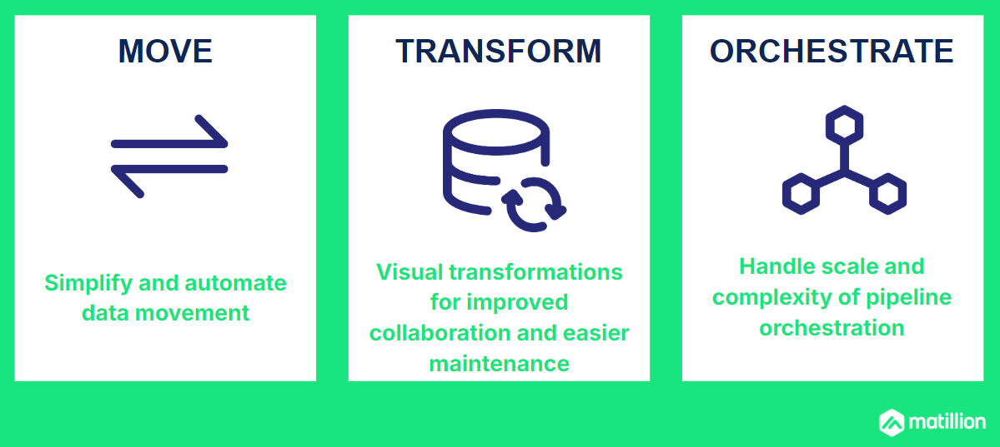

author: Ian Funnell
id: load-integrate-data-matillion-data-productivity-cloud
categories: snowflake-site:taxonomy/solution-center/certification/quickstart, snowflake-site:taxonomy/product/data-engineering
language: en
summary: Load and Integrate data from multiple sources using the Matillion Data Productivity Cloud 
environments: web
status: Published 
feedback link: https://github.com/Snowflake-Labs/sfguides/issues

# Getting Started with Matillion Data Productivity Cloud
<!-- ------------------------ -->
## Overview 

This Quickstart will show you how to load and integrate enterprise data into Snowflake quickly and efficiently using the Matillion Data Productivity Cloud.

It's a typical data integration scenario: there are multiple, related data sources, and you need to generate some joined-up insights. You will build ETL pipelines that extract, load, transform and integrate the data, and you'll get a feeling for the typical development lifecycle with Matillion.

Matillion is the data pipeline platform that brings push-down ELT and AI to Snowflake, helping you to accelerate data pipelines for analytics and AI projects at scale.

### What You Will Build
- Matillion Data Productivity Cloud pipelines that extract, load, transform and integrate data

### What You Will Learn
- How to use the Matillion Data Productivity Cloud Pipeline Designer
- How to build and use Orchestration pipelines for data extraction, and for command-and-control operations such as looping and synchronization
- How to build and use Transformation pipelines for data transformation and integration, including handling semi-structured data
- How to use the Matillion Copilot to help build ETL pipelines
- How to use git with Matillion in feature branching mode

### Prerequisites
- A web browser
- An email address
- Access to a [Matillion account](https://hub.matillion.com/) (or free trial, set up in the next step of this lab)
- Access to a [Snowflake account](https://signup.snowflake.com/?utm_source=snowflake-devrel&utm_medium=developer-guides&utm_cta=developer-guides) (or free trial, automatically created when you sign up for a free Matillion trial)

<!-- ------------------------ -->
## Create your Matillion and Snowflake accounts

If you already have a Matillion and Snowflake account, just [log in to the Matillion Data Productivity Cloud](https://hub.matillion.com/) and go straight to the next step in this Quickstart.

Otherwise ...

### Use Snowflake Partner Connect

If you already have a Snowflake account, look for Matillion Data Productivity Cloud in [Snowflake Partner Connect](https://docs.snowflake.com/en/user-guide/ecosystem-partner-connect#connecting-with-a-snowflake-partner) and follow the instructions on screen to create a Matillion free trial. Once you are logged into your Matillion Data Productivity Cloud account, skip to the next step in this Quickstart.

If you don't already have a Snowflake account, or you prefer to start your own Matillion free trial, read on ...

### Start a Matillion free trial

Go to the Matillion start page at [hub.matillion.com](https://hub.matillion.com/)
- Switch to the **Sign Up** tab
- Authenticate with Google or Microsoft, or enter your business email address and pick a complicated password

If you used an email address, you'll receive an email with a link to verify your address. Follow the link to continue.

Next you will be transferred to the Matillion setup screens.

In the setup screens:
- Provide some basic information about your goals, and let Matillion know how to address you
- Select a cloud region

### Set up your Snowflake account

The last setup screen invites you to choose a target platform.

- If you **already** have a Snowflake account:
    - Pick "Connect to Snowflake"
    - Log in to your Snowflake account in the dialog that follows
    - Go to the next step in this Quickstart
- If you **don't** already have a Snowflake account, select "Use a Matillion trial warehouse" and Matillion will set up a free Snowflake trial on your behalf.

It will take a couple of minutes for Matillion to create a free, empty, trial Snowflake account and connect everything together.
Once that's done you'll end up in the Matillion Data Productivity Cloud's main ETL [pipeline designer interface](https://docs.matillion.com/data-productivity-cloud/designer/docs/designer-overview/).

For reference [here's a video](https://www.youtube.com/watch?v=G2Rc7K_8pZw) that takes you through all the steps above.

<!-- ------------------------ -->
## Create a Development branch

Matillion development is tightly integrated with git, so when you are [logged in to the Matillion Data Productivity Cloud](https://hub.matillion.com/) and developing ETL pipelines, you're always working in the context of a git branch. This Quickstart will demonstrate the **feature branching** strategy.

Start at the management page of your Data Productivity Cloud [Project](https://docs.matillion.com/data-productivity-cloud/designer/docs/projects/), and press "Add New Branch".

Name the new branch `development` and have it branch from `main`.

Towards the end of this Quickstart you'll learn how to merge this feature branch back into main.

Meanwhile, click on the new branch name to enter the [Pipeline Designer](https://docs.matillion.com/data-productivity-cloud/designer/docs/designer-ui-basics/) interface in the development branch.

<!-- ------------------------ -->
## Create Static Metadata

The first data to be loaded into Snowflake is a few fixed records of reference information, which will be used later. This kind of setup is sometimes known as "seed" data.

Matillion uses **Transformation** pipelines for everything that involves running SQL on Snowflake. In the pipeline designer interface, create a new Transformation pipeline.

In the dialog that follows, name the new pipeline `Create SHEET_NAMES` and press the Add button.

Now you can start to add components to the blank canvas. For seed data you need a [Fixed Flow](https://docs.matillion.com/data-productivity-cloud/designer/docs/fixed-flow/) component. There are two ways to do this, both highlighted in the screenshot below:
- Open the `Components` panel on the left, find the **Fixed Flow**, and drag it onto the canvas
- Press the `+` sign in the middle of the canvas, which opens a similar Components dialog. This method has the advantage of automatically connecting the components together when you have more than one

### Add a Fixed Flow component

Whenever a component on the canvas is selected, a panel opens showing its properties.

Set the **name** of the Fixed Flow component to `Generate worksheet names` using the pencil icon at the top of the properties panel. You can do this with any component in a pipeline, and it helps maintainers understand what's going on.

Complete the properties of the new Fixed Flow by setting:

**Columns**

| Name | Datatype |
| --- | --- |
| WORKSHEET_NAME | VARCHAR |

**Values**

| WORKSHEET_NAME |
| --- |
| ITEMS |
| ORDERS |
| ORDER_ITEMS |

> 
>
>  Be careful with the exact names here, making sure they are in uppercase exactly as shown. Copy-and-paste is best.

After you have completed the properties, the border of the component should change to green as Matillion validates it successfully.

Open the **Sample data** panel at the bottom of the screen, and press the `Sample data` button to view the data. Check that three rows appear.

> 
>
>  You can use the Sample data panel with almost all transformation components. It's a great way to keep in touch with the data while you are developing a transformation pipeline

### Add a Rewrite Table component

Now it's time to save those fixed three rows of data to a real Snowflake table. Follow the same steps to add another component: a [Rewrite Table](https://docs.matillion.com/data-productivity-cloud/designer/docs/rewrite-table/) this time.

If you used the `+` icon to add the new component, the two will be connected together already. If you dragged it in from the panel on the left, you'll have to manually link them together by dragging an arrow from the little circle nub on the Fixed Flow to the Rewrite Table. You can reposition components on the canvas at any time by dragging them with your mouse.

Complete the properties of the new Rewrite Table with these values:

**Name** - `Create SHEET_NAMES`

**Target Table** - `GW_SHEET_NAMES`

Your transformation pipeline should look something like this:

### Run the pipeline

Press the `Run` button at the top of the canvas, to manually run the pipeline. It will create a new Snowflake table named `GW_SHEET_NAMES` containing those three rows. The Task History panel will open, and you should see the table name and the rowcount among the details. You can close the Task History panel afterwards.

Now you have some reference data in Snowflake, it's time for the next step.

<!-- ------------------------ -->
## Load Sales data from Excel

In this step you will start to work with some real data.

In the Matillion pipeline designer interface, create a new pipeline - the same as you did in the previous step but an **Orchestration** pipeline this time. In addition to extracting and loading data, this pipeline will also control the overall flow of data for this Quickstart, so give it a generic name: `GreenWave Technologies Demo`.

Now you can start to add components to the canvas. 

> 
> 
>  Every Orchestration pipeline must have a [Start](https://docs.matillion.com/data-productivity-cloud/designer/docs/start/) component. One is added automatically whenever you create a new Orchestration pipeline.

### Add the Create SHEET_NAMES pipeline

Matillion Orchestration pipelines fulfill a command-and-control role. In this Quickstart the first thing is to make sure the static metadata is always available.

- Expand the Pipelines panel on the left of the screen
- Drag the Transformation pipeline `Create SHEET_NAMES` you created in the previous step onto the canvas
- Link it after the Start component

The three rows of static metadata are actually the names of worksheets in an Excel spreadsheet. This Quickstart will use data from all of them, so this pipeline needs a way to iterate through them.

### Add a Variable

Iteration loops require a variable to loop over. Open the variables panel on the left, and add a new Pipeline variable of type **Text**.

- Name it `worksheet_name`
- Make it `Private` to this pipeline
- Set the Behavior to `Copied`, which means that any loops using it will be able to run in parallel. This is known as concurrent iteration.
- Add a default value of `ITEMS`

> 
> 
>  It's good practice to give every variable a default value. Choose a default that helps components validate cleanly.

Your variable should look like this:

### Add a Table Iterator

There are many different ways to loop in Matillion. The component which loops through the rows in a table is the [Table Iterator](https://docs.matillion.com/data-productivity-cloud/designer/docs/table-iterator/).

Use the components panel on the left (or the `+` after the transformation pipeline component) to find and add a Table Iterator.

- Set the Target Table to `GW_SHEET_NAMES`. It should be present in the dropdown provided you ran the transformation pipeline earlier to create the table
- Set the Concurrency mode to `Concurrent`
- In the Column Mapping, add a row that maps the `WORKSHEET_NAME` column to the `worksheet_name` variable

Now the iterator will loop through the (three) rows in the reference table in parallel, setting the variable from the chosen column in each case.

Link the Table Iterator so it rus after the transformation pipeline component. You'll notice that **three** output connector nubs are available: green, grey and red, and you can link using any of them. At runtime the **green** path at the top is only followed if the component finished successfully, and that's the one you'll use in most cases. **Grey** is for unconditional, where you don't care if it was successful or not. **Red** is the failure branch, which is how to implement error handling.

Your pipeline should look like this:

### Add an Excel Query

Now add a new [Excel Query](https://docs.matillion.com/data-productivity-cloud/designer/docs/excel-query/) component, without linking it to anything yet. Place it slightly below the iterator on the canvas.

With the iterator selected, drag its **blue** connector nub onto the Excel Query component. The two components should nest together, as shown in the "before" and "after" screenshot below.

Select the Excel Query and set its properties:

- Storage Type: Amazon S3 Storage
- Storage URL: `devrel.matillion.com/solutions/GreenWave/store_lite.xlsx` (don't worry if you see an error message about listing buckets)
- Basic Advanced Mode: Advanced
- Contains Header Row: Yes
- SQL Query: `SELECT * FROM ${worksheet_name}`
- Target Table: `GW_${worksheet_name}`

> 
> 
>  Notice how the variable is used in the settings. During the extract phase, it defines the source worksheet name. During the load phase it defines part of the Snowflake table name.

The pipeline should validate cleanly now.

**Run** the pipeline now, and it will create three new Snowflake tables: `GW_ITEMS`, `GW_ORDERS` and `GW_ORDER_ITEMS`, with structure and data taken from the spreadsheet.

<!-- ------------------------ -->
## Load Customer data from JSON

In this step, you will add a new, semi-structured data source to your `GreenWave Technologies Demo` Orchestration pipeline.

Find and drag two new components onto the canvas:
- A [Create Table](https://docs.matillion.com/data-productivity-cloud/designer/docs/create-table/), linked to the `Start`, and followed by:
- An [S3 Load](https://docs.matillion.com/data-productivity-cloud/designer/docs/s3-load/) component

> 
> 
>  **Azure** or **GCP** users:
>  Instead of an S3 Load, use a [Data Transfer](https://docs.matillion.com/data-productivity-cloud/designer/docs/data-transfer/) component first to copy the source file into your own cloud storage.
>  The source file is publicly available at `https://s3.eu-west-1.amazonaws.com/devrel.matillion.com/solutions/GreenWave/customer_accounts.json` .. you don't need an AWS account to access it.
>
>  Afterwards add either an [Azure Blob](https://docs.matillion.com/data-productivity-cloud/designer/docs/azure-blob-storage-load/) or a [Google Cloud](https://docs.matillion.com/data-productivity-cloud/designer/docs/google-cloud-storage-load/) Storage Load component instead of S3.

Adjust the positioning of the components so they end up looking something like this:

Notice how there are **two** components linked from the `Start` component. That means two threads will execute in parallel whenever the pipeline runs. Also remember the Excel queries will themselves run inside a concurrent loop. And of course, all this is running against Snowflake which introduces its *own* parallelism. All this multi threading means the pipeline will finish faster!

### DDL for semi-structured data

Adjust the properties of the Create Table component like this:

- Name: `Replace GW_CUSTOMER_ACCOUNTS`
- Create/Replace: `Replace`
- New Table Name: `GW_CUSTOMER_ACCOUNTS`
- Columns: Add just one, named `DATA_VALUE` and of type `VARIANT`

It should validate cleanly now, and have a green border. Run just this component, to create the table, by clicking the small "Run only component" icon that appears when you select it.

### Loading semi-structured data

Now the `GW_CUSTOMER_ACCOUNTS` table exists, you can load data into it. Adjust the properties of the S3 Load component like this:

- Name: `Load Customer 360 Data`
- S3 Object Prefix: `devrel.matillion.com` (don't worry if you see a "Something went wrong" message)
- Pattern: `solutions/GreenWave/customer_accounts.json`
- Target Table: `GW_CUSTOMER_ACCOUNTS`
- Load Columns: `DATA_VALUE`
- File Type: `JSON`

> 
> 
>  **Azure** or **GCP** users: adjust the cloud storage location settings to wherever you made the Data Transfer copy the file

The component should validate cleanly, so once again run just this component, to load the table.

Expand the Task History to view the Task Details, and check that the row count is 1. All the customer records are in one big semi-structured JSON object. In the next step you'll see how to flatten and relationalize it.

<!-- ------------------------ -->
## Flatten and relationalize semi-structured data

In the pipeline designer interface, create another new Transformation pipeline, named `Calculate Profit and Revenue` this time.

Find the [Table Input](https://docs.matillion.com/data-productivity-cloud/designer/docs/table-input/) in the components panel, and drag it onto the canvas. To help finding it, press the **Read** components button to narrow the search.

- Set the Target Table to `GW_CUSTOMER_ACCOUNTS`, from the dropdown list. Update the component name to the same value
- In the Column Names property, move `DATA_VALUE` across to the **Selected Column Names** list

Give it a moment to validate, and for the border to turn green. Use the **Sample data** panel at the bottom to view the single row of data.

Matillion has several components that work with semi-structured data. The right one for this task is an [Extract Nested Data](https://docs.matillion.com/data-productivity-cloud/designer/docs/extract-nested-data/). Drag it onto the canvas after the Table Input so they link together.

In the new component:

- Set **Include Input Columns** to `No`
- In the **Columns** property, press `Autofill`, then expand the structure and select only `customer_rid` and `account_name`

Run a data sample against this component and check that the data has been flattened and relationalized. You should see 10,000 records, each with a `customer_rid` identifier and an `account_name` string.

> 
> 
>  This transformation work is happening entirely **inside** Snowflake, which means it's very fast, efficient and cost-effective. If you're curious, open the SQL tab next to the component properties to see how it works.

To prepare for the next step, rename the Extract Nested Data component to `ACC` - short for "accounts".

<!-- ------------------------ -->
## Data Integration

At this stage four tables have been extracted and loaded: `GW_ORDERS`, `GW_ITEMS` and `GW_ORDER_ITEMS` from Excel, and the newly flattened `GW_CUSTOMER_ACCOUNTS` from the JSON file. They are related like this:

> 
> 
>  Notice that, in reality, the data was originally siloed and relatively inaccessible. Not only physically separated, but in the case of the customer data, in a difficult-to-read semi-structured format too.

Continuing with the `Calculate Profit and Revenue` transformation pipeline. The flattened customer accounts table is already in place, so:

- Add **three** more Table Input components: one for `GW_ORDERS`, one for `GW_ITEMS` and one for `GW_ORDER_ITEMS`
- Choose **all** the columns in every case
- For readability it's best to align them vertically on the canvas

Some minor datatype fixes are needed before integrating, so add a [Convert Type](https://docs.matillion.com/data-productivity-cloud/designer/docs/convert-type/) component linked after `GW_ORDERS`, naming it `ORDER` and with the following conversions:

Repeat for `GW_ORDER_ITEMS`, naming it `ORDER_ITEM` with these conversions:

| Column | Type |
| --- | --- |
| ITEM_RID | NUMBER |
| ORDER_RID | NUMBER |
| RID | NUMBER |
| QUANTITY | NUMBER |

... and for `GW_ITEMS`, naming it `ITEM_REF` with these conversions:

| Column | Type |
| --- | --- |
| RID | NUMBER |
| COST | NUMBER |
| PRICE | NUMBER |

Now for the data integration, find and drag on a [Join](https://docs.matillion.com/data-productivity-cloud/designer/docs/join/) component. Link all **four** inputs to it, and configure it as follows:

> 
>
>  It's important to complete the properties top downwards, as some of them cascade onto others further down the list

- Name it `Integrate`
- Main Table: choose `ORDER_ITEM` from the dropdown. This is the table with the lowest granularity
- Main Table Alias: `OI`
- Joins: add the other three tables like this:

- Join Expressions: following the entity relationship diagram above
  - **OI_Inner_O**: `"OI"."ORDER_RID" = "O"."RID"`
  - **OI_Inner_I**: `"OI"."ITEM_RID" = "I"."RID"`
  - **OI_Inner_A**: `"O"."CUSTOMER_RID" = "A"."customer_rid"`

- Column Mappings:

| Source Column | Target Column |
| --- | --- |
| O.ORDER_DATE | ORDER_DATE |
| OI.QUANTITY | QUANTITY |
| I.NAME | ITEM_NAME |
| I.PRICE | PRICE |
| I.COST | COST |
| A.account_name | ACCOUNT_NAME |

Once this is configured and validates successfully, open the **Sample data** panel and check the results. You should find the same number of records (999) as there were in `GW_ORDER_ITEMS`, with these columns:

Now all the data is in place to start adding the derived columns including profit and revenue.

<!-- ------------------------ -->
## Calculate Profit and Revenue

Matillion has several ways to add derived fields, and the most commonly used is the [Calculator](https://docs.matillion.com/data-productivity-cloud/designer/docs/calculator/) component.

Continuing with the `Calculate Profit and Revenue` transformation pipeline, add a Calculator after the Join integration you just completed.

One Calculator component can add multiple derived fields. Leave **Include Input Columns** set to `Yes` and follow **Calculations** to enter the settings. Add three calculations, giving each one a name and a SQL expression:

- PROFIT - `(("PRICE" - "COST") * "QUANTITY")`
- REVENUE - `("PRICE" * "QUANTITY")`
- ORDER_MONTH - `TRUNCATE("ORDER_DATE", 'mm')`

It should end up looking like this:

Use the **Sample data** panel to check that the three new columns have been added to every row. You might need to use the scrollbar to view the new columns after all the existing ones.

<!-- ------------------------ -->
## Aggregating with Copilot assistance

The profit and revenue data is still at order item level, but the reporting need is at a higher granularity. So it must be aggregated as a final step before presentation.

You can use the Matillion Designer Copilot to help with this, telling it to aggregate to the desired granularity, and which fields need to be summed.

- Highlight the Calculator component
- Expand the Copilot panel
- Type the following into the "Enter a prompt here" box: `Aggregate the sum of PROFIT and REVENUE by ITEM_NAME, ACCOUNT_NAME and ORDER_MONTH`
- Press the Send Prompt icon

The Copilot should add an [Aggregate](https://docs.matillion.com/data-productivity-cloud/designer/docs/aggregate/) component attached to the Calculator, with the specified groupings and aggregations. Sample the data from this Aggregate component to verify that the number of rows is smaller, and the profit and revenue are being summed.

> 
> 
>  The Matillion Designer Copilot uses generative AI, so the results are not always identical and deterministic. If you don't immediately get the configuration you need, just delete the component it created, adjust the prompt, and retry 

All the row sampling you've seen so far has been on the fly, with nothing actually saved to the database. In order to distribute this data for easy visualization, the last step is to save it into a new table. This needs a write component, so in the components panel look for a [Rewrite Table](https://docs.matillion.com/data-productivity-cloud/designer/docs/rewrite-table/) and drop it into place connected after the aggregation. It will do a Create Table As Select at runtime.

- Set the **Target Table** to `GW_PROFIT_BY_ACCOUNT` and rename the component to `Rewrite GW_PROFIT_BY_ACCOUNT`

The data transformation and integration is complete! The last piece of development work is to make sure it runs at the right time.

<!-- ------------------------ -->
## Orchestrating the ETL pipelines

To get the transformation and integration to run at the right time, first go right back to the `GreenWave Technologies Demo` orchestration pipeline.

Remember the data loading was happening in multiple threads? We need a way to synchronize these, and wait for **all** the data loading to finish before moving on to data transformation and integration. This is done with an [And](https://docs.matillion.com/data-productivity-cloud/designer/docs/and/) component. Locate it in the components panel, drag it into place to the right of everything else, and link it to the success branch of the two load components like this:

To help future maintainers understand what's happening, update its name to `Wait for loads`.

Now open the Pipelines panel, and drag `Calculate Profit and Revenue` into place on the canvas after the `And`. Link it using the unconditional connector.

This means the transformation pipeline will always run at the right time: after all the data loading has finished, and only if it was all successful.

<!-- ------------------------ -->
## Merge the Development branch

All this pipeline work has been happening in the `development` git branch. Now it's completed, it's time to merge this feature branch back into main.

Using the git menu, first **pull remote changes** into this feature branch. If there are any conflicts from development work that's been going on in parallel, now is the time to know about them in case any adjustments are needed. No conflicts are expected in this case.

Next, using the same menu:

- **Commit** the feature branch, with a helpful commit message
- **Push local changes** to the remote.

Use the "back" icon top left of screen to quit the pipeline designer canvas, returning to your project menu. This time, follow the **main** branch name to enter the [Pipeline Designer](https://docs.matillion.com/data-productivity-cloud/designer/docs/designer-ui-basics/) interface in the main branch.

You should see no pipelines listed at the moment, because all the work has been done in the feature branch. Use the git menu again:

- **Pull remote changes**
- **Merge** from the development branch into main. There should be no conflicts.

Now all the pipelines are in the main branch. You can delete the feature branch, and return right back to the start of the development cycle, ready to work on something new.

<!-- ------------------------ -->
## Conclusion And Resources

Congratulations on completing this lab!

You've successfully used the Matillion Data Productivity Cloud to extract data, load it into Snowflake, and then transform and integrate it using SQL generated by Matillion's code-optional pipeline designer.

### Conclusion

You have experienced how Matillion's close integration with Snowflake benefits teams with diverse skill sets. The Matillion/Snowflake combination enables everyone to quickly and efficiently gain insights from their data, even when it originates from different silos.

### What You Learned
- How to use the Matillion Data Productivity Cloud Pipeline Designer
- Building Orchestration pipelines for data extraction, and for command-and-control operations
- Creating Transformation pipelines for data transformation and integration, including flattening semi-structured data
- Making use of the Matillion Copilot to assist in building ETL pipelines
- Git feature branching with Matillion

### Next Steps and Related Resources

Continue to use your free trial of Matillion and Snowflake: load and process your own sample or real data, investigating some of the more advanced platform features that are not covered in this lab.

- Read the definitive Snowflake guide to [maximizing your free trial](/test-driving-snowflake-the-definitive-guide-to-maximizing-your-free-trial/)
- Visit the [Matillion](https://www.matillion.com/) [product tour](https://www.matillion.com/tour) and interactive demo experience
- Learn how to [bring the power of AI to data engineering](https://www.matillion.com/ai)
- Take a training course from the [Matillion Academy](https://academy.matillion.com/trainings)

A full [video demonstration](https://www.youtube.com/watch?v=FGaf-6TcGYU) of this lab is also available.

