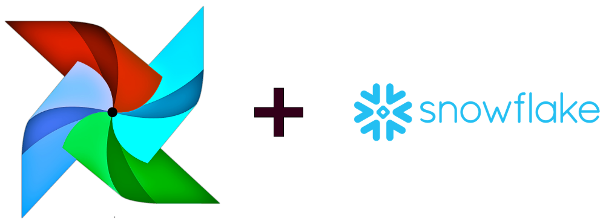
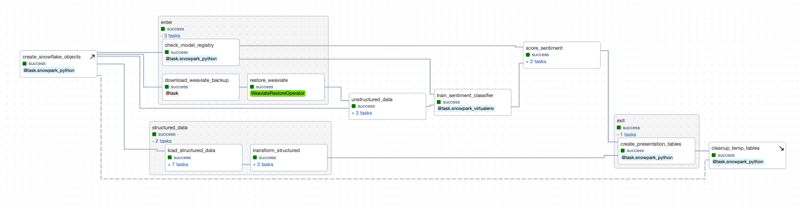
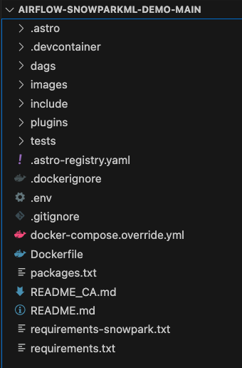
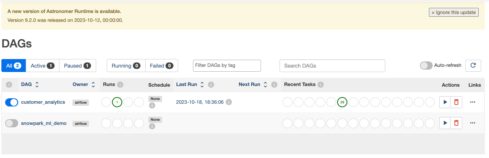
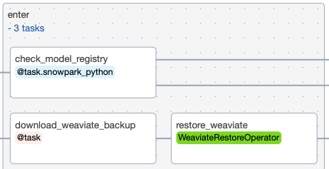
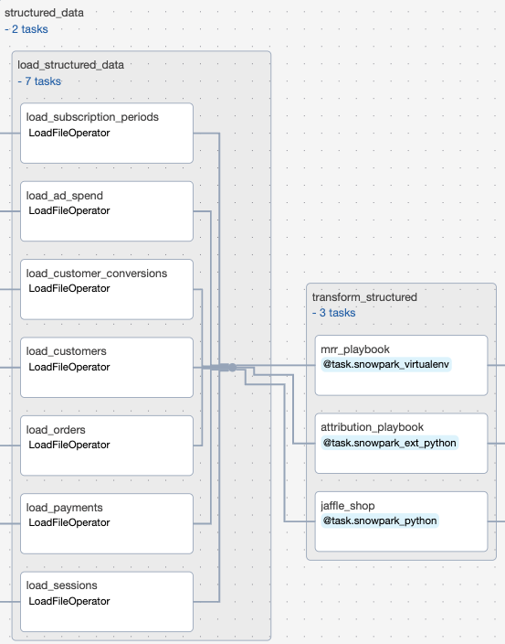
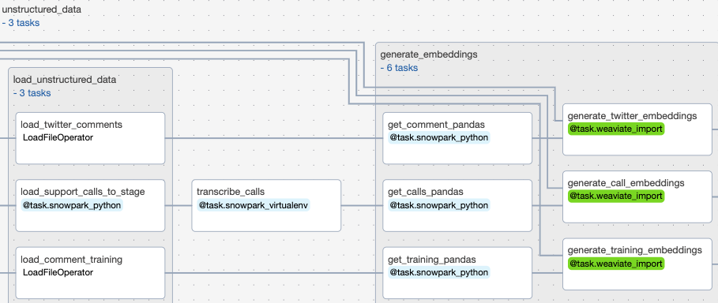
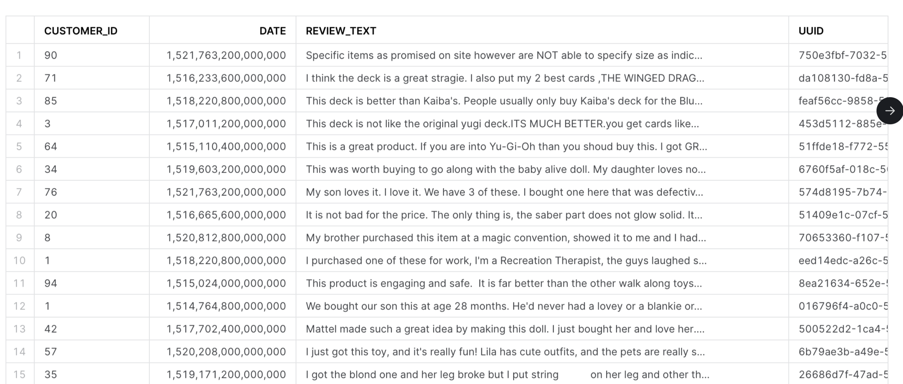
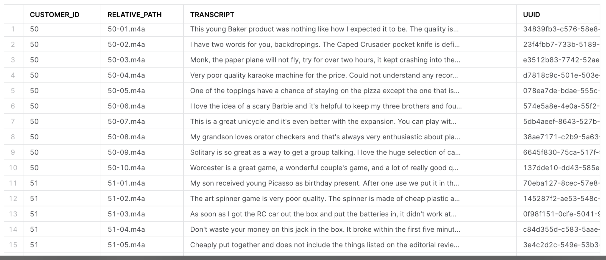

author: Michael Gregory, George Yates
id: ml_with_snowpark_and_apache_airflow
summary: This is a sample Snowflake Guide
categories: data-engineering,architecture-patterns,partner-integrations
environments: web
status: Development 
feedback link: https://github.com/Snowflake-Labs/sfguides/issues
tags: Data Engineering, Snowpark, Airflow, Machine Learning, AI


# Machine Learning with Snowpark and Apache Airflow
<!-- ------------------------ -->
## Overview  
Duration: 5



Snowpark ML (in public preview) is a Python framework for Machine Learning workloads with Snowpark. Currently Snowpark ML provides a model registry (storing ML tracking data and models in Snowflake tables and stages), feature engineering primitives similar to scikit-learn (ie. LabelEncoder, OneHotEncoder, etc.) and support for training and deploying certain model types as well as deployments as user-defined functions (UDFs).

This virtual hands-on lab demonstrates how to use [Apache Airflow](https://airflow.apache.org/) to orchestrate a machine learning pipeline leveraging Snowpark ML for feature engineering and model tracking. While Snowpark ML has its own support for models similar to scikit-learn this code demonstrates a "bring-your-own" model approach showing the use of open-source scikit-learn along with Snowpark ML model registry and model serving in an Airflow task rather than Snowpark UDF. It also shows the use of the Snowflake XCom backend which supports security and governance by serializing all task in/output to Snowflake tables and stages while storing in the Airflow XCom table a URI pointer to the data. 


This workflow includes:

- Sourcing structured, unstructured, and semistructured data from different systems
- Extracting, transforming, and loading with the Snowpark Python provider for Airflow
- Ingesting with Astronomer's Python SDK for Airflow
- Audio file transcription with OpenAI Whisper
- Natural language embeddings with OpenAI Embeddings and the Weaviate provider for Airflow
- Vector search with Weaviate
- Sentiment classification with LightGBM
- ML model management with Snowflake ML

Let’s get started. 

### Prerequisites
This guide assumes you have a basic working knowledge of Python, Airflow, and Snowflake

### What You’ll Learn 
- How to use Airflow to manage your Machine Learning Operations (MLOps)
- How to leverage Snowpark's compute for your Machine Learning workflows
- How to use Snowpark & Airflow together to create horizontally and vertically scalable ML pipelines

### What You’ll Need 
You will need the following things before beginning:

1. Snowflake
  1a. **A Snowflake Account.**
  1b. **A Snowflake User created with appropriate permissions.** This user will need sys/accountadmin level permissions to create and manipulate the necessary databases.
  1c. Follow [these instructions](https://docs.snowflake.com/en/developer-guide/udf/python/udf-python-packages#using-third-party-packages-from-anaconda) to enable Anaconda Packages in your trial account
2. GitHub
   2a. **A GitHub Account.** If you don’t already have a GitHub account you can create one for free. Visit the [Join GitHub](https://github.com/join) page to get started.
   2b. **Download the Project's GitHub Repository.** To do this workshop, you'll need to download the following Repo onto your local machine: https://github.com/astronomer/airflow-snowparkml-demo/tree/main
3. Integrated Development Environment (IDE)
  3a. **Your favorite IDE with Git integration.** If you don’t already have a favorite IDE that integrates with Git, open-source [Visual Studio Code](https://code.visualstudio.com/) is a good option.
4. Docker
  4a. **Docker Desktop on your laptop.**  We will be running Airflow as a container. Please install Docker Desktop on your desired OS by following the [Docker setup instructions](https://docs.docker.com/desktop/).
5. Astro CLI
  5a. **Astro CLI Installed**  We will be using the Astro CLI to easily create and run a local Airflow environment. Please install it on your local machine by following these [instructions](https://docs.astronomer.io/astro/cli/install-cli)
6. OpenAI API key
  6a. **Optional Step to Enable Chatbot Functionality** We have pre-embedded all the documents so an openai key is not needed for the ingestion process. However, if you want to run the Streamlit app at the end of the workshop, you will need the key to tokenize the search and questions.
    
### What You’ll Build 
- A Machine Learning Pipeline called "Customer Analytics" that predicts customer lifetime value based on customer sentiment



<!-- ------------------------ -->
## Environment Setup and Repo Overview
Duration: 2

First, Clone [this repository](https://github.com/astronomer/airflow-snowparkml-demo/tree/main) and navigate into its directory in terminal, before opening the folder up in the code editor of your choice. 

```
git clone https://github.com/astronomer/airflow-snowparkml-demo/
cd airflow-snowparkml-demo
```

After you've downloaded the repo, open the `airflow-snowparkml-demo` folder in the IDE of your choice! The folder structure should look like the below:



Since we're using so many different tools installed via the requirements/packages files, it's worth going through them so you understand the systems being used in the 'Customer Analytics' DAG.

Repository Contents Overview:

`Requirements.txt`

`/tmp/airflow_provider_weaviate-1.0.0-py3-none-any.whl`: This beta package allows us to connect to Weaviate for embedding generation. 

`/tmp/astro_provider_snowflake-0.0.0-py3-none-any.whl`: This beta package allows us to connect to Snowpark.  

`snowflake-ml-python==1.0.7`: A package that provides machine learning functionalities or integrations for Snowflake within Python.

`pandas~=1.5`: A powerful and flexible open-source data analysis and manipulation library for Python.

`scikit-learn==1.3.0`: A machine learning library in Python that provides simple and efficient tools for data analysis and modeling.

We will also show how to use a Python virtual environment to simplify Snowpark requirements if that is necessary in your Airflow environment.  For that we will create a `requirements-snowpark.txt` file with the following libraries: 

`psycopg2-binary`: A standalone package that provides a PostgreSQL adapter.

`snowflake_snowpark_python[pandas]>=1.5.1`: An extension of the Snowflake Python Connector that provides an intuitive, pythonic API for querying and processing data in Snowflake. 

`/tmp/astro_provider_snowflake-0.0.0-py3-none-any.whl`: This beta provider simplifies the process of making secure connections to Snowflake, the process of building Airflow tasks with Snowpark code and the passing of Snowpark dataframes between tasks. 

`virtualenv`: A tool in Python used to create isolated Python virtual environments, which we’ll need to create a 3.8 Python virtual environment to connect to Snowpark.


`Packages.txt`

`Build-essential`: A collection of essential development tools, including the GNU Compiler Collection (GCC), the GNU Debugger (GDB), and other libraries and tools. It is required to compile and install many other software packages, including FFmpeg.

`ffmpeg`: A free and open-source software project consisting of a suite of libraries and programs for handling video, audio, and other multimedia files and streams. We’ll use this to transcribe support calls with OpenAI Whisper.

`docker-compose.override.yml`

This file is allowing us to build a local weaviate vector database using Docker on `port:8081` alongside our Airflow environment, which we'll use to store our unstructured data embeddings for efficient sentiment analysis. This method can be used to spin up many different services for easier local testing, like streamlit to visualize your data, or Minio for mimicking an S3-like filesystem. 


Step 2: 

Navigate to the `.env` file and update the `AIRFLOW_CONN_SNOWFLAKE_DEFAULT` with your own credentials. These will be used to connect to Snowflake. The Snowflake account field of the connection should use the new `ORG_NAME-ACCOUNT_NAME` format as per Snowflake Account Identifier policies. The `ORG` and `ACCOUNT` names can be found in the confirmation email or in the Snowflake login link (ie. https://xxxxxxx-yyy11111.snowflakecomputing.com/console/login) Do not specify a region when using this format for accounts. If you need help finding your `ORG_NAME-ACCOUNT_NAME`, use [this guide](https://docs.snowflake.com/en/user-guide/admin-account-identifier)


NOTE: Database and Schema names should remain as `DEMO`, and the warehouse name should remain `COMPUTE_WH`. This is because the Customer_Analytics DAG will create tables with these names and reference them throughout the DAG, so if you use different names you'll need to alter the DAG code to reflect them. 

`AIRFLOW_CONN_SNOWFLAKE_DEFAULT='{"conn_type": "snowflake", "login": "<USER_NAME>", "password": "<PASSWORD>", "schema": "DEMO", "extra": {"account": "<ORG_NAME>-<ACCOUNT_NAME>", "warehouse": "COMPUTE_WH", "database": "DEMO", "region": "", "role": "ACCOUNTADMIN", "authenticator": "snowflake", "session_parameters": null, "application": "AIRFLOW"}}'`

NOTE: The use of `ACCOUNTADMIN` in this demo is only to simplify setup of the quickstart. It is, of course, not advisable to use this role for production.

<!-- ------------------------ -->
## Start Environment and Run DAG

Now that you've gotten your environment set up, open up a terminal window in your `airflow-snowparkml-demo` folder and run the following command: 

```
astro dev start
```

This will build our local Airflow environment using the Docker engine and the Astro CLI. After your Airflow environment has finished starting up, open up the UI by navigating to `localhost:8080` in the browser and use admin/admin as the username/password to login. 

After you've opened the UI, unpause the `customer_analytics` DAG and press the play icon to start it.



This DAG demonstrates an end-to-end application workflow to generate predictions on customer data using OpenAI embeddings with a Weaviate vector database as well as Snowpark decorators, the Snowflake XCom backend and the Snowpark ML model registry. The Astro CLI can easily be adapted to include additional Docker-based services, as we did here to include services for Minio, Weaviate and streamlit.

<!-- ------------------------ -->
## DAG Explanation


Task `create_snowflake_objects`:
Our first task creates Snowflake objects (databases, schemas, stages, etc.) prior to 
running any tasks, since we are assuming you are starting with a fresh trial account. This is implemented using the new setup/teardown task feature, and has a corresponding clean up task at the end of the DAG. This means that no matter what, temp tables used for this project will be deleted after usage to prevent unnecessary consumption, mimicking how you might use them in a production setting. It also adds a handy dotted line to link the two tasks in the Airflow UI, which you can see in the above screenshot. 
 
The DAG then runs the `enter` task group, which includes 3 tasks to set up a Weaviate database, and create a Snowpark model registry if none exists already:



Task `download_weaviate_backup`: 
In order to speed up the demo process, the data has already been ingested into Weaviate and vectorized. The data was then backed up and stored in the cloud for easy restore. This task will download the backup .zip and make it available in a docker mounted filesystem for the restore_weaviate task.

Task `restore_weaviate`: 
This task exists to speedup the demo in subsequent runs. By restoring prefetched embeddings to Weaviate the later tasks will skip embeddings and only make calls to OpenAI for data it hasn't yet embedded.

Task `check_model_registry`:
This task checks if a Snowpark model registry exists in the specified database and schema. If not, it creates one and returns a dictionary containing the database and schema information.

The second task group `structured_data` uses several dynamically generated task groups to load many structured datasets into our Snowflake database, before transforming them using snowpark, all in parallel. 



Task Group `load_structured_data`:
This task group creates parallel tasks to upload many structured datasets from an Astronomer hosted S3 bucket into our Snowflake database. 

Task Group `transform_structured`: 
This task group uses Snowpark python to transform the structured data to get them in the proper format for the presentation layer and joining with prediction on the unstructured data and the sentiment classifier. 

Our third task group, `unstructured data`, runs in parallel with the `structured data` task group to load unstructured call and twitter comment data to a Snowflake stage, before transcribing those calls and generating embeddings from this data. These embeddings are information dense representations of the semantic meaning of all of this text data, which are used for text search, text similarity, and other natural language processing tasks. 



The following 3 tasks are grouped into a Task group called `load_unstructured_data`

Task `load_support_calls_to_stage`:
This task creates or replaces staging table within Snowflake, and then uses Snowpark python to extract call data and load it into that staging table. This stage is a directory table which means that we can query the structure like any other table.

Task `load_twitter_comments`: 
This task uses the Astro SDK Load File operator to load a parquet file of twitter comments into a table called STG_TWITTER_COMMENTS. 

Task `load_comment_training`: 
This task loads a comment training parquet file into a Snowflake table called STG_COMMENT_TRAINING

Task `transcribe_calls`: 
This task uses Snowpark to transcribe the raw support calls we uploaded to the directory table previously. We will query the file location (URI) and use that to read the file and transcribe the audio with OpenAI Whipser

Task Group `generate_embeddings`:
This task group generates embeddings for our training comment data, twitter comment data, and for our transcribed support call data. These embeddings are generated as part of importing them into the Weaviate vector database. 

Task `train_sentiment_classifier`:
After all our structured and unstructured data has been extracted, transformed/transcribed, and loaded, we then use it to train our sentiment classifier model in Snowpark.  The embedding vectors in Weaviate along with a sentiment-labeled dataset allow us to train a very simple classifier.  While model tuning and optimization are outside the scope of this demo those steps could also be performed in parallel tasks. After we’ve trained our model, we’ll then register it into our Snowflake model registry so that we can use it to generate sentiment predictions. One of the biggest advantages of this approach is that we can run our model on the data within Snowpark. It is not necessary to extract the data to cloud object storage for inference.  Instead we can read directly from Snowflake during inference.  Alternatively, SnowparkML allows users to easily create user-defined functions with the Taskflow api.

Task Group `score_sentiment`:
After we’ve trained our sentiment classifier, we can then use it to evaluate the sentiment of our twitter comments and transcribed support calls. Again, we’ll do this within Snowpark so we can run this model on our Snowflake data without needing to make a copy in cloud storage. We’ll then save the prediction results and return them as tables so that we can use them to generate visual reports next. 

Task `create_presentation_tables`: 
Now that we’ve got our sentiment analysis model predictions generated, this task uses Snowpark to take those raw predictions and organize them into a human readable table for reporting. 

Task `cleanup_temp_tables`: 
For our final task, we’ll clear all the temporary tables we used during data processing using a teardown task. Using a tear-down task means that all your temp tables will be deleted even if upstream tasks have failed. This avoids the situation where you'll have table fragments persist after failed model runs because their failure stopped a clean-up task from triggering. 

<!-- ------------------------ -->
## Monitoring Results

After your pipeline has finished running, go into the grid view and check that all tasks ran successfully. Then, go into your Snowflake environment and check the newly created `PRED_CUSTOMER_CALLS` and `PRED_TWITTER_COMMENTS` to see the finished result of your model training. They should look like the examples below:





### View Streamlit Dashboard
We can now view our analyzed data on a [Streamlit](https://streamlit.io/) dashboard. To do this, go to terminal and enter the following bash command to connect into the Airflow webserver container.  

```bash
astro dev bash -w
```

Then, run the following command to start a streamlit application. 
```bash
cd include/streamlit/src
python -m streamlit run ./streamlit_app.py
```

After you've done so, you can view your data dashboard by navigating to http://localhost:8501/ in your browser! The Question Answering interface in the Customer Analytics dashboard uses the Weaviate Q&A module which has integrations with LLM providers like OpenAI.  The Q&A module (https://weaviate.io/developers/weaviate/modules/reader-generator-modules/qna-openai) accepts a question and uses OpenAI embeddings to vectorize the question (https://weaviate.io/developers/weaviate/modules/retriever-vectorizer-modules/text2vec-openai).  The question vector is then compared against all documents' (tweets, transcripts, etc.) vectors in the vector database using cosine similarity (https://weaviate.io/developers/weaviate/search/similarity).  The resulting documents are provided as search results.  Because this is not a text search you can ask a question like "Who does Thomas like best?" and it will provide related tweets that talk about Thomas and Bertie as best friends.

One could also easily add generative search to the dashboard.  The generative search (https://weaviate.io/developers/weaviate/modules/reader-generator-modules/generative-openai) module accepts a question and uses OpenAI embeddings to vectorize the question (https://weaviate.io/developers/weaviate/modules/retriever-vectorizer-modules/text2vec-openai).  The question vector is then compared against all documents' vectors in the vector database using cosine similarity (https://weaviate.io/developers/weaviate/search/similarity).  The resulting documents related to the question are then used as context for a generated answer.  The question along with contextual documents are fed to ChatGPT with instructions to answer the question with the provided context.

For an example of generative search see https://github.com/astronomer/ask-astro/blob/0ad255e8084dcba5d55a4019f24efc31541e9959/airflow/include/streamlit/streamlit_app.py#L132
