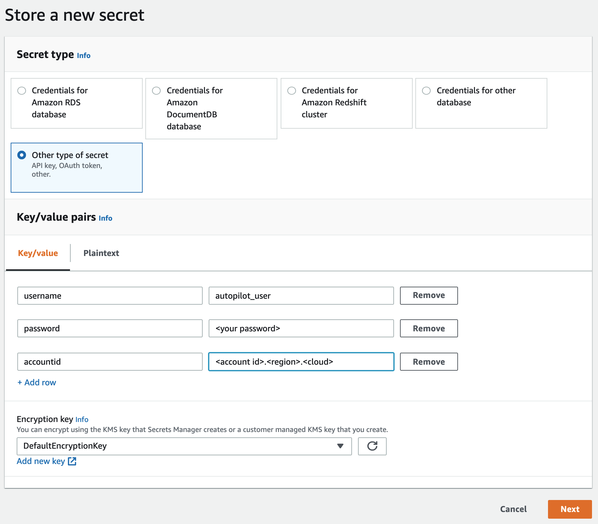
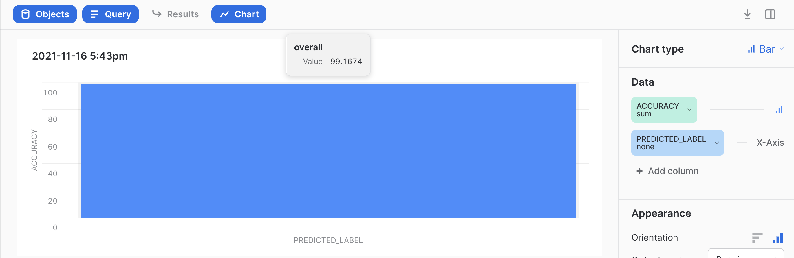
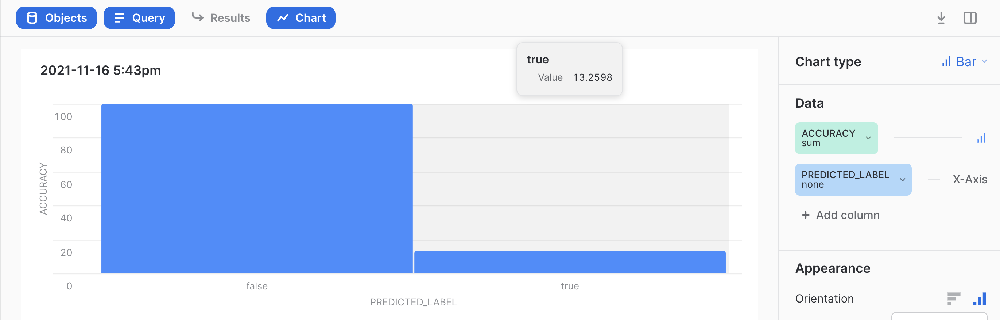
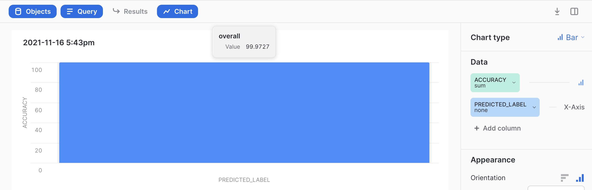
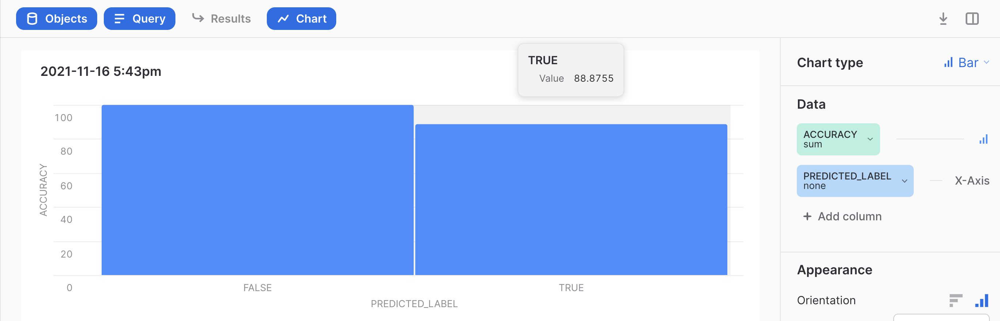

summary: Snowflake and Amazon SageMaker Autopilot Integration: Machine Learning with SQL
id: machine_learning_with_aws_autopilot 
categories: Getting Started
environments: web
status: Published 
feedback link: https://github.com/Snowflake-Labs/sfguides/issues
tags: Getting Started, Data Science, Machine Learning 
authors: Snowflake

# The Snowflake/AWS Autopilot Integration: Machine Learning in SQL


<!-- ------------------------ -->
## Overview 
Duration: 1


Taking advantage of ML technology usually requires a lot of infrastructure, a multitude of software packages and a small army of highly-skilled engineers building, configuring, and maintaining the complex environment. But what if you could take advantage of machine learning capabilities using SQL from end to end? Imagine if you or your analysts could build models and score datasets at scale without having to learn a new language (such as scala or python), without having to provision and manage infrastructure on prem or in a public cloud, and without the overhead of maintaining additional software packages (such as [scikit-learn](https://scikit-learn.org/), [TensorFlow](https://www.tensorflow.org/), [PyTorch](https://pytorch.org/), …). How could that impact the bottom line of your business? 

The Snowflake and Amazon SageMaker Autopilot integration is exactly that. It combines the power of Snowflake to process data at scale with the managed AutoML features in SageMaker Autopilot.

In this quickstart we will explore an end-to-end example of building a scalable process from data ingestion to scoring millions of data points in seconds using nothing but SQL. Before we get started, we will perform a onetime setup that is completely script driven and only takes 3 simple steps. If you have already completed the setup and are for the ML part of this guide, just skip over the setup steps and start with section “Snowflake/Autopilot Integration”.


<!-- ------------------------ -->
## Prerequisites 
Duration: 1

You need access to an AWS and a Snowflake account. If you do not already have access, follow the links for a [free AWS](https://aws.amazon.com/free/) and a [free Snowflake](https://signup.snowflake.com/) account.

Next, clone the project's github repo. It includes all artifacts needed to create the AWS and Snowflake resources as well as the dataset we are going to analyze.

```
cd ~
mkdir github
cd ~/github 
git clone https://github.com/Snowflake-Labs/sfguide-aws-autopilot-integration.git

```

You also need Snowflake's command line interface (CLI). If Snowsql isn't already installed on your machine, please follow these [instructions](https://docs.snowflake.com/en/user-guide/snowsql.html).

<!-- ------------------------ -->
## Use Case
Duration: 2

The dataset we will explore is the [Synthetic Financial Datasets For Fraud Detection](https://www.kaggle.com/ealaxi/paysim1) on [kaggle](https://www.kaggle.com).

The dataset represents a synthetic set of credit card transactions. Some of those transactions have been labeled as fraudulent, but most of them are not fraudulent. In fact, if you review the documentation on Kaggle, you will find that 99.9% of the transactions are non-fraudulent.

The goal of this exercise is to build an ML model that accurately predicts both transaction types, i.e. fraudulent as well as non-fraudulent transactions. After all, who wants to be sitting in a restaurant after a fantastic dinner and be totally embarrassed by their credit card being declined because the credit card company's transaction model hit a false positive and declined your transaction.

<!-- ------------------------ -->
## Setup
Duration: 10

Building a hands-on environment that will allow you to build and score the Model in your environment is very straightforward. It requires 3 simple, script-driven steps.

1. Snowflake configuration: Run script setup.sql from your Snowflake console.
1. Credentials configuration: Configure credentials in AWS Secrets Manager from the AWS console.
1. Integration configuration: Run the CouldFormation script from the AWS console.

Pro tip: Alternatively,you could run all steps from CLI commands.

### Snowflake configuration

Connect to your snowflake instance by opening a browser and connecting to [app.snowflake.com](https://app.snowflake.com).

Provide your login credentials or click "Sign up" to create a free account. 

Next, click "Worksheet" .

This opens up a new Worksheet. All SQL statements in the post can be loaded from the [scripts](https://github.com/Snowflake-Labs/sfguide-aws-autopilot-integration/tree/main/scripts) directory in the [github repo](https://github.com/Snowflake-Labs/sfguide-aws-autopilot-integration). Copy and paste the content of [setup.sql](https://github.com/Snowflake-Labs/sfguide-aws-autopilot-integration/blob/main/scripts/setup.sql).

Click the little triangle next to the worksheet name, give it a meaningful name (i called it autopilot_setup), click "Import SQL from File", and find the file scripts/setup.sql in your cloned repo.

The  script creates a login, which we will use later to perform all steps executed in Snowflake, and a database and schema which holds all objects, i.e. tables, external functions, and JavaScript functions. Please note, that by creating a new user (and role), we don’t have to use ACCOUNTADMIN to run all subsequent steps in this demo. Be sure to update the password, first name, last name, and email address before you run it.

```
use role accountadmin;
create role autopilot_role;
grant create integration
 on account
 to role autopilot_role;
 
create database autopilot_db;
grant usage on database autopilot_db
 to role autopilot_role;
 
create schema demo;
grant ownership
 on schema autopilot_db.demo
 to role autopilot_role;
 
create warehouse autopilot_wh
 with warehouse_size = 'medium';
grant modify,monitor,usage,operate 
 on warehouse autopilot_wh
 to role autopilot_role; 
 
create user autopilot_user
 -- change the value for password in the line below
 password = '<password>'
 login_name = 'autopilot_user'
 display_name = 'autopilot_user' 
 -- update the values for first/last name in he lines below
 first_name = '<first name>'
 last_name = '<last name>'
 email = '<your email address>'
 default_role = autopilot_role
 default_warehouse = autopilot_wh
 default_namespace = autopilot_db
 must_change_password = false; 
grant role autopilot_role
 to user autopilot_user;
 
select current_account(),current_region();
```

### Credentials configuration

The instructions to build all other resources, i.e. API Gateway, S3 bucket, and all Snowflake external and JavaScript functions will be created via an AWS Cloud formation script. Sensitive information like login, password, and fully qualified account ID will be stored using the AWS Secrets Manager.

To get started, log into your AWS account and search for Secrets Manager in the Search box in the AWS Console.

In the Secrets Manager UI, create the three key/value pairs below. Be sure to configure the fully qualified account ID (including region and cloud).

<p align="center"></p>

Give your **secret** configuration a name and save it.

Next, find your **secrets** configuration again (the easiest way is to search for it via the Search input field), and copy the Secret ARN. We will need it in the next step when configuring the CloudFormation script.

### Integration Configuration (CloudFormation)

The last step is to configure the Snowflake/Autopilot Integration. This used to be a very time-consuming and error-prone process but with AWS CloudFormation it's a piece of cake.

Start with downloading the [CloudFormation script](https://github.com/aws-samples/amazon-sagemaker-integration-with-snowflake/blob/main/customer-stack/customer-stack.yml).

Click the "Raw" button. This opens a new browser window. "Double click" and click "Save As".

For the purpose of this demo we are assuming that you have root access to the AWS console. In case you do not have root access, please ask your AWS admin to run these steps or to create a role based on the permissions listed in policies.zip.

Log in to your AWS console and select the CloudFormation service.

Then, click the “Create Stack” button at the top right corner.

"Template is ready" should be selected by default. Click "Upload a template file" and select the template file you just downloaded.

The next screen allows you to enter the stack details for your environment. These are:

- Stack name
- apiGatewayName
- s3BucketName
- database name and schema name
- role to be used for creating the Snowflake objects (external functions and JS function)
- Secrets ARN (from above)

Be sure to pick consistent names because the AWS resources must be unique in your environment.

<p align="center"></p>

Go with the defaults on the next two screens, so click “Next” twice.

Click the “Acknowledge” checkbox and continue with “Create Stack”.

You can follow the “stack creation” by clicking the “Refresh” button. Eventually, you should see “CREATE_COMPLETE”.

Creating the stack should take about one minute. At this point, the integration has been completely set up and we can head over to Snowflake to start with the data engineering steps.


<!-- ------------------------ -->
## Snowflake/Autopilot Integration
Duration: 20

To follow best practices, we will not use the ACCOUNTADMIN role to run the steps for this demo. Therefore, log in into Snowflake with user autopilot_user. The password should be in your setup scripts.


The demo consists of 4 major steps:

1. Data engineering (import dataset and simple data prep)
2. Build initial model
3. Score test dataset and evaluate model
4. Optimize model (including hyperparameter tuning)

All SQL statements for this demo are included in [demo.sql](https://github.com/Snowflake-Labs/sfguide-aws-autopilot-integration/blob/main/scripts/demo.sql). Open another Worksheet and copy and paste the content or import the file from your local repo.

### Data Engineering

To make it easier to import the dataset into your Snowflake instance, (the dataset is stored as a zip file on Kaggle), I have included the dataset in the github repo, split into 4 gzipped files. Importing the dataset directly into a Snowflake table is very simple. But before we can load the dataset, we first have to create a table and define a file format to use during the loading process.

```
use role autopilot_role;
use database autopilot_db;
use schema demo;
use warehouse autopilot_wh;
create or replace table cc_dataset (
 step number(38,0),
 type varchar(16777216),
 amount number(38,2),
 nameorig varchar(16777216),
 oldbalanceorg number(38,2),
 newbalanceorig number(38,2),
 namedest varchar(16777216),
 oldbalancedest number(38,2),
 newbalancedest number(38,2),
 isfraud boolean,
 isflaggedfraud boolean
) ;
create file format cc_file_format type=csv  skip_header=1;
```

Next, head over to to a terminal session and use snowsql to upload the data files to an internal stage.

```
cd ~/github/sfguide-aws-autopilot-integration/data
snowsql -a <accountid> -u autopilot_user -s demo -q "put file://*.gz @~/autopilot/"
```

Then come back to you Snowflake session and run the copy command to copy the staged data files into the table you had created above.

```
copy into cc_dataset from @~/autopilot file_format=cc_file_format;
```

Let’s briefly review the dataset.

```
select * from cc_dataset;
```

The dataset includes  about 6.3 million credit card transaction and has a variety of different attributes.The attribute we want to predict is called "isfraud" of datatype boolean. 

Let’s review the data distribution of the “isfraud” attribute.

```
select isfraud, count(*) from cc_dataset group by isfraud;
```

As you can see, there is a massive class imbalance in the “isfraud” attribute. In this dataset we have 99.9% non-fraudulent transactions and a very small number of transactions have been classified as fraudulent.

Usually the next step would be data preparation and feature engineering. For this demo we will skip this step. If you want to learn more about data preparation and feature generation, please refer to the links at the end of this post.

The only step left in terms of data engineering is to split the dataset into a training and a test dataset. For this demo we will go with a 50/50 split. In Snowflake SQL, this can be accomplished very easily with these two statements:

```
create or replace table cc_dataset_train as
   select * from cc_dataset sample (50);
create or replace table cc_dataset_test as
   (select * from cc_dataset ) minus 
   (select * from cc_dataset_train) ;
```

For good measure, let’s check the split and that we have a reasonable number of each class value in our test and training tables.

```
(select 'cc_dataset_train' name, isfraud, count(*) 
 from cc_dataset_train group by isfraud) 
union
(select 'cc_dataset_test' name, isfraud, count(*) 
 from cc_dataset_test group by isfraud)
```

As you can see (your numbers might be slightly different), we have an almost perfect 50/50 split with nearly 50% of the fraud cases in either dataset. Of course, in a real world usecase we would take a much closer look at all attributes to ensure that we haven’t introduced bias unintentionally.

### Building the Model

This is where the “rubber meets the road” and where we would usually switch to a different programming environment like Python or Scala, and use different ML packages, like Scikit-Learn, PyTorch, TensorFlow, MLlib, H20 Sparkling Water, the list goes on and on. However, with the Snowflake integration to AWS Autopilot we can initiate the model building process directly from within your Snowflake session using regular SQL syntax and AWS Autopilot does the rest.

```
select aws_autopilot_create_model (
  'cc-fraud-prediction-dev'  -- model name
  ,'cc_dataset_train'        -- training data location
  ,'isfraud'                 -- target column
  ,null                      -- objective metric
  ,null                      -- problem type
  ,5                         -- number of candidates to be evaluated
                             --    via hyperparameter tuning 
  ,15*60*60                  -- training timeout
  ,'True'                    -- create scoring endpoint yes/no
  ,1*60*60                   -- endpoint TTL
);
```

Let’s review the SQL statement above. It calls a function that accepts a few parameters. Without going into too much detail (most parameters are pretty self-explanatory), here are the important ones to note:

- Model Name: This is the name of the model to be created. The name must be unique. There is no programmatic way to delete a model.ng If you want to rebuild a model, append a sequential number to the base name to keep the name unique.
- Training Data Location: This is the name of the table storing the data used to train the model.
- Target Column: This is the name of the column in the training table we want to predict.


To check the current status of the model build process we call another function in the Snowflake/AWS Autopilot integration package.

```
select aws_autopilot_describe_model('cc-fraud-prediction-dev');
```

When you call the aws_autopilot_describe_model() function repeatedly you will find that the model build process goes through several state transitions.

Building the model should take about 1 hour and eventually you should see “JobStatus=Completed” when you call the aws_autopilot_describe_model() function.

And that’s it. That’s all we had to do to build a model from an arbitrary dataset. Just pick your dataset to train the model with, the attribute you want to predict, and start the process. Everything else, from building the infrastructure needed to train the model, to picking the right algorithm for training the model, and tuning hyperparameters for optimizing the accuracy, is all done automatically.

### Testing the Model

Now, let’s check how well our model achieves the goal of predicting fraud. For that, we need to score the test dataset. The scoring function takes 2 parameters:

- Endpoint Name: This is the name of the API endpoint. The model training process has a parameter controlling whether or not an endpoint is created and if so, what its TTL (time to live) is. By default the endpoint name is the same name as the model name.
- Attributes: This is an array of all attributes used during the model training process. 

        create or replace table cc_dataset_prediction_result as 
          select isfraud,(parse_json(
              aws_autopilot_predict_outcome(
                'cc-fraud-prediction-dev'
                ,array_construct(
                   step,type,amount,nameorig,oldbalanceorg,newbalanceorig
                   ,namedest,oldbalancedest,newbalancedest,isflaggedfraud))
            ):"predicted_label")::varchar predicted_label
          from cc_dataset_train;

 


If you get an error message saying “Could not find endpoint” when calling the aws_autopilot_predict_outcome() function, it might mean that even though the endpoint had been created during the model training process, it has expired.

To check the endpoint, call aws_autopilot_describe_endpoint(). You will get an error message if the endpoint doesn’t exist.

```

select aws_autopilot_describe_endpoint('cc-fraud-prediction-dev');

```

To restart the endpoint call the function aws_autopilot_create_endpoint() which takes 3 parameters.

- Endpoint Name: By default, the function aws_autopilot_create_endpoint() creates an endpoint with the same name as the model name. But you can use any name you like, for instance to create a different endpoint for a different purpose, like development or production.
- Endpoint configuration name: By default, the function aws_autopilot_create_endpoint() creates an endpoint configuration named "model_name"-m5–4xl-2. This name follows a naming convention like "model name"-"instance type"-"number of instances". This means that the default endpoint is made up of two m5.4xlarge EC2 instances.
- TTL: TTL means “time to live”. This is the amount of time the endpoint will be active. For TTL, it does not matter whether or not the endpoint is used. If you know that you no longer need the endpoint, it is cost effective to delete the endpoint by calling aws_autopilot_delete_endpoint(). Remember, if necessary, you can always re-create the endpoint by calling aws_autopilot_create_endpoint().


        select aws_autopilot_create_endpoint (
            'cc-fraud-prediction-dev' 
            ,'cc-fraud-prediction-dev-m5-4xl-2' 
            ,1*60*60);


This is an asynchronous function, meaning it completes immediately but we have to check with function aws_autopilot_descrive_endpoint() until the endpoint is ready.

After having validated that the endpoint is running, and scoring the test dataset with the statement above, we are ready to compute the accuracy of our model. To do so we count all occurrences for each of the 4 combinations between the actual and the predicted value. An easy way to do that is to use an aggregation query grouping by those 2 attributes.

```
select isfraud, predicted_label, count(*)
from cc_dataset_prediction_result
group by isfraud, predicted_label
order by isfraud, predicted_label;
```

To compute the overall accuracy, we then add up the correctly predicted values and divide by the total number of observations. Your numbers might be slightly different but the overall accuracy will be in the 99% range.

```
select 'overall' predicted_label
        ,sum(iff(isfraud = predicted_label,1,0)) correct_predictions
        ,count(*) total_predictions
        ,(correct_predictions/total_predictions)*100 accuracy
from cc_dataset_prediction_result;
```

<p align="center"></p>

Pretty good, right? Next, let’s drill down and review the accuracy for each of the predicted classes: not fraudulent (majority class) and fraudulent (minority class).

```
select predicted_label
        ,sum(iff(isfraud = predicted_label,1,0)) correct_predictions
        ,count(*) total_predictions
        ,(correct_predictions/total_predictions)*100 accuracy
from cc_dataset_prediction_result
group by predicted_label;
```

<p align="center"></p>

And that’s where our model shows some problems. Although the majority class is in the 99.99% range, the minority class has a very high rate of false positives. This means that if our model predicts a fraudulent transaction it will be wrong 4 times out of 5. In a practical application, this model would be useless.

So what’s the problem? The main reason for this poor performance is that accurately identifying the minority class in a massively imbalanced class distribution is very difficult for ML algorithms. Though it’s not impossible, it requires hundreds of experiments while tuning different parameters.

So what can we do to fix it, you ask? That’s where AutoML systems like Autopilot really shine. Instead of having to manually modify the different parameters, Autopilot will automatically pick reasonable values for each parameter, combine them with parameter sets, compute a model for each parameter set, and evaluate the accuracy. Finally, Autopilot will pick the best model based on accuracy, and will build an endpoint that is ready to use.

### Optimize the Model

To get a much more accurate model, we can use the defaults for the function aws_autopilot_create_model(). Instead of supplying 9 parameters, we only supply the first three parameters. The Snowflake integration with Autopilot automatically picks default values for all of the other parameters. The main difference is that the default number of candidates is 250 instead of 5 as configured before.

```
select aws_autopilot_create_model (
  'cc-fraud-prediction-prd' -- model name
  ,'cc_dataset_train'         -- training data table name
  ,'isfraud'                  -- target column
);
```

This process will take considerably longer. To check the status run the aws_autopilot_describe_model.

```
select aws_autopilot_describe_model('cc-fraud-prediction-prd');
```

Like you did before, run the scoring function after the model has been built. Check the status periodically using the function aws_autopilot_describe_model(). Re-create the endpoint if it doesn’t exist using the function aws_autopilot_create_endpoint().

Finally, score the test dataset using aws_autopilot_predict_outcome() and route the output into a different results table.

```
create or replace table cc_dataset_prediction_result_prd as 
  select isfraud,(parse_json(
      aws_autopilot_predict_outcome(
        'cc-fraud-prediction-prd'
        ,array_construct(
           step,type,amount,nameorig,oldbalanceorg,newbalanceorig
           ,namedest,oldbalancedest,newbalancedest,isflaggedfraud))
    ):"predicted_label")::varchar predicted_label
  from cc_dataset_train;
```

Then count the observations again by actual and predicted value.

```
select isfraud, predicted_label, count(*)
from cc_dataset_prediction_result_prd
group by isfraud, predicted_label
order by isfraud, predicted_label;
```

The overall accuracy is still in the upper 99% range and that is good.

```
select 'overall' predicted_label
        ,sum(iff(isfraud = predicted_label,1,0)) correct_predictions
        ,count(*) total_predictions
        ,(correct_predictions/total_predictions)*100 accuracy
from cc_dataset_prediction_result_prd;
```

<p align="center"></p>

However, Autopilot shows its real power when we review the per class accuracy. It has improved from 13.3% to a whopping 88.88%.

```
select predicted_label
        ,sum(iff(isfraud = predicted_label,1,0)) correct_predictions
        ,count(*) total_predictions
        ,(correct_predictions/total_predictions)*100 accuracy
from cc_dataset_prediction_result_prd
group by predicted_label;
```

<p align="center"></p>

With these results, there is just one obvious question left to answer. Why wouldn’t we always let the Snowflake integration pick all parameters? The main reason is the time it takes to create the model with default parameters. In this particular example it takes 9 hours to produce an optimal model. So if you just want to test the end-to-end process, you may want to ask Autopilot to evaluate only a handful of candidate models. However, when you want to get a model with the best accuracy, go with the defaults. Autopilot will then evaluate 250 candidates.

<!-- ------------------------ -->
## Conclusion
Duration: 1

Having managed ML capabilities directly in the Snowflake Data Cloud opens up the world of machine learning for data engineers, data analysts, and data scientists who are primarily working in a more SQL-centric environment. Not only can you take advantage of all the benefits of the Snowflake Data Cloud but now you can add full ML capabilities (model building and scoring) from the same interface. As you have seen in this article, AutoML makes ML via SQL extremely powerful and easy to use.