summary: Machine learning on unstructured data with Saturn Cloud and Snowflake
id: machine_learning_with_saturncloud
categories: data-science-&-ml,data-engineering,partner-integrations
environments: Web
status: Published
feedback link: https://github.com/Snowflake-Labs/devlabs/issues
tags: Machine Learning, Computer Vision

# Machine Learning on Unstructured Data with Saturn Cloud and Snowflake

## Image Classification Problems 

Duration: 0:04:00


Welcome! While many machine learning tasks work well with tabular data, data scientists in many industries and sectors need to model other types of data, such as images and videos, to achieve business goals. 

Snowflake offers data structures that allow you to use these kinds of data and interact with them seamlessly, and in this guide you'll learn how to integrate this Snowflake offering with Saturn Cloud, a data science and machine learning platform for scalable Python. Through Saturn Cloud, you can get one-click access to compute resources for machine learning, including GPUs. Saturn Cloud also supports Dask, the Python framework for distributed computing which lets you run machine learning at scale.

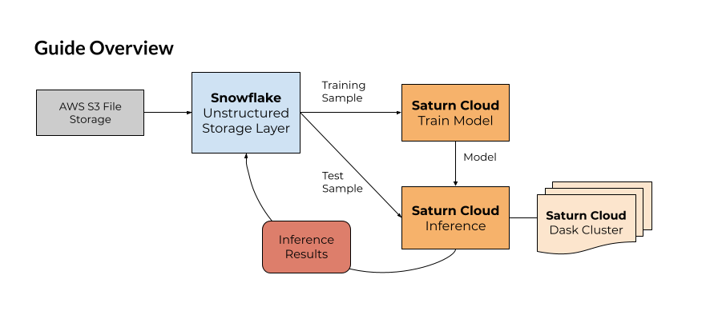


We'll approach this guide from the perspective of a data scientist tasked with creating a model to identify images from a set of 10 classes. Our data here will be showing garments of 10 different kinds. The technique can be easily adapted to other kinds of image classification problem, which is increasingly useful in business.


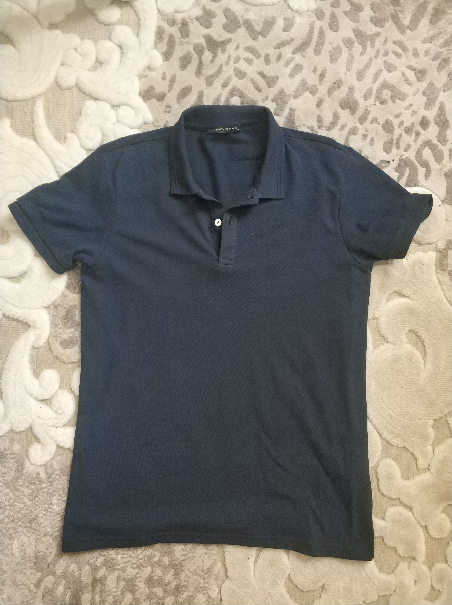
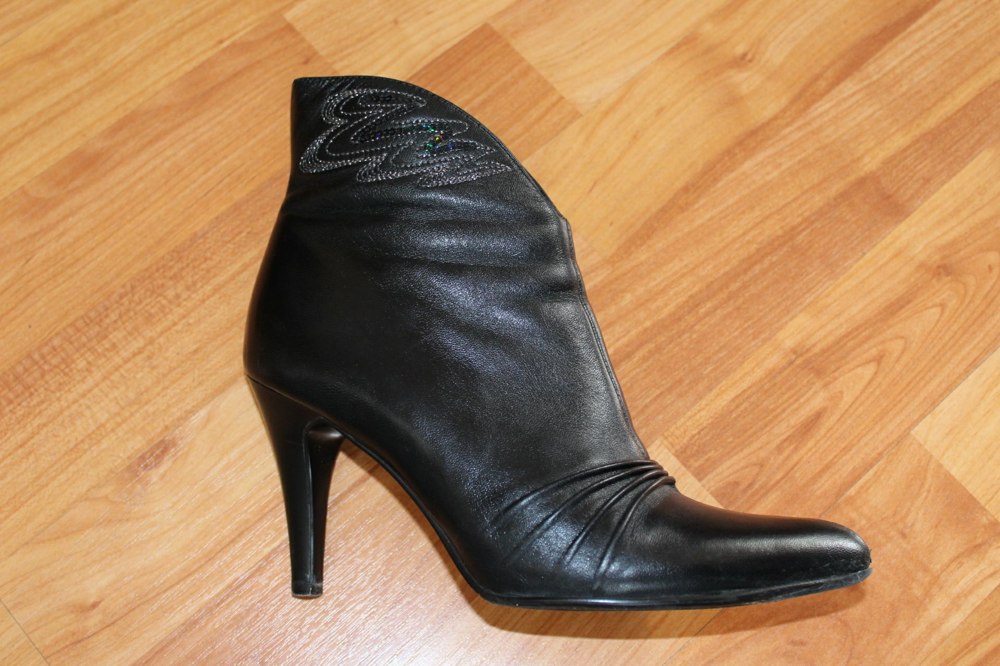
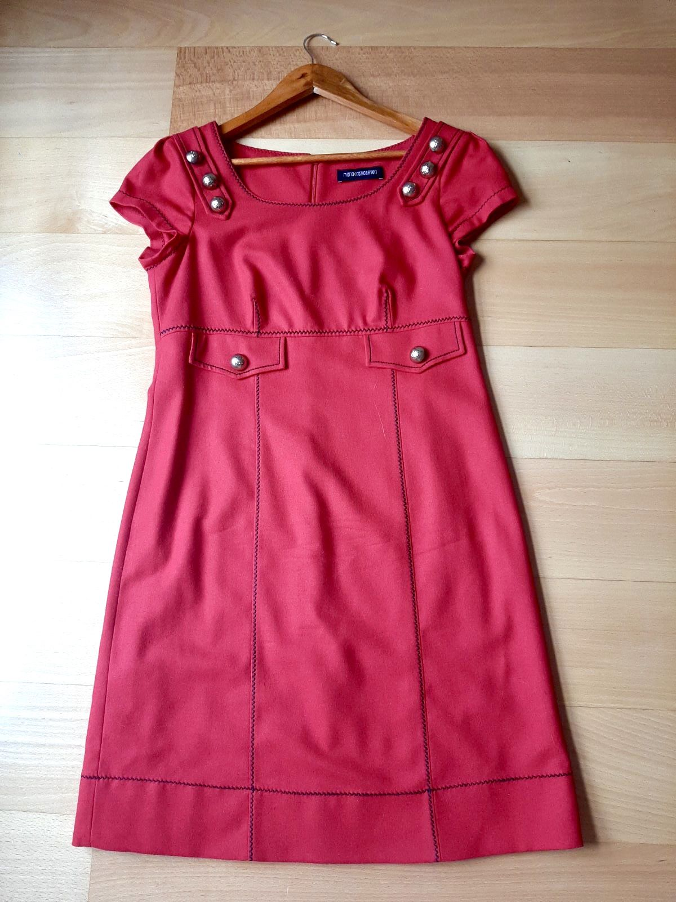


Review the material below and start with the essentials in the following section.

### Prerequisites

This guide assumes you have:
* basic Python knowledge
* some familiarity with machine learning
* a working understanding of relational databases like Snowflake

*See our reference section at the bottom of this page if you need help with these aspects before you start.*

### What You’ll Learn

- Storing unstructured data in Snowflake (image files)
- Loading data from Snowflake to Saturn Cloud
- Training a PyTorch model on Saturn Cloud
- Image classification inference with a Dask cluster on Saturn Cloud
- Saving image classification inference results in Snowflake

### What You’ll Need

*In the first part of this guide, you'll learn how to create these.*

- [Snowflake](https://signup.snowflake.com/) free account 
- [Saturn Cloud](https://saturncloud.io/) free account


### Reference/Helpful Tips

- [Snowflake documentation](https://docs.snowflake.com)
- [Saturn Cloud documentation](https://saturncloud.io/docs/)
- Quick Video [Introduction to Snowflake](https://www.youtube.com/watch?v=fEtoYweBNQ4&ab_channel=SnowflakeInc.)

<!-- ------------------------ -->

## Create Accounts

Duration: 0:05:00

First, we'll go over how to create your Snowflake and Saturn Cloud accounts.

### 1. Create a Free Snowflake Account

Snowflake lets you try out their services for free with a [trial account](https://signup.snowflake.com/). The free trial account works fine for this guide. Follow the prompts to activate your account via email.

### 2. Create a Free Saturn Cloud Account

Saturn Cloud offers [Hosted Free accounts](https://accounts.community.saturnenterprise.io/auth/signup) that allow you to use 30 hours of compute time, including machines with GPUs or 64GB of RAM as well as Dask clusters. 

If you need more resources, [upgrade to pay-per-use with our Hosted Pro accounts](https://saturncloud.io/plans/saturn_cloud_plans/).
<!-- ------------------------ -->

## Snowflake Setup

Duration: 0:05:00

Snowflake's unstructured file storage allows you to add an organizing layer on top of your files stored in a storage option like AWS S3 or Google Cloud Storage - options that offer minimal or no convenient way to organize and structure the files. **By integrating with Snowflake, you can make these files easy to find, query, and access!** Furthermore, this technique improves the security of these files by only requiring the Snowflake credentials to be shared - as you'll see, you can control access on the Snowflake side and keep your Google or AWS credentials private.

For this guide, it's important to understand how Snowflake's unstructured file storage works. Your files will not actually be stored in Snowflake, but instead you will create references between your Snowflake database and your file storage. For us, we've stored the files in AWS S3, in a bucket you can access. 

We will create a Snowflake database where the information about these files, including URLs allowing direct access to them, can be held. If you use this yourself on non-public data, you can add pre-signed URLs to your Snowflake data table to allow the end user of your Snowflake database to access the files seamlessly.

*Learn more about unstructured file storage on [Snowflake's official documentation](https://docs.snowflake.com/en/LIMITEDACCESS/data-load-files.html).*

### Create Database

Open your Snowflake account, and navigate to the Databases tab. 

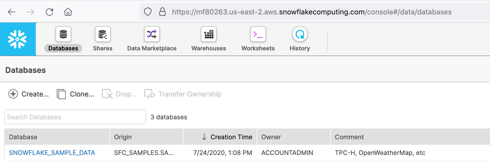

Click Create, name the database `Clothing`, then click Finish.

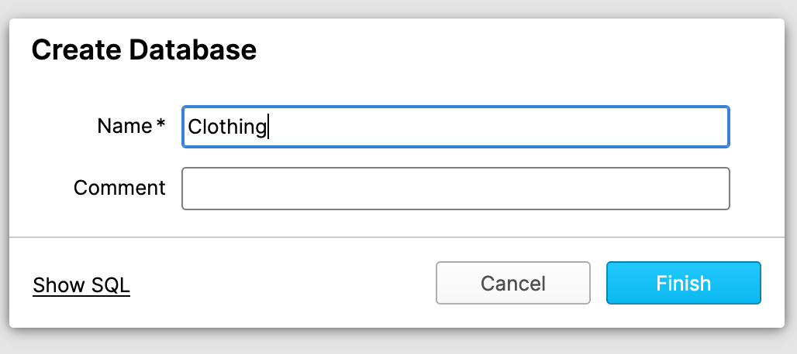

Now you have created the database that we'll be using to house the unstructured data. It will contain tables that your machine learning workflow can access to get training and test images!
<!-- ------------------------ -->

## Saturn Cloud Setup 
Duration: 0:04:00

Next, we need to [go in to Saturn Cloud](https://app.community.saturnenterprise.io/) and set up our working environment. Visit Saturn Cloud and log in with your account created previously. You'll start on the Resources page.

### Create Saturn Cloud Resources

Inside Saturn Cloud, you can choose from several templates for resources, which can include Jupyter servers for machine learning development as well as scheduled tasks or deployments like APIs. For this guide, we'll use a premade resource that's configured specifically for this guide. It includes the right settings for the resource size and loads the code for you from a public Git repository. Click the button below to create the resource:

<div style="margin-top:20px;margin-bottom:20px;">
    <a href="https://app.community.saturnenterprise.io/dash/resources?recipeUrl=https://raw.githubusercontent.com/saturncloud/examples/main/examples/snowflake-ml/.saturn/saturn.json" target="_blank" rel="noopener noreferrer"
    style="all: unset; border-radius:32px;display:inline-flex;align-items: center;
    background-color:#FF6721;font-family:sans-serif;font-size:20px;font-weight:700;
    color:#FFF;padding:8px 16px 8px 16px;cursor:pointer;">
        <svg style="margin-left: -7px; margin-right: 12px; height: 32px; width: 32px;"
        viewBox="0 0 5.2916669 5.291667" xmlns="http://www.w3.org/2000/svg">
            <g transform="translate(73.700986,85.553359)">
                <path fill-rule="evenodd" clip-rule="evenodd"
                    d="m -68.409319,-82.907521 c 0,1.461253 -1.18457,2.645829 
                    -2.645829,2.645829 -0.592913,0 -1.140282,-0.195033 -1.581445,
                    -0.524429 l 0.93568,-0.935674 c 0.19182,0.104687 0.411846,
                    0.164186 0.645765,0.164186 0.745541,0 1.34992,-0.604376 1.34992,
                    -1.349912 0,-0.233922 -0.0595,-0.453951 -0.16419,-0.645772 l 
                    0.935675,-0.935674 c 0.329386,0.441166 0.524424,
                    0.98853 0.524424,1.581446 z m -1.065968,-2.122584 c -0.44089,
                    -0.328692 -0.987654,-0.523254 -1.579861,-0.523254 -1.461254,0
                    -2.645838,1.184581 -2.645838,2.645838 0,0.585025 0.189875,
                    1.125705 0.511359,1.563776 l 0.940482,-0.933398 c -0.09955,
                    -0.188164 -0.155918,-0.40269 -0.155918,-0.630378 0,-0.74554 
                    0.604379,-1.349917 1.349915,-1.349917 0.231331,0 0.44907,
                    0.05819 0.639384,0.160725 z"
                    fill="#ffffff" id="path2" style="fill:#ffffff;stroke-width:0.00487466" />
            </g>
        </svg>
        Run in Saturn Cloud
    </a>
</div>

Once the resource is created, click the green arrow buttons to start your Jupyter server and your Dask cluster. These may take a moment to start running, so feel free to read on.

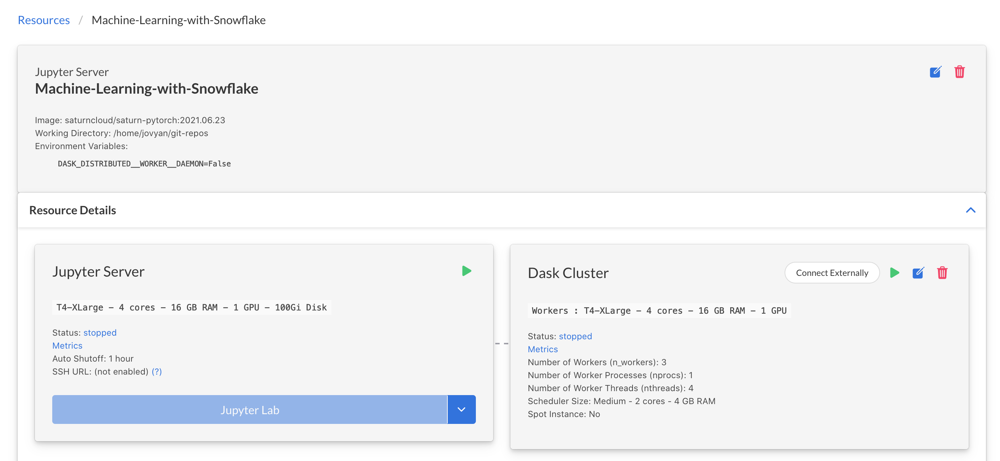

### Add Snowflake Credentials to Saturn Cloud

On the menu at the left, click the **Credentials** button. We need to make sure Saturn Cloud has our Snowflake credentials securely stored, so that when you make queries in python in Saturn Cloud, Snowflake can authenticate you. *Do this before you turn on any resources.*

Take your Snowflake account username and password, and create two entries here: `SNOWFLAKE_USER` and `SNOWFLAKE_PASSWORD` as Environment Variables. 

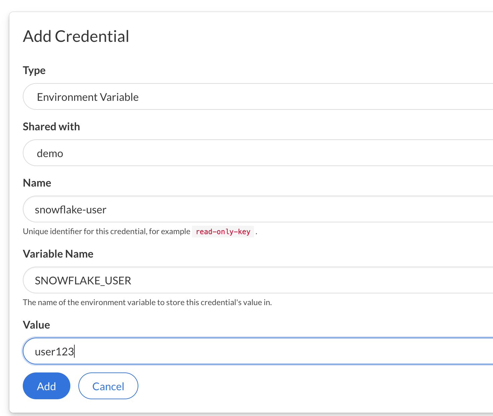

### Open JupyterLab

Once the resource is created and started, and your credentials are loaded into Saturn Cloud, you are ready to open the JupyterLab of the resource and look at the code. On the resource page click the **JupyterLab** button

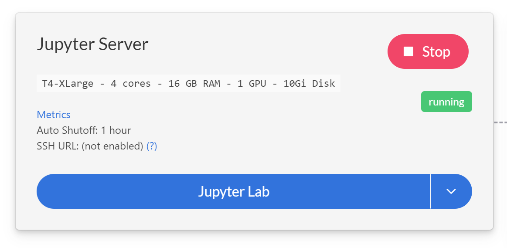

<!-- ------------------------ -->

## Load Image Files into Database

Duration: 0:08:00

In the following steps, we will load image files of garments from S3 into the Snowflake database you already created, so your machine learning model can access them.

All of the commands listed here should be run in **your Snowflake UI, from Worksheets**. Click the Worksheets tab at the top menu of the page, and make sure you are in the Clothing database you just created.


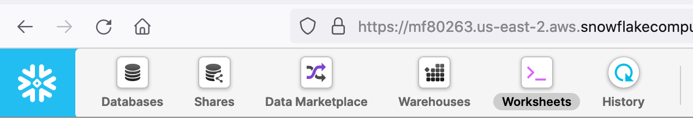


### Staging 
#### Create the stages

These stage tables will hold our data temporarily, before we move it to permanent storage. This allows us to catch any issues before we alter our permanent table.

*Notice that we're creating Test and Train versions of these tables - this will help us more easily keep our training and test data separate when modeling, but is not required.*

To complete this section, visit Saturn Cloud and [download the zip file called `SnowflakeGuide`](https://saturncloud.io/static/SnowflakeGuide.zip), which you can open with password `s@turn9`.

```
create or replace stage clothing_dataset 
    url = 's3://saturn-data-demo/clothing-dataset-small/test/'
    credentials=(AWS_KEY_ID='YOURKEYHERE' 
                 AWS_SECRET_KEY='YOURSECRETHERE')
    encryption=(TYPE='AWS_SSE_KMS' 
                KMS_KEY_ID = 'aws/key')
    directory = (ENABLE=TRUE);

create or replace stage clothing_dataset_train 
    url = 's3://saturn-data-demo/clothing-dataset-small/train/'
    credentials=(AWS_KEY_ID='YOURKEYHERE' 
                 AWS_SECRET_KEY='YOURSECRETHERE')
    encryption=(TYPE='AWS_SSE_KMS' 
                KMS_KEY_ID = 'aws/key')
    directory = (ENABLE=TRUE);
```

#### Refresh and Query

When the stages are built, we refresh to check that the data is all where it ought to be.

```
alter stage clothing_dataset refresh;
alter stage clothing_dataset_train refresh;
```

You can check this using a select statement on the directory, like the one below, which will return a few rows we can examine.
```
SELECT * FROM DIRECTORY( @clothing_dataset ) limit 10;
```

### Create Permanent Tables
From here, we will use the stages to update our permanent tables. Today we have not yet created those permanent tables, so we'll do that first.

Notice that the test table includes Pred_Timestamp, Type, and Confidence Number, which represent the datetime of prediction, inferred label, and the probability of that label assigned by our model. They are null until we run the model later. Our training data table does not need these fields.

```
create or replace table clothing_test(
  FILE_URL TEXT,
  RELATIVE_PATH TEXT,
  SIZE NUMBER,
  LAST_MODIFIED TIMESTAMP_TZ,
  PRED_TIMESTAMP TIMESTAMP_TZ,
  TYPE TEXT,
  CONFIDENCE FLOAT8
);

create or replace table clothing_train(
  FILE_URL TEXT,
  RELATIVE_PATH TEXT,
  SIZE NUMBER,
  LAST_MODIFIED TIMESTAMP_TZ
);
```

#### Insert From Staging

Now that our permanent tables exist, we'll insert rows from staging into them. This is safer than loading data directly into permanent tables, as data issues can be present in the source that we're not aware of before they are ingested into Snowflake.


```
INSERT INTO clothing_test 
select 
    FILE_URL, 
    RELATIVE_PATH, 
    SIZE, 
    LAST_MODIFIED,
    NULL,
    NULL,
    NULL
from DIRECTORY( @clothing_dataset );

INSERT INTO clothing_train 
select 
    FILE_URL, 
    RELATIVE_PATH, 
    SIZE, 
    LAST_MODIFIED
from DIRECTORY( @clothing_dataset_train );
```

Now we have all of our setup in Snowflake done, and we're ready to work on modeling! You will not need to use the Snowflake worksheet any more after this point.

<!-- ------------------------ -->


## Train Model

Duration: 00:10:00

### Task Overview

The model we are training is a **Convolutional Neural Network** based on the **ResNet50** architecture. This architecture is widely known for its high performance on image classification tasks, but you are welcome to use a different architecture if you prefer. To select another model architecture in PyTorch, you can view the options in the accompanying [`torchvision` library](https://pytorch.org/vision/stable/index.html). It also contains other image datasets you might find useful. 

*We are using PyTorch, but if you prefer to use Tensorflow, that is also possible on Saturn Cloud.*

Our goal here is to take this architecture and train it on a sample of labeled images falling into one of our 10 different classes, based on what garment is shown in the photo. This can be useful for many kinds of business needs, such as serving appropriate recommendations for retail websites and applications. As you'll see, having your image data neatly organized in Snowflake makes the process much easier, and using Saturn Cloud to run the modeling is seamless with Snowflake.

When your Jupyter server has started, you can move on to the next section and look at the code. We will not use the Dask cluster for the training step, but only for the inference task in Part 7.

#### Things to Remember:
* Snowflake database: `clothing`
* Training data table in Snowflake: `clothing_train`
* Test data table in Snowflake: `clothing_test`

#### Note:
*Be aware that it will take significant time to train the model fully. You can skip this if you like, because we have included a fully trained model state dictionary in the repository.*

### Getting Started

**Note: All of the code we are going to discuss in the upcoming sections are already available in your Machine Learning with Snowflake Jupyter server, so there is no need to copy and paste any of it.**

In your Saturn Cloud Jupyter server, the file named `training.py` contains all the code you need to train an image classification neural network model on the image data in your Snowflake database. We'll go over some of the more important details of that code here.

### Snowflake Image PyTorch Dataset

This project uses a custom PyTorch Dataset class that is tailored to Snowflake data. (The code for this is inside the `pytorch_snowflake_class.py` file, but you don't need to alter any of that to use it.) There are a few important elements to note in `training.py`, however. 

First, you should check and make sure your Snowflake connection arguments are correct. 

**You will find this inside training.py around line 100.** 

```python
conn_kwargs = dict(
    user=os.environ['SNOWFLAKE_USER'], # This will draw from your Saturn Cloud credentials
    password=os.environ['SNOWFLAKE_PASSWORD'], # This will draw from your Saturn Cloud credentials
    account='mf80263.us-east-2.aws', # Fill in your own account here!
    warehouse="COMPUTE_WH", # Fill in your own warehouse here!
    database="clothing", # You created this earlier!
    schema="PUBLIC", 
    role="datascience", # Fill in your own role here!
)
```

These arguments are all passed to the Snowflake Python connector to create your connection, and then your code will call the `SnowflakeImageFolder` class like so. 

**This is found in training.py around line 32.**

```python
with snowflake.connector.connect(**conn_kwargs) as conn:
    whole_dataset = SnowflakeImageFolder(
        table_name = 'clothing_train',
        relative_path_col = 'RELATIVE_PATH',
        connection = conn,
        transform=transform
    )
```

### Training Parameters

You also have the opportunity to customize the training parameters used for the model, if you like. Notice that the connection arguments described above get passed in to this as well. Everything your model needs to run should be covered in this dictionary. 

**This is found in training.py around line 111.**

```python
model_params = {
    'n_epochs': 25, 
    'batch_size': 64,
    'base_lr': .003,
    'downsample_to':1, # Value represents fraction of training data you want to use
    'conn_kwargs': conn_kwargs}
```

### Run Code

Once you have checked that the fields are correct for your setup, you can run the script by running `python3 training.py` at the terminal inside Saturn Cloud. As the training proceeds, it will show progress bars, and will report the state of the model every 10 iterations by default, but you can change this in the code if you like. 

As the model trains, it will write out the trained model state dictionary every 10 iterations, with the final fully trained model written at the end. This will be located in the path `model/model_trained.pt`.

<!-- ------------------------ -->

## Run Inference

Duration: 0:07:00

The next task is to use our trained model object to infer the correct class for new images. Open the `inference.ipynb` notebook in your Jupyter instance to see the code and run it. (You can either use your own trained model from the previous step or use the model provided to you in the repository.)

### Snowflake Connection
As you did for the training step, check that your Snowflake parameters are all set correctly. 

```python
conn_kwargs = dict(
    user=os.environ['SNOWFLAKE_USER'], # This will draw from your Saturn Cloud credentials
    password=os.environ['SNOWFLAKE_PASSWORD'], # This will draw from your Saturn Cloud credentials
    account='mf80263.us-east-2.aws', # Fill in your own account here!
    warehouse="COMPUTE_WH", # Fill in your own warehouse here!
    database="clothing", # You created this earlier!
    schema="PUBLIC", 
    role="datascience", # Fill in your own role here!
```

### Dask Cluster
We will be using Dask to parallelize our inference task. This allows you to accelerate your work dramatically by having it run across multiple machines in parallel, as you'll see! 

A Dask Cluster is a group of remote machines set up to communicate together and parallelize work. Your Jupyter server is the Client, as shown below, and you can use it to send commands and tasks to all the workers. They will then complete work and return results to you. 

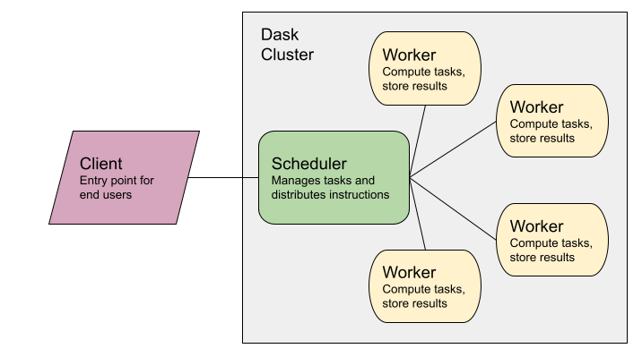

If you are new to parallelization or Dask and would like to learn more, we have [documents about it on our website!](https://saturncloud.io/docs/reference/dask_concepts/)

In this template resource, your cluster has already been set up to have the correct settings, and if you clicked the green arrow button to start it in Part 5, it'll be ready to go. If you didn't start your cluster yet, you can do this programmatically by running the chunk below. When the cluster is ready, you'll see a box showing the cluster's settings (see screenshot).

```python
cluster = SaturnCluster()
client = Client(cluster)
client.wait_for_workers(2)
client
```

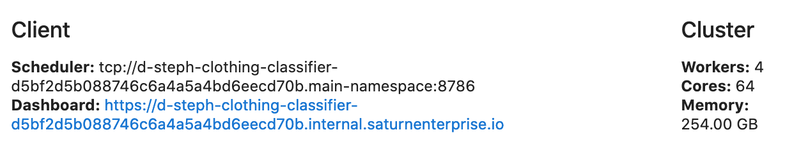


### Preprocess Data

Before the inference job begins, we will queue some delayed functions to preprocess the images from Snowflake. These functions are defined in the `inference.ipynb` notebook.

```python
stage = 'clothing_dataset'
relative_path_field = 'RELATIVE_PATH'

with snowflake.connector.connect(**conn_kwargs) as conn:
    df = pd.read_sql(f"""select *, 
    get_presigned_url(@{stage}, {relative_path_field}) as SIGNEDURL
    from clothing_test""", conn)
    list_paths = df['URL']

n = 80  #batch size
list_df = [df[i:i+n] for i in range(0,df.shape[0],n)]
image_rows = [[x for j,x in y.iterrows()] for y in list_df]
image_batches1 = [[preprocess(list(x)) for x in y] for y in image_rows]
image_batches = [reformat(result) for result in image_batches1]
```

### Ensure Model is on Workers

Because we are using a Dask cluster to run inference, we need to make sure our trained model object is available on all the workers. This is easily done by syncing the files. Make sure the paths shown reflect your filepaths (the last line will show you what the files on your workers are).

```python
from dask_saturn.plugins import RegisterFiles, sync_files
client.register_worker_plugin(RegisterFiles())
sync_files(client, "/home/jovyan/project/model")
client.run(os.listdir, './model')
```

### Run Inference

To finally run the model, we'll use Dask futures - this again uses functions defined in the notebook.

```python
futures = client.map(run_batch_to_s3, image_batches) 
futures_gathered = client.gather(futures)
futures_computed = client.compute(futures_gathered, sync=False)
```


## Skim Results

Duration: 0:05:00

You can examine the results of the model in the inference notebook- here are some examples from different early versions of the model!

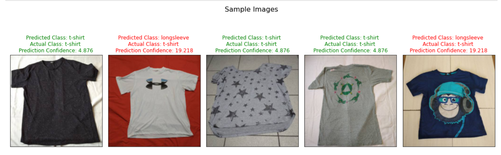

Models may struggle to determine what "long" really means on the sleeves of garments.

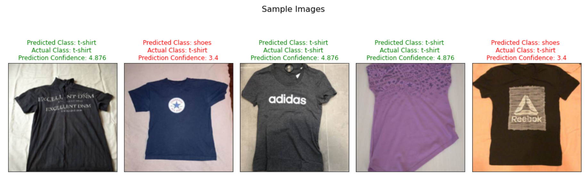

Notice above, the model is confused by logos that normally correspond to shoes appearing on t-shirts.

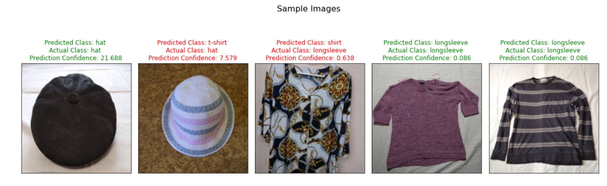

Here a round shape might be making the model think it's seeing a collar instead of a hat.

In a neural network, we can't really be sure what is driving the model's choices in most cases, but sometimes we can intuitively guess what features may be involved. 

<!-- ------------------------ -->

## Save Inference Results to Snowflake

Duration: 0:05:00

After the inference is done (it should take only five to ten seconds), we are ready to save the results back to Snowflake, attaching the predictions to the original image files in our `clothing_test` data table. We will do all of this from Python programmatically.

### Queries

These queries will be used to create a temp table, update the permanent table, and clean up the temp table.

```python
make_table = """
    CREATE OR REPLACE TABLE clothing_temp
    (
      FILE_URL VARCHAR,
      SIZE NUMBER,
      LAST_MODIFIED TIMESTAMP_LTZ,
      TYPE VARCHAR,
      CONFIDENCE FLOAT8,
      PRED_TIMESTAMP TIMESTAMP_LTZ
    )
    """

update_query = """
    update clothing_test
      set clothing_test.TYPE = clothing_temp.TYPE, 
          clothing_test.CONFIDENCE = clothing_temp.CONFIDENCE,
          clothing_test.PRED_TIMESTAMP = clothing_temp.PRED_TIMESTAMP
      from clothing_temp
      where clothing_test.FILE_URL = clothing_temp.FILE_URL
      and  clothing_test.SIZE = clothing_temp.SIZE
"""

clean_house = "drop table if exists clothing_temp"
```

The following chunk runs all the necessary updates and reports status throughout.

```python
with snowflake.connector.connect(**conn_kwargs) as conn:
    cur = conn.cursor()
    cur.execute(make_table)
    print('Temp table created.')
    snow_df = df2[['snow_path', 'filesize', 'orig_timestamp',
                   'prediction_text', 'prediction_prob']].copy()
    snow_df.rename(columns={"snow_path": "FILE_URL", 
                            "filesize": "SIZE",
                            "orig_timestamp": "LAST_MODIFIED", 
                            "prediction_text": "TYPE", 
                            "prediction_prob": "CONFIDENCE" },
                       inplace=True)
    snow_df['PRED_TIMESTAMP'] = pd.to_datetime(datetime.datetime.now()).tz_localize('UTC')
    success, nchunks, nrows, _ = write_pandas(conn, snow_df, 'CLOTHING_TEMP')
    print(f'Temp results table created: {success}. Rows inserted in table: {nrows}.')
    res = cur.execute(update_query)
    print(f'Updated {res.rowcount} rows in permanent table from temp source.')
    cur.execute(clean_house)
    print('Temp table removed.')
```

<!-- ------------------------ -->

## Cleanup

Duration: 0:03:00

When your job is complete, you can shut down the Saturn Cloud resources by clicking the red squares on each card. 

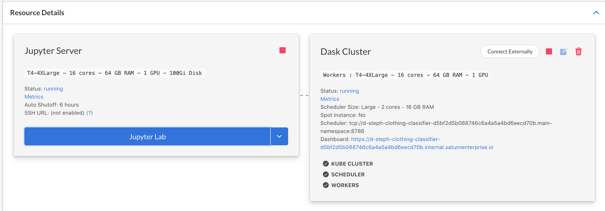

In Snowflake, you can delete the stages and tables we created if you'd like.

```
drop stage if exists clothing_dataset;
drop stage if exists clothing_dataset_train;

drop table if exists clothing_train;
drop table if exists clothing_test;
```

<!-- ------------------------ -->

## Conclusion and Next Steps

Duration: 0:03:00

We hope that this guide has given you insight into how you can use Snowflake and Saturn Cloud together to manage your machine learning pipelines! 

By following these steps, you've gone from a set of labeled images to a fully trained classification model, and applied it to new images to determine what kind of garment each shows. You used Snowflake unstructured data to store the images in a helpful way, then trained and ran machine learning models with Saturn Cloud, PyTorch, and Dask. If you were using this for business, you could deploy this trained model as an API, where users or services could submit an image and retrieve a label, for example to serve the correct choice of garment to a user viewing your retail website. You can also combine models like this with others to build AI-generated outfits!


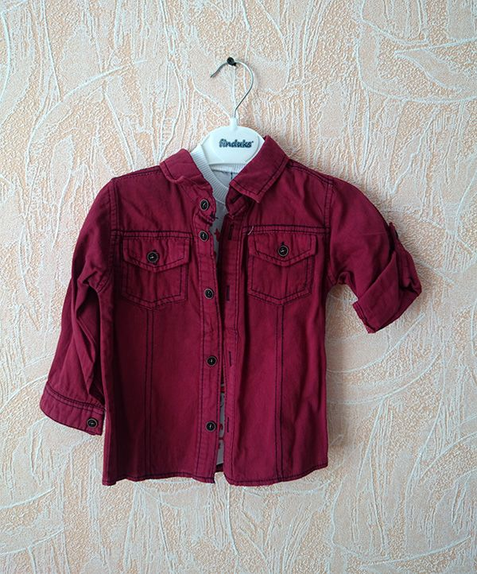
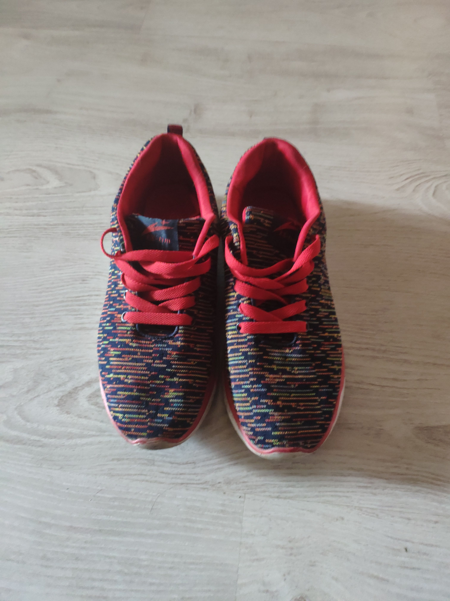
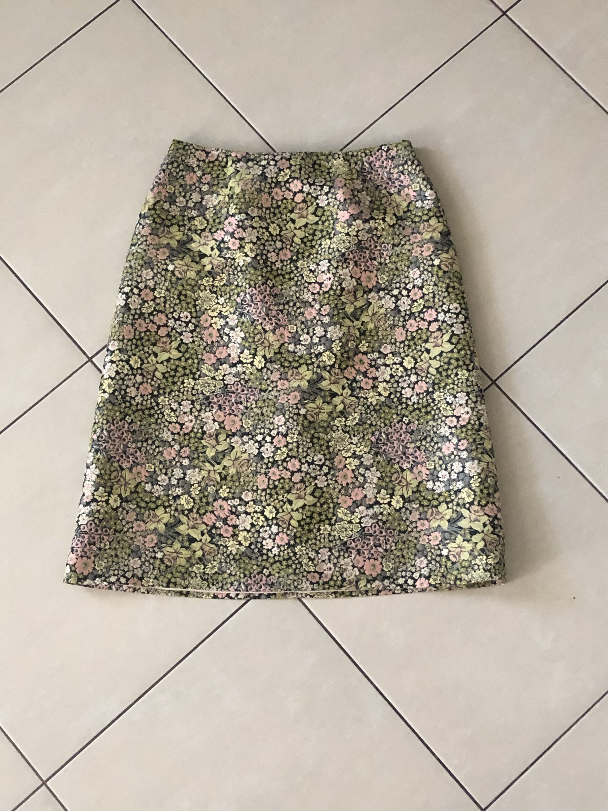


### What we've covered

- Created accounts for Snowflake and Saturn Cloud
- Created a Snowflake database, and populated tables with unstructured data
- Created Saturn Cloud Jupyter instance and Dask cluster
- Trained a neural network for image classification
- Ran image classification inference and saved image classes to Snowflake
