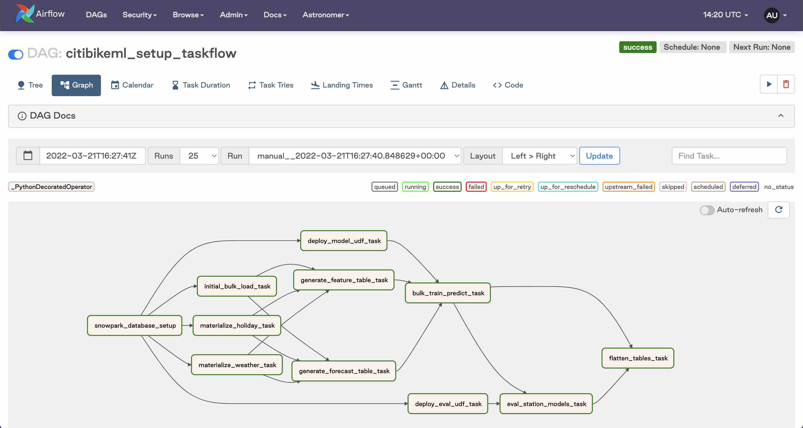
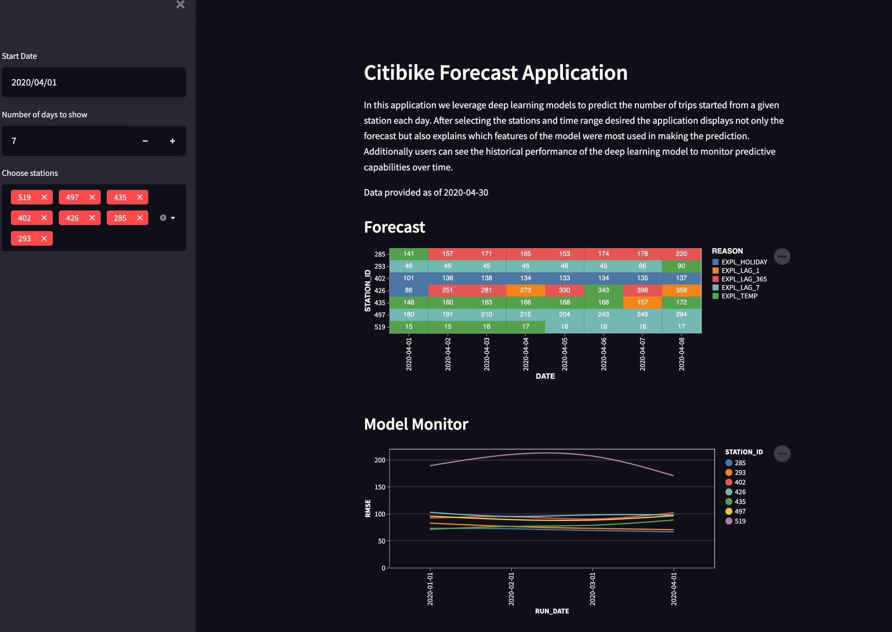
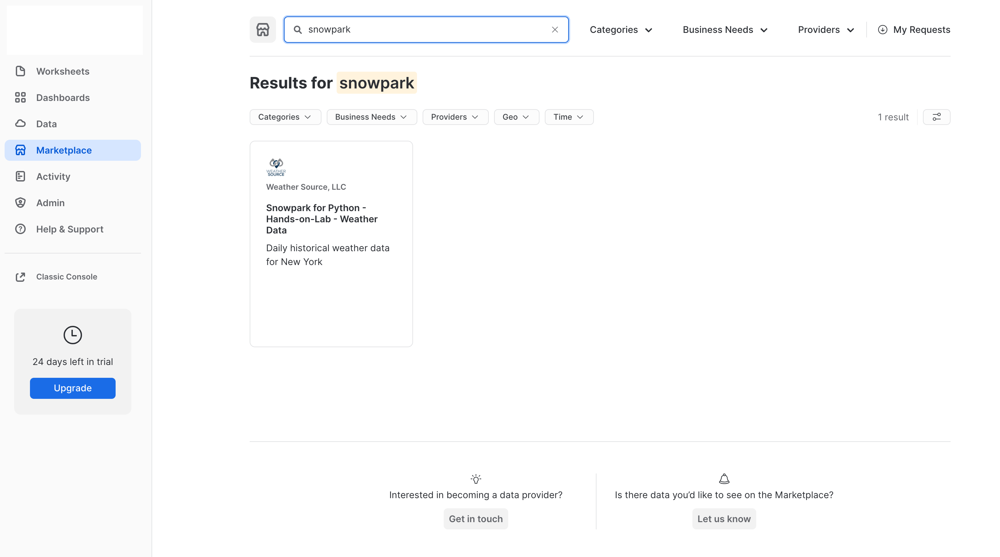
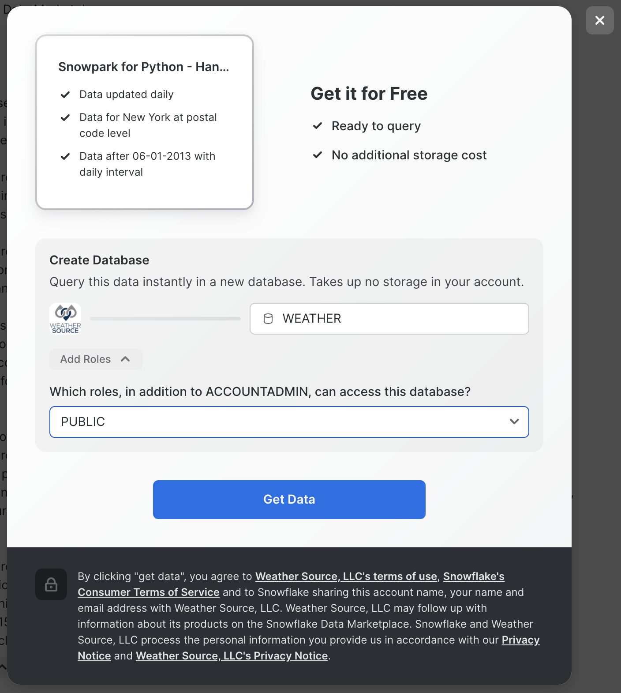
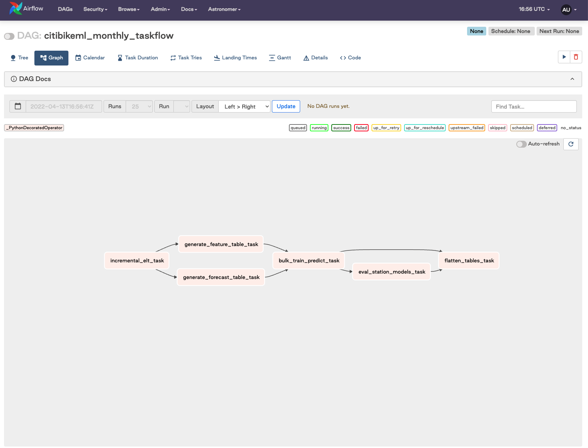

author: Caleb Baechtold
id: machine_learning_with_snowpark_python
summary: This is a sample Snowflake Guide
categories: data-science
environments: web
status: Draft
feedback link: https://github.com/Snowflake-Labs/sfguides/issues
tags: Data Science, Data Engineering, Getting Started, Machine Learning

# Machine Learning with Snowpark Python
<!-- ------------------------ -->
## Overview 
Duration: 7

**Note: if this is your first time experimenting with Snowpark Python, we recommend completing the [Getting Started with Snowpark for Python](https://drive.google.com/drive/folders/1cl8F5etKqbB57VzgqP2pmMT0B76o_x-W) Quickstart before working on this quickstart. It will include an overview of more fundamental concepts, this Quickstart is meant to be a 300+ level resource.**

*This quickstart was initially built as a Hands-on-Lab at Snowflake Summit 2022*

Python is the language of choice for Data Science and Machine Learning workloads. Snowflake has long supported Python via the Python Connector, allowing data scientists to interact with data stored in Snowflake from their preferred Python environment. This did, however, require data scientists to write verbose SQL queries. To provide a more friendly, expressive, and extensible interface to Snowflake, we built **Snowpark Python**, a native Python experience with a pandas and PySpark-like API for data manipulation. This includes a client-side API to allow users to write Python code in a Spark-like API without the need to write verbose SQL. Python UDF and Stored Procedure support also provides more general additional capabilities for compute pushdown.

Snowpark includes client-side APIs and server-side runtimes that extends Snowflake to popular programming languages including Scala, Java, and Python. Ultimately, this offering provides a richer set of tools for Snowflake users (e.g. Python’s extensibility and expressiveness) while still leveraging all of Snowflake’s core features, and the underlying power of SQL, and provides a clear path to production for machine learning products and workflows.

A key component of Snowpark for Python is that you can "Bring Your Own IDE"- anywhere that you can run a Python kernel, you can run client-side Snowpark Python. You can use it in your code development the exact same way as any other Python library or module. In this quickstart, we will be using Jupyter Notebooks, but you could easily replace Jupyter with any IDE of your choosing.

Throughout this quickstart, we will specifically explore the power of the Snowpark Python Dataframe API, as well as server-side Python runtime capabilities, and how Snowpark Python can enable and accelerate end-to-end Machine Learning workflows, from initial data and feature engineering all the way to production model deployment. We will even explore orchestrating model training and deployment pipelines using Apache Airflow.

The source code for this quickstart is available on [GitHub](https://github.com/Snowflake-Labs/vhol-citibike-ml-snowpark-python).

### Prerequisites
- Completion of the [Getting Started with Snowpark for Python](https://drive.google.com/drive/folders/1cl8F5etKqbB57VzgqP2pmMT0B76o_x-W) Quickstart
- Working knowledge of Python
- Familiarity with Snowflake
- Familiarity with Docker, Apache AirFlow, Streamlit a +

### What You’ll Learn 
- How to setup an Extract, Load and Transform (ELT) pipeline in Python for both bulk ingestion of ~100m time series records using the  Snowpark Python Client API as well as an incremental load process. 
- How to perform exploratory data analysis , model development, experimentation and feature engineering  using the Snowpark Python Client API and the Pytorch Tabnet framework. 
- How to create a reproducible, monitored, explainable and automated pipeline for machine learning training and inference at very large scale. 
- How to implement end-to-end machine learning workflows in Snowflake with Python (no SQL needed) which can be orchestrated with dbt, Airflow, or any other python-capable orchestration framework.

### What You’ll Need 
- A Snowflake Account with Anaconda Integration enabled by ORGADMIN - if you do not already have a Snowflake account, you can register for a [free trial account](https://signup.snowflake.com/)
- An [Amazon SageMaker Studio Lab](https://studiolab.sagemaker.aws/) Account OR a local Jupyter Notebook runtime with Miniconda
- ***Optionally*** [Docker Desktop](https://www.docker.com/products/docker-desktop/)

***Note: If you are planning to run this Quickstart locally, you may have additional requirements, e.g. Docker, Miniconda. Take a look at the source code [README](https://github.com/Snowflake-Labs/vhol-citibike-ml-snowpark-python) for more information on additional local environment requirements.***

### What You’ll Build 
- An orchestrated end-to-end Machine Learning pipeline to perform monthly forecasts using Snowflake, Snowpark Python, PyTorch, and Apache Airflow.

This pipeline will:
    - Incrementally ingest new data monthly from Amazon S3 into Snowflake
    - Generate feature data from the new raw data and generate forecast data for relevant features for the prediction period
    - Train hundreds of PyTorch TabNet models in parallel and generate new forecasts from the updated models, all inside of Snowflake
    - Calculate and store model evaluation metrics
    - Flatten output across hundreds of models in Snowflake to be consumed by end users via BI dashboards, for example
- A simple front-end web UI via the easy-to-use Python library `Streamlit`, allowing users to consume the results of your pipeline


<!-- ------------------------ -->
## Use-Case: Predicting Bike Share Trips 
Duration: 1

In this example we use the [Citibike dataset](https://ride.citibikenyc.com/system-data). Citibike is a bicycle sharing system in New York City. Everyday users choose from 20,000 bicycles at over 1000 stations around New York City.

To ensure customer satisfaction Citibike needs to predict how many bicycles will be needed at each station. Maintenance teams from Citibike will check each station and repair or replace bicycles. Additionally, the team will relocate bicycles between stations based on predicted demand. The operations team needs an application to show how many bicycles will be needed at a given station on a given day.

Importantly, at the end of each section of this Quickstart, we are going to export modular Python code for use in our end-to-end deployment and orchestration. This demonstrates your ability to use the IDE of your choice (in this case, Jupyter notebooks), to iterate, explore, and experiment, while still creating production-ready, deployable Python code.

<!-- ------------------------ -->
## Setup
Duration: 5

**Persona**: DBA/Platform Administrator

**What You'll Do**: 
- Establish the Snowpark Python session and produce a reusable function for use throughout the remainder of the lab
- Include steps for creating user roles, warehouses, etc. if you do not already have these configured for your Snowflake demo account
- Create the CITIBIKEML_\<USER> database

**Snowflake Features**:
- Granular Role Based Access Control ([RBAC](https://docs.snowflake.com/en/user-guide/security-access-control-overview.html)) Model
- [Separated compute and storage](https://docs.snowflake.com/en/user-guide/intro-key-concepts.html)
- [Virtual Warehouses](https://docs.snowflake.com/en/user-guide/warehouses.html)

Check out the code repository README, and ensure you've followed the setup instructions for your environment of choie (AWS SageMaker Studio Lab or local Jupyter)

Then, open up the [`00-Setup`](https://github.com/Snowflake-Labs/vhol-citibike-ml-snowpark-python/blob/main/00-Setup.ipynb) Jupyter notebook and execute the cells. Make sure to fill in the `state_dict` at the top of this Notebook with your Snowflake account information. Run through the notebook, executing each cell along the way.

***If you are using a brand new Snowflake account***, with just a single ACCOUNTADMIN user, you'll need to run some additional steps to create additional users, initial databases, schemas, compute warehouses, etc. that we will use throughout this quickstart:
```python
session.use_role('securityadmin')

initial_password='snow2022'
new_usernames=['john1', 'john2']
project_role='PUBLIC'

for username in new_usernames:
    session.sql("CREATE USER IF NOT EXISTS "+username+\
                " PASSWORD = '"+initial_password+\
                "' LOGIN_NAME = '"+username+\
                "' DEFAULT_ROLE = '"+project_role+\
                "' MUST_CHANGE_PASSWORD = TRUE")\
            .collect()
    session.sql("GRANT ROLE "+project_role+" TO USER "+username).collect()

session.use_role('sysadmin')
session.sql("GRANT CREATE DATABASE ON ACCOUNT TO ROLE "+project_role).collect()

session.use_role(state_dict['connection_parameters']['role'])

session.use_role('accountadmin')
project_role='PUBLIC'

for wh in state_dict['compute_parameters'].values():
    session.sql("CREATE WAREHOUSE IF NOT EXISTS "+wh+\
            " WITH WAREHOUSE_SIZE = '"+wh.split('_')[0]+\
            "' WAREHOUSE_TYPE = 'STANDARD' AUTO_SUSPEND = 300 AUTO_RESUME = TRUE initially_suspended = true;")\
        .collect()
    session.sql("GRANT USAGE ON WAREHOUSE "+wh+" TO ROLE "+project_role).collect() 
    
session.use_role(state_dict['connection_parameters']['role'])

session.use_role('accountadmin')
session.sql("GRANT IMPORT SHARE ON ACCOUNT TO "+project_role).collect()
session.use_role(state_dict['connection_parameters']['role'])
```

<!-- ------------------------ -->
## Data Engineering
Duration: 10

**Persona**: Data Engineeer

**What You'll Do**: 
- Extract the Citbike data from S3 to a Snowflake stage
- Load the raw data to Snowflake tables
- Create tables with transformed data for use by Data Scientists
- Export the relevant DE code as Python modules and function for use in MLOps orchestration later

**Snowflake Features**:
- Snowpark Python Client Dataframe API for ELT
- Snowflake Ingest Capabilities & Performance (loading ~94M records in roughly 30s)

In this section of the demo, we will utilize Snowpark's Python client-side Dataframe API to build an ELT pipeline. We will extract the data from the source system (s3), load it into snowflake and add transformations to clean the data before analysis.

Open up the [`01_Data_Engineering`](https://github.com/Snowflake-Labs/vhol-citibike-ml-snowpark-python/blob/main/01_Data_Engineering.ipynb) notebook and execute the cells. This notebook will:

Now that we've done our initial engineering and loaded a sample of data, let's create some bulk ELT processes using the exported modules from the Data Engineering notebook.

Open up the [`01_Ingest`](https://github.com/Snowflake-Labs/vhol-citibike-ml-snowpark-python/blob/main/01_Ingest.ipynb) notebook and walk through the cells to see how to incrementally and bulk load data from S3 into Snowflake tables.

Run the last few cells of the notebook to bulk-load ~94M records into your Snowflake table in only about 30 seconds.

<!-- ------------------------ -->
## Data Marketplace
Duration: 5

**Persona**: Data Engineer

**What You'll Do**: Use the Snowflake Data Marketplace to subscribe to weather data from Weather Source.

**Snowflake Features**:
- [Snowflake Data Marketplace](https://www.snowflake.com/data-marketplace/)

Weather Source is a leading provider of global weather and climate data and the OnPoint Product Suite provides businesses with the necessary weather and climate data to quickly generate meaningful and actionable insights for a wide range of use cases across industries.

Weather Source powers a majority of Fortune companies who use their data to quantify the impact of weather and climate on various KPIs including footfall traffic, product sales and demand, supply chain and logistics, advertising and more.

Open up the [02_Data_Marketplace](https://github.com/Snowflake-Labs/vhol-citibike-ml-snowpark-python/blob/main/02_Data_Marketplace.ipynb) notebook and follow the instructions to add the Snowpark Hands-on-Lab Weather Source dataset to your Snowflake account.

1. Go the Snowflake UI, and select `Marketplace`
2. Search for `snowpark` and click on the Snowpark for Python - Hands-on Lab - Weather Data tile

3. Click `Get Data` and add the dataset to your Snowflake account


<!-- ------------------------ -->
## Data Science Exploration and Modeling
Duration: 20

**Persona**: Data Scientist

**What You'll Do**: 
- Query daily trip data in Snowflake using Snowpark Python and visualize time-series data
- Train a preliminary PyTorch TabNet model to predict daily trip counts
- Augment your model feature trips data with Holiday reference data, along with weather data available in the [Snowflake Data Marketplace](https://www.snowflake.com/data-marketplace/?_sft_dataset-category=weather)
- Consolidate final feature data into feature engineering functions and write them to a Python module for use by the ML engineering team to operationalize your model.

**Snowflake Features**:
- Snowpark Python Client Dataframe API for query & data transformation push-down
- Snowflake Data Marketplace for data enrichment

Now that the data engineers have cleaned and loaded the data to the `trips` table, we can begin our model development. For this, we will leverage Snowpark to do the feature preparation and exploratory analysis. This dataset is initially ~100 million rows and is likely too large to fit into memory on our local machine or even a reasonable sized single VM in the cloud. The Snowpark Python client-side Dataframe API allows us to push-down most of the computation for preparation and feature engineering to Snowpark. For security and goverance reasons we can read data into memory for model training and inference but no intermediate data products can be stored outside of Snowflake.

Open up the [`02_Data_Science`](https://github.com/Snowflake-Labs/vhol-citibike-ml-snowpark-python/blob/main/02_Data_Science.ipynb) notebook, and step through executing the cells.

After performing your feature engineering, you will write the feature engineering functions to a Python module for use by the ML engineering team in operationalizing this end-to-end workflow.

Finally, train your TabNet regression model using the final feature set and evaluate its performance, along with feature importance.

**OPTIONAL**: If you also want to train an ARIMA baseline model to compare against, you can open up the [02_Data_Science-ARIMA-Baseline](https://github.com/Snowflake-Labs/vhol-citibike-ml-snowpark-python/blob/main/02_Data_Science-ARIMA-Baseline.ipynb) notebook and run the cells to train a baseline ARIMA forecast model.

<!-- ------------------------ -->
## ML Engineering Development for ML Ops Pipelines
Duration: 10

**Persona**: ML Engineer

**What You'll Do**:
- Materialize the additional holiday and weather data as tables
- Incorporate forecast weather data for future predictions
- Create a vectorized feature generation pipeline that allows us to train models for every station in parallel using Snowpark and Snowflake window functions
- Create a Python UDF that performs training and inference (since this is a time-series prediction) and write the predictions to a table
- Evaluate the parallel models in Snowflake using a stored procedure
- Write the relevant functions to Python modules for orchestration

**Snowflake Features**:
- Snowpark for feature engineering
- Snowpark Python UDFs to model training and inference
- Model evaluation using Snowpark Python Stored Procedures


Your data scientists have done some exploratory analysis, feature engineering, and trained a model. Now, the ML engineer needs to develop code to deploy the model into production via an ML Ops pipeline. Open up the [`03_ML_Engineering`](https://github.com/Snowflake-Labs/vhol-citibike-ml-snowpark-python/blob/main/03_ML_Engineering.ipynb) notebook and step through, executing the cells. 


<!-- ------------------------ -->
## Operationalizing ML Code for MLOps
Duration: 10

**Persona**: ML Engineer

**What You'll Do**:
- Take the functions created by the Data Scientist and ML Engineer and wrap them in such a way that they can be easily automated using the company's orchestration tools (Airflow)
- Deploy the model training and inference as a permanent [Python Snowpark User-Defined Function (UDF)](https://docs.snowflake.com/en/LIMITEDACCESS/snowpark-python.html#creating-user-defined-functions-udfs-for-dataframes)
- Use [Zero-Copy Cloning](https://docs.snowflake.com/en/sql-reference/sql/create-clone.html) in Snowflake to produce point-in-time snapshots of the data in order to reproduce results on-demand in the future, withtout creating physical copies of any data
- Use [object tagging](https://docs.snowflake.com/en/user-guide/object-tagging.html) to tag training/inference datasets with a `model_id` for lineage
- Test out the pipeline that will eventually orchestrated
- Consolidate the monthly training/inference operation into a single deployable pipeline

**Snowflake Features**:
- Object Tagging for model/data lineage
- Snowpark Python UDF Deployment
- Zero-Copy Cloning for point-in-time snapshots of model training data

The ML Engineer must now create a pipeline to automate deployment of your station-trip models, batch the predictions, and expose them in such a way that a business user can consume them via a front-end application (which will be developed in Streamlit). Most importantly, ***no data should leave Snowflake!*** Open up the [`04_ML_Ops`](https://github.com/Snowflake-Labs/vhol-citibike-ml-snowpark-python/blob/main/04_ML_Ops.ipynb) notebook, and walk through the code cells.

<!-- ------------------------ -->
## Orchestration with Apache Airflow
Duration: 20

**Persona**: ML Engineer

**What You'll Do**: Now that we have created Python code that is meant to support operational deployments of our model training and inference tasks, we need to wrap these functions as Airflow tasks for easy orchestration. **Note:** this section requires `Docker Desktop` to run.



The core components of the orchestrated DAG are:
- Incrementally load "new" data from S3 into Snowflake
- Generate training feature data, as well as forecast data
- Bulk train models for all tations and run forecasting operation
- Run an eval job to collect metrics for all models
- Flatten result tables for easy consumption

**Snowflake Features**:
- Orchestration using Partner Tools

Open up the [`05_Airflow_Pipeline`](https://github.com/Snowflake-Labs/vhol-citibike-ml-snowpark-python/blob/main/05_Airflow_Pipeline.ipynb) notebook. We will define Airflow tasks using the `@task()` decorator:

```python
@task()
def generate_forecast_table_task(state_dict:dict, 
                                 holiday_state_dict:dict, 
                                 weather_state_dict:dict)-> dict: 
    from dags.snowpark_connection import snowpark_connect
    from dags.mlops_pipeline import create_forecast_table

    print('Generating forecast features.')
    session, _ = snowpark_connect()

    _ = create_forecast_table(session, 
                              trips_table_name=state_dict['trips_table_name'],
                              holiday_table_name=state_dict['holiday_table_name'], 
                              weather_table_name=state_dict['weather_table_name'], 
                              forecast_table_name=state_dict['forecast_table_name'],
                              steps=state_dict['forecast_steps'])

    _ = session.sql("ALTER TABLE "+state_dict['forecast_table_name']+\
                    " SET TAG model_id_tag = '"+state_dict['model_id']+"'").collect()

    session.close()
    return state_dict
```
Then, we will define an Airflow dag using the `@dag` decorator:
```python
%%writefile dags/airflow_incremental_pipeline.py

from datetime import datetime, timedelta

from airflow.decorators import dag, task
from dags.airflow_tasks import snowpark_database_setup
from dags.airflow_tasks import incremental_elt_task
from dags.airflow_tasks import initial_bulk_load_task
from dags.airflow_tasks import materialize_holiday_task
from dags.airflow_tasks import materialize_weather_task
from dags.airflow_tasks import deploy_model_udf_task
from dags.airflow_tasks import deploy_eval_udf_task
from dags.airflow_tasks import generate_feature_table_task
from dags.airflow_tasks import generate_forecast_table_task
from dags.airflow_tasks import bulk_train_predict_task
from dags.airflow_tasks import eval_station_models_task 
from dags.airflow_tasks import flatten_tables_task

default_args = {
    'owner': 'airflow',
    'depends_on_past': False,
    'email_on_failure': False,
    'email_on_retry': False,
    'retries': 1,
    'retry_delay': timedelta(minutes=5)
}

#local_airflow_path = '/usr/local/airflow/'

@dag(default_args=default_args, schedule_interval=None, start_date=datetime(2020, 4, 1), catchup=False, tags=['monthly'])
def citibikeml_monthly_taskflow(files_to_download:list, run_date:str):
    """
    End to end Snowpark / Astronomer ML Demo
    """
    import uuid
    import json
    
    with open('./include/state.json') as sdf:
        state_dict = json.load(sdf)
    
    model_id = str(uuid.uuid1()).replace('-', '_')

    state_dict.update({'model_id': model_id})
    state_dict.update({'run_date': run_date})

    state_dict.update({'load_table_name': 'RAW_',
                       'trips_table_name': 'TRIPS',
                       'load_stage_name': 'LOAD_STAGE',
                       'model_stage_name': 'MODEL_STAGE',
                       'weather_table_name': 'WEATHER',
                       'holiday_table_name': 'HOLIDAYS',
                       'clone_table_name': 'CLONE_'+model_id,
                       'feature_table_name' : 'FEATURE_'+model_id,
                       'pred_table_name': 'PRED_'+model_id,
                       'eval_table_name': 'EVAL_'+model_id,
                       'forecast_table_name': 'FORECAST_'+model_id,
                       'forecast_steps': 30,
                       'train_udf_name': 'station_train_predict_udf',
                       'train_func_name': 'station_train_predict_func',
                       'eval_udf_name': 'eval_model_output_udf',
                       'eval_func_name': 'eval_model_func'
                      })

    incr_state_dict = incremental_elt_task(state_dict, files_to_download)
    feature_state_dict = generate_feature_table_task(incr_state_dict, incr_state_dict, incr_state_dict) 
    forecast_state_dict = generate_forecast_table_task(incr_state_dict, incr_state_dict, incr_state_dict)
    pred_state_dict = bulk_train_predict_task(feature_state_dict, feature_state_dict, forecast_state_dict)
    eval_state_dict = eval_station_models_task(pred_state_dict, pred_state_dict, run_date)
    state_dict = flatten_tables_task(pred_state_dict, eval_state_dict)

    return state_dict
```
We use the [Astronomer dev CLI](https://github.com/astronomer/astro-cli) and Docker to spin up a local Airflow instance:

```
!curl -sSL https://install.astronomer.io | sudo bash -s
!brew install docker
!brew install colima
!docker context use colima
!colima start
!DOCKER_BUILDKIT=0 docker build --build-arg PYTHON_MAJOR_MINOR_VERSION=3.8 -t ap-airflow:py38 https://github.com/astronomer/ap-airflow.git#master:2.2.5/bullseye/

!astro dev start
```
We can then run the following to trigger the Airflow pipeline from a command-line shell (this is meant to be executed from a Jupyter shell):
```
#This sample code can be used to trigger the Airflow pipeline from a command-line shell.
!curl -X POST 'http://localhost:8080/api/v1/dags/citibikeml_monthly_taskflow/dagRuns' \
-H 'Content-Type: application/json' \
--user "admin:admin" \
-d '{"conf": {"files_to_download": ["202003-citibike-tripdata.csv.zip"], "run_date": "2020_04_01"}}'
```

<!-- ------------------------ -->
## Integration with Streamlit for Model Consumption
Duration: 15

**Persona**: Application Developer / Data Scientist

**What You'll Do**: Build a Streamlit app that allows users to consume the results of our model predictions in a simple, front-end web application. Users can also trigger the Airflow pipeline to ingest data, train our model, and perform infeerence.

**Snowflake Features**:
- Snowpark Python
- [Streamlit](https://streamlit.io/), recently [acquired by Snowflake](https://www.snowflake.com/blog/snowflake-to-acquire-streamlit/)

Streamlit is an open-source app framework for ML and Data Science teams that allows non-application developers to turn data scripts into shareable web apps in very little time, all using pure Python, without any front-end experience required.

In the [`06_Streamlit_App`](https://github.com/Snowflake-Labs/vhol-citibike-ml-snowpark-python/blob/main/06_Streamlit_App.ipynb) notebook, run the cell that contains all the code for building and launching your Streamlit app.

Navigate to your Streamlit app on port `6006`:


For more information on Streamlit + Snowflake, please visit [the Snowflake blog.](https://www.snowflake.com/blog/snowflake-to-acquire-streamlit/)

<!-- ------------------------ -->
## Conclusion
Duration: 2

In this quickstart we demonstrated how Snowpark Python enables rapid, end-to-end machine learning workload development, deployment, and orchestration. 

For the **Data Engineer**, Snowpark Python simplifies ELT pipeline development using common Dataframe API syntax, that also exposes the expressiveness and extensiveness of Python. Norming on Python as the language of choice also allows rapid iteration between Data Scientists and Data Engineers, eliminating any expensive code translation lift that can introduce additional time and cost to machine learning workflow development.

For the **Data Scientist**, Snowpark Python provides a familiar API for querying, acquiring, transforming, and exploring data that resides in Snowflake, while also providing the compute benefits of push-down query execution at little to zero additional time and cost. Snowpark abstracts compute away from the data scientist's IDE of choice, be that a Notebook environment, or more typical IDE. The server-side Snowpark Python runtime enables data scientists to immediately deploy training and inference code to Snowflake with a single line of code. And, all of this is done without having to write a single line of verbose SQL.

For the **ML Engineer**, Snowpark Python simplifies the hand-off of experimental/analysis code from the data scientist into production-level workflows. By simply extending the experimental code into more robust Python modules, the ML engineer can turn an ML project from experiment to product in little to no time. He or she can then orchestrate a fully operational ML pipeline using the business's orchestration tool of choice, such as Airflow in this example.

While mature organizations may have different individuals and roles assigned to each of these personas, repsonsible for some number of the tasks demonstrated in this Quickstart, it is common for a single Data Scientist to end up being responsible for this entire set of components. Snowpark Python provides a familiar construct for data scientists to take on additional responsibility around moving models and capabilities into produciton-ready pipelines.

Importantly, we showed how working in Snowpark Python allows you to "Bring Your Own IDE" with limited-to-zero dependencies outside of a Python kernel runtime environment, keeping things developer-friendly and allowing teams to work in their preferred dev environments.

For more information on Snowpark Python, and Machine Learning in Snowflake, check out the following resources:
- [Snowpark Python Developer Guide](https://docs.snowflake.com/en/LIMITEDACCESS/snowpark-python.html)
- [Snowpark Python API Docs](https://docs.snowflake.com/en/developer-guide/snowpark/reference/python/index.html)