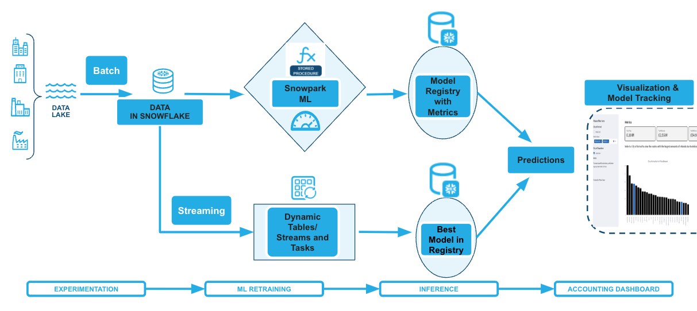

id: managing-ml-models-from-iteration-to-production-with-mlops-in-snowflake
summary: This solution architecture shows you how to manage Machine learning models from experimentation to production using Snowflake MLOps features Snowpark ML Modeling for feature engineering and model training with familiar Python frameworks Snowflake Fea
categories: snowflake-site:taxonomy/solution-center/certification/community-solution
environments: web
language: en
status: Published
feedback link: https://github.com/Snowflake-Labs/sfguides/issues
heroButtonOverrideLabel: View Quickstart
heroButtonOverrideLink: https://www.snowflake.com/en/developers/guides/intro-to-machine-learning-with-snowpark-ml-for-python/

# Managing ML Models from Iteration to Production with MLOps
<!-- ------------------------ -->
## Overview

This solution architecture shows you how to manage Machine learning models from experimentation to production using Snowflake MLOps features

* Snowpark ML Modeling for feature engineering and model training with familiar Python frameworks
* Snowflake Feature Store for continuous, automated refreshes on batch or streaming data
* Snowflake Model Registry to version control models and their metadata
* ML Lineage to trace end-to-end feature and model lineage (currently in private preview)

<!-- ------------------------ -->
## Solution Architecture: MLOps in Snowflake

* Load diamonds quality dataset into a Snowflake table and create features view to include relevant feature for model training
* Use Snowpark dataframe API for feature creation and data transformation, and Snowpark ML API to train an XGB Regressor
* Experiment with the model training and log different model versions in model registry
* Run inference on a select model from the registry
* Track model lineage to capture the training set, features, model parameters, etc for every model in the registry

<!-- ------------------------ -->
## Get Started

- [view quickstart](https://quickstarts.snowflake.com/guide/intro_to_machine_learning_with_snowpark_ml_for_python/)
- [fork repo](https://github.com/Snowflake-Labs/sf-samples/blob/main/samples/ml/mlops_using_model.ipynb)
- [Download reference architecture](https://www.snowflake.com/content/dam/snowflake-site/developers/2024/07/Managing-ML-Models-from-Iteration-to-Production-with-MLOps-in-Snowflake.pdf)
- [Read the Medium blog](https://medium.com/snowflake/end-to-end-machine-learning-with-snowpark-ml-in-snowflake-notebooks-faa42f1f57fc)
