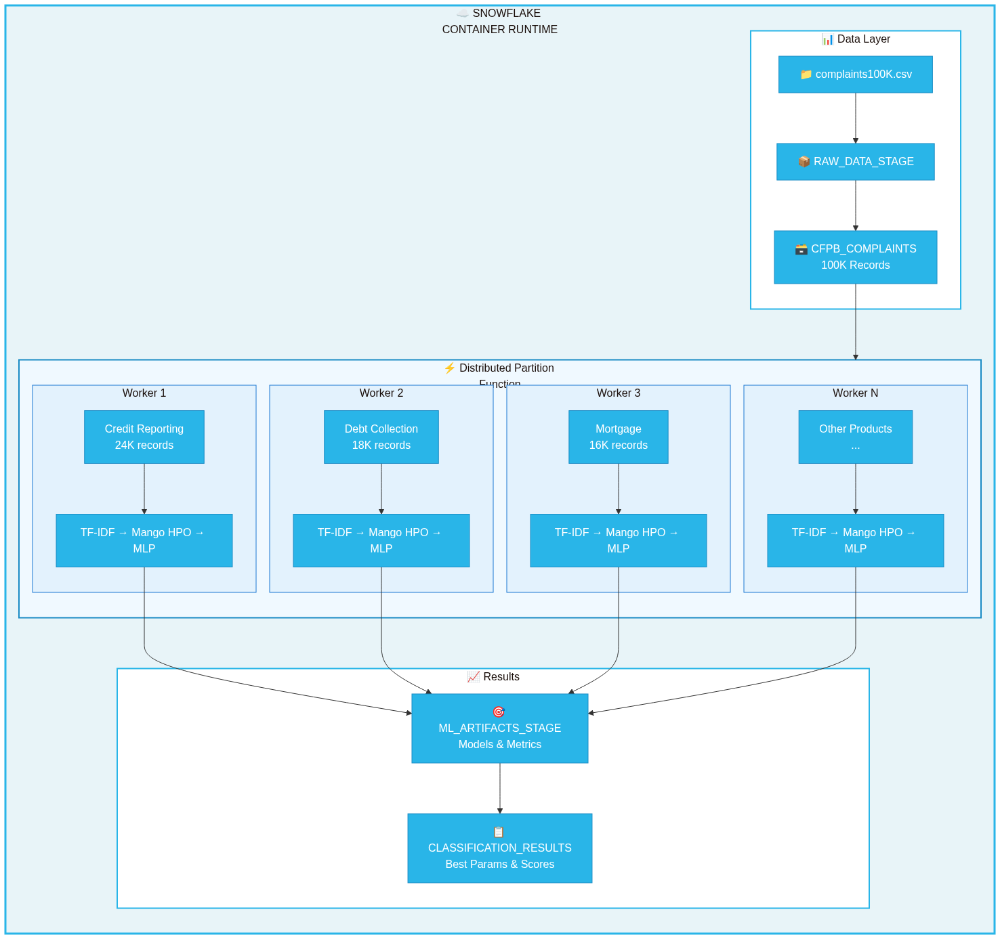

author: Priya Joseph
id: mango-hpo-modernbert-text-classification
language: en
summary: Distributed Text Classification with Mango HPO, TF-IDF, and Snowflake DPF for CFPB Consumer Complaints
categories: snowflake-site:taxonomy/solution-center/data-science-ml
environments: web
status: Published
feedback link: https://github.com/Snowflake-Labs/sfguides/issues
fork repo link: https://github.com/Snowflake-Labs/sfguides

# Distributed Text Classification with Mango HPO and Snowflake DPF

<!-- ------------------------ -->
## Overview


This guide demonstrates building a **production-grade distributed text classification pipeline** using:

| Component | Technology | Purpose |
|-----------|------------|---------|
| HPO | Mango | Bayesian hyperparameter optimization |
| Vectorization | TF-IDF | Text to numeric feature conversion |
| Classifier | MLPClassifier | Multi-layer neural network |
| Distribution | Snowflake DPF | Parallel processing across partitions |
| Data | CFPB Complaints | Real-world consumer financial complaints |

### Source Files

| File | Description |
|------|-------------|
| [src/setup.sql](src/setup.sql) | Database, schema, stages, and table DDL |
| [src/cfpb_pipeline.py](src/cfpb_pipeline.py) | Complete Python pipeline implementation |
| [src/requirements.txt](src/requirements.txt) | Python package dependencies |

### Prerequisites
- Snowflake account with Container Runtime enabled
- Access to a compute pool (CPU nodes)
- Python 3.10+ environment
- CFPB complaints CSV file

### What You'll Learn
- Implement Bayesian hyperparameter optimization with Mango
- Use TF-IDF for text vectorization in distributed environments
- Leverage Snowflake DPF for parallel ML training
- Process unstructured text data at scale

### What You'll Build
- End-to-end text classification pipeline for consumer complaint routing
- Distributed training across multiple product category partitions
- Optimized MLP classifier with tuned hyperparameters

<!-- ------------------------ -->
## Architecture

The pipeline follows a distributed architecture optimized for Snowflake's container runtime:



```
┌─────────────────────────────────────────────────────────────────────────────┐
│                        SNOWFLAKE CONTAINER RUNTIME                          │
├─────────────────────────────────────────────────────────────────────────────┤
│  ┌─────────────┐    ┌─────────────────────────────────────────────────┐     │
│  │   CFPB      │    │           DISTRIBUTED PARTITION FUNCTION        │     │
│  │  Complaints │───▶│  ┌─────────┐ ┌─────────┐ ┌─────────┐ ┌─────────┐│     │
│  │   Table     │    │  │Product 1│ │Product 2│ │Product 3│ │Product N││     │
│  └─────────────┘    │  │ Worker  │ │ Worker  │ │ Worker  │ │ Worker  ││     │
│                     │  │         │ │         │ │         │ │         ││     │
│                     │  │TF-IDF + │ │TF-IDF + │ │TF-IDF + │ │TF-IDF + ││     │
│                     │  │Mango HPO│ │Mango HPO│ │Mango HPO│ │Mango HPO││     │
│                     │  │  + MLP  │ │  + MLP  │ │  + MLP  │ │  + MLP  ││     │
│                     │  └────┬────┘ └────┬────┘ └────┬────┘ └────┬────┘│     │
│                     └───────┼───────────┼───────────┼───────────┼─────┘     │
│                             │           │           │           │           │
│                             ▼           ▼           ▼           ▼           │
│                     ┌─────────────────────────────────────────────────┐     │
│                     │              ML_ARTIFACTS_STAGE                 │     │
│                     │   (Models, Metrics, Best Hyperparameters)       │     │
│                     └─────────────────────────────────────────────────┘     │
└─────────────────────────────────────────────────────────────────────────────┘
```

### Data Flow

1. **Load**: CFPB complaints loaded from CSV to Snowflake table
2. **Partition**: Data partitioned by `PRODUCT` column (18 categories)
3. **Distribute**: DPF assigns each partition to a worker node
4. **Process**: Each worker runs TF-IDF + Mango HPO + MLP training
5. **Store**: Results saved to stage and results table

<!-- ------------------------ -->
## Snowflake Environment Setup

Run the SQL setup script to create all required database objects.

### Download Setup Script

<button>[Download setup.sql](src/setup.sql)</button>

### Quick Setup

Copy and run in a Snowflake worksheet:

```sql
-- Create database and schema
CREATE DATABASE IF NOT EXISTS CFPB_ML_DB;
CREATE SCHEMA IF NOT EXISTS CFPB_ML_DB.TEXT_ANALYTICS;
USE DATABASE CFPB_ML_DB;
USE SCHEMA TEXT_ANALYTICS;

-- Create stages
CREATE STAGE IF NOT EXISTS ML_ARTIFACTS_STAGE DIRECTORY = (ENABLE = TRUE);
CREATE STAGE IF NOT EXISTS RAW_DATA_STAGE DIRECTORY = (ENABLE = TRUE);
```

> **Full Setup**: See [src/setup.sql](src/setup.sql) for complete DDL including tables, file formats, and verification queries.

### Tables Created

| Table | Purpose |
|-------|---------|
| `CFPB_COMPLAINTS` | Source data - consumer complaint narratives |
| `CLASSIFICATION_RESULTS` | Output - training metrics and best parameters |

<!-- ------------------------ -->
## Load CFPB Data

Load the CFPB complaints data into Snowflake.

### Option 1: Via Stage (Recommended for Large Files)

```bash
# Upload file to stage (run from SnowSQL or Snowflake CLI)
snow stage put /path/to/complaints100K.csv @RAW_DATA_STAGE/
```

```sql
-- Load into table
COPY INTO CFPB_COMPLAINTS
FROM @RAW_DATA_STAGE/complaints100K.csv
FILE_FORMAT = (TYPE='CSV' FIELD_OPTIONALLY_ENCLOSED_BY='"' SKIP_HEADER=1)
ON_ERROR = 'CONTINUE';
```

### Option 2: Via Python

```python
import pandas as pd
from snowflake.snowpark.context import get_active_session

df = pd.read_csv('/path/to/complaints100K.csv')
session = get_active_session()
session.write_pandas(df, 'CFPB_COMPLAINTS', auto_create_table=True, overwrite=True)
```

### Verify Data

```sql
SELECT PRODUCT, COUNT(*) AS RECORDS
FROM CFPB_COMPLAINTS
WHERE CONSUMER_COMPLAINT_NARRATIVE IS NOT NULL
GROUP BY PRODUCT ORDER BY RECORDS DESC;
```

<!-- ------------------------ -->
## Pipeline Code

The complete pipeline is implemented in `src/cfpb_pipeline.py`.

### Download Files

<button>[Download cfpb_pipeline.py](src/cfpb_pipeline.py)</button>
<button>[Download requirements.txt](src/requirements.txt)</button>

### Dependencies

Install required packages (from [src/requirements.txt](src/requirements.txt)):

```bash
pip install arm-mango>=1.3.0 scikit-learn>=1.3.0 pandas numpy
```

### Configuration

The pipeline uses a configuration dataclass defined in [src/cfpb_pipeline.py](src/cfpb_pipeline.py):

```python
@dataclass
class PipelineConfig:
    database: str = 'CFPB_ML_DB'
    schema: str = 'TEXT_ANALYTICS'
    partition_column: str = 'PRODUCT'
    text_column: str = 'CONSUMER_COMPLAINT_NARRATIVE'
    label_column: str = 'ISSUE'
    max_features: int = 5000
    hpo_iterations: int = 15
```

### Mango HPO Search Space

```python
PARAM_SPACE = {
    'hidden_layer_sizes': [(64,), (128,), (64, 32), (128, 64), (256, 128)],
    'alpha': [0.0001, 0.001, 0.01, 0.1],
    'learning_rate_init': [0.001, 0.01, 0.1],
    'activation': ['relu', 'tanh'],
    'max_iter': [200, 500, 1000]
}
```

### DPF Worker Function

The `process_text_partition()` function in [src/cfpb_pipeline.py](src/cfpb_pipeline.py) runs on each worker node:

1. Filters valid records with text narratives
2. Applies TF-IDF vectorization (5000 features, bigrams)
3. Runs Mango Bayesian HPO (15 iterations)
4. Trains final MLP with best parameters
5. Returns accuracy, F1 score, and hyperparameters

<!-- ------------------------ -->
## Run the Pipeline

Execute the pipeline in a Snowflake Notebook with Container Runtime.

### Step 1: Create Notebook

1. Navigate to **Notebooks** in Snowflake
2. Create new notebook with **Container Runtime** enabled
3. Select a CPU compute pool

### Step 2: Upload Pipeline Code

Upload [src/cfpb_pipeline.py](src/cfpb_pipeline.py) to your notebook environment or paste inline.

### Step 3: Install Dependencies

```python
!pip install arm-mango scikit-learn
```

### Step 4: Run Pipeline

```python
from cfpb_pipeline import run_distributed_text_classification

results = run_distributed_text_classification()
```

### Expected Output

```
======================================================================
DISTRIBUTED TEXT CLASSIFICATION WITH MANGO HPO + DPF
======================================================================
📦 Database: CFPB_ML_DB
📦 Schema: TEXT_ANALYTICS
📊 Total records: 100,000
📊 Records with text: 87,432
📍 Partitions: 18

🚀 Starting distributed HPO across partitions...

======================================================================
RESULTS BY PARTITION
======================================================================
✅ Credit reporting...
   Records: 24,532 | Classes: 47
   Accuracy: 68.42% | F1: 0.6721
   Best: hidden=(128,64), alpha=0.001

✅ Debt collection
   Records: 18,234 | Classes: 23
   Accuracy: 72.15% | F1: 0.7089

======================================================================
SUMMARY
======================================================================
📊 Partitions Processed: 18
📊 Average Accuracy: 69.8%
📊 Average F1 Score: 0.6834
⏱️  Parallel Speedup: ~14.7x
```

<!-- ------------------------ -->
## Performance Considerations

### DPF Scaling Formula

```
DPF Time ≈ Overhead (20-30s) + max(Partition Times)
Sequential Time = Sum of all Partition Times
Speedup = min(num_partitions, num_nodes)
```

### Scaling Examples

| Nodes | Partitions | Speedup |
|-------|------------|---------|
| 4 | 4 | ~4x |
| 8 | 18 | ~8x |
| 18 | 18 | ~18x |

### Optimization Tips

| Parameter | Recommendation |
|-----------|----------------|
| `max_features` | 5000-10000 balances accuracy/speed |
| `hpo_iterations` | 15-25 for thorough search |
| `min_samples` | 100+ per partition |
| Partitioning | Choose balanced distribution column |

<!-- ------------------------ -->
## Conclusion and Resources

You've built a distributed text classification pipeline using Mango HPO and Snowflake DPF.

### What You Learned
- ✅ Bayesian hyperparameter optimization with Mango
- ✅ TF-IDF vectorization for text data
- ✅ Snowflake DPF for parallel ML training
- ✅ Processing CFPB complaints at scale

### Source Files Reference

| File | Description |
|------|-------------|
| [src/setup.sql](src/setup.sql) | Complete SQL DDL |
| [src/cfpb_pipeline.py](src/cfpb_pipeline.py) | Full Python implementation |
| [src/requirements.txt](src/requirements.txt) | Dependencies |

### Related Resources

| Resource | Link |
|----------|------|
| Mango HPO | [arm-mango on PyPI](https://pypi.org/project/arm-mango/) |
| Snowflake DPF | [Process Data Across Partitions](https://docs.snowflake.com/en/developer-guide/snowflake-ml/process-data-across-partitions) |
| CFPB Database | [Consumer Complaints](https://www.consumerfinance.gov/data-research/consumer-complaints/) |
| Snowflake ML | [ML Functions Overview](https://docs.snowflake.com/en/guides-overview-ml-functions) |

### Next Steps
- Add model persistence to Snowflake Model Registry
- Build inference pipeline with saved models
- Add Cortex Search for similarity-based routing
- Create Streamlit dashboard for visualization
