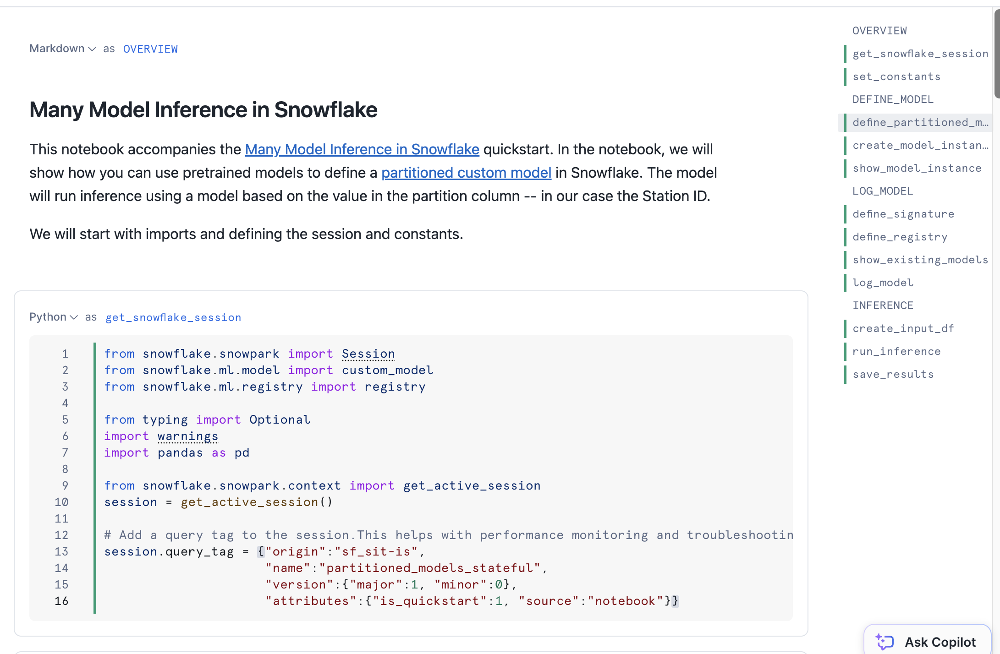

author: Charlie Hammond
id: many-model-inference-in-snowflake
categories: snowflake-site:taxonomy/solution-center/certification/quickstart, snowflake-site:taxonomy/product/data-engineering
language: en
summary: Easily run inference on many models in Snowflake 
environments: web
status: Published 
feedback link: https://github.com/Snowflake-Labs/sfguides/issues

# Many Model Inference in Snowflake
<!-- ------------------------ -->
## Overview 

Many datasets can be easily partitioned into multiple independent subsets. For example, a dataset containing sales data for a chain of stores can be partitioned by store number. A separate model can then be trained for each partition. Training and inference operations on the partitions can be parallelized, reducing the wall-clock time for these operations. Furthermore, since individual stores likely differ somewhat in how their features affect their sales, this approach can actually lead to more accurate inference at the store level.

In this quickstart, you will use the [Snowflake Model Registry](https://docs.snowflake.com/en/developer-guide/snowpark-ml/model-registry/overview) to implement [partitioned](https://docs.snowflake.com/en/developer-guide/snowpark-ml/model-registry/partitioned-custom-models) inference using custom models. When using the model, the registry partitions the dataset and predicts the partitions in parallel using all the nodes and cores in your warehouse. Finally, it combines the results into a single dataset. This differs from the [Getting Started with Partitioned Models in Snowflake Model Registry](/en/developers/guides/partitioned-ml-model/) quickstart by implementing a "stateful" model that runs training independently of inference. This allows you to pretrain a list of models, then log them as a single model in Snowflake which loads fitted models during inference.

### Prerequisites
- Access to a Snowflake account with Accountadmin. 
- Access to run Notebooks in Snowflake
- Foundational knowledge of Data Science workflows

### What You Will Learn 
- How to use Snowflake Model Registry to implement paritioned model inference

### What You’ll Need 
- A [Snowflake](https://app.snowflake.com/) Account

### What You’ll Build 
- A "stateful" partitioned custom model

<!-- ------------------------ -->
## Setup Your Account

Complete the following steps to setup your account:
- Navigate to Worksheets, click "+" in the top-right corner to create a new Worksheet, and choose "SQL Worksheet".
- Paste and the following SQL in the worksheet 
- Adjust <YOUR_USER> to your user
- Run all commands to create Snowflake objects

```sql
USE ROLE ACCOUNTADMIN;

-- Using ACCOUNTADMIN, create a new role for this exercise and grant to applicable users
CREATE OR REPLACE ROLE MANY_MODELS_USER;
GRANT ROLE MANY_MODELS_USER to USER <YOUR_USER>;

-- create our virtual warehouse. We'll use snowpark optimized to ensure we have enough memory
CREATE OR REPLACE WAREHOUSE MANY_MODELS_WH WITH
  WAREHOUSE_SIZE = 'MEDIUM'
  WAREHOUSE_TYPE = 'SNOWPARK-OPTIMIZED';

GRANT ALL ON WAREHOUSE MANY_MODELS_WH TO ROLE MANY_MODELS_USER;

-- Next create a new database and schema,
CREATE OR REPLACE DATABASE MANY_MODELS_DATABASE;
CREATE OR REPLACE SCHEMA MANY_MODELS_SCHEMA;

GRANT OWNERSHIP ON DATABASE MANY_MODELS_DATABASE TO ROLE MANY_MODELS_USER COPY CURRENT GRANTS;
GRANT OWNERSHIP ON ALL SCHEMAS IN DATABASE MANY_MODELS_DATABASE  TO ROLE MANY_MODELS_USER COPY CURRENT GRANTS;

```

<!-- ------------------------ -->
## Run the Notebooks

### Setup Notebook
- Download the setup notebook from this [link](https://github.com/Snowflake-Labs/sfguide-many-model-inference-in-snowflake/blob/main/notebooks/0_start_here.ipynb)
- Change role to MANY_MODELS_USER
- Navigate to Projects > Notebooks in Snowsight
- Click Import .ipynb from the + Notebook dropdown
- Create a new notebok with the following settings
  - Notebook Location: MANY_MODELS_DATABASE, MANY_MODELS_SCHEMA
  - Warehouse: MANY_MODELS_WH
- Click Packages in the top right, add `snowflake-ml-python` and `cloudpickle==2.2.1`
- Run all of the cells

### Demo Notebook
- Download the demo notebook from this [link](https://github.com/Snowflake-Labs/sfguide-many-model-inference-in-snowflake/blob/main/notebooks/1_many_model_inference.ipynb)
- Run the same steps above to import the notebook, then run it



<!-- ------------------------ -->
## Conclusion And Resources

Partitioning datasets for machine learning enables efficient parallel processing and improved accuracy by tailoring models to specific subsets of data, such as store-specific sales trends. With Snowflake’s Model Registry, you can seamlessly implement partitioned inference using stateful models. This approach allows you to train models independently for each partition, log them as a single model, and leverage Snowflake’s compute resources to perform parallelized inference across all partitions.

By adopting this workflow, you reduce wall-clock time for training and inference, enhance scalability, and improve prediction accuracy at the partition level. Take advantage of Snowflake’s capabilities to streamline your machine learning pipeline—start exploring partitioned modeling with Snowflake’s [Model Registry documentation](https://docs.snowflake.com/en/developer-guide/snowpark-ml/model-registry/overview) and [quickstart guides](/en/developers/guides/partitioned-ml-model/) today!

### What You Learned
- How to implemente a "stateful" custom partitioned model in Snowflake

### Related Resources
- [Snowflake Model Registry Documentation](https://docs.snowflake.com/en/developer-guide/snowpark-ml/model-registry/overview)
- [Partitioned Model Documentation](https://docs.snowflake.com/en/developer-guide/snowpark-ml/model-registry/partitioned-custom-models)
- [Getting Started with Partitioned Models in Snowflake Model Registry Quickstart](/en/developers/guides/partitioned-ml-model/)
