author: Manuel Figueroa, Joviane Bellegarde
id: marketing-data-foundation-starter-v3
categories: snowflake-site:taxonomy/solution-center/certification/quickstart, snowflake-site:taxonomy/product/data-engineering, snowflake-site:taxonomy/product/applications-and-collaboration, snowflake-site:taxonomy/snowflake-feature/build
language: en
summary: Marketing Data Foundation Starter Guide 
environments: web
status: Published
feedback link: https://github.com/Snowflake-Labs/sfguides/issues
fork repo link: https://github.com/Snowflake-Labs/sfguide-marketing-data-foundation-starter-v3


# Marketing Data Foundation Starter Guide
<!-- ------------------------ -->
## Overview 


Customers looking to use Snowflake for marketing use cases initially face a significant challenge: it is difficult to import all relevant marketing data into Snowflake and structure it in a unified format that downstream applications can easily utilize to power data-driven marketing. This starter solution tackles this challenge by offering an integrated application that unifies data sets from different Connectors and Marketing Data providers.

In this example we are adding support for: 
- Fivetran / Facebook Ads
- Omnata / LinkedIn Ads

This solution was inspired by how Snowflake runs its own end-to-end Marketing workflows entirely on top of the Snowflake Marketing Data Cloud.

In the fast-evolving marketing landscape, the emphasis on data-driven strategies has become more pronounced than ever. A significant trend is the increase in Martech investments, with 63% of Chief Marketing Officers (CMOs) planning to increase their spending within the next 12 months. Such investments are crucial for enhancing customer engagement, refining marketing strategies, and driving sales through advanced data analysis. The high ROI that businesses achieve from data-driven personalization also highlights its importance. Reports indicate that enterprises see returns of 5 to 8 times on their marketing budgets, which demonstrates the value of personalized marketing in boosting conversion rates, enhancing customer loyalty, and increasing revenue.

Additionally, the industry is shifting towards first-party data ownership, a move propelled by the deprecation of third-party cookies. This shift is essential for maintaining direct customer relationships and adapting to changing privacy norms. The promise of generative AI and the understanding that an effective AI strategy requires a robust data strategy have spurred efforts to centralize marketing data within Snowflake. Organizations aim to organize data into standard schemas that Large Language Models (LLMs) can understand, employing these models in innovative ways to personalize content and predict customer behavior. Two types of first-party data are pivotal in these efforts: Customer 360 Data and Campaign Intelligence. The former strives to provide a holistic view of the customer by integrating and managing comprehensive data. In contrast, Campaign Intelligence focuses on data related to marketing campaigns, aiming to optimize performance and strategy. These elements are fundamental to successful data-driven marketing, underscoring the need for sophisticated data management and analytics capabilities.

### Context
As described in the diagram below, the two Data Foundation use cases in this starter lay the groundwork to support the two Marketing Execution use cases: Planning & Activation, and Measurement.

As described in the diagram below, the two Data Foundation use cases in this starter lay the groundwork to support the two Marketing Execution use cases: Planning & Activation, and Measurement.

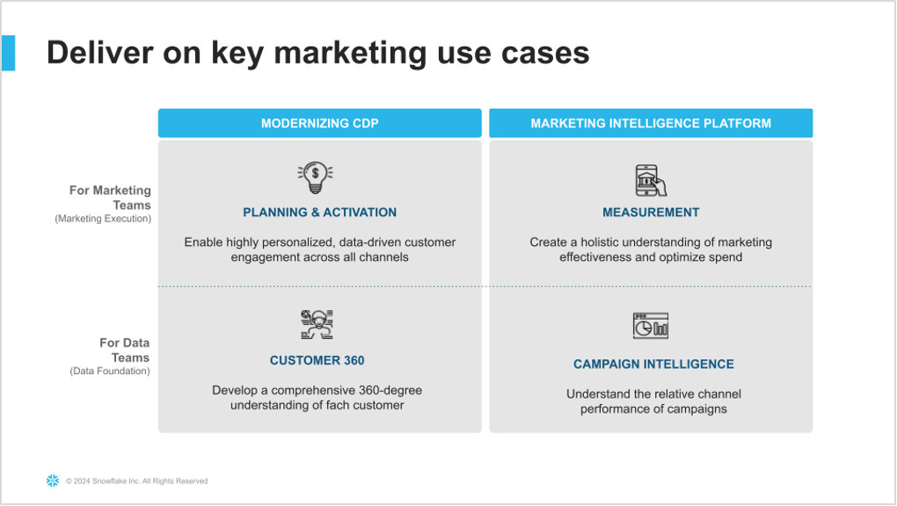

More specifically, this solution covers Data Ingestion, Semantic Unification, and based Analytics use cases for Customer 360 and Campaign Intelligence data.


### Architecture
This demo consists of a native application that provides a framework to easily unify marketing data sources and then leverage LLM functions to explore that data and get valuable business intelligence information from the data that was ingested.

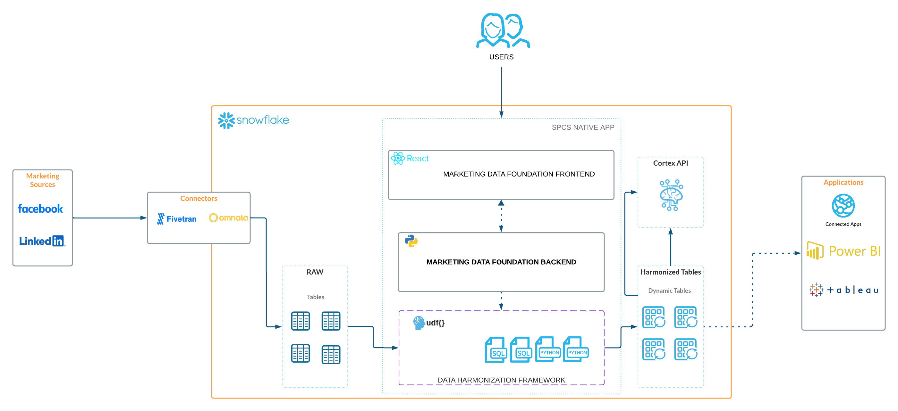

### What You Will Learn
- How to build a native application in Snowflake and how to deploy the same to your account using Snow CLI quickly.
- How to use Snowpark Python to build a data pipeline that ingests data from different sources and unifies it into a single source of truth for Marketing Data.

### What You Will Build
- A Native Application that ingests data from different sources and unifies it into a single source of truth for Marketing Data.

### Prerequisites
- Go to the [Snowflake Account](https://signup.snowflake.com/?utm_source=snowflake-devrel&utm_medium=developer-guides&utm_cta=developer-guides) sign-up page and register for a free account. After registration, you will receive an email containing a link that will take you to Snowflake, where you can sign in.
- A Snowflake Role with access to create Compute Pools, create Warehouses and Databases.
- A [GitHub](https://github.com/) Account.
- [VSCode](https://code.visualstudio.com/download) Installed.
- [Snow CLI](https://docs.snowflake.com/developer-guide/snowflake-cli/index) Installed.
- [Docker Desktop](https://www.docker.com/products/docker-desktop/) Installed.
- [Python](https://www.python.org/downloads/) Installed.

> **Note:** This guide assumes your connector data (Fivetran for Facebook Ads, Omnata for LinkedIn Ads) is already loaded into your Snowflake account. The app helps you link and transform this existing data. Sample data is also provided if you don't have connectors configured.


<!-- ------------------------ -->
## Setup

### Clone GitHub repository

Clone the git repo to your local machine:
```console
git clone https://github.com/Snowflake-Labs/sfguide-marketing-data-foundation-starter-v3
```

### Create a connection

```console
snow connection add
```

Refer to the following below to create a connection:
```shell
Enter connection name: marketing_demo_v3_conn
Enter account: [type in your account locator]
Enter user: [type in your username]
Enter password: [type in your password]
Enter role: accountadmin
Enter warehouse: [optional: press ENTER to skip]
Enter database: snowflake
Enter schema: account_usage
Enter host: [optional: press ENTER to skip]
Enter port: [optional: press ENTER to skip]
Enter region: [optional: press ENTER to skip]
Enter authenticator: [optional: press ENTER to skip]
Enter private key file: [optional: press ENTER to skip]
Enter token file path: [optional: press ENTER to skip]
Wrote new connection marketing_demo_v3_conn to /path_to_your_configuration_file/.snowflake/connections.toml
```

Let's set the connection to the default connection:
```console
snow connection set-default marketing_demo_v3_conn
```

To review the new created connection use:
```console
snow connection list
```

Refer to the desired output below:
```shell
+------------------------+------------------------------------------------------------------------------------------------------------------------------------------+---------------+
| connection_name        | parameters                                                                                                                               | is_default    |
|------------------------+------------------------------------------------------------------------------------------------------------------------------------------+---------------|
| marketing_demo_v3_conn | {'account': '******', 'user': '******', 'password': '****', 'database': 'snowflake', 'schema': 'account_usage', 'role': 'accountadmin'}  | True          |
+------------------------+------------------------------------------------------------------------------------------------------------------------------------------+---------------+
```


<!-- ------------------------ -->
## Deploy the Native App

### Docker Desktop
Ensure that Docker Desktop is running and that you're signed in to your Docker account.

### Bypass MFA
Create a Worksheet in Snowsight and run the following command to disable MFA for 45 minutes. This statement is to allow the many cells in the Jupyter Notebook to run successfully without waiting for MFA approval from the user.
```sql
ALTER USER <replace with your user> SET MINS_TO_BYPASS_MFA = 45;
```

### Open Docker Desktop
Open Docker Desktop and sign into your Docker account. Leave the Docker Desktop application open in the background.

### To use VSCode
Open the project with VSCode and select the [**deployment.ipynb**](https://github.com/Snowflake-Labs/sfguide-marketing-data-foundation-starter-v3/blob/main/scripts/deployment_na_spcs.ipynb) file from the File explorer. Then, select the virtual environment you created as the execution kernel for this notebook.

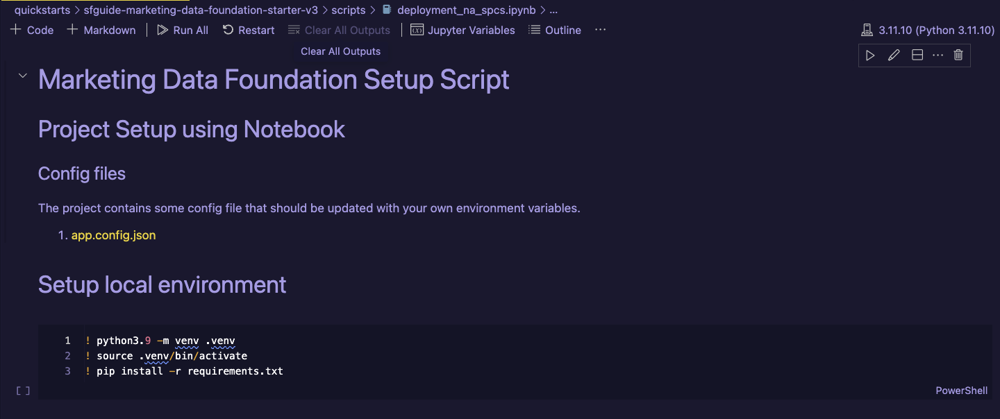

Click on the **Run All** button to execute all the code cells described in this notebook, or you can execute each cell manually.

After the execution of this notebook you will see some new assets created in your Snowflake account. The application and the application package should be listed in your databases list.

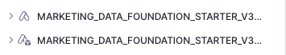

<!-- ------------------------ -->
## Open the Native App

### Open the Native App

In the ***Data Products/ Apps*** section, you will see the recently created Marketing Data Foundation native application:

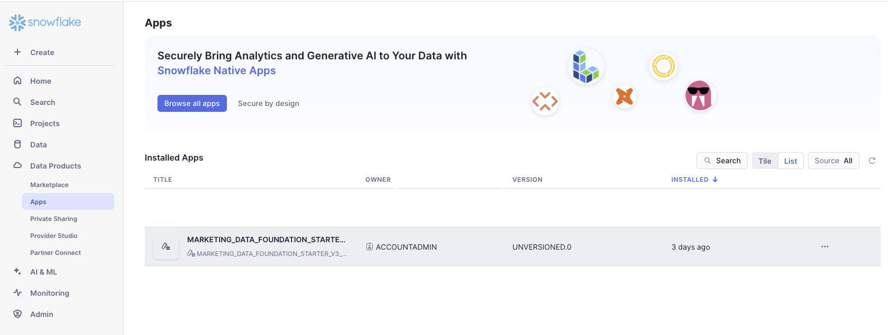


<!-- ------------------------ -->
## Use the Native App

After you deploy this native app in your account, navigate to
the Data Products / Apps section in Snowsight and open the  
**Marketing Data Foundation** application.


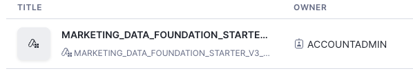


Take some time to grant privileges to `IMPORTED PRIVILEGES ON SNOWFLAKE DB`, `CREATE COMPUTE POOL`, `BIND SERVICE ENDPOINT`, and`CREATE WAREHOUSE`. Afterward, click on **Update Privileges** and **Launch app**.

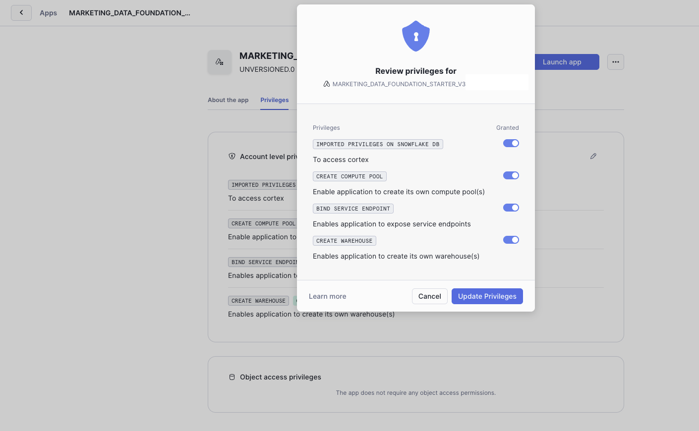

### 1. Select the Data provider
 
 To execute the solution click **Add New Source** at the top of the page and open the Data Models & Mappings section in the application's sidebar menu. You will see the list of supported Data source providers. For this version only Facebook and LinkedIn are supported.

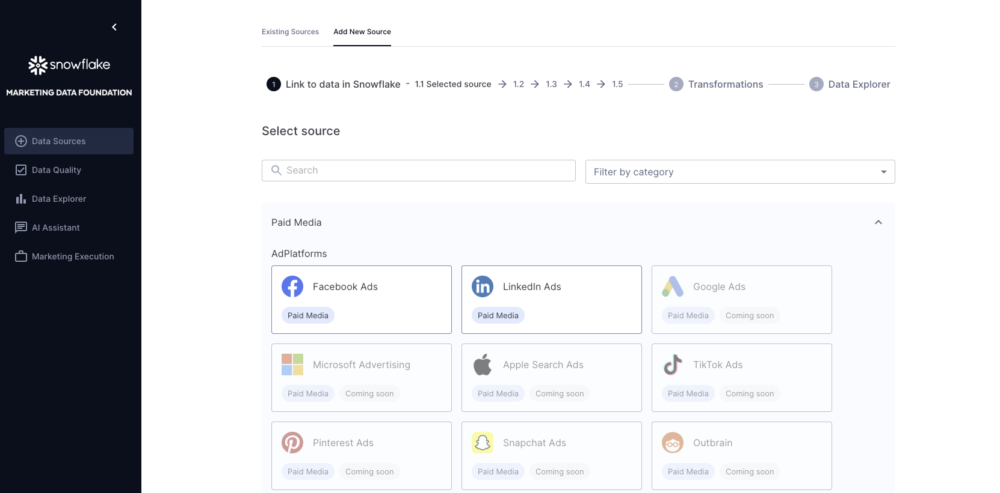

Select any of those options to continue with the solution. Sample data are provided for both options so it is not a requirement to have Fivetran or Omnata installed and configured.

The provided sample data emulates the structure of the raw data generated by both connectors.

For this solution, only the combinations of Fivetran/Facebook and Linked/Omnata are supported.


### 2. Configure the connection

After you select any of the Data providers options you will continue to the Connection configuration.

These steps will provide instructions on how to bring the data to Snowflake or connect it with data already in Snowflake.

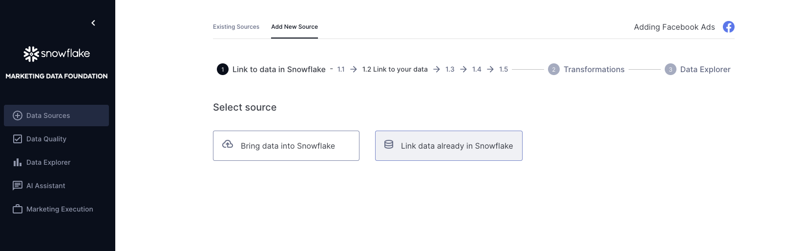

#### Option A: Using Sample Data (Recommended for Demo)

Since we are going to use the sample data, you can continue to the ***Link data already in Snowflake*** option.

Depending on the platform selected in the previous step, please select either of these options:

**Facebook via Fivetran:**
 - DATABASE: `FIVETRAN_CONNECTOR_DEMO` 
 - SCHEMA: `FACEBOOK_RAW` 

**LinkedIn via Omnata:**
 - DATABASE: `OMNATA_CONNECTOR_DEMO` 
 - SCHEMA: `LINKEDIN_RAW`

When you click on the connect option, the application will verify you have access to the sample data and will show you the list of tables in the selected schema.

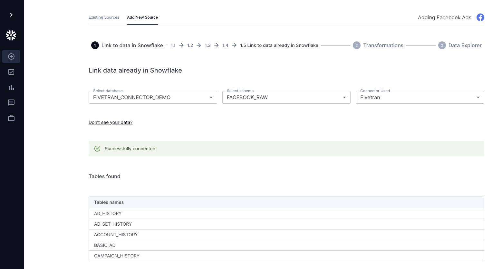

#### Option B: Using Your Own Connector Data

If you have Fivetran or Omnata connectors already configured:

**For Facebook Ads via Fivetran:**
1. Ensure your Fivetran connector is syncing Facebook Ads data to Snowflake
2. Select ***Link data already in Snowflake***
3. Choose your Fivetran destination database and the Facebook schema
4. The app will validate that the required tables exist

**For LinkedIn Ads via Omnata:**
1. Ensure your Omnata connector is syncing LinkedIn Ads data to Snowflake
2. Select ***Link data already in Snowflake***
3. Choose your Omnata database and LinkedIn schema
4. The app will validate that the required tables exist

> **Note:** Connector setup (Fivetran/Omnata configuration, authentication, sync schedules) must be completed in your connector platform before using this app. The app only links to and transforms existing data.


### 3. Explore and Apply Mappings

This application applies a set of predefined mappings to generate a unified marketing data model that can be used for business intelligence over the data that was ingested.

You can explore or apply the mappings using the options provided in this screen:

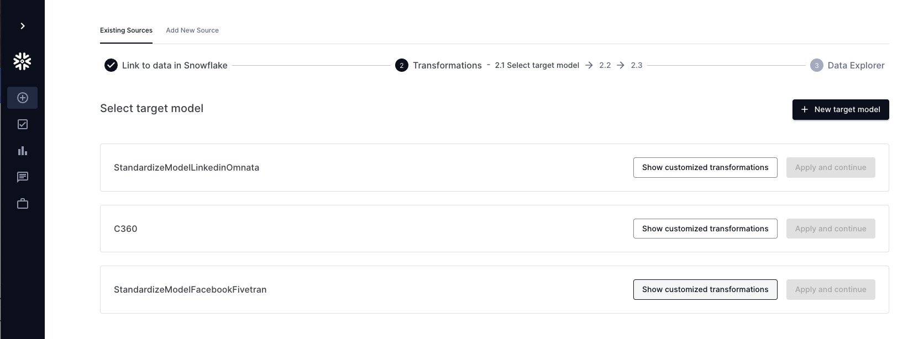

The mappings are shown using a custom component that highlights the columns used from the source data and the target column in the unified data model:

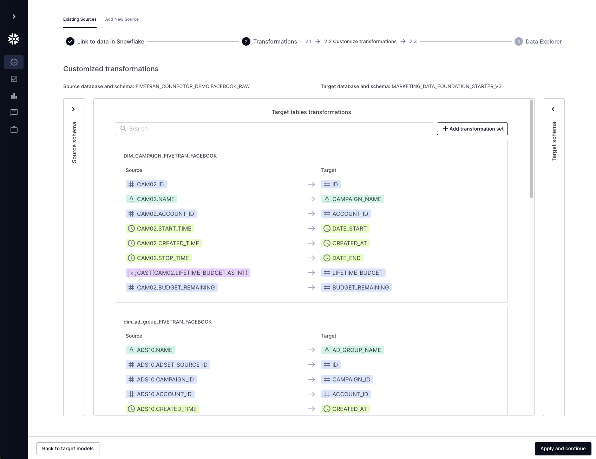


### 4. Visualizations

After you apply the mappings the application will generate several schemas inside the application's database. 
The unified data model will be used to generate some basic visualizations that provide insights about the ingested data:

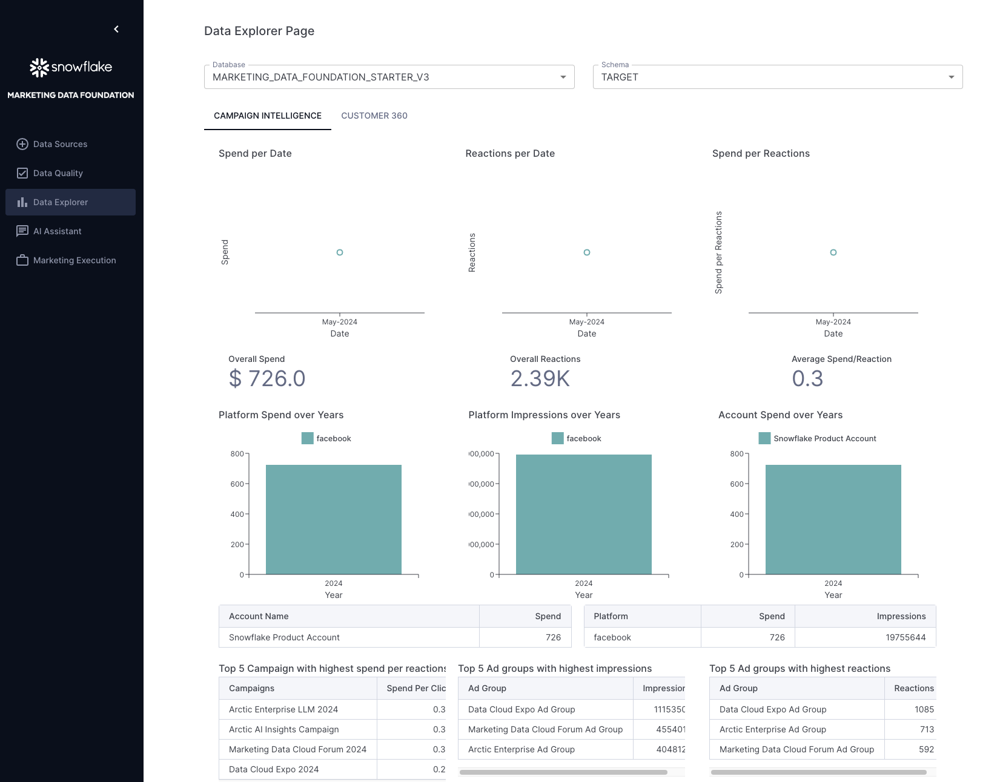

The unified data model is stored in the Database ```MARKETING_DATA_FOUNDATION_STARTER_V3_USERNAME``` (replace with your username) and the Schema ```TARGET```.

### 5. AI Functions

The application also provides AI Functions that can be explored:

#### Data Quality
Provides access to a set of predefined Snowflake Notebooks with some sample Customer 360 cases.

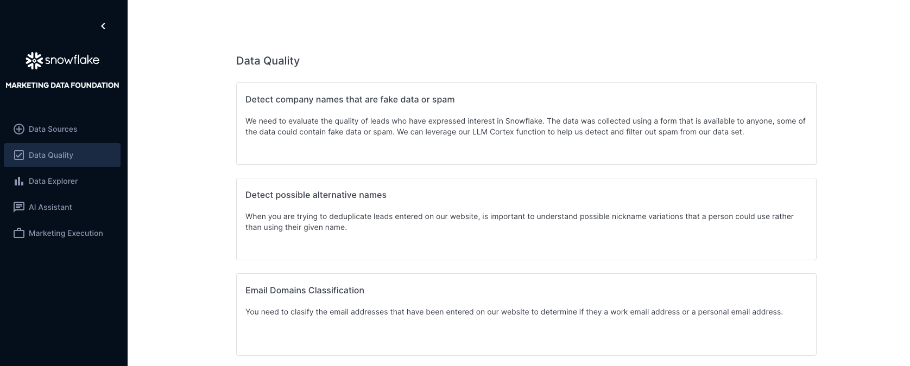

#### AI Assistant Bot

Under the AI Assistant option you will find a Chatbot that allows you to ask questions related to either Data Engineering using your ingested data as input.

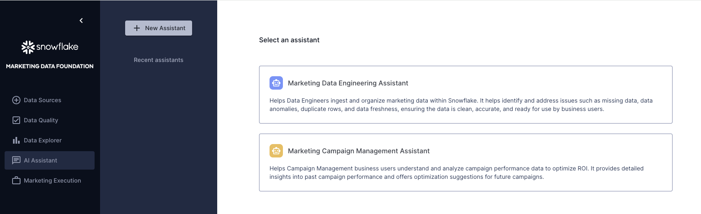

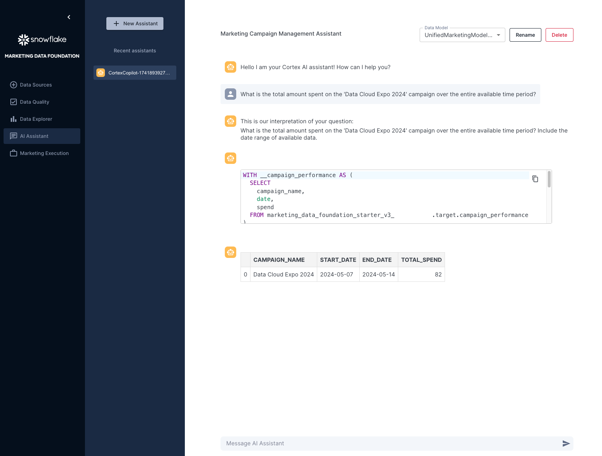


<!-- ------------------------ -->
## Restart the Solution
If you connect both Data providers and want to start the solution again, you can execute this clean-up script in an SQL Worksheet to delete the Unified Data Model tables and clean up the connected sources.


```SQL
USE ROLE ACCOUNTADMIN;

-- Replace NAME with the actual value of your database
DROP DATABASE IF EXISTS MARKETING_DATA_FOUNDATION_STARTER_V3_NAME CASCADE;
DROP DATABASE IF EXISTS MARKETING_DATA_FOUNDATION_V3 CASCADE;
DROP DATABASE IF EXISTS C360_SAMPLE_DB CASCADE;
DROP DATABASE IF EXISTS FIVETRAN_CONNECTOR_DEMO CASCADE;
DROP DATABASE IF EXISTS DATA_QUALITY_NOTEBOOKS CASCADE;
DROP DATABASE IF EXISTS OMNATA_CONNECTOR_DEMO CASCADE;
DROP DATABASE IF EXISTS LLM_DEMO CASCADE;

-- Replace application name with your application name
DROP APPLICATION IF EXISTS MARKETING_DATA_FOUNDATION_STARTER_V3_REPLACE_WITH_YOUR_APPLICATION_NAME CASCADE;
-- Replace application package name with your application package name
DROP APPLICATION PACKAGE IF EXISTS MARKETING_DATA_FOUNDATION_STARTER_V3_PKG_REPLACE_WITH_YOUR_APPLICATION_PACKAGE_NAME; 

ALTER COMPUTE POOL IF EXISTS MARKETING_DATA_FOUNDATION_COMPUTE_POOL STOP ALL;
DROP COMPUTE POOL IF EXISTS MARKETING_DATA_FOUNDATION_COMPUTE_POOL;

DROP WAREHOUSE IF EXISTS MARKETING_DATA_FOUNDATION_WAREHOUSE;
DROP WAREHOUSE IF EXISTS MDFSV3SPCS_XSMALL_WH;
DROP WAREHOUSE IF EXISTS MDFSV3SPCS_BUILD_WH;

DROP ROLE IF EXISTS MARKETING_DATA_FOUNDATION_V3_ROLE;
```

Use this cleanup script to remove all objects created in this Guide.
<!-- ------------------------ -->
## Conclusion And Resources

### Overview

Congratulations! You have successfully learned how to easily build an end-to-end Native Application and load sample data.

### What You Learned

* How to host and build a basic native app for Marketing Campaign Intelligence data.
* Generate a set of views that aggregate data from Marketing providers like LinkedIn and Facebook.
* Generate quick summaries and Charts using that data to create an integrated dashboard using Streamlit.

### Resources

Want to learn more about the tools and technologies used by your app? Check out the following resources:

* [Source Code on GitHub](https://github.com/Snowflake-Labs/sfguide-marketing-data-foundation-solution)
* [Snowpark Python Developer Guide](https://docs.snowflake.com/en/developer-guide/snowpark/python/index)
* [Snowpark Guide for Data Engineers](/resource/the-data-engineers-guide-to-python-for-snowflake/)
* [Watch the Demo](https://youtu.be/_4ws-vgUOcQ?list=TLGGy7ICEHIG2xEyNDA5MjAyNQ)
* [Download Reference Architecture](/content/dam/snowflake-site/developers/2024/09/Campaign-Intelligence-reference-architecture.pdf)
* [Fork the Repo](https://github.com/Snowflake-Labs/sfguide-marketing-data-foundation-starter-v3)
* [Read the Blog](https://medium.com/snowflake/tips-for-data-teams-building-campaign-intelligence-5a1955f7d533)
