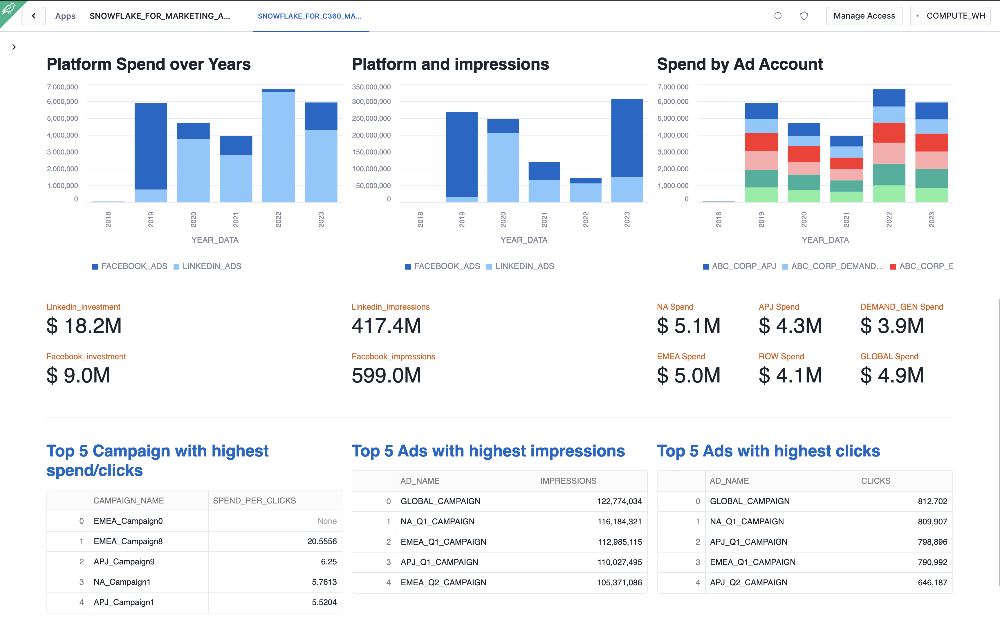
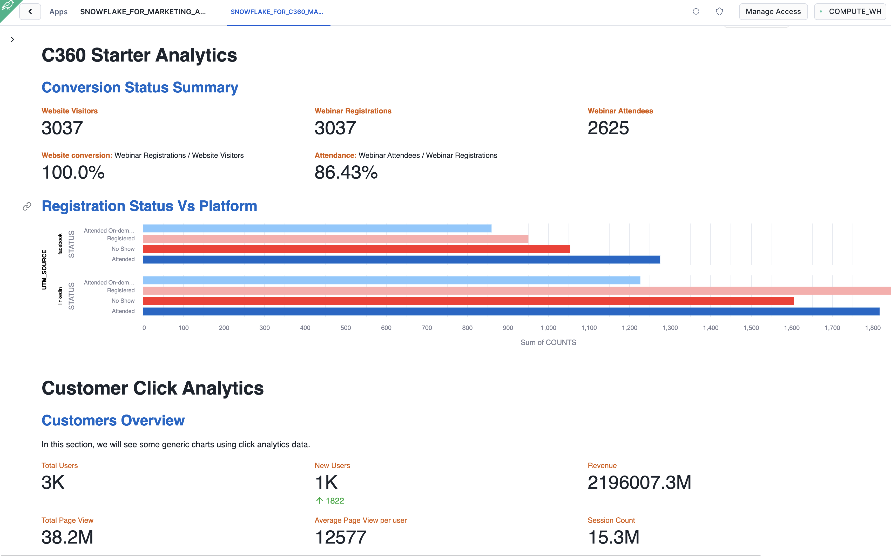
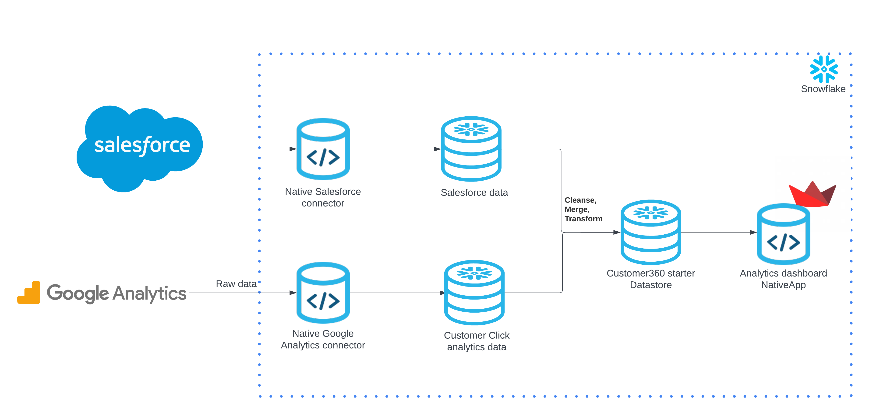
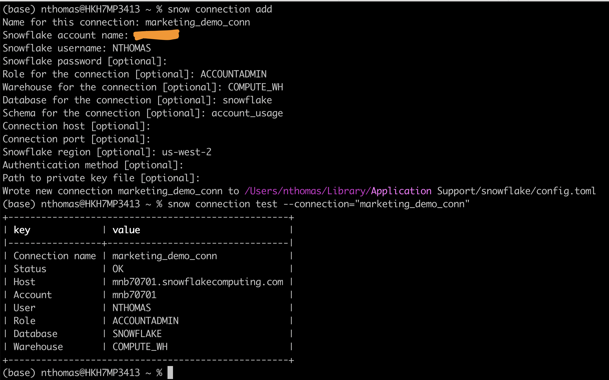
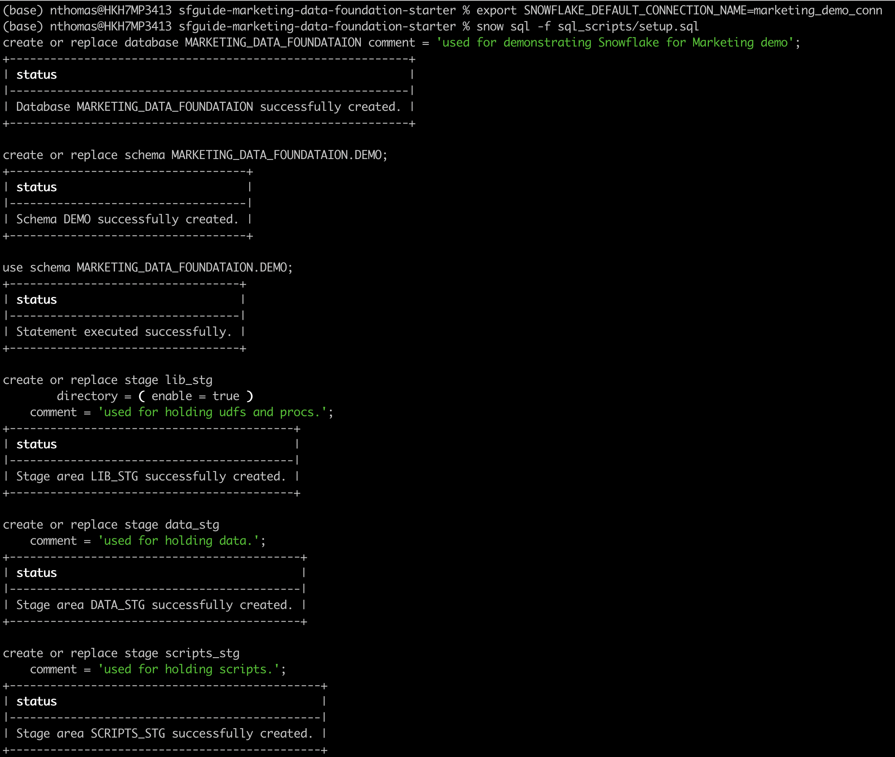
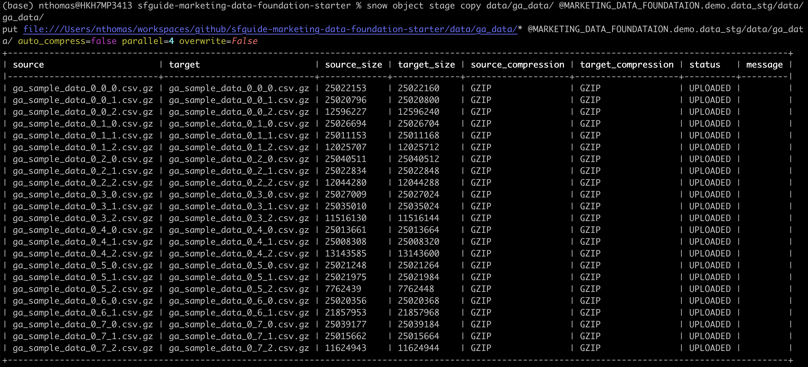
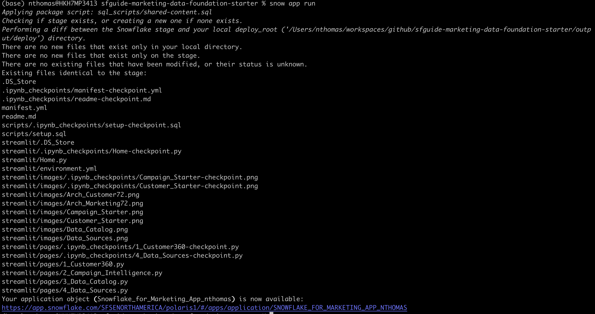

author: NaveenAlanThomas
id: marketing-data-foundation-starter
categories: snowflake-site:taxonomy/solution-center/certification/quickstart, snowflake-site:taxonomy/product/data-engineering, snowflake-site:taxonomy/product/applications-and-collaboration, snowflake-site:taxonomy/snowflake-feature/build
language: en
summary: Marketing Data Foundation Starter Guide
environments: web
status: Hidden
feedback link: https://github.com/Snowflake-Labs/sfguides/issues


# Marketing Data Foundation Starter Guide
<!-- ------------------------ -->
## Overview 


Customers looking to use Snowflake for marketing use cases initially face a significant challenge: it is difficult to import all relevant marketing data into Snowflake and structure it in a unified format that downstream applications can easily utilize to power data-driven marketing.

This starter solution tackles this challenge of creating a marketing data foundation by offering two independent solutions and a merged version, demonstrating how to integrate both solutions into a comprehensive 'marketing app suite'.

Marketing Data Foundation Starter (Merges the two apps below into a ‘marketing app suite’)
  - Data Foundation Starter for Customer 360
  - Data Foundation Starter for Campaign Intelligence
  
This solution was inspired by how Snowflake runs its own end-to-end Marketing workflows entirely on top of the Snowflake Marketing Data Cloud.

Slide deck with more context on the overall solution: Marketing Data Foundation Starter for Customer 360 & Campaign Intelligence.

### Problem Space

In the fast-evolving marketing landscape, the emphasis on data-driven strategies has become more pronounced than ever. A significant trend is the increase in Martech investments, with 63% of Chief Marketing Officers (CMOs) planning to increase their spending within the next 12 months. Such investments are crucial for enhancing customer engagement, refining marketing strategies, and driving sales through advanced data analysis.

The high ROI that businesses achieve from data-driven personalization also highlights its importance. Reports indicate that enterprises see returns of 5 to 8 times on their marketing budgets, which demonstrates the value of personalized marketing in boosting conversion rates, enhancing customer loyalty, and increasing revenue.

Additionally, the industry is shifting towards first-party data ownership, a move propelled by the deprecation of third-party cookies. This shift is essential for maintaining direct customer relationships and adapting to changing privacy norms. The promise of generative AI and the understanding that an effective AI strategy requires a robust data strategy have spurred efforts to centralize marketing data within Snowflake. Organizations aim to organize data into standard schemas that Large Language Models (LLMs) can understand, employing these models in innovative ways to personalize content and predict customer behavior.

Two types of first-party data are pivotal in these efforts: Customer 360 Data and Campaign Intelligence. The former strives to provide a holistic view of the customer by integrating and managing comprehensive data. In contrast, Campaign Intelligence focuses on data related to marketing campaigns, aiming to optimize performance and strategy. These elements are fundamental to successful data-driven marketing, underscoring the need for sophisticated data management and analytics capabilities.

### Solution Space

#### Context

As described in the diagram below, the two Data Foundation use cases in this starter lay the groundwork to support the two Marketing Execution use cases: Planning & Activation, and Measurement.


More specifically, this solution covers Data Ingestion, Semantic Unification, and based Analytics use cases for Customer 360 and Campaign Intelligence data.


### Solution Details

Below are some snippet of the app that you are going to build.

#### Campaign Intelligence Starter



#### Customer 360 Starter



The solution consists of the following components:

  - Native Application: The code needed to build and deploy this solution as a Native App. You will deploy this app in your own Snowflake account.

  - Solution Steps: Step-by-step instructions for installing the Native app in your own Snowflake account are available in this quickstarts.

### What You’ll Need 
- [Git](https://git-scm.com/book/en/v2/Getting-Started-Installing-Git) installed
- A Snowflake account with [Anaconda Packages enabled by ORGADMIN](https://docs.snowflake.com/en/developer-guide/udf/python/udf-python-packages.html#using-third-party-packages-from-anaconda). If you do not have a Snowflake account, you can register for a [free trial account](https://signup.snowflake.com/?utm_source=snowflake-devrel&utm_medium=developer-guides&utm_cta=developer-guides).
- A Snowflake account login with ACCOUNTADMIN role. If you have this role in your environment, you may choose to use it. If not, you will need to 1) Register for a free trial, 2) Use a different role that can create the database, schema, tables, stages, tasks, user-defined functions, and stored procedures, OR 3) Use an existing database and schema in which you are able to create the mentioned objects.
- [Snow CLI](https://docs.snowflake.com/en/developer-guide/snowflake-cli-v2/installation/installation) Installed 

### What You Will Learn

- How to use SnowCLI to connect to Snowflake
- How to build and deploy a Native Application using our preloaded sample Facebook ads, LinkedIn ad data, Salesforce and Google click analytics datasets.

<!-- ------------------------ -->
## The App Architecture

This solution consists of 2 individual solutions.

### Data Foundation Starter for Customer 360



### Data Foundation Starter for Campaign Intelligence


<!-- ------------------------ -->
## Setup

### Clone GitHub repository

Clone the git repo to your local

```console
git clone https://github.com/Snowflake-Labs/sfguide-marketing-data-foundation-starter.git
```

### Create a connection

Run the below command and provide your account details.

```console
snow connection add
```


Test your connection by running the below command

```console
snow connection test --connection="marketing_demo_conn"
```

Refer to the screenshot below for more info.





## Create Database objects


Navigate to the repo folder in your local machine and run the below command to create your database, schema and stage objects

First lets export the connection name to the default connection

```console
export SNOWFLAKE_DEFAULT_CONNECTION_NAME=marketing_demo_conn
```

```console
cd sfguide-marketing-data-foundation-starter
```

```console
snow sql -f sql_scripts/setup.sql
```



## Upload sample data to stage


Upload all the sample data files in the folder data to the stage created in step 1


```console
snow stage copy data/worldcities.csv @MARKETING_DATA_FOUNDATION.demo.data_stg/data
```

```console
snow stage copy data/sf_data/ @MARKETING_DATA_FOUNDATION.demo.data_stg/data/sf_data/ --parallel 10
```

```console
snow stage copy data/ga_data/ @MARKETING_DATA_FOUNDATION.demo.data_stg/data/ga_data/ --parallel 20
```

```console
snow stage copy data/sample_data.gz @MARKETING_DATA_FOUNDATION.demo.data_stg/data/
```




If the upload fails due to an access issue then, please follow the instructions in this [document](https://docs.snowflake.com/en/user-guide/data-load-local-file-system-stage-ui) to upload the files directly to Snowflake Stage.


## Load Sample data to the table and Create a Native Application


### Load data and create views

Run the below command to create the views that will be bundled along with the native app

```console
snow sql -f sql_scripts/build_views.sql
```

### Build NativeApp

```console
snow app run
```




## [Quick-deploy] Build and Deploy App in one go


Please **DO NOT** run this step if you have completed individual steps above. This step is for users to quickly run all the snow cli commands in one go.

```sh
bash ./sfguide-marketing-data-foundation-starter/build_deploy_app.sh
```


## Conclusion and Resources

Congratulations! You have successfully learned how to easily build an end-to-end Native Application loading sample data. 

### What you learned

* How to build a native application in Snowflake and how to deploy the same to your account using Snow CLI quickly.

### Related Resources

Want to learn more about the tools and technologies used by your app? Check out the following resources:

* [Source Code on GitHub](https://github.com/Snowflake-Labs/sfguide-marketing-data-foundation-starter)
* [Snowpark Python Developer Guide](https://docs.snowflake.com/en/developer-guide/snowpark/python/index)
* [Snowpark Guide for Data Engineers](/resource/the-data-engineers-guide-to-python-for-snowflake/)
* [Getting Started with Snow CLI](/en/developers/guides/getting-started-with-snowflake-cli/)
