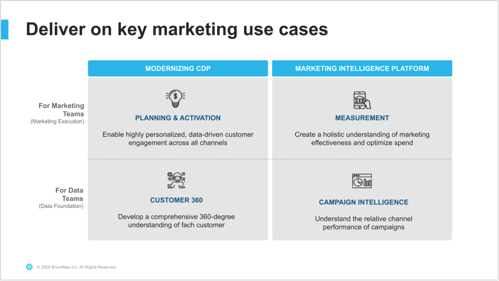
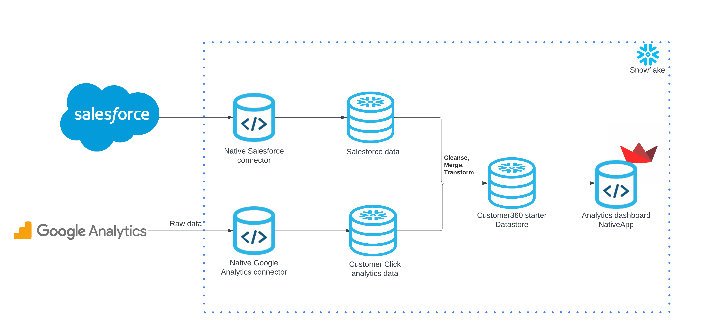
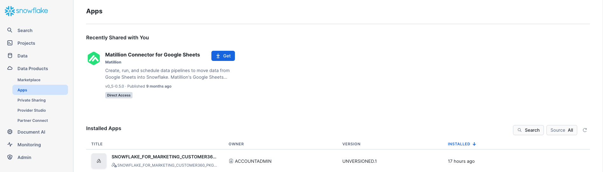
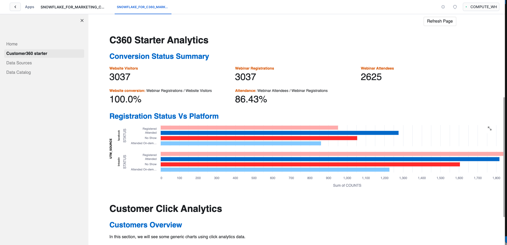

author: Manuel Figueroa
id: marketing_data_foundation_starter_customer_360
summary: Marketing Data Foundation Starter For Customer 360 Guide
categories: Data-Engineering
environments: web
status: Published 
feedback link: https://github.com/Snowflake-Labs/sfguides/issues
tags: Marketing, Data Engineering, Native Application

# Marketing Data Foundation For Customer 360 Starter Guide
<!-- ------------------------ -->
## Introduction 

Duration: 15

Customers looking to use Snowflake for marketing use cases initially face a significant challenge: it is difficult to import all relevant marketing data into Snowflake and structure it in a unified format that downstream applications can easily utilize to power data-driven marketing.

This starter solution tackles this challenge of creating a marketing data foundation for customer 360.
This is part of the overall [Marketing Data Foundation Starter]() solution.

### Problem Space

The Customer 360 challenge revolves around creating a unified, comprehensive view of a person, whether a customer or prospect. This endeavor involves aggregating and synthesizing data from a multitude of touchpoints and interactions customers have with a brand, including online behaviors, transaction histories, and customer service experiences. The main challenge is data siloing and integration, as information often resides in disparate systems, making it difficult to achieve a singular, holistic view of the customer.

More specifically, Customer 360 includes the following data types:

* <b>Demographic Data:</b> Information such as age, gender, income, education, and marital status that helps in segmenting the customer base.<br>
* <b>Transactional Data:</b> Records of customer purchases, returns, and exchanges, including details like transaction amounts, product categories, and purchase history.<br>
* <b>Behavioral Data:</b> Data on customer interactions with the brand, including website visits, app usage, click-through rates, and engagement with marketing and loyalty campaigns.<br>
* <b>Engagement Data:</b> Details of how customers engage with the brand through various channels, such as email open rates, social media interactions, and customer service inquiries.<br>
* <b>Psychographic Data:</b> Insights into the customer's lifestyle, interests, attitudes, and opinions, often gathered through surveys, feedback forms, and social media analysis.<br>
* <b>Customer Feedback:</b> Direct feedback from customers, including Net Promoter Score (NPS) surveys, customer satisfaction surveys, reviews, and complaints.

The actual source systems for this data includes:

* <b>CRM Systems:</b> Customer Relationship Management (CRM) systems are a primary source of customer data, offering insights into customer interactions, sales pipeline, and communication history. (E.g., Salesforce, HubSpot, Microsoft Dynamics 365)<br>
* <b>E-commerce Platforms:</b> These provide transactional and behavioral data, detailing customer purchase patterns, browsing history, and product preferences. (E.g., Shopify, Magento (Adobe Commerce), WooCommerce)<br>
* <b>Social Media Platforms:</b> Social media interactions, sentiments, and engagement metrics offer valuable insights into customer preferences and behavior. (E.g., Facebook Insights, Twitter Analytics, LinkedIn Analytics)<br>
* <b>Website and Mobile Analytics:</b> Tools like these provide data on website and app usage, including page views, session duration, bounce rates, and user navigation paths. (E.g., Google Analytics, Adobe Analytics, Mixpanel)<br>
* <b>Email Marketing Tools:</b> These tools track engagement metrics such as email open rates, click-through rates, and conversion rates from email campaigns. (E.g., Mailchimp, Constant Contact, SendGrid (Twilio SendGrid))<br>
* <b>Customer Service Platforms:</b> Data from customer service interactions, including support tickets, chat transcripts, and call logs, provide insights into customer issues, preferences, and feedback. (E.g., Zendesk, Salesforce Service Cloud, Freshdesk)<br>
* <b>Survey Tools and Feedback Platforms:</b> These sources capture direct customer feedback, opinions, and satisfaction levels, which are crucial for understanding customer sentiment. (E.g., SurveyMonkey, Qualtrics, Google Forms)<br>
* <b>Point of Sale (POS) Systems:</b> For brick-and-mortar operations, POS systems capture in-store transactions, returns, and customer interactions. (E.g., Square, Clover, Lightspeed)<br>

Data privacy and security are paramount concerns in building a Customer 360 view. With increasing scrutiny on how companies collect, store, and use customer data, navigating privacy regulations such as GDPR and CCPA becomes a complex but critical task. This involves ensuring all customer data is handled in a compliant manner, balancing the need for insightful analytics with the imperative of protecting customer privacy.

### Solution Space

#### Context

As described in the diagram below, the two Data Foundation use cases in this starter lay the groundwork to support the two Marketing Execution use cases: Planning & Activation, and Measurement.



More specifically, this solution covers Data Ingestion, Semantic Unification, and based Analytics use cases for Customer 360.


### Solution Details

The solution consists of the following components:

  - Native Application: The code needed to build and deploy this solution as a Native App. You will deploy this app in your own Snowflake account.

<!-- ------------------------ -->

## The App Architecture

This solution consists of a sample for Marketing Data for Customer 360.

### Data Foundation Starter for Customer 360



<!-- ------------------------ -->

## Prerequisites
- Install [Snow CLI](https://docs.snowflake.com/en/developer-guide/snowflake-cli-v2/installation/installation)

### What You’ll Need 
- A [GitHub](https://github.com/) Account 
- [VSCode](https://code.visualstudio.com/download) Installed
- [Snow CLI](https://docs.snowflake.com/en/developer-guide/snowflake-cli-v2/installation/installation) Installed 

### What You’ll Build 
- Marketing Data Foundation Starter Guide for Customer 360

<!-- ------------------------ -->

## Setup

### Clone GitHub repository
Duration: 2

Clone the git repo to your local

```console
git clone https://github.com/Snowflake-Labs/sfguide-marketing-data-foundation-starter-customer-360
```

### Create a connection

```console
snow connection add
```

Refer to the screenshot below for more info.

```shell
Name for this connection: marketing_demo_conn
Snowflake account name: ******
Snowflake username: MFIGUEROA
Snowflake password [optional]:
Role for the connection [optional]: ACCOUNTADMIN
Warehouse for the connection [optional]: COMPUTE_WH
Database for the connection [optional]: snowflake
Schema for the connection [optional]: account_usage
Connection host [optional]:
Connection port [optional]:
Snowflake region [optional]: us-west-1
Authentication method [optional]:
Path to private key file [optional]:
Wrote new connection marketing_demo_conn to /Users/mfigueroamontero/Library/Application Support/snowflake/config.toml
```


To review the new created connection use:
```console
snow connection list
```

Refer to the screenshot below:
```shell
+--------------------------------------------------------------------------------------------------------------------------------------------------------------------------------------------------------------+
| connection_name     | parameters                                                                                                                                                                             |
|---------------------+----------------------------------------------------------------------------------------------------------------------------------------------------------------------------------------|
| marketing_demo_conn | {'account': '******', 'user': 'MFIGUEROA', 'password': '****', 'region': 'us-west-1', 'database': 'snowflake', 'schema': 'account_usage', 'warehouse': 'COMPUTE_WH', 'role':      |
|                     | 'ACCOUNTADMIN'}                                                                                                                                                                        |
+--------------------------------------------------------------------------------------------------------------------------------------------------------------------------------------------------------------+
```

## Step 1: Create Database objects

Duration: 2

Navigate to the repo folder in your local machine and run the below command to create your database, schema and stage objects

First lets export the connection name to the default connection

```console
export SNOWFLAKE_DEFAULT_CONNECTION_NAME=marketing_demo_conn
```

```console
snow sql -f sql_scripts/setup.sql
```

```shell
create or replace database CUSTOMER_360 comment = 'used for demonstrating Snowflake Customer 360 for Marketing';
+---------------------------------------------+
| status                                      |
|---------------------------------------------|
| Database CUSTOMER_360 successfully created. |
+---------------------------------------------+

create or replace schema CUSTOMER_360.demo;
+-----------------------------------+
| status                            |
|-----------------------------------|
| Schema DEMO successfully created. |
+-----------------------------------+

use schema CUSTOMER_360.demo;
+----------------------------------+
| status                           |
|----------------------------------|
| Statement executed successfully. |
+----------------------------------+

create or replace stage lib_stg
        directory = ( enable = true )
    comment = 'used for holding udfs and procs.';
+------------------------------------------+
| status                                   |
|------------------------------------------|
| Stage area LIB_STG successfully created. |
+------------------------------------------+

create or replace stage data_stg
    comment = 'used for holding data.';
+-------------------------------------------+
| status                                    |
|-------------------------------------------|
| Stage area DATA_STG successfully created. |
+-------------------------------------------+

create or replace stage scripts_stg
    comment = 'used for holding scripts.';
+----------------------------------------------+
| status                                       |
|----------------------------------------------|
| Stage area SCRIPTS_STG successfully created. |
+----------------------------------------------+

use database CUSTOMER_360;
+----------------------------------+
| status                           |
|----------------------------------|
| Statement executed successfully. |
+----------------------------------+

use schema demo;
+----------------------------------+
| status                           |
|----------------------------------|
| Statement executed successfully. |
+----------------------------------+

```

## Step 2: Upload sample data to stage

Duration: 4

Upload all the sample data files in the folder data to stage created in step 1


```console
snow object stage copy data/worldcities.csv @CUSTOMER_360.demo.data_stg/data
```

```shell
put file:///Users/dbabbjimenez/Developer/MarTech/sfguide-marketing-data-foundation-starter-customer-360/data/worldcities.csv @CUSTOMER_360.demo.data_stg/data auto_compress=false parallel=4 overwrite=False
+------------------------------------------------------------------------------------------------------------------------------+
| source          | target          | source_size | target_size | source_compression | target_compression | status   | message |
|-----------------+-----------------+-------------+-------------+--------------------+--------------------+----------+---------|
| worldcities.csv | worldcities.csv | 4734682     | 4734688     | NONE               | NONE               | UPLOADED |         |
+------------------------------------------------------------------------------------------------------------------------------+
```

```console
snow object stage copy data/sf_data/ @CUSTOMER_360.demo.data_stg/data/sf_data/
```

```shell
put file:///Users/dbabbjimenez/Developer/MarTech/sfguide-marketing-data-foundation-starter-customer-360/data/sf_data/* @CUSTOMER_360.demo.data_stg/data/sf_data/ auto_compress=false parallel=4 overwrite=False
+----------------------------------------------------------------------------------------------------------------------------------------------------------------------+
| source                              | target                              | source_size | target_size | source_compression | target_compression | status   | message |
|-------------------------------------+-------------------------------------+-------------+-------------+--------------------+--------------------+----------+---------|
| salesforce_sample_data_0_0_0.csv.gz | salesforce_sample_data_0_0_0.csv.gz | 3826132     | 3826144     | GZIP               | GZIP               | UPLOADED |         |
| salesforce_sample_data_0_1_0.csv.gz | salesforce_sample_data_0_1_0.csv.gz | 3828757     | 3828768     | GZIP               | GZIP               | UPLOADED |         |
| salesforce_sample_data_0_2_0.csv.gz | salesforce_sample_data_0_2_0.csv.gz | 3824096     | 3824112     | GZIP               | GZIP               | UPLOADED |         |
| salesforce_sample_data_0_3_0.csv.gz | salesforce_sample_data_0_3_0.csv.gz | 3829383     | 3829392     | GZIP               | GZIP               | UPLOADED |         |
| salesforce_sample_data_0_4_0.csv.gz | salesforce_sample_data_0_4_0.csv.gz | 3827103     | 3827104     | GZIP               | GZIP               | UPLOADED |         |
| salesforce_sample_data_0_5_0.csv.gz | salesforce_sample_data_0_5_0.csv.gz | 3835074     | 3835088     | GZIP               | GZIP               | UPLOADED |         |
| salesforce_sample_data_0_6_0.csv.gz | salesforce_sample_data_0_6_0.csv.gz | 3830438     | 3830448     | GZIP               | GZIP               | UPLOADED |         |
| salesforce_sample_data_0_7_0.csv.gz | salesforce_sample_data_0_7_0.csv.gz | 3829980     | 3829984     | GZIP               | GZIP               | UPLOADED |         |
+----------------------------------------------------------------------------------------------------------------------------------------------------------------------+

```

```console
snow object stage copy data/ga_data/ @CUSTOMER_360.demo.data_stg/data/ga_data/
```

```shell
put file:///Users/dbabbjimenez/Developer/MarTech/sfguide-marketing-data-foundation-starter-customer-360/data/ga_data/* @CUSTOMER_360.demo.data_stg/data/ga_data/ auto_compress=false parallel=4 overwrite=False
+------------------------------------------------------------------------------------------------------------------------------------------------------+
| source                      | target                      | source_size | target_size | source_compression | target_compression | status   | message |
|-----------------------------+-----------------------------+-------------+-------------+--------------------+--------------------+----------+---------|
| ga_sample_data_0_0_0.csv.gz | ga_sample_data_0_0_0.csv.gz | 25022153    | 25022160    | GZIP               | GZIP               | UPLOADED |         |
| ga_sample_data_0_0_1.csv.gz | ga_sample_data_0_0_1.csv.gz | 25020796    | 25020800    | GZIP               | GZIP               | UPLOADED |         |
| ga_sample_data_0_0_2.csv.gz | ga_sample_data_0_0_2.csv.gz | 12596227    | 12596240    | GZIP               | GZIP               | UPLOADED |         |
| ga_sample_data_0_1_0.csv.gz | ga_sample_data_0_1_0.csv.gz | 25026694    | 25026704    | GZIP               | GZIP               | UPLOADED |         |
| ga_sample_data_0_1_1.csv.gz | ga_sample_data_0_1_1.csv.gz | 25011153    | 25011168    | GZIP               | GZIP               | UPLOADED |         |
| ga_sample_data_0_1_2.csv.gz | ga_sample_data_0_1_2.csv.gz | 12025707    | 12025712    | GZIP               | GZIP               | UPLOADED |         |
| ga_sample_data_0_2_0.csv.gz | ga_sample_data_0_2_0.csv.gz | 25040511    | 25040512    | GZIP               | GZIP               | UPLOADED |         |
| ga_sample_data_0_2_1.csv.gz | ga_sample_data_0_2_1.csv.gz | 25022834    | 25022848    | GZIP               | GZIP               | UPLOADED |         |
| ga_sample_data_0_2_2.csv.gz | ga_sample_data_0_2_2.csv.gz | 12044280    | 12044288    | GZIP               | GZIP               | UPLOADED |         |
| ga_sample_data_0_3_0.csv.gz | ga_sample_data_0_3_0.csv.gz | 25027009    | 25027024    | GZIP               | GZIP               | UPLOADED |         |
| ga_sample_data_0_3_1.csv.gz | ga_sample_data_0_3_1.csv.gz | 25035010    | 25035024    | GZIP               | GZIP               | UPLOADED |         |
| ga_sample_data_0_3_2.csv.gz | ga_sample_data_0_3_2.csv.gz | 11516130    | 11516144    | GZIP               | GZIP               | UPLOADED |         |
| ga_sample_data_0_4_0.csv.gz | ga_sample_data_0_4_0.csv.gz | 25013661    | 25013664    | GZIP               | GZIP               | UPLOADED |         |
| ga_sample_data_0_4_1.csv.gz | ga_sample_data_0_4_1.csv.gz | 25008308    | 25008320    | GZIP               | GZIP               | UPLOADED |         |
| ga_sample_data_0_4_2.csv.gz | ga_sample_data_0_4_2.csv.gz | 13143585    | 13143600    | GZIP               | GZIP               | UPLOADED |         |
| ga_sample_data_0_5_0.csv.gz | ga_sample_data_0_5_0.csv.gz | 25021248    | 25021264    | GZIP               | GZIP               | UPLOADED |         |
| ga_sample_data_0_5_1.csv.gz | ga_sample_data_0_5_1.csv.gz | 25021975    | 25021984    | GZIP               | GZIP               | UPLOADED |         |
| ga_sample_data_0_5_2.csv.gz | ga_sample_data_0_5_2.csv.gz | 7762439     | 7762448     | GZIP               | GZIP               | UPLOADED |         |
| ga_sample_data_0_6_0.csv.gz | ga_sample_data_0_6_0.csv.gz | 25020356    | 25020368    | GZIP               | GZIP               | UPLOADED |         |
| ga_sample_data_0_6_1.csv.gz | ga_sample_data_0_6_1.csv.gz | 21857953    | 21857968    | GZIP               | GZIP               | UPLOADED |         |
| ga_sample_data_0_7_0.csv.gz | ga_sample_data_0_7_0.csv.gz | 25039177    | 25039184    | GZIP               | GZIP               | UPLOADED |         |
| ga_sample_data_0_7_1.csv.gz | ga_sample_data_0_7_1.csv.gz | 25015662    | 25015664    | GZIP               | GZIP               | UPLOADED |         |
| ga_sample_data_0_7_2.csv.gz | ga_sample_data_0_7_2.csv.gz | 11624943    | 11624944    | GZIP               | GZIP               | UPLOADED |         |
+------------------------------------------------------------------------------------------------------------------------------------------------------+
```

```console
snow object stage copy data/sample_data.gz @CUSTOMER_360.demo.data_stg/data/
```

```shell
put file:///Users/dbabbjimenez/Developer/MarTech/sfguide-marketing-data-foundation-starter-customer-360/data/sample_data.gz @CUSTOMER_360.demo.data_stg/data/ auto_compress=false parallel=4 overwrite=False
+----------------------------------------------------------------------------------------------------------------------------+
| source         | target         | source_size | target_size | source_compression | target_compression | status   | message |
|----------------+----------------+-------------+-------------+--------------------+--------------------+----------+---------|
| sample_data.gz | sample_data.gz | 22158239    | 22158240    | GZIP               | GZIP               | UPLOADED |         |
+----------------------------------------------------------------------------------------------------------------------------+
```

If the upload fails due to access issue then, please follow the instructions in this [document](https://docs.snowflake.com/en/user-guide/data-load-local-file-system-stage-ui) to upload the files directly to Snowflake Stage.


## Step 3: Load Sample data to table and Create Native Application

Duration: 2

### Load data and create view

Run the below command to create the views that will be bundled along with the nativeapp

```console
snow sql -f sql_scripts/build_views.sql
```

```shell
create or replace TABLE CUSTOMER_360.DEMO.SIMPLEMAPS (
        CITY VARCHAR(16777216),
        CITY_ASCII VARCHAR(16777216),
        LAT FLOAT,
        LNG FLOAT,
        COUNTRY VARCHAR(16777216),
        ISO2 VARCHAR(16777216),
        ISO3 VARCHAR(16777216),
        ADMIN_NAME VARCHAR(16777216),
        CAPITAL VARCHAR(16777216),
        POPULATION VARCHAR(16777216),
        ID NUMBER(38,0));
+----------------------------------------+
| status                                 |
|----------------------------------------|
| Table SIMPLEMAPS successfully created. |
+----------------------------------------+

CREATE OR REPLACE FILE FORMAT CUSTOMER_360.DEMO.CSV_FORMAT TYPE=CSV
    SKIP_HEADER=1
    FIELD_DELIMITER=','
    TRIM_SPACE=TRUE
    FIELD_OPTIONALLY_ENCLOSED_BY='"'
    REPLACE_INVALID_CHARACTERS=TRUE
    DATE_FORMAT=AUTO
    TIME_FORMAT=AUTO
    TIMESTAMP_FORMAT=AUTOs;
+----------------------------------------------+
| status                                       |
|----------------------------------------------|
| File format CSV_FORMAT successfully created. |
+----------------------------------------------+

COPY INTO "CUSTOMER_360"."DEMO"."SIMPLEMAPS"
FROM (SELECT $1, $2, $3, $4, $5, $6, $7, $8, $9, $10, $11
        FROM '@"CUSTOMER_360"."DEMO"."DATA_STG"/data/worldcities.csv')
FILE_FORMAT = 'CUSTOMER_360.DEMO.CSV_FORMAT'
ON_ERROR=ABORT_STATEMENT;
+-----------------------------------------------------------------------------------------------------------------------------------------------------------------------------------+
| file                          | status | rows_parsed | rows_loaded | error_limit | errors_seen | first_error | first_error_line | first_error_character | first_error_column_name |
|-------------------------------+--------+-------------+-------------+-------------+-------------+-------------+------------------+-----------------------+-------------------------|
| data_stg/data/worldcities.csv | LOADED | 44691       | 44691       | 1           | 0           | None        | None             | None                  | None                    |
+-----------------------------------------------------------------------------------------------------------------------------------------------------------------------------------+

CREATE OR REPLACE TABLE  CUSTOMER_360.DEMO.GA_RAW_DATA
               ( EVENT_DATE DATE , EVENT_TIMESTAMP VARCHAR , EVENT_NAME VARCHAR , EVENT_PREVIOUS_TIMESTAMP VARCHAR , EVENT_VALUE_IN_USD VARCHAR ,
               EVENT_BUNDLE_SEQUENCE_ID NUMBER , EVENT_SERVER_TIMESTAMP_OFFSET VARCHAR , USER_ID VARCHAR , USER_PSEUDO_ID VARCHAR ,
               PRIVACY_INFO_ANALYTICS_STORAGE VARCHAR , PRIVACY_INFO_ADS_STORAGE VARCHAR , PRIVACY_INFO_USES_TRANSIENT_TOKEN BOOLEAN ,
               USER_PROPERTIES VARCHAR , USER_FIRST_TOUCH_TIMESTAMP VARCHAR , USER_LTV_CURRENCY VARCHAR ,
               DEVICE_CATEGORY VARCHAR , DEVICE_MOBILE_BRAND_NAME VARCHAR , DEVICE_MOBILE_MODEL_NAME VARCHAR , DEVICE_MOBILE_MARKETING_NAME VARCHAR ,
               DEVICE_MOBILE_OS_HARDWARE_MODEL VARCHAR , DEVICE_OPERATING_SYSTEM VARCHAR , DEVICE_OPERATING_SYSTEM_VERSION VARCHAR , DEVICE_VENDOR_ID VARCHAR ,
               DEVICE_ADVERTISING_ID VARCHAR , DEVICE_LANGUAGE VARCHAR , DEVICE_IS_LIMITED_AD_TRACKING BOOLEAN , DEVICE_TIME_ZONE_OFFSET_SECONDS VARCHAR ,
               DEVICE_BROWSER VARCHAR , DEVICE_BROWSER_VERSION VARCHAR , DEVICE_WEB_INFO_BROWSER VARCHAR , DEVICE_WEB_INFO_BROWSER_VERSION VARCHAR ,
               GEO_CONTINENT VARCHAR , GEO_COUNTRY VARCHAR , GEO_REGION VARCHAR , GEO_CITY VARCHAR , GEO_SUB_CONTINENT VARCHAR , GEO_METRO VARCHAR ,
               APP_INFO_ID VARCHAR , APP_INFO_VERSION VARCHAR , APP_INFO_INSTALL_STORE VARCHAR , APP_INFO_FIREBASE_APP_ID VARCHAR , APP_INFO_INSTALL_SOURCE VARCHAR ,
               TRAFFIC_SOURCE_MEDIUM VARCHAR , STREAM_ID NUMBER , PLATFORM VARCHAR , EVENT_DIMENSIONS_HOSTNAME VARCHAR , ECOMMERCE_TOTAL_ITEM_QUANTITY VARCHAR ,
               ECOMMERCE_PURCHASE_REVENUE_IN_USD VARCHAR , ECOMMERCE_PURCHASE_REVENUE VARCHAR , ECOMMERCE_REFUND_VALUE_IN_USD VARCHAR , ECOMMERCE_REFUND_VALUE VARCHAR ,
               ECOMMERCE_SHIPPING_VALUE_IN_USD VARCHAR , ECOMMERCE_SHIPPING_VALUE VARCHAR , ECOMMERCE_TAX_VALUE_IN_USD VARCHAR , ECOMMERCE_TAX_VALUE VARCHAR ,
               ECOMMERCE_UNIQUE_ITEMS VARCHAR , ECOMMERCE_TRANSACTION_ID VARCHAR , ITEMS VARCHAR , COLLECTED_TRAFIC_SOURCE_MANUAL_CAMPAIGN_ID VARCHAR ,
               COLLECTED_TRAFIC_SOURCE_MANUAL_MEDIUM VARCHAR , COLLECTED_TRAFIC_SOURCE_GCLID VARCHAR , COLLECTED_TRAFIC_SOURCE_DCLID VARCHAR ,
               COLLECTED_TRAFIC_SOURCE_SRSLTID VARCHAR , DEVICE_WEB_INFO_HOSTNAME VARCHAR , COLLECTED_TRAFIC_SOURCE_MANUAL_CAMPAIGN_NAME VARCHAR ,
               COLLECTED_TRAFIC_SOURCE_MANUAL_SOURCE VARCHAR , TRAFFIC_SOURCE_SOURCE VARCHAR , TRAFFIC_SOURCE_NAME VARCHAR , COLLECTED_TRAFIC_SOURCE_MANUAL_CONTENT VARCHAR ,
               COLLECTED_TRAFIC_SOURCE_MANUAL_TERM VARCHAR , USER_LTV_REVENUE NUMBER, EVENT_PARAMS_UTMS VARIANT );
+-----------------------------------------+
| status                                  |
|-----------------------------------------|
| Table GA_RAW_DATA successfully created. |
+-----------------------------------------+

COPY INTO "CUSTOMER_360"."DEMO"."GA_RAW_DATA"
FROM (SELECT $1, $2, $3, $4, $5, $6, $7, $8, $9, $10, $11, $12, $13, $14, $15, $16, $17, $18, $19, $20, $21, $22, $23, $24, $25, $26, $27, $28, $29, $30, $31, $32, $33, $34,
$35, $36, $37, $38, $39, $40, $41, $42, $43, $44, $45, $46, $47, $48, $49, $50, $51, $52, $53, $54, $55, $56, $57, $58, $59, $60, $61, $62, $63, $64, $65, $66, $67, $68,
$69, $70, $71, $72
        FROM '@"CUSTOMER_360"."DEMO"."DATA_STG"/data/ga_data/')
FILE_FORMAT = 'CUSTOMER_360.DEMO.CSV_FORMAT'
ON_ERROR=ABORT_STATEMENT;
+-------------------------------------------------------------------------------------------------------------------------------------------------------------------------------------------------------+
| file                                              | status | rows_parsed | rows_loaded | error_limit | errors_seen | first_error | first_error_line | first_error_character | first_error_column_name |
|---------------------------------------------------+--------+-------------+-------------+-------------+-------------+-------------+------------------+-----------------------+-------------------------|
| data_stg/data/ga_data/ga_sample_data_0_0_0.csv.gz | LOADED | 261012      | 261012      | 1           | 0           | None        | None             | None                  | None                    |
| data_stg/data/ga_data/ga_sample_data_0_4_1.csv.gz | LOADED | 260819      | 260819      | 1           | 0           | None        | None             | None                  | None                    |
| data_stg/data/ga_data/ga_sample_data_0_2_0.csv.gz | LOADED | 268229      | 268229      | 1           | 0           | None        | None             | None                  | None                    |
| data_stg/data/ga_data/ga_sample_data_0_5_0.csv.gz | LOADED | 259711      | 259711      | 1           | 0           | None        | None             | None                  | None                    |
| data_stg/data/ga_data/ga_sample_data_0_1_0.csv.gz | LOADED | 269965      | 269965      | 1           | 0           | None        | None             | None                  | None                    |
| data_stg/data/ga_data/ga_sample_data_0_5_1.csv.gz | LOADED | 279090      | 279090      | 1           | 0           | None        | None             | None                  | None                    |
| data_stg/data/ga_data/ga_sample_data_0_1_1.csv.gz | LOADED | 260447      | 260447      | 1           | 0           | None        | None             | None                  | None                    |
| data_stg/data/ga_data/ga_sample_data_0_4_2.csv.gz | LOADED | 136538      | 136538      | 1           | 0           | None        | None             | None                  | None                    |
| data_stg/data/ga_data/ga_sample_data_0_6_1.csv.gz | LOADED | 225712      | 225712      | 1           | 0           | None        | None             | None                  | None                    |
| data_stg/data/ga_data/ga_sample_data_0_0_1.csv.gz | LOADED | 261367      | 261367      | 1           | 0           | None        | None             | None                  | None                    |
| data_stg/data/ga_data/ga_sample_data_0_4_0.csv.gz | LOADED | 258003      | 258003      | 1           | 0           | None        | None             | None                  | None                    |
| data_stg/data/ga_data/ga_sample_data_0_7_2.csv.gz | LOADED | 123656      | 123656      | 1           | 0           | None        | None             | None                  | None                    |
| data_stg/data/ga_data/ga_sample_data_0_2_1.csv.gz | LOADED | 260923      | 260923      | 1           | 0           | None        | None             | None                  | None                    |
| data_stg/data/ga_data/ga_sample_data_0_3_2.csv.gz | LOADED | 130974      | 130974      | 1           | 0           | None        | None             | None                  | None                    |
| data_stg/data/ga_data/ga_sample_data_0_6_0.csv.gz | LOADED | 265808      | 265808      | 1           | 0           | None        | None             | None                  | None                    |
| data_stg/data/ga_data/ga_sample_data_0_0_2.csv.gz | LOADED | 132981      | 132981      | 1           | 0           | None        | None             | None                  | None                    |
| data_stg/data/ga_data/ga_sample_data_0_3_0.csv.gz | LOADED | 262796      | 262796      | 1           | 0           | None        | None             | None                  | None                    |
| data_stg/data/ga_data/ga_sample_data_0_5_2.csv.gz | LOADED | 82399       | 82399       | 1           | 0           | None        | None             | None                  | None                    |
| data_stg/data/ga_data/ga_sample_data_0_7_0.csv.gz | LOADED | 269362      | 269362      | 1           | 0           | None        | None             | None                  | None                    |
| data_stg/data/ga_data/ga_sample_data_0_1_2.csv.gz | LOADED | 124948      | 124948      | 1           | 0           | None        | None             | None                  | None                    |
| data_stg/data/ga_data/ga_sample_data_0_2_2.csv.gz | LOADED | 126208      | 126208      | 1           | 0           | None        | None             | None                  | None                    |
| data_stg/data/ga_data/ga_sample_data_0_3_1.csv.gz | LOADED | 261590      | 261590      | 1           | 0           | None        | None             | None                  | None                    |
| data_stg/data/ga_data/ga_sample_data_0_7_1.csv.gz | LOADED | 262342      | 262342      | 1           | 0           | None        | None             | None                  | None                    |
+-------------------------------------------------------------------------------------------------------------------------------------------------------------------------------------------------------+

CREATE OR REPLACE TABLE  CUSTOMER_360.DEMO.SALESFORCE_RAW_DATA
                ( SALESFORCE_CAMPAIGN_MEMBER_ID VARCHAR , SALESFORCE_CAMPAIGN_ID VARCHAR , SALESFORCE_PERSON_ID VARCHAR ,
                SALESFORCE_ACCOUNT_ID VARCHAR , FIRST_ASSOCIATED_DATE VARCHAR , HAS_RESPONDED VARCHAR , FIRST_RESPONDED_DATE VARCHAR ,
                RESPONSE_GEO VARCHAR , RESPONSE_COUNTRY VARCHAR , EMPLOYEE VARCHAR ,
                CAMPAIGN_PARTNER VARCHAR , CAMPAIGN_PARTNER_OR_EMPLOYEE VARCHAR , SALESFORCE_CAMPAIGN_NAME VARCHAR ,
                SALESFORCE_ACCOUNT_NAME VARCHAR , SALESFORCE_PERSON_NAME VARCHAR, QUERY_PARAMETERS_UTMS VARCHAR, STATUS VARCHAR );
+-------------------------------------------------+
| status                                          |
|-------------------------------------------------|
| Table SALESFORCE_RAW_DATA successfully created. |
+-------------------------------------------------+

COPY INTO "CUSTOMER_360"."DEMO"."SALESFORCE_RAW_DATA"
FROM (SELECT $1, $2, $3, $4, $5, $6, $7, $8, $9, $10, $11, $12, $13, $14, $15, $16, $17
        FROM '@"CUSTOMER_360"."DEMO"."DATA_STG"/data/sf_data/')
FILE_FORMAT = 'CUSTOMER_360.DEMO.CSV_FORMAT'
ON_ERROR=ABORT_STATEMENT ;
+--------------------------------------------------------------------------------------------------------------------------------------------------------------------------------------------------------------+
| file                                                     | status | rows_parsed | rows_loaded | error_limit | errors_seen | first_error | first_error_line | first_error_character | first_error_column_name |
|----------------------------------------------------------+--------+-------------+-------------+-------------+-------------+-------------+------------------+-----------------------+-------------------------|
| data_stg/data/sf_data/salesforce_sample_data_0_3_0.csv.g | LOADED | 62501       | 62501       | 1           | 0           | None        | None             | None                  | None                    |
| z                                                        |        |             |             |             |             |             |                  |                       |                         |
| data_stg/data/sf_data/salesforce_sample_data_0_4_0.csv.g | LOADED | 62501       | 62501       | 1           | 0           | None        | None             | None                  | None                    |
| z                                                        |        |             |             |             |             |             |                  |                       |                         |
| data_stg/data/sf_data/salesforce_sample_data_0_7_0.csv.g | LOADED | 62500       | 62500       | 1           | 0           | None        | None             | None                  | None                    |
| z                                                        |        |             |             |             |             |             |                  |                       |                         |
| data_stg/data/sf_data/salesforce_sample_data_0_0_0.csv.g | LOADED | 62500       | 62500       | 1           | 0           | None        | None             | None                  | None                    |
| z                                                        |        |             |             |             |             |             |                  |                       |                         |
| data_stg/data/sf_data/salesforce_sample_data_0_5_0.csv.g | LOADED | 62501       | 62501       | 1           | 0           | None        | None             | None                  | None                    |
| z                                                        |        |             |             |             |             |             |                  |                       |                         |
| data_stg/data/sf_data/salesforce_sample_data_0_2_0.csv.g | LOADED | 62499       | 62499       | 1           | 0           | None        | None             | None                  | None                    |
| z                                                        |        |             |             |             |             |             |                  |                       |                         |
| data_stg/data/sf_data/salesforce_sample_data_0_6_0.csv.g | LOADED | 62500       | 62500       | 1           | 0           | None        | None             | None                  | None                    |
| z                                                        |        |             |             |             |             |             |                  |                       |                         |
| data_stg/data/sf_data/salesforce_sample_data_0_1_0.csv.g | LOADED | 62498       | 62498       | 1           | 0           | None        | None             | None                  | None                    |
| z                                                        |        |             |             |             |             |             |                  |                       |                         |
+--------------------------------------------------------------------------------------------------------------------------------------------------------------------------------------------------------------+

CREATE OR REPLACE VIEW CUSTOMER_360.DEMO.CUSTOMER72_GA_LAT_LONG_VW as select * from CUSTOMER_360.DEMO.GA_RAW_DATA a join CUSTOMER_360.DEMO.SIMPLEMAPS b on b.city_ascii = a.geo_city;
+------------------------------------------------------+
| status                                               |
|------------------------------------------------------|
| View CUSTOMER72_GA_LAT_LONG_VW successfully created. |
+------------------------------------------------------+

CREATE OR REPLACE VIEW CUSTOMER_360.DEMO.SALESFORCE_VW AS
            select CAMPAIGN_PARTNER,CAMPAIGN_PARTNER_OR_EMPLOYEE,EMPLOYEE,FIRST_ASSOCIATED_DATE,FIRST_RESPONDED_DATE,HAS_RESPONDED,
            QUERY_PARAMETERS_UTMS as SALESFORCE_QUERY_PARAMETERS_UTMS,RESPONSE_COUNTRY,RESPONSE_GEO,SALESFORCE_ACCOUNT_ID,SALESFORCE_ACCOUNT_NAME,SALESFORCE_CAMPAIGN_ID,
            SALESFORCE_CAMPAIGN_MEMBER_ID,SALESFORCE_CAMPAIGN_NAME,SALESFORCE_PERSON_ID,
            SALESFORCE_PERSON_NAME,STATUS, SPLIT_PART(SPLIT_PART(QUERY_PARAMETERS_UTMS, 'utm_source=', 2),'&',0) as SF_UTM_SOURCE,
               SPLIT_PART(SPLIT_PART(SPLIT_PART(QUERY_PARAMETERS_UTMS, 'utm_source=', 2),'&utm_medium=',2), '&', 1) as SF_UTM_MEDIUM,
               SPLIT_PART(SPLIT_PART(QUERY_PARAMETERS_UTMS, '&utm_campaign=', 2),'&',0) as SF_utm_campaign,
               SPLIT_PART(SPLIT_PART(QUERY_PARAMETERS_UTMS, '&utm_content=', 2),'&',0) as SF_utm_ad_name,
               SPLIT_PART(SPLIT_PART(QUERY_PARAMETERS_UTMS, '&ad_id=', 2),'&',0) as SF_utm_ad_id
               from CUSTOMER_360.DEMO.SALESFORCE_RAW_DATA;
+------------------------------------------+
| status                                   |
|------------------------------------------|
| View SALESFORCE_VW successfully created. |
+------------------------------------------+

CREATE OR REPLACE VIEW CUSTOMER_360.DEMO.CUSTOMER72_GA_LAT_LONG_UTMS_VW AS
select  *, value:value.string_value as QUERY_PARAMETERS_UTMS, SPLIT_PART(SPLIT_PART(QUERY_PARAMETERS_UTMS, 'utm_source=', 2),'&',0) as UTM_SOURCE,
               SPLIT_PART(SPLIT_PART(SPLIT_PART(QUERY_PARAMETERS_UTMS, 'utm_source=', 2),'&utm_medium=',2), '&', 1) as UTM_MEDIUM,
               SPLIT_PART(SPLIT_PART(QUERY_PARAMETERS_UTMS, '&utm_campaign=', 2),'&',0) as utm_campaign,
               SPLIT_PART(SPLIT_PART(QUERY_PARAMETERS_UTMS, '&utm_content=', 2),'&',0) as utm_ad_name,
               SPLIT_PART(SPLIT_PART(QUERY_PARAMETERS_UTMS, '&ad_id=', 2),'&',0) as utm_ad_id from CUSTOMER72_GA_LAT_LONG_VW,  LATERAL FLATTEN( INPUT => PARSE_JSON(EVENT_PARAMS_UTMS) );
+-----------------------------------------------------------+
| status                                                    |
|-----------------------------------------------------------|
| View CUSTOMER72_GA_LAT_LONG_UTMS_VW successfully created. |
+-----------------------------------------------------------+

CREATE OR REPLACE VIEW CUSTOMER_360.DEMO.C360_CLICKS_CRM_JOINED_VW as
    SELECT *  FROM CUSTOMER_360.DEMO.salesforce_vw salesforce
    join CUSTOMER_360.DEMO.CUSTOMER72_GA_LAT_LONG_UTMS_VW  ga
    on salesforce.SF_UTM_SOURCE = ga.UTM_SOURCE and
    salesforce.SF_UTM_MEDIUM = ga.UTM_MEDIUM and
    salesforce.SF_utm_campaign = ga.utm_campaign where length(trim(salesforce.SF_UTM_SOURCE)) > 0 ;
+------------------------------------------------------+
| status                                               |
|------------------------------------------------------|
| View C360_CLICKS_CRM_JOINED_VW successfully created. |
+------------------------------------------------------+

CREATE OR REPLACE TABLE "CUSTOMER_360"."DEMO"."CAMPAIGN_JOINED_SAMPLE_DATA"
            ( DATE_DAY DATE , PLATFORM VARCHAR , ACCOUNT_ID NUMBER , ACCOUNT_NAME VARCHAR ,
            CAMPAIGN_ID NUMBER , CAMPAIGN_NAME VARCHAR , AD_GROUP_ID NUMBER , AD_GROUP_NAME VARCHAR ,
            AD_ID NUMBER , AD_NAME VARCHAR , CLICKS NUMBER , IMPRESSIONS NUMBER , SPEND NUMBER );
+---------------------------------------------------------+
| status                                                  |
|---------------------------------------------------------|
| Table CAMPAIGN_JOINED_SAMPLE_DATA successfully created. |
+---------------------------------------------------------+

CREATE OR REPLACE FILE FORMAT CUSTOMER_360.DEMO.CSV_FORMAT TYPE=CSV
    SKIP_HEADER=1
    FIELD_DELIMITER=','
    TRIM_SPACE=TRUE
    FIELD_OPTIONALLY_ENCLOSED_BY='"'
    REPLACE_INVALID_CHARACTERS=TRUE
    DATE_FORMAT=AUTO
    TIME_FORMAT=AUTO
    TIMESTAMP_FORMAT=AUTOs;
+----------------------------------------------+
| status                                       |
|----------------------------------------------|
| File format CSV_FORMAT successfully created. |
+----------------------------------------------+

COPY INTO "CUSTOMER_360"."DEMO"."CAMPAIGN_JOINED_SAMPLE_DATA"
FROM (SELECT $1, $2, $3, $4, $5, $6, $7, $8, $9, $10, $11, $12, $13
        FROM '@"CUSTOMER_360"."DEMO"."DATA_STG"/data/sample_data.gz')
FILE_FORMAT = 'CUSTOMER_360.DEMO.CSV_FORMAT'
ON_ERROR=ABORT_STATEMENT;
+----------------------------------------------------------------------------------------------------------------------------------------------------------------------------------+
| file                         | status | rows_parsed | rows_loaded | error_limit | errors_seen | first_error | first_error_line | first_error_character | first_error_column_name |
|------------------------------+--------+-------------+-------------+-------------+-------------+-------------+------------------+-----------------------+-------------------------|
| data_stg/data/sample_data.gz | LOADED | 908825      | 908825      | 1           | 0           | None        | None             | None                  | None                    |
+----------------------------------------------------------------------------------------------------------------------------------------------------------------------------------+

CREATE OR REPLACE SECURE VIEW CUSTOMER_360.DEMO.CAMPAIGN72_VIEW as SELECT * from CUSTOMER_360.DEMO.CAMPAIGN_JOINED_SAMPLE_DATA
+--------------------------------------------+
| status                                     |
|--------------------------------------------|
| View CAMPAIGN72_VIEW successfully created. |
+--------------------------------------------+
```

### Build NativeApp

```console
snow app run
```

```shell
Creating new application package Snowflake_for_Marketing_Customer360_pkg_dbabbjimenez in account.
Applying package script: sql_scripts/shared-content.sql
Checking if stage exists, or creating a new one if none exists.
Performing a diff between the Snowflake stage and your local deploy_root ('/Users/dbabbjimenez/Developer/MarTech/sfguide-marketing-data-foundation-starter-customer-360/output/deploy') directory.
There are no new files that exist only on the stage.
There are no existing files that have been modified, or their status is unknown.
There are no existing files that are identical to the ones on the stage.
New files only on your local:
manifest.yml
readme.md
scripts/setup.sql
streamlit/Home.py
streamlit/environment.yml
streamlit/images/Arch_Customer72.png
streamlit/images/Arch_Marketing72.png
streamlit/images/Campaign_Starter.png
streamlit/images/Customer_Starter.png
streamlit/images/Data_Catalog.png
streamlit/images/Data_Sources.png
streamlit/pages/1_Customer360_starter.py
streamlit/pages/2_Data_Sources.py
streamlit/pages/3_Data_Catalog.py
Uploading diff-ed files from your local /Users/dbabbjimenez/Developer/MarTech/sfguide-marketing-data-foundation-starter-customer-360/output/deploy directory to the Snowflake stage.
Creating new application Snowflake_for_Marketing_Customer360_dbabbjimenez in account.
Your application object (Snowflake_for_Marketing_Customer360_dbabbjimenez) is now available:
https://app.snowflake.com/PWOBZKF/rvb00041/#/apps/application/SNOWFLAKE_FOR_MARKETING_CUSTOMER360_DBABBJIMENEZ
```

## Conclusion
Duration: 1

Congratulations! You have successfully learnt how to easily build an end to end Native Application and loading sample data. 

You will see your application listed in your account:


If you open the app and navigate to the the Customer 360 starter tab, you will see some infographics describing the sample data we just uploaded.


### What you learned

* How to host build a basic native app for Customer 360 Marketing data.
* Generate a set of views that aggregate data from Marketing providers like Google and Salesforce.
* Generate quick summaries and Charts using that data to create an integrated dashboard using streamlit.


### Related Resources

Want to learn more about the tools and technologies used by your app? Check out the following resources:

* [Source Code on GitHub](https://github.com/Snowflake-Labs/sfguide-marketing-data-foundation-starter)
* [Snowpark Python Developer Guide](https://docs.snowflake.com/en/developer-guide/snowpark/python/index)
* [Snowpark Guide for Data Engineers](https://www.snowflake.com/resource/the-data-engineers-guide-to-python-for-snowflake/)