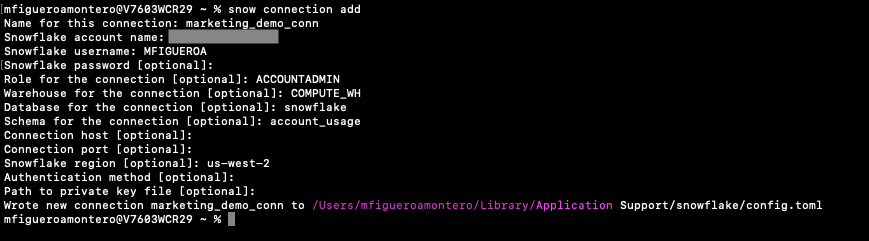
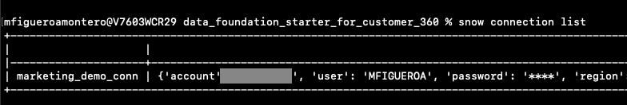
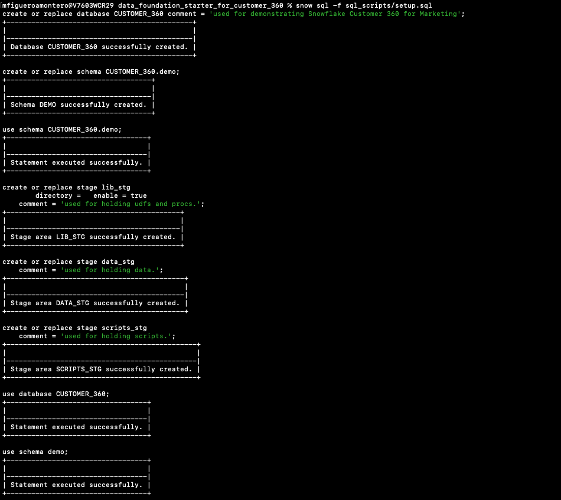
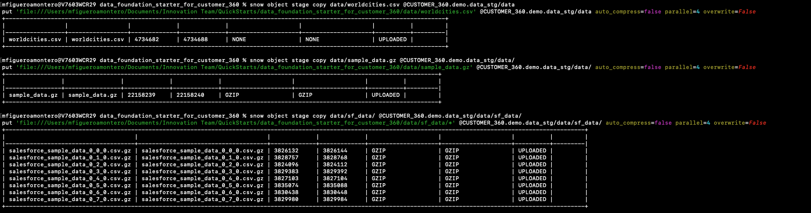
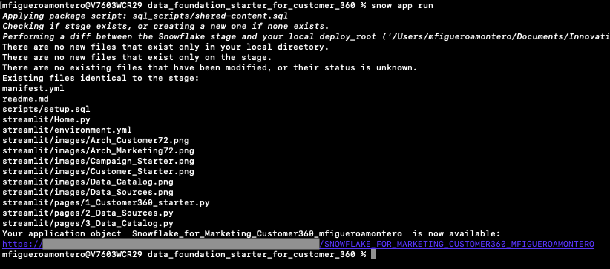

author: Manuel Figueroa
id: marketing_data_foundation_starter_customer_360
summary: Marketing Data Foundation Starter For Customer 360 Guide
categories: Data-Engineering
environments: web
status: Published 
feedback link: https://github.com/Snowflake-Labs/sfguides/issues
tags: Marketing, Data Engineering, Native Application

# Marketing Data Foundation For Customer 360 Starter Guide
<!-- ------------------------ -->
## Introduction 

Duration: 15

Customers looking to use Snowflake for marketing use cases initially face a significant challenge: it is difficult to import all relevant marketing data into Snowflake and structure it in a unified format that downstream applications can easily utilize to power data-driven marketing.

This starter solution tackles this challenge of creating a marketing data foundation for customer 360.
This is part of the overall [Marketing Data Foundation Starter]() solution.

### Problem Space

The Customer 360 challenge revolves around creating a unified, comprehensive view of a person, whether a customer or prospect. This endeavor involves aggregating and synthesizing data from a multitude of touchpoints and interactions customers have with a brand, including online behaviors, transaction histories, and customer service experiences. The main challenge is data siloing and integration, as information often resides in disparate systems, making it difficult to achieve a singular, holistic view of the customer.

More specifically, Customer 360 includes the following data types:

* <b>Demographic Data:</b> Information such as age, gender, income, education, and marital status that helps in segmenting the customer base.<br>
* <b>Transactional Data:</b> Records of customer purchases, returns, and exchanges, including details like transaction amounts, product categories, and purchase history.<br>
* <b>Behavioral Data:</b> Data on customer interactions with the brand, including website visits, app usage, click-through rates, and engagement with marketing and loyalty campaigns.<br>
* <b>Engagement Data:</b> Details of how customers engage with the brand through various channels, such as email open rates, social media interactions, and customer service inquiries.<br>
* <b>Psychographic Data:</b> Insights into the customer's lifestyle, interests, attitudes, and opinions, often gathered through surveys, feedback forms, and social media analysis.<br>
* <b>Customer Feedback:</b> Direct feedback from customers, including Net Promoter Score (NPS) surveys, customer satisfaction surveys, reviews, and complaints.

The actual source systems for this data includes:

* <b>CRM Systems:</b> Customer Relationship Management (CRM) systems are a primary source of customer data, offering insights into customer interactions, sales pipeline, and communication history. (E.g., Salesforce, HubSpot, Microsoft Dynamics 365)<br>
* <b>E-commerce Platforms:</b> These provide transactional and behavioral data, detailing customer purchase patterns, browsing history, and product preferences. (E.g., Shopify, Magento (Adobe Commerce), WooCommerce)<br>
* <b>Social Media Platforms:</b> Social media interactions, sentiments, and engagement metrics offer valuable insights into customer preferences and behavior. (E.g., Facebook Insights, Twitter Analytics, LinkedIn Analytics)<br>
* <b>Website and Mobile Analytics:</b> Tools like these provide data on website and app usage, including page views, session duration, bounce rates, and user navigation paths. (E.g., Google Analytics, Adobe Analytics, Mixpanel)<br>
* <b>Email Marketing Tools:</b> These tools track engagement metrics such as email open rates, click-through rates, and conversion rates from email campaigns. (E.g., Mailchimp, Constant Contact, SendGrid (Twilio SendGrid))<br>
* <b>Customer Service Platforms:</b> Data from customer service interactions, including support tickets, chat transcripts, and call logs, provide insights into customer issues, preferences, and feedback. (E.g., Zendesk, Salesforce Service Cloud, Freshdesk)<br>
* <b>Survey Tools and Feedback Platforms:</b> These sources capture direct customer feedback, opinions, and satisfaction levels, which are crucial for understanding customer sentiment. (E.g., SurveyMonkey, Qualtrics, Google Forms)<br>
* <b>Point of Sale (POS) Systems:</b> For brick-and-mortar operations, POS systems capture in-store transactions, returns, and customer interactions. (E.g., Square, Clover, Lightspeed)<br>

Data privacy and security are paramount concerns in building a Customer 360 view. With increasing scrutiny on how companies collect, store, and use customer data, navigating privacy regulations such as GDPR and CCPA becomes a complex but critical task. This involves ensuring all customer data is handled in a compliant manner, balancing the need for insightful analytics with the imperative of protecting customer privacy.

### Solution Space

#### Context

As described in the diagram below, the two Data Foundation use cases in this starter lay the groundwork to support the two Marketing Execution use cases: Planning & Activation, and Measurement.


More specifically, this solution covers Data Ingestion, Semantic Unification, and based Analytics use cases for Customer 360.


### Solution Details

The solution consists of the following components:


  - Native Application: The code needed to build and deploy this solution as a Native App. You will deploy this app in your own Snowflake account.


### Prerequisites
- Install [Snow CLI](https://docs.snowflake.com/en/developer-guide/snowflake-cli-v2/installation/installation)

### What You’ll Need 
- A [GitHub](https://github.com/) Account 
- [VSCode](https://code.visualstudio.com/download) Installed
- [Snow CLI](https://docs.snowflake.com/en/developer-guide/snowflake-cli-v2/installation/installation) Installed 

### What You’ll Build 
- Marketing Data Foundation Starter Guide for Customer 360

<!-- ------------------------ -->
## The App Architecture

This solution consists of a sample for Marketing Data for Customer 360.

### Data Foundation Starter for Customer 360


<!-- ------------------------ -->
## Setup

### Clone GitHub repository
Duration: 2

Clone the git repo to your local

<span style="color:red">TODO: USE CORRECT URL</span>
```console
git clone https://github.com/Snowflake-Labs/sfguide-marketing-data-foundation-starter.git
```

### Create a connection

```console
snow connection add
```

Refer to the screenshot below for more info.




To review the new created connection use:
```console
snow connection list
```
Refer to the screenshot below:


## Step 1: Create Database objects

Duration: 2

Navigate to the repo folder in your local machine and run the below command to create your database, schema and stage objects

First lets export the connection name to the default connection

```console
export SNOWFLAKE_DEFAULT_CONNECTION_NAME=marketing_demo_conn
```

```console
snow sql -f sql_scripts/setup.sql
```



## Step 2: Upload sample data to stage

Duration: 4

Upload all the sample data files in the folder data to stage created in step 1


```console
snow object stage copy data/worldcities.csv @CUSTOMER_360.demo.data_stg/data
```

```console
snow object stage copy data/sf_data/ @CUSTOMER_360.demo.data_stg/data/sf_data/
```

```console
snow object stage copy data/ga_data/ @CUSTOMER_360.demo.data_stg/data/ga_data/
```

```console
snow object stage copy data/sample_data.gz @CUSTOMER_360.demo.data_stg/data/
```




If the upload fails due to access issue then, please follow the instructions in this [document](https://docs.snowflake.com/en/user-guide/data-load-local-file-system-stage-ui) to upload the files directly to Snowflake Stage.


## Step 3: Load Sample data to table and Create Native Application

Duration: 2

### Load data and create view

Run the below command to create the views that will be bundled along with the nativeapp

```console
snow sql -f sql_scripts/build_views.sql
```

### Build NativeApp

```console
snow app run
```



## Conclusion
Duration: 1

Congratulations! You have successfully learnt how to easily build an end to end Native Application and loading sample data. 

You will see your application listed in your account:


If you open the app and navigate to the the Customer 360 starter tab, you will see some infographics describing the sample data we just uploaded.


### What you learned

* How to host build a basic native app for Customer 360 Marketing data.
* Generate a set of views that aggregate data from Marketing providers like Google and Salesforce.
* Generate quick summaries and Charts using that data to create an integrated dashboard using streamlit.


### Related Resources

Want to learn more about the tools and technologies used by your app? Check out the following resources:

* [Source Code on GitHub](https://github.com/Snowflake-Labs/sfguide-marketing-data-foundation-starter)
* [Snowpark Python Developer Guide](https://docs.snowflake.com/en/developer-guide/snowpark/python/index)
* [Snowpark Guide for Data Engineers](https://www.snowflake.com/resource/the-data-engineers-guide-to-python-for-snowflake/)