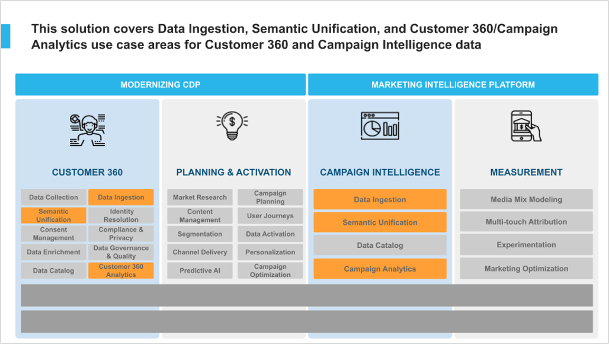
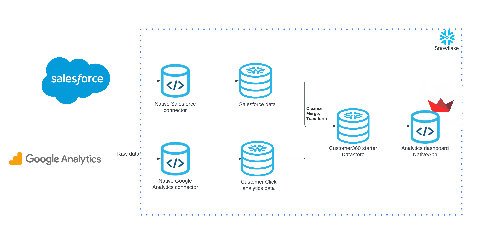
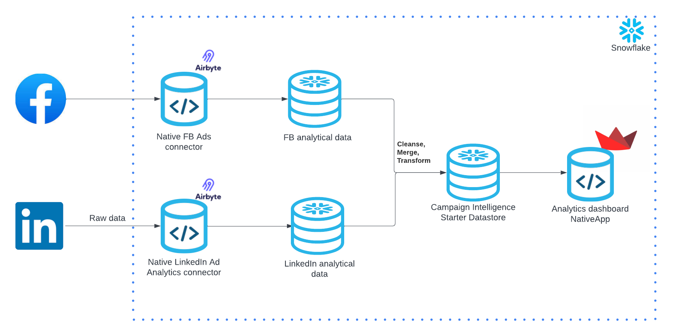
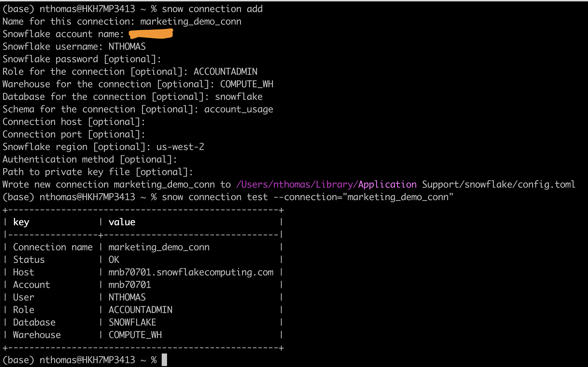
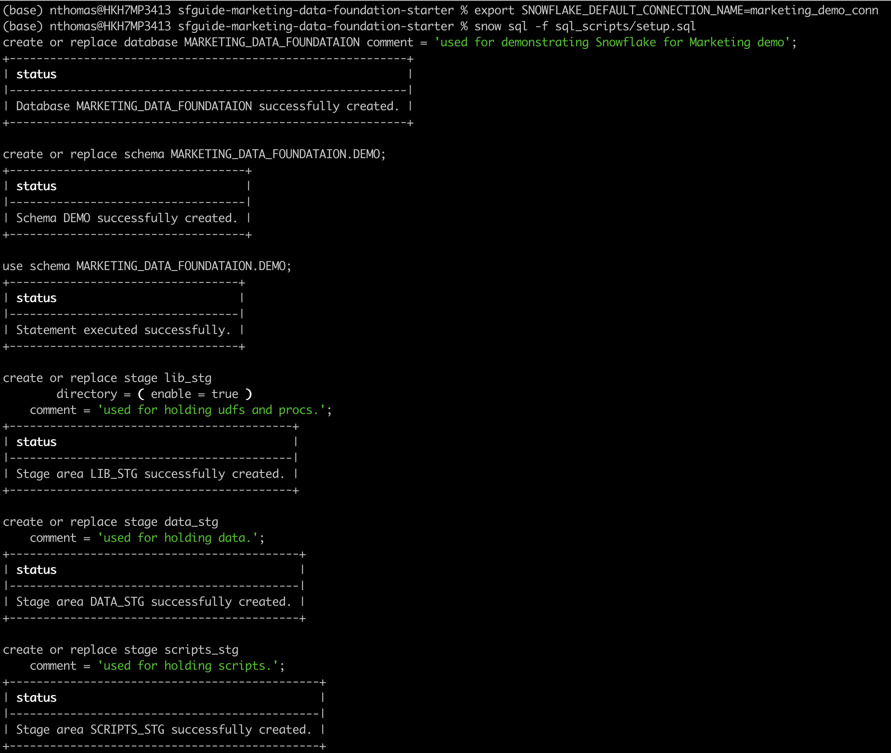
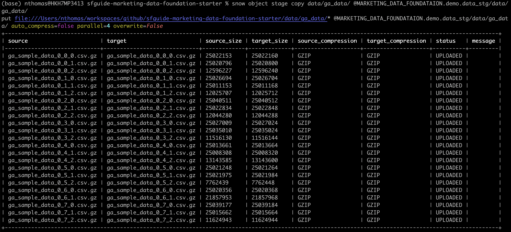
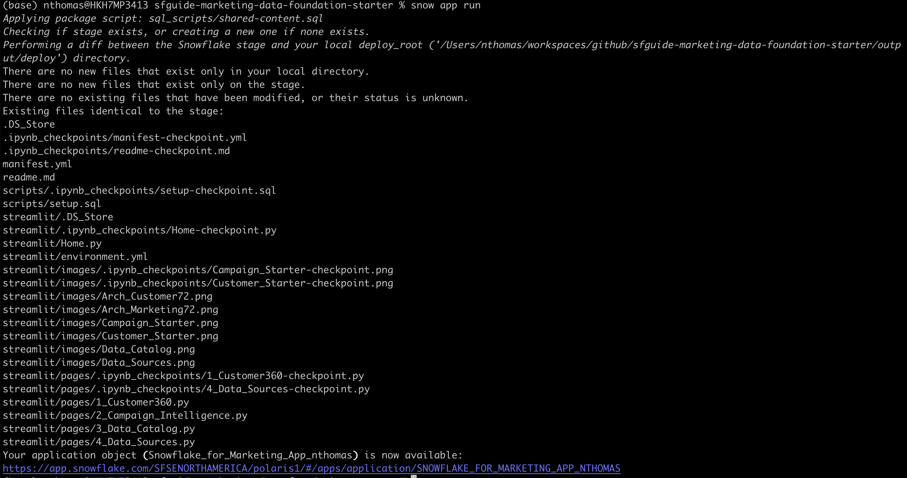

author: NaveenAlanThomas
id: marketing_data_foundation_starter
summary: Marketing Data Foundation Starter Guide
categories: Data-Engineering
environments: web
status: Published 
feedback link: https://github.com/Snowflake-Labs/sfguides/issues
tags: Marketing, Data Engineering, Native Application

# Marketing Data Foundation Starter Guide
<!-- ------------------------ -->
## Introduction 

Duration: 15

Customers looking to use Snowflake for marketing use cases initially face a significant challenge: it is difficult to import all relevant marketing data into Snowflake and structure it in a unified format that downstream applications can easily utilize to power data-driven marketing.

This starter solution tackles this challenge of creating a marketing data foundation by offering two independent solutions and a merged version, demonstrating how to integrate both solutions into a comprehensive 'marketing app suite'.

Marketing Data Foundation Starter (Merges the two apps below into a ‘marketing app suite’)
  - Data Foundation Starter for Customer 360
  - Data Foundation Starter for Campaign Intelligence
  
This solution was inspired by how Snowflake runs its own end-to-end Marketing workflows entirely on top of the Snowflake Marketing Data Cloud.

Slide deck with more context on the overall solution: Marketing Data Foundation Starter for Customer 360 & Campaign Intelligence.

### Problem Space

In the fast-evolving marketing landscape, the emphasis on data-driven strategies has become more pronounced than ever. A significant trend is the increase in Martech investments, with 63% of Chief Marketing Officers (CMOs) planning to increase their spending within the next 12 months. Such investments are crucial for enhancing customer engagement, refining marketing strategies, and driving sales through advanced data analysis.

The high ROI that businesses achieve from data-driven personalization also highlights its importance. Reports indicate that enterprises see returns of 5 to 8 times on their marketing budgets, which demonstrates the value of personalized marketing in boosting conversion rates, enhancing customer loyalty, and increasing revenue.

Additionally, the industry is shifting towards first-party data ownership, a move propelled by the deprecation of third-party cookies. This shift is essential for maintaining direct customer relationships and adapting to changing privacy norms. The promise of generative AI and the understanding that an effective AI strategy requires a robust data strategy have spurred efforts to centralize marketing data within Snowflake. Organizations aim to organize data into standard schemas that Large Language Models (LLMs) can understand, employing these models in innovative ways to personalize content and predict customer behavior.

Two types of first-party data are pivotal in these efforts: Customer 360 Data and Campaign Intelligence. The former strives to provide a holistic view of the customer by integrating and managing comprehensive data. In contrast, Campaign Intelligence focuses on data related to marketing campaigns, aiming to optimize performance and strategy. These elements are fundamental to successful data-driven marketing, underscoring the need for sophisticated data management and analytics capabilities.

### Solution Space

#### Context

As described in the diagram below, the two Data Foundation use cases in this starter lay the groundwork to support the two Marketing Execution use cases: Planning & Activation, and Measurement.


More specifically, this solution covers Data Ingestion, Semantic Unification, and based Analytics use cases for Customer 360 and Campaign Intelligence data.



### Solution Details

The solution consists of the following components:

  - Jupyter Notebooks: This is the primary interface for building this demo.

  - Native Application: The code needed to build and deploy this solution as a Native App. You will deploy this app in your own Snowflake account.

  - Solution Steps: Step-by-step instructions for installing the Native app in your own Snowflake account are available in the Setup notebook.

  - Demo recording: This shows a recording of the demo. It starts with an introduction of the Jupyter Notebook, and covers the Native Application afterwards.

### Prerequisites
- Install [Snow CLI](https://docs.snowflake.com/en/developer-guide/snowflake-cli-v2/installation/installation)

### What You’ll Need 
- A [GitHub](https://github.com/) Account 
- [VSCode](https://code.visualstudio.com/download) Installed
- [Snow CLI](https://docs.snowflake.com/en/developer-guide/snowflake-cli-v2/installation/installation) Installed 

### What You’ll Build 
- Marketing Data Foundation Starter Guide

<!-- ------------------------ -->
## The App Architecture

This solution consists of 2 individual solutions.

### Data Foundation Starter for Customer 360



### Data Foundation Starter for Campaign Intelligence




<!-- ------------------------ -->
## Setup

### Clone GitHub repository
Duration: 2

Clone the git repo to your local

```console
git clone https://github.com/Snowflake-Labs/sfguide-marketing-data-foundation-starter.git
```

### Create a connection

```console
snow connection add
```

```console
snow connection test --connection="test_connection"
```

Refer to the screenshot below for more info.





## Step 1: Create Database objects

Duration: 2

Navigate to the repo folder in your local machine and run the below command to create your database, schema and stage objects

First lets export the connection name to the default connection

```console
export SNOWFLAKE_DEFAULT_CONNECTION_NAME=marketing_demo_conn
```

```console
snow sql -f sql_scripts/setup.sql
```



## Step 2: Upload sample data to stage

Duration: 4

Upload all the sample data files in the folder data to stage created in step 1


```console
snow object stage copy data/worldcities.csv @MARKETING_DATA_FOUNDATAION.demo.data_stg/data
```

```console
snow object stage copy data/sf_data/ @MARKETING_DATA_FOUNDATAION.demo.data_stg/data/sf_data/
```

```console
snow object stage copy data/ga_data/ @MARKETING_DATA_FOUNDATAION.demo.data_stg/data/ga_data/
```

```console
snow object stage copy data/sample_data.gz @MARKETING_DATA_FOUNDATAION.demo.data_stg/data/
```




If the upload fails due to access issue then, please follow the instructions in this [document](https://docs.snowflake.com/en/user-guide/data-load-local-file-system-stage-ui) to upload the files directly to Snowflake Stage.


## Step 3: Load Sample data to table and Create Native Application

Duration: 2

### Load data and create view

Run the below command to create the views that will be bundled along with the nativeapp

```console
snow sql -f sql_scripts/build_views.sql
```

### Build NativeApp

```console
snow app run
```



## Conclusion
Duration: 1

Congratulations! You have successfully learnt how to easily build an end to end Native Application loading sample data. 

### What you learned

* How to host models in Snowpark Container Services to transcribe the audio files, get the call duration.
* From the transribed text, extract required details like summary, sentiment,first call resolution, audio stats to name a few using cortex LLM functions.
* Use Snowpark to create all resources and extract required information.
* How to build a RAG based chatbot using streamlit using features like cortex vector search with in snowflake.
*-* How to host a custom LLM model for text2sql capabilities and provide a text2sql chatbot interface from the streamlit app.


### Related Resources

Want to learn more about the tools and technologies used by your app? Check out the following resources:

* [Source Code on GitHub](https://github.com/Snowflake-Labs/sfguide-marketing-data-foundation-starter)
* [Snowpark Python Developer Guide](https://docs.snowflake.com/en/developer-guide/snowpark/python/index)
* [Snowpark Guide for Data Engineers](https://www.snowflake.com/resource/the-data-engineers-guide-to-python-for-snowflake/)
