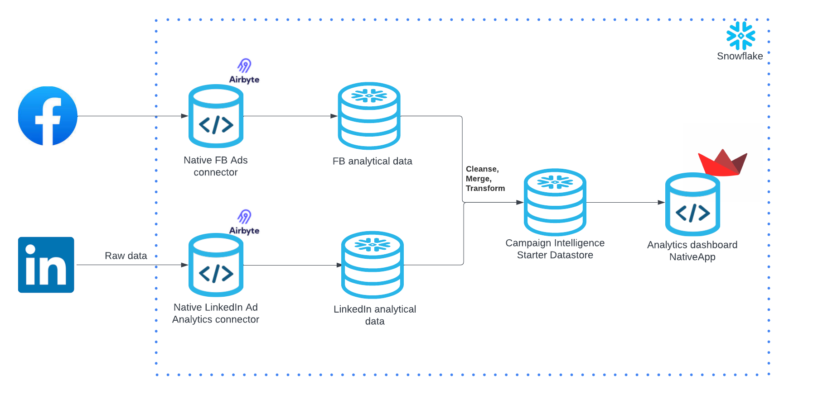

author: Diego Babb
id: marketing_data_foundation_starter_campaign_intelligence
summary: Marketing Data Foundation Starter campaign intelligence
categories: Data-Engineering
environments: web
status: Published
feedback link: https://github.com/Snowflake-Labs/sfguides/issues
tags: Marketing, Data Engineering, Native Application

# Marketing Data Foundation Starter for Campaign Intelligence

# Data Foundation Starter for Campaign Intelligence

## Overview

Duration: 15

The Data Foundation Starter for Campaign Intelligence is a part of the overall [Marketing Data Foundation Starter](https://github.com/Snowflake-Labs/sfguide-marketing-data-foundation-starter).

For more context on this solution, please refer to the [Marketing Data Foundation Starter](https://github.com/Snowflake-Labs/sfguide-marketing-data-foundation-starter)
and this slide deck [Marketing Data Foundation Starter for Customer 360 & Campaign Intelligence](https://docs.google.com/presentation/d/1TDrHMIUlxWtO8nt5508ZipuutPAyAMwohYuYH7ArbOE/edit?usp=sharing).

### Problem Space

The challenge of Campaign Intelligence centers on comprehensively understanding and optimizing the performance of marketing campaigns across various channels and platforms. Unlike the Customer 360 focus, which aims to construct a detailed profile of an individual customer, Campaign Intelligence seeks to aggregate, analyze, and act upon data related to marketing campaigns' effectiveness and efficiency. The core challenges in this space include: data fragmentation, the integration of diverse data sources, and the extraction of actionable insights from complex datasets.

#### Key Challenges in Campaign Intelligence

- Data Fragmentation Across Channels: Marketing campaigns today span a multitude of digital and traditional channels, each generating vast amounts of performance data. The fragmentation of this data across channels complicates efforts to gain a holistic view of campaign performance.<br>
- Integration of Diverse Data Sources: Compounding the challenge of data fragmentation is the need to integrate these diverse data sources into a unified analytics platform. This integration is crucial for conducting comprehensive analyses and gaining insights that can drive strategic adjustments to campaigns.<br>
- Extraction of Actionable Insights: With the sheer volume and complexity of campaign data, extracting actionable insights becomes a formidable challenge. Marketers need to sift through the noise to identify key performance indicators (KPIs) that truly matter for evaluating campaign effectiveness and ROI.

#### Specific Data Types Relevant to Campaign Intelligence

- Performance Metrics: Data on impressions, clicks, conversions, and other key performance indicators (KPIs) for each campaign.<br>
- Channel Engagement: Insights into how users interact with campaigns across different channels, including social media, email, search, and display advertising.<br>
- Cost Data: Information on the cost associated with each campaign, channel, or ad placement, crucial for calculating ROI and optimizing spend.<br>
- Audience Response: Feedback and engagement metrics from the target audience, including social media interactions, email responses, and conversion rates.

#### Actual Source Systems for Campaign Data

- Digital Advertising Platforms: (E.g., Google Ads, Facebook Ad Manager, LinkedIn Ads) Platforms where ads are run, offering detailed performance analytics.<br>
- Social Media Analytics Tools: (E.g., Hootsuite, Sprout Social, Buffer) Tools that provide insights into social media campaign performance and audience engagement.<br>
- Email Marketing Platforms: (E.g., Mailchimp, Constant Contact, SendGrid (Twilio SendGrid)) Services that track the performance of email campaigns, including open rates, click-through rates, and conversions.<br>
- Web Analytics Tools: (E.g., Google Analytics, Adobe Analytics, Mixpanel) Platforms that offer insights into how users interact with campaign landing pages and websites.
- Marketing Automation Tools: (E.g., HubSpot, Marketo, Pardot) Tools that facilitate the creation, execution, and analysis of marketing campaigns across channels.

### Solution Space

#### Context

This version covers Facebook Ads and LinkedIn ads as sources of Campaign Intelligence data.

##### Data Ingestion

To facilitate seamless data integration, we utilize Airbyte's native app connectors for Facebook Ads and LinkedIn Ads. These connectors, accessible via the Snowflake Marketplace, simplify the process of importing campaign data directly into Snowflake. This approach eliminates the need for additional infrastructure, streamlining the setup process. The connectors are available for a 30-day free trial, allowing users to experience the benefits firsthand before committing to Airbyte's services.

##### Data Transformation

Upon successful ingestion, the campaign data undergoes a comprehensive data cleansing and transformation process. This step is crucial for ensuring data quality and consistency, which are foundational for reliable analytics. We then proceed to merge the data, creating a unified Data Foundation Starter for Campaign Intelligence datastore. This datastore serves as the central repository for all campaign intelligence data, enabling advanced analysis and insights.

##### Data Visualization:

The culmination of our solution is a native analytics application that runs atop the Data Foundation Starter for Campaign Intelligence datastore. This application is designed to provide marketers with a clear view of their campaign performance metrics, including total ad spend and estimated revenue generated from these expenditures. By offering a straightforward, intuitive interface, our solution empowers marketers to make data-driven decisions, optimize their campaigns, and achieve better outcomes with their advertising efforts.

### Solution Details

#### Solution Components

The solution consists of the following components:

- **Native Application**: The code needed to build and deploy this solution as a Native App. You will deploy this app in your own Snowflake account.

#### Process Flow


### The App Architecture

### Data Foundation Starter for Campaign Intelligence

This solution consists of a sample for Marketing Data Foundation Starter for Campaign Intelligence.



## Prerequisites

- Install [Snow CLI](https://docs.snowflake.com/en/developer-guide/snowflake-cli-v2/installation/installation)

### What You’ll Need

- [GitHub](https://github.com/) Account
- [VSCode](https://code.visualstudio.com/download) Installed
- [Snow CLI](https://docs.snowflake.com/en/developer-guide/snowflake-cli-v2/installation/installation) Installed

### What You’ll Build

- Marketing Data Foundation Starter for Campaign Intelligence

## Setup

### Clone GitHub repository

Duration: 2

Clone the git repo to your local

```console
git clone https://github.com/Snowflake-Labs/sfguide-marketing-data-foundation-starter-campaign-intelligence.git
```

### Create a connection

```console
snow connection add
```

Refer to the output below for more info.

```shell
Name for this connection: marketing_demo_conn_int
Snowflake account name: *******
Snowflake username: DBABBJIMENEZ
Snowflake password [optional]:
Role for the connection [optional]: ACCOUNTADMIN
Warehouse for the connection [optional]: COMPUTE_WH
Database for the connection [optional]: snowflake
Schema for the connection [optional]: account_usage
Connection host [optional]:
Connection port [optional]:
Snowflake region [optional]: us-east-1
Authentication method [optional]:
Path to private key file [optional]:
Wrote new connection marketing_demo_conn_int to /Users/dbabbjimenez/Library/Application Support/snowflake/config.toml
```

To review the new created connection use:

```console
snow connection list
```

Refer to the output below:

```shell
+-----------------------------------------------------------------------------------------------------------+
| connection_name         | parameters                                                                      |
|-------------------------+---------------------------------------------------------------------------------|
| marketing_demo_conn_int | {'account': '*******', 'user': 'DBABBJIMENEZ', 'region': 'us-east-1',          |
|                         | 'database': 'snowflake', 'schema': 'account_usage', 'warehouse': 'COMPUTE_WH',  |
|                         | 'role': 'ACCOUNTADMIN'}                                                         |
+-----------------------------------------------------------------------------------------------------------+
```

## Create Database objects

Duration: 2

Navigate to the repo folder in your local machine and run the below command to create your database, schema and stage objects

First lets export the connection name to the default connection

```console
export SNOWFLAKE_DEFAULT_CONNECTION_NAME=marketing_demo_conn_int
```

```console
snow sql -f sql_scripts/setup.sql
```

```shell
create or replace database CAMPAIGN_INTELLIGENCE comment = 'used for demonstrating Snowflake Campaign Intelligence for Marketing';
+------------------------------------------------------+
| status                                               |
|------------------------------------------------------|
| Database CAMPAIGN_INTELLIGENCE successfully created. |
+------------------------------------------------------+

create or replace schema CAMPAIGN_INTELLIGENCE.demo;
+-----------------------------------+
| status                            |
|-----------------------------------|
| Schema DEMO successfully created. |
+-----------------------------------+

use schema CAMPAIGN_INTELLIGENCE.demo;
+----------------------------------+
| status                           |
|----------------------------------|
| Statement executed successfully. |
+----------------------------------+

create or replace stage lib_stg
        directory = ( enable = true )
    comment = 'used for holding udfs and procs.';
+------------------------------------------+
| status                                   |
|------------------------------------------|
| Stage area LIB_STG successfully created. |
+------------------------------------------+

create or replace stage data_stg
    comment = 'used for holding data.';
+-------------------------------------------+
| status                                    |
|-------------------------------------------|
| Stage area DATA_STG successfully created. |
+-------------------------------------------+

create or replace stage scripts_stg
    comment = 'used for holding scripts.';
+----------------------------------------------+
| status                                       |
|----------------------------------------------|
| Stage area SCRIPTS_STG successfully created. |
+----------------------------------------------+

use database CAMPAIGN_INTELLIGENCE;
+----------------------------------+
| status                           |
|----------------------------------|
| Statement executed successfully. |
+----------------------------------+

use schema demo;
+----------------------------------+
| status                           |
|----------------------------------|
| Statement executed successfully. |
+----------------------------------+

```

## Upload sample data to stage

Duration: 4

Upload all the sample data files in the folder data to stage created in `Create Database objects` step

```console
snow object stage copy data/worldcities.csv @CAMPAIGN_INTELLIGENCE.demo.data_stg/data
```

```shell
put file:///Users/dbabbjimenez/Developer/MarTech/sfguide-marketing-data-foundation-starter-campaign-intelligence/data/worldcities.csv @CAMPAIGN_INTELLIGENCE.demo.data_stg/data auto_compress=false parallel=4 overwrite=False
+------------------------------------------------------------------------------------------------------------------------------+
| source          | target          | source_size | target_size | source_compression | target_compression | status   | message |
|-----------------+-----------------+-------------+-------------+--------------------+--------------------+----------+---------|
| worldcities.csv | worldcities.csv | 4734682     | 4734688     | NONE               | NONE               | UPLOADED |         |
+------------------------------------------------------------------------------------------------------------------------------+
```

```console
snow object stage copy data/sf_data/ @CAMPAIGN_INTELLIGENCE.demo.data_stg/data/sf_data/
```

```shell
put file:///Users/dbabbjimenez/Developer/MarTech/sfguide-marketing-data-foundation-starter-campaign-intelligence/data/sf_data/* @CAMPAIGN_INTELLIGENCE.demo.data_stg/data/sf_data/ auto_compress=false parallel=4 overwrite=False
+----------------------------------------------------------------------------------------------------------------------------------------------------------------------+
| source                              | target                              | source_size | target_size | source_compression | target_compression | status   | message |
|-------------------------------------+-------------------------------------+-------------+-------------+--------------------+--------------------+----------+---------|
| salesforce_sample_data_0_0_0.csv.gz | salesforce_sample_data_0_0_0.csv.gz | 3826132     | 3826144     | GZIP               | GZIP               | UPLOADED |         |
| salesforce_sample_data_0_1_0.csv.gz | salesforce_sample_data_0_1_0.csv.gz | 3828757     | 3828768     | GZIP               | GZIP               | UPLOADED |         |
| salesforce_sample_data_0_2_0.csv.gz | salesforce_sample_data_0_2_0.csv.gz | 3824096     | 3824112     | GZIP               | GZIP               | UPLOADED |         |
| salesforce_sample_data_0_3_0.csv.gz | salesforce_sample_data_0_3_0.csv.gz | 3829383     | 3829392     | GZIP               | GZIP               | UPLOADED |         |
| salesforce_sample_data_0_4_0.csv.gz | salesforce_sample_data_0_4_0.csv.gz | 3827103     | 3827104     | GZIP               | GZIP               | UPLOADED |         |
| salesforce_sample_data_0_5_0.csv.gz | salesforce_sample_data_0_5_0.csv.gz | 3835074     | 3835088     | GZIP               | GZIP               | UPLOADED |         |
| salesforce_sample_data_0_6_0.csv.gz | salesforce_sample_data_0_6_0.csv.gz | 3830438     | 3830448     | GZIP               | GZIP               | UPLOADED |         |
| salesforce_sample_data_0_7_0.csv.gz | salesforce_sample_data_0_7_0.csv.gz | 3829980     | 3829984     | GZIP               | GZIP               | UPLOADED |         |
+----------------------------------------------------------------------------------------------------------------------------------------------------------------------+
```

```console
snow object stage copy data/ga_data/ @CAMPAIGN_INTELLIGENCE.demo.data_stg/data/ga_data/
```

```shell
put file:///Users/dbabbjimenez/Developer/MarTech/sfguide-marketing-data-foundation-starter-campaign-intelligence/data/ga_data/* @CAMPAIGN_INTELLIGENCE.demo.data_stg/data/ga_data/ auto_compress=false parallel=4 overwrite=False
+------------------------------------------------------------------------------------------------------------------------------------------------------+
| source                      | target                      | source_size | target_size | source_compression | target_compression | status   | message |
|-----------------------------+-----------------------------+-------------+-------------+--------------------+--------------------+----------+---------|
| ga_sample_data_0_0_0.csv.gz | ga_sample_data_0_0_0.csv.gz | 25022153    | 25022160    | GZIP               | GZIP               | UPLOADED |         |
| ga_sample_data_0_0_1.csv.gz | ga_sample_data_0_0_1.csv.gz | 25020796    | 25020800    | GZIP               | GZIP               | UPLOADED |         |
| ga_sample_data_0_0_2.csv.gz | ga_sample_data_0_0_2.csv.gz | 12596227    | 12596240    | GZIP               | GZIP               | UPLOADED |         |
| ga_sample_data_0_1_0.csv.gz | ga_sample_data_0_1_0.csv.gz | 25026694    | 25026704    | GZIP               | GZIP               | UPLOADED |         |
| ga_sample_data_0_1_1.csv.gz | ga_sample_data_0_1_1.csv.gz | 25011153    | 25011168    | GZIP               | GZIP               | UPLOADED |         |
| ga_sample_data_0_1_2.csv.gz | ga_sample_data_0_1_2.csv.gz | 12025707    | 12025712    | GZIP               | GZIP               | UPLOADED |         |
| ga_sample_data_0_2_0.csv.gz | ga_sample_data_0_2_0.csv.gz | 25040511    | 25040512    | GZIP               | GZIP               | UPLOADED |         |
| ga_sample_data_0_2_1.csv.gz | ga_sample_data_0_2_1.csv.gz | 25022834    | 25022848    | GZIP               | GZIP               | UPLOADED |         |
| ga_sample_data_0_2_2.csv.gz | ga_sample_data_0_2_2.csv.gz | 12044280    | 12044288    | GZIP               | GZIP               | UPLOADED |         |
| ga_sample_data_0_3_0.csv.gz | ga_sample_data_0_3_0.csv.gz | 25027009    | 25027024    | GZIP               | GZIP               | UPLOADED |         |
| ga_sample_data_0_3_1.csv.gz | ga_sample_data_0_3_1.csv.gz | 25035010    | 25035024    | GZIP               | GZIP               | UPLOADED |         |
| ga_sample_data_0_3_2.csv.gz | ga_sample_data_0_3_2.csv.gz | 11516130    | 11516144    | GZIP               | GZIP               | UPLOADED |         |
| ga_sample_data_0_4_0.csv.gz | ga_sample_data_0_4_0.csv.gz | 25013661    | 25013664    | GZIP               | GZIP               | UPLOADED |         |
| ga_sample_data_0_4_1.csv.gz | ga_sample_data_0_4_1.csv.gz | 25008308    | 25008320    | GZIP               | GZIP               | UPLOADED |         |
| ga_sample_data_0_4_2.csv.gz | ga_sample_data_0_4_2.csv.gz | 13143585    | 13143600    | GZIP               | GZIP               | UPLOADED |         |
| ga_sample_data_0_5_0.csv.gz | ga_sample_data_0_5_0.csv.gz | 25021248    | 25021264    | GZIP               | GZIP               | UPLOADED |         |
| ga_sample_data_0_5_1.csv.gz | ga_sample_data_0_5_1.csv.gz | 25021975    | 25021984    | GZIP               | GZIP               | UPLOADED |         |
| ga_sample_data_0_5_2.csv.gz | ga_sample_data_0_5_2.csv.gz | 7762439     | 7762448     | GZIP               | GZIP               | UPLOADED |         |
| ga_sample_data_0_6_0.csv.gz | ga_sample_data_0_6_0.csv.gz | 25020356    | 25020368    | GZIP               | GZIP               | UPLOADED |         |
| ga_sample_data_0_6_1.csv.gz | ga_sample_data_0_6_1.csv.gz | 21857953    | 21857968    | GZIP               | GZIP               | UPLOADED |         |
| ga_sample_data_0_7_0.csv.gz | ga_sample_data_0_7_0.csv.gz | 25039177    | 25039184    | GZIP               | GZIP               | UPLOADED |         |
| ga_sample_data_0_7_1.csv.gz | ga_sample_data_0_7_1.csv.gz | 25015662    | 25015664    | GZIP               | GZIP               | UPLOADED |         |
| ga_sample_data_0_7_2.csv.gz | ga_sample_data_0_7_2.csv.gz | 11624943    | 11624944    | GZIP               | GZIP               | UPLOADED |         |
+------------------------------------------------------------------------------------------------------------------------------------------------------+
```

```console
snow object stage copy data/sample_data.gz @CAMPAIGN_INTELLIGENCE.demo.data_stg/data/
```

```shell
put file:///Users/dbabbjimenez/Developer/MarTech/sfguide-marketing-data-foundation-starter-campaign-intelligence/data/sample_data.gz @CAMPAIGN_INTELLIGENCE.demo.data_stg/data/ auto_compress=false parallel=4 overwrite=False
+----------------------------------------------------------------------------------------------------------------------------+
| source         | target         | source_size | target_size | source_compression | target_compression | status   | message |
|----------------+----------------+-------------+-------------+--------------------+--------------------+----------+---------|
| sample_data.gz | sample_data.gz | 22158239    | 22158240    | GZIP               | GZIP               | UPLOADED |         |
+----------------------------------------------------------------------------------------------------------------------------+
```

If the upload fails due to access issue then, please follow the instructions in this [document](https://docs.snowflake.com/en/user-guide/data-load-local-file-system-stage-ui) to upload the files directly to Snowflake Stage.

## Load Sample data

Duration: 2

### Load data and create view

Run the below command to create the views that will be bundled along with the nativeapp

```console
snow sql -f sql_scripts/build_views.sql
```

```shell
create or replace database CAMPAIGN_INTELLIGENCE comment = 'used for demonstrating Snowflake Campaign Intelligence for Marketing';
+------------------------------------------------------+
| status                                               |
|------------------------------------------------------|
| Database CAMPAIGN_INTELLIGENCE successfully created. |
+------------------------------------------------------+

create or replace schema CAMPAIGN_INTELLIGENCE.demo;
+-----------------------------------+
| status                            |
|-----------------------------------|
| Schema DEMO successfully created. |
+-----------------------------------+

use schema CAMPAIGN_INTELLIGENCE.demo;
+----------------------------------+
| status                           |
|----------------------------------|
| Statement executed successfully. |
+----------------------------------+

create or replace stage lib_stg
        directory = ( enable = true )
    comment = 'used for holding udfs and procs.';
+------------------------------------------+
| status                                   |
|------------------------------------------|
| Stage area LIB_STG successfully created. |
+------------------------------------------+

create or replace stage data_stg
    comment = 'used for holding data.';
+-------------------------------------------+
| status                                    |
|-------------------------------------------|
| Stage area DATA_STG successfully created. |
+-------------------------------------------+

create or replace stage scripts_stg
    comment = 'used for holding scripts.';
+----------------------------------------------+
| status                                       |
|----------------------------------------------|
| Stage area SCRIPTS_STG successfully created. |
+----------------------------------------------+

use database CAMPAIGN_INTELLIGENCE;
+----------------------------------+
| status                           |
|----------------------------------|
| Statement executed successfully. |
+----------------------------------+

use schema demo;
+----------------------------------+
| status                           |
|----------------------------------|
| Statement executed successfully. |
+----------------------------------+

```

## Create the native app

Duration: 2

### Build NativeApp

To deploy the native app you have to run the following command using SnowCLI:

```console
snow app run
```

```shell
Creating new application package Snowflake_for_Marketing_CampaignIntelligence_pkg_dbabbjimenez in account.
Applying package script: sql_scripts/shared-content.sql
Checking if stage exists, or creating a new one if none exists.
Performing a diff between the Snowflake stage and your local deploy_root ('/Users/dbabbjimenez/Developer/MarTech/sfguide-marketing-data-foundation-starter-campaign-intelligence/output/deploy') directory.
There are no new files that exist only on the stage.
There are no existing files that have been modified, or their status is unknown.
There are no existing files that are identical to the ones on the stage.
New files only on your local:
manifest.yml
readme.md
scripts/setup.sql
streamlit/Home.py
streamlit/environment.yml
streamlit/images/Arch_Customer72.png
streamlit/images/Arch_Marketing72.png
streamlit/images/Campaign_Starter.png
streamlit/images/Customer_Starter.png
streamlit/images/Data_Catalog.png
streamlit/images/Data_Sources.png
streamlit/pages/1_Campaign_Intelligence.py
streamlit/pages/2_Data_Sources.py
streamlit/pages/3_Data_Catalog.py
Uploading diff-ed files from your local /Users/dbabbjimenez/Developer/MarTech/sfguide-marketing-data-foundation-starter-campaign-intelligence/output/deploy directory to the Snowflake stage.
Creating new application Snowflake_for_Marketing_CampaignIntelligence_dbabbjimenez in account.
Your application object (Snowflake_for_Marketing_CampaignIntelligence_dbabbjimenez) is now available:
https://app.snowflake.com/PWOBZKF/rvb00041/#/apps/application/SNOWFLAKE_FOR_MARKETING_CAMPAIGNINTELLIGENCE_DBABBJIMENEZ
```

## Conclusion

Duration: 1

Congratulations! You have successfully learnt how to easily build an end to end Native Application and loading sample data.

You will see your application listed in your account:


If you open the app and navigate to the the Campaign Intelligence starter tab, you will see some infographics describing the sample data we just uploaded.


### What you learned

- How to host build a basic native app for Campaign Intelligence Marketing data.
- Generate a set of views that aggregate data from Marketing providers like Google and Salesforce.
- Generate quick summaries and Charts using that data to create an integrated dashboard using streamlit.

### Related Resources

Want to learn more about the tools and technologies used by your app? Check out the following resources:

- [Source Code on GitHub](https://github.com/Snowflake-Labs/sfguide-marketing-data-foundation-starter)
- [Snowpark Python Developer Guide](https://docs.snowflake.com/en/developer-guide/snowpark/python/index)
- [Snowpark Guide for Data Engineers](https://www.snowflake.com/resource/the-data-engineers-guide-to-python-for-snowflake/)
