author: seanyse
id: max_my_cloud
summary: This is a Max My Cloud Installation Guide and Documentation
categories: Getting-Started
environments: web
status: Published 
feedback link: https://github.com/Snowflake-Labs/sfguides/issues
tags: Getting Started, Max-My-Cloud, Data Engineering 
# MaxMyCloud Installation Guide
<!-- ------------------------ -->

## Overview
Duration: 3

### Overview
MaxMyCloud helps Snowflake customers optimize costs, improve resource efficiency, and gain deep operational visibility into their data platform environments.

### What You Will Build
* A connection between your Snowflake account and the MaxMyCloud platform by installing the MaxMyCloud Native App.
* A configured MaxMyCloud Web UI to monitor and manage your Snowflake environment.
* Optionally, set up specific monitors like Budget Monitoring, Query Monitoring, and Warehouse Scheduling.

### Architecture

The MaxMyCloud architecture includes:

- **Snowflake Native App:** Deployed directly within your Snowflake account, the Native App acts as a database agent. It analyzes metadata, monitors usage patterns, and generates optimization insights—while ensuring that your data never leaves your environment.
- **Web UI:** A secure web application providing Snowflake Administrators with an intuitive interface to interact with the Native App and view actionable recommendations and monitoring results.

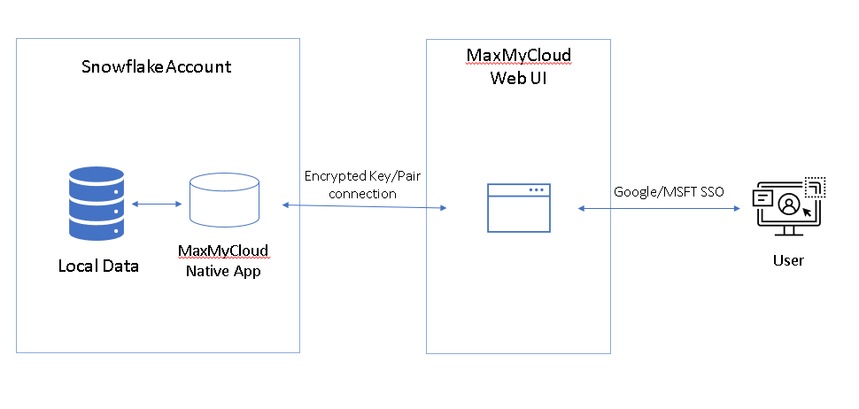

### What You Will Learn
* The core components and architecture of MaxMyCloud.
* The security principles and data handling practices of MaxMyCloud.
* How to install and grant permissions for the MaxMyCloud Native App in Snowflake.
* How to create a Snowflake user and role specifically for MaxMyCloud Web UI access using key-pair authentication.
* How to connect and navigate the MaxMyCloud Web UI.
* The purpose and setup of key MaxMyCloud features designed for cost optimization and operational efficiency.

### Prerequisites
* An active Snowflake account with ACCOUNTADMIN privileges (required for Native App installation and role creation).
* Access to the Snowflake Marketplace.
* Ability to generate and manage SSL key pairs locally (for the recommended Web UI authentication).
* A modern web browser for accessing the MaxMyCloud Web UI.
* Email access for account verification and alerts.


## Get the Native App
Duration: 5

The MaxMyCloud Native App is available on the [Snowflake Marketplace](https://app.snowflake.com/marketplace/listing/GZTSZN4XBN). Follow the instructions below to install the application. Once installed, [sign up](https://app.maxmycloud.com/signup) to start using MaxMyCloud.

### Step 1: Locate the Installed App

Once the app is installed:

- Navigate to **Data Products → Apps → Installed Apps.**
- Find the **MaxMyCloud Monitor Center** in the list.
- Click the **Monitor Center** icon, then select **Snowflake_insight** to launch the Native App.

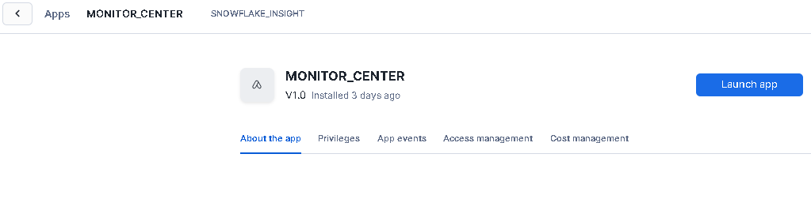

### Step 2: Grant Required Permissions

During setup, two authorization prompts will appear requesting Snowflake privileges. Click **“Grant Privileges”** to continue.

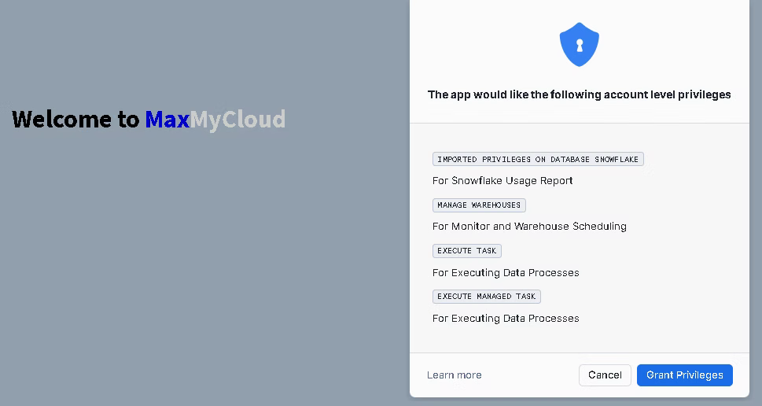

### Step 3: Installation Confirmation

Installation typically completes in under 30 seconds. A green checkmark will confirm the app has been successfully installed.

Shortly afterward, the **Data Refresh** process will begin automatically. You can optionally click **“Check Status”** to view progress. This process runs in the background, so you may safely close the app window.

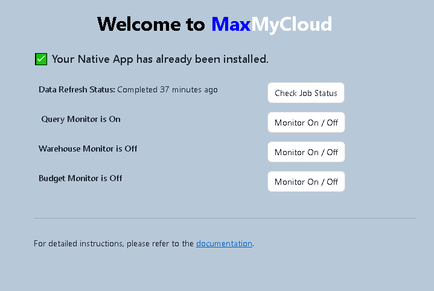

### Monitor Status Overview

Once installation is complete, the following monitors will be available:

### 1. 🔍 Query Monitor

Tracks and analyzes Snowflake query activity. Email alerts can be configured to flag unusual or resource-intensive queries.

### 2. 🏗️ Warehouse Monitor

Monitors warehouse workload. If a warehouse remains idle beyond a pre-defined threshold, it will be automatically be **suspended** to reduce costs.

Note: This monitor is disabled by default.

### 3. 🏗️ Warehouse Scheduler

The Warehouse Scheduler enables administrators to configure Snowflake warehouse properties based on the time of day and day of the week (Weekdays, Saturday, Sunday). This is particularly beneficial for workloads with variable resource demands throughout the day or week, enabling optimized performance and cost efficiency.

### 4. 💰 Budget Monitor

Allows you to define BU (Business Unit) budgets. If usage trends indicate a potential budget overrun, alerts are triggered proactively.

Note: This monitor is disabled by default.

## Complete Setup

### Prerequisites

Before using the Web UI, ensure the following prerequisites are met:

1. **Get the MaxMyCloud Native App on Snowflake**
2. **Create Snowflake User for Web UI Access**

### Create Role
Execute the following SQL in your Snowflake worksheet to create the required role:

```SQL 
create role maxmycloud_role;
GRANT APPLICATION ROLE app_maxmycloud TO ROLE maxmycloud_role;
GRANT USAGE ON WAREHOUSE your_warehouse TO ROLE maxmycloud_role;
GRANT USAGE ON INTEGRATION MAXMYCLOUD_API_INTEGRATION TO maxmycloud_role;
```

### Choose Authentication Method

You can create the user using either:

1. **Username & Password** – For testing only
2. **Key Pair Authentication** – Recommended for production

### Key Pair Authentication (Recommended)
### Step 1: Generate Key Pair

Run these commands locally to generate your private and public key:

```terminal
openssl genrsa 2048 | openssl pkcs8 -topk8 -inform PEM -out rsa_key.p8 -nocrypt
```

```terminal
openssl rsa -in rsa_key.p8 -pubout -out rsa_key.pub
```
### Step 2: Create the Snowflake User

```terminal

CREATE OR REPLACE USER maxmycloud
PASSWORD = ''  -- Ensure No password for key-pair method
LOGIN_NAME = 'maxmycloud'
DISPLAY_NAME = 'maxmycloud'
DEFAULT_WAREHOUSE = 'your_warehouse'
DEFAULT_ROLE = 'maxmycloud_role'
DISABLED = FALSE;

GRANT ROLE maxmycloud_role TO USER maxmycloud;
        
```


### Step 3: Assign the Public Key

Replace the example key below with the contents of your generated rsa_key.pub file:

```terminal 
ALTER USER maxmycloud SET RSA_PUBLIC_KEY='MIIBIjANBgkqh...';
```

That’s it for Snowflake configuration. Save your key files securely before proceeding.

### Sign Up and Configure Snowflake Connection

Once the prerequisites are complete, [sign up](https://app.maxmycloud.com/signup)

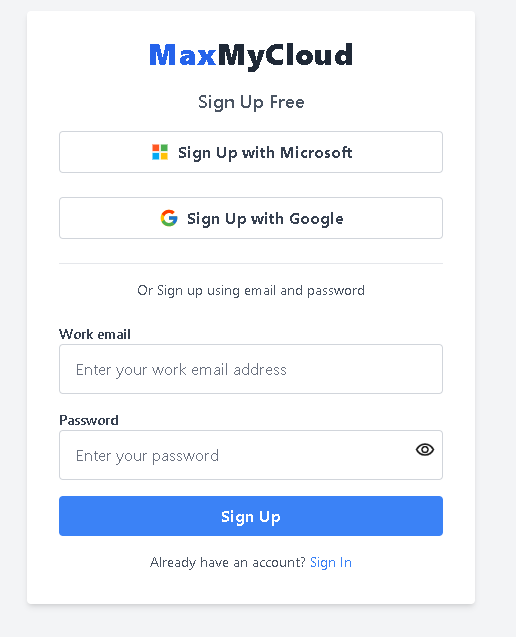

MaxMyCloud Web UI is secured by default with trusted Google or Microsoft Single Sign-On (SSO). If your organization uses enterprise SSO solutions (such as SAML, Azure Active Directory, or Okta), we support custom integrations. Please [contact us](https://www.maxmycloud.com/contact) to discuss integration options.

After signing in, first-time users will be directed to the Get Started page to configure their Snowflake connection.

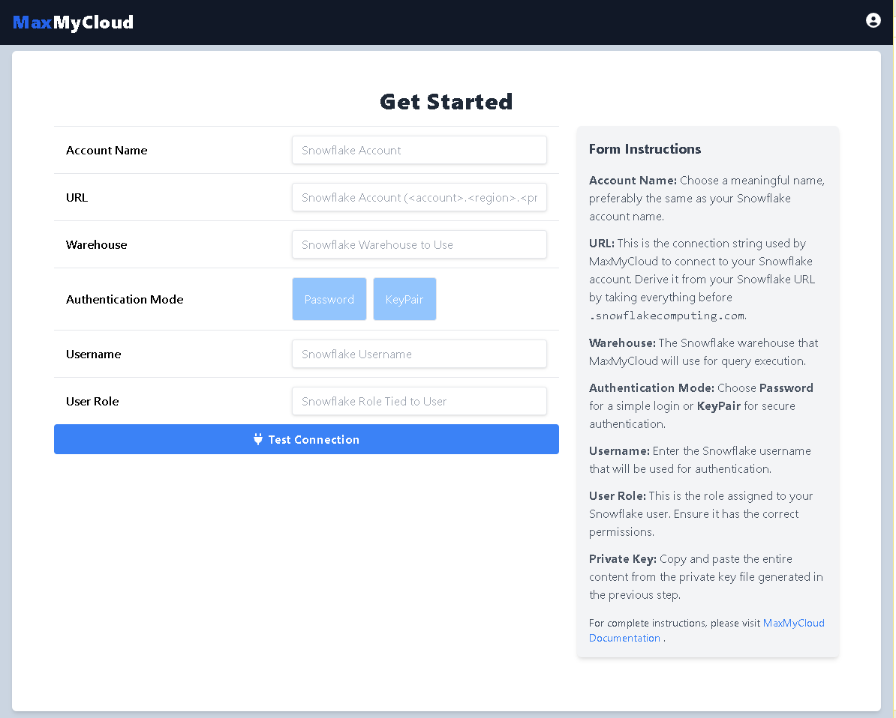

### Complete the Get Started Form

- **Account Name:** Use a recognizable label (e.g., your Snowflake account name).
- **URL:** Use everything before .snowflakecomputing.com.
  - Example: if your URL is https://<org>-<acct>.snowflakecomputing.com, enter <org>-<acct>.
- **Warehouse:** Use the same warehouse you granted access to the role.
- **Auth Mode:** Select KeyPair and paste your private key.
- **Username:** Enter maxmycloud.
- **User Role:** Enter maxmycloud_role.

Click **“Test Connection”** to verify connection.

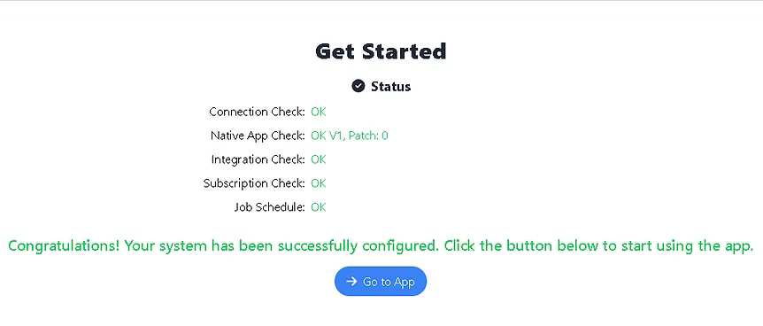

### Navigate the Web UI

After connecting successfully, click **“Go to App”** to access the main interface.

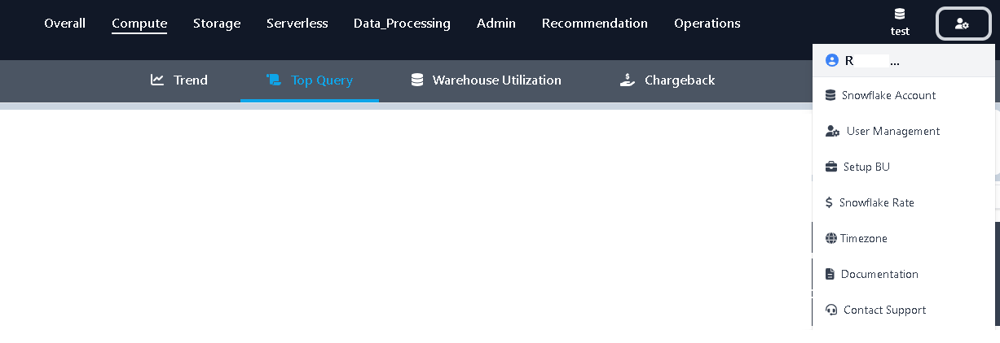

MaxMyCloud Web UI offers a clean, intuitive experience and consists of two main modules:

### Insights

Gain deep analytical insights on Snowflake usage based on historical patterns, Menu item includes:

- **Overall**
- **Compute**
- **Storage**
- **Serverless**
- **Data Processing**
- **Admin**
- **Recommendations** — actionable suggestions for optimizing cost and performance.

### Operations

Real-time monitoring and controls, accessible under the Operations menu:

- **Budget Monitoring**
- **Query Monitoring**
- **Warehouse Monitoring**
- **Warehouse Scheduler**

### Additional Features

- **Access Profile Settings** from the user icon (top right).
- **Switch Snowflake Accounts** using the database icon (left to user icon).

### Appendix: Locate Your Snowflake URL

In Snowsight, follow these steps:

1. Click your name in the bottom-left corner
2. Select **Connect a tool to Snowflake**
3. Copy the **Account/Server** URL from the right panel

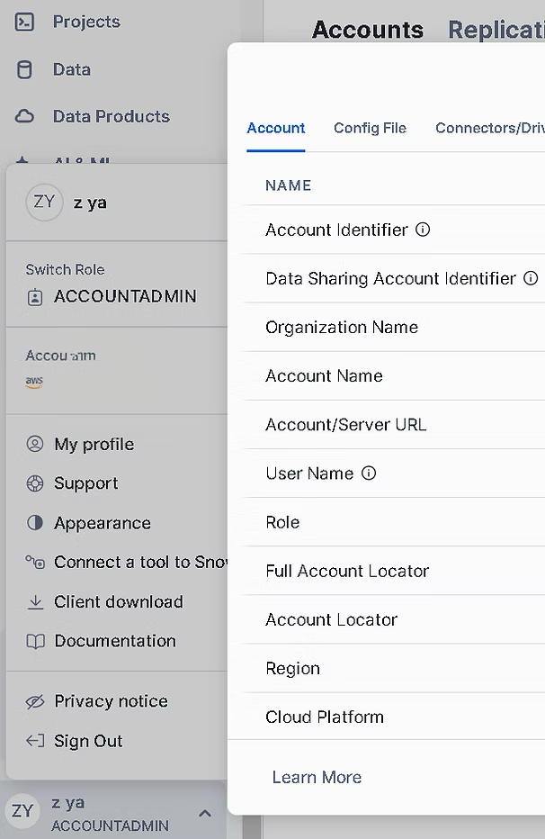

## Departmental Budget Monitoring

### Purpose:

Define financial responsibility and budgets at the department or business unit (BU) level, and receive alerts when usage trends suggest a potential budget overrun.
Unlike Snowflake's built-in budgets—which are limited to warehouse or account level—this solution offers fine-grained control. It’s ideal for organizations that want to share warehouse while maintaining clear visibility into each department’s usage and budget.

### Setup: Create or Edit a Business Unit

From the top navigation, go to **Operations → Budget Monitor.** Click **“Create New”** or edit an existing BU to open the configuration window.

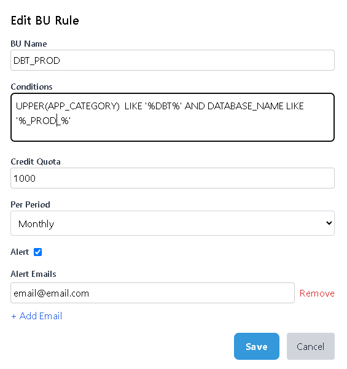

The form includes the following fields:

- **BU Name:** A descriptive name representing your business unit or department.
- **Conditions:** Define filters to associate queries with this BU. You can combine factors like Application Name, User, Query Tag, Warehouse, and more.

**Available Fields:**

| Field Name        | Description                                         |
|-------------------|-----------------------------------------------------|
| QUERY_TAG         | Query tag associated with the statement             |
| APP               | Application name that initiated the query           |
| APP_CATEGORY      | Category of the application                         |
| USER_NAME         | Name of the user who executed the query             |
| ROLE_NAME         | Role of the user                                    |
| WAREHOUSE_NAME    | Name of the virtual warehouse                       |
| WAREHOUSE_SIZE    | Size class of the warehouse                         |
| WAREHOUSE_TYPE    | Type of the warehouse (e.g., standard, serverless)  |
| DATABASE_NAME     | Name of the database accessed                       |
| SCHEMA_NAME       | Schema used in the query                            |
| TARGET_TABLENAME  | Target table name for data-modifying operations     |
| TARGET_SCHEMA     | Schema of the target table                          |
| TARGET_DATABASE   | Database of the target table                        |
| QUERY_TYPE        | Type of SQL statement (e.g., SELECT, INSERT)        |
| HOUR              | Hour the query was run                              |

- **Credit Quota:** Number of Snowflake credits allowed during the selected period.
- **Per Period:** Select from **Monthly** (default), **Weekly**, or **Daily**.
- **Alert:** Enable to receive an email alert if the budget is on track to be exceeded.
- **Alert Emails:** List of recipients to be notified when an alert is triggered.
📌 Rule Priority: You can reorder BUs in the main Budget Monitor list. If a query matches multiple BUs, the one higher on the list (top of the page) will take precedence.

### Budget Alerts

If a BU is projected to exceed its defined credit quota, alert emails will be sent to the specified recipients.

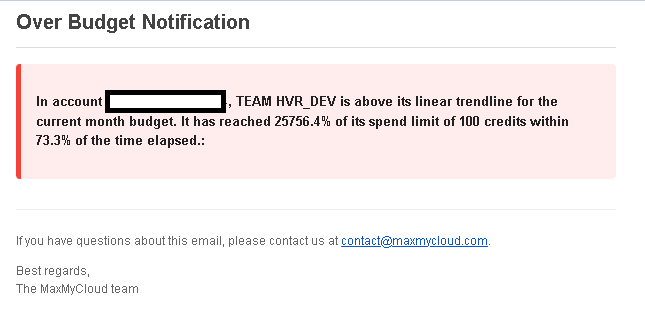

### Viewing BU Cost Reports

To view monthly BU-level cost breakdowns, navigate to **Compute → Chargeback** in the main menu.

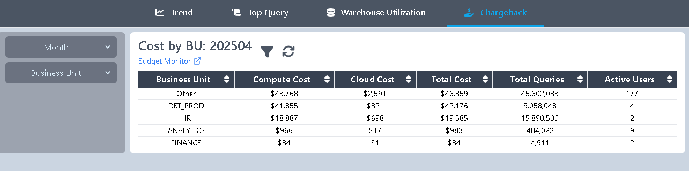

## Query Monitor

### Purpose:

Query Monitor enables Snowflake administrators to monitor query activity, receive email alerts, and take proactive actions when predefined rules are violated (e.g., long-running queries or warehouse overload).

### Setup: Create a Query Monitor

From the top navigation, go to **Operations → Query Monitor.** Click **“Create New”** or edit an existing Monitor to open the configuration form.

The form includes the following fields:

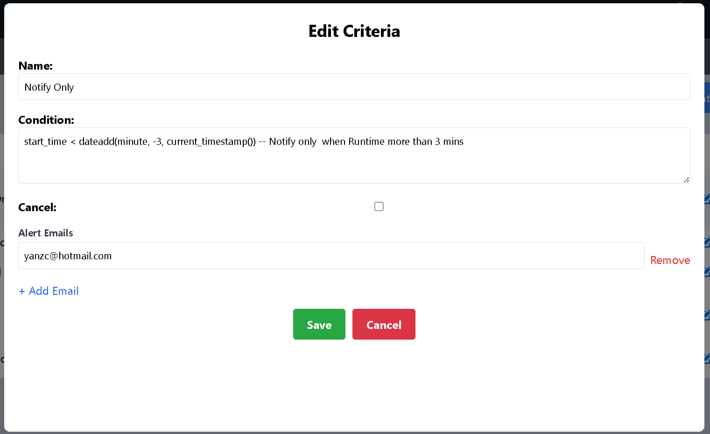

- **Name:** A unique name for the monitor.
- **Condition:** Define the conditions that will trigger alerts.

MaxMyCloud utilizes the Snowflake Query History API, allowing you to build conditions based on any fields the API provides. For a complete list, refer to the [Snowflake Documentation.](https://docs.snowflake.com/en/sql-reference/functions/query_history)

**MaxMyCloud also provides built-in functions to refine your conditions:**


| Function       | Description                                                        | Example                                                        |
|----------------|--------------------------------------------------------------------|----------------------------------------------------------------|
| CREDIT_USED()  | Returns the amount of credits consumed by a query.                 | credit_used() > 1 (Alert if query uses more than 1 credit.)    |
| RUN_HOUR()     | Returns the hour of the day (0–23) when the query is running.      | query_tag = 'FINISH BY 2am' AND run_hour() > 2                 |
| RUN_MINUTE()   | Returns the minute of the hour (0–59) when the query is running.   | run_minute() > 30 (Query running past 30 minutes into the hour.) |
| RUN_TIME()     | Returns the current time of day when the query is running in HH:MM format. | run_time() > '14:00' (Query still running after 2:00 PM.) |


- **Cancel:** Optionally kill the query automatically if the condition is met.
- **Emails:** List of recipient email addresses for alert notifications.

Click **Save** to return to the list of Query Monitors.

### Alerts

If a running query meets a defined condition, alert emails are sent to the specified recipients.

- **Example 1:** A query is automatically cancelled when it violates a condition.

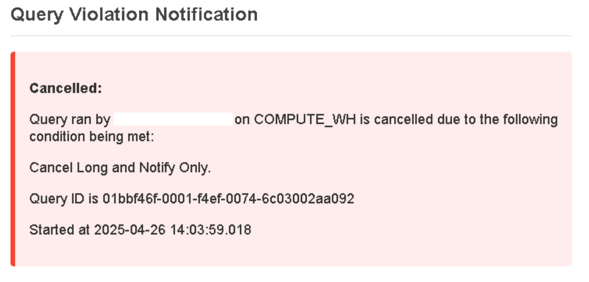

- **Example 2:** A query violates a condition, but is not cancelled — an email notification is still sent to alert administrators.

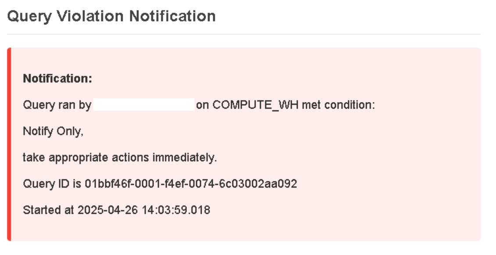


## Warehouse Scheduler

### Purpose

The **Warehouse Scheduler** enables administrators to configure Snowflake warehouse properties based on the time of day and day of the week (Weekdays, Saturday, Sunday). This is particularly beneficial for workloads with variable resource demands throughout the day or week, enabling optimized performance and cost efficiency.

### Creating, Editing, or Deleting a Warehouse Schedule

1. Navigate to **Operations → WH Schedule**. A list of available Snowflake warehouses will be displayed.
2. Locate the warehouse you wish to schedule and click **"Schedule"** in the **Action** column.
If the warehouse is not yet scheduled, an informational window will appear. Click the blue **"Enable Schedule"** button in the window.
3. You will be directed to the Scheduler screen.
By default, the schedule spans from **00:00 to 23:59** for **Weekday**, **Saturday**, and **Sunday** sections.

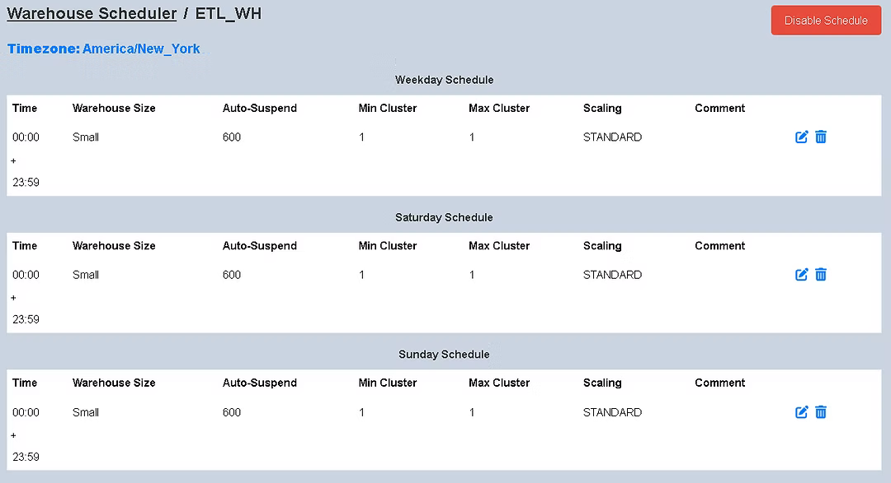

4. Click “+” to add a new time range during which warehouse properties should change.
Click “–” to remove an existing time range.
5. A pop-up window will appear when adding or editing a schedule.

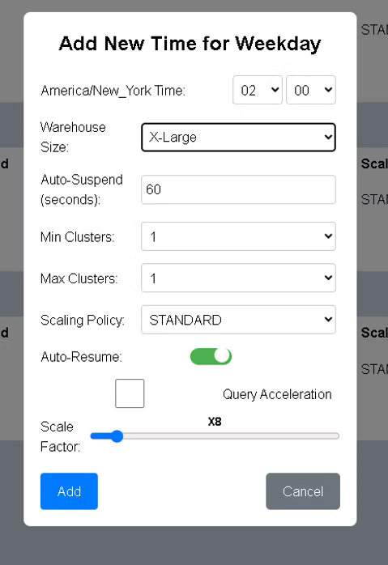

6. Enter the desired warehouse settings (e.g., size, auto-suspend) and click **"Add"** or **"Save".**
Note: Time selection is in 15-minute increments. Minutes must be either **00, 15, 30,** or **45.**
7. You will return to the Warehouse Scheduler screen for the selected warehouse.
Review the configured time ranges and property settings.

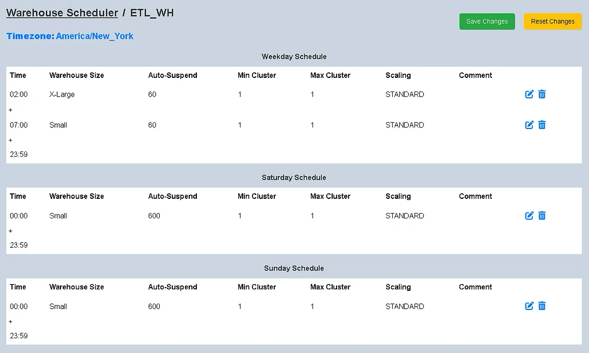

8. If the configuration looks correct, click "Save Changes" to store the schedule in the database.
The new schedule will take effect immediately.
9. To disable scheduling, click the red "Disable Schedule" button.

### Note

- All schedule times are displayed in your configured time zone, indicated in blue on the Scheduler page.
- To change your time zone, navigate to **Settings → Timezone.**

## Warehouse Monitor

### Purpose

The **Warehouse Monitor** continuously monitors all warehouses in your Snowflake account and automatically suspends any warehouse that remains active beyond a specified inactivity threshold. This helps avoid unnecessary compute costs by acting as a safeguard against accidentally leaving warehouses running idle.

> **Note:** This tool is not intended to replace Snowflake’s native *auto-suspend* feature.  
> We strongly recommend setting Snowflake’s auto-suspend to **60 seconds** instead of relying on the Snowflake default to maximize cost efficiency.  
> The Warehouse Monitor acts as a safeguard to ensure warehouses are not inadvertently left running idle.

### Configuration Guide

Navigate to **Operations → WH Schedule.** A list of available Snowflake warehouses will be displayed.


1. **Define the Inactivity Threshold:**  
   Set the inactivity threshold (in seconds) between 0 and 60. While any value is permitted,  
   we recommend staying under 60 seconds. You may also exclude specific warehouses  
   from this threshold.

2. **Select Warehouse Sizes to Monitor:**  
   Choose which warehouse sizes to monitor. You can either select all sizes or target  
   specific ones depending on your cost management strategy.

3. **Include or Exclude Specific Warehouses:**  
   Use the *Include* or *Exclude* radio options in the configuration table to refine which  
   warehouses are affected by the monitor.

4. Once configuration is complete, click the **“Save & Monitor”** button to activate monitoring.

### Enabling & Disabling the Monitor

- The Warehouse Monitor is **disabled by default.** It will not begin monitoring until you explicitly activate it by clicking **“Save & Monitor.”**
- To stop monitoring at any time, click the **“Disable Monitor”** button.


## Conclusion and Resources
Duration: 2

### Conclusion

Congratulations! You have successfully installed and configured the MaxMyCloud Native App and Web UI. You are now equipped to leverage MaxMyCloud's powerful features to optimize your Snowflake costs, enhance resource efficiency, and gain deep operational visibility into your data platform environment. By following this guide, you've taken a significant step towards proactive management of your Snowflake resources.

### What You Learned

* How to install the MaxMyCloud Native App from the Snowflake Marketplace and grant the necessary permissions.
* The process for setting up the MaxMyCloud Web UI, including creating a dedicated Snowflake role and user, and configuring authentication (especially Key Pair Authentication).
* How to connect the Web UI to your Snowflake account.
* An overview of MaxMyCloud's core modules: Insights and Operations.
* Understanding of key MaxMyCloud features such as Departmental Budget Monitoring, Query Monitoring, Warehouse Scheduler, and Warehouse Monitor.
* The importance of security and data residency within the MaxMyCloud architecture.

### Resources

* **MaxMyCloud Sign-up:** [Start using MaxMyCloud](https://app.maxmycloud.com/signup)
* **MaxMyCloud Web UI:** [Access the MaxMyCloud Web UI](https://app.maxmycloud.com)
* **Contact MaxMyCloud Support:** For custom authentication setups or other inquiries, [contact MaxMyCloud](https://www.maxmycloud.com/contact).
* **Snowflake Marketplace Listing for MaxMyCloud:** [MaxMyCloud Monitor Center](https://app.snowflake.com/marketplace/listing/GZTSZN4XBN)
* **Snowflake Documentation - Query History:** For a complete list of fields available for Query Monitor conditions, refer to the [Snowflake Query History Function Documentation](https://docs.snowflake.com/en/sql-reference/functions/query_history).
* **MaxMyCloud GitHub Issues:** For feedback or to report issues with this guide, please visit the [Snowflake-Labs sfguides GitHub](https://github.com/Snowflake-Labs/sfguides/issues).
* **General Snowflake Documentation:** [Snowflake Documentation Hub](https://docs.snowflake.com/)
