author: seanyse
id: max_my_cloud
summary: This is a Max My Cloud Installation Guide and Documentation
categories: Getting-Started
environments: web
status: Published 
feedback link: https://github.com/Snowflake-Labs/sfguides/issues
tags: Getting Started, Max-My-Cloud, Data Engineering 
# Max My Cloud Installation Guide
<!-- ------------------------ -->
## Overview 
Duration: 3

MaxMyCloud is a free Snowflake Native App which monitor, analyze, and optimize your Snowflake spending. Our mission is simple: to enable our customers to do more with less in the Snowflake Data Cloud

### Capacity Monitoring

At MaxMyCloud, we believe the first step in cost optimization is proactive monitoring. It’s not just about understanding past expenditures, but also anticipating future costs by the end of the contract. This foresight allows us to take early, proactive measures, preventing budget overruns and avoiding premature contract renewals with Snowflake. Our Contract Monitor page is designed with this goal in mind.

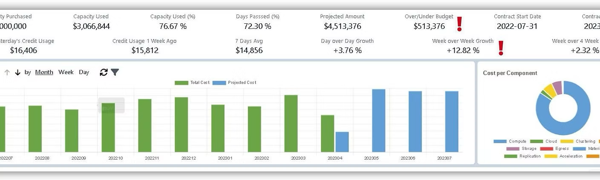

### Estabish Departmental Fiscal Responsibility

Many organizations have taken the right step by internally charging back Snowflake costs to various departments. However, because Snowflake billing is at the warehouse level, most organizations are forced to allocate different sizes of warehouses per department. This often leads to workloads being spread too thin, losing the benefits of economies of scale and resulting in higher overall costs for the same workload. MaxMyCloud's proprietary algorithm provides the lowest granular billing at the query level, enabling departmental billing without sacrificing the benefits of economies of scale.

### Anomaly Detection and Root Cause Analysis

​MaxMyCloud can detect pattern changes in Snowflake spending and identify the causes with just a few clicks, thanks to its highly interactive design. It quickly pinpoints which application or user has caused a sudden increase in spending, enabling you to take immediate action to stop monetary leakage.

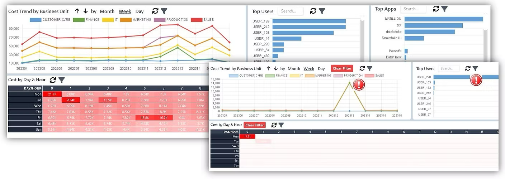

### Warehouse Utilization and Idle Cost Analysis

IDLE Cost occurs when a Snowflake warehouse is running without any active workload. Effective cost management should minimize idle costs without sacrificing performance. MaxMyCloud’s unique design allows our customers to pinpoint exactly where idle costs occur and effortlessly minimize them.

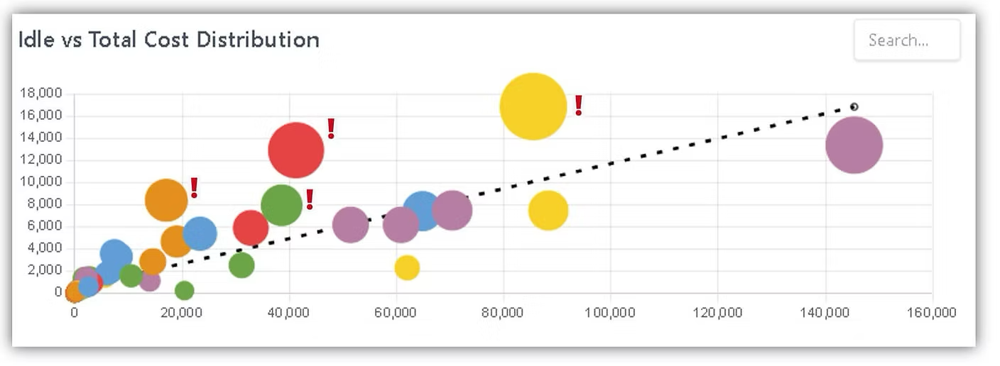

### Excessive Storage Cost

While storage costs are relatively inexpensive compared to compute costs, it's not uncommon for storage usage to exceed actual data size by 100X or even 1,000X. MaxMyCloud identifies these cost-saving opportunities and enforces Snowflake best practices in storage usage.

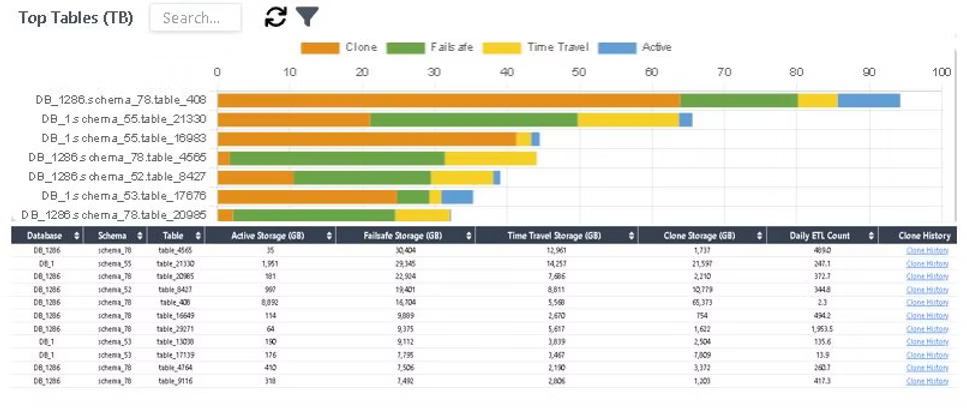

### Serverless Cost

In addition to compute and storage costs, MaxMyCloud also monitors serverless costs, including auto-clustering, materialized views, Snowpipe, and search optimization, among others.

### Data Processing/ETL Cost
In many organizations, data processing is the largest Snowflake cost driver. At MaxMyCloud, we closely monitor data processing costs using a two-pronged approach:
1. Identify top tables and focus on their most costly operations for performance tuning.
2. Rationalize data processing patterns by aligning data processing with data retrieval and seeking opportunities to reduce data processing frequency.

### Unused Resources

In today’s world, data democratization allows everyone in an organization to work with data and create their own tables and processes. However, some of these tables may become obsolete over time, while their associated data processes continue running and consuming credits. MaxMyCloud automatically identifies these opportunities for cost savings.

### Optimization Recommendation

MaxMyCloud recommends actionable steps from various areas to optimize your cost.

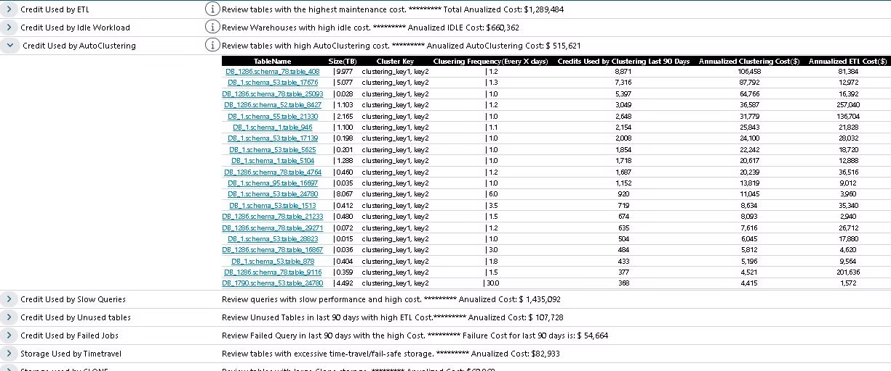


## Get the Native App
Duration: 3
### Install Native App

MaxMyCloud Native App is a free application available in the [Snowflake Marketplace](https://app.snowflake.com/marketplace). To install it, search for MaxMyCloud and click the blue "Get" button to begin the installation process. 

Once the installation is complete, navigate to Data Products → Apps → Installed Apps, where you will find the MaxMyCloud app. Click on the MaxMyCloud icon → Snowflake_insight to launch the Native App.


During the setup, two Snowflake authorization dialogs will appear, requesting permissions for the Native App. Click "Grant Privileges" to proceed to begin the installation process.

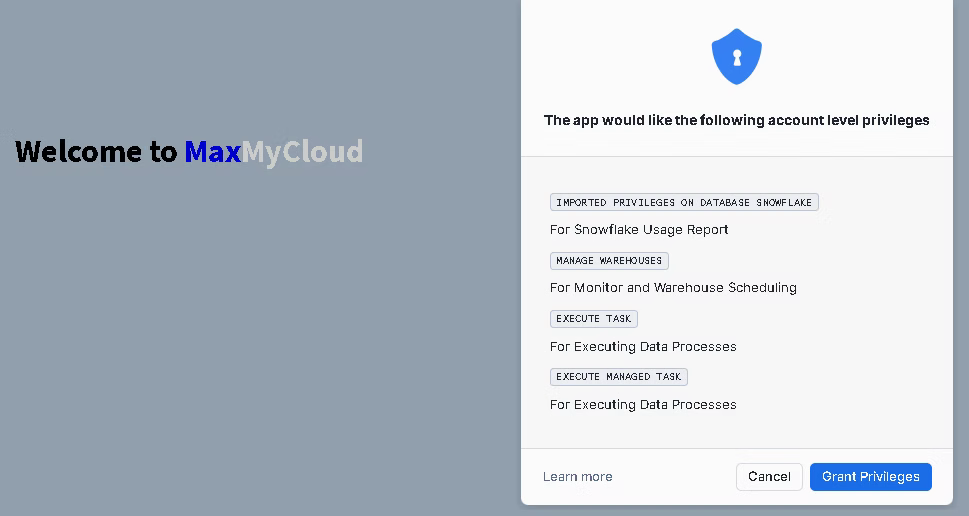

The Installation should take approximately 30 seconds, and a green checkmark will confirm a successful install.  Shortly after, the Data Refresh process will start in the backend.

If needed, you can click "Check Status" to monitor the process. The backend process runs independently of the Native App, so you can safely close the app and proceed to the next step.

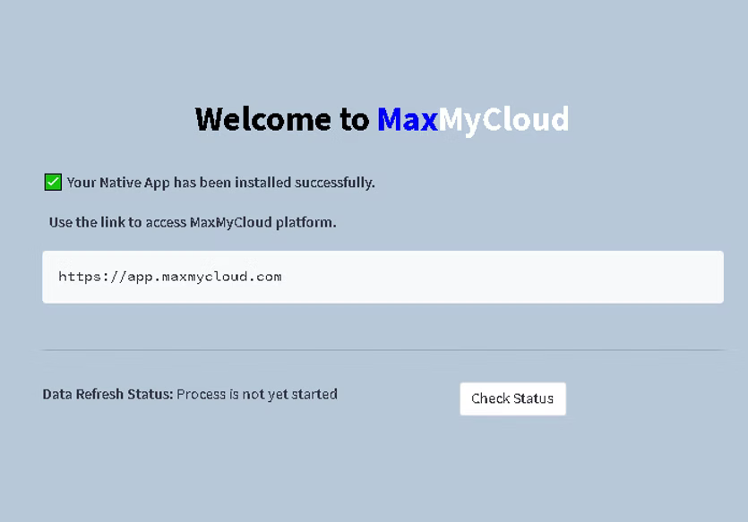


## Complete Setup
Duration: 10

### Create Snowflake User

Before running the MaxMyCloud web application, you need to set up a role and user in your Snowflake account. Copy the code snippet below and execute it in Snowflake.

### TERMINAL
```terminal 
create role maxmycloud_role;
GRANT APPLICATION ROLE app_maxmycloud TO ROLE maxmycloud_role;
GRANT USAGE ON WAREHOUSE your_warehouse TO ROLE maxmycloud_role;
GRANT USAGE ON INTEGRATION MAXMYCLOUD_API_INTEGRATION TO maxmycloud_role; 
```
Create MaxMyCloud User:

There are two options for creating a MaxMyCloud user:

a. Username and Password – Recommended for initial testing.

b. Key-Pair Authentication – Strongly recommended for production.

Follow the steps below:

### 1. Generate a Key (For Key-Pair Authentication)

This step should be performed on a device within your organization.

a. Generate private key in command line:

### TERMINAL
```terminal 
  openssl genrsa 2048 | openssl pkcs8 -topk8 -inform PEM -out rsa_key.p8 -nocrypt
```

b.Generate public key in command line:

### TERMINAL 
```
  openssl rsa -in rsa_key.p8 -pubout -out rsa_key.pub
```

### 2. Create User

### TERMINAL
```terminal 
CREATE OR REPLACE USER maxmycloud
PASSWORD = ''  -- Ensure no password is allowed
LOGIN_NAME = 'maxmycloud'
DISPLAY_NAME = 'maxmycloud'
DEFAULT_WAREHOUSE = 'your_warehouse'
DEFAULT_ROLE = 'maxmycloud_role'
DISABLED = FALSE;
GRANT ROLE maxmycloud_role TO USER maxmycloud;
```

### 3. Assign User the Public key in Snowflake. 

Replace with your Public key


### TERMINAL
```terminal 
ALTER USER maxmycloud  SET RSA_PUBLIC_KEY='MIIBIjANBgkqh...';

```

This concludes the step inside Snowflake.  Save your key files and move on to the next step

### Configure Connection

### Sign Up

To sign up, visit https://app.maxmycloud.com/signup.  Follow the on-screen instructions. If you choose the email/password method, you may need to verify your email.

### Choose Subscription Plan

For first-time users, you will be directed to the Get Started page, where you can select a subscription plan and set up your Snowflake connection. If you're unsure which plan to choose, you can start with the free Limited plan and [upgrade](https://app.maxmycloud.com/subscription) later if needed.

### Setup Snowflake Connection

After selecting your subscription plan, you will be redirected to Step 2: Connect to Snowflake. Fill in the required fields as follows:

  ・ Account Name: Choose a meaningful name, preferably the same as your Snowflake account name.

  ・ URL: This is the connection string used by MaxMyCloud to connect to your Snowflake account. You can derive it from your Snowflake URL by taking everything before .snowflakecomputing.com.

Example: If your Snowflake URL is https://<orgname>-<account_name>.snowflakecomputing.com, enter <orgname>-<account_name> here.

If you’re unsure of your Snowflake URL, refer to the section below: How to Get Your Snowflake URL.

  ・ Warehouse: Enter the warehouse name that MaxMyCloud is authorized to use (refer to the previous section on granting warehouse to MaxmyCloud roles).

  ・ Authentication Mode: We strongly recommend using the KeyPair method for enhanced security. Paste your private key in its entirety. Refer to the previous section for instructions on obtaining the security key.

  ・ Username: Enter the MaxMyCloud username you created in the previous section.

  ・ User Role: Enter the MaxMyCloud role name you created in the previous section.

Once all fields are filled, click "Test Connection" to verify your setup.

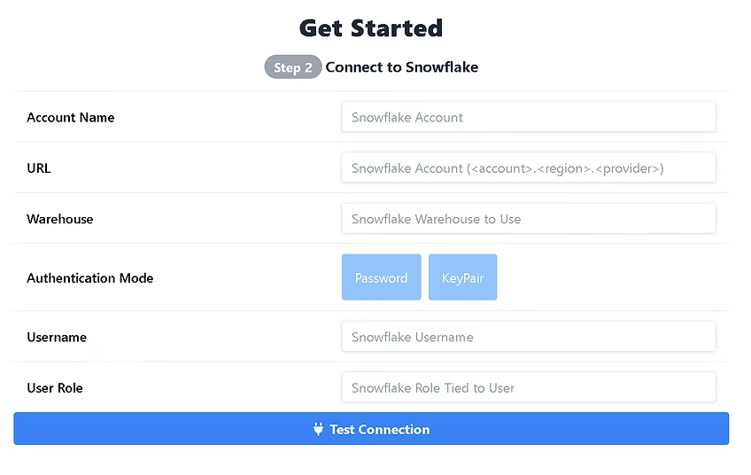
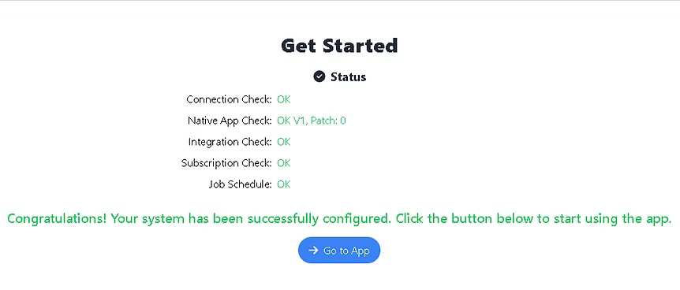

### Locate Snowflake URL

Log in to Snowsight. Navigate to your name at the bottom left, then click on Connect a tool to Snowflake. On the right side, locate the Account/Server URL and copy it.


## Query Monitor
Duration: 3

Query Monitor enables Snowflake administrators to monitor query activity, receive email alerts, and take proactive actions when predefined rules are violated, such as long-running queries or warehouse overload.

### Create Query Monitor

1. Navigate to Compute -> Query Monitor, then click on Create New.
2. On the Create New Monitor screen, fill in the form:

  ・ Name: Enter a unique name for the monitor.

  ・ Condition: Define the conditions you want MaxMyCloud to monitor and trigger email alerts.

  ・ Since MaxMyCloud utilizes the Snowflake Query History API, you can create conditions based on any API output fields.

  ・ Cancel: Option to automatically kill a query if the condition is met.

  ・ Emails: Enter the recipient email(s) for alerts, separated by ";" if multiple.

3. Click Save to return to the list of Query Monitors, where your new monitor should be listed.

### Additionally, MaxMyCloud provides built-in functions to refine conditions further:

CREDIT_USED()

  ・ Description: Checks if a query exceeds a given credit threshold.

  ・ Usage Example:
  credit_used() > 1
  (Triggers an alert for queries consuming more than 1 credit.)

RUN_HOUR(), RUN_MINUTE(), RUN_TIME()

  ・ Description: Returns the query execution time in hours (HH), minutes (MM), or HH:MM format.

  ・ Note: Time is based on your local Snowflake timezone.

Usage Example:
  ・ query_tag = 'FINISH BY 2am' AND run_hour() > 2

  (Notifies you if a query tagged to finish by 2 AM is still running past 2 AM.)

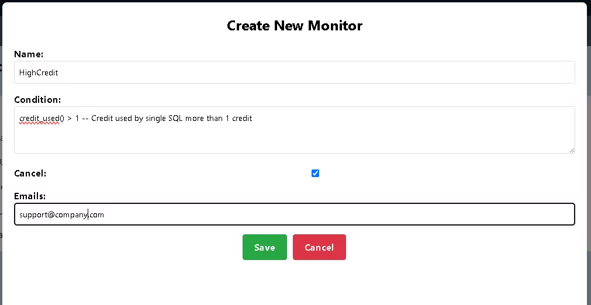

## Warehouse Scheduler
Duration: 5

Warehouse Scheduler allows you to modify Snowflake warehouse properties based on the time of day and day of the week (weekdays, Saturday, Sunday). This feature is especially useful for optimizing data processing by dynamically adjusting resources, such as warehouse size and multi-clustering, based on workload demands. 

### Create a New Schedule

1. Navigate to Warehouse Scheduler

  ・ Go to Warehouse → Schedule in your Snowflake interface.

  ・ You will see a list of warehouses available in your Snowflake account.

2. Enable Scheduling for a Warehouse

  ・ Locate the warehouse you want to schedule and click "Schedule" under the Action column.

  ・ If the warehouse is not yet scheduled, a message will appear. Click the blue "Enable Schedule" button to proceed.

3. Configure the Schedule

  ・ On the Warehouse Scheduler / [WarehouseName] screen, you will see three sections:

  Weekday Schedule,
  Saturday Schedule,
  Sunday Schedule,

  ・ Click the "+" button in the respective section to add a new time.

4. Set Warehouse Properties

  ・ In the "Add New Time" window, enter the desired warehouse properties.

  ・ Click "Add" to return to the schedule screen, where your newly added time will be listed.

5. Manage Schedule Entries

  ・ To remove a time period, click the "Delete" button next to it.

  ・ Once all changes are made, click "Save Changes" in the top-right corner to apply your updates.

6. Disable a Warehouse Schedule

  ・ If needed, you can disable a warehouse schedule by clicking the red "Disable Schedule" button in the top-right corner.


## Understanding the Overall Dashboard
Duration: 3
This overall dashboard shows us how we are tracking to our contract. To make things easier to understand, we are following an example account

### Cost Trend and Projection


In our contract, we have purchased 4 million dollars. So far we have have used 3 million which is 76% of the capacity we purhcased. 
Despite being 72% through the contract period, we are at 76% of the purchased capacity, indicating that we are ahead of schedule in terms of usage. If we continue at this rate, our projected total usage will reach $4.5 million, which exceeds the initial budget by over $500,000. This overage needs to be addressed promptly to stay within budget


The second section of the dashboard provides insights into the recent trends:
	•	Comparison: This section compares yesterday’s spend against the same day 7 days ago, as well as the 7-day average.
	•	Trend: The data is showing an upward trend, indicating that the spending is increasing. This trend requires immediate attention to prevent further escalation of costs.

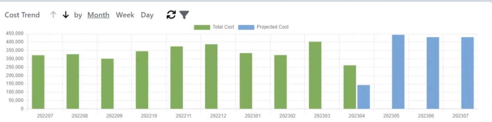

Below the recent trend analysis, the dashboard presents a more detailed breakdown of spending over time:
	•	Actual Cost (Green): This line shows the actual spending incurred in the past.
	•	Projected Cost (Blue): This line illustrates the projected cost, assuming the current spending rate continues.
This section helps to visualize how costs have evolved month by month and week by week, giving you the insight to predict future spending and take corrective actions if necessary.

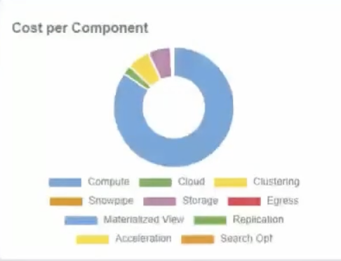

The dashboard also breaks down costs into specific components, allowing you to see where the largest portions of your budget are being spent:
In this example, the greatest contribution factors are Compute Costs, Storage Costs, and Auto Clustering Costs
Our products focus on these big cost componenents to see how we can improve on them

If you manage multiple accounts, the dashboard allows you to select the account you are interested in tracking:
	•	Account Selector (Left Sidebar): You can choose an account from the list on the left side of the screen. Once selected, all visuals and data on the dashboard will reflect the corresponding account’s information.

## Cost Allocation and Optimization
Duration: 4

This section outlines the process of efficiently managing and allocating costs across different departments, leveraging our Ava Watch algorithm to ensure fair chargebacks while minimizing unnecessary cost increases.

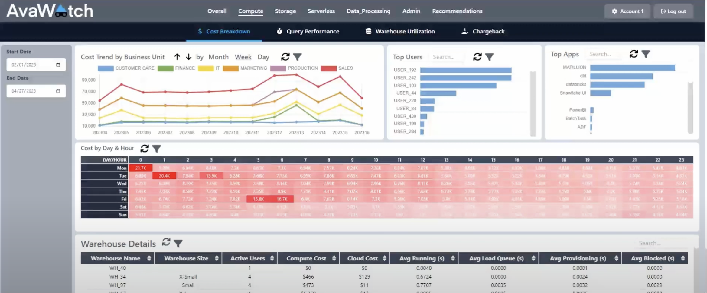

Many companies allocate costs based on specific warehouses dedicated to departments. While this helps with chargeback transparency, it can inadvertently cause significant cost increases even with the same workload and performance.
Our Ava Watch algorithm addresses this by allowing the sharing of workloads across departments while still allocating costs at the individual query level. This enables precise tracking of each department’s expenses 

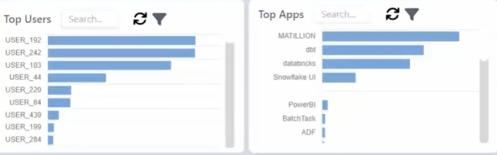

We do that by allocating the cost on the individual query level. We can tell you both user and application costs in the Snowflake enviornment

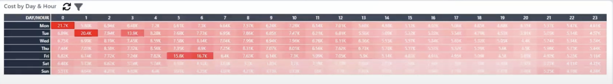

The dashboard provides a Matrix table displaying spending by day of the week and hour of the day. The darker the color, the higher the cost during that period.

Example: On Monday at midnight, we notice higher costs compared to other times.

Lets go ahead and click on the cell

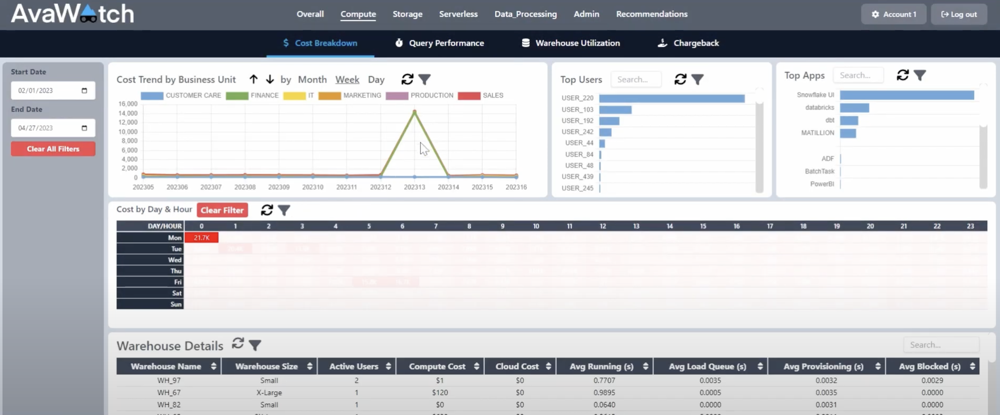

This reveals that user 220 was responsible for the spike, lets look a bit deeper into this user. Right click on USER_220, and go to query performance. We are greeted with the query performance page

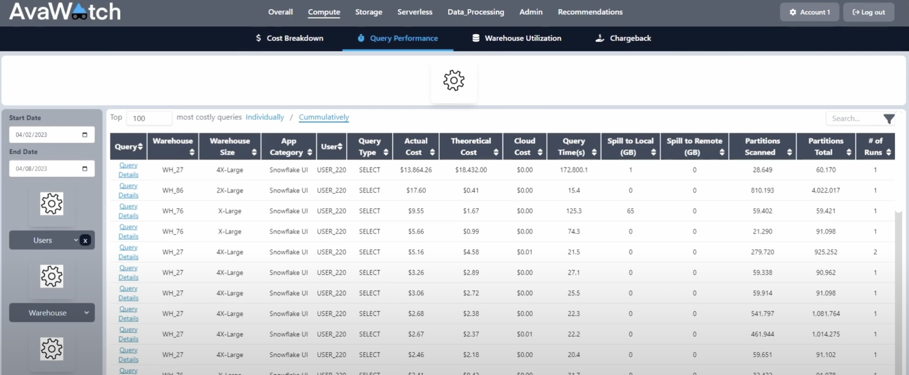

Now we can see the exact query that caused this sudden spike. 

If we remove the filters specifying that one user, we can also see every query performaned that has costed the most amount of money. 

While individual query costs are important, our focus should be on recurrent costly queries, often seen in ETL processes. The Ava Watch algorithm recognizes these similar queries (with slight variations in constant values) and flags them, helping to prioritize performance improvements and cost reductions.

## Warehouse Utilization and Idle Cost
Duration: 4

In this section, we will discuss warehouse utilization and idle costs in Snowflake. As Snowflake operates on a pay-as-you-go model, understanding idle costs is crucial for optimizing efficiency and minimizing unnecessary expenditures.

### Understanding Idle Costs

Why do we even consider idle costs when Snowflake uses a pay-as-you-go model? Here’s an example: imagine a query that runs for one minute. While the query completes in one minute, the warehouse will not shut down immediately after the query finishes. It will stay active until the next query is received. If no new query arrives, the warehouse will automatically shut down after a waiting period. This waiting period is what we define as idle cost.

It’s important to note that auto-scaling costs are not inherently problematic because we don’t want the warehouse to constantly shut down and start up. The key question is: how much do we pay for idle time? If idle time is 5% or less, it’s generally considered a cost of business. However, if idle time reaches 15% or more, it can represent a significant amount of money that could potentially be saved.

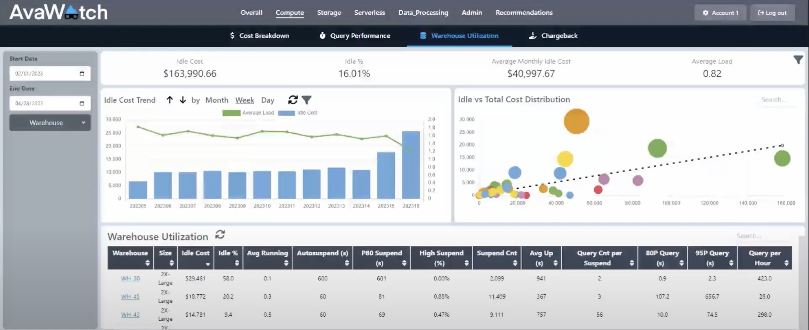

On the right side of the dashboard, we use a scatter plot to visualize the relationship between total cost and idle cost:

•	X-axis: Total cost for each warehouse.

•	Y-axis: Total idle cost for each warehouse.

•	The slope represents the average cost-to-idle cost percentage for the warehouses.

At the top of the plot, you can see the average idle cost percentage, which is currently 16%. Any warehouse above this line is considered interesting for further analysis. For example:

•	The orange circle in the scatter plot represents a warehouse with an idle cost percentage of 58%, which is notably high.

•	This warehouse accumulated almost $30,000 in idle costs during the period, which is a significant amount considering its 0.1-minute average running time. This suggests that most of the time, the warehouse is idle with very little workload.

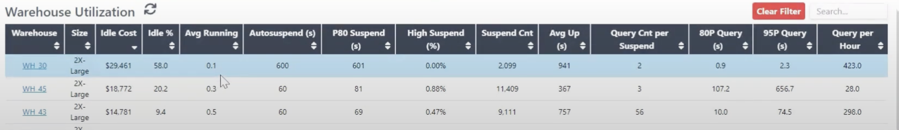

We also observe that the warehouse in question is set to auto-suspend after 600 seconds (10 minutes). This means the warehouse will remain active for up to 10 minutes without any queries running. This is an unusually long duration and could be contributing to high idle costs. We need to assess whether such a long auto-suspend time is necessary or if the warehouse can be optimized further.

Additionally, looking at the workload statistics for this warehouse:

•	80% of queries finish in 0.9 seconds (very quick).

•	95% of queries finish in 2.3 seconds.

This suggests that the warehouse may be oversized, in addition to the potentially inefficient auto-suspend configuration.

### High Suspend Time

One final insight to consider is high suspend time. If we configure a warehouse to shut down after 600 seconds of inactivity, we expect it to shut down close to that time. If the actual shutdown time is significantly higher, we need to investigate why this discrepancy exists.

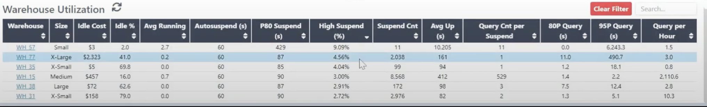

For example, sorting by the highest suspend time (by clicking on High Suspend), we notice a warehouse with almost 5% higher suspend time than expected. We can drill into the details of this warehouse (Clicking on WH-77), and here’s what we find:

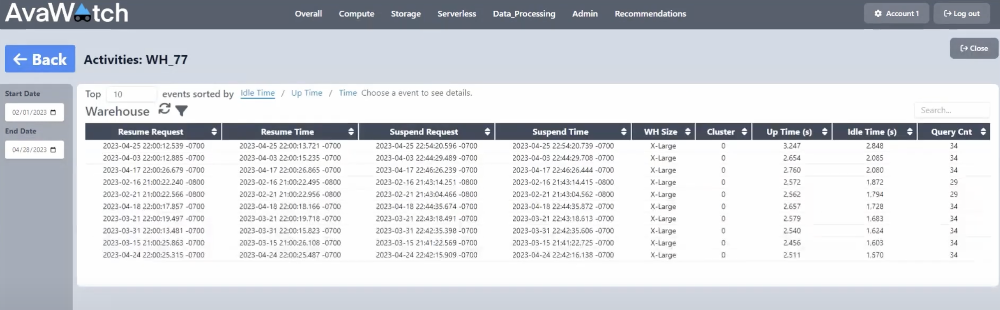

For the first request, we can see the idle time is more than 2000 seconds. Note that we defined this warehouse to be shutting down in 60 seconds. Lets try to find this discrepancy


•	The warehouse is scaled up to handle the workload with two clusters.
•	The main cluster finished its queries at 10:06, but the warehouse cannot shut down until both clusters finish their workloads. The second cluster finished at 10:53, meaning the warehouse stayed active for an additional 45 minutes while doing nothing.

This insight is crucial for workload planning. By understanding the impact of clustered workloads and optimizing for shutdown timings, we can potentially avoid unnecessary idle time, saving thousands or even tens of thousands of dollars.

By closely monitoring and analyzing warehouse utilization, idle costs, and suspend times, we can uncover significant opportunities for cost-saving. Optimizing auto-suspend times, adjusting warehouse sizes, and planning workloads efficiently can have a substantial impact on reducing idle costs and improving overall cost-efficiency in the Snowflake environment.

## Computing Cost Analysis and Table Maintenance
Duration: 4

This section discusses the analysis of computing costs, particularly in terms of maintaining tables within your environment. By examining data processing applications, which are typically the most computationally intensive, we can identify opportunities to optimize and reduce costs.

### Costly Table Maintenance

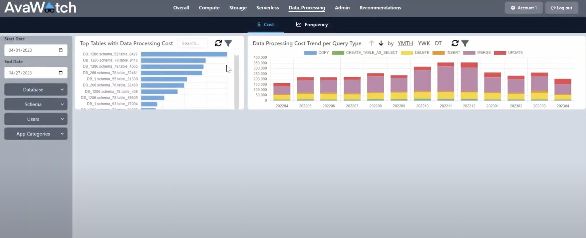

Data processing applications often incur the highest computing costs. To address this, we present a breakdown of table maintenance costs:

By clicking on the first table it shows three different operations for table maintenance

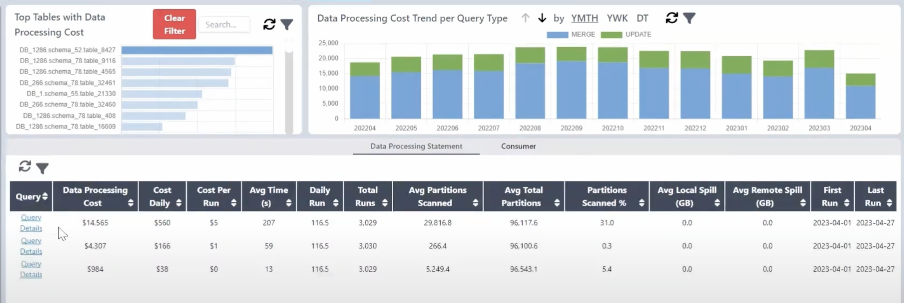

As we can see, the first table is most costly with $15,000. Lets take a look at the partition scanned percentage.

This metric indicates how much of the table needs to be scanned for each operation. For example, a 31% partition scan percentage means that one-third of the entire table is being scanned for each operation. This is an area for potential optimization to reduce costs and improve performance

In addition, if we spend this much money to maintain the table, how much has it actually been read by the consumer?

### Table Read vs. Table Maintenance

The second part of the analysis focuses on understanding how frequently a table is read by consumers in comparison to its maintenance cost:

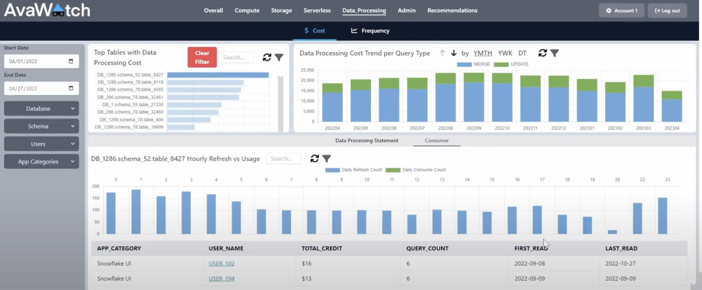

•	Consumer Tab: This tab shows hourly data about when the table is being maintained versus when it is being read.

•	User Analysis: Below the graph, you can see the users who are accessing the table and the applications they are using.

•	By clicking further, you can view the actual queries from users who are accessing the table, helping to correlate the maintenance cost with usage patterns.


The second tab, called Frequency, provides the same insights but in a tabular format:

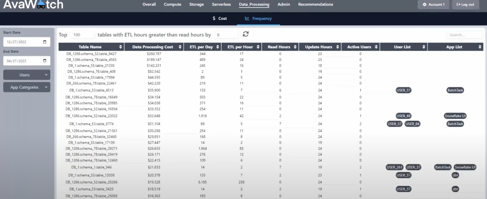

•	It shows the maintenance cost per table and details how frequently the table is maintained versus read.

•	For example, you may find that a table is maintained every hour but is only read six times in a day. This is useful for identifying inefficiencies in the ETL process.

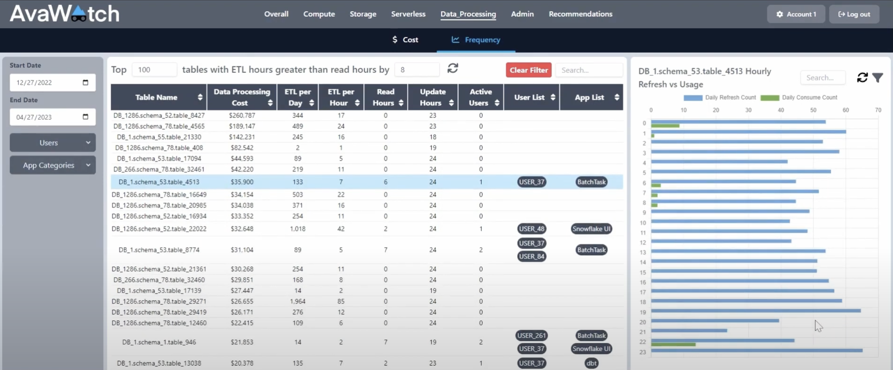

•	Hourly Detail: On the right side, you can see the exact hours when the table is being read, allowing for more granular analysis.

## Storage Cost Optimization
Duration: 4

This section focuses on optimizing storage costs, which may seem inexpensive compared to computational resources, but a closer look often reveals significant opportunities for cost reduction.

### Understanding Storage Usage

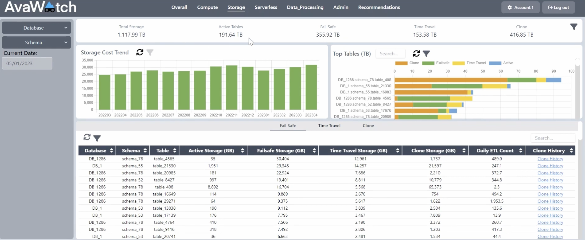

Although storage costs are generally lower than computational resources, inefficient storage management can still lead to high expenses. Consider this example:

•	Total Storage: 1.1 terabytes.

•	Actual Data: Less than 200 terabytes is used for actual data.

So, where is the rest of the storage going? Upon deeper inspection, we see:

•	355 terabytes are used for fail-safe.

•	153 terabytes are used for time travel.

Combined, these two features account for more than 600 terabytes of storage, which is a substantial portion. Additionally, a significant amount of storage is used for clone storage.

### Fail-Safe and Time Travel Storage

Let’s break down the storage usage further:

•	The table in the lower half of the image highlights the top tables in terms of fail-safe storage.

•	For example, one table has 35 GB of actual data.

•	Fail-safe for this table is 30 terabytes.

•	Time travel for the same table is 13 terabytes.

•	Combining these results in 42 terabytes, which is more than 1,000 times the size of the actual data.

Why is this the case? Let’s continue:

•	The daily ETL account for this table is almost 500, indicating that nearly 500 ETL operations are executed daily.

•	Each of these ETL operations is likely changing a large portion of the table, resulting in hundreds or even thousands of copies of the same table being created in a very short time.

In such scenarios, we recommend using alternative backup strategies instead of relying solely on time travel. By doing so, you can save a significant amount of storage, particularly for the top 10 tables.

### Clone Storage Analysis

Next, we examine clone storage:

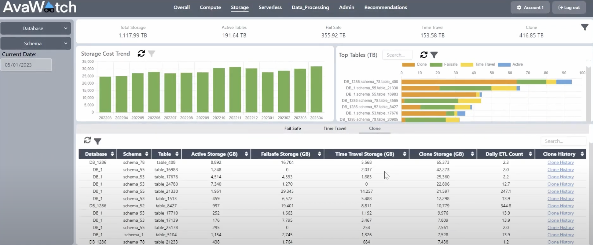

•	The Clone Tab provides a list of tables with the most clone storage.

•	For example, one table has 9 terabytes of actual data.

•	However, its clone storage is 65 terabytes.

What’s happening here? Lets look into the clone history by clicking on the Clone History link

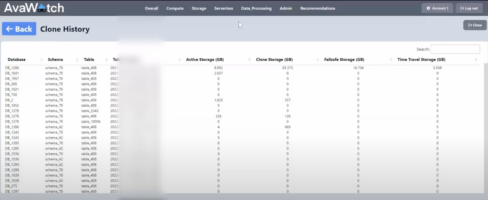

•	When a clone is created, initially it doesn’t occupy any storage space; it simply acts as a pointer to the original table.

•	Over time, as data is added to the original table or to the cloned copies, storage for the clone begins to accumulate.

•	If regular cleanup is not performed, the clone storage can grow significantly.

To address this, we recommend that clients regularly monitor clone storage and perform cleanups as needed to avoid unnecessary storage costs.

By monitoring and optimizing fail-safe, time travel, and clone storage, you can significantly reduce storage costs. In many cases, implementing alternative backup strategies and performing regular clone cleanups will result in substantial savings.

## Serverless Cost: Auto Clustering
Duration: 4

This section focuses on auto clustering costs, part of the broader serverless cost breakdown. Other components, like material views, slow pipes, and search optimization, follow a similar structure, but here we’ll focus on auto clustering.

### Trending Chart

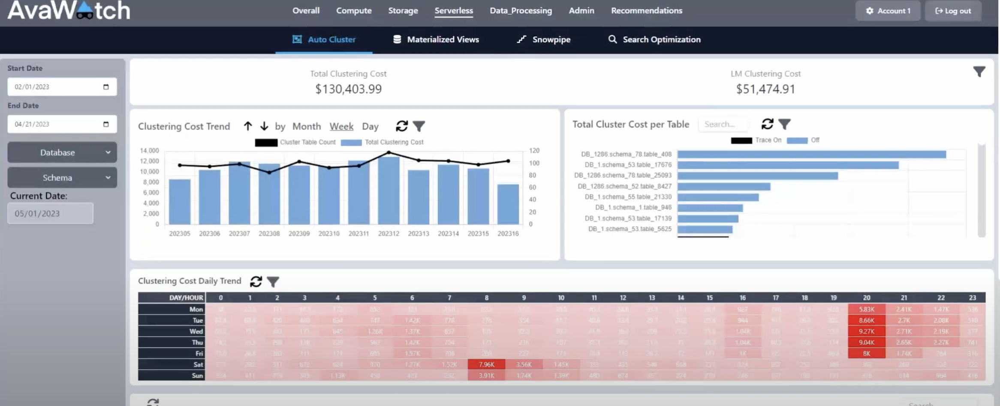

The page starts with a trending chart, which displays the costs over time:

•	Monthly and Weekly Trends: This helps visualize the cost pattern, showing fluctuations and trends in auto clustering costs over time.

On the right side of the page, you can identify the top tables with the highest auto clustering costs. This section helps highlight where the largest expenses are occurring.

Below the top tables, a Matrix chart displays costs broken down by:
•	Day of the Week
•	Hour of the Day

The darker the color, the more cost is incurred during that specific time period, allowing for more granular insight into cost patterns.

Whats more interesting is the table below, lets scroll down a bit

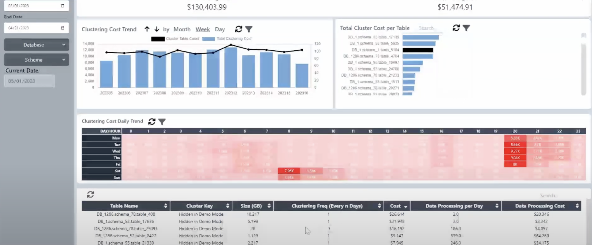

Now we can compare the auto clustering cost with the data processing (ETL) cost. 
For example:

•	Auto Clustering Cost: $26,000

•	Data Processing Cost (ETL): $20,000

Here, the auto clustering costs exceed the ETL costs, which could indicate inefficiencies such as:

•	Suboptimal Clustering Keys

•	Suboptimal ETL Processes

This is a potential area of concern and requires deeper investigation to optimize and reduce costs.

The auto clustering section provides insights into costs and identifies areas that may need further analysis or optimization. By understanding the breakdown of auto clustering costs and comparing them to ETL and other operational costs, you can target inefficiencies and drive cost-saving measures.

## Unused Tables and Failed Queries 
Duration: 4

This section covers two important areas that contribute to system inefficiencies and potential cost savings: unused tables and failed queries.

### Failed Queries

A failed query is one that encounters an error during execution. While these queries do not produce the expected results, they can still incur significant costs. Here’s a breakdown:

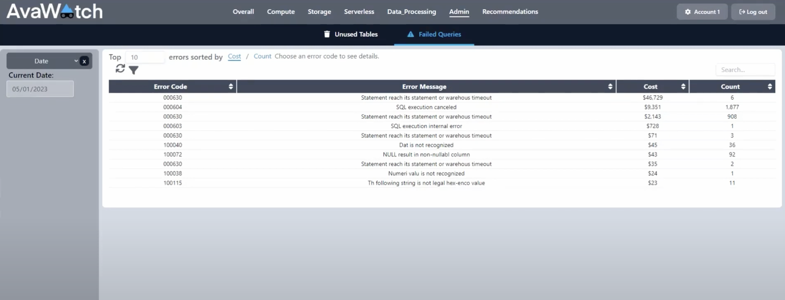

•	Example 1:

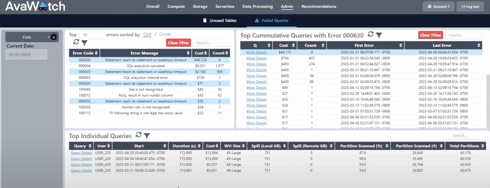

•	A query failed in the system, and it was executed four times, with a total cost of $46,000.

•	The query is running on a 4X large warehouse and is taking a long time to execute.

•	This is a significant cost, and further investigation is needed. A conversation with the user may help identify opportunities to improve the performance and reduce the failure rate.

•	Example 2:


•	A query failed 422 times, but the individual failure cost is lower than the first example.

•	This failure seems to be occurring periodically due to a scheduled job failure, and there was no action taken to resolve it.

•	This kind of recurring failure can be costly, and addressing it proactively could save significant money in the long run.

These insights help to identify recurring failures and enable you to take proactive measures to reduce costs.

### Unused Tables

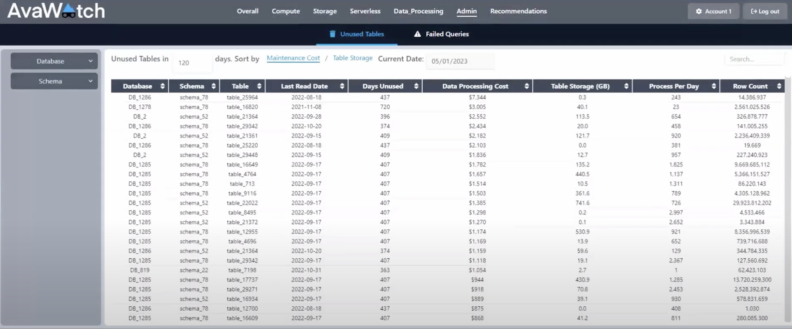

Unused tables are tables that are not accessed for long periods but still incur processing costs due to ongoing ETL processes. Here’s how we approach this:

•	Top Data Processing Costs:

•	The page displays tables with the highest data processing costs, many of which haven’t been used in the past 120 days. Despite this, their associated ETL processes continue to run, generating unnecessary costs.

•	It’s important to investigate these tables to determine if they can be turned off or removed from the ETL pipeline to stop incurring costs.

Unused Tables in Data Storage:

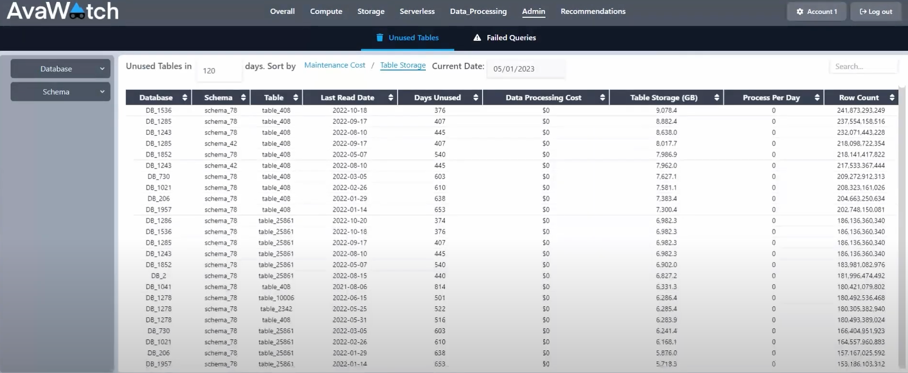

•	Similar to unused tables in ETL, there are tables that have high storage costs but haven’t been used in the past 120 days. For instance lets look at the first entry:

•	A table that hasn’t been accessed in the last 120 days still holds almost 10 terabytes of data, continuing to consume storage costs even though it’s not in use.

•	In these cases, it’s worth evaluating whether the data can be cleaned up or archived to save on storage expenses.

By identifying and addressing failed queries and unused tables, you can significantly reduce costs associated with unnecessary processing and storage. Proactively managing these inefficiencies ensures better resource utilization and can lead to substantial savings over time.


## Recommendation Page
Duration: 3

The Recommendations Page summarizes all identified cost-saving opportunities, providing actionable insights that can help optimize your system’s efficiency and reduce unnecessary expenses.

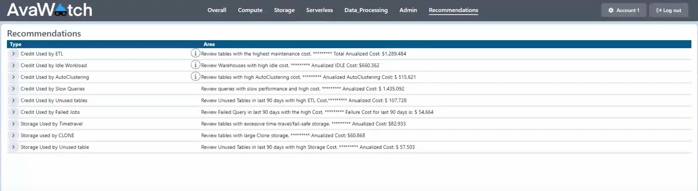

The Recommendations Page consolidates various cost-saving opportunities from different sections we’ve discussed. Each category has an annualized dollar amount, which represents the potential cost savings if the recommendations are fully implemented.
•	Note: The actual savings will depend on how effectively you implement the improvement steps provided.

### Category Overview

You can open each category to explore further details:

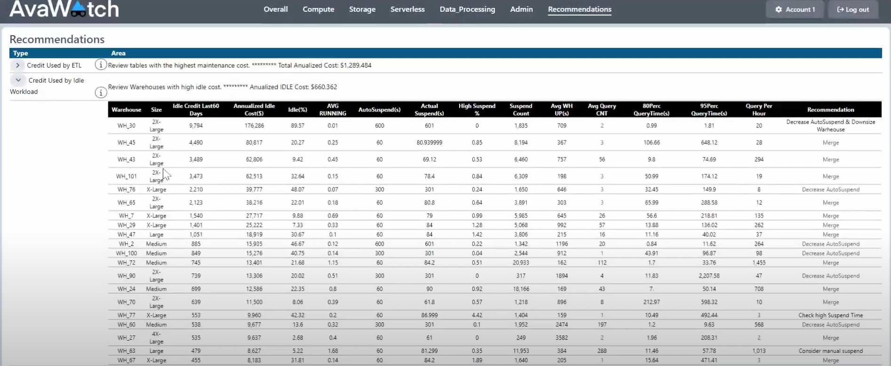

•	For example, in the Idle Workload category, a table is displayed showing the top warehouses with the highest idle costs.

•	The last column in this table provides a recommendation for each warehouse.

•	What makes this table useful is that it not only provides recommendations but also includes the facts and statistics in the preceding columns, giving you deeper insights into why the recommendation was made.

•	This approach ensures you have all the necessary data to make informed decisions about cost-saving actions.

### Actionable Insights

While most categories come with actionable recommendations, some categories may not provide specific suggestions. For example:

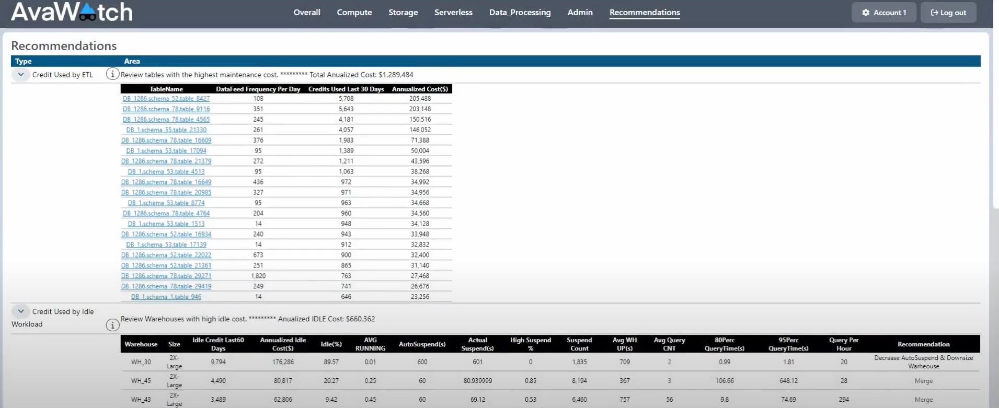

•	Credit Used by ETL: This category does not have specific recommendations but provides a narrowed list of the top 20 tables to focus on.

•	These 20 tables, out of thousands or even tens of thousands in your system, together account for more than $1 million in annual costs. This is a key area where we should focus our efforts to drive improvements and reduce costs.

The Recommendation Page is designed to provide a comprehensive overview of cost-saving opportunities across different areas of your system. By following the provided insights and focusing on the most impactful areas, you can implement effective cost-saving measures and optimize your system’s performance.
