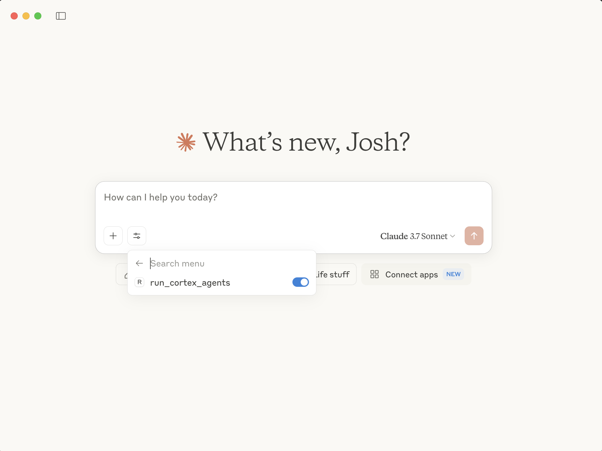

id: mcp-server-for-cortex-agents
categories: snowflake-site:taxonomy/solution-center/certification/quickstart, snowflake-site:taxonomy/solution-center/certification/certified-solution, snowflake-site:taxonomy/product/platform
language: en
summary: This guide outlines the process for building an MCP Server for Cortex Agents.
environments: web
status: Archived
feedback link: <https://github.com/Snowflake-Labs/sfguides/issues>
authors: Josh Reini

# Build an MCP Server for Cortex Agents
<!-- ------------------------ -->

## Overview


This guide walks through how to build your own Cortex Agents MCP Server.

The core functionalities include:

- Allow agents to interact with Cortex Agents as a tool
- Test the connection with Claude Desktop

In this tutorial, we’ll build a simple MCP **Cortex Agents** server and connect it to an MCP host (Claude for Desktop). We’ll start with a basic setup, then progress to more complex use cases.

### What we’ll be building

Many LLMs don’t natively orchestrate external “agent” workflows. With MCP, we can expose Cortex Agents capabilities as first-class tools in your chat client.

We’ll build a server that exposes one tool:

- `run_cortex_agents`: submit a query to Cortex Agents and get its output  

Then we’ll connect the server to an MCP host (Claude for Desktop):

> **Note:** you can connect any MCP-compatible client, but this guide uses Claude for Desktop for simplicity. See the official MCP [client SDK guide](https://modelcontextprotocol.io/quickstart/client) for building your own, or browse [other clients](https://modelcontextprotocol.io/clients).

### Prerequisites

* A Snowflake account ([sign up for a trial account here](https://signup.snowflake.com/?utm_source=snowflake-devrel&utm_medium=developer-guides&utm_cta=developer-guides))
* Cortex Analyst semantic model and Cortex Search service created, such as via this [quickstart](/en/developers/guides/getting-started-with-cortex-agents/)
* A [Programmatic Access Token](https://docs.snowflake.com/en/user-guide/programmatic-access-tokens) created
* Python **3.10+**  
* Python MCP SDK **1.2.0+**  

### What You Will Learn

* How to create an MCP Server
* How to use Cortex Agents
* How to configure an MCP client to use an MCP Server

### What You Will Build

An MCP Server for Cortex Agents.

## Setup
<!-- ------------------------ -->


First install the MCP CLI (`uv`) and bootstrap your project:

### macOS / Linux

```bash
curl -LsSf https://astral.sh/uv/install.sh | sh
# restart your terminal to pick up `uv`
```

### Windows

```bash
irm https://astral.sh/uv/install.ps1 | iex
# restart your shell
```

Configure and create your Cortex Agents project:

```bash
# Clone the repo
git clone https://github.com/Snowflake-Labs/sfguide-mcp-cortex-agent.git
cd sfguide-mcp-cortex-agent

# Create and activate venv
uv venv
source .venv/bin/activate   # macOS/Linux
# .venv\Scripts\Activate.ps1 # Windows PowerShell

# Install MCP SDK and HTTP client
uv add "mcp[cli]" httpx
```

Set the keys and services needed to run Cortex Agents by creating a `.env` following the `.env.template` with:

* SNOWFLAKE_ACCOUNT_URL
* SNOWFLAKE_PAT
* SEMANTIC_MODEL_FILE
* CORTEX_SEARCH_SERVICE

## Run the MCP Server
<!-- ------------------------ -->


Run:

```bash
uv run cortex_agents.py
```

> **Note:** Leave this (the MCP server) running while you call it from the MCP client.

## Add to the MCP Client
<!-- ------------------------ -->


Install or update Claude for Desktop.

Open your config file:

### macOS / Linux

```
~/Library/Application Support/Claude/claude_desktop_config.json
```

### Windows

```
%APPDATA%\Claude\claude_desktop_config.json
```

Add your Cortex Agents server:

```json
{
  "mcpServers": {
    "cortex-agent": {
      "command": "uv",
      "args": [
        "--directory",
        "/ABSOLUTE/PATH/TO/PARENT/FOLDER/sfguide-mcp-cortex-agent",
        "run",
        "cortex_agents.py"
      ]
    }
  }
}
```

> **Note:** You may need to replace "uv" with the full uv path. You can find the uv path by running `which uv`.

Launch the Claude for Desktop app.

Now our Cortex Agents MCP server is available for use by Claude. We can see it by clicking on the tools icon, and toggle it on and off.



Then, run a query. If the query calls your MCP server, you will see the name of the tool used directly below your query in the Claude desktop app.

Because we're connected to Cortex Agents, we can ask questions about both unstructured data (via Cortex Search) and structured data via Cortex Analyst.

Unstructured data:


Structured data:


What’s happening under the hood
When you ask a question:

1. The client sends your question to Claude
2. Claude analyzes the available tools and decides which one(s) to use
3. If the cortex agents tool is chosen, the client executes Cortex Agents through the MCP server
4. The results are sent back to Claude
5. Claude formulates a natural language response
6. The response is displayed to you!

### Common Errors

When the MCP client calls the MCP server, you may run into some of these common issues.

```bash
Error: Caused by SSLError(SSLCertVerificationError(1, “[SSL: CERTIFICATE_VERIFY_FAILED] certificate verify failed: Hostname mismatch, certificate is not valid...
```

```bash
Error: snowflake.connector.errors.InterfaceError: 250003 (08001): 404 Not Found: post https://xxxxx.snowflakecomputing.com:443/session/v1/login-request?request_id=b4e367d4-d8ac-48d3-8e44-96f42defa9c5&request_guid=4f63e07c-e42c-43b8-8f79-f6c577ee0d0e
```

> 
> NOTE: If you get the above errors, make sure the SNOWFLAKE_ACCOUNT_URL and PAT variables in the **_.env_** file are set correctly. Account URLs including an underscore (`_`) may cause this issue, which can be fixed by changing the underscore to a hyphen (`-`). For additional instructions and help, refer to the [documentation](https://docs.snowflake.com/en/user-guide/admin-account-identifier).

## (Optional) Customize Cortex Agents
<!-- ------------------------ -->


In `cortex_agents.py`, update the `payload` included in the function `run_cortex_agents` to include more tools or different configurations (such as LLMs).


## Conclusion And Resources
<!-- ------------------------ -->


Congratulations! You've sucessfully built an MCP server for Cortex Agents. I hope you are inspired to use this MCP server you've built in interesting MCP clients!

### What You Learned

* How to build an MCP server
* How to use Cortex Agents REST API and integrate it with an MCP server
* How to set up an MCP client to call your Cortex Agents MCP server

### Related Resources

  * [GitHub repo](https://github.com/Snowflake-Labs/sfguide-mcp-cortex-agents)
  * [Cortex Agents](https://docs.snowflake.com/en/user-guide/snowflake-cortex/cortex-agents)
  * [Cortex Analyst](https://docs.snowflake.com/en/user-guide/snowflake-cortex/cortex-analyst)
  * [Cortex Search](https://docs.snowflake.com/en/user-guide/snowflake-cortex/cortex-search/cortex-search-overview)
  * [MCP Server Quickstart](https://modelcontextprotocol.io/quickstart/server)
  * [Watch the Demo](https://youtu.be/GO_P4Iov5Gg?list=TLGGfBnhaVxeX7AyNDA5MjAyNQ)
