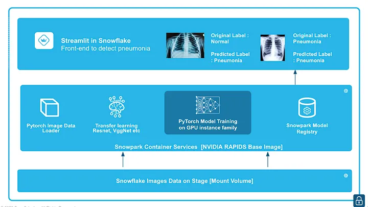
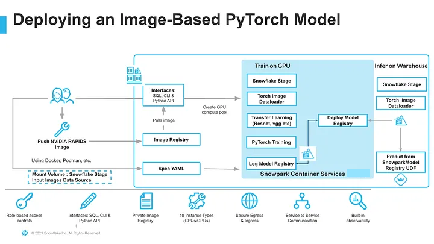
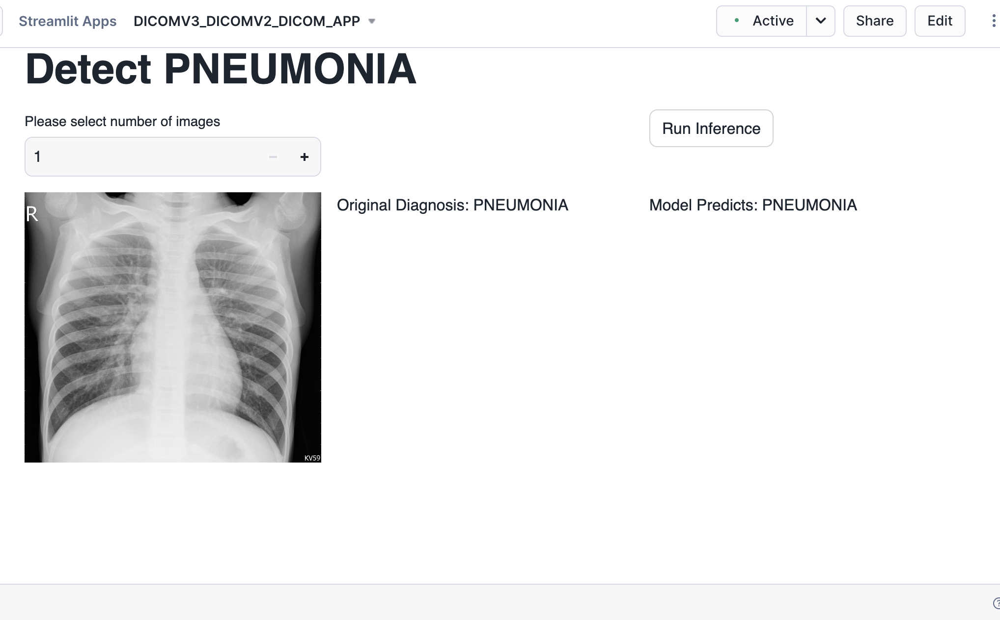

author: Kala Govindarajan
id: medical-images-classification-using-pytorch
categories: snowflake-site:taxonomy/solution-center/certification/quickstart, snowflake-site:taxonomy/solution-center/certification/certified-solution, snowflake-site:taxonomy/solution-center/includes/architecture, snowflake-site:taxonomy/industry/healthcare-and-life-sciences, snowflake-site:taxonomy/product/ai, snowflake-site:taxonomy/snowflake-feature/model-development
language: en
summary: Detect pneumonia in chest x-rays and show how to train a PyTorch image classification model on GPUs through transfer learning from torchvision.Leverage Snowpark Container Service for training and log and manage the trained model in Snowpark Model Registry and deploy either in Snowflake Warehouse(CPUs) or Snowflake Compute pools(CPU or GPU) for inference. Finally, perform inference within Snowflake using a data app built using Streamlit in Snowflake. 
environments: web
status: Published 
feedback link: https://github.com/Snowflake-Labs/sfguides/issues
fork repo link: https://github.com/Snowflake-Labs/sfguide-medical-images-classification-using-pytorch


# Medical Images Classification using PyTorch in Snowflake
<!-- ------------------------ -->

## Overview 


Healthcare delivery is rapidly evolving as health systems and clinics embrace digital technologies to better serve patients. This shift has led to the generation of vast amounts of patient data, much of which is unstructured, including medical images, videos, audio, and logs. Unlocking the potential of this unstructured data and running analytics on it is essential for building a comprehensive patient profile and improving health outcomes through data-driven insights. With advancements in AI and machine learning, it's crucial to develop and deploy these models using user-friendly methods on scalable, high-performance platforms to accelerate time to value.

In this quickstart, we will demonstrate how to classify whether a patient has pneumonia based on chest X-rays. We will train a PyTorch image classification model using transfer learning from torchvision models like ResNet and VGG on GPUs, leveraging the newly announced Snowpark Container Service in Snowflake. After training, we will log and manage the model in the Snowpark Model Registry and deploy it for inference using either Snowflake Warehouses (CPUs) or Snowflake Compute Pools (CPUs or GPUs). Finally, we will run inference within Snowflake using a front-end app built with "Streamlit in Snowflake.




### Prerequisites
- A non-trial Snowflake account in a [supported region](https://docs.snowflake.com/en/developer-guide/snowpark-container-services/overview?_fsi=TNKw8Mx5&_fsi=TNKw8Mx5#available-regions) with access to a role that has the ACCOUNTADMIN role. This is needed to create an external access integration. If not, you will need to work with your admin to perform the initial environment setup.
- Docker Desktop installed and running.
- Git installed.
- Robust knowledge of building a containerised application
- Intermediate knowledge of Deep learning Models


### What You'll learn
- How to build an image classification solution
- How to build and train a PyTorch model inside a Snowpark Container Services
- How to log a model to a Snowflake Registry
- How to create a Streamlit application to run inference using uploaded images from stage

### What You'll Build
A Streamlit app to run inference using a PyTorch image classification model trained inside Snowpark Container Services. 


## Setup Environment
<!-- ------------------------ -->
This section will walk you through creating various objects


**Step 1**. - Clone [GitHub](https://github.com/Snowflake-Labs/sfguide-medical-images-classification-using-pytorch/tree/main/scripts/) repository.

**Step 2**. - The following steps can be done in a Snowsight or from Notebooks as well.

In Snowsight, create a SQL Worksheet using [setup script](https://github.com/Snowflake-Labs/sfguide-medical-images-classification-using-pytorch/blob/main/scripts/setup.sql) and run the commands to create various objects such as database, schema, warehouse, stages, compute pool, image repository, etc.

**Step 3**. - For uploading the data to Snowflake stage data_stage use the put command via snowsql to fetch them from the [data folder](https://github.com/Snowflake-Labs/sfguide-medical-images-classification-using-pytorch/tree/main/scripts/data/chest_xray) after downloading them locally. For the purpose of this guide, we have a small number of samples, but ideally in a production environment you would have more images to train the model for better accuracy.

**Step 4**. - Build and push a docker image and the commands for that can be found here

**Step 5**. - For specific instructions to create a [Streamlit app](https://docs.snowflake.com/en/developer-guide/streamlit/create-streamlit-ui) follow these steps  : 
Click the database on the left and goto the dicomapp_STAGE under Databases->DICOM_DB->Dicom_schema->dicomapp_STAGE. 

Fetch the file streamlit_app.py from the [app folder](https://github.com/Snowflake-Labs/sfguide-medical-images-classification-using-pytorch/tree/main/scripts/app) and upload it to the stage called dicomapp_STAGE along with the environment.yml file  


<!-- ------------------------ -->
## Build and containerize a Model Training Service



### Step 3.1 Build, Tag and Push Docker Image

Building a Docker Image for Model Training requires several steps and this section focuses on building the docker image and uploading it to the image repository dicom_REPO in your account. This may take some time (> 10-15 minutes) depending on the upload speed from your workstation.

For complete step by step instructions you can always refer to the Snowpark Container Services tutorial [here](https://docs.snowflake.com/en/developer-guide/snowpark-container-services/overview-tutorials).

We need to connect our local Docker to the Image repository . Once the docker push command completes in the Step 4, verify that the image exists by running the following commands in a SQL worksheet. The completion time for the docker upload may vary depending on the internet connection speed.

The files needed to build the image are available [here](https://github.com/Snowflake-Labs/sfguide-medical-images-classification-using-pytorch/tree/main/scripts/docker). 


### Step 3.2 Upload Spec YAML

Services in SPCS are defined using YAML files. These YAML files configure all of the various parameters needed to run the containers within your Snowflake account. Learn more about configurable parameters in spec YAML files.
Create Container specification as a YAML Script on your local machine and save as pneumonia_detection_pytorch.yaml
Container Specification file above includes 5 important steps:

- Name of the container
- Image location, in this case we refer to the image located in the snowflake repository.
- Volume that needs to be mounted, here we will mount the snowflake internal stage that contains the input image folder which will be used to train, test, validate.
- Shared memory to shared RAM across all devices on the GPU in the docker.

Below is the service specification file. 

```
spec:
   containers:
   - name: "rapids1"
     image: "<IDENTIFIER>.registry.snowflakecomputing.com/dicom_DB/dicom_SCHEMA/pytorch_repo/rapidsai:23.06-cuda11.8-runtime-ubuntu22.04-py3.10"
     volumeMounts:
     - name: dshm
       mountPath: /dev/shm
     - name: stage
       mountPath: /workspace/stage
   endpoints:
   - name: "rapids2"
     port: 8888
     public: true
   volumes:
   - name: "dshm"
     source: "memory"
     size: "30Gi"
   - name: stage
     source: "@"
```

Upload the SPCS yaml file to the yaml repo, declare the service and invoke it to train/register the model:

```
put file <local_path>/service_definition.yaml @yaml_stage auto_compress=False overwrite=True
```

### Step 3.3 Model Training - Train a PyTorch Model to detect pneumonia in chest x-ray and log it in Snowflake Model registry

The model training code is present inside the Docker [folder](https://github.com/Snowflake-Labs/sfguide-medical-images-classification-using-pytorch/blob/main/scripts/docker/modeltrainreg.py) location. There is no action needed as the python routine is already built in a docker image and set to launch as a Snowpark container service in Snowflake in the next step.

### Step 3.4 Creating the Service in Snowflake
The services can now be created in Snowflake. Go back to Snowflake and open a worksheet. Enter the following to create the backend service. The execute JOB service command creates a new service. Training the model takes about 15-20 minutes. 

```
execute JOB service 
in compute pool DICOM_GPU3
EXTERNAL_ACCESS_INTEGRATIONS = (ALLOW_ALL_ACCESS_INTEGRATION)
NAME=DICOM_SERVICE_JOB
from @public.service_stage specification_file ='service_definition.yaml';
```

Call the following commands to analyze the status of the execution.

```
CALL SYSTEM$GET_SERVICE_STATUS('DICOM_SERVICE_JOB');

select * from TRAINING_LOG;

SELECT SYSTEM$GET_SERVICE_LOGS('DICOM_SERVICE_JOB', 0, 'pneumonia-rapid-service', 1000);
```

Verify the status of the execution by displaying the model using the below command:

```
SHOW MODELS LIKE 'DICOM_PYTORCH_MODEL_MULTIGPU' IN SCHEMA dicom_db.dicom_schema 
```


<!-- ------------------------ -->
## Run Inference Application using Streamlit in Snowflake


Now that the model training is completed and the model is logged in a model registry we use the Streamlit app setup before to carry ongoing inference. The app was already built in Step 2

A sample test dataset is provided and uploaded to the data stage already and we will use that for running inference using the trained model.

Choose a certain number of images, and these images are then converted to tensors and the logged model from Snowflake Model Registry is used for inference.




## Cleanup
To cleanup resources and remove all of the objects you created during this QuickStart, run the following commands in a SQL worksheet. This will ensure that you don't incur any unnecessary costs specifically associated with this QuickStart guide.

```
USE ROLE ROLE SYSADMIN;
DROP SERVICE DICOM_DB.DICOM_SCHEMA.DICOM_SERVICE_JOB;

USE ROLE ACCOUNTADMIN;
ALTER COMPUTE POOL DICOM_GPU3 STOP ALL;
ALTER COMPUTE POOL DICOM_GPU3 SUSPEND;
DROP COMPUTE POOL DICOM_GPU3;
DROP SCHEMA DICOM_SCHEMA;
DROP DATABASE DICOM_DB;
DROP WAREHOUSE dicom_WH_S;
```

## Conclusion and Resources
You did it! By following these steps, you have integrated the PyTorch model with Snowflake, conduct transfer learning, train the model, deploy it for inference, and use Streamlit to visualize the inference results.


### What You Learned
- Creating an Image Classification Application in Snowflake leveraging Snowpark Container Services, Snowpark Model Registry and Streamlit in Snowflake.
- Train a Binary Classification model to detect a medical condition and log it in Snowflake Model registry
- Create a Streamlit app to carry inference of unstructured data using a trained model


### Related Resources

- #### [Snowpark Container Services documentation](https://docs.snowflake.com/en/developer-guide/snowpark-container-services/overview)
  
- #### [Snowpark Container Services Tutorials](https://docs.snowflake.com/en/developer-guide/snowpark-container-services/overview-tutorials)

- [Fork Repo on GitHub](https://github.com/Snowflake-Labs/sfguide-medical-images-classification-using-pytorch/tree/main)
- [Download Reference Architecture](/content/dam/snowflake-site/developers/2024/10/Medical-Image-ProcessingandAnalytics.pdf)
- [Read the Blog](https://medium.com/snowflake/pytorch-model-to-detect-pneumonia-using-snowpark-container-service-and-snowflake-ml-features-e2f17a785f42)
- [Watch the Demo](https://youtu.be/5UdOUSVe814?list=TLGGnNy70R3PJLsyNDA5MjAyNQ)