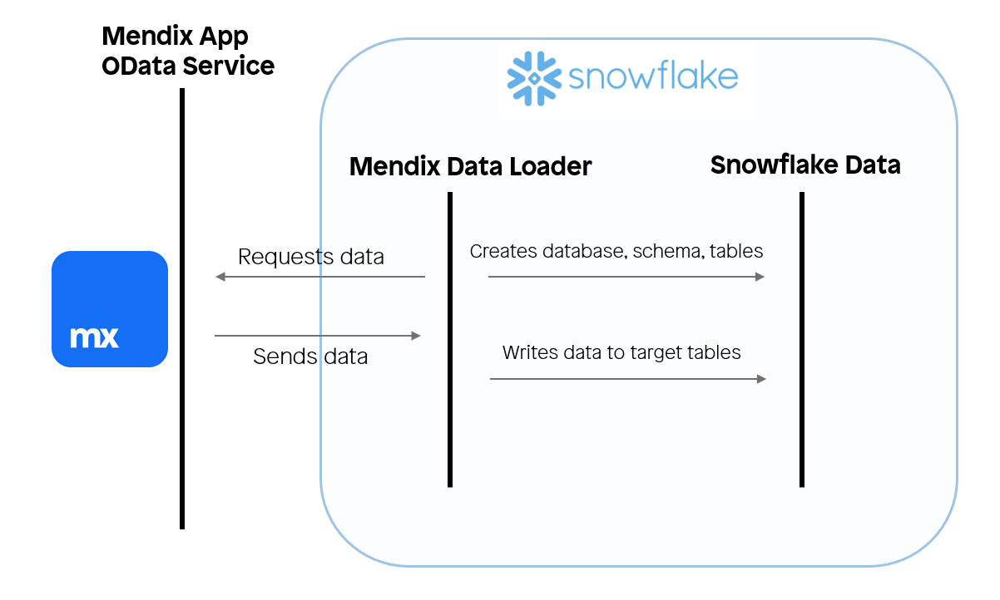
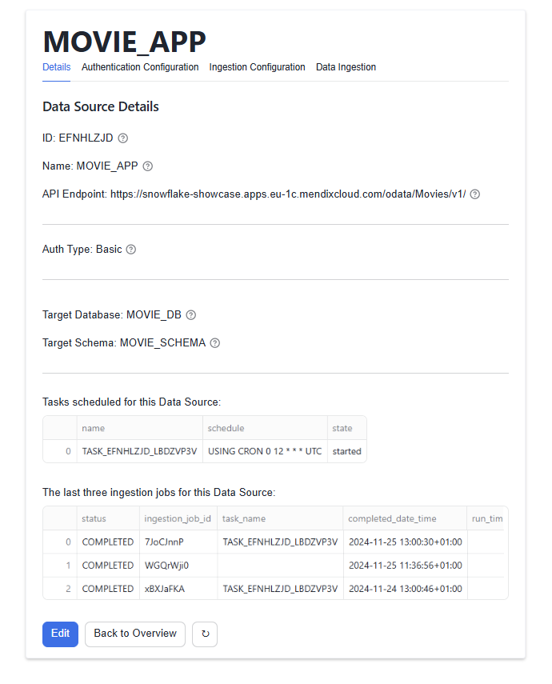
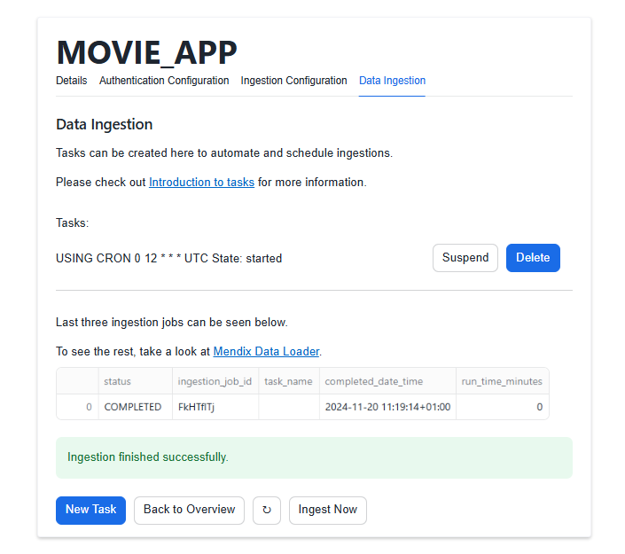

author: Trong Tran
id: mendix-data-loader
categories: snowflake-site:taxonomy/solution-center/certification/quickstart, snowflake-site:taxonomy/solution-center/certification/partner-solution, snowflake-site:taxonomy/solution-center/includes/architecture, snowflake-site:taxonomy/product/data-engineering, snowflake-site:taxonomy/snowflake-feature/ingestion, snowflake-site:taxonomy/snowflake-feature/connectors
language: en
summary: Guide on how to use the Mendix Data Loader to ingest data from Mendix applications via a published OData service. 
environments: web
status: Published

# An Introduction to the Mendix Data Loader
<!-- ------------------------ -->
## Overview

In this tutorial you will learn how to ingest data from a Mendix application. In the following steps you will learn how to configure the Mendix Data Loader component, a Snowflake application that is deployed in your Snowflake environment that ingests your Mendix data.

[Mendix](https://www.mendix.com) is a leading platform in the low-code application development domain. The data structure for the application is retrieved and the transient target tables for the data ingestion are created dynamically.

### What You’ll Learn

- Optional: How to deploy a Mendix application into a free cloud node 
- How to ingest operational Mendix application data into Snowflake

### What You’ll Build

- Optional: Deploying a Mendix application with a pre-created data set to extract
- Deploy the Mendix Data Loader to load the data into Snowflake

### Prerequisites

- Mendix account, if you don't have one sign up [here](https://signup.mendix.com/)
- Mendix Studio Pro ([10.12](https://marketplace.mendix.com/link/studiopro/10.12.0) or later)
- A Snowflake account with [Anaconda Packages enabled by ORGADMIN](https://docs.snowflake.com/en/developer-guide/udf/python/udf-python-packages.html#using-third-party-packages-from-anaconda). If you do not have a Snowflake account, you can register for a [free trial account](https://signup.snowflake.com/?utm_source=snowflake-devrel&utm_medium=developer-guides&utm_cta=developer-guides).
- A Snowflake account login with ACCOUNTADMIN role. If you have this role in your environment, you may choose to use it. If not, you will need to 1) Register for a free trial, 2) Use a different role that has the ability to create database, schema, tables, stages, tasks, user-defined functions, and stored procedures OR 3) Use an existing database and schema in which you are able to create the mentioned objects.

If you already have a Mendix application and just want to connect to that application you can skip to step 3.

> 
> IMPORTANT: Before proceeding, make sure you have a Snowflake account with Anaconda packages enabled by ORGADMIN as described [here](https://docs.snowflake.com/en/developer-guide/udf/python/udf-python-packages#getting-started).

<!-- ------------------------ -->

## (Optional) Setting Up Your Mendix Application

### Mendix

Mendix stands as a leading low-code platform for developing enterprise-grade applications, offering unmatched speed, flexibility, and scalability. Mendix's seamless integration with Snowflake’s enterprise data environment makes it an essential tool for building robust, data-driven applications. The platform’s intuitive visual development environment accelerates the creation of complex applications, significantly reducing development time while maintaining high standards of quality and performance.

Furthermore, Mendix offers extensive customization through its rich ecosystem of components, including marketplace offerings that facilitate direct integration with Snowflake. This allows Mendix applications to easily connect, query, and visualize Snowflake data, unlocking deeper insights and driving informed decision-making across the organization.

With Mendix, data engineers can focus on what truly matters—maximizing the power of their data within Snowflake—while relying on a platform that ensures enterprise-level security, compliance, and scalability.

### Deploy Your First Mendix Application

- Download the latest Snowflake Showcase App for Mendix Studio Pro version 10.12 from the [Mendix Marketplace](https://marketplace.mendix.com/link/component/225845)
- Once downloaded, execute the file titled `SFShowcase.mpk`, a window prompt should appear
- Create a new folder and select it to unpack the project files. After unpacking, the project should appear in Mendix Studio Pro version 10.12
- Inside Mendix Studio Pro, navigate to `Version Control`, then click `Upload to Version Control Server...` and confirm by clicking `OK`. A window titled Upload App to Team Server should appear
- After the project has been uploaded to version control server, click `Publish`
- After a while a snackbar notification is displayed `Your application is published`
- Click `View App` to see the login screen for your Mendix application
  - (Optional) To log into your Mendix application
    - Use the username `demo_user`
    - To retrieve the password for this user inside Mendix Studio Pro, navigate to `App 'SFShowcase'` -> `Security` -> `Demo users` -> `demo_user` and then click the link that reads `Copy password to clipboard`
- Save the endpoint of your Mendix application, you'll need it later
  - Save `https://sfshowcase101-sandbox.mxapps.io/` if your endpoint is `https://sfshowcase101-sandbox.mxapps.io/login.html?profile=Responsive` 
- You have successfully deployed the Snowflake Showcase App onto a free cloud sandbox environment!

### About this Mendix Application

The application you just downloaded, uploaded to Mendix' version control server and deployed on a free cloud sandbox environment is a free application available on the [Mendix Marketplace](https://marketplace.mendix.com/). Its purpose is to enable, aid and inspire its users on how to tackle integration with Snowflake from the Mendix domain. This application has some pre-installed operational data to showcase the Mendix Data Loader. The pre-installed data is about movies and reviews corresponding to the movies.

<!-- ------------------------ -->
## Install the Mendix Data Loader

- Download the Mendix Data Loader from the [Snowflake Marketplace](https://app.snowflake.com/marketplace/listing/GZTDZHHIE0/mendix-mendix-data-loader)
- Once a window displaying "successfully Installed" appears, click `Close`, navigate to `Data Products` -> `Apps` -> `Mendix Data Loader`, a documentation page titled `Mendix Data Loader` should appear
- You have successfully deployed the Mendix Data Loader into your Snowflake environment!

### How Will the Mendix Data Loader Interact With the Mendix application?

The Mendix application has a [published OData service](https://docs.mendix.com/refguide/published-odata-services/) that exposes the application data for the entities (class definitions) captioned `Movie` and `Review` which are linked to one another through an association. The OData resource for this application can be found along the following path: `Showcase_DataLoader` -> `Resources` -> `Published OData` -> `POS_Movies`. If you are planning to use your own custom application for this quickstart you will use the exposed OData service that you have set up yourself.

In the OData resource, the `General` tab contains information about the exposed service and the entities that are exposed in the service. Each entity has an endpoint from where the values can be retrieved after authentication. In the `Settings` tab, the metadata endpoint contains information about the exposed data structure of the OData resource. Additional endpoints are exposed for each exposed set configured in the `General` tab.

The Mendix Data Loader retrieves the exposed data structure from the metadata endpoint. After which the application will start to provision the application with transient target tables. Then the application retrieves the data from the service feed for each exposed entity found in the metadata. The Mendix Data Loader is developed for the extraction and loading of Mendix data, any data transformation and integration should be performed outside the scope of the Mendix Data Loader's objects.

All the exposed data will be ingested into Snowflake. To retrieve a subset of the exposed data you can use the filter query option, for more information refer to [OData's Basic Tutorial](https://www.odata.org/getting-started/basic-tutorial/).

Should any data reside in the specified database and schema from prior ingestion jobs, this data will be lost. For ingestions of multiple sources, we recommend using the same database with a different schema.

<!-- ------------------------ -->
## Mendix Data Loader Configuration

### Starting the Application

Upon starting the application, a documentation page that includes usage instructions is displayed. To start the application, click the `MENDIX_DATA_LOADER` hyperlink in the header.

### Creating Data sources

The home page, titled `Data Source Overview`, displays all your existing data sources. To create a new one, click the `Create` button to access the `Create New Data Source` page. Here, you will provide the following information:

- `Name`: A unique identifier for your data source.
- `API endpoint`: The URL of your published OData resource, `{{YOUR_SAVED_ENDPOINT}}/odata/{{ODATA_NAME}}/v1/` e.g., `https://sfshowcase101-sandbox.mxapps.io/odata/MoviesBasic/v1/`

When you press `Save` for the first time, a popup will appear requesting permissions to grant the application the following privileges:

1. `CREATE DATABASE`: To create the target database where ingested data will be stored.
2. `EXECUTE TASK`: To enable the scheduling of ingestion jobs.

In the modal window, click `Grant Privileges` to approve the request. Once privileges are granted, press `Save` again to save your data source. You will then be redirected to its details page.

### Configuring Authentication

To set up authentication, navigate to the `Authentication Configuration` tab and click the `Edit` button to open the `Edit Authentication Config` page. To start, there are two options, Basic credential authentication and OAuth. For this quickstart we will guide you through the basic credentials authentication configuration.

Choose the `Basic` option in the presented dropdown field and specify the following fields:

- `Username`: For example, SFDataLoaderUser (or any user with access to your OData resource).
- `Password`: For example, MendixSnowflake123 (or the corresponding password for the user).

### Configure the Staging Area

The final step before data ingestion is to configure the staging area. The staging area consists of a target database and target schema where data will temporarily reside before you transport/process it into a database owned by your organization.

- `Target database name`: For example, MOVIE_DB
- `Target schema name`: For example, MOVIE_APP

<!-- ------------------------ -->
## Mendix Data Loader Data Ingestion

### Start a Single Ingestion

Navigate to the `Data Ingestion` tab ands click the `Ingest Now` Button. When the ingestion has finished you are presented with success or error message.

### Creating a Task to Schedule Ingestion Jobs

Navigate to the `Data Ingestion` tab and click the `New Task` button to start configuring a task for scheduling ingestion jobs. The following fields are mandatory:

- `When should the ingestion task run?` : Choose one of the following options
  - `Custom CRON expression`, If you choose `Custom CRON expression` then the `Custom CRON expression` field is also mandatory.
  - `Every day at 00:00 AM UTC`
  - `Every Monday on 00:00 AM UTC`
  - `Every first day of the month at 00:00 AM UTC`

The other task configuration fields are optional:

- `Time out`: This is an optional setting that can be used to change after how much time (in ms) a timeout exception should happen.
- `Number of retry attempts` : This setting sets how many retries should be performed if an ingestion job fails.
- `Suspend task after number of failures` : This setting sets the number of times a task is allowed to consecutively fail before suspending the task.

Now press the `Schedule Ingestion Task` button. The first time you configure a task you will be prompted to grant the `USAGE` permission on a warehouse you want to use for all tasks created by the Mendix Data Loader. You can view details of the created task on the `Data Ingestion` tab where you can also view its performed ingestion jobs, suspend/enable the task, and drop the task.

<!-- ------------------------ -->
## Conclusion And Resources

Congratulations! You've successfully installed Mendix Data Loader app and moved data from Mendix application onto Snowflake.

### What You Learned

- How to quickly deploy a Snowflake showcase Mendix app on free cloud
- How to pull data from an existing Mendix application into Snowflake using our Mendix Data Loader Native Application

### Related Resources

- [Mendix Data Loader documentation](https://docs.mendix.com/appstore/modules/snowflake/mendix-data-loader/)
- [What is Mendix](https://www.mendix.com/)
- [Mendix Data Loader Listing](https://app.snowflake.com/marketplace/listing/GZTDZHHIE0/mendix-mendix-data-loader)
- [Download Reference Architecture](/content/dam/snowflake-site/developers/2025/build-ai-enabled-enterprise-applications)
- [Read the Blog](https://www.mendix.com/blog/double-the-power-of-your-data-with-mendix-and-snowflake/?_fsi=9zGgF6Cf)
- [Zoom builds enterprise AI appplications with Snowflake Cortex](/en/customers/all-customers/video/zoom/)
