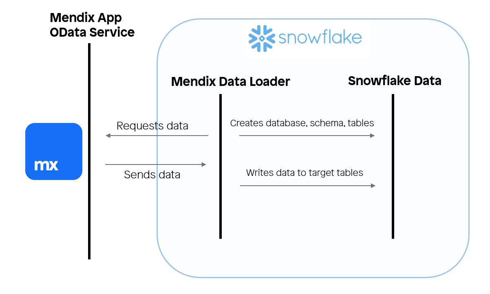
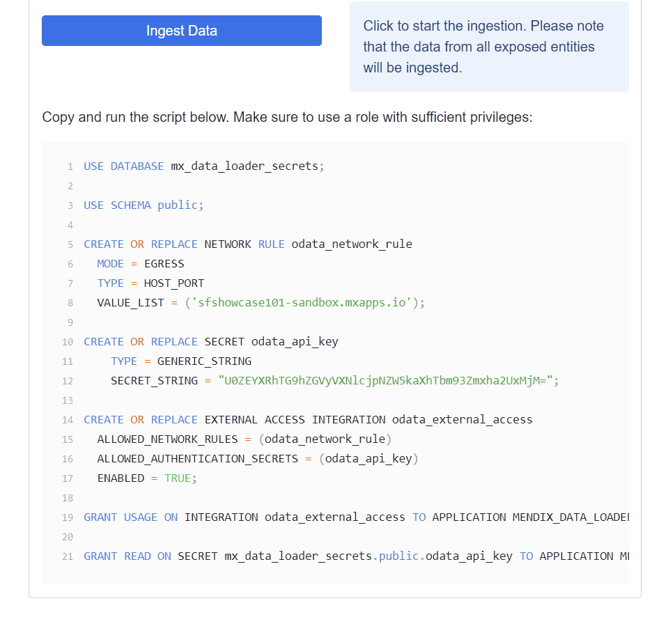
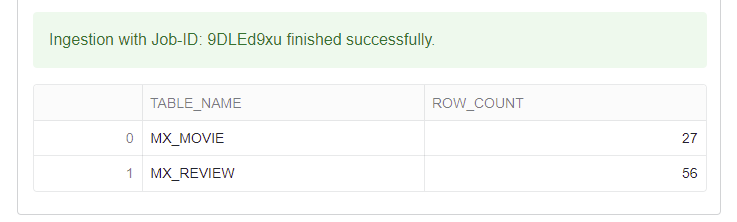
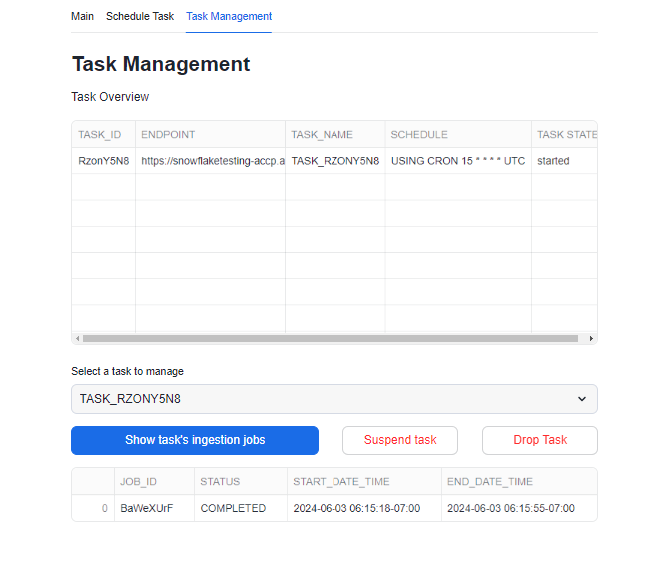
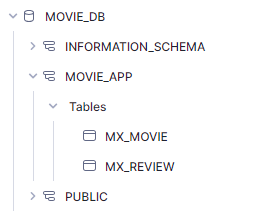
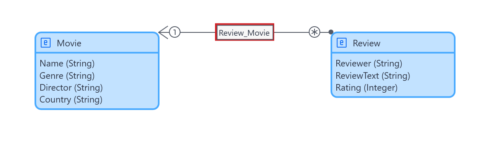
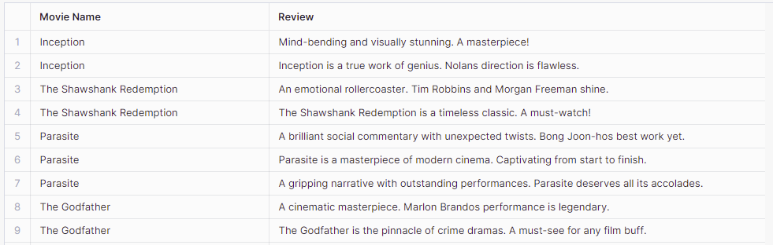

author: Trong Tran
id: mendix_data_loader
summary: Guide on how to use the Mendix Data Loader to ingest data from Mendix applications via a published OData service.
categories: connectors,partner-integrations
environments: web
tags: Connectors, Native Apps, External connectivity, Mendix

# Ingest data from Mendix applications

## Overview

Duration: 1

In this tutorial, you will learn how to ingest data from a Mendix application. You will discover how to configure the Mendix Data Loader component, a Snowflake application that is deployed in your Snowflake environment that ingests your Mendix data.

[Mendix](https://www.mendix.com) is the leading platform in the low-code application development domain. The data structure for the application is retrieved and the transient target tables for the data ingestion are created dynamically.



### Prerequisites

- Mendix account; if you do not have one, sign up [here](https://signup.mendix.com/)
- Mendix Studio Pro [10.10](https://marketplace.mendix.com/link/studiopro/10.10.0) or later
- Snowflake user with the `ACCOUNTADMIN` role to install the Mendix Data Loader

### You will learn

* How to install the Mendix Data Loader
* How to ingest operational Mendix application data into Snowflake
* How to schedule ingestion jobs using tasks
* How to join associated tables

## Setting up your Mendix application

Duration: 15

### Deploying your first Mendix application

1. Download the Snowflake Showcase App from the [Mendix Marketplace](https://marketplace.mendix.com/link/component/225845).
2. Once downloaded, execute the file titled **SFShowcase.mpk**; a window prompt should appear.
3. Create a new folder and select it to unpack the project files. After unpacking, the project should appear in Mendix Studio Pro.
4. Inside Mendix Studio Pro, navigate to **Version Control**, then click **Upload to Version Control Server...** and confirm by clicking **OK**. A window titled **Upload App to Team Server** should appear.
5. After the project has been uploaded to version control server, click **Publish**.
6. After the application is published, click **View App** to see the login screen for your Mendix application.
7. (Optional) To log into your Mendix application, do the following steps:
    1. Use the username *demo_user*.
    2. To retrieve the password for this user inside Mendix Studio Pro, navigate to **App 'SFShowcase'** > **Security** > **Demo users** > **demo_user** and then click **Copy password to clipboard**.
8. Save the endpoint of your Mendix application, you will need it later.
    For example, if your endpoint is `https://sfshowcase101-sandbox.mxapps.io/login.html?profile=Responsive`, save the following link: `https://sfshowcase101-sandbox.mxapps.io/`. 

You have succesfully deployed the Snowflake Showcase App onto a free cloud sandbox environment.


### About this Mendix application

The application you just downloaded, uploaded to the Mendix version control server and deployed on a free cloud sandbox environment is a free application available on the [Mendix Marketplace](https://marketplace.mendix.com/). Its purpose is to enable, aid and inspire its users on how to tackle integration with Snowflake from the Mendix domain. This application has some pre-installed operational data to showcase the Mendix Data Loader. The pre-installed data is about movies and reviews corresponding to the movies.

## Installing the Mendix Data Loader

Duration: 5

1. Download the Mendix Data Loader from the [Snowflake Marketplace](https://app.snowflake.com/marketplace/listing/GZTDZHHIE0/mendix-mendix-data-loader).
2. Once a window displaying **Succesfully Installed** appears, click **Done**, navigate to **Data Products** > **Apps** > **Mendix Data Loader**.

You have succesfully deployed the Mendix Data Loader into your Snowflake environment.

### How will the Mendix Data Loader interact with the Mendix application?

The Mendix application has a [published OData service](https://docs.mendix.com/refguide/published-odata-services/) that exposes the application data for the entities (class definitions) captioned `Movie` and `Review`, which are linked to one another through an association. The OData resource for this application can be found along the following path: **Showcase_DataLoader** > **Resources** > **Published OData** > **POS_Movies**.

In the OData resource, the **General** tab contains information about the exposed service and the entities that are exposed in the service. Each entity has an endpoint from where the values can be retrieved after authentication. In the **Settings** tab, the metadata endpoint contains information about the exposed data structure of the OData resource. Additional endpoints are exposed for each exposed set configured in the **General** tab.

The Mendix Data Loader retrieves the exposed data structure from the metadata endpoint. After that, the application starts to provision the transient tables. Then the application retrieves the data from the service feed for each exposed entity found in the metadata. The Mendix Data Loader is developed for the extraction and loading of Mendix data, any data transformation and integration should be performed outside the scope of the Mendix Data Loader's objects.

All the exposed data is ingested into Snowflake. To retrieve a subset of the exposed data you can use the filter query option. For more information, see [OData's Basic Tutorial](https://www.odata.org/getting-started/basic-tutorial/).

Any data that resides in the specified database and schema from prior ingestion jobs will be lost. For the ingestions of multiple sources, we recommend using the same database with a different schema.


## Mendix Data Loader configuration

Duration: 5

### Starting the application

Upon starting the application, a documentation page that includes usage instructions is displayed. To start the application, click **MENDIX_DATA_LOADER** in the header.

### Granting the application privileges

The Mendix Data Loader requires the `CREATE DATABASE` privilege to create the target database. This is where the data is ingested towards. To that end, a modal window will request that you grant the application these privileges. Click **Grant Privileges** to accept this request.

Next, the application requires a `NETWORK RULE`, `SECRET` and `EXTERNAL ACCESS INTEGRATION` objects to make the external call towards your deployed Mendix application instance. To create these objects, fill in the **Ingestion Configuration** form of the application as follows:

* **Endpoint** - The location of the OData resource `{{YOUR_SAVED_ENDPOINT}}/odata/Movies/v1/`, for example, `https://sfshowcase101-sandbox.mxapps.io/odata/Movies/v1/`
* **Username** - SFDataLoaderUser
* **Password** - MendixSnowflake123
* **Target database name** - MOVIE_DB
* **Target schema name** - MOVIE_APP

After that, click **Submit** button. On the main tab click the **Generate Access Script** and copy the value of the generated field. This button uses the values from the fields to create a SQL script that a user with the `ACCOUNTADMIN` role needs to execute. This script will create the objects in the database titled `mx_data_loader_secrets` and grant the application privileges to access those objects.



Open a new browser tab, log into the same Snowflake environment and create a new SQL worksheet. In here, paste the copied SQL script and press **CTRL** + **SHIFT** + **ENTER**. The execution of commands may take a few moments and should result into a table with a single column captioned **status** and one row with the status value **Statement executed successfully.**

You have now successfully granted the Mendix Data Loader with the privileges and objects it needs to ingest data from your specified endpoint.

### Starting the ingestion

Move back to the initial browser tab in which you had opened the Mendix Data Loader. If the input fields have the same values as the ones that you specified for the access script generation, you can now navigate to the **Main** tab and click the **Ingest Data now** button. If not, go back one step and specify the values in the form of the application again and then navigate to the **Main** tab and click the **Ingest Data now** button.



### Scheduling data ingestion

Move back to the initial browser tab in which you had opened the Mendix Data Loader. If the input fields have the same values as the ones that you specified for the access script generation, you can now navigate to the **Schedule Task** tab and configure the task used for scheduling ingestion jobs as follows:

* **When should the ingestion task run?**: Choose custom CRON expression.
* **Custom CRON expression**: `{{Convenient minute of every hour the ingestion should be executed}} * * * * UTC`(This field is only used when the user chooses to provide a custom CRON expression).
* **Time out**: Leave this field empty (This is a optional setting that can be used to change after how much time a timeout exception should happen).
* **Number of retry attempts**: Leave this field empty (This setting sets how many retries should be performed if an ingestion job fails).
* **Suspend task after number of failures**: Leave this field empty (This setting sets the number of times a task is allowed to consecutively fail before suspending the task).
  
Click the **Schedule Ingestion Task** button, a message confirming the scheduling of the task should appear. You can view details of the created task on the **Task Management** tab where your tasks.

If you have set the CRON expression to for example **15 * * * * UTC** (every 15th minute of the hour) on the task you have created navigate to the **Task Management** tab. If the 15th minute of the hour has passed you can press the **Show Task's Ingestion Jobs** button to view the ingestion jobs that has been executed via the created task. In the **Task Management** tab, you can suspend or resume tasks using the **Suspend Task** or **Enable Task** buttons, or drop the task using the **Drop Task** button.



Before you proceed, we advise to drop the task you have just created so that no unnecessary ingestions are executed after finishing this quickstart course.

## Joining associated tables

Duration: 5

You can view the ingested data along the following path: `{{SPECIFIED_TARGET_DATABASE}}.{{SPECIFIED_TARGET_SCHEMA}}`, for example, `MOVIE_DB.MOVIE_APP`.



In Mendix, the data structure is modeled as following:



After the data ingestion, you will have a table for each distinct exposed entity. For the entities that have an association (object reference) with another entity, a foreign key is included provided that this has been configured in the published OData service. In this exercise, you will be be joining the two distinct entity tables using the foreign key.

Create a new SQL worksheet. Copy the code snippet below and execute the script. In case you specified different names than **MOVIE_DB** for the target database and **MOVIE_APP** for the target schema. Update the SQL script accordingly.

```
USE DATABASE MOVIE_DB;
USE SCHEMA MOVIE_APP;
SELECT NAME as "Movie Name", MX_REVIEW.REVIEWTEXT as "Review"
  FROM MX_MOVIE
  INNER JOIN MX_REVIEW ON MX_REVIEW.MOVIE=MX_MOVIE.ID;
```

The result should display a joined table containing 56 rows. Each row displays the name of the movie and review that corresponds to the movie.



## Conclusion

Duration: 2

By now, you should be able to deploy a Mendix application to a sandbox environment, install the Mendix Data Loader and join two distinct entity tables.

For additional information about the Mendix Data Loader, refer to [Mendix Data Loader | Mendix Documentation](https://docs.mendix.com/appstore/modules/snowflake/mendix-data-loader/).
