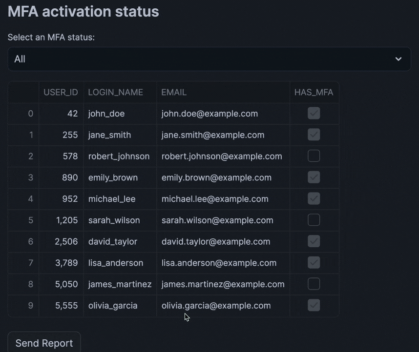

author: Chanin Nantasenamat
id: mfa-audit
summary: Learn how to build a Streamlit app in Snowflake Notebooks to audit and monitor Multi-Factor Authentication (MFA) status of users, with automated email notifications for non-compliant users.
categories: featured, cybersecurity, data-engineering
environments: web
status: Published
feedback link: https://github.com/Snowflake-Labs/sfguides/issues
tags: Streamlit, Cybersecurity, MFA, Email Notifications

# Building an MFA Audit System with Streamlit in Snowflake Notebooks
<!-- ------------------------ -->
## Overview
Duration: 2

Learn how to create an interactive Multi-Factor Authentication (MFA) audit system using Streamlit in Snowflake Notebooks. This application helps security administrators monitor user MFA compliance and automatically notify relevant stakeholders about users who haven't enabled MFA.

### What You'll Learn
- How to create and query a user dataset containing MFA status
- How to set up email notifications in Snowflake
- How to build an interactive Streamlit interface for MFA monitoring
- How to implement automated email reporting for non-compliant users

### What You'll Build
An interactive Streamlit application that displays user MFA status and sends formatted email reports to system administrators about users who haven't enabled MFA.

### What You'll Need
- Access to a [Snowflake account](https://signup.snowflake.com/)

### Prerequisites
- Access to Snowflake Notebooks
- System administrator privileges in Snowflake
- Basic understanding of SQL and Python
- Valid email address for receiving notifications

<!-- ------------------------ -->
## Setup
Duration: 5

### Open Snowflake Notebook
You can retrieve the [MFA Audit Snowflake Notebook](https://github.com/Snowflake-Labs/snowflake-demo-notebooks/blob/main/MFA_Audit_of_Users/MFA_Audit_of_Users_with_Streamlit_in_Snowflake_Notebooks.ipynb) and follow along with the tutorial.

> aside positive
> NOTE:
> On the above mentioned GitHub page, please click on the download icon (upon hover it should display "Download raw file").

### Creating the User Dataset
In this quickstart, we'll use an artificially generated [user dataset](https://github.com/Snowflake-Labs/snowflake-demo-notebooks/blob/main/MFA%20Audit%20of%20Users/demo_data.csv) explained as follows:

1. In Snowflake Notebook, click on `+` → `Table` → `From File` in the left sidebar menu (see screenshot below)
2. Create a table called `CHANINN_DEMO_DATA.PUBLIC.MFA_DATA`. Particularly, you'll see a pop-up, go ahead and select a warehouse, upload the CSV file, specify the database (`CHANINN_DEMO_DATA`), schema (`PUBLIC`) and table name (`MFA_DATA`).
3. Upload the [demo data file](https://github.com/Snowflake-Labs/snowflake-demo-notebooks/blob/main/MFA%20Audit%20of%20Users/demo_data.csv)


### Setting up Email Notifications
Create a notification integration for email communications by entering the following into a SQL cell:

```sql
CREATE OR REPLACE NOTIFICATION INTEGRATION my_email_int
  TYPE=EMAIL
  ENABLED=TRUE;
```

Running this query should return the following confirmation:


> aside positive
> IMPORTANT:
> This setup ensures you have the necessary privileges to create notification integrations

<!-- ------------------------ -->
## Creating the MFA Status Query
Duration: 5

### Writing the Query

Next, we'll retrieve a subset of columns to display (e.g. `USER_ID`, `LOGIN_NAME`, `EMAIL` and `HAS_MFA`). Note that we'll filter this by the user MFA status:

```sql
SELECT USER_ID, LOGIN_NAME, EMAIL, HAS_MFA
FROM CHANINN_DEMO_DATA.PUBLIC.MFA_DATA
WHERE HAS_MFA = 'FALSE'
```

### Testing Email Notifications
Verify the email integration works:

```sql
CALL SYSTEM$SEND_EMAIL(
    'my_email_int',
    'your-name@email-address.com',
    'Email subject goes here',
    'Hello world! This is a test message!'
);
```

> aside positive
> IMPORTANT:
> Replace `your-name@email-address.com` with the email address tied to your user account.

Running the above SQL query will return the following confirmation output:


The notification email looks as follows:


<!-- ------------------------ -->
## Building the Streamlit Interface
Duration: 10

### Creating the Interactive Dashboard
Build the Streamlit application with filtering capabilities and email notifications.

Before running the code, please replace `your-name@email-address.com` with the email address tied to your user account.

```python
from snowflake.snowpark.context import get_active_session
import streamlit as st

session = get_active_session()

# DataFrame of users and their MFA status
st.header('MFA activation status')

mfa_selection = st.selectbox('Select an MFA status:', ('All', 'MFA Activated', 'MFA Not Activated'))
if mfa_selection == 'All':
    df = session.sql(
              """SELECT USER_ID, LOGIN_NAME, EMAIL, HAS_MFA 
                    FROM CHANINN_DEMO_DATA.PUBLIC.MFA_DATA"""
            ).to_pandas()
    paragraph = "<p>Here's the Multi-Factor Authentication status of all users. Please refer users to the <a href='https://docs.snowflake.com/en/user-guide/security-mfa'>Docs page on MFA</a> to activate MFA.</p>"
if mfa_selection == 'MFA Activated':
    df = session.sql(
              "SELECT USER_ID, LOGIN_NAME, EMAIL, HAS_MFA FROM CHANINN_DEMO_DATA.PUBLIC.MFA_DATA WHERE HAS_MFA = 'TRUE'"
            ).to_pandas()
    paragraph = "<p>Congratulations, these users have activated their Multi-Factor Authentication!</p>"
if mfa_selection == 'MFA Not Activated':
    df = session.sql(
              "SELECT USER_ID, LOGIN_NAME, EMAIL, HAS_MFA FROM CHANINN_DEMO_DATA.PUBLIC.MFA_DATA WHERE HAS_MFA = 'FALSE'"
            ).to_pandas()
    paragraph = "<p>It appears that the following users have not activated Multi-Factor Authentication. Please refer users to the <a href='https://docs.snowflake.com/en/user-guide/security-mfa'>Docs page on MFA</a> to activate MFA.</p>"
st.dataframe(df)

# Send Email
if st.button('Send Report'):
    email= 'your-name@email-address.com'
    email_subject = "Important: Activate Multi-Factor Authentication for User's Account"
    header = '<p>Dear System Administrator,</p>'
    body = header + '\n' + paragraph + '\n' + df.to_html(index=False, justify='left')

    session.call('SYSTEM$SEND_EMAIL',
                             'my_email_int',
                              email,
                              email_subject,
                              body,
                             'text/html')
    st.success('Report sent!', icon='✅')
```

Once we run the code cell, make a selection on the select box drop-down widget section and click on `Send Report`, which if successful should return the **Report sent!** confirmation message:



Here's how the MFA report that has been delivered to your email inbox looks like:


## Conclusion
Duration: 1

Congratulations! You've successfully built an MFA audit system that helps monitor and manage user security compliance through an interactive Streamlit interface with automated email notifications.

### What You Learned
- How to create and query user security data in Snowflake
- How to set up and use email notifications
- How to build an interactive dashboard with Streamlit
- How to automate security compliance reporting with Streamlit

### Related Resources

Articles:
- [Multi-factor authentication (MFA)](https://docs.snowflake.com/en/user-guide/security-mfa)
- [Sending email notifications](https://docs.snowflake.com/en/user-guide/notifications/email-notifications)
- [Using SYSTEM$SEND_EMAIL](https://docs.snowflake.com/en/user-guide/notifications/email-stored-procedures)

Documentation:
- [Snowflake Documentation](https://docs.snowflake.com/)
- [Streamlit Documentation](https://docs.streamlit.io/)

Happy coding!
