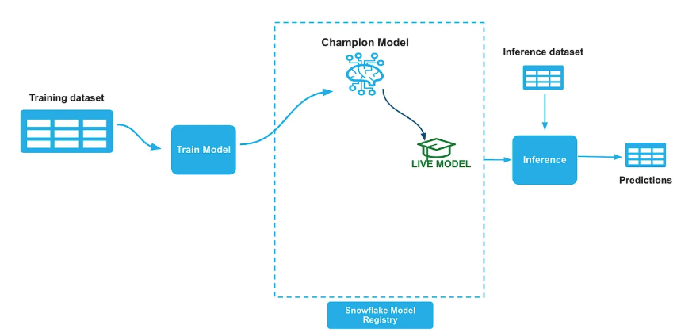
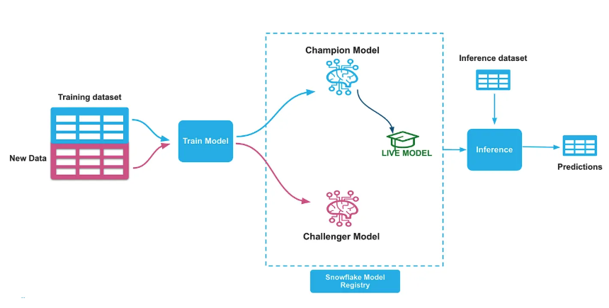
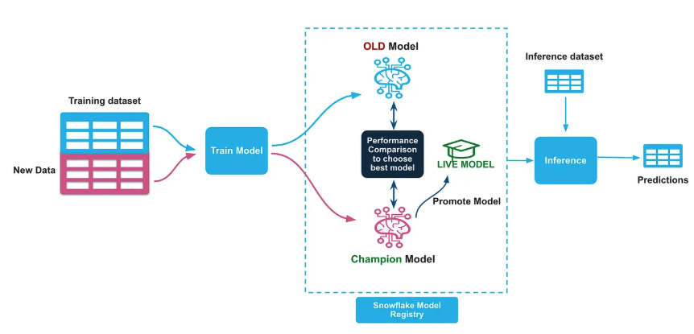

author: Sheena Nasim 
id: ml-champion-challenger-model-deployment
language: en 
summary: Learn how to implement an automated model retraining and deployment pipeline in Snowflake using the Champion-Challenger strategy with Snowflake notebooks, ML Registry, DAGs, and Tasks. 
categories: snowflake-site:taxonomy/product/ai 
environments: web 
status: Published 
feedback link: https://github.com/Snowflake-Labs/sfguides/issues 

# Automated Model Retraining & Deployment In Snowflake
<!-- ------------------------ -->

## Overview

In the realm of production machine learning, maintaining model performance through automated retraining and seamless deployment is crucial. This guide explores a robust solution utilizing the **Champion-Challenger strategy**, implementing a comprehensive model deployment pipeline powered by the Snowflake ML Registry. The pipeline features automated retraining, evaluation, and promotion of ML models.

## 🎯 What is Champion-Challenger Modeling?

Champion-Challenger is a production MLOps pattern where:
- **Champion**: The current production model serving predictions
- **Challenger**: A newly trained model that competes with the champion
- **Evaluation**: Both models are tested on the same holdout dataset
- **Promotion**: If the challenger performs significantly better, it becomes the new champion

### Prerequisites
- Access to Snowflake notebooks
- Basic understanding of Snowflake's ML capabilities and Model Registry
- Python programming experience with scikit-learn

### What You'll Learn
1. How to generate a synthetic dataset for model training and evaluation
2. Steps to train and register a Champion model in Snowflake ML Registry
3. Process for training a Challenger model and comparing its performance against the Champion
4. Automating the model training and promotion pipeline using Snowflake's DAGs and Tasks

### What You'll Need
- Access to a Snowflake account with appropriate permissions
- Snowflake Notebooks enabled in your account

### What You'll Build
- A fully automated model retraining and deployment pipeline in Snowflake implementing the Champion-Challenger strategy

### Code Repository
- You can fork the entire code repo from here: [Automated model retraining](assets/)

<!-- ------------------------ -->

## 1. Generate Dataset

Import and run the [1_CC_Model_Training.ipynb](assets/1_CC_Model_Training.ipynb) notebook in your snowflake notebook.
It will create a synthetic credit approval dataset comprising 8,000 loan applications over 20 weeks (400 applications per week). Each application includes nine financial features:

- Applicant age
- Annual income
- Credit score
- Debt-to-income ratio
- Employment years
- Credit cards count
- Mortgage status
- Education score
- Location risk

The target variable indicates loan approval (approved/denied) based on weighted business logic combining creditworthiness factors. Concept drift is simulated through gradual changes in approval patterns over time, and seasonal effects reflect real-world lending cycles.

### Data Split Strategy

**Champion Model:**
- **Train:** 10 Weeks (week 0–9 → 4,000 samples) — Historical data
- **Test:** 2 Weeks (Week 10–12 → 1,200 samples)

**Challenger Model:**
- **Train:** 10 Weeks (week 3–12 → 4,000 samples) — More recent data
- **Test:** 3 Weeks (week 13–15 → 1,200 samples)

**Evaluation Data:** Weeks 16–19 (1,600 samples) — To compare Champion and Challenger performance.

<!-- ------------------------ -->

## 2. Train a Champion Model

Train an initial Champion model—a Random Forest classifier built with scikit-learn using the first 10 weeks of data. Finalize the model, push it into the Snowflake Model Registry, and establish the inference pipeline. Import and run the [2_CC_Champion_training.ipynb](assets/2_CC_Champion_training.ipynb) notebook in your snowflake notebook. 



Once we build the initial model we will push the model to Snowflake model registry and set the ALIAS property of the model in the registry as "Champion". We will also create a new tag named "LIVE_VERSION" on the model and set it to the name of the champion model version we just logged into registry. 

``` python
# Set the model alias as CHAMPION
champion_ref.set_alias("CHAMPION")

# Get the model from the registry
model = registry.get_model(model_name)

# Set Live version tag
model.set_tag("LIVE_VERSION", champion_ref.version_name)
```

We will establish an inference pipeline after and the inference pipeline remains unchanged regardless of model updates, as all Champion model switching is managed internally within the Snowflake Model Registry.
``` python
#Get the live version of the model
live_version = model.get_tag("live_version")

#Run prediction function
remote_prediction = model.version(live_version).run(test_data, function_name="predict")
```

## 3. Challenger Model Training



Train a Challenger model—a Random Forest classifier using scikit-learn on the 3–12 recent weeks of data. Log this new iteration into the Snowflake Model Registry as the Challenger model.
Follow the same process in step 2 and set the ALIAS property of the model in the registry as "Challenger". Create a new tag named "CHALLENGER_VERSION" on the model and set it to the name of the challenger model version. Import and run the [3_CC_Challenger_Training.ipynb](assets/3_CC_Challenger_Training.ipynb) notebook in your snowflake notebook.

``` python
# Set the model alias as CHALLENGER
challenger_ref.set_alias("CHALLENGER")

# Get the model from the registry
model = registry.get_model(model_name)

# Set Challenger version tag
model.set_tag("CHALLENGER_VERSION", challenger_ref.version_name)
```

<!-- ------------------------ -->

## 4. Model Performance Check & Swap



Perform a basic performance check by comparing the AUC scores of the Champion and Challenger models on the evaluation holdout dataset. If the Challenger's AUC is higher, demote the Champion and promote the Challenger as the new Champion, marking it as Live. Import and run the [4_CC_Swap_Models.ipynb](assets/4_CC_Swap_Models.ipynb) notebook in your snowflake notebook.

```python
### Performance Comparison Logic
if challenger_metrics['auc'] > champion_metrics['auc']:
    # Promote Challenger to Champion
    print(f"🎉 Challenger outperformed Champion!")
    print(f"📊 Champion AUC: {champion_metrics['auc']:.4f}")
    print(f"📊 Challenger AUC: {challenger_metrics['auc']:.4f}")
    
    # Update aliases and tags
    challenger_ref.set_alias("CHAMPION")
    model.set_tag("LIVE_VERSION", challenger_ref.version_name)
else:
    print(f"📝 Reason: Challenger performance not better than Champion")
    print(f"🏆 Current Champion Remains Active: {live_version}")
```
<!-- ------------------------ -->

## 5. Automating Model Training & Promotion

To productionalize this workflow, automate the Challenger training and model promotion pipeline to run weekly (e.g., every Monday at 1 AM). Snowflake's DAGs (Directed Acyclic Graphs) and Tasks features allow scheduling these steps to execute in an orderly fashion. Import and run the [5_CC_Automation.ipynb](assets/5_CC_Automation.ipynb) notebook in your snowflake notebook.

```python
# Define the DAG - run every weekly Monday 1 AM
with DAG(dag_name, schedule=Cron("1 1 * * 1", "Asia/Singapore"), warehouse=warehouse_name) as dag:
    
    dag_task1 = DAGTask(
        "WEEKLY_RETRAINING", 
        definition="EXECUTE NOTEBOOK DEV_AUTOMATION_DEMO.CHAMPION_CHALLENGER.CC_3_CHALLENGER_TRAINING()", 
        warehouse=warehouse_name
    )
    dag_task2 = DAGTask(
        "AUTO_DEPLOY_BEST_MODEL", 
        definition="EXECUTE NOTEBOOK DEV_AUTOMATION_DEMO.CHAMPION_CHALLENGER.CC_4_SWAP_MODELS()", 
        warehouse=warehouse_name
    )
    
    # Define the dependencies between the tasks
    dag_task1 >> dag_task2  # dag_task1 is a predecessor of dag_task2
```

<!-- ------------------------ -->

## Conclusion and Resources

Congratulations! You have successfully implemented an automated model retraining and deployment pipeline in Snowflake using the Champion-Challenger strategy.

Snowflake simplifies model lifecycle management by leveraging its ML Registry to store and govern models. Furthermore, Snowflake DAGs and Tasks automate the entire model retraining and deployment strategies, ensuring a seamless MLOps workflow.

### What You Learned
- How to generate synthetic datasets with concept drift for model training
- Training and registering Champion models in Snowflake ML Registry
- Implementing the Challenger model training and evaluation process
- Automating model promotion using Snowflake DAGs and Tasks
- Best practices for production ML model lifecycle management

### Related Resources
- [Medium Blog On Automated Model Retraining & Deployment In Snowflake](https://medium.com/snowflake/automated-model-retraining-deployment-in-snowflake-2670fe0ac39b)
- [Snowflake ML Registry Documentation](https://docs.snowflake.com/en/developer-guide/snowflake-ml/model-registry/overview)
- [Snowflake Tasks and DAGs Documentation](https://docs.snowflake.com/en/user-guide/tasks-intro)
- [Snowflake Notebooks Documentation](https://docs.snowflake.com/en/user-guide/ui-snowsight/notebooks)
