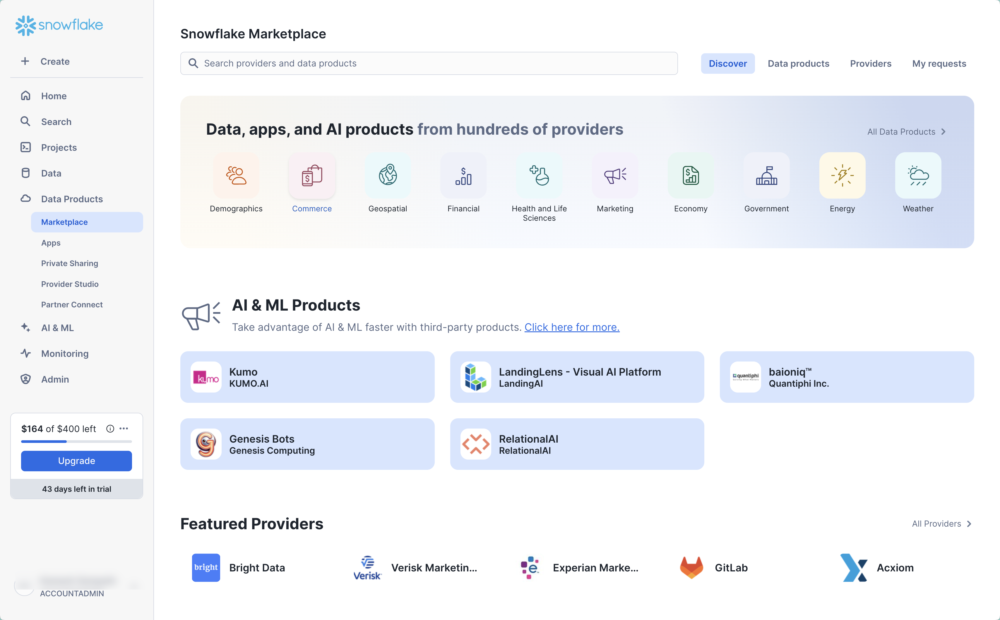
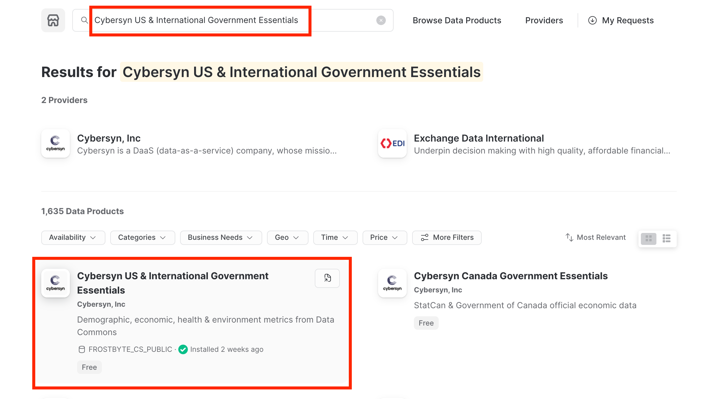
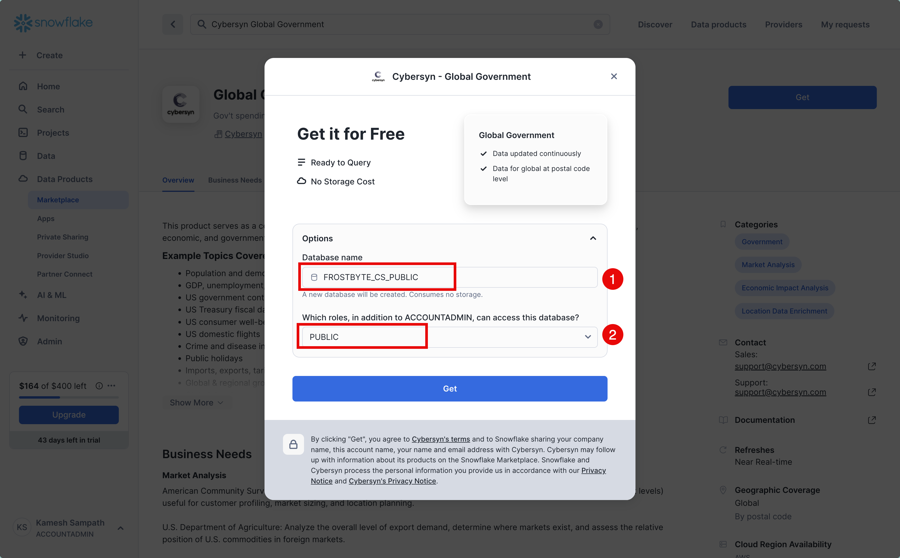
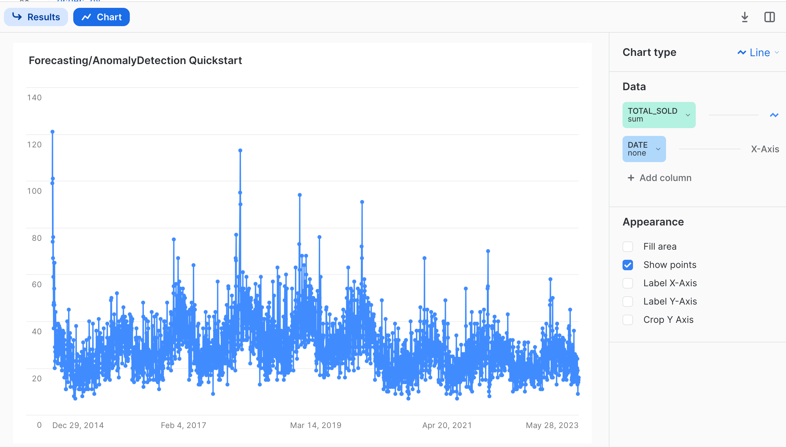
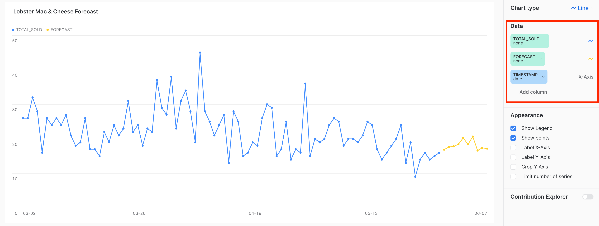
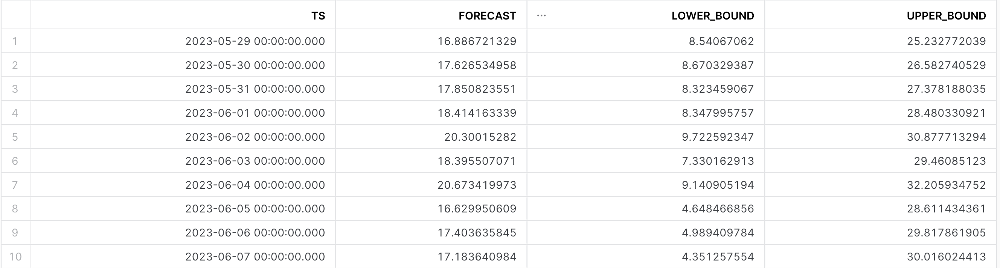
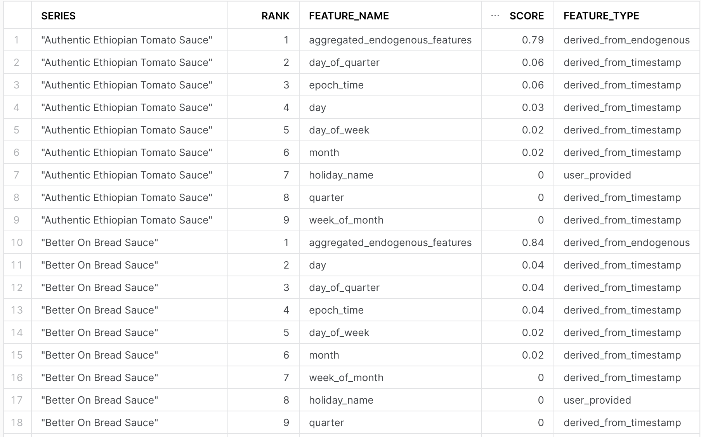
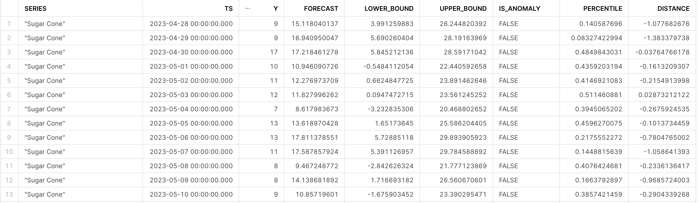
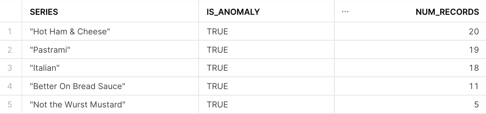
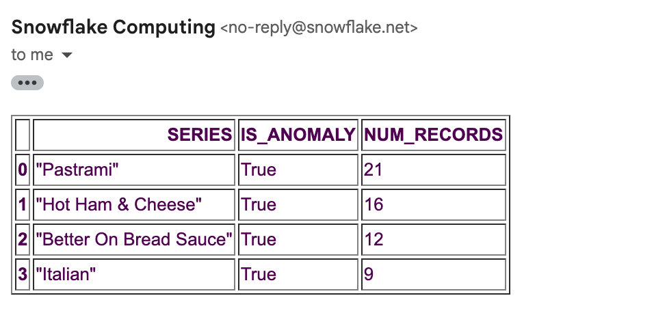

author: Harsh Patel
id: mlpf_forecasting_ad
summary: Getting started with Anomaly Detection & Forecasting ML Powered Functions
categories: Getting-Started
environments: web
status: Published 
feedback link: https://github.com/Snowflake-Labs/sfguides/issues
tags: Getting Started, Data Science, Data Engineering, Twitter 

# Getting Started with Anomaly Detection & Forecasting with Machine Learning Powered Functions (MLPFs)
<!-- ------------------------ -->
## Overview 
Duration: 5

One of the most critical activities that a Data/Business Analyst has to perform is to produce recommendations to their business stakeholders based upon the insights they have gleaned from their data. In practice, this means that they are often required to build models to: make forecasts, identify long running trends, and identify abnormalities within their data. However, Analysts are often impeded from creating the best models possible due to the depth of statistical and machine learning knowledge required to implement them in practice. Further, python or other programming frameworks may be unfamiliar to Analysts who write SQL, and the nuances of fine-tuning a model may require expert knowledge that may be out of reach. 

For these use cases, Snowflake has developed a set of Machine Learning Powered Functions (MLPFs), which are a set of SQL functions that implement machine learning models on the user's behalf. As of August 2023, three MLPFs are in Public Preview for time-series based data:

1. Forecasting: which enables users to forecast a metric based on past values. Common use-cases for forecasting including predicting future sales, demand for particular sku's of an item, or volume of traffic into a website over a period of time.
2. Anomaly Detection: which flags anomalous values using both unsupervised and supervised learning methods. This may be useful in use-cases where you want to identify spikes in your cloud spend, identifying abnormal data points in logs, and more.
3. Contribution Explorer: which enables users to perform root cause analysis to determine the most significant drivers to a particular metric of interest. 

For further details on MLPFs, please refer to the [snowflake documentation](https://docs.snowflake.com/guides-overview-analysis). 

### Prerequisites
- Working knowledge of SQL
- A Snowflake account login with an ACCOUNTADMIN role. If not, you will need to use a different role that has the ability to create database, schema, table, stages, tasks, email integrations, and stored procedures. 

### What You’ll Learn 
- How to make use of Anomaly Detection & Forecasting MLPFs to create models and produce predictions
- Use Tasks to retrain models on a regular cadence
- Use the [email notfication integration](https://docs.snowflake.com/en/user-guide/email-stored-procedures) to send email reports of the model results after completion 

### What You’ll Build 
This Quickstart is designed to help you get up to speed with both the Forecasting and Anomaly Detection MLPFs. 
We will work through an example using data from a fictitious food truck company, Tasty Bytes, to first create a forecasting model to predict the demand for each menu-item that Tasty Bytes sells in Vancouver. Predicting this demand is important to Tasty Bytes, as it allows them to plan ahead and get enough of the raw ingredients to fulfill customer demand. 

We will start with one food item at first, but then scale this up to all the items in Vancouver and add additional datapoints like holidays to see if it can improve the model's performance. Then, to see if there have been any trending food items, we will build an anomaly detection model to understand if certain food items have been selling anomalously. We will wrap up this Quickstart by showcasing how you can use Tasks to schedule your model training process, and use the email notification integration to send out a report on trending food items. 

Let's get started!

<!-- ------------------------ -->
## Setting Up Data in Snowflake
Duration: 10

### Overview:
You will use [Snowsight](https://docs.snowflake.com/en/user-guide/ui-snowsight), the Snowflake web interface, to: 
- Create Snowflake objects (i.e warehouse, database, schema, etc..)
- Ingest sales data from S3 and load it into a snowflake table
- Access Holiday data from the Snowflake Marketplace. 
  
### Step 1: Loading Holiday Data from the Snowflake Marketplace

The [Snowflake Marketplace](https://other-docs.snowflake.com/en/collaboration/collaboration-marketplace-about) provides mutiple listings for data you may use for analytical purposes. We will be leveraging the open data aggregated by Cybersyn for this quickstart, which contains a database of holidays to enrich our sales data. 

- Log into your Snowflake account as the ACCOUNTADMIN or similar role
- Follow the steps below to access the Cybersyn Government Essentials listing in your account. 
  - Click on 'Marketplace' on the left hand banner:
  
    
  
  - In the search bar, search for 'Cybersyn Government Essentials'
    
  - Click on the first listing, with the same title: 

    

  - Click on get, and on the pop-up screen, rename the database to FROSTBYTE_CS_PUBLIC (in all caps). Note - if prompted, you may need to fill in your details before being able to get access. Grant access to the `PUBLIC` role in the dropdown menu: 
  
    

### Step 2: Creating Objects, Load Data, & Set Up Tables

- Create a new worksheet by clicking on the 'Worksheets' tab on the left hand side. 
- Paste and run the following SQL commands in the worksheet to create the required Snowflake objects, ingest sales data from S3, and update your Search Path to make it easier to work with the MLPFs. 

```sql
USE ROLE ACCOUNTADMIN;

-- Create development database, schema for our work: 
CREATE OR REPLACE DATABASE quickstart;
CREATE OR REPLACE SCHEMA mlpf;

-- Use appropriate resources: 
USE DATABASE quickstart;
USE SCHEMA mlpf;

-- Create warehouse to work with: 
CREATE OR REPLACE WAREHOUSE quickstart_wh;
USE quickstart_wh;

-- Set search path for MLPFs:
ALTER ACCOUNT
SET SEARCH_PATH = '$current, $public, SNOWFLAKE.ML';

-- Create a csv file format: 
CREATE OR REPLACE FILE FORMAT quickstart.mlpf.csv_ff
type = 'csv'
SKIP_HEADER = 1,
COMPRESSION = AUTO;

-- Create an external stage pointing to s3, to load sales data: 
CREATE OR REPLACE STAGE s3load 
COMMENT = 'Quickstart S3 Stage Connection'
url = 's3://sfquickstarts/frostbyte_tastybytes/mlpf_quickstart/'
file_format = quickstart.mlpf.csv_ff;

-- Define Tasty Byte Sales Table
CREATE OR REPLACE TABLE quickstart.mlpf.tasty_byte_sales(
  	DATE DATE,
	PRIMARY_CITY VARCHAR(16777216),
	MENU_ITEM_NAME VARCHAR(16777216),
	TOTAL_SOLD NUMBER(17,0)
);

-- Ingest data from s3 into our table
COPY INTO quickstart.mlpf.tasty_byte_sales 
FROM @s3load/mlpf_quickstart_vancouver_daily_sales.csv;

-- View a sample of the ingested data: 
SELECT * FROM quickstart.mlpf.tasty_byte_sales limit 100;
```

At this point, we have all the data we need to start building models. We will get started with building our first forecasting model.  

<!-- ------------------------ -->
## Forecasting Demand for Lobster Mac & Cheese
Duration: 10

We will start off by first building a forecasting model to predict the demand for Lobster Mac & Cheese in Vancouver.

### Step 1: Visualize Daily Sales on Snowsight

Before building our model, let's first visualize our data to get a feel for what daily sales looks like. Run the following sql command in your Snowsight UI, and toggle to the chart at the bottom.

```sql
SELECT *
FROM tasty_byte_sales
where menu_item_name like 'Lobster Mac & Cheese';
```
After toggling to the chart, we should see a daily sales for the item Lobster Mac & Cheese going back all the way to 2014: 



Observing the chart, one thing we can notice is that there appears to be a seasonal trend present for sales, on a yearly basis. This is an important consideration for building robust forecasting models, and we want to make sure that we feed in enough training data that represents one full cycle of the time series data we are modeling for. The forecasting MLPF is smart enough to be able to automatically identify and handle multiple seasonality patterns, so we will go ahead an use the latest year's worth of data as input to our model. In the query below, we will also convert the date column using the `to_timestamp_ntz` function, so that it be used in the forecasting function. 

```sql
-- Create Table containing the latest years worth of sales data: 
CREATE OR REPLACE TABLE vancouver_sales AS (
    SELECT
        to_timestamp_ntz(date) as timestamp,
        primary_city,
        menu_item_name,
        total_sold
    FROM
        tasty_byte_sales
    WHERE
        date > (SELECT max(date) - interval '1 year' FROM tasty_byte_sales)
    GROUP BY
        all
);
```
### Step 2: Creating our First Forecasting Model: Lobster Mac & Cheese

The forecasting MLPF is invoked through a SQL function and automatically takes care of many of the data science best practices with respect to hyper-parameter tuning, and adjusting for missing data. We will build our forecasting model below, for only the Lobster Mac & Cheese item. 

```sql
-- Create view for lobster sales
CREATE OR REPLACE VIEW lobster_sales AS (
    SELECT
        timestamp,
        total_sold
    FROM
        vancouver_sales
    WHERE
        menu_item_name LIKE 'Lobster Mac & Cheese'
);

--Build Forecasting model:
CREATE OR REPLACE forecast lobstermac_forecast (
    INPUT_DATA => SYSTEM$REFERENCE('VIEW', 'lobster_sales'),
    TIMESTAMP_COLNAME => 'TIMESTAMP',
    TARGET_COLNAME => 'TOTAL_SOLD'
);

-- Show models to confirm training has completed: 
SHOW forecast;
```
In the steps above, we create a view containing the relevant daily sales for our Lobster Mac & Cheese item, to which we pass to the forecast function. The last step should confirm that the model has been created, and ready to create predictions. 

### Step 3: Creating and Visualizing Predictions

Let's now use our trained `lobstermac_forecast` model to create predictions for the demand for the next 10 days. 

```sql
-- Create predictions, and save results to a table:  
CALL lobstermac_forecast!FORECAST(FORECASTING_PERIODS => 10);

-- Run immediately after the above call to store results!
CREATE OR REPLACE TABLE macncheese_predictions AS (
    SELECT
        *
    FROM
        TABLE(RESULT_SCAN(-1))
);

-- Visualize the reuslts, overlaid on top of one another: 
SELECT
    timestamp,
    total_sold,
    NULL AS forecast
FROM
    lobster_sales
WHERE
    timestamp > '2023-03-01'
UNION
SELECT
    TS AS timestamp,
    NULL AS total_sold,
    forecast
FROM
    macncheese_predictions
ORDER BY
    timestamp asc;

```


There we have it! We just created our first set of predictions for the next 10 days worth of demand, which can be used to inform how much inventory of raw ingredients we may need. As shown from the above visualization, there seems to also be a weekly trend for the items sold, which the model was also able to pick up on. 

**Note:** You may notice that your chart has included the null being represented as 0's. Make sure to select the 'none' aggregation for each of columns as shown on the right hand side of the image above to reproduce the image. 

### Step 4: Understanding Forecasting Output & Configuration Options

If we have a look at the tabular results below, we can see that the following columns are outputted as shown below.  

1. TS: Which represents the Timestamp for the forecast prediction
2. Forecast: The output/prediction made by the model
3. Lower/Upper_Bound: Separate columns that specify the [prediction interval](https://en.wikipedia.org/wiki/Prediction_interval)



The forecast MLPF exposes a  `config_object` that allows you to control the outputted prediction interval. This value ranges from 0 to 1, with a larger value providing a wider range between the lower and upper bound. See below for an example of how change this when producing inferences: 

```sql
CALL lobstermac_forecast!FORECAST(FORECASTING_PERIODS => 10, CONFIG_OBJECT => {'prediction_interval': .9});
```

<!-- ------------------------ -->
## Building Multiple Forecasts & Adding Holiday Information
Duration: 15

In the previous section, we built a forecast model to predict the demand for only the Lobster Mac & Cheese item our food trucks were selling. However, this is not the only item sold in the city of Vancouver, what if we wanted to build out a separate forecast model for each of the individual items? This is made possible through the `series_colname` argument in the forecasting MLPF, which lets a user specify a column that contains the different series that should be forecasted individually. 

Further, there may be additional data points we want to include in our model to produce better results. In the previous section, we saw that for the Lobster Mac & Cheese item, there were some days that had major spikes in the number of items sold. One hypothesis that could explain these jumps are holidays where people are perhaps more likely to go out and buy from Tasty Bytes. We can also include these additional [exogenous variables](https://en.wikipedia.org/wiki/Exogenous_and_endogenous_variables) to our model. 


### Step 1: Build Multi-Series Forecast for Vancouver

Follow the SQL Commands below to create a multi-series forecasting model for the city of Vancouver, with holiday data also included. 


```sql

-- Create a table for the holidays in Vancouver, which is located in British Columbia (BC) in Cananda (CA)
CREATE OR REPLACE VIEW canadian_holidays AS (
    SELECT
        date,
        holiday_name,
        is_financial
    FROM
        frostbyte_cs_public.cybersyn.public_holiday_calendar
    WHERE
        ISO_ALPHA2 LIKE 'CA'
        AND date > '2022-01-01'
        AND (
            subdivision IS null
            OR subdivision LIKE 'BC'
        )
    ORDER BY
        date ASC
);

-- Create a view for our training data, including the holidays for all items sold: 
CREATE OR REPLACE VIEW allitems_vancouver as (
    SELECT
        vs.timestamp,
        vs.menu_item_name,
        vs.total_sold,
        ch.holiday_name
    FROM 
        vancouver_sales vs
        left join canadian_holidays ch on vs.timestamp = ch.date
);

-- Train Model: 
CREATE OR REPLACE forecast vancouver_forecast (
    INPUT_DATA => SYSTEM$REFERENCE('VIEW', 'allitems_vancouver'),
    SERIES_COLNAME => 'MENU_ITEM_NAME',
    TIMESTAMP_COLNAME => 'TIMESTAMP',
    TARGET_COLNAME => 'TOTAL_SOLD'
);

SHOW forecast;
```

You may notice as you do the left join that there are a lot of null values for the column `holiday_name`. Not to worry! MLPFs are able to automatically handle and adjust for missing values as these. 

### Step 2: Create Predictions

Unlike the single series model we built in the previous section, we can not simply use the `vancouver_forecast!forecast` method to generate predictions for our current model. Since we have added holidays as an exogenous variable, we need to prepare an inference dataset and pass it into our trained model.


```sql

-- Retrieve the latest date from our input dataset, which is 05/28/2023: 
SELECT MAX(timestamp) FROM vancouver_sales;

-- Create view for inference data
CREATE OR REPLACE VIEW vancouver_forecast_data AS (
    WITH future_dates AS (
        SELECT
            '2023-05-28' ::DATE + row_number() over (
                ORDER BY
                    0
            ) AS timestamp
        FROM
            TABLE(generator(rowcount => 10))
    ),
    food_items AS (
        SELECT
            DISTINCT menu_item_name
        FROM
            allitems_vancouver
    ),
    joined_menu_items AS (
        SELECT
            *
        FROM
            food_items
            CROSS JOIN future_dates
        ORDER BY
            menu_item_name ASC,
            timestamp ASC
    )
    SELECT
        jmi.menu_item_name,
        to_timestamp_ntz(jmi.timestamp) AS timestamp,
        ch.holiday_name
    FROM
        joined_menu_items AS jmi
        LEFT JOIN canadian_holidays ch ON jmi.timestamp = ch.date
    ORDER BY
        jmi.menu_item_name ASC,
        jmi.timestamp ASC
);

-- Call the model on the forecast data to produce predictions: 
CALL vancouver_forecast!forecast(
        INPUT_DATA => SYSTEM$REFERENCE('VIEW', 'vancouver_forecast_data'),
        SERIES_COLNAME => 'menu_item_name',
        TIMESTAMP_COLNAME => 'timestamp'
    );

-- Store results into a table: 
CREATE OR REPLACE TABLE vancouver_predictions AS (
    SELECT
        *
    FROM
        TABLE(RESULT_SCAN(-1))
);

```
Above, we used the generator function to generate the next 10 days from 05/28/2023, which was the latest date in our training dataset. We then performed a cross join against all the 80 distinct food items we sell within Vancouver, and lastly joined against our holiday table so that the model is able to make use of it. 

### Step 3: Feature Importances

An important part of the model building process is understanding how the individual columns or features that you put into the model weigh in on the final predictions made. This can help provide intuition into what the most significant drivers are, and allow us to iterate by either including other columns that may be predictive or removing those that don't provide much value. The forecasting MLPF gives you the ability to calculate [feature importance](https://docs.snowflake.com/en/user-guide/analysis-forecasting#understanding-feature-importance), using the `explain_feature_importance` method as shown below. 

```sql
CALL VANCOUVER_FORECAST!explain_feature_importance();
```

The output of this call for our multi-series forecast model is shown below, which you can explore further on snowsight. One thing to notice here is that, for this particular dataset, including holidays as an exogenous variable didn't dramatically impact our predictions. We may consider dropping this altogether, and only rely on the daily sales themselves. 



<!-- ------------------------ -->
## Identifying Anomalous Sales with the Anomaly Detection MLPF
Duration: 10

In the past couple of sections we have built forecasting models for the items sold in Vancouver to plan ahead to meet demand. As an analyst, another question we might be interested in investigating further are anomalous sales. If there is a consistent trend across a particular food item, this may constitute a recent trend, and we can use this information to better understand the customer experience and optimize it. 

### Step 1: Building the Anomaly Detection Model

In this section, we will make use of the [anomaly detection MLPF](https://docs.snowflake.com/en/user-guide/analysis-anomaly-detection) to build a model for anamolous sales for all items sold in Vancouver. Since we had found that holidays were not impacting the model, we have dropped that as a column for our anomaly model. 

```sql
-- Create a view containing our training data: 
CREATE OR REPLACE VIEW vancouver_anomaly_training_set AS (
SELECT *
FROM vancouver_sales
WHERE timestamp < (SELECT max(timestamp) FROM vancouver_sales) - interval '1 Month'
);

-- Create a view containing the data we want to make inferences on: 
CREATE OR REPLACE VIEW vancouver_anomaly_analysis_set AS (
SELECT *
FROM vancouver_sales
WHERE timestamp > (SELECT max(timestamp) FROM vancouver_anomaly_training_set));

-- Create the model: UNSUPERVISED method, however can pass labels as well - 
CREATE OR REPLACE snowflake.ml.anomaly_detection vancouver_anomaly_model(
    INPUT_DATA => SYSTEM$REFERENCE('VIEW', 'vancouver_anomaly_training_set'),
    SERIES_COLNAME => 'MENU_ITEM_NAME',
    TIMESTAMP_COLNAME => 'TIMESTAMP',
    TARGET_COLNAME => 'TOTAL_SOLD',
    LABEL_COLNAME => ''
); 

-- Call the model and store the results into table:
CALL vancouver_anomaly_model!DETECT_ANOMALIES(
    INPUT_DATA => SYSTEM$REFERENCE('VIEW', 'vancouver_anomaly_analysis_set'),
    SERIES_COLNAME => 'MENU_ITEM_NAME',
    TIMESTAMP_COLNAME => 'TIMESTAMP',
    TARGET_COLNAME => 'TOTAL_SOLD',
    CONFIG_OBJECT => {'prediction_interval': 0.95}
);

CREATE OR REPLACE TABLE vancouver_anomalies AS (
    SELECT
        *
    FROM 
        TABLE(RESULT_SCAN(-1))
);

SELECT * FROM vancouver_anomalies;
```

A few comments on the code above: 
1. Anomaly detection is able work in both a supervised and unsupervised manner. In this case, we trained it in the unsupervised fashion. If you have a column that specifies labels for whether something was anomalous, you can use the `LABEL_COLNAME` argument to specify that column. 
2. Similar to the forecasting MLPF, you also have the option to specify the `prediction_interval`. In this context, this is used to control how 'agressive' the model is in identifying an anomaly. A value closer to 1 means that fewer observations will be marked anomalous, whereas a lower value would mark more instances as anomalous. See [documentation](https://docs.snowflake.com/en/user-guide/analysis-anomaly-detection#specifying-the-prediction-interval-for-anomaly-detection) for further details. 

The output of the model is shown in the image below. Refer to the [output documentation](https://docs.snowflake.com/sql-reference/classes/anomaly_detection#id7) for further details on what all the columns specify. 



### Step 2: Identifying Trends

With our model output, we are now in a position to see how many times an anomalous sale occured for each of the 80 items in our most recent month's worth of sales data. Using the sql below:

```sql
SELECT series, is_anomaly, count(is_anomaly) AS num_records
FROM vancouver_anomalies
WHERE is_anomaly =1
GROUP BY ALL
ORDER BY num_records DESC
LIMIT 5;
```


From the image above, it seems as if Pastrami, Hot Ham & Cheese, and Better on Bread Sauce have had the most number of anomalous sales in the month of May!

<!-- ------------------------ -->
## Productionizing Your Workflow Using Tasks & Stored Procedures
Duration: 15

In this last section, we will walk through how we can use the models created previously and build them into a pipeline to send email reports for the most trending items in the past 30 days. This involves a few components that includes: 

1. Using [Tasks](https://docs.snowflake.com/en/user-guide/tasks-intro) to retrain the model every month, to make sure it is fresh
2. Setting up an [email notification integration](https://docs.snowflake.com/en/user-guide/email-stored-procedures) to send emails to our stakeholders
3. A [Snowpark Python Stored Procedure](https://docs.snowflake.com/en/sql-reference/stored-procedures-python) to extract the anomalies and send formatted emails containing the most trending items. 

```sql
-- Create a task to run every month to retrain the anomaly detection model: 
CREATE OR REPLACE TASK ad_vancouver_training_task
    WAREHOUSE = test
    SCHEDULE = 'USING CRON 0 0 1 * * America/Los_Angeles' -- Runs once a month
AS
CREATE OR REPLACE snowflake.ml.anomaly_detection vancouver_anomaly_model(
    INPUT_DATA => SYSTEM$REFERENCE('VIEW', 'vancouver_anomaly_training_set'),
    SERIES_COLNAME => 'MENU_ITEM_NAME',
    TIMESTAMP_COLNAME => 'TIMESTAMP',
    TARGET_COLNAME => 'TOTAL_SOLD',
    LABEL_COLNAME => ''
); 

-- Creates a Stored Procedure to extract the anomalies from our freshly trained model: 
CREATE OR REPLACE PROCEDURE extract_anomalies()
RETURNS TABLE ()
LANGUAGE sql 
AS
BEGIN
    CALL vancouver_anomaly_model!DETECT_ANOMALIES(
    INPUT_DATA => SYSTEM$REFERENCE('VIEW', 'vancouver_anomaly_analysis_set'),
    SERIES_COLNAME => 'MENU_ITEM_NAME',
    TIMESTAMP_COLNAME => 'TIMESTAMP',
    TARGET_COLNAME => 'TOTAL_SOLD',
    CONFIG_OBJECT => {'prediction_interval': 0.95});
DECLARE res RESULTSET DEFAULT (
    SELECT series, is_anomaly, count(is_anomaly) as num_records 
    FROM TABLE(result_scan(-1)) 
    WHERE is_anomaly = 1 
    GROUP BY ALL
    HAVING num_records > 5
    ORDER BY num_records DESC);
BEGIN 
    RETURN table(res);
END;
END;

-- Create an email integration: 
CREATE NOTIFICATION INTEGRATION my_email_int
TYPE = EMAIL
ENABLED = TRUE
ALLOWED_RECIPIENTS = ('<EMAIL GOES HERE>');

-- Create Snowpark Python Stored Procedure to format email and send it
create or replace procedure send_anomaly_report()
returns string
language python
runtime_version = 3.9
packages = ('snowflake-snowpark-python')
handler = 'send_email'
as
$$
def send_email(session):
    session.call('extract_anomalies').collect()
    printed = session.sql(
        "select * from table(result_scan(last_query_id(-1)))"
      ).to_pandas().to_html()
    session.call('system$send_email',
        'my_email_int',
        '<EMAIL RECIPIENTS GO HERE>',
        'Email Alert: Anomaly Report Has Been created',
        printed,
        'text/html')
$$;

-- Orchestrating the Tasks: 
create or replace task send_anomaly_report_task
warehouse = test
after AD_VANCOUVER_TRAINING_TASK
as call send_anomaly_report();

-- Steps to immediately execute the task:  
ALTER TASK SEND_ANOMALY_REPORT_TASK RESUME;
ALTER TASK AD_VANCOUVER_TRAINING_TASK RESUME;
EXECUTE TASK AD_VANCOUVER_TRAINING_TASK;
```
Some considerations to keep in mind from the above code: 
1. **Use the freshest data available**: In the code above, we used `vancouver_anomaly_analysis_set` to retrain the model, which, because the data is static, would contain the same data as the original model. In a production setting, you may accordingly adjust the input table/view to have the most updated dataset to retrain the model.
2. **Sending emails**: This requires you to set up an integration, and specify who the recipients of the email should be. When completed appropriately, you'll recieve an email from `no-reply@snowflake.net`, as seen below. 
3. **Formatting results**: We've made use of a snowpark stored procedure, to take advantage of the functions that pandas has to neatly present the resultset into an email. For futher details and options, refer to this [medium post](https://medium.com/snowflake/hey-snowflake-send-me-an-email-243741a0fe3) by Felipe Hoffa.
4. **Executing the Tasks**: We have set this task to run the first of every month - if you would like to run it immediately, you'll have to change the state of the task to `RESUME` as shown in the last three lines of code above, before executing the parent task `AD_VANCOUVER_TRAINING_TASK`. Note that we have orchestrated the task to send the email to the user *after* the model has been retrained. After executing, you may expect to see an email similar to the one below within a few minutes.




<!-- ------------------------ -->
## Conclusion

**You did it!** Congrats on building your first set of models using Snowflake MLPFs. 

As a review, in this guide we covered how you are able to: 

- Acquire holiday data from the snowflake marketplace
- Visualized sales data from our fitictious company Tasty Bytes
- Built out forecasting model for only a single item (Lobster Mac & Cheese), before moving onto a multi-series forecast for all the food items sold in Vancouver
- Used Anomaly detection MLPF to identify anomalous sales, and used it to understand recent trends in sales data
- Productionize pipelines using Tasks & Stored Procedures, so you can get the latest results from your model on a regular cadence

### Resources: 
This guide contained code patterns that you can leverage to get quickly started with MLPFs. For further details, here are some useful resources: 

- [Anomaly Detection](https://docs.snowflake.com/en/user-guide/analysis-anomaly-detection) Product Docs, alongside the [anomaly syntax](https://docs.snowflake.com/en/sql-reference/classes/anomaly_detection)
- [Forecasting](https://docs.snowflake.com/en/user-guide/analysis-forecasting) Product Docs, alongside the [forecasting syntax](https://docs.snowflake.com/sql-reference/classes/forecast)

