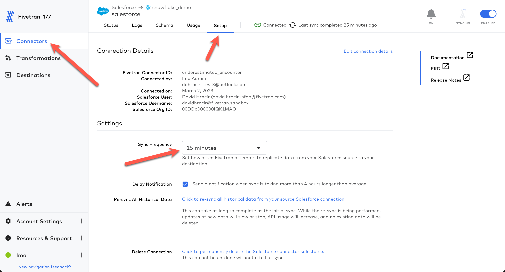

author: David Hrncir
id: modern_data_stack_with_fivetran_snowflake_salesforce
summary: Lab to demonstrate the ease of use to ingest data from Salesforce to Snowflake through Fivetran with insights dashboard from dbt models.
categories: Getting-Started
environments: web
status: Published 
feedback link: https://github.com/Snowflake-Labs/sfguides/issues
tags: Getting Started, Analytics, Data Engineering, Fivetran, Salesforce, dbt

# Fivetran - Automate Salesforce Insights: Source, Target, Transformations, Dashboard...NO CODE
<!-- ------------------------ -->
## Overview
Duration: 3

You 

### Prerequisites
- Existing Snowflake account or a [new Snowflake trial account](https://signup.snowflake.com) with `ACCOUNTADMIN` role
- [Salesforce development account](https://developer.salesforce.com/signup)

### What you'll learn in the lab
- How to leverage Snowflake Partner Connect to create a Fivetran account
- How to create/configure a Fivetran Salesforce connector
- How to use Fivetran’s Quickstart Data Models to transform the raw data into analytics models
- How to setup a Snowflake Dashboard to harness the Salesforce data models

### What you'll need
- All you’ll need is a modern browser like Chrome

### What you'll build 
- A `NO CODE` Salesforce data pipeline
  - With prebuilt data models ready for use
  - Powered by Snowflake and Fivetran (and dbt Labs - transforms use dbt Core - no installs or account needed)
- A dashboard that gives immediate insights into your Salesforce data


## Accounts - Snowflake and Fivetran
Duration: 10

The outcome of this step is to:
- Have a Snowflake account with all the objects needed for Fivetran to ingest data (account, user, role, warehouse, database)
- Have a Fivetran account with a Snowflake destination setup ready to receive data

The easiest option to get started with Fivetran and Snowflake is to use Snowflake Partner Connect.  Partner connect allows you to quickly create a Fivetran trial account and configures the default Snowflake destination within Fivetran in one easy step.

If you are unable to use Snowflake Partner Connect (ex. you may already have a Fivetran account linked), the creation of a Fivetran trial and a Fivetran Snowflake destination are also shown below.

### Partner Connect
Ensure you are in the Snowflake UI as an `ACCOUNTADMIN`.  Expand `Admin`, click `Partner Connect`, under `Data Integration` click the Fivetran tile.


Once the tile is clicked you will be presented with the Fivetran configuration screen below.  Simply click the `Connect` button and follow the emails sent.  That's it!  That will kick off the Fivetran trial account as well as build your default Snowflake destination.  You may skip the below section.


### Non-Partner Connect Only
> aside negative
> In the case where you are unable to use partner connect, you can create a [Fivetran trial account here](https://fivetran.com/signup).  Post Fivetran account creation, you simply follow [these instructions](https://fivetran.com/docs/destinations/snowflake/setup-guide) to setup your Snowflake destination in Fivetran and Snowflake.  Then you may continue to the next step.
>

## Configure the Fivetran Salesforce Connector
Duration: 8

Ok, let's get our data from Salesforce into Snowflake via the quickest, easiest, and most reliable method available in the world today...Fivetran!  Ensure you are logged into your Fivetran account.

Click `Explore/Add Connectors`:


Click the `Salesforce` connector and then click `Continue Setup`:


Leave the `Destination schema` as `salesforce` and click `Authorize`.  This will launch your login for your Salesforce developer account.  If you area already logged, this will take the current token and return.  If not, you will be asked to login.  Enter your credentials.  Upon signing in, you will be redirected back to Fivetran configuration.


You will see that the authentication is successful.  Click `Save & Test`.


Fivetran will test the token to ensure Fivetran can login to the API and query assets needed.  Click `Continue`.


Next you will select the tables/objects to replicate.  Salesforce contains over 900 objects.  Let's only select the ones we need here today.  Click the `minus` sign twice which will deselect all tables.


Then let's make this easy and use the filter textbox to only find and select the objects/tables we want to replicate.  Here is the list of objects we want to select (please be sure to choose the exact name).  Note that once you select a table and begin a new filter, the selected table(s) stay checked...even though the table may go out of view.  Repeat each search and select each table below until all are selected.
- Account
- Contact
- Event
- Lead
- Opportunity
- OpportunityLineItem
- Order
- Product2
- Task
- User
- UserRole


When done with all of the above adds, click the filter icon and check the `Only show selected tables` checkbox.


The filtered view should be as shown below.  If so, click `Save & Continue`.


Leave the schema changes setting as `Allow All`.  Click `Continue`.


With that, we are ready to go!  Let's sync data.  Click `Start Initial Sync`.  And let Fivetran seemlessly replicate your data into Snowflake.  This should only take a minute or two at most.  Now, let's move on to transformations!


## Configure Fivetran Quickstart Transformations
Duration: 5

Fivetran is going to replicate your Salesforce data into a fully normalized Snowflake schema.  Now to make the data easier to query for our dashboard/use cases, let's transform it.  Fivetran gives you the ability, and is ever expanding, to utilize dbt Core data modeling to further curate your data with NO CODE!  These transformations are called Quickstart Data Models.  Let's configure these now.

From the Fivetran UI, click `Transformations` in the left navbar.  Then in the `Quickstart` section, click `Get Started`.


In the configuration page, for `Source Type` choose `Salesforce`.  For `Connector`, choose your Salesforce connector.


Scroll down on the configuration screen and under `Set Schedule` select `Fully integrated`, then click `Save`.


The transformations are now configured and will show a status of `Pending`.


The transformations should instantiate within a few minutes.  If not, you may reset the schedule for your Salesforce connector to a lower number like 15 minutes.


If you catch it fast enough, the transformations page will show the transformation jobs status as `Running`.  Like the data replication, this should only take a minute or two to complete.


Once the transformations complete, you will see new objects in the Snowflake database.  The objects prefixed with 'SALESFORCE__' are models ready to query to assist us in our use cases and dashboard.  Objects prefixed with 'STG_' are staging objects used to build the final models and are rebuilt upon every transformation run.  (The below Snowflake images display the objects built by the Quickstart Data Models...no further action needed on these tables!)


In the Fivetran UI, you can view the lineage for any of the transformation jobs just by click the transformation job from the Transformations UI (`salesforce__sales_snapshot` shown below).


### Recap
> aside positive
>You can see that with Fivetran Quickstart Data Models, there is no code, no git, and no deployments!  From 'E' to 'L' to 'T', your data is ready for use...in less than 20 minutes!
>

## Build Insights Via Snowflake Dashbaord
Duration: 10
Now that our models are built and ready to query, let's build some insights into your data!  For the purposes of this lab, we will build a 4 tile dashboard within Snowflake.  The SQL and accompanying screenshot of each tile setup is given below.  NOTE: Only change the SQL if your database and/or schema name do not match below.

### Snowflake Dashboard
Click the `Dashboards` item in the left navbar.  This will display the Dashboard UI.  Click `+ Dashboard` in the upper right to begin the dashboard creation process.


Next give your dashboard a name.


Then it's time to start building tiles.


### Tile 1: Stage Counts by Month - Heatgrid
```
select stage_name, close_date, amount 
from lab_fivetran_db.salesforce.salesforce__opportunity_enhanced
```


### Tile 2: Opportunities Won - Bar
```
select sum(amount) as account_amount, account_name, count(*) as num_won 
from lab_fivetran_db.salesforce.salesforce__opportunity_enhanced 
where is_won = true group by account_name order by 1
```


### Tile 3: Average Close Days - Score
```
select round(avg(days_to_close),1) 
from lab_fivetran_db.salesforce.salesforce__opportunity_enhanced
```


### Tile 4: Top 5 Performers - Table
```
select top 5 owner_name as "Owner", avg_bookings_amount as "Avg Booking Amt", round(avg_days_to_close,1) as "Avg Days to Close", 
total_pipeline_amount as "Total Pipeline" 
from lab_fivetran_db.salesforce.salesforce__owner_performance 
where total_pipeline_amount is not null 
order by total_pipeline_amount desc
```


### Final Dashboard
Here is the example dashboard giving immediate insights to the data for your use cases!  This lab was performed on a developer dataset, but the lab demonstrates the power, flexibility, reliability, and speed to insights by performing ELT with no code!  Further insights are simplified in that I am not required to possibly build complex SQL around my "raw" tables.  Don't stop here...try additional queries and visualizations to gain even more insight from your Salesforce data!


## Conclusion
Duration: 1

At the end of your Snowflake Guide, always have a clear call to action (CTA). This CTA could be a link to the docs pages, links to videos on youtube, a GitHub repo link, etc. 

If you want to learn more about Snowflake Guide formatting, checkout the official documentation here: [Formatting Guide](https://github.com/googlecodelabs/tools/blob/master/FORMAT-GUIDE.md)

### What we've covered
- creating steps and setting duration
- adding code snippets
- embedding images, videos, and surveys
- importing other markdown files