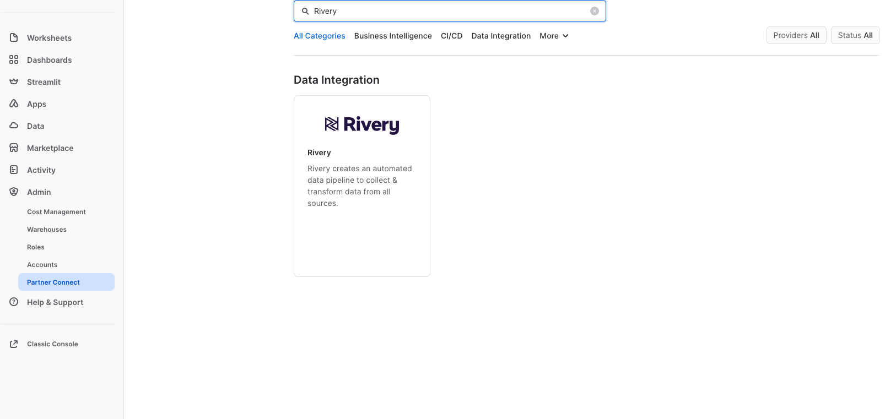
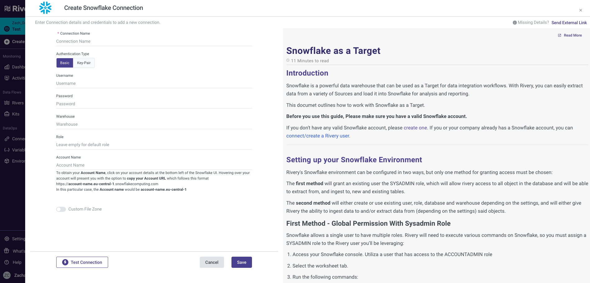
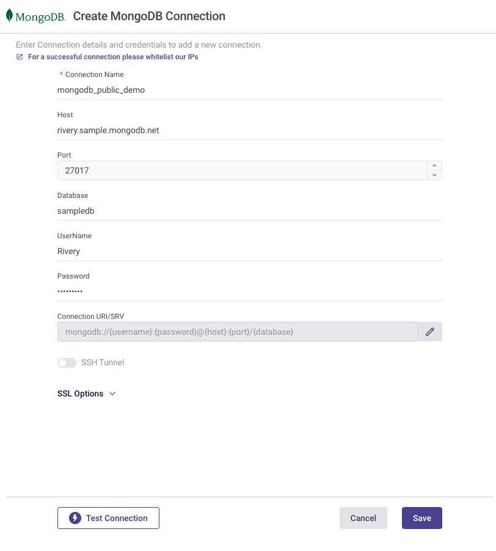
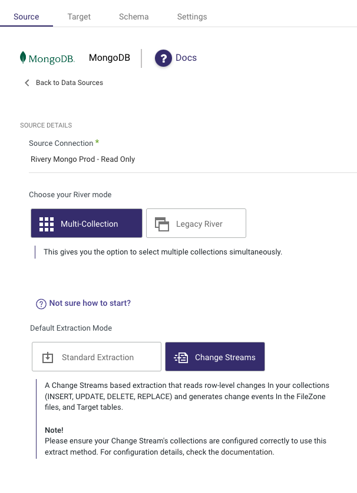
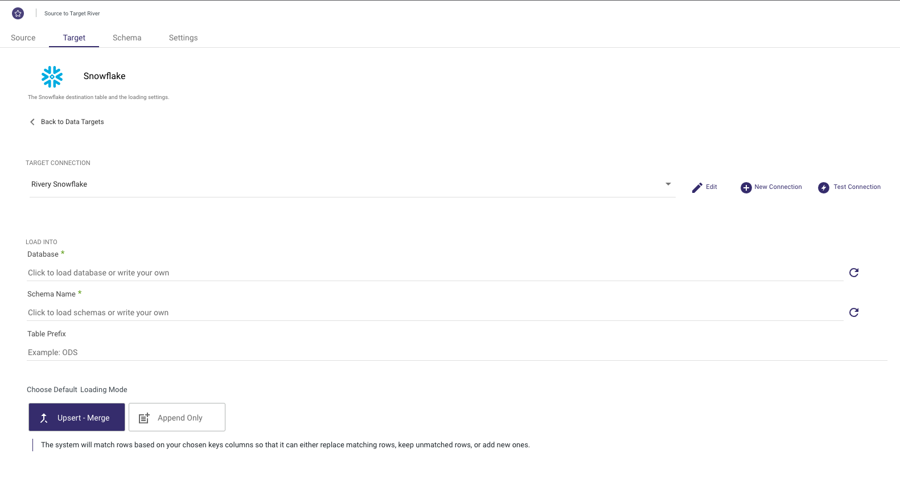
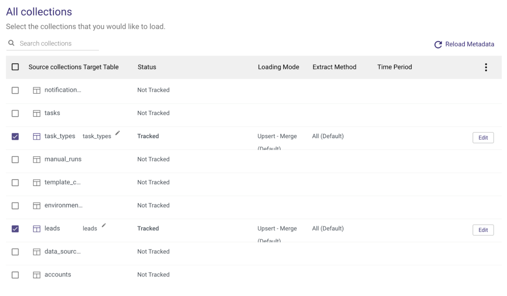
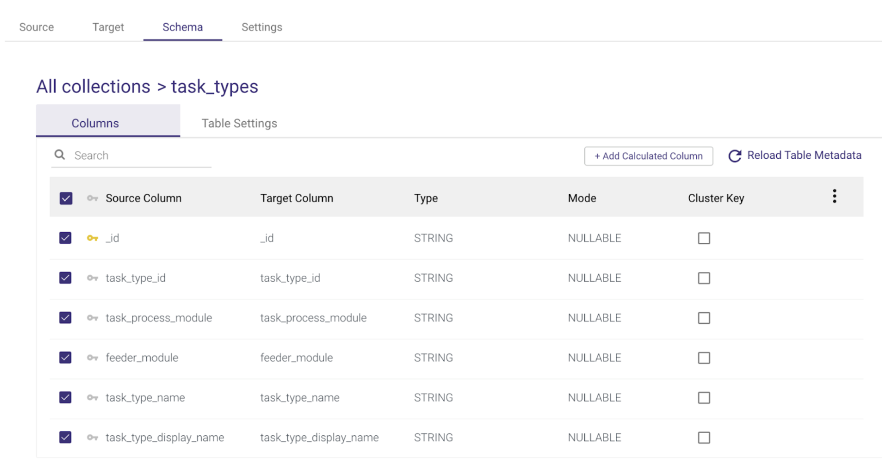
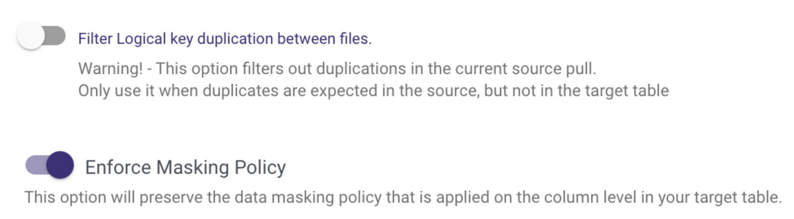
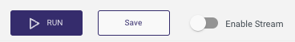
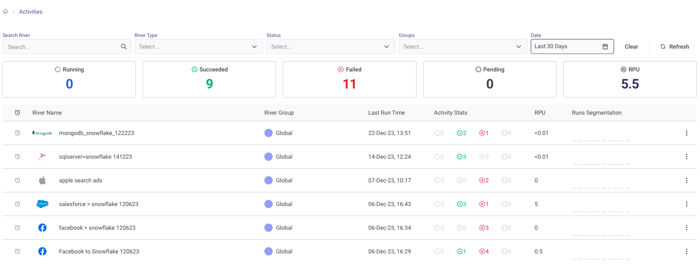

author: Zachary Cie
id: mongodb_to_snowflake_cdc_data_replication_with_rivery
summary: MongoDB to Snowflake CDC Data Replication with Rivery
categories: data-engineering,architecture-patterns,solution-examples,partner-integrations
environments: web
status: Published
feedback link: https://github.com/Snowflake-Labs/sfguides/issues
tags: Data Engineering

# MongoDB to Snowflake CDC Data Replication with Rivery
<!-- ------------------------ -->

## Overview
Duration: 5

The ability to move MongoDB data into a Snowflake Data Warehouse is key to enabling meaningful analytics using a proper SQL interface.

MongoDB addresses specific use cases where developers are building scalable applications with evolving data schemas. It is often used to host modern applications' operational data, where data storage and access patterns are highly optimized for fast write and retrieval, and many other factors like the availability and durability of data. To enable that functionality, MongoDB has its own recommended data model and access patterns which are not always as flexible as standard SQL for analytics purposes.

While coming to analyzing the data, most users prefer a system with a proper SQL interface as almost all analysts are familiar with SQL and almost all existing reporting or visualization tools require a SQL interface to extract data.

This is one of the key reasons that generate demand for replicating MongoDB data into a Snowflake data warehouse where data can be easily analyzed with proper SQL support. Other operational but relational databases such as SQL Server or PostgreSQL are sometimes used to store both transactional data and reporting data (in a separate schema) fulfilling the role of the data warehouse as well up to a certain limit. However with MongoDB's NoSQL schemaless nature, very early on it becomes important to move the data to Snowflake for meaningful analysis where data can not only be analyzed via SQL but also easily combined and modeled with other data sources. This type of analytics is crucial for application developers and product teams as they try to understand the usage patterns of their applications and how those could be improved to increase user satisfaction and conversion rates.

For many organizations using MongoDB to store critical information such as their own product usage, it becomes increasingly important to get this data replicated in a near-real-time fashion. [Change Data Capture](https://rivery.io/blog/what-is-change-data-capture-cdc/) (CDC) is a design pattern to determine, track, capture, and deliver changes made to transactional databases such as MongoDB. CDC is an extremely efficient method to enable near real-time data replication to ensure analytics are done on fresh data. Other benefits of CDC include a reduced load on the operational database engine as well as the ability to replicate deleted records that cannot be replicated using standard batch SQL extraction methods.

Given this need, we'll use Rivery's platform to rapidly build a data pipeline to continuously migrate data from MongoDB to Snowflake. The primary method demonstrated in this quickstart is using MongoDB Change Streams - the MongoDB capability that powers CDC for MongoDB. If you'd like to move MongoDB data to Snowflake using SQL-based extractions, that option is possible as well and will be pointed out where applicable.

### Prerequisites:
-   Access to a [Snowflake Account](https://signup.snowflake.com/)
-   Access to a MongoDB database. You can either:
	-   Use a [MongoDB trial](https://www.mongodb.com/docs/cloud-manager/tutorial/getting-started/)
	-   Use your own MongoDB database

### What You'll Learn:
In this guide, you will learn how to set up a data pipeline that migrates MongoDB data to Snowflake using CDC Data Replication in Rivery’s SaaS ELT Platform. In this process, you will learn:
- How to use Snowflake partner connect to launch a Rivery account
- How to create a source to target data pipeline to load any data source into Snowflake
- How to configure standard SQL extraction or CDC database data replication into Snowflake
- How to enforce your Snowflake masking policy on ingested data 
- How to automate data source to snowflake data pipeline execution and track the pipeline current status and overall performance 

<!-- ------------------------ -->
## Setup a Rivery Account
Duration: 2

**If you already have a Rivery account you can skip this step.  
  
The easiest way to start a Rivery account with an established connection to your Snowflake account is to utilize Snowflake’s Partner Connect. Within Snowsite this can be found under Admin > Partner Connect > Search for Rivery.

****

This will set up both your Rivery account and Snowflake Target connection within Rivery.  
  
If you’d like to set up a Rivery account separately, you can do so by navigating to [Rivery’s website](https://rivery.io/) and clicking [‘Start for Free’](https://rivery.io/free-trial/). You can also use [this link](https://docs.rivery.io/docs/setting-up-a-rivery-account) to find more information.**
<!-- END -->

<!-- ------------------------ -->
## Configure Snowflake Target Connection
Duration: 5

**If you’ve utilized Snowflake’s Partner Connect to create your Rivery account you can skip to Step 4.  
  
You can configure your Snowflake connection in Rivery. This will be needed later on as we point our MongoDB data (our Source) into Snowflake (our Target). Navigate to your [Rivery account](https://console.rivery.io/). From here, you can go to Connections > New Connection > Snowflake, fill in the connection details, and test the connection. More information can be found [here](https://docs.rivery.io/docs/snowflake-as-a-target).  
  
****
<!-- END -->

<!-- ------------------------ -->
## Configure MongoDB Source Connection
Duration: 8

To configure Source Connection within Rivery, you’ll want to navigate to your [Rivery account](https://console.rivery.io/). From here, you can go to Connections > New Connection > MongoDB, fill in the connection details, and test the connection. More information can be found [here](https://docs.rivery.io/docs/create-a-connection).
 
Note Rivery offers a few different methods to ensure a secured connection to MongoDB including SSH, Reverse SSH, VPN, AWS PrivateLink, and Azure Private Link. If you are using a trial instance of MongoDB, it may be sufficient to only [whitelist Rivery’s IPs](https://docs.rivery.io/docs/rivery-whitelist-ips?_gl=1*1txi7y0*_ga*MTQ1MTMzMDY5My4xNjc1OTQ2NDIz*_ga_6EMVQJWTN6*MTcwMzgyOTg0Mi40NjcuMS4xNzAzODMyMzkxLjI1LjAuMA..). If you are connecting to your own MongoDB instance, you may want to use [one of the methods](https://docs.rivery.io/docs/security) mentioned above per your organization's preferences.  

### Configure MongoDB for Change Streams

If you are using MongoDB versions 4.0 or 4.1 you will need to make sure your MongoDB instance “Read Preference” is set to Primary as detailed [here](https://www.mongodb.com/docs/manual/core/read-preference/). If you are using version 4.2 or above this step isn’t required.
    
Note only versions 4.0 and higher of MongoDB are supported by Rivery for [CDC via Change Streams](https://docs.rivery.io/docs/mongo-db-change-streams-overview). If you have an older version of MongoDB or you don’t want to use Change Streams you can still replicate your data using Standard Extraction (SQL-based). In that case, choose Standard Extraction instead of Change Streams under step 5.

<!-- END -->
<!-- ------------------------ -->
## Set the Pipeline Source
Duration: 7

Once your connections are set up, you’ll want to create your replication data pipeline (River). On the navigation menu, click on Create River > Source to Target River.

From here, you’ll want to select MongoDB as your Source.

Once selected, you can then select your created MongoDB connection from the Source Connection drop-down.

You can also add additional configurations like options to run ‘Multi-Collection’ (Multi Table) or ‘Legacy River’ (Single Table). You’ll want to then select ‘Change Streams’ as your Default Extraction Mode.  
  
As mentioned above, you can also use ‘Standard Extraction’ if you’ve decided to not enable ‘Change Streams’.

<!--END--> 

<!-- ------------------------ -->
## Set the Pipeline Target
Duration: 3

Click on the ‘Target’ tab to configure your Target.  
      
Select Snowflake from the list of sources and select your Snowflake connection from the Target Connection Dropdown.  
      
  Set the Database, Schema Name, Table Prefix, and Loading Mode in which you’d like to load your data.  
 ****     
These will be the default values for each of the collections you select in the next step.  
  
Rivery supports loading your data via 3 different modes including [Upsert-Merge](https://docs.rivery.io/docs/snowflake-upsert-merge-loading-mode-options), Append, and Overwrite.

<!-- END -->

<!--------------->
## Set the Pipeline Target Schema
Duration: 5

Clicking on the Schema tab you’ll be able to select the specific collections that you want to extract/load.  
      
This can be done by checking the box on the left-hand side of the collection name or by selecting the box next to ‘Source collections’ to select all.
    

  
  
  

You can also configure each of the Target Table names and additional table settings by selecting the table name and navigating between the Columns and Table Settings tabs.

  
  
  
  
Specifically, under the Table Settings tab, you will find Advanced Options to filter logical key duplication and enforce a [masking policy](https://docs.snowflake.com/en/user-guide/security-column-ddm-intro) if you want to respect a data masking policy already defined in Snowflake.

  
<!-- END -->

<!--------------------> 
## Schedule and Run the Pipeline
Duration: 3

Once your setup is complete you can click on the Enable Stream toggle.

  

  

This will make sure that you have everything set up and will give you the option to Schedule your River run.

If you choose Standard Extraction under step 5, you can schedule your pipeline under the Settings tab.

Regardless of your replication method, under the Settings tab, you can add any additional alerts. Lastly, all you have to do is save your River and click Run to execute it for the first time!

<!-- END -->

<!--------------------> 
## Monitoring Your Pipeline
Duration: 2

You can then monitor the River run from the Activities page via the navigation menu or by clicking on the River Activities icon on the right-hand side.  
      
 Clicking on any of the Pipelines will also give you granular breakdowns of each of the pipeline runs and tables.      
 
<!-- END -->

<!--------------------> 
## Conclusion

Congratulations! You’ve now configured a MongoDB to Snowflake data migration pipeline. Depending on your configuration, this may be a one-time extract or schedule to run at a regular interval using CDC or standard SQL extraction. This pipeline should make sure you always get fresh MongoDB data in Snowflake with little effort to set up and code a data pipeline. 

We would love your feedback on this QuickStart Guide! Please submit your feedback using this Feedback [Form](https://docs.google.com/forms/d/e/1FAIpQLSdiYVIB6X-pge0FL2q1xNIXd1lo3qI947K6D42F3NBAQEcHtA/viewform?usp=sf_link).

What You Learned
- How to use Snowflake partner connect to launch a Rivery account
- How to create a source to target data pipeline to load MongoDB data into Snowflake
- How to configure standard SQL extraction vs. CDC for MongoDB data replication into Snowflake
- How to enforce your Snowflake masking policy on ingested data 
- How to automate MongoDB to snowflake data pipeline execution and track the pipeline current status and overall performance

Related Resources
- [MongoDB Change Stream Overview](https://docs.rivery.io/docs/mongo-db-change-streams-overview)
- [How to transform data within Snowflake using Rivery](https://docs.rivery.io/docs/logic-overview)
- [How to Reverse ETL Snowflake data using Rivery](https://rivery.io/product/reverse-etl/)

Get up to speed on other [Rivery and Snowflake integrations](https://rivery.io/partners-snowflake/) to simplify your data delivery.  
<!-- END -->	