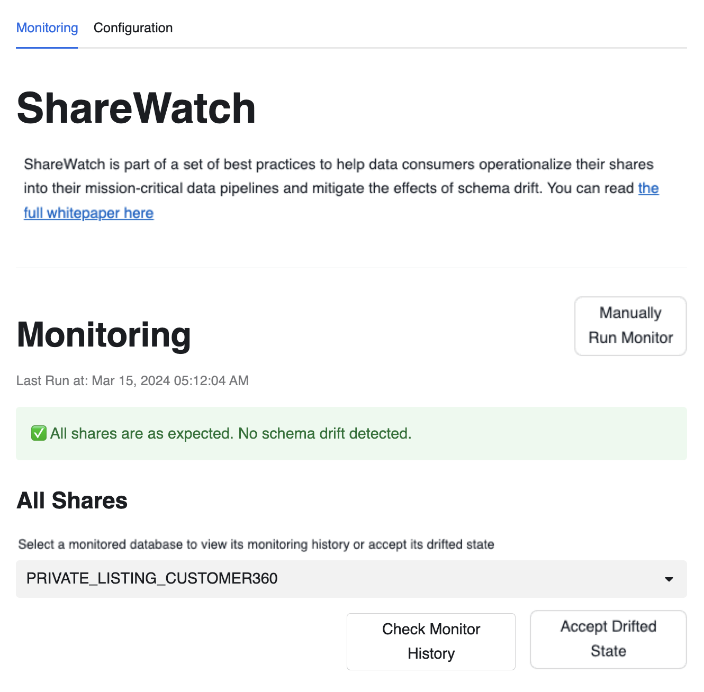
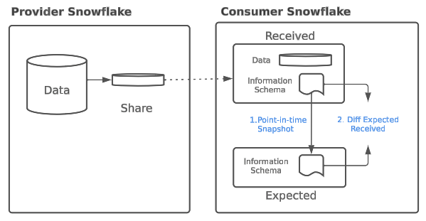
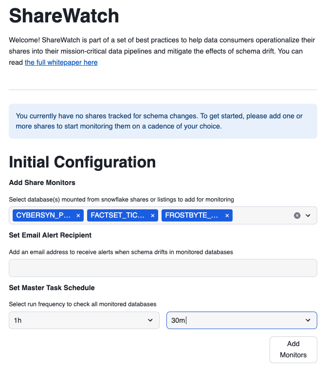
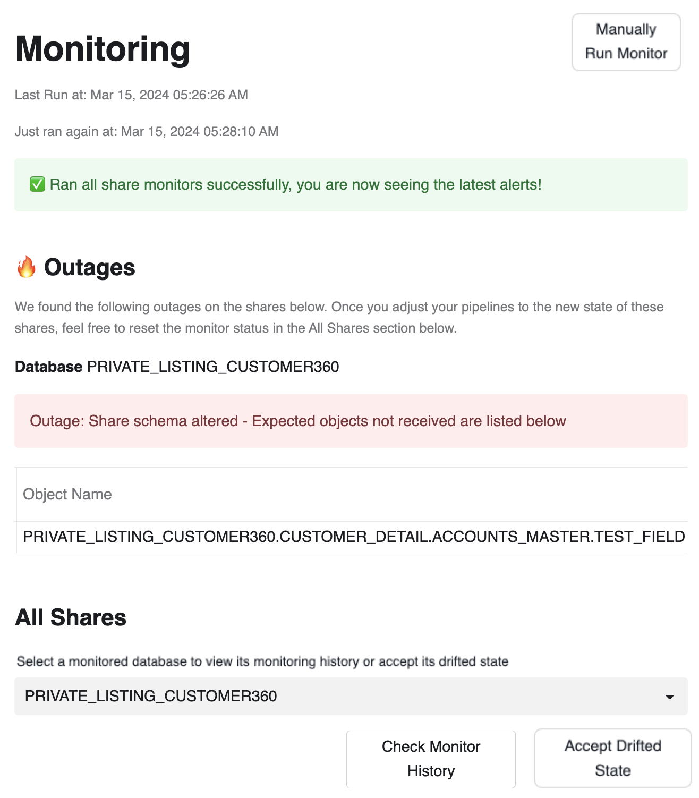
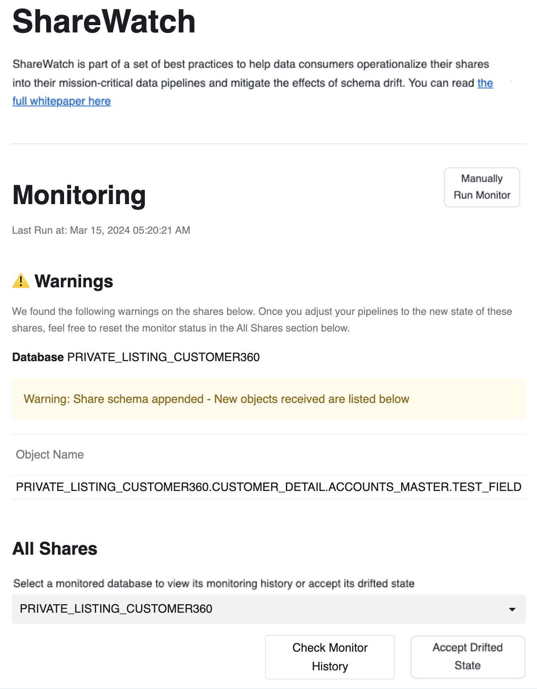
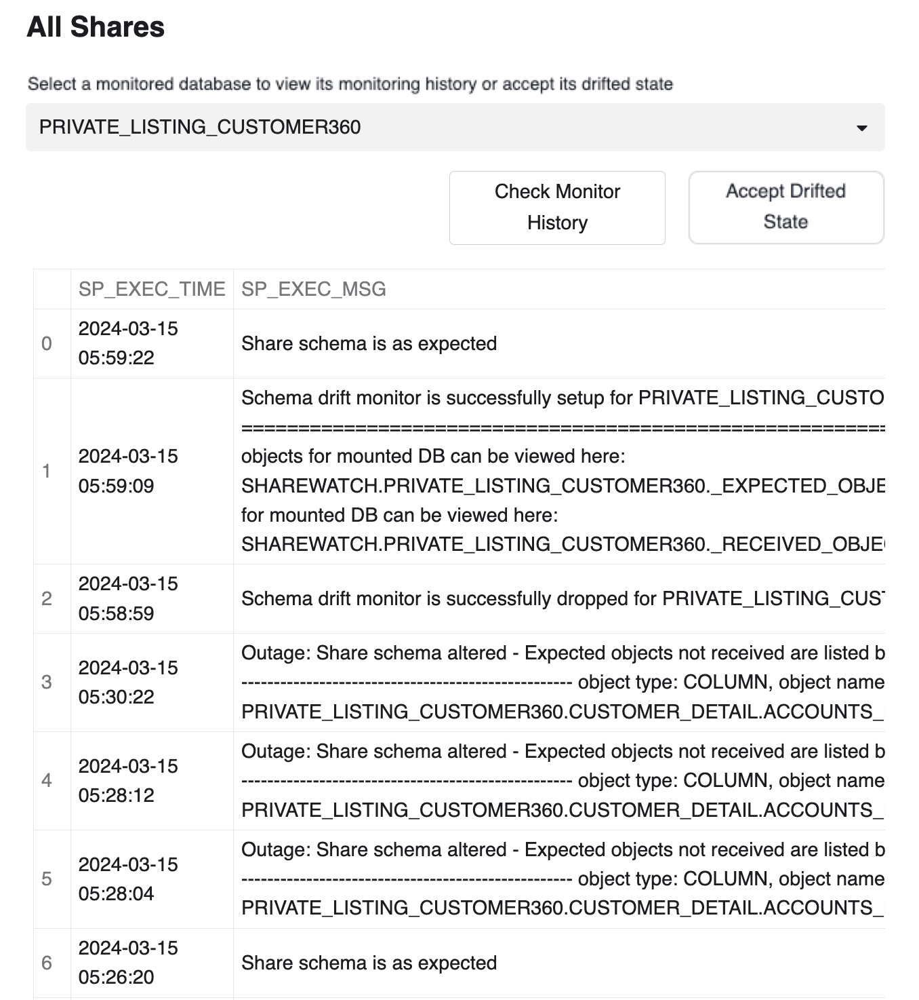
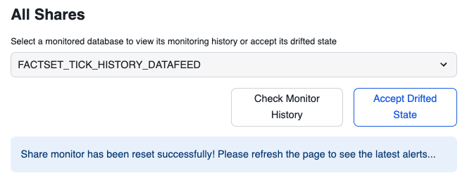
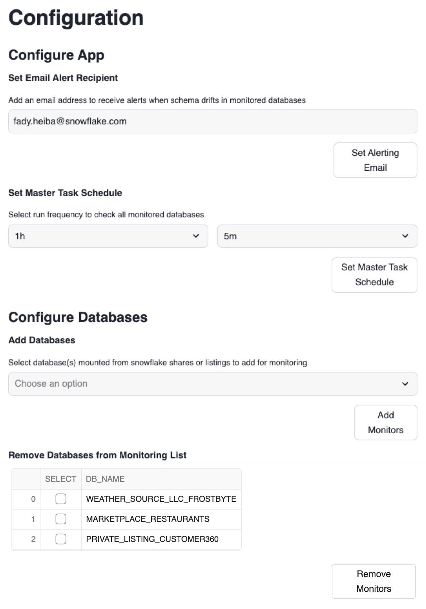

author: Fady Heiba, Amit Gupta
id: monitor-schema-drift-in-data-shares-with-sharewatch
categories: snowflake-site:taxonomy/solution-center/certification/quickstart, snowflake-site:taxonomy/product/data-engineering
language: en
summary: Step-by-step to set up Sharewatch ( a schema drift monitor for data shares) 
environments: web
status: Published
feedback link: https://github.com/Snowflake-Labs/sfguides/issues
fork repo link: https://github.com/Snowflake-Labs/sfguide-monitor-schema-drift-in-data-shares-with-sharewatch

# Monitor Schema Drift in Data Shares with Sharewatch
<!-- ------------------------ -->
## Overview

ShareWatch is a Streamlit-based application installed on consumers of data share's Snowflake accounts to detect schema drifts in data shares received by these consumers.  ShareWatch triggers notifications based on schema drift detection, which is part of Snowflake's [best practices to operationalize shares](/en/resources/white-paper/data-sharing-best-practices-managing-schema-drift-and-data-change-with-shared-data/), and integrates them in mission-critical data pipelines. The app provides a starting point and can be extended to implemenet other best practices discussed in the whitepaper. 

Schema drift occurs where the structure (schema) of shared data is changed over time by the data provider. ShareWatch detects schema drifts by comparing the expected schema of each share to its current schema, and displaying the state of each share monitored in the app. ShareWatch also sets up a master task that runs all monitors on a schedule and sends email notifications if:
1. Share is in "Warning" State: schema is appended i.e. new schema, object, or attribute is added to the schema. 
2. Share is in "Outage" State: schema is altered i.e. An alter, rename, delete, or revoke command on a schema, object, or attribute is performed

ShareWatch will also tell you which schemas, objects, or attributes are affected so you have a targeted area to explore and make the appropriate fixes in your pipelines. ShareWatch's "Accept Drift" feature allows you to accept changes in a share's schema and make it the new "expected" schema.

See below diagram for details on how ShareWatch detects schema drift 

### Key Features
Share Watch has 2 sections
1) Configuration section - Set up schema drift monitoring on databases mounted from shares, set up an email recepient for notifications, and set up frequency at which ShareWatch's task should check for schema drift.
2) Monitoring section - Shows the status of schema drift on databases mounted from shares based on the monitors set up in the Configuration section.

### Prerequisites
- A Snowflake account login with ACCOUNTADMIN role. If you have this role in your environment, you may choose to use it. If not, you will need to 1) [Register for a free trial](https://signup.snowflake.com/?utm_source=snowflake-devrel&utm_medium=developer-guides&utm_cta=developer-guides), 2) Use a different role that has the ability to create database, schema, tables, stages, tasks, streamlit, user-defined functions, and stored procedures OR 3) Use an existing database and schema in which you are able to create the mentioned objects.
- One or more data shares set up from Marketplace or Private Listings ([here's a guide for setting up shares](https://www.youtube.com/watch?v=4ksdOBT1HCw))
- An email address to which schema drift notifications will be sent.
- Github access to download [install scripts](https://github.com/Snowflake-Labs/sfguide-monitor-schema-drift-in-data-shares-with-sharewatch/tree/main)

### What You’ll Learn 
- What is sharewatch
- How to install sharewatch app
- how to setup initial configuration of the app
- how to use sharewatch app to monitor your incoming shares
- how to modify configuration settings of the app

### What You’ll Need 
- A Snowflake account 

### What You’ll Build 
- An streamlit in snowflake app that will monitor schema drifts of the incoming shares in your snowflake account

<!-- ------------------------ -->
## Install ShareWatch

- Create a SQL worksheet in Snowsight and paste the ShareWatch SQL Setup script from sf-samples. [LINK TO SQL SCRIPT](https://github.com/Snowflake-Labs/sfguide-monitor-schema-drift-in-data-shares-with-sharewatch/blob/main/1-install-sp.sql)
  - Select all commands, and run them all. This will set up all the stored procedures used by the ShareWatch app. 

- Create a Streamlit app in Snowsight and replace the starter code it comes with with the ShareWatch Streamlit script. [LINK TO STREAMLIT SCRIPT](https://github.com/Snowflake-Labs/sfguide-monitor-schema-drift-in-data-shares-with-sharewatch/blob/main/2-install-st.py)
  - Choose an appropriate warehouse and a database to set your Snowflake internal stage that would hold your Streamlit's python files.

- Refresh the app after pasting the ShareWatch Streamlit script and (assuming you've already set up the stored procedures from the SQL script), you should now see the Initial Configuration section in your Streamlit app. 
- At this point, you're all set! You can hide the code and start using the Streamlit app as intended, proceeding to the Initial Configuration section.

<!-- ------------------------ -->
## Initial Configuration
- The Initial Configuration section includes 3 pieces to set up:
  - Which shares do you want to set up monitors for? (You can always add/remove shares after this step too in the Configuration section)
  - What email recipient do you want the alerts sent to?
  - What schedule do you want to set up the ShareWatch Task with? 
    - ShareWatch will create the task in a suspended state, assuming you want to start your schedule from the moment you initiate this configuration.
- Once you have the settings above configured to your liking, you can click the Add Shares button.
  - Be careful that this task will initiate a warehouse and could incur costs
  - This will create a database called ShareWatch
    - Utils schema
    - For each monitored database, there will be a corresponding schema in this database that tracks the received (current) state and expected state of the schema

<!-- ------------------------ -->
## Monitoring Shares

### What Triggers Alerts
ShareWatch's monitors are run from two places: either from task based on the schedule you set up or manually from "Manually Run Monitors" button at the top right of the Monitoring section.

When a monitor runs, it will check the expected schema of each share against the current schema of the share. If no changes are found, it will log in the share's history that it was checked at this time and skip to the next one.

If it does find drift within the share's schema, it will trigger one of two warning depending on the type of drift:
1. Share is in "Warning" State: schema is appended i.e. new schema, object, or attribute is added to the schema. 

2. Share is in "Outage" State: schema is altered i.e. An alter, rename, delete, or revoke command on a schema, object, or attribute is performed

ShareWatch will also tell you which schemas, objects, or attributes are affected so you have a targeted area to explore and make the appropriate fixes in your pipelines.

### Share Monitor History
At the bottom of the Monitoring section, you can choose a check a share monitor to check its history, which includes:
- When the share monitor is set up
- When the share monitor is run to check for drift
- When the share monitor is triggered with a Warning
- When the share monitor is triggered with an Outage
- When the share monitor is removed

This history exists in the ShareWatch database and can be accessed from there for any workflows/analytics you'd like to build on top of ShareWatch.

### Remediation
Once a schema has drifted work with the provider to understand the nature of the drift. Once provider due dilligence is done, you can use the "Accept Drifted State" button to accept the new schema of the shared dataset. This button will temporarily remove and re-add the monitor again, essentially resetting its expected state to the new schema structure.

<!-- ------------------------ -->
## Configuration Changes

### Changing Task Schedule
ShareWatch will initially create the task in a suspended state as part of the Initial Configuration stage, assuming you want to start your schedule from the moment you initiate this configuration. 

Here, you can change that task's schedule and it will start that schedule from the moment you changed this configuration as well.

You can always check the current configuration of the task using: describe task sharewatch.util.master_task;

### Removing Share Monitors
This will show you the current shares you already have monitors for. If you want to remove any of them to reduce the number of shares checked every cadence of the task, you can do it from here. This will keep the history of that share if it gets added again.

### Adding Share Monitors
This will show you the current databases based on shares you have in your environment. You can pick any of these shares to add a monitor for, and this share monitor will then be included in any future runs of the master task checking for schema drift in this share's database. If this share was added before as a monitor and then removed, you will also be able to see the history of that share under the Share History section.

<!-- ------------------------ -->
## Conclusion And Resources

Congratulations! You've successfully installed and configured sharewatch app to monitor schema drifts in your incoming shares. 

### What You Learned
- What is sharewatch
- How to install sharewatch app
- how to setup initial configuration of the app
- how to use sharewatch app to monitor your incoming shares
- how to modify configuration settings of the app

### Related Resources
- [Data sharing best practices: managing schema drift and data changes](/en/resources/white-paper/data-sharing-best-practices-managing-schema-drift-and-data-change-with-shared-data/)
- [Getting Started with Streamlit in Snowflake](https://docs.snowflake.com/en/developer-guide/streamlit/getting-started)
- [Sharewatch Code on Github](https://github.com/Snowflake-Labs/sfguide-monitor-schema-drift-in-data-shares-with-sharewatch/tree/main)
