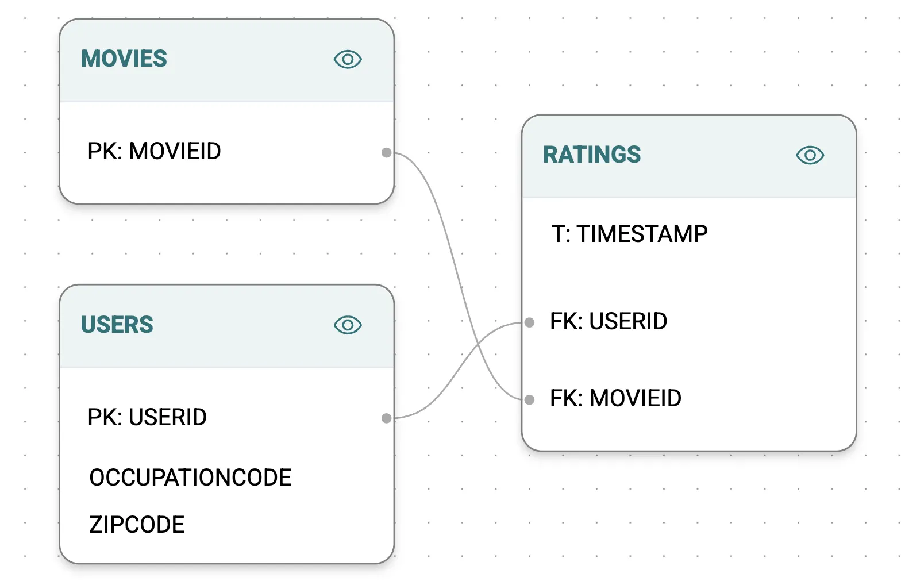
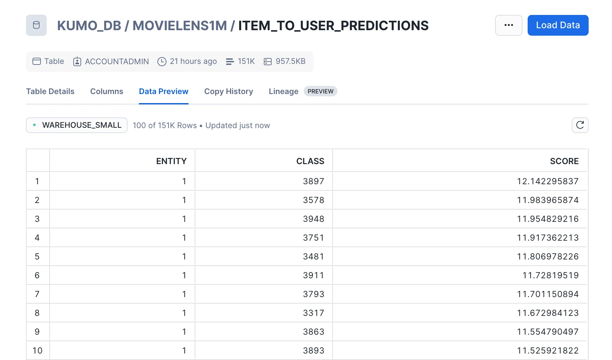
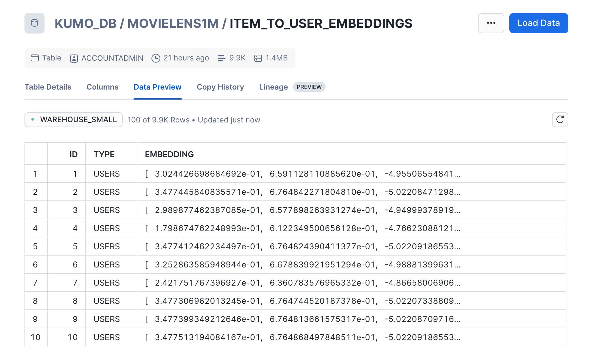
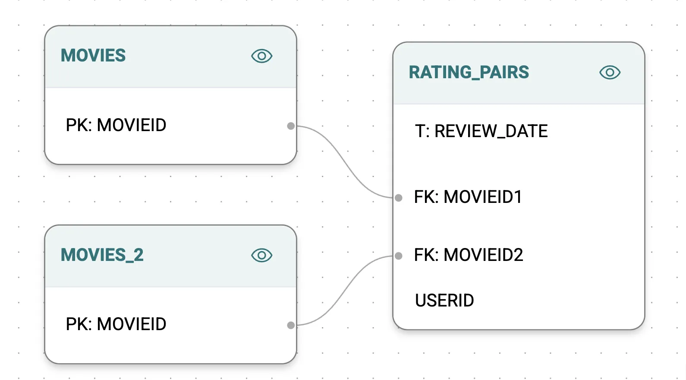
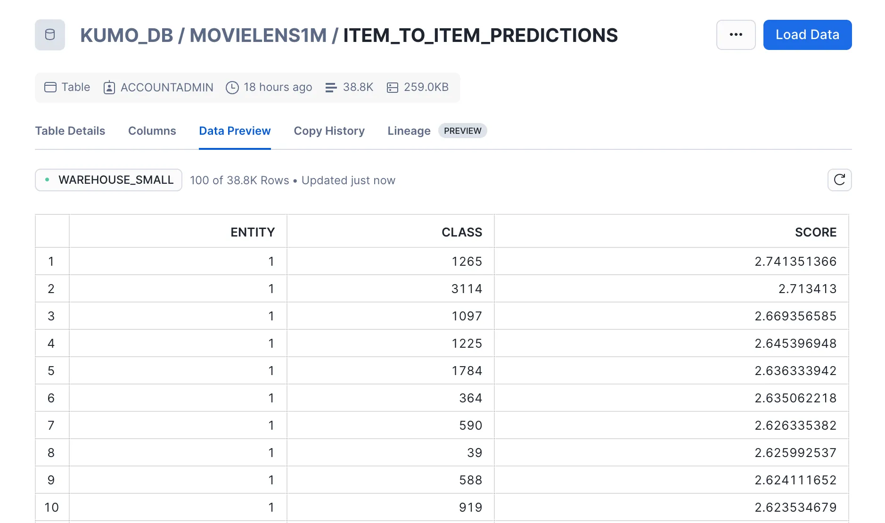
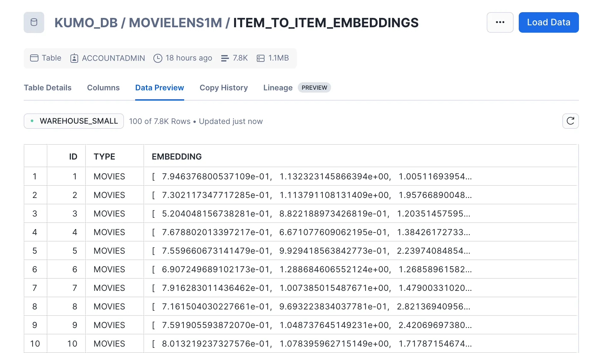

author: Naisha Agarwal, Effy Fang
id: movie-recommendation-chatbot-powered-by-kumo
categories: snowflake-site:taxonomy/solution-center/certification/quickstart, snowflake-site:taxonomy/product/applications-and-collaboration, snowflake-site:taxonomy/snowflake-feature/commercialize, snowflake-site:taxonomy/snowflake-feature/native-apps
language: en
summary: This guide will provide step-by-step details for building a personalized movie recommendation chatbot using Kumo in a Snowflake Native App, CortexAI and Streamlit. 
environments: web
status: Published
feedback link: https://github.com/Snowflake-Labs/sfguides/issues


# Personalized Movie Recommendation Chatbot Powered by Kumo in Snowflake Native App
<!-- ------------------------ -->
## Overview


In this guide, you will learn how to build a personalized movie recommendation chatbot using [Kumo (as a Snowflake Native App](https://app.snowflake.com/marketplace/listing/GZTYZBN5P0/kumo-ai-kumo?search=kumo)), Snowflake’s Cortex Search Service, Cortex AI, and Streamli**t**. This chatbot enhances the streaming experience by providing personalized movie recommendations based on user viewing history and movie relationships.

Specifically, you will learn how to develop a chatbot that can answer the following types of queries:

- **Item-to-User Predictions** – Personalized recommendations based on a user's past viewing history (e.g., *“What should I watch next?”*).
- **Item-to-Item Predictions** – Identifying similar movies based on shared genres, themes, or cast members (e.g., *“Is this movie similar to that one?”*).

By handling both types of queries, the chatbot enhances content discovery, helping users navigate vast streaming libraries more efficiently.

### What is Kumo?

Kumo is an advanced ML platform that leverages [*Graph Neural Networks (GNNs)*](https://kumo.ai/research/graph-neural-networks-gnn/) to deliver predictions directly from your Snowflake relational data. Kumo ML models are powered by a GNN architecture, inspired by several academic papers in recent history. Data scientists simply need to write a [*predictive query*](https://kumo.ai/docs/predictive-query), and then the Kumo platform will automatically craft the proper neural architecture for their data. As a result of this approach, Kumo is able to achieve great predictive performance out of the box, across a wide range of challenging scenarios.

Kumo simplifies the end-to-end ML process by eliminating the need for extensive data preparation, model tuning, and feature engineering, allowing data scientists to focus on generating valuable predictions and insights.

To learn more, please visit [Kumo's documentation](https://docs.kumo.ai/docs/welcome-to-kumo).

### What you will learn

- Storing Kumo-generated movie recommendations in Snowflake
- Setting up Cortex Search Services for Retrieval-Augmented Generation (RAG)
- Using Cortex AI to retrieve relevant movie context and enhance chatbot responses
- Building an interactive Streamlit UI for user interactions

### What you’ll build

You'll create a movie recommendation chatbot built on Snowflake, powered by Kumo predictions, handling both user-to-movie and movie-to-movie queries seamlessly.

### Pre-requisites

- Familiarity with [Snowflake](https://signup.snowflake.com/?utm_source=snowflake-devrel&utm_medium=developer-guides&utm_cta=developer-guides) and a Snowflake account
- A valid Kumo account installed as a [native Snowflake app](https://app.snowflake.com/marketplace/listing/GZTYZBN5P0/kumo-ai-kumo?_fsi=RSY006de&_fsi=RSY006de)
- Familiarity with Kumo and how to run a batch prediction. For a step-by-step guide on a similar use case, check out [this quickstart tutorial](/en/developers/guides/leveraging-kumo-for-smarter-recommendations/), or refer to [Kumo documentation](https://kumo.ai/docs/examples/predictive-query) for more examples.
- The [MovieLens 1M dataset](https://grouplens.org/datasets/movielens/) set up on Snowflake
- Basic understanding of how to do [RAG on Snowflake](https://docs.snowflake.com/en/user-guide/snowflake-cortex/cortex-search/tutorials/cortex-search-tutorial-2-chat)

<aside>
💡

NOTE: If you haven’t already done so, please [follow these instructions](https://docs.kumo.ai/docs/installing-kumo-on-spcs?_fsi=RSY006de&_fsi=RSY006de) to install Kumo as a native Snowflake app. 

</aside>

To improve readability, we modified the movies table by

•	Splitting the title and year into separate columns.

•	Reformatting genres from pipe-separated to comma-separated.

```sql
CREATE OR REPLACE TABLE KUMO_DB.MOVIELENS1M.NEW_MOVIES_TABLE AS
SELECT 
    MOVIEID,
    TRIM(SUBSTR(TITLE, 1, LENGTH(TITLE) - 6)) AS TITLE_ONLY, 
    CAST(SUBSTR(TITLE, LENGTH(TITLE) - 4, 4) AS INT) AS YEAR, 
    REPLACE(GENRE, '|', ',') AS GENRE_MODIFIED 
FROM 
    KUMO_DB.MOVIELENS1M.MOVIES;
```

<!-- ------------------------ -->
## Run Batch Prediction Workflows in Kumo


We will generate movie recommendations using two batch prediction workflows:

1. **item-to-user** predictions (personalized recommendations)
2. **item-to-item** predictions (finding similar movies)

These predictions will be stored in Snowflake and used to power the chatbot.

While the train-validation loop is not covered here, it plays a key role in building reliable link prediction models and refining recommendations. 

### Item-to-User

For the item-to-user batch prediction workflow, your goal is to predict top 25 movies a user is likely to rate (watch) in the next 30 days. Using Kumo, construct a graph where:

- **Nodes** represent users and movies
- **Edges** represent user-movie interactions (ratings)


You can then run the following Predictive Query:

```
PREDICT LIST_DISTINCT(RATINGS.MOVIEID, 0, 30, days)
RANK TOP 25
FOR EACH USERS.USERID
```

After running this Predictive Query and a batch prediction workflow, you’ll get two outputs:

- **Predictions:** Top 25 movie recommendations per user
- **Embeddings:** Feature representations for each user and movie

These outputs can be exported into two Snowflake tables directly from Kumo. 





### Item-to-Item

For the item-to-item batch prediction workflow, your goal is to generate the top 10 similar movies for each movie by analyzing co-occurrence patterns (movies rated by the same user on the same day).

First, create a co-occurrence table in Snowflake:

```sql
CREATE TABLE KUMO_DB.MOVIELENS1M.RATING_PAIRS AS
SELECT
  A.USERID,
  A.MOVIEID AS MOVIEID1,
  A.RATING AS RATING1,
  B.MOVIEID AS MOVIEID2,
  B.RATING AS RATING2,
  CAST(A.TIMESTAMP AS DATE) AS REVIEW_DATE
FROM
  KUMO_DB.MOVIELENS1M.RATINGS A
JOIN
  KUMO_DB.MOVIELENS1M.RATINGS B
ON
  A.USERID = B.USERID -- Same user
  AND CAST(A.TIMESTAMP AS DATE) = CAST(B.TIMESTAMP AS DATE) -- Same date
  AND A.MOVIEID < B.MOVIEID -- To avoid duplicates and self-pairs
```

Using this table and two copies of the Movies table, construct a graph connecting related movies.



You can then run the following Predictive Query:

```
PREDICT LIST_DISTINCT(RATING_PAIRS.MOVIEID2, 0, 30)
RANK TOP 10
FOR EACH MOVIES.MOVIEID
```

After running this Predictive Query and obtaining a batch prediction workflow, you will get two outputs:

- **Predictions:** Top 10 movie predictions for each movie in the left hand side table over the next 30 days
- **Embeddings:** Two sets of movie embeddings for both the left hand side and right hand side tables

Just as in the item to user workflow, these results can be exported to two Snowflake tables directly from Kumo. 





<!-- ------------------------ -->

## Store Predictions in Snowflake


At this stage, you should have four tables stored in Snowflake: item-to-user predictions, item-to-user embeddings, item-to-item predictions, and item-to-item embeddings. You also have the original movies and users tables from the MovieLens dataset that includes information about the movies and users themselves. In this demo, you will mainly be focusing on the movies, users, and the two predictions tables.

In order to achieve the best search results, you will need to restructure our tables. The following walks through the data transformations applied on these tables.

### User Table

The original Users table contains multiple columns, such as age group, occupation code, etc. To simplify searches, you will consolidate this information into a single table with two columns: USER_ID and USER_INFO. The USER_INFO column will combine details from the original columns into a single descriptive entry.

For instance, for an entry like this on the original customer table:

```
*{“USERID“: 1, “GENDER“:”F", "AGEGROUP":1, “OCCUPATIONCODE“:10, "ZIPCODE": 48067}*
```

The corresponding entry in the new table would be:

```
*{"USER_ID":1,"USER_INFO":"Customer with ID 1 is a female. They are uner 18 years old. Their occupation is K-12 student. Their zip code is '48067'"}*
```

Use the following SQL command on a Snowflake worksheet to perform this transformation:

```sql
CREATE OR REPLACE TABLE KUMO_CHATBOT.PUBLIC.USER_INFO AS
SELECT 
    USERID AS USER_ID,
    CONCAT(
        'Customer with ID ', USERID, ' is a ',
        CASE 
            WHEN GENDER = 'M' THEN 'male'
            WHEN GENDER = 'F' THEN 'female'
            ELSE 'unknown'
        END,
        '. They are ',
        CASE 
            WHEN AGEGROUP = 1 THEN 'under 18 years old'
            WHEN AGEGROUP = 18 THEN '18-24 years old'
            WHEN AGEGROUP = 25 THEN '25-34 years old'
            WHEN AGEGROUP = 35 THEN '35-44 years old'
            WHEN AGEGROUP = 45 THEN '45-49 years old'
            WHEN AGEGROUP = 50 THEN '50-55 years old'
            WHEN AGEGROUP = 56 THEN '56+ years old'
            ELSE 'of an unknown age group'
        END,
        '. Their occupation is ',
        CASE 
            WHEN OCCUPATIONCODE = 0 THEN 'other or not specified'
            WHEN OCCUPATIONCODE = 1 THEN 'academic/educator'
            WHEN OCCUPATIONCODE = 2 THEN 'artist'
            WHEN OCCUPATIONCODE = 3 THEN 'clerical/admin'
            WHEN OCCUPATIONCODE = 4 THEN 'college/grad student'
            WHEN OCCUPATIONCODE = 5 THEN 'customer service'
            WHEN OCCUPATIONCODE = 6 THEN 'doctor/health care'
            WHEN OCCUPATIONCODE = 7 THEN 'executive/managerial'
            WHEN OCCUPATIONCODE = 8 THEN 'farmer'
            WHEN OCCUPATIONCODE = 9 THEN 'homemaker'
            WHEN OCCUPATIONCODE = 10 THEN 'K-12 student'
            WHEN OCCUPATIONCODE = 11 THEN 'lawyer'
            WHEN OCCUPATIONCODE = 12 THEN 'programmer'
            WHEN OCCUPATIONCODE = 13 THEN 'retired'
            WHEN OCCUPATIONCODE = 14 THEN 'sales/marketing'
            WHEN OCCUPATIONCODE = 15 THEN 'scientist'
            WHEN OCCUPATIONCODE = 16 THEN 'self-employed'
            WHEN OCCUPATIONCODE = 17 THEN 'technician/engineer'
            WHEN OCCUPATIONCODE = 18 THEN 'tradesman/craftsman'
            WHEN OCCUPATIONCODE = 19 THEN 'unemployed'
            WHEN OCCUPATIONCODE = 20 THEN 'writer'
            ELSE 'unknown'
        END,
        '. Their zip code is ''', ZIPCODE, '''.'
    ) AS USER_INFO
FROM 
    KUMO_DB.MOVIELENS1M.USERS;
```

The occupation code and age group mapping are describe in the README file of the MovieLens 1M dataset. 

### Movie Table

The original Movies table contains multiple columns, such as Title and Genre. Similar to what you did with the customer table, consolidate this information into two columns: MOVIE_ID and MOVIE_INFO.  

For instance, considering the following movie:

```
*{“MOVIEID“: 1, “TITLE“:”Toy Story", "YEAR":1995, “GENRE“:“Animation, Children's, Comedy“}*
```

The corresponding entry in the new table would be:

```
*{“MOVIE_ID”: 1, “MOVIE_INFO”: "Movie 1 is called 'Toy Story'. It is released in 1995. It is falls under Animation, Children's, Comedy genres"}*
```

Use the following SQL command on a Snowflake worksheet to perform this transformation:

```sql
CREATE OR REPLACE TABLE KUMO_CHATBOT.PUBLIC.MOVIE_INFO AS
SELECT 
    MOVIEID AS MOVIE_ID,
    CONCAT(
        'Movie ', MOVIEID, ' is called ''', TITLE_ONLY, '''. It was released in ', YEAR, 
        '. It falls under ', 
        GENRE_MODIFIED, 
        CASE 
            WHEN LENGTH(GENRE_MODIFIED) - LENGTH(REPLACE(GENRE_MODIFIED, ',', '')) = 0 THEN ' genre.'
            ELSE ' genres.'
        END
    ) AS MOVIE_INFO
FROM 
    KUMO_DB.MOVIELENS1M.NEW_MOVIES_TABLE;
```

### Item-to-User Predictions Table

In a similar vein to the users and movies tables, you will structure this table into two columns: USER_ID and a PREDICTION_DETAILS 

A sample entry would look as follows:

```
*{"USER_ID":1,"PREDICTION_DETAILS": "The 1st prediction for user 1 is movie 3897 with score 12.142295837. Movie 3897 is called 'Almost Famous'. It was released in 2000. It falls under Comedy,Drama genres. The 2nd prediction for user 1 is movie 3578 with score 11.983965874. Movie 3578 is called 'Gladiator'. It was released in 2000. It falls under Action, ... The 25th prediction for user 1 is ..."}*
```

Use the following SQL command on a Snowflake worksheet to perform this transformation:

```sql
CREATE OR REPLACE TABLE KUMO_CHATBOT.PUBLIC.MOVIE2USER_PREDICTION_WITHDETAILS AS(
WITH RankedPredictions AS (
    SELECT 
        p.ENTITY AS USER_ID,
        ROW_NUMBER() OVER (PARTITION BY p.ENTITY ORDER BY p.SCORE DESC) AS PREDICTION_RANK,
        p.CLASS AS MOVIE_ID,
        p.SCORE,
        m.MOVIE_INFO
    FROM KUMO_DB.MOVIELENS1M.ITEM_TO_USER_PREDICTIONS p
    JOIN KUMO_CHATBOT.PUBLIC.MOVIE_INFO m ON p.CLASS = m.MOVIE_ID
),
PredictionDetails AS (
    SELECT 
        USER_ID,
        PREDICTION_RANK,
        CONCAT(
            'The ', 
            CASE 
                WHEN PREDICTION_RANK % 10 = 1 AND PREDICTION_RANK NOT IN (11) THEN PREDICTION_RANK || 'st'
                WHEN PREDICTION_RANK % 10 = 2 AND PREDICTION_RANK NOT IN (12) THEN PREDICTION_RANK || 'nd'
                WHEN PREDICTION_RANK % 10 = 3 AND PREDICTION_RANK NOT IN (13) THEN PREDICTION_RANK || 'rd'
                ELSE PREDICTION_RANK || 'th'
            END,
            ' prediction for user ', USER_ID, 
            ' is movie ', MOVIE_ID, 
            ' with score ', SCORE, '. ', 
            MOVIE_INFO
        ) AS PREDICTION_DETAIL
    FROM RankedPredictions
)
SELECT 
    USER_ID,
    LISTAGG(PREDICTION_DETAIL, ' ') WITHIN GROUP (ORDER BY PREDICTION_RANK) AS PREDICTION_DETAILS
FROM PredictionDetails
GROUP BY USER_ID
ORDER BY USER_ID
)
```

### Item-to-Item Predictions Table

You will structure this table into two columns as well: MOVIE_ID and a PREDICTION_DETAILS. 

A sample entry for this table would look as follows:

```
*{"MOVIE_ID":1,"PREDICTIONS":"The 1st prediction for movie 1 is movie 1265 with score 2.741351366. Movie 1265 is called 'Groundhog Day'. It was released in 1993. It falls under Comedy,Romance genres. The 2nd prediction for movie 1 is movie 3114 with score 2.713413... The 10th prediction for movie 1 is ..."}* 
```

Use the following SQL command on a Snowflake worksheet to perform this transformation:

```sql
CREATE OR REPLACE TABLE KUMO_CHATBOT.PUBLIC.MOVIE2MOVIE_PREDICTION_WITHDETAILS AS(
WITH RankedPredictions AS (
    SELECT 
        p.ENTITY AS MOVIE_ID,
        ROW_NUMBER() OVER (PARTITION BY p.ENTITY ORDER BY p.SCORE DESC) AS PREDICTION_RANK,
        p.CLASS AS PREDICTED_MOVIE_ID,
        p.SCORE,
        m.MOVIE_INFO
    FROM 
        KUMO_DB.MOVIELENS1M.ITEM_TO_ITEM_PREDICTIONS p
    JOIN 
        KUMO_CHATBOT.PUBLIC.MOVIE_INFO m 
    ON 
        p.CLASS = m.MOVIE_ID
),
PredictionDetails AS (
    SELECT 
        MOVIE_ID,
        PREDICTION_RANK,
        CONCAT(
            'The ', 
            CASE 
                WHEN PREDICTION_RANK % 10 = 1 AND PREDICTION_RANK NOT IN (11) THEN PREDICTION_RANK || 'st'
                WHEN PREDICTION_RANK % 10 = 2 AND PREDICTION_RANK NOT IN (12) THEN PREDICTION_RANK || 'nd'
                WHEN PREDICTION_RANK % 10 = 3 AND PREDICTION_RANK NOT IN (13) THEN PREDICTION_RANK || 'rd'
                ELSE PREDICTION_RANK || 'th'
            END,
            ' prediction for movie ', MOVIE_ID, 
            ' is movie ', PREDICTED_MOVIE_ID, 
            ' with score ', SCORE, '. ', 
            MOVIE_INFO) AS PREDICTION_DETAIL
    FROM RankedPredictions
)
SELECT 
    MOVIE_ID,
    LISTAGG(PREDICTION_DETAIL, ' ') WITHIN GROUP (ORDER BY PREDICTION_RANK) AS PREDICTION_DETAILS
FROM PredictionDetails
GROUP BY MOVIE_ID
ORDER BY MOVIE_ID
)

```
<!-- ------------------------ -->

## Build Cortex Search Services


By now, you have formatted the four tables (user information, movie information, item-to-user predictions and item-to-item predictions) and are now ready to build two Cortex Search Services one for item-to-item queries and the other for item-to-user queries.

### Item-to-User Search Service

The item-to-user search service queries two primary tables: **item-to-user predictions** and **user information**. It retrieves data by user_id from both tables, combines the results, and provides them as a unified output in the search service.

Use the following SQL code on a Snowflake worksheet to set up this service:

```sql
CREATE OR REPLACE CORTEX SEARCH SERVICE KUMO_CHATBOT.PUBLIC.item_to_user_service
ON search_text
ATTRIBUTES ENTITY_TYPE, USER_ID
WAREHOUSE = WAREHOUSE_SMALL
TARGET_LAG = '1 hour'
AS
    -- Search predictions from MOVIE2USER_PREDICTIONS_ENRICHED
    SELECT
        'PREDICTIONS' AS ENTITY_TYPE,
        USER_ID,
        PREDICTIONS AS search_text
    FROM
        KUMO_CHATBOT.PUBLIC.MOVIE2USER_PREDICTION_WITHDETAILS

    UNION ALL

    -- Search customer info from CUSTOMER_INFO table
    SELECT
        'USER_INFO' AS ENTITY_TYPE,
        USER_ID,
        USER_INFO AS search_text
    FROM
        KUMO_CHATBOT.PUBLIC.USER_INFO;
```

The resulting search service enables querying across predictions and user details in a unified manner.

### Item-to-Item Search Service

The item-to-item search service queries two primary tables: **item-to-item predictions** and **movie information**. It retrieves data by movie_id from both tables, combines the results, and provides them as a unified output in the search service.

Use the following SQL code on a Snowflake worksheet to set up this service:

```sql
CREATE OR REPLACE CORTEX SEARCH SERVICE KUMO_CHATBOT.PUBLIC.item_to_item_service
ON search_text
ATTRIBUTES ENTITY_TYPE, MOVIE_ID
WAREHOUSE = WAREHOUSE_SMALL
TARGET_LAG = '1 hour'
AS
    -- Search predictions from ITEM_TO_ITEM_PREDICTIONS_ENRICHED
    SELECT
        'PREDICTIONS' AS ENTITY_TYPE,
        MOVIE_ID,
        PREDICTIONS AS search_text
    FROM
        KUMO_CHATBOT.PUBLIC.MOVIE2MOVIE_PREDICTION_WITHDETAILS

    UNION ALL

    -- Search item information from ITEM_INFO table
    SELECT
        'MOVIE_INFO' AS ENTITY_TYPE,
        MOVIE_ID,
        MOVIE_INFO AS search_text
    FROM
        KUMO_CHATBOT.PUBLIC.MOVIE_INFO;

```

The resulting search services enable querying across predictions and movie details in a unified manner.
<!-- ------------------------ -->

## Classify Response


With the search services registered, the next step is to integrate it with Cortex AI and Streamlit.

The pipeline works as follows:

1. **Classify the user query** as either item-to-item or item-to-user.
2. **Call the appropriate search service** based on the classification.
3. **Generate the final response** using Cortex AI with a Retrieval-Augmented Generation (RAG) approach.

Note Snowflake just released Snowflake Agents in public preview, which provides an agentic approach to orchestration. In this case we'll create the flow ourselves.

Below is the code to classify a given user query:

```python
def classify_query(model, query):
    """
        Generates classification for given query using the specified model.

        Args:
            model(str): The name of the model to use for classification
            prompt(str): The prompt to generate the classification for

        Returns:
            str: The generated classification
    """
    classification_prompt = f"""Please classify the given user query as either item to item
                                or item to user. If classifying as item to item, print "ITEM" with
                                no additional text, and no whitespace. If classifying as item to user, print "CUSTOMER"
                                with no additional text, and no whitespace. If the prompt involves a user id, it will be
                                an item to user prompt. If the prompt involves movie ids, it will be an
                                item to item prompt.
                                Here is the user query: {query}
                                Please return the appropriate classfication.
                                
                            """
    #st.write(classification_prompt)
    return complete(model, classification_prompt)
```

You will use a user-selected model to process and classify the query with the given prompt. 

Once the classification is determined, the following logic is used to select the corresponding search service and generate a response:

```python
with st.chat_message("assistant", avatar=icons["assistant"]):
            message_placeholder = st.empty()
            question = question.replace("'", "")
            with st.spinner("Thinking..."):
                selected_search = ""
                if classification == "CUSTOMER":
                    selected_search = "ITEM_TO_USER_SERVICE"
                elif classification == "ITEM":
                    selected_search = "ITEM_TO_ITEM_SERVICE"
                elif classification == None:
                    selected_search = None
                generated_response = 
                if classification is None:
                    generated_response = "I could not classify the query. Please try again."
                else:
                    generated_response = complete(
                        st.session_state.model_name, create_prompt(question, selected_search)
                    )
                message_placeholder.markdown(generated_response)

        st.session_state.messages.append(
            {"role": "assistant", "content": generated_response}
        )
```

This logic maps the classification to the appropriate search service and creates a final prompt that incorporates the query context. The final prompt is then passed to the user-selected model to generate the response.

The final prompt is structured as followed:

```python
def create_prompt(user_question, selected_service_name):
    """
    Create a prompt for the language model by combining the user question with context retrieved
    from the cortex search service and chat history (if enabled). Format the prompt according to
    the expected input format of the model.

    Args:
        user_question (str): The user's question to generate a prompt for.

    Returns:
        str: The generated prompt for the language model.
    """

    customer_id = st.session_state.customer_id
    if customer_id:
        user_question = f"[User ID: {customer_id}]{user_question}"

    
    if st.session_state.use_chat_history:
        chat_history = get_chat_history()
        if chat_history != []:
            question_summary = make_chat_history_summary(chat_history, user_question)
            prompt_context = query_cortex_search_service(question_summary, selected_service_name)
        else:
            prompt_context = query_cortex_search_service(user_question, selected_service_name)
    else:
        prompt_context = query_cortex_search_service(user_question, selected_service_name)
        chat_history = ""

    prompt = f"""
            [INST]
            You are a helpful AI chat assistant with RAG capabilities. When a user asks you a question,
            you will also be given context provided between <context> and </context> tags. Use that context
            with the user's chat history provided in the between <chat_history> and </chat_history> tags
            to provide a summary that addresses the user's question. Ensure the answer is coherent, concise,
            and directly relevant to the user's question.

            If the user asks a generic question which cannot be answered with the given context or chat_history,
            just say "I don't know the answer to that question.

            Don't saying things like "according to the provided context".

            <chat_history>
            {chat_history}
            </chat_history>
            <context>
            {prompt_context}
            </context>
            <question>
            {user_question}
            </question>
            [/INST]
            Answer:
        """
    return prompt
```

This function ensures the prompt is well-structured and provides sufficient information from both chat history and context retrieved from the search service, for the model to generate accurate responses.

<!-- ------------------------ -->

## Put it All Together: Streamlit


With the core logic in place, the final step is implementing the user interface using Streamlit. The UI code integrates the classification, search services, and response generation to provide a seamless chat experience.

Below is the code for Streamlit implementation:

```python
import streamlit as st
from snowflake.core import Root  # requires snowflake>=0.8.0
from snowflake.snowpark.context import get_active_session

# Initialize Snowflake session
session = get_active_session()

MODELS = [
    "claude-3-5-sonnet",
    "mistral-large",
    "snowflake-arctic",
    "llama3-70b",
    "llama3-8b",
]

# Initialization functions
def init_messages():
    if st.session_state.clear_conversation or "messages" not in st.session_state:
        st.session_state.messages = []

def init_customer_id():
    if "customer_id" not in st.session_state:
        st.session_state.customer_id = None

def init_service_metadata():
    if "service_metadata" not in st.session_state:
        services = session.sql("SHOW CORTEX SEARCH SERVICES;").collect()
        service_metadata = []
        if services:
            for s in services:
                svc_name = s["name"]
                svc_search_col = session.sql(
                    f"DESC CORTEX SEARCH SERVICE {svc_name};"
                ).collect()[0]["search_column"]
                service_metadata.append(
                    {"name": svc_name, "search_column": svc_search_col}
                )
        st.session_state.service_metadata = service_metadata

def init_config_options():
    st.sidebar.button("Clear conversation", key="clear_conversation")
    st.sidebar.toggle("Debug", key="debug", value=False)
    st.sidebar.toggle("Use chat history", key="use_chat_history", value=True)

    with st.sidebar.expander("Advanced options"):
        st.selectbox("Select model:", MODELS, key="model_name")
        st.number_input(
            "Select number of context chunks",
            value=5,
            key="num_retrieved_chunks",
            min_value=1,
            max_value=10,
        )
        st.number_input(
            "Select number of messages to use in chat history",
            value=5,
            key="num_chat_messages",
            min_value=1,
            max_value=10,
        )

    st.sidebar.expander("Session State").write(st.session_state)

# Add login feature
def add_login_feature():
    with st.sidebar:
        st.header("User Login")
        customer_id = st.text_input(
            "Enter User ID",
            value=st.session_state.customer_id or "",
            placeholder="input ID here"
        )
        if st.button("Log In"):
            if customer_id.strip():
                st.session_state.customer_id = customer_id.strip()
                st.success(f"Logged in as User ID: {st.session_state.customer_id}")
            else:
                st.error("User ID cannot be empty.")
        if st.session_state.customer_id:
            if st.button("Log Out"):
                st.session_state.customer_id = None
                st.info("Logged out.")

def get_chat_history():
    return st.session_state.get("messages", [])

# Generate summary of chat history
def make_chat_history_summary(chat_history, question):
    """
    If chat history exists, generate a summary. Otherwise, return the question as is.
    """
    if not chat_history:
        return question
    
    prompt = f"""
    [INST]
    Based on the chat history below and the current question, generate an extended query incorporating relevant context.
    
    <chat_history>
    {chat_history}
    </chat_history>
    <question>
    {question}
    </question>
    [/INST]
    """
    return complete(st.session_state.model_name, prompt)

# Query cortex search service
def query_cortex_search_service(query, user_id, selected_service_name):
    """
    Query the selected Cortex Search Service with the given query and user ID to retrieve exact matches.
    """
    db, schema = session.get_current_database(), session.get_current_schema()
    cortex_search_service = (
        root.databases[db]
        .schemas[schema]
        .cortex_search_services[selected_service_name]
    )

    if selected_service_name=="ITEM_TO_USER_SERVICE":
        # Since Cortex Search does not support direct filtering, the best approach is:
        # Retrieve a larger number of results 
        # and then Manually filter results to enforce the exact match.
        context_documents = cortex_search_service.search(
            query=query,
            #filters={"USER_ID":int(user_id)},
            columns=["USER_ID", "SEARCH_TEXT"],
            limit=1000 #increase retrieve limit
        )
        # filter down results on user_id
        results = [r for r in context_documents.results if int(r["USER_ID"]) == int(user_id)]
    else:
        context_documents = cortex_search_service.search(
            query=query,
            columns=[],
            limit=st.session_state.num_retrieved_chunks
    )
        results = context_documents.results
    if not context_documents.results:
        return f"No relevant recommendations found for USER_ID {user_id}."

    # Ensure we are getting the correct column to search
    search_col = next(
        (s["search_column"] for s in st.session_state.service_metadata if s["name"] == selected_service_name),
        None
    )
    if not search_col:
        raise ValueError(f"Invalid service name: {selected_service_name}")

    # Combine retrieved context documents into a single string
    context_str = "\n".join(f"Context document {i+1}: {r[search_col]}" for i, r in enumerate(results))

    if not results:
        context_str = f"No relevant recommendations found for USER_ID {user_id}"

    if st.session_state.debug:
        st.sidebar.text_area(f"Retrieved Context for USER_ID {user_id}", context_str, height=500)

    return context_str
    

# Complete using the model
def complete(model, prompt):
    return session.sql("SELECT snowflake.cortex.complete(?,?)", (model, prompt)).collect()[0][0]

# Classify query
def classify_query(model, query):

    classification_prompt = f"""Please classify the given user query as either item to item
                                or item to user. If classifying as item to item, print "ITEM" with
                                no additional text, and no whitespace. If classifying as item to user, print "CUSTOMER"
                                with no additional text, and no whitespace. If the prompt involves a user id, it will be
                                an item to user prompt. If the prompt involves movie ids, it will be an
                                item to item prompt.
                                Here is the user query: {query}
                                Please return the appropriate classfication.
                            """
    return complete(model, classification_prompt).strip()

# Generate prompt for the assistant
def create_prompt(user_question, selected_service_name):
    customer_id = st.session_state.customer_id
    if customer_id:
        user_question = f"[Customer ID: {customer_id}]{user_question}"

    if st.session_state.use_chat_history:
        chat_history = get_chat_history()
        question_summary = make_chat_history_summary(chat_history, user_question) if chat_history else user_question
        prompt_context = query_cortex_search_service(question_summary,customer_id, selected_service_name)
    else:
        prompt_context = query_cortex_search_service(user_question, customer_id,selected_service_name)

    prompt = f"""
            [INST]
            You are a helpful AI chat assistant. When a user asks you a question,
            use the context provided below to answer it concisely and directly.

            <context>{prompt_context}</context>
            <question>{user_question}</question>
            [/INST]
            Answer:
        """
    return prompt

# Main function
def main():
    st.title(":speech_balloon: AI Movie Conceirge Powered by Kumo")

    init_customer_id()
    add_login_feature()
    init_service_metadata()
    init_config_options()
    init_messages()

    icons = {"assistant": "❄️", "user": "👤"}

    for message in st.session_state.messages:
        with st.chat_message(message["role"], avatar=icons[message["role"]]):
            st.markdown(message["content"])

    disable_chat = "service_metadata" not in st.session_state
    if question := st.chat_input("How can I help you today?...", disabled=disable_chat):
        st.session_state.messages.append({"role": "user", "content": question})
        with st.chat_message("user", avatar=icons["user"]):
            st.markdown(question)

        with st.chat_message("assistant", avatar=icons["assistant"]):
            message_placeholder = st.empty()
            with st.spinner("Thinking..."):
                classification = classify_query(st.session_state.model_name, question)
                selected_service = "ITEM_TO_USER_SERVICE" if classification == "CUSTOMER" else "ITEM_TO_ITEM_SERVICE"
                generated_response = complete(
                    st.session_state.model_name, create_prompt(question, selected_service)
                )
                message_placeholder.markdown(generated_response)

        st.session_state.messages.append({"role": "assistant", "content": generated_response})

if __name__ == "__main__":
    session = get_active_session()
    root = Root(session)
    main()
```

Refer to [Snowflake’s tutorial on RAG](https://docs.snowflake.com/en/user-guide/snowflake-cortex/cortex-search/tutorials/cortex-search-tutorial-2-chat) for more information about the other components of this code.

The final user interface looks like:


<!-- ------------------------ -->

## Conclusion and Resources


### Conclusion

We ran two batch prediction workflows on Kumo, prepared the data with necessary preprocessing, created two search services to support a Retrieval-Augmented Generation (RAG) approach, and integrated these components with Cortex AI and Streamlit to build a complete user interface.

By leveraging Kumo, Cortex AI, and Streamlit, we created an AI Movie Concierge that enhances streaming experiences with personalized and contextual recommendations.

### What you learned

- How to generate item-to-item and item-to-user predictions using Kumo
- How to process prediction results, user and movie information to optimize search
- How to build Cortex search services
- How to classify user queries and select the proper search service
- How to build a user interface using Streamlit

### Resources

- [Kumo Documentation](https://docs.kumo.ai/docs/)
- [Installing Kumo on SPCS](https://docs.kumo.ai/docs/installing-kumo-on-spcs)
- [Kumo Native Snowflake App Troubleshooting Guide](https://docs.kumo.ai/docs/troubleshooting-and-support)
- [Predictive Query Tutorial](https://docs.kumo.ai/docs/tutorial)
- [Predictive Query Reference](https://docs.kumo.ai/docs/primary-commands)

If you have any questions, reach out to your Kumo account manager or Snowflake account team!
