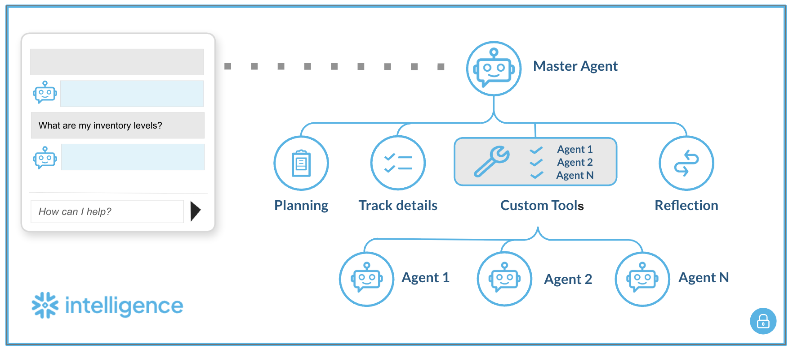
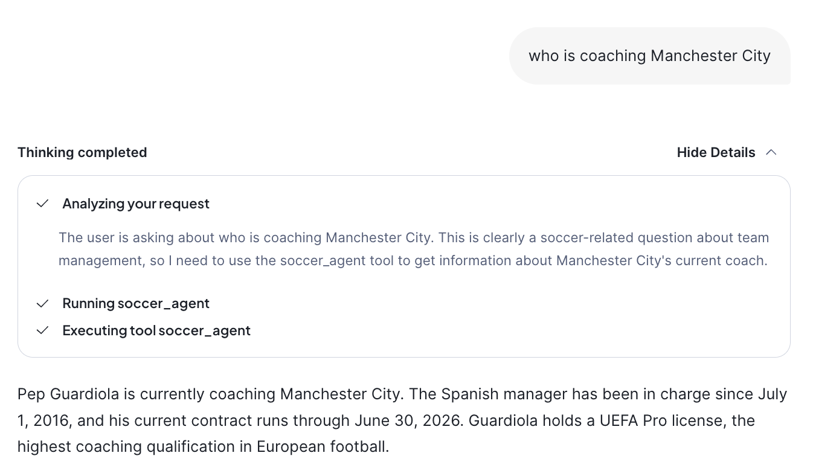

author: Tianxia Jia
id: multi-agent-orchestration-snowflake-intelligence
language: en
summary: This guide describes how to configure a master agent that routes user queries to multiple, specialized Cortex Agents using custom tools. 
environments: web
status: Published
feedback link: https://github.com/Snowflake-Labs/sfguides/issues
fork repo link: https://app.snowflake.com/_deeplink/#/agents
open in snowflake link: https://app.snowflake.com/_deeplink/#/agents


# Multi-Agent Orchestration in Snowflake Intelligence

## Overview 

This guide describes how to configure a master agent that routes user queries to multiple, specialized Cortex Agents using custom tools. *Please note: this approach may evolve as Snowflake adds native support for multi-agent workflows.*

This pattern enables a hierarchical agent system where:
- A **master agent** receives user queries and routes them to the appropriate sub-agent
- **Sub-agents** handle domain-specific tasks (multiple Cortex Agents, each cover one domain or use cases)
- Communication happens via **custom tools** (UDFs)




## Prerequisites

- Snowflake account with **Cortex** enabled  
- **ACCOUNTADMIN** role (for initial setup)  
- **Cortex Agents** already created (your sub-agents)  
- **Personal Access Token (PAT)** from Snowflake UI

## Part 1: Infrastructure Setup

### Step 1: Generate Personal Access Token (PAT)

1. Log into Snowflake UI  
2. Click **User Menu** (bottom left)  
3. Go to **My Profile** → **Authentication**  
4. Click **Generate Token**  
5. Copy and save the token securely

⚠️ PAT tokens expire. Track expiration and regenerate as needed.

### Step 2: Configure and Run Setup Script

Open [`SQL Code`](#sql-code) and replace all placeholders:

| Placeholder | Description | Example |
| :---- | :---- | :---- |
| `<YOUR_ACCOUNT>` | Snowflake account identifier | `ABC12345` |
| `<YOUR_DATABASE>` | Database containing agents | `MY_DATABASE` |
| `<YOUR_SCHEMA>` | Schema containing agents | `AGENTS` |
| `<YOUR_AGENT_NAME>` | Name of sub-agent | `AGENT_1` |
| `<YOUR_ROLE>` | Execution role | `SYSADMIN` |
| `<YOUR_PAT_TOKEN>` | Token from Step 1 | `eyJhbGci...` |

Execute the script steps in order:

```sql
-- Step 1: Network Rule (egress to Snowflake API)
CREATE OR REPLACE NETWORK RULE cortex_agent_egress_rule ...

-- Step 2: Store PAT Token as Secret
CREATE OR REPLACE SECRET cortex_agent_token_secret ...

-- Step 3: External Access Integration
CREATE OR REPLACE EXTERNAL ACCESS INTEGRATION cortex_agent_external_access ...

-- Step 4: Grant Permissions
GRANT READ ON SECRET ... TO ROLE <YOUR_ROLE>;
GRANT USAGE ON INTEGRATION ... TO ROLE <YOUR_ROLE>;

-- Step 5: Create Agent Caller UDF (template)
CREATE OR REPLACE FUNCTION call_cortex_agent(user_query STRING) ...
```

### Step 3: Create a UDF for each sub-agent

Duplicate the UDF template for each sub-agent. **Only change the function name and URL**:

```sql
-- Agent 1
CREATE OR REPLACE FUNCTION ASK_AGENT_1(user_query VARCHAR)
RETURNS STRING
LANGUAGE PYTHON
RUNTIME_VERSION = '3.12'
PACKAGES = ('requests', 'snowflake-snowpark-python')
EXTERNAL_ACCESS_INTEGRATIONS = (cortex_agent_external_access)
SECRETS = ('agent_token' = cortex_agent_token_secret)
HANDLER = 'run_agent'
AS
$$
...
url = "https://<YOUR_ACCOUNT>.snowflakecomputing.com/api/v2/databases/<DB>/schemas/<SCHEMA>/agents/AGENT_1:run"
...
$$;

-- Agent 2
CREATE OR REPLACE FUNCTION ASK_AGENT_2(user_query VARCHAR)
RETURNS STRING
...
url = "https://<YOUR_ACCOUNT>.snowflakecomputing.com/api/v2/databases/<DB>/schemas/<SCHEMA>/agents/AGENT_2:run"
...
$$;
```

## Part 2: Master agent setup (UI)

### Step 4: Create master agent in Snowflake Intelligence

1. Navigate to **AI & ML** → **Agents**  
2. Click **\+ Create Agent**  
3. Name it: `MULTIAGENT` (or your preferred name)

### Step 5: Configure agent description

In the **About** tab, add a description:

```
A multi-domain routing agent that serves as a central interface, automatically delegating user questions to specialized sub-agents based on query intent.
```

### Step 6: Add custom tools

In the **Tools** tab, click **\+ Add** under **Custom tools** for each sub-agent:

| Tool Name | Function Name | Warehouse | Description |
| :---- | :---- | :---- | :---- |
| `AGENT_1` | `ASK_AGENT_1(VARCHAR)` | `<YOUR_WAREHOUSE>` | Provides information on \[domain 1 description\] |
| `AGENT_2` | `ASK_AGENT_2(VARCHAR)` | `<YOUR_WAREHOUSE>` | Provides information on \[domain 2 description\] |

**Example Configuration:**

```
Tool Name:       AGENT_1
Function name:   ASK_AGENT_1(VARCHAR)
Warehouse:       SNOWFLAKE_INTELLIGENCE_WH
Description:     Provides information on [Agent 1's domain]
```

Repeat for each sub-agent you want to add.

### Step 7: Configure orchestration prompt

In the **Orchestration** tab, define routing logic:

```
You are an intelligent router. Analyze the user's inquiry to determine the correct domain:

Agent 1: Use this for questions regarding [domain 1 topics].

Agent 2: Use this for questions regarding [domain 2 topics].

Agent N: Use this for questions regarding [domain N topics].

Rule: Do not attempt to answer the question yourself. You must strictly invoke the appropriate tool to get the answer.

```
**Example with specific domains:**

```
You are an intelligent router. Analyze the user's inquiry to determine the correct domain:

Agent 1 (AGENT_1): Use this for questions regarding sports, matches, player statistics, teams, or game history.

Agent 2 (AGENT_2): Use this for questions regarding business performance, revenue, orders, customer lists, or sales data.

Rule: Do not attempt to answer the question yourself. You must strictly invoke the appropriate tool to get the answer.
```

### Step 8: Configure Access (Access Tab)

Grant access to roles/users who need to use the Master Agent.

## Usage

### Via Master Agent (Recommended)

Query the Master Agent in Snowflake Intelligence UI. It will automatically route to the appropriate sub-agent based on your question.

### Direct Sub-Agent Calls (Testing/Debugging)

```sql
-- Test Agent 1 directly
SELECT ASK_AGENT_1('What is the status of X?');

-- Test Agent 2 directly  
SELECT ASK_AGENT_2('Show me the report for Y');
```


## Examples:



**Important notes:**

- **Visibility:** The "Thinking completed" details only show **Master Agent level** reasoning and tool invocation. Sub-agent internal reasoning, thinking, and tool usage are **not visible** in the response.  
    
- **Latency:** Total response time is impacted by the actual sub-agent query execution. Complex sub-agent queries (e.g., involving multiple tool calls, database queries, or search operations) will increase overall latency.

## Architecture components

| Component | Purpose |
| :---- | :---- |
| **Network Rule** | Allows egress traffic to Snowflake API |
| **Secret** | Securely stores PAT token |
| **External Access Integration** | Bridges network \+ secrets for UDFs |
| **UDF (Python)** | Calls sub-agent REST API, parses SSE response |
| **Master Agent** | Routes queries to sub-agents via custom tools |
| **Custom Tools** | Links Master Agent to sub-agent UDFs |


## API endpoint format

```
https://<ACCOUNT>.snowflakecomputing.com/api/v2/databases/<DATABASE>/schemas/<SCHEMA>/agents/<AGENT_NAME>:run
```


## Troubleshooting

| Error | Cause | Solution |
| :---- | :---- | :---- |
| `Could not read secret` | Missing grants | `GRANT READ ON SECRET ... TO ROLE` |
| `API Error 401` | Invalid/expired token | Regenerate PAT, update secret |
| `API Error 403` | Insufficient permissions | Check role has USAGE on agent |
| `Connection error` | Network rule issue | Verify network rule includes account URL |
| `Agent returned no text` | Agent config issue | Check sub-agent in UI |
| Tool not invoked | Orchestration prompt unclear | Refine routing instructions |


## Security considerations

- **PAT Token Expiration:** Monitor and rotate before expiry  
- **Role-Based Access:** Grant UDF execution only to required roles  
- **Network Rules:** Scope egress to only your account URL  
- **Secret Management:** Never expose tokens in logs


## Resources

- [Snowflake Cortex Agent](https://docs.snowflake.com/en/user-guide/snowflake-cortex/cortex-agents)  
- [External Access Integrations](https://docs.snowflake.com/en/developer-guide/external-network-access/external-network-access-overview)  
- [Snowflake Secrets](https://docs.snowflake.com/en/sql-reference/sql/create-secret)

## SQL Code 

```sql -- ============================================================================*  
-- CORTEX AGENT MULTI-AGENT SETUP (GENERIC TEMPLATE)*  
-- ============================================================================*  
-- This script sets up the infrastructure to call Cortex Agents programmatically*  
-- via UDFs, enabling multi-agent orchestration patterns.*  
--*  
-- PLACEHOLDERS TO REPLACE:*  
--   <YOUR_ACCOUNT>       - Your Snowflake account identifier (e.g., ABC12345)*  
--   <YOUR_DATABASE>      - Database where agents are defined*  
--   <YOUR_SCHEMA>        - Schema where agents are defined*   
--   <YOUR_AGENT_NAME>    - Name of your Cortex Agent*  
--   <YOUR_ROLE>          - Role that will execute the agent UDFs*  
--   <YOUR_PAT_TOKEN>     - Personal Access Token (generated from Snowflake UI)*  
-- ============================================================================*

USE ROLE ACCOUNTADMIN;

-- ============================================================================*  
-- STEP 1: CREATE NETWORK RULE FOR EGRESS TO SNOWFLAKE API*  
-- ============================================================================*  
-- Allows the UDF to make outbound calls to your Snowflake account's REST API.*  
-- Required for the agent to call itself via HTTP.*

CREATE OR REPLACE NETWORK RULE cortex_agent_egress_rule  
 MODE = EGRESS  
 TYPE = HOST_PORT  
 VALUE_LIST = ('<YOUR_ACCOUNT>.snowflakecomputing.com');

-- ============================================================================*  
-- STEP 2: STORE PAT TOKEN AS A SECRET*  
-- ============================================================================*  
-- Securely stores the Personal Access Token.*  
-- Generate PAT from Snowflake UI: User Menu → My Profile → Authentication → Generate Token*  
-- NOTE: PAT tokens have an expiration date. Regenerate and update secret as needed.*

CREATE OR REPLACE SECRET cortex_agent_token_secret  
 TYPE = GENERIC_STRING  
 SECRET_STRING = '<YOUR_PAT_TOKEN>';

-- ============================================================================*  
-- STEP 3: CREATE EXTERNAL ACCESS INTEGRATION*  
-- ============================================================================*  
-- Bridges the network rule and secrets, allowing UDFs to make authenticated*  
-- external calls to the Snowflake API.*

CREATE OR REPLACE EXTERNAL ACCESS INTEGRATION cortex_agent_external_access  
 ALLOWED_NETWORK_RULES = (cortex_agent_egress_rule)  
 ALLOWED_AUTHENTICATION_SECRETS = ALL  
 ENABLED = TRUE;

-- ============================================================================*  
-- STEP 4: GRANT PERMISSIONS TO EXECUTION ROLE*  
-- ============================================================================*  
-- Grant the necessary permissions to the role that will call the agent UDFs.*

GRANT READ ON SECRET cortex_agent_token_secret TO ROLE <YOUR_ROLE>;  
GRANT USAGE ON INTEGRATION cortex_agent_external_access TO ROLE <YOUR_ROLE>;

-- ============================================================================*  
-- STEP 5: CREATE GENERIC AGENT CALLER UDF*  
-- ============================================================================*  
-- Template UDF that calls a Cortex Agent via REST API.*  
-- Duplicate and customize for each agent you want to call.*

CREATE OR REPLACE FUNCTION call_cortex_agent(user_query STRING)  
RETURNS STRING  
LANGUAGE PYTHON  
RUNTIME_VERSION = '3.12'  
PACKAGES = ('requests', 'snowflake-snowpark-python')  
EXTERNAL_ACCESS_INTEGRATIONS = (cortex_agent_external_access)  
SECRETS = ('agent_token' = cortex_agent_token_secret)  
HANDLER = 'run_agent'  
AS  
$$  
import _snowflake  
import requests  
import json

def run_agent(user_query):  
   """  
   Calls a Cortex Agent via REST API and returns the text response.  
   Handles Server-Sent Events (SSE) streaming format.  
   """  
   # Retrieve the stored PAT token  
   try:  
       token = _snowflake.get_generic_secret_string('agent_token')  
   except Exception as e:  
       return f"Error: Could not read secret. Verify grants. Details: {str(e)}"

   # Construct the agent API endpoint  
   # Format: https://<account>.snowflakecomputing.com/api/v2/databases/<db>/schemas/<schema>/agents/<agent>:run  
   url = "https://<YOUR_ACCOUNT>.snowflakecomputing.com/api/v2/databases/<YOUR_DATABASE>/schemas/<YOUR_SCHEMA>/agents/<YOUR_AGENT_NAME>:run"  
    
   headers = {  
       "Authorization": f"Bearer {token}",  
       "Content-Type": "application/json",  
       "Accept": "text/event-stream"  
   }  
    
   payload = {  
       "messages": [  
           {  
               "role": "user",  
               "content": [{"type": "text", "text": user_query}]  
           }  
       ]  
   }  
    
   try:  
       # Make streaming request to agent API  
       response = requests.post(url, headers=headers, json=payload, stream=True)  
        
       if response.status_code != 200:  
           return f"API Error {response.status_code}: {response.text}"  
        
       # Parse Server-Sent Events (SSE) stream  
       final_answer = []  
       current_event = None  
        
       for line in response.iter_lines():  
           if not line:  
               continue  
            
           decoded_line = line.decode('utf-8')  
            
           # Track event type  
           if decoded_line.startswith('event: '):  
               current_event = decoded_line[7:].strip()  
            
           # Extract data payload  
           if decoded_line.startswith('data: '):  
               data_str = decoded_line[6:]  
               if data_str == '[DONE]':  
                   break  
                
               try:  
                   data = json.loads(data_str)  
                   # Collect text delta events (the actual response content)  
                   if current_event == 'response.text.delta' and 'text' in data:  
                       final_answer.append(data['text'])  
               except json.JSONDecodeError:  
                   continue  
        
       return "".join(final_answer) if final_answer else "Agent returned no text content."

   except Exception as e:  
       return f"Connection error: {str(e)}"  
$$;

-- ============================================================================*  
-- EXAMPLE: CREATE ADDITIONAL AGENT CALLERS*  
-- ============================================================================*  
-- Copy and modify the UDF above for each agent. Only change the URL endpoint.*  
--*  
-- Example for a second agent:*  
--*  
-- CREATE OR REPLACE FUNCTION call_second_agent(user_query STRING)*  
-- RETURNS STRING*  
-- ... (same as above, but change the url variable to point to different agent)*

-- ============================================================================*  
-- USAGE EXAMPLES*  
-- ============================================================================*  
-- SELECT call_cortex_agent('What is the current status?');*

-- ============================================================================*  
-- OPTIONAL: NETWORK POLICY MODIFICATION (IF REQUIRED)*  
-- ============================================================================*  
-- If your account has network policies blocking agent traffic, you may need*  
-- to add Cortex Agent IP ranges. Check with your admin first.*  
--*  
-- -- View current network policies*  
-- SHOW PARAMETERS LIKE 'NETWORK_POLICY' IN ACCOUNT;*  
-- SHOW PARAMETERS LIKE 'NETWORK_POLICY' IN USER <YOUR_USERNAME>;*  
--*  
-- -- If modification is needed, add required IPs to allowed list*  
-- ALTER NETWORK POLICY <YOUR_POLICY_NAME> SET ALLOWED_IP_LIST = (*  
--     ... existing IPs ...,*  
--     '<AGENT_IP_RANGE>'  -- Add agent IPs here*  
-- );* 

```
