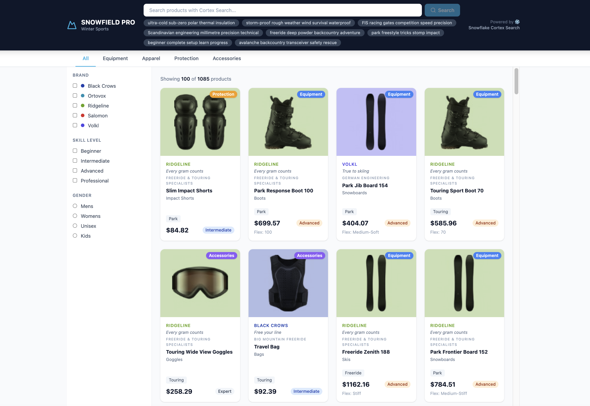
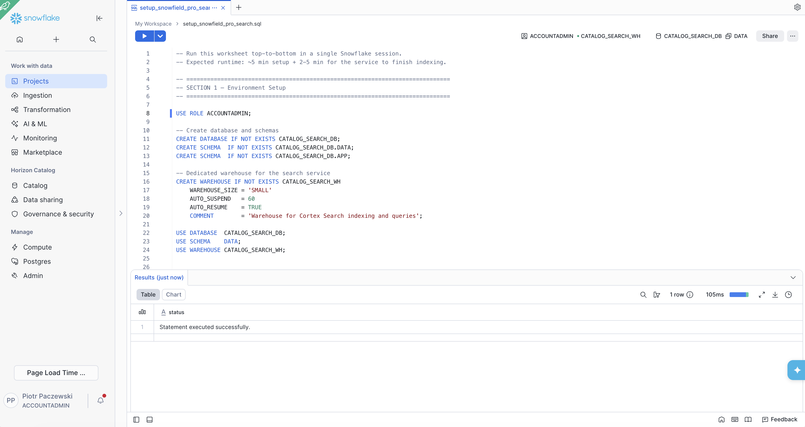
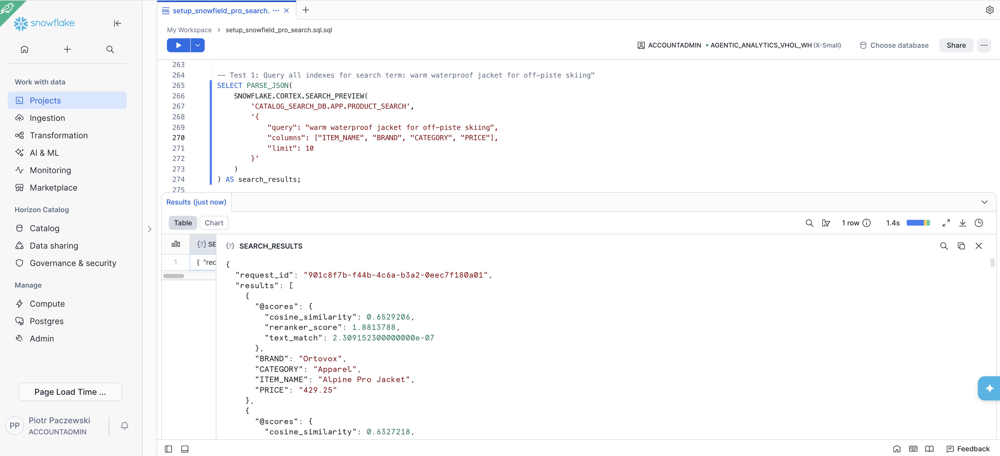
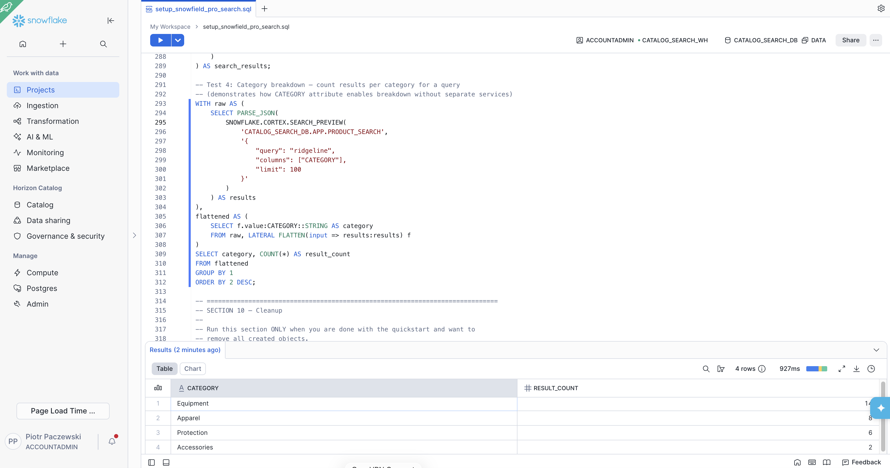
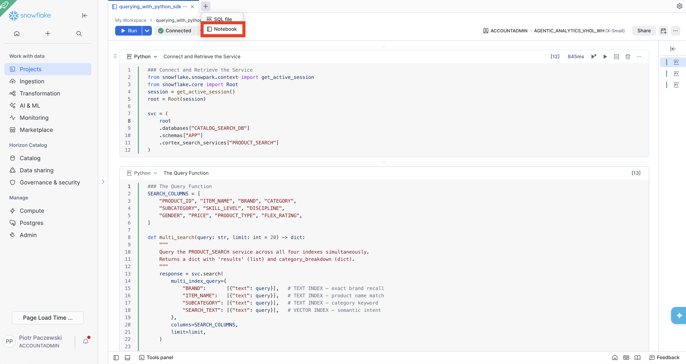
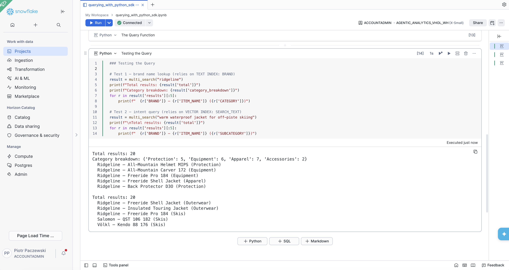
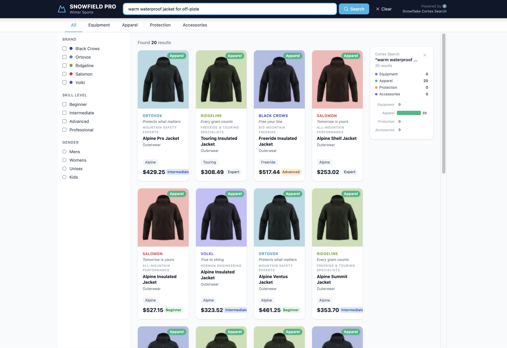

author: Lucas Galan, Piotr Paczewski
id: multi-index-cortex-search-build-a-retail-catalog-search-app
language: en
summary: Build hybrid search combining BM25 keyword and vector semantic retrieval in a single Cortex Search service — then wrap it in a full-stack application.
categories: snowflake-site:taxonomy/solution-center/certification/quickstart, snowflake-site:taxonomy/product/ai, snowflake-site:taxonomy/snowflake-feature/cortex-search
environments: web
status: Published
feedback link: https://github.com/Snowflake-Labs/sfguides/issues

# Multi-Index Cortex Search: Build a Retail Catalog Search App
<!-- ------------------------ -->



## Overview

**Solve the two hardest search problems in retail: exact brand recall and semantic intent in a single Cortex Search service with four indexes. Then build a full-stack application on top of it.**

This guide has two parts:

-   **Part 1 — Introduction to Multi-Index Cortex Search:** Learn how multi-index works, set up a product catalog, create a search service and query it from SQL
-   **Part 2 — Building a Search Application:** Use the Python SDK to query the service programmatically, then build a React + FastAPI demo app and deploy it to Snowpark Container Services. We will use a synthetic winter sports ecommerce shop as an example.

> **Download the code assets for this quickstart:**
 > - [setup_snowfield_pro_search.sql](https://github.com/Snowflake-Labs/sfguides/blob/master/site/sfguides/src/multi-index-cortex-search-build-a-retail-catalog-search-app/code/setup_snowfield_pro_search.sql) — Full environment and SQL setup
> - [querying_with_python_sdk.ipynb](https://github.com/Snowflake-Labs/sfguides/tree/master/site/sfguides/src/multi-index-cortex-search-build-a-retail-catalog-search-app/code/querying_with_python_sdk.ipynb) - Querying Multi-index Cortex Search with Python SDK
> - [snow-sports-demo/](https://github.com/Snowflake-Labs/sfguides/tree/master/site/sfguides/src/multi-index-cortex-search-build-a-retail-catalog-search-app/code/snow-sports-demo) — Full-stack application source (backend, frontend, Dockerfile, product images, and SPCS spec)

### What You'll Need

-   Snowflake account with the ACCOUNTADMIN role or custom role with required privileges
-   Basic familiarity with SQL
-   _(Optional)_ Python 3.9+ with the `snowflake-ml-python` SDK — only required for the optional Python SDK section

### What You'll Learn

-   Why keyword-only and vector-only search each fail in different ways on retail catalogs
-   How Cortex Search `TEXT INDEXES` and `VECTOR INDEXES` work within a single service
-   How to construct the `SEARCH_TEXT` column for maximum retrieval coverage
-   How to query all indexes simultaneously from SQL using `SNOWFLAKE.CORTEX.SEARCH_PREVIEW()`
-   How to derive category breakdowns from result attributes (not from separate services)
-   How to use `AI_COMPLETE()` to enrich product descriptions with AI before indexing
-   How to query with the Python SDK using `multi_index_query`
-   How to build a full-stack demo app around Cortex Search

### What You'll Build

-   A product catalog table with a pre-computed `SEARCH_TEXT` column
-   A single **Cortex Search service** with three TEXT indexes and one VECTOR index
-   Working SQL queries using `SEARCH_PREVIEW` that demonstrate brand recall, intent search, attribute filtering, and category breakdowns
-   AI-enriched product descriptions using `AI_COMPLETE()` for deeper semantic recall
-   A Python query function using `multi_index_query` that hits all four indexes at once
-   A live SNOWFIELD PRO demo app with debounced auto-search

<!-- ------------------------ -->
## The Retail Catalog Retrieval Problem

**The most common search failure mode in retail is not a technology limitation — it is choosing one retrieval strategy when the catalog needs two.**

Consider a winter sports catalog with 1,040 products across Equipment, Apparel, Protection, and Accessories. Users issue two fundamentally different query types:

### Query Type 1 — Brand Name Lookup

The user knows exactly what they want:

```
"ridgeline"
"black crows skis"
"marker kingpin"
```

These are **exact match queries**. BM25 keyword search excels here — a brand name is a literal string, and BM25 will surface it at rank 1. But a pure embedding model struggles: brand names are proper nouns with little semantic neighbourhood in the training corpus. A vector-only search for _"ridgeline"_ may return Dynastar Vertical ski pants (the word "ridgeline" appears in the description) ranked above actual Ridgeline brand products.

### Query Type 2 — Intent / Brand Voice

The user knows what they need but not which brand:

```
"warm waterproof jacket for off-piste skiing"
"protective gear for a beginner on groomed runs"
"lightweight boot for touring in variable snow"
```

These are **semantic queries**. A vector index over descriptive text handles this naturally — the embedding captures the intent and matches products even when no keyword overlaps. BM25 would return zero results for most of these queries.

### Why Single-Strategy Search Fails

| Search Strategy | Brand Recall | Intent Recall | Root Cause |
|----------------|-------------|--------------|------------|
| BM25 keyword-only | ✓ High | ✗ Low | Requires exact keyword match |
| Vector-only | ✗ Low | ✓ High | Brand names sparse in embedding space |
| Multi-index | ✓✓ High | ✓✓ High | BM25 + vector signals fused by reranker |

The solution is not to build two services and fan out — that introduces synchronization complexity, duplicate infrastructure, and manual reranking. The solution is **Multi-Index Cortex Search**: a single service with multiple indexed columns, queried in one call, results fused by the built-in reranker.

<!-- ------------------------ -->
## Understanding Multi-Index Cortex Search

Snowflake Cortex Search supports two index types that can coexist in a single service:

### TEXT INDEXES

BM25 keyword indexes over one or more string columns. Each column gets its own inverted index. Useful for:

-   Exact brand name recall
-   Product name keyword match
-   Category and subcategory lookup
-   SKU and model number search

### VECTOR INDEXES

Dense embedding indexes over a text column. Snowflake supports multiple embedding models for managed vector generation. Useful for:

-   Semantic / intent queries
-   Brand voice and description matching
-   Synonym and paraphrase handling
-   Cross-lingual retrieval

**Bring Your Own Vectors (BYOV):** You can also provide pre-computed vector embeddings directly instead of using Snowflake-managed models. This is useful when:

-   You have domain-specific embeddings trained on your own data (e.g., fashion, medical, legal corpora)
-   You use a third-party embedding provider (OpenAI, Cohere, Voyage AI, etc.) and want consistent embeddings across your stack
-   You need multilingual embeddings from a specialized model not yet available in Snowflake
-   You have already embedded your corpus and want to avoid re-computation costs

This guide will focus on using embeddings models within Snowflake for vector generation.

### What Multi-Index Is NOT

Multi-index is **not** a fan-out pattern across four separate services. You do not need:

-   A separate EQUIPMENT_SEARCH service
-   A separate APPAREL_SEARCH service
-   A `ThreadPoolExecutor` to parallelize requests
-   Manual result merging or reranking code

One service, one call, one result list. The reranker is built in.

<!-- ------------------------ -->
## Setting Up Your Snowflake Environment

Let's begin by opening a SQL file in Snowflake Workspace. 


### Step 1 — Create the Database and Warehouse

```sql
-- Use a role with sufficient privileges
USE ROLE ACCOUNTADMIN;

-- Create the database and schemas
CREATE DATABASE IF NOT EXISTS CATALOG_SEARCH_DB;
CREATE SCHEMA IF NOT EXISTS CATALOG_SEARCH_DB.DATA;
CREATE SCHEMA IF NOT EXISTS CATALOG_SEARCH_DB.APP;

-- Create a dedicated warehouse for the search service
CREATE WAREHOUSE IF NOT EXISTS CATALOG_SEARCH_WH
    WAREHOUSE_SIZE = 'SMALL'
    AUTO_SUSPEND = 60
    AUTO_RESUME = TRUE
    COMMENT = 'Warehouse for Cortex Search service and queries';

USE DATABASE CATALOG_SEARCH_DB;
USE SCHEMA DATA;
USE WAREHOUSE CATALOG_SEARCH_WH;
```

### Step 2 — Create the PRODUCTS Table

```sql
CREATE OR REPLACE TABLE CATALOG_SEARCH_DB.DATA.PRODUCTS (
    PRODUCT_ID      NUMBER AUTOINCREMENT PRIMARY KEY,
    ITEM_NAME       VARCHAR(500),
    BRAND           VARCHAR(200),
    CATEGORY        VARCHAR(100),     -- Equipment | Apparel | Protection | Accessories
    SUBCATEGORY     VARCHAR(200),
    DISCIPLINE      VARCHAR(100),     -- Alpine | Freeride | Nordic | Touring | Park
    SKILL_LEVEL     VARCHAR(50),      -- Beginner | Intermediate | Advanced | Expert
    GENDER          VARCHAR(50),
    PRICE           NUMBER(10, 2),
    PRODUCT_TYPE    VARCHAR(100),
    FLEX_RATING     VARCHAR(50),
    DESCRIPTION     VARCHAR(2000),
    SEARCH_TEXT     VARCHAR(4000)
);
```

### Step 3 — Load the Sample Catalog

The downloadable SQL (Section 3) contains 30 representative product rows across Equipment, Apparel, Protection, and Accessories. Run that INSERT block now, or substitute your own catalog data.

```sql
INSERT INTO CATALOG_SEARCH_DB.DATA.PRODUCTS
    (ITEM_NAME, BRAND, CATEGORY, SUBCATEGORY, DISCIPLINE, SKILL_LEVEL, GENDER, PRICE, PRODUCT_TYPE, FLEX_RATING, DESCRIPTION)
VALUES
    -- Equipment — Skis
    ('Freeride Pro 184',        'Ridgeline',  'Equipment',   'Skis',           'Freeride',  'Advanced',     'Male',   749.00, 'Ski',     '90',   'Wide-waist freeride ski built for deep powder and off-piste terrain. Rocker profile for easy float and turn initiation in variable snow conditions.'),
    ('Powder Daddy 178',        'Ridgeline',  'Equipment',   'Skis',           'Freeride',  'Expert',       'Male',   849.00, 'Ski',     '95',   'Maximum float ski designed for the deepest powder days. Twin-tip construction allows switch riding. Ridgeline signature topsheet.'),
    ('All-Mountain Carver 172', 'Ridgeline',  'Equipment',   'Skis',           'Alpine',    'Intermediate', 'Unisex', 599.00, 'Ski',     '80',   'Versatile all-mountain ski with a medium waist for confident edge-to-edge transitions on groomed and off-piste terrain.'),
    ('Corpus Freebird 186',     'Black Crows','Equipment',   'Skis',           'Freeride',  'Expert',       'Male',   899.00, 'Ski',     '95',   'Black Crows signature freeride ski. Poplar-ash core with carbon reinforcement. Built for couloirs, cliffs, and untracked faces.'),
    ('QST 106 182',             'Salomon',    'Equipment',   'Skis',           'Freeride',  'Advanced',     'Male',   799.00, 'Ski',     '92',   'Lightweight touring and freeride ski with carbon cork core. Walks like a touring ski, charges like a freeride ski.'),
    ('Kendo 88 176',            'Völkl',      'Equipment',   'Skis',           'Alpine',    'Advanced',     'Male',   699.00, 'Ski',     '85',   'Iconic frontside ski with Titanal construction. Exceptional grip on hard pack. Responsive torsionally stiff tip-to-tail.'),
    ('Cinder 96 170',           'K2',         'Equipment',   'Skis',           'All-Mountain','Intermediate','Female', 649.00, 'Ski',     '82',   'Women-specific all-mountain ski with a lighter wood core. Surfy in powder, precise on groomers. Ideal for advancing skiers.'),
    -- Equipment — Boots
    ('Freeride Boot 130',       'Ridgeline',  'Equipment',   'Boots',          'Freeride',  'Expert',       'Male',   549.00, 'Boot',    '130',  'Stiff freeride boot for aggressive charging. Boa dial entry system. Walkable sole for short approaches. Warm liner rated to -20°C.'),
    ('Tourlite Boot 110',       'Ridgeline',  'Equipment',   'Boots',          'Touring',   'Advanced',     'Unisex', 499.00, 'Boot',    '110',  'Lightweight touring boot with 60° range of motion in walk mode. Comfortable enough for long uphill approaches. Grippy rubber sole.'),
    ('Nexo LYT 100W',           'Lange',      'Equipment',   'Boots',          'Alpine',    'Intermediate', 'Female', 449.00, 'Boot',    '100',  'Women-specific boot with a wider last and lower cuff. Easy entry, warm liner, reliable buckle closure. Forgiving flex for all-day comfort.'),
    ('TLT X 130',               'Dynafit',    'Equipment',   'Boots',          'Touring',   'Expert',       'Male',   699.00, 'Boot',    '130',  'Race-proven touring boot. Lightest 130-flex performance boot. Dynafit Speed Nose for fast transitions. Carbon cuff.'),

    -- Equipment — Bindings & Poles
    ('Kingpin 13 110-130',      'Marker',     'Equipment',   'Bindings',       'Touring',   'Advanced',     'Unisex', 399.00, 'Binding', NULL,   'Pin binding with alpine release. Compatible with AT and GripWalk soles. Reliable heel release for confident downhill riding. 10-year field-proven track record.'),
    ('Attack 13 GW',            'Marker',     'Equipment',   'Bindings',       'Alpine',    'Intermediate', 'Unisex', 279.00, 'Binding', NULL,   'Gripwalk-compatible alpine binding with titanium toe piece. Wide brakes available. Outstanding power transmission.'),
    ('Titanal Touring Pole 125', 'Ridgeline', 'Equipment',   'Poles',          'Touring',   'Advanced',     'Unisex',  89.00, 'Pole',   NULL,   'Lightweight Titanal 7075 pole with ergonomic cork grip. Adjustable 100-130cm. Compatible with Ridgeline powder baskets (sold separately).'),

    -- Apparel
    ('Freeride Shell Jacket',   'Ridgeline',  'Apparel',     'Outerwear',      'Freeride',  'Advanced',     'Male',   449.00, 'Jacket',  NULL,   '3-layer Gore-Tex shell with powder skirt, RECCO reflector, and 3 chest pockets. Designed for high-output off-piste skiing. Breathes under hard effort.'),
    ('Insulated Touring Jacket','Ridgeline',  'Apparel',     'Outerwear',      'Touring',   'Intermediate', 'Female', 399.00, 'Jacket',  NULL,   'PrimaLoft Gold insulated jacket with stretch panels under arms. Warm enough for cold morning starts, packable for summit conditions. Women-fit.'),
    ('Softshell Bib Pants',     'Ridgeline',  'Apparel',     'Pants',          'Touring',   'Advanced',     'Male',   329.00, 'Pants',   NULL,   'Softshell bib with 4-way stretch fabric. Excellent breathability for skinning. Reinforced cuff patches. Zippered venting thighs.'),
    ('Wild Descent Ski Pants',  'Ridgeline',  'Apparel',     'Pants',          'Freeride',  'Expert',       'Male',   379.00, 'Pants',   NULL,   'Waterproof hardshell bib pants with reinforced scuff guards. Boot-over design. Suspender system for secure fit during big lines.'),
    ('Merino Base Layer Top',   'Icebreaker', 'Apparel',     'Base Layers',    'All-Mountain','Beginner',   'Unisex', 110.00, 'Base Layer',NULL, '200-weight merino wool next-to-skin top. Naturally odour-resistant, temperature-regulating. Machine washable. Ideal for all winter sports as a warm first layer.'),
    ('Midlayer Fleece Zip',     'Patagonia',  'Apparel',     'Midlayers',      'All-Mountain','Beginner',   'Unisex',  89.00, 'Fleece',  NULL,   'R2 TechFace fleece with 4-way stretch. Moisture-wicking, fast-drying midlayer. Compresses small for packing. Worn alone or under a shell.'),
    ('Heated Gloves Pro',       'Ridgeline',  'Apparel',     'Gloves',         'Alpine',    'Intermediate', 'Unisex', 249.00, 'Gloves',  NULL,   'Battery-heated ski gloves with 3 heat settings. 6-hour battery life on low. Gore-Tex insert, wrist leash. Perfect for circulation issues or extreme cold.'),
    ('Race Gloves GS',          'Leki',       'Apparel',     'Gloves',         'Alpine',    'Expert',       'Unisex',  79.00, 'Gloves',  NULL,   'Trigger S race glove with LEKI strap-free connection system. Slim fit for maximum feel. Goat leather palm. Competition-grade for gates or fast GS runs.'),

    -- Protection
    ('All-Mountain Helmet MIPS','Ridgeline',  'Protection',  'Helmets',        'All-Mountain','Beginner',   'Unisex', 229.00, 'Helmet',  NULL,   'MIPS-equipped ski helmet with goggle ventilation sync. Adjustable dial fit. Rated for temperatures down to -30°C. CE EN1077 and ASTM certified.'),
    ('Freeride Helmet Carbon',  'Ridgeline',  'Protection',  'Helmets',        'Freeride',  'Expert',       'Unisex', 449.00, 'Helmet',  NULL,   'Carbon shell freeride helmet. 20% lighter than standard ABS. Full face compatible. MIPS Spherical technology. Ventilation channels for high-output touring.'),
    ('Back Protector D3O',      'Ridgeline',  'Protection',  'Back Protectors','Freeride',  'Advanced',     'Male',   189.00, 'Protector',NULL,  'Level 2 CE EN13158 D3O back protector. Slim profile fits under any jacket. Harness attachment points for pack integration. Soft at rest, rigid on impact.'),
    ('Knee Guards Pro',         'Ridgeline',  'Protection',  'Knee Guards',    'Park',      'Intermediate', 'Unisex', 149.00, 'Guards',  NULL,   'Hard-shell knee guard with soft EVA backing. Slip-on design fits under ski pants. Protects patella and knee cap on park and pipe riding or mogul fields.'),
    ('Airbag Vest ABS',         'Mammut',     'Protection',  'Airbag Systems', 'Freeride',  'Expert',       'Male',   699.00, 'Airbag',  NULL,   'ABS trigger airbag vest for avalanche safety. Compatible with Mammut dual airbag packs. Lightweight 800g trigger unit. Essential for off-piste and touring.'),
    ('Wrist Guards',            'Dakine',     'Protection',  'Wrist Guards',   'Park',      'Beginner',     'Unisex',  49.00, 'Guards',  NULL,   'Hard-shell wrist guard for beginner and freestyle skiing. Fits inside gloves. Prevents hyperextension on falls. Low-profile hard cap insert.'),

    -- Accessories
    ('Ski Touring Backpack 30L','Ridgeline',  'Accessories', 'Backpacks',      'Touring',   'Advanced',     'Unisex', 199.00, 'Backpack',NULL,   'Ski touring pack with diagonal and A-frame ski carry, ice axe loops, and hip fins for skiing downhill. Hydration-compatible. 30L for day tours.'),
    ('Goggle Photochromic',     'Ridgeline',  'Accessories', 'Goggles',        'All-Mountain','Intermediate','Unisex', 189.00, 'Goggle',  NULL,   'Photochromic OTG goggle with automatic VLT adjustment from S1 (flat light) to S4 (full sun). Magnetic lens swap system. Fits Ridgeline and most OEM helmets.');
```

> **NOTE:** In production, this is your existing catalog table. You do not need to load sample data — just point the search service at your real PRODUCTS table.

### Step 4 — Build the SEARCH_TEXT Column

The `SEARCH_TEXT` column concatenates every attribute a user might describe — brand, product name, subcategory, discipline, skill level, gender, and the full description. This gives the vector index maximum coverage.

```sql
UPDATE CATALOG_SEARCH_DB.DATA.PRODUCTS
SET SEARCH_TEXT = TRIM(
    COALESCE(BRAND,        '') || ' ' ||
    COALESCE(ITEM_NAME,    '') || ' ' ||
    COALESCE(SUBCATEGORY,  '') || ' ' ||
    COALESCE(DISCIPLINE,   '') || ' ' ||
    COALESCE(SKILL_LEVEL,  '') || ' ' ||
    COALESCE(GENDER,       '') || ' ' ||
    COALESCE(DESCRIPTION,  '')
);
```

> **NOTE:** `SEARCH_TEXT` is the column that gets the vector index. It should be as descriptive as possible. If you run the optional AI enrichment section next, it will rewrite DESCRIPTION before you build this column — giving the vector index richer, more searchable content.

### Step 5 — Verify the Data

```sql
-- Check row count and sample SEARCH_TEXT content
SELECT COUNT(*) AS total_products FROM CATALOG_SEARCH_DB.DATA.PRODUCTS;

SELECT PRODUCT_ID, BRAND, ITEM_NAME, CATEGORY,
       LEFT(SEARCH_TEXT, 200) AS search_text_preview
FROM CATALOG_SEARCH_DB.DATA.PRODUCTS
LIMIT 5;
```

Expected output: catalog rows with a `SEARCH_TEXT` preview that reads naturally (e.g. _"Ridgeline Freeride Shell Jacket Outerwear Freeride Advanced Male 3-layer Gore-Tex shell with powder skirt..."_).

<!-- ------------------------ -->
## (Optional) Enrich Product Descriptions with Cortex AI

**Short hand-written descriptions limit semantic recall. `AI_COMPLETE()` rewrites every product description in the natural language your customers actually use.**

### Why Enrich Before Indexing?

The vector index encodes the semantic meaning of `SEARCH_TEXT`. If descriptions are terse (e.g. _"Gore-Tex shell with powder skirt"_), they miss the synonyms, use cases, and natural language patterns customers type into search:

-   _"best jacket for deep powder days"_
-   _"waterproof shell for aggressive off-piste skiing"_
-   _"breathable ski jacket that works on the uptrack"_

An LLM rewrites each description as a product page would — richer, more natural, search-optimised. This enrichment happens once at load time and is then indexed into the vector embedding for the lifetime of the product.

### Step 1 — Preview Enrichment on 3 Rows

Always preview before committing to a mass update:

```sql
SELECT
    PRODUCT_ID,
    ITEM_NAME,
    BRAND,
    LEFT(DESCRIPTION, 100)                     AS original_description,
    AI_COMPLETE(
        'mistral-large2',
        CONCAT(
            'Write a rich, engaging product description for an online ski shop catalog. ',
            'Use natural language a customer would search for. Mention key use cases, ',
            'target skill level, and standout features. Keep it under 150 words.\n\n',
            'Product: ',     ITEM_NAME,    '\n',
            'Brand: ',       BRAND,        '\n',
            'Category: ',    SUBCATEGORY,  '\n',
            'Discipline: ',  DISCIPLINE,   '\n',
            'Skill Level: ', SKILL_LEVEL,  '\n',
            'Gender: ',      GENDER,       '\n',
            'Original description: ', DESCRIPTION
        )
    )                                           AS enriched_description
FROM CATALOG_SEARCH_DB.DATA.PRODUCTS
LIMIT 3;
```

Compare the `original_description` and `enriched_description` columns. The enriched version should feel like a product page — actionable, descriptive, and search-friendly.

### Step 2 — Preserve Originals (Recommended)

```sql
-- Add a backup column before overwriting
ALTER TABLE CATALOG_SEARCH_DB.DATA.PRODUCTS
    ADD COLUMN DESCRIPTION_ORIGINAL VARCHAR(2000);

UPDATE CATALOG_SEARCH_DB.DATA.PRODUCTS
    SET DESCRIPTION_ORIGINAL = DESCRIPTION;
```

### Step 3 — Enrich All Product Descriptions

```sql
-- Cost: ~1-2 credits per 1,000 rows with mistral-large2
-- Runtime: ~30-60 sec for 30 rows | ~3-5 min for 1,040 rows
UPDATE CATALOG_SEARCH_DB.DATA.PRODUCTS
SET DESCRIPTION = AI_COMPLETE(
    'mistral-large2',
    CONCAT(
        'Write a rich, engaging product description for an online ski shop catalog. ',
        'Use natural language a customer would search for. Mention key use cases, ',
        'target skill level, and standout features. Keep it under 150 words.\n\n',
        'Product: ',     ITEM_NAME,    '\n',
        'Brand: ',       BRAND,        '\n',
        'Category: ',    SUBCATEGORY,  '\n',
        'Discipline: ',  DISCIPLINE,   '\n',
        'Skill Level: ', SKILL_LEVEL,  '\n',
        'Gender: ',      GENDER,       '\n',
        'Original description: ', DESCRIPTION
    )
);
```

### Step 4 — Rebuild SEARCH_TEXT with Enriched Descriptions

Now that DESCRIPTION is richer, rebuild the `SEARCH_TEXT` column so the vector index captures the full enriched content:

```sql
UPDATE CATALOG_SEARCH_DB.DATA.PRODUCTS
SET SEARCH_TEXT = TRIM(
    COALESCE(BRAND,        '') || ' ' ||
    COALESCE(ITEM_NAME,    '') || ' ' ||
    COALESCE(SUBCATEGORY,  '') || ' ' ||
    COALESCE(DISCIPLINE,   '') || ' ' ||
    COALESCE(SKILL_LEVEL,  '') || ' ' ||
    COALESCE(GENDER,       '') || ' ' ||
    COALESCE(DESCRIPTION,  '')
);

-- Verify the enriched SEARCH_TEXT preview
SELECT PRODUCT_ID, BRAND, ITEM_NAME,
       LEFT(SEARCH_TEXT, 250) AS search_text_preview
FROM CATALOG_SEARCH_DB.DATA.PRODUCTS
LIMIT 5;
```

> **NOTE:** After completing this section, proceed to "Creating the Multi-Index Search Service". The service will index your enriched `SEARCH_TEXT` automatically.

<!-- ------------------------ -->
## Creating the Multi-Index Search Service

**One DDL statement creates all four indexes and starts the indexing pipeline.**

### The Service DDL

```sql
CREATE OR REPLACE CORTEX SEARCH SERVICE CATALOG_SEARCH_DB.APP.PRODUCT_SEARCH
    TEXT INDEXES   BRAND, ITEM_NAME, SUBCATEGORY
    VECTOR INDEXES SEARCH_TEXT(model='snowflake-arctic-embed-l-v2.0')
    ATTRIBUTES     PRODUCT_ID, ITEM_NAME, BRAND, CATEGORY, SUBCATEGORY,
                   SKILL_LEVEL, DISCIPLINE, GENDER, PRICE, PRODUCT_TYPE, FLEX_RATING
    WAREHOUSE  = CATALOG_SEARCH_WH
    TARGET_LAG = '1 hour'
    AS (
        SELECT
            PRODUCT_ID,
            SEARCH_TEXT,
            ITEM_NAME,
            BRAND,
            CATEGORY,
            SUBCATEGORY,
            SKILL_LEVEL,
            DISCIPLINE,
            GENDER,
            PRICE,
            PRODUCT_TYPE,
            FLEX_RATING
        FROM CATALOG_SEARCH_DB.DATA.PRODUCTS
    );
```

### What Each Clause Does

| Clause | Purpose |
|--------|---------|
| `TEXT INDEXES BRAND, ITEM_NAME, SUBCATEGORY` | Creates BM25 indexes on three structured columns for exact keyword match |
| `VECTOR INDEXES SEARCH_TEXT(model=...)` | Creates a dense embedding index on the concatenated description column |
| `ATTRIBUTES ...` | Columns returned with each result (not indexed — used for display/filtering) |
| `WAREHOUSE` | Compute used for initial indexing and incremental refresh |
| `TARGET_LAG = '1 hour'` | Maximum time between source table update and index refresh |

### Verify Service Status

```sql
-- Check that the service has indexed your rows
SHOW CORTEX SEARCH SERVICES IN SCHEMA CATALOG_SEARCH_DB.APP;

-- Detailed status
DESCRIBE CORTEX SEARCH SERVICE CATALOG_SEARCH_DB.APP.PRODUCT_SEARCH;
```

Wait for `indexing_state` to show `READY` before running queries. For 1,040 rows this typically takes 2–5 minutes.

> **NOTE:** The `TARGET_LAG` setting controls how frequently the service checks for new or updated rows. For a demo/dev catalog that rarely changes, `'1 hour'` is appropriate. For a live production catalog, use `'1 minute'` or different frequency.

<!-- ------------------------ -->
## Querying with SEARCH_PREVIEW (SQL)

**`SNOWFLAKE.CORTEX.SEARCH_PREVIEW()` is the SQL interface for Cortex Search — query all four indexes from a workspace, a Streamlit app, or any SQL-capable tool.**

### Test 1 — Brand Name Lookup (exercises TEXT INDEX on BRAND)

```sql
SELECT PARSE_JSON(
    SNOWFLAKE.CORTEX.SEARCH_PREVIEW(
        'CATALOG_SEARCH_DB.APP.PRODUCT_SEARCH',
        '{
            "query": "ridgeline",
            "columns": ["PRODUCT_ID", "ITEM_NAME", "BRAND", "CATEGORY", "SUBCATEGORY", "PRICE"],
            "limit": 10
        }'
    )
) AS search_results;
```



Expected: all Ridgeline brand products surface at the top of the ranked list, regardless of whether "ridgeline" appears in their description. This is the TEXT INDEX on BRAND at work.

### Test 2 — Intent / Semantic Query (exercises VECTOR INDEX on SEARCH_TEXT)

```sql
SELECT PARSE_JSON(
    SNOWFLAKE.CORTEX.SEARCH_PREVIEW(
        'CATALOG_SEARCH_DB.APP.PRODUCT_SEARCH',
        '{
            "query": "warm waterproof jacket for off-piste skiing",
            "columns": ["PRODUCT_ID", "ITEM_NAME", "BRAND", "CATEGORY", "PRICE"],
            "limit": 10
        }'
    )
) AS search_results;
```

Expected: freeride and outerwear products surface at the top — even for products whose descriptions use different words than the query. This is the VECTOR INDEX on SEARCH_TEXT at work.

### Test 3 — Attribute Filter (server-side filtering by SKILL_LEVEL)

```sql
SELECT PARSE_JSON(
    SNOWFLAKE.CORTEX.SEARCH_PREVIEW(
        'CATALOG_SEARCH_DB.APP.PRODUCT_SEARCH',
        '{
            "query": "protective gear",
            "columns": ["PRODUCT_ID", "ITEM_NAME", "BRAND", "CATEGORY", "SKILL_LEVEL", "PRICE"],
            "filter": {"@eq": {"SKILL_LEVEL": "Beginner"}},
            "limit": 10
        }'
    )
) AS search_results;
```

> **NOTE:** The `filter` clause is applied server-side before ranking — only products matching the filter are scored and returned. This is more efficient than fetching all results and filtering in your application.

### Test 4 — Category Breakdown (grouping on result attributes)

This query demonstrates how a single service can power a faceted UI — the category breakdown is derived from the `CATEGORY` attribute on each result, not from multiple services:

```sql
WITH raw AS (
    SELECT PARSE_JSON(
        SNOWFLAKE.CORTEX.SEARCH_PREVIEW(
            'CATALOG_SEARCH_DB.APP.PRODUCT_SEARCH',
            '{
                "query": "ridgeline",
                "columns": ["CATEGORY"],
                "limit": 100
            }'
        )
    ) AS results
),
flattened AS (
    SELECT f.value:CATEGORY::STRING AS category
    FROM raw, LATERAL FLATTEN(input => results:results) f
)
SELECT category, COUNT(*) AS result_count
FROM flattened
GROUP BY 1
ORDER BY 2 DESC;
```

Expected output on screenshoot below.


> **NOTE:** `SEARCH_PREVIEW` is the easiest path to testing Multi-Index Cortex Search from SQL. The `SEARCH_PREVIEW` function is provided for **testing and validation only**. It is not intended for serving search queries in an end-user application.  The function has **higher latency** than the REST and Python APIs. For production applications use REST or the Python SDK's `svc.search()` method with `multi_index_query` returns structured Python objects and gives you full multi-index control. See the optional SDK section below.

<!-- ------------------------ -->
## Tuning and Optimization

**Multi-index retrieval is production-ready out of the box, but these practices improve recall further.**

### 1. Enrich SEARCH_TEXT for Better Vector Coverage

The more descriptive the `SEARCH_TEXT`, the better the semantic index performs. Include everything a customer might say:

```sql
-- Enrich with brand taglines and synonyms if available
UPDATE CATALOG_SEARCH_DB.DATA.PRODUCTS
SET SEARCH_TEXT = TRIM(
    COALESCE(BRAND, '') || ' ' ||
    COALESCE(ITEM_NAME, '') || ' ' ||
    COALESCE(SUBCATEGORY, '') || ' ' ||
    COALESCE(DISCIPLINE, '') || ' ' ||
    COALESCE(SKILL_LEVEL, '') || ' ' ||
    COALESCE(GENDER, '') || ' ' ||
    COALESCE(DESCRIPTION, '') || ' ' ||
    -- Add brand tagline / voice if you have it
    COALESCE(BRAND_TAGLINE, '') || ' ' ||
    COALESCE(MATERIAL_TAGS, '')
);
```

### 2. Granular TEXT INDEXES for Niche Catalogs

For catalogs with strong SKU or model number search patterns, add those columns to TEXT INDEXES:

```sql
-- Example: add SKU and MODEL_NUMBER as TEXT indexes
-- (requires recreating the service)
CREATE OR REPLACE CORTEX SEARCH SERVICE ...
    TEXT INDEXES BRAND, ITEM_NAME, SUBCATEGORY, SKU, MODEL_NUMBER
    VECTOR INDEXES SEARCH_TEXT(model='snowflake-arctic-embed-l-v2.0')
    ...
```

<!-- ------------------------ -->
## Building a Search Application

**You now have a working Multi-Index Cortex Search service. The remaining sections show how to build a full-stack search application on top of it — from a Python SDK query function to a React frontend deployed on local machine or on Snowpark Container Services.**

<!-- ------------------------ -->
## Querying with the Python SDK

**A single Python function replaces the fan-out pattern, the merge logic, and the manual reranker.**

Open the notebook in Snowflake Workspaces.


### Connect and Retrieve the Service

```python
from snowflake.snowpark.context import get_active_session
from snowflake.core import Root
session = get_active_session()
root = Root(session)

svc = (
    root
    .databases["CATALOG_SEARCH_DB"]
    .schemas["APP"]
    .cortex_search_services["PRODUCT_SEARCH"]
)
```

### The Query Function

```python
### The Query Function
SEARCH_COLUMNS = [
    "PRODUCT_ID", "ITEM_NAME", "BRAND", "CATEGORY",
    "SUBCATEGORY", "SKILL_LEVEL", "DISCIPLINE",
    "GENDER", "PRICE", "PRODUCT_TYPE", "FLEX_RATING",
]

def multi_search(query: str, limit: int = 20) -> dict:
    """
    Query the PRODUCT_SEARCH service across all four indexes simultaneously.
    Returns a dict with 'results' (list) and category_breakdown (dict).
    """
    response = svc.search(
        multi_index_query={
            "BRAND":       [{"text": query}],   # TEXT INDEX — exact brand recall
            "ITEM_NAME":   [{"text": query}],   # TEXT INDEX — product name match
            "SUBCATEGORY": [{"text": query}],   # TEXT INDEX — category keyword
            "SEARCH_TEXT": [{"text": query}],   # VECTOR INDEX — semantic intent
        },
        columns=SEARCH_COLUMNS,
        limit=limit,
    )

    results = response.results

    # Derive category breakdown from the CATEGORY attribute on each result
    # (not from which service the result came from — there is only one service)
    category_counts = {}
    for r in results:
        cat = r.get("CATEGORY", "Unknown")
        category_counts[cat] = category_counts.get(cat, 0) + 1

    return {
        "results": results,
        "total": len(results),
        "category_breakdown": category_counts,
    }
```

### Testing the Query

```python
# Test 1 — brand name lookup (relies on TEXT INDEX: BRAND)
result = multi_search("ridgeline")
print(f"Total results: {result['total']}")
print(f"Category breakdown: {result['category_breakdown']}")
for r in result['results'][:5]:
    print(f"  {r['BRAND']} — {r['ITEM_NAME']} ({r['CATEGORY']})")

# Test 2 — intent query (relies on VECTOR INDEX: SEARCH_TEXT)
result = multi_search("warm waterproof jacket for off-piste skiing")
print(f"\nTotal results: {result['total']}")
for r in result['results'][:5]:
    print(f"  {r['BRAND']} — {r['ITEM_NAME']} ({r['SUBCATEGORY']})")
```

Expected results from testing on the screenshoot below.



<!-- ------------------------ -->
## The Demo App: SNOWFIELD PRO

**You've seen the power of Multi-Index Cortex Search from SQL and Python SDK. Now let's put it behind a FastAPI backend and a React frontend — with debounced auto-search and a multi-index insights panel.**

The full SNOWFIELD PRO demo connects a FastAPI backend to a React frontend. The Python SDK's `multi_index_query` drives the search; every result carries a `CATEGORY` attribute that powers the live category breakdown sidebar.



We will cover to options for running the app:
- Option 1: Running the App **Locally**
- Option 2: Running the App **in Snowpark Container Services**

### Option 1 - Running the App Locally

#### Prerequisites

-   Python 3.9+ with pip
-   Node.js 18+ with npm
-   A Snowflake connection configured in `~/.snowflake/connections.toml` (the backend reads this automatically)

#### Step 1 — Install Backend Dependencies

From the `code/snow-sports-demo/backend` directory:

```bash
cd code/snow-sports-demo/backend
pip install -r requirements.txt
```

This installs FastAPI, uvicorn, snowflake-connector-python, snowflake-snowpark-python, snowflake-core, pydantic, and cryptography.

#### Step 2 — Install Frontend Dependencies

From the `code/snow-sports-demo/frontend` directory:

```bash
cd ../frontend && npm install
```

#### Step 3 — Start the Backend

The backend reads your Snowflake connection from `~/.snowflake/connections.toml`. Set the `SNOWFLAKE_CONNECTION` environment variable to the name of your connection entry:

```bash
cd ../backend
SNOWFLAKE_CONNECTION=your_connection_name uvicorn main:app --reload --port 8000
```

The backend starts on `http://localhost:8000`. 

#### Step 4 — Start the Frontend

**In a separate terminal**:

Verify backend works properly with:

```bash
curl http://localhost:8000/api/health
# Expected: {"status":"ok","database":"CATALOG_SEARCH_DB"}
```

> **NOTE:** The first search request takes 30–60 seconds while the Snowpark session is established. Subsequent requests are fast.

Start the frontend:

```bash
cd ../frontend
npm run dev
```

The Vite dev server starts on `http://localhost:5173` (or the next available port). It automatically proxies `/api` requests to the backend on port 8000.

#### Step 5 — Test the App

Open `http://localhost:5173` in your browser:

1.  Search `"ridgeline"` — observe all Ridgeline brand products surface at rank 1 (TEXT INDEX on BRAND)
2.  Search `"warm waterproof jacket for freeride"` — observe semantic results with no keyword overlap (VECTOR INDEX on SEARCH_TEXT)
3.  The right sidebar shows the category breakdown derived from result attributes

#### Architecture

```
Browser (localhost:5173)
  │
  ├── React frontend (Vite dev server)
  │     └── POST /api/search/multi ──proxy──▶ localhost:8000
  │
  └── FastAPI backend (uvicorn)
        └── svc.search(multi_index_query={...})
              └── Cortex Search Service: CATALOG_SEARCH_DB.APP.PRODUCT_SEARCH
                    ├── TEXT INDEXES: BRAND, ITEM_NAME, SUBCATEGORY
                    └── VECTOR INDEXES: SEARCH_TEXT
```

### Option 2 - Running the App on Snowpark Container Services (SPCS)

The same app can be deployed to SPCS for production use — no code changes required. The backend automatically detects the SPCS environment and uses OAuth token authentication from the mounted `/snowflake/session/token` file.

> aside negative
> **Trial Account Limitation:** Snowpark Container Services (SPCS) is not available on Snowflake trial accounts. If you are using a trial account, you can skip this section and use the local deployment described above instead. The local deployment provides the same functionality for development and testing purposes.

#### Prerequisites

-   Docker installed locally (for building the image)
-   ACCOUNTADMIN or a custom role with required privileges
-   The Cortex Search service (`CATALOG_SEARCH_DB.APP.PRODUCT_SEARCH`) already created from the earlier sections

#### Step 1 — Create an Image Repository

```sql
CREATE IMAGE REPOSITORY IF NOT EXISTS CATALOG_SEARCH_DB.APP.APP_IMAGES;

-- Get the repository URL (you'll need this for docker push)
SHOW IMAGE REPOSITORIES IN SCHEMA CATALOG_SEARCH_DB.APP;
-- Note the repository_url column, e.g.: <account>.registry.snowflakecomputing.com/catalog_search_db/app/app_images
```

#### Step 2 — Build the Docker Image

From the `code/snow-sports-demo` directory (where the Dockerfile is):

```bash
docker build --platform linux/amd64 -t snow-sports-store:v1 .
```
> **NOTE:** The `--platform linux/amd64` flag is required even on Apple Silicon — SPCS runs on x86_64 nodes.

#### Step 3 — Login to the Snowflake Registry

```bash
# Using the Snowflake CLI
snow spcs image-registry login --connection your_connection_name

# Or manually with Docker
docker login <account>.registry.snowflakecomputing.com -u <username>
```

#### Step 4 — Tag and Push the Image

Replace `<account>` with your Snowflake account registry hostname (from Step 1):

```bash
docker tag snow-sports-store:v1 <account>.registry.snowflakecomputing.com/catalog_search_db/app/app_images/snow-sports-store:v1

docker push <account>.registry.snowflakecomputing.com/catalog_search_db/app/app_images/snow-sports-store:v1
```

#### Step 5 — Create a Compute Pool

```sql
CREATE COMPUTE POOL IF NOT EXISTS CATALOG_SEARCH_POOL
  MIN_NODES = 1
  MAX_NODES = 1
  INSTANCE_FAMILY = CPU_X64_XS
  AUTO_SUSPEND_SECS = 300
  AUTO_RESUME = TRUE;
```

#### Step 6 — Create the SPCS Service
```sql
CREATE SERVICE CATALOG_SEARCH_DB.APP.SNOW_SPORTS_STORE
  IN COMPUTE POOL CATALOG_SEARCH_POOL
  FROM SPECIFICATION $$
spec:
  containers:
  - name: snow-sports-store
    image: /catalog_search_db/app/app_images/snow-sports-store:v1
    env:
      SNOWFLAKE_DATABASE: CATALOG_SEARCH_DB
      SNOWFLAKE_SCHEMA: APP
      SNOWFLAKE_WAREHOUSE: CATALOG_SEARCH_WH
    resources:
      requests:
        cpu: 0.5
        memory: 1Gi
      limits:
        cpu: 2
        memory: 4Gi
  endpoints:
  - name: store-ui
    port: 8000
    public: true
$$
  MIN_INSTANCES = 1
  MAX_INSTANCES = 1;
```

#### Step 7 — Verify Deployment

```sql
-- Check service status (wait for status = READY)
SELECT SYSTEM$GET_SERVICE_STATUS('CATALOG_SEARCH_DB.APP.SNOW_SPORTS_STORE');

-- Get the public endpoint URL
SHOW ENDPOINTS IN SERVICE CATALOG_SEARCH_DB.APP.SNOW_SPORTS_STORE;
```

Open the `ingress_url` from the SHOW ENDPOINTS output in your browser. The app is live.

<!-- ------------------------ -->
## Cleanup

**Run this SQL to remove all objects created in this quickstart.**

```sql
-- Drop the database
DROP DATABASE IF EXISTS CATALOG_SEARCH_DB;

-- Drop the warehouse
DROP WAREHOUSE IF EXISTS CATALOG_SEARCH_WH;
```

<!-- ------------------------ -->
## Conclusion and Resources

**You have built a production-ready retail catalog search using Multi-Index Cortex Search — one service, four indexes, zero manual reranking — and wrapped it in a full-stack application.**

### What You Built

**Part 1 — Multi-Index Cortex Search:**

-   A product catalog table with a pre-computed `SEARCH_TEXT` column combining brand, name, subcategory, and description
-   A single **Cortex Search service** with three TEXT indexes (BRAND, ITEM_NAME, SUBCATEGORY) and one VECTOR index (SEARCH_TEXT)
-   Working SQL queries using `SNOWFLAKE.CORTEX.SEARCH_PREVIEW()` demonstrating brand recall, intent search, attribute filtering, and category breakdowns
-   AI-enriched product descriptions generated with `AI_COMPLETE()` for deeper semantic recall

**Part 2 — Search Application:**

-   A Python `multi_search()` function using `multi_index_query` to hit all four indexes in one SDK call
-   A full SNOWFIELD PRO demo app with debounced auto-search and a multi-index insights sidebar
-   A production deployment path via Snowpark Container Services

### Key Takeaways

-   **Multi-index is native, not a pattern** — `TEXT INDEXES` and `VECTOR INDEXES` are first-class DDL clauses in Cortex Search. One service, one call.
-   **Brand recall requires a TEXT INDEX on BRAND** — vector embeddings alone cannot reliably surface brand names at rank 1. BM25 on the BRAND column solves this.
-   **Intent recall requires a VECTOR INDEX** — keyword search cannot match _"warm boot for icy terrain"_ against products that use different words. Embeddings solve this.
-   **The reranker is built in** — you do not write score fusion logic. The service fuses BM25 and vector signals automatically.
-   **CATEGORY comes from result attributes** — in a single-service architecture, the category breakdown is a grouping of the `CATEGORY` attribute on each result, not a reflection of which service matched.
-   **AI enrichment amplifies semantic recall** — running `AI_COMPLETE()` on descriptions before indexing closes the vocabulary gap between terse product copy and natural customer queries.

### Resources

-   [Cortex Search Overview — Snowflake Documentation](https://docs.snowflake.com/en/user-guide/snowflake-cortex/cortex-search/cortex-search-overview)
-   [Cortex Search Service DDL Reference](https://docs.snowflake.com/en/sql-reference/sql/create-cortex-search-service)
-   [Snowflake Python SDK — CortexSearchService](https://docs.snowflake.com/en/developer-guide/snowflake-ml/reference/latest/cortex_search_service)
-   [SNOWFLAKE.CORTEX.COMPLETE() Reference](https://docs.snowflake.com/en/sql-reference/functions/complete-snowflake-cortex)
-   [snowflake-arctic-embed Models](https://huggingface.co/collections/Snowflake/snowflake-arctic-embed-661f62f3c91aafe00b4aee3b)
-   [SNOWFIELD PRO Demo Source Code](https://github.com/Snowflake-Labs/sfguides)
