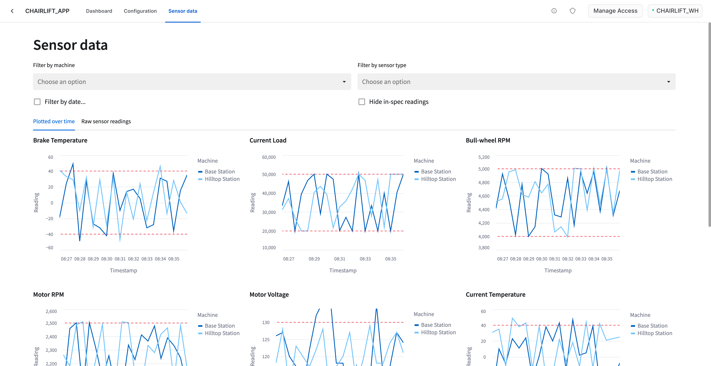
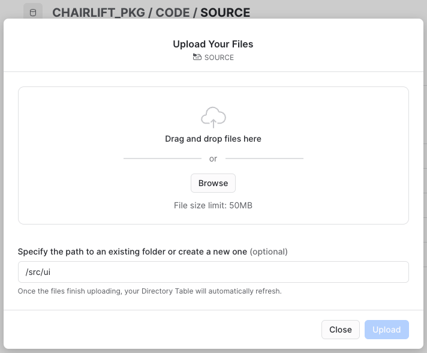
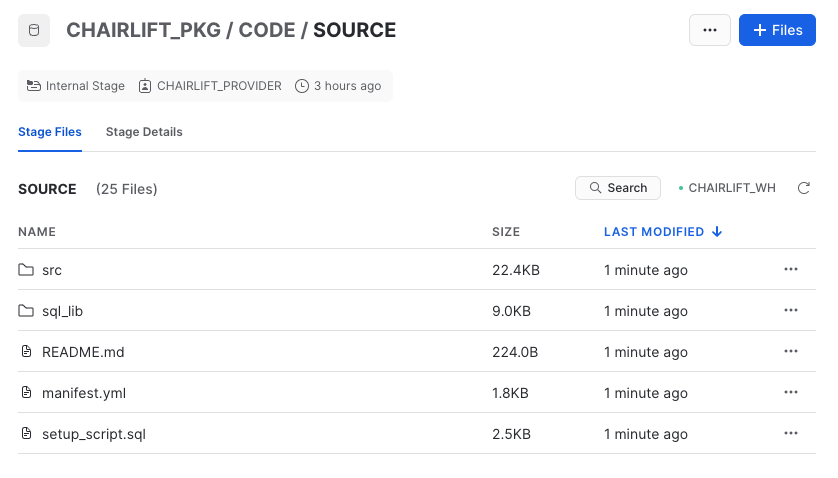
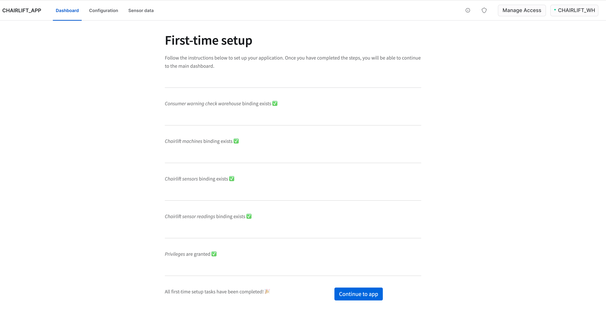
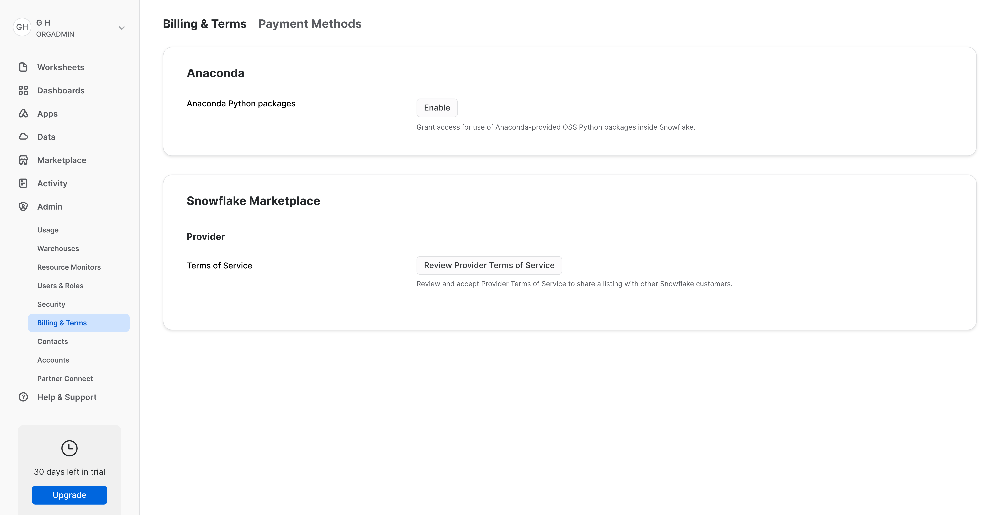

author: Gilberto Hernandez
id: native-app-chairlift
summary: This Snowflake Native App demonstrates how a chairlift manufacturer can build a native app to provide chairlift customers with analytics on purchased chairlifts by using sensor data collected from the chairlifts owned by the customer.
categories: Getting-Started
environments: web
status: Published 
feedback link: https://github.com/Snowflake-Labs/sfguides/issues
tags: Getting Started, Data Science, Data Engineering, Apps 

# Build a Snowflake Native App to Analyze Chairlift Sensor Data
<!-- ------------------------ -->
## Introduction
Duration: 2

In this Quickstart, you'll build a Snowflake Native Application that can analyze sensor data from chairlifts at different locations at a ski resort. Let's explore the scenario from the perspective of the application provider and an application consumer.

– **Provider** – The provider of the app is a chairlift manufacturer. The app, once installed by a consumer, can run against chairlift sensor data housed in the consumer's account, and provide the consumer with important analytics and insights on the condition of each chairlift. 

– **Consumer** – The consumer of the app is a customer of the chairlift manufacturer. They have purchased and installed chairlifts in various locations across a ski resort they own, and they collect raw sensor data from the chairlifts using a connector that ingests this data directly into their account. The provider's app runs against this data and helps the customer identify chairlifts in need of maintenance.

Within the app, you'll create the following:

- **Dashboard** – A dashboard with a list of sensor warnings from all chairlifts at the ski resort. You'll be able to filter by chairlift and by sensor type.

- **Configuration** – A tab that allows an application admin to toggle sensor warnings about chairlifts.

- **Sensor data** – Visualizations of raw sensor data across all chairlifts at the ski resorts.  You'll be able to filter by chairlift and by sensor type.

Note that this Quickstart is limited to a single-account installation. Listing to the Snowflake Marketplace and versions / release directives are outside of the scope of this guide.

Let's get started!




### What You’ll Learn 

- How to create an application package
- How to create grants in the application package to control access to different parts of the app, depending on Snowflake role 
- How to create a new version of the app
- How to install and run the app in a single Snowflake account using multiple roles

### What You’ll Need

> aside negative
> 
> **Important**
> Native Apps are currently only  available on AWS.  Ensure your Snowflake deployment or trial account uses AWS as the cloud provider. Native Apps will be available on other major cloud providers soon.

- A Snowflake account ([trial](https://signup.snowflake.com/developers), or otherwise). See note above on AWS as cloud provider for the deployment.

### What You’ll Build 

- A Snowflake Native App

<!-- ------------------------ -->
## Clone GitHub repository
Duration: 2

Start by cloning the following GitHub repository, which contains the code we'll need to build the app:

```bash
git clone https://github.com/Snowflake-Labs/sfguide-native-apps-chairlift.git
```

Take a look at the directory structure:

```plaintext
sfguide-native-apps-chairlift/
├─ consumer/
│  ├─ install-app.sql
├─ prepare/
│  ├─ consumer-data.sql
│  ├─ consumer-roles.sql
│  ├─ provider-data.sql
│  ├─ provider-roles.sql
├─ provider/
│  ├─ create-package.sql
├─ src/
│  ├─ README.md
│  ├─ manifest.yml
│  ├─ setup.sql
│  ├─ ui/
├─ LEGAL.md
├─ LICENSE
├─ README.md
```

The app's source code resides in the **src/** directory. There are also three other directories in this repository: **/prepare**, **/consumer**, and **/provider**. These three directories are specific to this Quickstart, and the files in these folders will be used to properly set up account roles and objects within the Snowflake account for this native app. In practice, you may have your own directory structure outside of the **/src** folder, or other methods for achieving what the files in these three other directories do.

Here's an overview of the directories:

**src/** 

- The **src/** directory contains the source code for the app. This includes all stored procedures, user-defined functions (UDFs), and the front-end for the app (in this Quickstart, the front-end files are within the **ui/** folder). It also includes two other required (and very important) files: **manifest.yml** and **setup.sql**. We'll take a deeper look at this directory in the next step.

**prepare/** 

- This directory is specific to this Quickstart. It contains files to prepare your Snowflake account by creating certain roles, granting privileges, and loading data. We'll execute the scripts in this folder before building the native app.

**consumer/** 

- This directory is specific to this Quickstart. It contains a SQL script to install the native app in the account and grant appropriate privileges. This will allow you to run the native app from the perspective of the consumer (i.e., a customer of the chairlift manufacturer).

**provider/** 

- This directory is specific to this Quickstart. It contains a SQL script to create the application package and grant privileges on provider data.

<!-- ------------------------ -->
## The **src/** directory
Duration: 4

Let's take a deeper look at the **/src** directory for this app.

```plaintext
src/
├─ README.md
├─ manifest.yml
├─ setup.sql
├─ ui/
│  ├─ chairlift_data.py
│  ├─ environment.yml
│  ├─ first_time_setup.py
│  ├─ references.py
│  ├─ ui_common.py
│  ├─ util.py
│  ├─ v_configuration.py
│  ├─ v_dashboard.py
│  ├─ v_sensor_data.py
```

This directory contains the source code for the native app. This Quickstart uses **src/** as the name of the folder, mostly for the purposes of convention. In practice, this folder may take on any name you'd like. 

Here's an overview of what this folder contains:

**manifest.yml** 

- A manifest file is a requirement when creating a native app. This file defines the runtime configuration for application. It contains metadata about the app (version, etc.), artifacts required by the app, and log configuration settings. It also defines the privileges that the consumer must grant when to the application when the application is installed in their account. Finally, it also contains references defined by the provider. Typically these references refer to tables and the corresponding privileges needed by the app to run against consumer data. For more information, see [Creating the Manifest File](https://docs.snowflake.com/en/developer-guide/native-apps/creating-manifest).

**setup.sql** 

- A setup script is a requirement when creating a native app. This script contains statements that are run when the consumer installs or upgrades an application, or when a provider installs or upgrades an application for testing. The location of this script should be specified in the manifest file. For more information, see [Creating the Setup Script](https://docs.snowflake.com/en/developer-guide/native-apps/creating-setup-script).

**README.md** 

- This file should provide a description of what the app does. This file is shown when viewing the app within Snowflake.

**ui/** 

- This directory is specific to this Quickstart, and contains all of the files and code used to create the front-end of the app. Front-ends for Snowflake Native Apps are built with Streamlit. You should peruse all of the files in this folder to get familiar with how the front-end is built, and pay special attention to the files that define the main views within the app, namely **v_dashboard.py**, **v_sensor_data.py**, and **v_configuration.py**. For more information, see [Adding Frontend Experience to Your Application with Streamlit](https://docs.snowflake.com/en/developer-guide/native-apps/adding-streamlit).


<!-- ------------------------ -->
## Set up account roles
Duration: 4

Let's start building the app. You'll first need to configure certain roles and permissions within your Snowflake account. This will allow you to view the app as an app admin (for configuring the application after installation and/or dismissing sensor warnings), or as an app viewer (perhaps someone in charge of equipment maintenance at the resort keeps an eye on the condition of chairlifts).

To create these roles and permissions, run the scripts below. You'll only need to execute these scripts once.

**Execute prepare/provider-role.sql**

Open a SQL worksheet in Snowsight and execute the following script:

```sql
-- create provider role
create role if not exists chairlift_provider;
grant role chairlift_provider to role accountadmin;
grant create application package on account to role chairlift_provider;
grant create database on account to role chairlift_provider;

-- ensure a warehouse is usable by provider
create warehouse if not exists chairlift_wh;
grant usage on warehouse chairlift_wh to role chairlift_provider;
```

**Execute prepare/consumer-roles.sql**

Open a SQL worksheet in Snowsight and execute the following script:

```sql
-- create consumer role
create role if not exists chairlift_admin;
create role if not exists chairlift_viewer;
grant role chairlift_admin to role accountadmin;
grant role chairlift_viewer to role accountadmin;
grant create database on account to role chairlift_admin;
grant create application on account to role chairlift_admin;
grant execute task, execute managed task on account to role chairlift_admin with grant option;
grant role chairlift_viewer to role chairlift_admin;

-- ensure a warehouse is usable by consumer
grant usage on warehouse chairlift_wh to role chairlift_admin;
grant usage on warehouse chairlift_wh to role chairlift_viewer;
```


<!-- ------------------------ -->
## Prepare objects in account
Duration: 5

Next, you'll run some scripts to setup some databases, schemas, and tables needed by the app.

The scripts will do a couple of things:

* The provider scripts define roles, warehouses, and data types for the data emitted by the sensors (i.e., brake temperature, motor RPMs, etc.). This data is combined with the consumer data inside of the app, and is necessary so that the app can function as intended in the consumer's account. From this perspective, the provider is the chairlift manufacturer, and the app will run against raw sensor data in (and owned by) a consumer's account. Running the app against this data will provide the consumer with analytics and insights on the chairlifts they own, granted that the consumer installs the app and grants the proper privileges to the app.

* The consumer scripts mock fictional, raw sensor data about the chairlifts. In practice, this data could be ingested directly into the consumer's account with a connector that collects raw sensor data from the chairlifts. For the purposes of this Quickstart, we mock this data so that the provider's native app can run against this data that lives in the consumer's account.

To setup the environment, run the scripts below. You'll only need to execute these scripts once.

**Execute prepare/provider-data.sql**

Open a SQL worksheet in Snowsight and execute the following script:

```sql
use role chairlift_provider;
use warehouse chairlift_wh;

create database if not exists chairlift_provider_data;
use database chairlift_provider_data;
create schema if not exists core;
use schema core;

-- Sensor types with reading min range, max ranges, service intervals and lifetime of the sensor.
create or replace table chairlift_provider_data.core.sensor_types (
    id int,
    name varchar,
    min_range int,
    max_range int,
    service_interval_count int,
    service_interval_unit varchar,
    lifetime_count int,
    lifetime_unit varchar,
    primary key (id)
);

insert into chairlift_provider_data.core.sensor_types values
    (1, 'Brake Temperature', -40, 40, 6, 'month', 5, 'year'),
    (2, 'Current Load', 20000, 50000, 3, 'month', 5, 'year'),
    (3, 'Bull-wheel RPM', 4000, 5000, 1, 'month', 1, 'year'),
    (4, 'Motor RPM', 2000, 2500, 1, 'month', 1, 'year'),
    (5, 'Motor Voltage', 110, 130, 2, 'month', 5, 'year'),
    (6, 'Current Temperature', -40, 40, 4, 'month', 5, 'year'),
    (7, 'Rope Tension', 70, 100, 3, 'month', 5, 'year'),
    (8, 'Chairlift Load', 50, 250, 3, 'month', 2, 'year'),
    (9, 'Chairlift Vibration', 30, 100, 3, 'month', 3, 'year');
```

**Execute prepare/consumer-data.sql**

Open a SQL worksheet in Snowsight and execute the following script:

```sql
use role chairlift_admin;
use warehouse chairlift_wh;

-- consumer data: streaming readings from sensors on their ski lift machines.
create database if not exists chairlift_consumer_data;
use database chairlift_consumer_data;
create schema if not exists data;
use schema data;

-- what machines (chairlifts and stations) exist in the consumer\'s ski resort?
create or replace table machines (
    uuid varchar,
    name varchar,
    latitude double,
    longitude double,
    primary key (uuid)
);

-- what sensors are configured and streaming data from those machines?
create or replace table sensors (
    uuid varchar,
    name varchar,
    sensor_type_id int,
    machine_uuid varchar,
    last_reading int,
    installation_date date,
    last_service_date date,
    primary key (uuid),
    foreign key (machine_uuid) references machines(uuid)
);

-- what readings have we received from the configured sensors?
create table if not exists sensor_readings (
    sensor_uuid varchar,
    reading_time timestamp,
    reading int,
    primary key (sensor_uuid, reading_time),
    foreign key (sensor_uuid) references sensors(uuid)
);

-- Sensor types with reading min range, max ranges, service intervals and lifetime of the sensor.
-- Note that both the consumer and provider have a version of this table; you can think
-- of this version as coming from an imaginary "second app" which is a connector that
-- streams data into the consumer\'s account from the sensors. Consumer owns their own data!
create or replace table sensor_types (
    id int,
    name varchar,
    min_range int,
    max_range int,
    service_interval_count int,
    service_interval_unit varchar,
    lifetime_count int,
    lifetime_unit varchar,
    primary key (id)
);

insert into sensor_types values
    (1, 'Brake Temperature', -40, 40, 6, 'month', 5, 'year'),
    (2, 'Current Load', 20000, 50000, 3, 'month', 5, 'year'),
    (3, 'Bull-wheel RPM', 4000, 5000, 1, 'month', 1, 'year'),
    (4, 'Motor RPM', 2000, 2500, 1, 'month', 1, 'year'),
    (5, 'Motor Voltage', 110, 130, 2, 'month', 5, 'year'),
    (6, 'Current Temperature', -40, 40, 4, 'month', 5, 'year'),
    (7, 'Rope Tension', 70, 100, 3, 'month', 5, 'year'),
    (8, 'Chairlift Load', 50, 250, 3, 'month', 2, 'year'),
    (9, 'Chairlift Vibration', 30, 100, 3, 'month', 3, 'year');

-- what is the most-recent reading we have from a given sensor?
create view if not exists last_readings as
    select uuid, name, last_reading from sensors;

-- mock data in machines
insert into machines(uuid, name) select uuid_string(), 'Base Station';
insert into machines(uuid, name) select uuid_string(), 'Hilltop Station';
insert into machines(uuid, name) select uuid_string(), 'Chairlift #1';
insert into machines(uuid, name) select uuid_string(), 'Chairlift #2';
insert into machines(uuid, name) select uuid_string(), 'Chairlift #3';

-- mock data in sensors
execute immediate $$
declare
    c1 cursor for
        select uuid from machines where name = 'Base Station' or name = 'Hilltop Station';
    c2 cursor for
        select uuid from machines where name in ('Chairlift #1', 'Chairlift #2', 'Chairlift #3');
begin
    --for base and hilltop stations/machines
    for machine in c1 do
        let machine_uuid varchar default machine.uuid;
        insert into sensors(uuid, name, sensor_type_id, machine_uuid, installation_date, last_service_date)
            select uuid_string(), name, id, :machine_uuid, dateadd(day, -365, getdate()), dateadd(day, -1 * abs(hash(uuid_string()) % 365), getdate())
                from sensor_types where id < 8;
    end for;
    --for chairlifts machines
    for machine in c2 do
        let machine_uuid varchar default machine.uuid;
        insert into sensors(uuid, name, sensor_type_id, machine_uuid, installation_date,last_service_date)
            select uuid_string(), name, id, :machine_uuid, dateadd(day, -365, getdate()), dateadd(day, -1 * abs(hash(uuid_string()) % 365), getdate())
                from sensor_types where id > 7;
    end for;
end;
$$
;

-- mock data in sensor_readings table
create or replace procedure populate_reading()
  returns varchar
  language sql
  as
  $$
    declare
      starting_ts       timestamp;
      rows_to_produce   integer;
      sensors_cursor cursor for
        select id, uuid, min_range, max_range
          from sensors s join sensor_types sr
                 on s.sensor_type_id = sr.id;
    begin
      --
      -- starting_ts is the time of the last sensor reading we wrong or, if no
      -- readings are available, 10 minutes in the past.
      --
      select coalesce(max(reading_time), dateadd(second, -30*20, current_timestamp()))
               into :starting_ts
        from sensor_readings;

      --
      -- produce one row for every thirty seconds from our starting time to now
      --
      rows_to_produce := datediff(second, starting_ts, current_timestamp()) / 30;

      for sensor in sensors_cursor do
        let sensor_uuid varchar default sensor.uuid;
        let min_range integer default sensor.min_range;
        let max_range integer default sensor.max_range;
  
        insert into sensor_readings(sensor_uuid, reading_time, reading)
          select
              :sensor_uuid,
              dateadd(second, row_id * 30, :starting_ts),
              case
                when rand_value < 10 then
                  :min_range - abs(hash(uuid)) % 10
                when rand_value > 90 then
                  :max_range + abs(hash(uuid)) % 10
                else
                  :min_range + abs(hash(uuid)) % (:max_range - :min_range)
              end case
          from ( 
              select seq4() + 1            as row_id,
                     uuid_string()         as uuid,
                     abs(hash(uuid)) % 100 as rand_value
                from table(generator(rowcount => :rows_to_produce)));
      end for;

      update sensors
         set last_reading = r.reading
        from sensors as s2, sensor_readings as r
       where s2.uuid = sensors.uuid
         and r.sensor_uuid = s2.uuid
         and r.reading_time = 
              (select max(reading_time)  
                 from sensor_readings r2
                where r2.sensor_uuid = s2.uuid);
    end;
  $$
;

-- Task to call the stored procedure to update the readings table every minute
create or replace task populate_reading_every_minute
    warehouse = chairlift_wh
    schedule = '1 minute'
as
    call populate_reading();

-- Get some initial data in the readings table
call populate_reading();

-- If you would like the data to be populated on a schedule, you can run:
-- alter task chairlift_consumer_data.data.populate_reading_every_minute resume;

-- To stop:
-- alter task chairlift_consumer_data.data.populate_reading_every_minute suspend;
```

<!-- ------------------------ -->
## Create application package
Duration: 3

With the environment created, we can now create the application package for the app. You'll run a script that creates this package and does a few key things:

* Creates the application package for the native app

* Marks that the native app makes use of an external database in the provider's account

* Creates views and grants the setup script access to the views

For more details, see the comments in the **provider/create-package.sql** script.

**Execute provider/create-package.sql**

Open a SQL worksheet in Snowsight and execute the following script:

```sql
use role chairlift_provider;
use warehouse chairlift_wh;

-- create our application package
-- at this point, the package will not be installable because
-- it does not have a version; the version will be uploaded later
create application package if not exists chairlift_pkg;

-- mark that our application package depends on an external database in
-- the provider account. By granting "reference_usage", the proprietary data
-- in the chairlift_provider_data database can be shared through the app
grant reference_usage on database chairlift_provider_data
    to share in application package chairlift_pkg;

-- now that we can reference our proprietary data, let\'s create some views
-- this "package schema" will be accessible inside of our setup script
create schema if not exists chairlift_pkg.package_shared;
use schema chairlift_pkg.package_shared;

-- View for sensor types full data
create view if not exists package_shared.sensor_types_view
  as select id, name, min_range, max_range, service_interval_count, service_interval_unit, lifetime_count, lifetime_unit
  from chairlift_provider_data.core.sensor_types;

-- View for sensor reading ranges
create view if not exists package_shared.sensor_ranges
  as select id, min_range, max_range
  from chairlift_provider_data.core.sensor_types;

-- View for sensor service scheduling
create view if not exists package_shared.sensor_service_schedules
  as select
    id,
    service_interval_count,
    service_interval_unit,
    lifetime_count,
    lifetime_unit
  from chairlift_provider_data.core.sensor_types;

-- these grants allow our setup script to actually refer to our views
grant usage on schema package_shared
  to share in application package chairlift_pkg;
grant select on view package_shared.sensor_types_view
  to share in application package chairlift_pkg;
grant select on view package_shared.sensor_ranges
  to share in application package chairlift_pkg;
grant select on view package_shared.sensor_service_schedules
  to share in application package chairlift_pkg;
```


<!-- ------------------------ -->
## Upload app source code
Duration: 4

Now that the application package has been created, you'll upload the app's source code into the application package. To do this, you'll create a schema within the **chairlift_pkg** application package called **code**, and then create a stage within that schema called **source** (i.e., `chairlift_pkg.code.source`).

Execute the following commands in a worksheet to create the schema and the stage:

```sql
use role chairlift_provider;
create schema if not exists chairlift_pkg.code;
create stage if not exists chairlift_pkg.code.source;
```

Next, upload the files into the stage. You can use Snowsight (i.e., the Snowflake UI), the SnowSQL command line tool, or the Snowflake VS Code extension to upload the files. In this step, we'll use Snowsight.

Navigate to the `chairlift_pkg.code.source` stage in the Snowsight UI. In the top right, click on the **+ FILES** button. Next, click **Browse** in the modal that appears. 

To avoid breaking any references to objects needed by the app, the folder structure within the stage must reflect the folder structure in your local repository directory. Be sure to upload the native app source code exactly as follows:

1. Ensure you're in the **sfguide-native-apps-chairlift/src** directory and start by uploading the following files: **README.md**, **manifest.yml**, and **setup.sql**.

2. Next, upload the remaining files. Once again, click on the **+ FILES** button. Note the "Specify the path to an existing folder or create a new one (optional)" field in the modal. In this field, enter **ui**. The modal will automatically prepend a forward slash to your entry, so the value will read as **/ui**. 

3. Click **Browse**, navigate to the local **sfguide-native-apps-chairlift/src/ui** folder on your computer, select all files, and upload them. The folder structure within this stage should now reflect the folder structure in your local repository directory. 

It is important to make sure the directory structures match so that any references to objects needed by the app do not break. See the screenshots below for reference.





<!-- ------------------------ -->
## Create the first version of the app
Duration: 2

Let's review what we've covered so far:

* Created necessary account roles and objects, and granted proper privileges

* Created the application package and uploaded the app's source code to the application package

Next, you'll create the first version of the app. Run the following SQL in a worksheet:

```sql
use role chairlift_provider;
alter application package chairlift_pkg add version develop using '@chairlift_pkg.code.source';
```

This statement will create the first (new) version of the native app using the source code files that you uploaded earlier.

> aside positive
> 
>  **PATCH VERSIONS** Do not run the SQL statement below. It is included here to demonstrate how you can add a patch version of a native app.

In the scenario where you update the source code for the app to roll out a fix (i.e., fixing a bug), you could add the updated source as a patch to the native app using the following SQL statement:

```sql
alter application package chairlift_pkg add patch for version develop using '@chairlift_pkg.code.source';
```

This SQL command returns the new patch number, which will be used when installing the application as the consumer.

<!-- ------------------------ -->
## Install the application
Duration: 3

Now that the source code has been uploaded into the application package, we can now install the application. To install the application in the same account, the provider role needs to grant installation and development permissions to the consumer role. 

To do this, execute the following SQL statement using role **chairlift_provider**:

```sql
use role chairlift_provider;
grant install, develop on application package chairlift_pkg to role chairlift_admin;
```

Next, execute the **consumer/install-app.sql** script. This script installs the application in the account, and grants appropriate privileges to the **chairlift_viewer** role. Note that the version and/or patch values may need to be updated to install the application using a different version or patch.

```sql
use role chairlift_admin;
use warehouse chairlift_wh;

-- create the actual application from the package in versioned dev mode
create application chairlift_app
    from application package chairlift_pkg
    using version develop;

-- allow our secondary viewer role restricted access to the app
grant application role chairlift_app.app_viewer
    to role chairlift_viewer;
```
<!-- ------------------------ -->
## Setup the application
Duration: 4

With the application installed, you can now run the app in your Snowflake account!

1. Set your role to **CHAIRLIFT_ADMIN**.

2. Navigate to **Apps** within Snowsight (left hand side).

3. Next, click **Apps** at the top of Snowsight.

4. You should see the app installed under "Installed Apps". Click **CHAIRLIFT_APP**. This will start the app. You'll be prompted to do some first-time setup by granting the app access to certain tables. After completing this setup, you'll have access to the main dashboard within the app. If you're encountering an error, ensure your role is set to **CHAIRLIFT_ADMIN** during first-time setup.



When running the app for the first time, you'll be prompted to create bindings. The bindings link references defined in the manifest file to corresponding objects in the Snowflake account. These bindings ensure that the application can run as intended. You'll also be prompted to grant the application privileges to execute a task based on a toggle within the app's user interface. For more information, see the **first_time_setup.py** and **references.py** files in the **ui/** folder within the repo.

> aside negative
> 
>  **NOTE** Before being able to run the app, you may be prompted to accept the Anaconda terms and conditions. Exit the app, set your role to **ORGADMIN**, then navigate to "**Admin** -> **Billing & Terms**". Click **Enable** and then acknowledge and continue in the ensuing modal. If, when navigating back to the app as **CHAIRLIFT_ADMIN**, you are again prompted to accept the terms, refresh your browser.



<!-- ------------------------ -->
## Run the application
Duration: 6

You can run the app as an app admin or or app viewer. See the sections below for the differences between the two roles.

**APP VIEWER**

 To run the app as an app viewer, switch your role to **CHAIRLIFT_VIEWER**, and navigate back to the app. You should have access to two views:

– **Dashboard** – A list of warnings emitted by all chairlift sensors. You can filter by specific chairlift, or by a sensor type. You can also acknowledge warnings and dismiss them as needed.

– **Sensor data** – Graphs of sensor data for each sensor type, over a given time interval, and segmented by chairlift. You can filter by specific chairlift, by a sensor type, or by date. You can also view raw sensor readings data.


**APP ADMIN**

To run the app as an app admin, switch your role to **CHAIRLIFT_ADMIN**, and navigate back to the app. You should have access to the two views above, as well as one additional view:

– **Configuration** – The app admin is granted the following capabilities within this tab:

  - **Enable a warning generation task** – A maintenance warning is generated for any sensor reading that falls outside of the manufacturer's specified range for that sensor type. Toggling this checkbox (i.e., clicking it) will call the warning generation task. Every 60 seconds, the task will scan all sensor readings and conditionally generate a warning based on the sensor's reading.  You can view these generated warnings in the **Dashboard** view. Because this task runs every 60 seconds, this task can consume a lot of credits in your Snowflake account.  To avoid prolonged credit consumption, be sure to disable (i.e., uncheck) the checkbox, or consider the button below the checkbox. Its functionality is described below.

  - **Generate new warnings (takes a while)** button – Clicking this button will also call the warning generation task, but it will only run on-demand (i.e., only when the button is clicked, not every 60 seconds). As a result, it consumes fewer credits when compared to the continuously run task, but it may take a little longer to generate warnings. You can view these generated warnings in the **Dashboard** view. In addition, clicking the button will temporarily disable the checkbox above it.


In this Quickstart, the **Configuration** tab is included to demonstrate how different roles in an account may be granted different privileges within the app. In practice, the app admin (or other roles) may have access to other areas or functionality of the app.

> aside negative
> 
>  **AVOID PROLONGED CREDIT CONSUMPTION** Enabling warning generation via the checkbox will call a warning generation task every 60 seconds. **To avoid prolonged credit consumption, be sure to disable the warning generation task by unchecking the checkbox.**


<!-- ------------------------ -->
## Conclusion
Duration: 1

Congratulations! In just a few minutes, you built a Snowflake Native App that allows a consumer to generate maintenance-related insights based on raw sensor data from chairlifts they own at a ski resort. The app also grants select access to parts of the app depending on the Snowflake role selected.

### What we've covered

- How to create a application package
- How to add source code to an application package
- How to create a new version (or patch) of the app
- How to install and run the native app in a consumer account

### Related Resources

- [Official Native App documentation](https://docs.snowflake.com/en/developer-guide/native-apps/native-apps-about)
- [Tutorial: Developing an Application with the Native Apps Framework](https://docs.snowflake.com/en/developer-guide/native-apps/tutorials/getting-started-tutorial)
- [Snowflake Demos](https://developers.snowflake.com/demos)
- [Getting Started with Native Apps](https://quickstarts.snowflake.com/guide/getting_started_with_native_apps/)