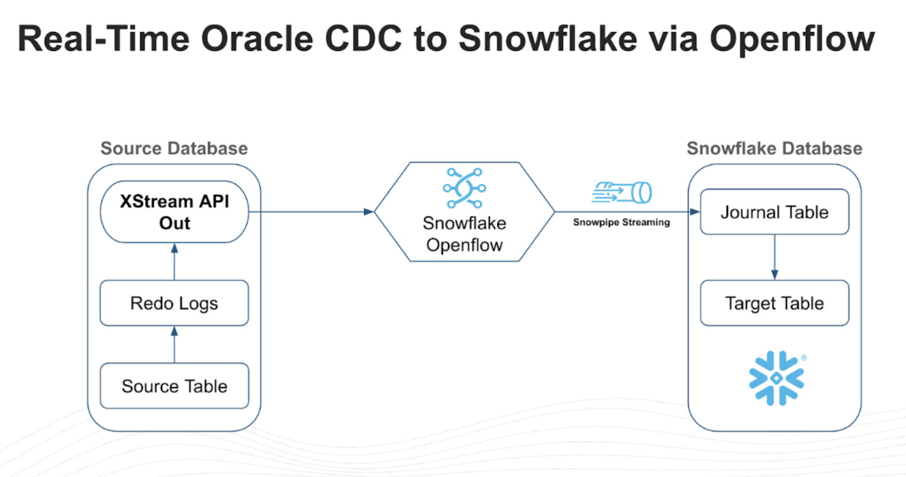

author: Vino Duraisamy, Sharvan Kumar
id: near-real-time-oracle-cdc-to-snowflake-using-openflow
categories: snowflake-site:taxonomy/solution-center/certification/quickstart, snowflake-site:taxonomy/product/data-engineering
language: en
summary: Learn how to set up near real-time Change Data Capture (CDC) replication from Oracle Database to Snowflake using the Snowflake Openflow Connector for Oracle.
environments: web
status: Published
feedback link: https://github.com/Snowflake-Labs/sfguides/issues


# Set Up Near Real-Time Oracle CDC to Snowflake Using Openflow
<!-- ------------------------ -->
## Overview

Organizations running mission-critical workloads on Oracle databases face a common challenge: how to make transactional data available for analytics and AI in near real time without impacting source system performance. Traditional batch ETL processes introduce hours or even days of latency, making real-time analytics and AI applications difficult to implement.

Change Data Capture (CDC) solves this by capturing only the data that has changed — inserts, updates, and deletes — directly from the database's transaction logs, rather than repeatedly scanning entire tables. This approach is lightweight, low-latency, and non-intrusive to the source system.

The [Snowflake Openflow Connector for Oracle](https://docs.snowflake.com/en/user-guide/data-integration/openflow/connectors/about-openflow-connectors) brings CDC natively into Snowflake.

Built on Oracle's XStream API and Snowflake's Openflow framework, the connector streams committed changes from Oracle redo logs into Snowflake target tables using Snowpipe Streaming, delivering end-to-end latency in seconds.

This guide walks you through the complete setup process, from configuring the Oracle database for XStream to deploying the Openflow connector in Snowflake.

### What is Change Data Capture (CDC)?

Change Data Capture is a design pattern that identifies and tracks changes made to data in a source database so that downstream systems can act on those changes. Instead of performing full table scans or scheduled bulk loads, CDC reads the database's transaction log to detect row-level inserts, updates, and deletes as they are committed.

| CDC Approach | How It Works | Trade-offs |
|-------------|-------------|------------|
| **Log-based** | Reads the database transaction/redo logs | Lowest latency, minimal source impact, captures all changes |
| **Trigger-based** | Database triggers fire on DML events | Adds overhead to every write operation |
| **Query-based** | Polls tables using timestamps or version columns | Misses deletes, adds query load to source |

The Openflow Connector for Oracle uses **log-based CDC** via Oracle's XStream API, which shares the same underlying technology as Oracle GoldenGate. This is the most efficient approach because it reads committed transactions directly from the redo logs without adding any load to the source database's query engine.

### What is Snowflake Openflow?

[Snowflake Openflow](https://docs.snowflake.com/en/user-guide/data-integration/openflow/about) is an open, extensible, managed data integration service built on Apache NiFi. It runs natively on Snowpark Container Services (SPCS) and provides curated connectors for streaming data from various sources into Snowflake.

For Oracle CDC, Openflow provides a zero-footprint, agentless architecture — there are no agents to install, manage, or patch on Oracle servers. The setup on the Oracle side is accomplished by a DBA running standard SQL commands, and from there, all integration is controlled within Snowflake.

### What You'll Learn
- How to configure Oracle Database for XStream-based CDC
- How to create XStream users, privileges, and outbound servers
- How to set up an Openflow deployment in Snowflake
- How to configure and start the Oracle CDC connector
- How to verify and monitor the replication pipeline

### What You'll Build
By the end of this guide, you'll have a working near real-time CDC pipeline that streams changes from Oracle Database into Snowflake using Openflow.

### Prerequisites
- A [Snowflake account](https://signup.snowflake.com/) in an AWS or Azure commercial region
- An Oracle Database (12c R2, 18c, 19c, 21c, 23ai, or 26ai) with SYSDBA access
- Network connectivity between Snowflake (SPCS) and the Oracle database (port 1521)
- Snowflake `ACCOUNTADMIN` or a role with Openflow admin privileges
- All Oracle source tables must have a **primary key** — tables without primary keys will silently fail to replicate

<!-- ------------------------ -->
## Architecture

The Openflow Connector reads logical change records (LCRs) directly from the XStream outbound server queue in near real time. These change events are then streamed immediately into Snowflake target tables using Snowpipe Streaming. This direct, memory-to-memory pipeline avoids landing data in intermediate files, resulting in fewer hops and points of failure.



| Component | Description |
|-----------|-------------|
| **Oracle Redo Logs** | Transaction logs that record every committed change in the database |
| **XStream Outbound Server** | Reads redo logs and exposes changes as logical change records (LCRs) |
| **Openflow Runtime** | Apache NiFi-based service running on Snowpark Container Services that consumes LCRs |
| **Snowpipe Streaming** | Low-latency ingestion API that loads change events into Snowflake target tables |

### Supported Environments

The connector supports Oracle Database versions 12c R2 (12.2), 18c, 19c, 21c, 23ai, and 26ai running on-premises, on Oracle Exadata, in OCI (VM/Bare Metal), and on AWS RDS Custom for Oracle.

For unique requirements, the replication flow is built on the flexible Openflow framework. Teams can open the Apache NiFi canvas to expand pipelines — for example, enriching data with lookups or masking sensitive PII before it reaches Snowflake.

<!-- ------------------------ -->
## Accept Oracle Connector Terms (ORGADMIN)

Before the Oracle connector is visible in the Openflow connector catalog, an organization administrator must accept the Oracle Connector commercial terms. This is a one-time step that is unique to the Oracle connector and is a prerequisite for every deployment.

### Steps

1. Sign in to Snowsight with a user that has the `ORGADMIN` role
2. Switch to the `ORGADMIN` role using the role selector
3. Navigate to **Admin > Terms**
4. Locate the **Openflow Connector for Oracle** terms entry
5. Review and accept the commercial terms

> **Important:** If the Oracle connector does not appear in the Openflow connector catalog when you reach the connector deployment step, it is almost certainly because this step was skipped. The connector will remain hidden until the ORGADMIN accepts the terms.

> **Note:** If you do not have access to the `ORGADMIN` role, contact your Snowflake organization administrator to complete this step.

### Choose Your Licensing Model

The Oracle connector offers two licensing models. You must select a model during the ORGADMIN terms acceptance step — this choice affects cost structure and contractual obligations.

| Model | Who It's For | Connector Fee | Trial | Commitment |
|-------|-------------|---------------|-------|------------|
| **Embedded** | Customers without an existing Oracle GoldenGate or XStream license | $110 per core per month | 60-day free trial | Auto-converts to a non-cancelable 36-month commitment on Day 61 |
| **Independent (BYOL)** | Customers with an existing Oracle GoldenGate or XStream license | $0 | N/A | None beyond existing Oracle license |

> **Warning:** The Embedded license 60-day trial automatically converts to a 36-month non-cancelable commitment if not cancelled before Day 61. Ensure you have internal approval before the trial expires.

For full licensing details, refer to the [Openflow Connector for Oracle documentation](https://docs.snowflake.com/en/user-guide/data-integration/openflow/connectors/about-openflow-connectors).

<!-- ------------------------ -->
## Setup Oracle Config

### Enable ARCHIVELOG Mode

Connect to Oracle as SYSDBA and verify that the database is in `ARCHIVELOG` mode. XStream requires this to read the redo logs.

```sql
sqlplus -L / as sysdba

SELECT log_mode FROM v$database;
```

If the database is not in `ARCHIVELOG` mode, enable it:

```sql
SHUTDOWN IMMEDIATE;
STARTUP MOUNT;
ALTER DATABASE ARCHIVELOG;
ALTER DATABASE OPEN;

SELECT log_mode FROM v$database;
```

> **Note:** Enabling `ARCHIVELOG` mode requires a database restart. Plan accordingly for production systems.

### Enable GoldenGate Replication

XStream requires GoldenGate replication to be enabled:

```sql
ALTER SYSTEM SET enable_goldengate_replication=TRUE SCOPE=BOTH;
```

### Set Streams Pool Size

Set an explicit memory allocation for the Streams pool to isolate XStream memory from the Buffer Cache. Without this, XStream dynamically borrows from the shared pool and can starve the Buffer Cache under load, risking instance instability.

```sql
ALTER SYSTEM SET STREAMS_POOL_SIZE = 2560M;
```

> **Important:** This is critical for production databases. The `STREAMS_POOL_SIZE` parameter reserves a dedicated memory region for XStream capture and apply processes. The 2560 MB value is a recommended starting point — adjust based on the number of schemas, transaction volume, and available SGA memory. Monitor usage with `SELECT * FROM V$SGASTAT WHERE pool = 'streams pool';`.

### Enable Supplemental Logging

Switch to the root container and enable supplemental logging for all columns:

```sql
ALTER SESSION SET CONTAINER = CDB$ROOT;
ALTER DATABASE ADD SUPPLEMENTAL LOG DATA (ALL) COLUMNS;
```

### Create XStream Tablespaces

Create tablespaces in both the root container and the pluggable database for the XStream administrator:

```sql
CREATE TABLESPACE xstream_adm_tbs
  DATAFILE '/opt/oracle/oradata/FREE/xstream_adm_tbs.dbf'
  SIZE 25M REUSE AUTOEXTEND ON MAXSIZE UNLIMITED;

ALTER SESSION SET CONTAINER = FREEPDB1;

CREATE TABLESPACE xstream_adm_tbs
  DATAFILE '/opt/oracle/oradata/FREE/FREEPDB1/xstream_adm_tbs.dbf'
  SIZE 25M REUSE AUTOEXTEND ON MAXSIZE UNLIMITED;

ALTER SESSION SET CONTAINER = CDB$ROOT;
```

> **Note:** Replace `FREEPDB1` and file paths with your actual PDB name and Oracle data directory.

### Create XStream Administrator

Create a common user (prefixed with `c##`) that will administer XStream:

```sql
CREATE USER c##xstreamadmin IDENTIFIED BY "XStreamAdmin123!"
  DEFAULT TABLESPACE xstream_adm_tbs
  QUOTA UNLIMITED ON xstream_adm_tbs
  CONTAINER=ALL;
```

Grant the required privileges:

```sql
GRANT CREATE SESSION, SET CONTAINER, EXECUTE ANY PROCEDURE, LOGMINING
  TO c##xstreamadmin CONTAINER=ALL;

GRANT SELECT ANY TABLE TO c##xstreamadmin CONTAINER=ALL;
GRANT FLASHBACK ANY TABLE TO c##xstreamadmin CONTAINER=ALL;
GRANT SELECT ANY TRANSACTION TO c##xstreamadmin CONTAINER=ALL;
```

Grant XStream admin privileges. The correct approach depends on your Oracle version:

**Oracle 23ai / 26ai:**

```sql
GRANT XSTREAM_CAPTURE TO c##xstreamadmin CONTAINER=ALL;
GRANT XSTREAM_ADMIN TO c##xstreamadmin CONTAINER=ALL;
```

**Oracle 19c / 21c:**

The `XSTREAM_CAPTURE` and `XSTREAM_ADMIN` roles do not exist on 19c and 21c. Using `GRANT XSTREAM_CAPTURE` on these versions will silently fail. Use the `DBMS_XSTREAM_AUTH` package instead:

```sql
BEGIN
  DBMS_XSTREAM_AUTH.GRANT_ADMIN_PRIVILEGE(
    grantee                => 'c##xstreamadmin',
    privilege_type         => 'CAPTURE',
    grant_select_privileges => TRUE,
    container              => 'ALL'
  );
END;
/
```

> **Important:** The majority of production Oracle deployments run 19c or 21c. If you use the 23ai-style `GRANT XSTREAM_CAPTURE` on these versions, the grant silently fails and the XStream outbound server will not start. Verify your Oracle version with `SELECT * FROM v$version;` before proceeding.

### Create XStream Connect User

Create the user that the Openflow connector will use to connect:

```sql
CREATE USER c##connectuser IDENTIFIED BY "ConnectUser123!"
  CONTAINER=ALL;

GRANT CREATE SESSION, SELECT_CATALOG_ROLE TO c##connectuser CONTAINER=ALL;
GRANT SELECT ANY TABLE TO c##connectuser CONTAINER=ALL;
GRANT LOCK ANY TABLE TO c##connectuser CONTAINER=ALL;
GRANT SELECT ANY DICTIONARY TO c##connectuser CONTAINER=ALL;
```

### Create XStream Outbound Server

Create an XStream outbound server that captures changes from the schemas you want to replicate:

```sql
SET SERVEROUTPUT ON;

DECLARE
    tables  DBMS_UTILITY.UNCL_ARRAY;
    schemas DBMS_UTILITY.UNCL_ARRAY;
BEGIN
    tables(1)  := NULL;
    schemas(1) := 'HR';
    schemas(2) := 'CO';

    DBMS_XSTREAM_ADM.CREATE_OUTBOUND(
        server_name           => 'XOUT1',
        table_names           => tables,
        schema_names          => schemas,
        source_container_name => 'FREEPDB1',
        include_ddl           => TRUE
    );
END;
/
```

> **Note:** Replace `HR` and `CO` with the schemas you want to replicate.

### Assign Users to the Outbound Server

```sql
BEGIN
    DBMS_XSTREAM_ADM.ALTER_OUTBOUND(
        server_name  => 'XOUT1',
        connect_user => 'c##connectuser');
END;
/

BEGIN
    DBMS_XSTREAM_ADM.ALTER_OUTBOUND(
        server_name  => 'XOUT1',
        capture_user => 'c##xstreamadmin');
END;
/
```

### Verify Oracle Configuration

Run the following queries to confirm the Oracle database is correctly configured:

```sql
SELECT server_name, status, connect_user, capture_user
FROM dba_xstream_outbound;

SELECT supplemental_log_data_min, supplemental_log_data_pk, supplemental_log_data_all
FROM v$database;

SELECT con_id, username, account_status
FROM cdb_users
WHERE username IN ('C##XSTREAMADMIN', 'C##CONNECTUSER')
ORDER BY con_id;

SELECT name, value FROM v$parameter
WHERE name = 'enable_goldengate_replication';

SELECT CAPTURE_NAME, STATE, TOTAL_MESSAGES_CAPTURED, TOTAL_MESSAGES_ENQUEUED
FROM V$XSTREAM_CAPTURE;
```

| Check | Expected Value |
|-------|---------------|
| Outbound server `status` | `ENABLED` or `ATTACHED` |
| `supplemental_log_data_all` | `YES` |
| User `account_status` | `OPEN` |
| `enable_goldengate_replication` | `TRUE` |

### Connection Parameters

Record these values for use when configuring the Openflow connector:

| Parameter | Value |
|-----------|-------|
| **Host** | `<InstancePublicIp>` or `<InstancePrivateIp>` |
| **Port** | `1521` |
| **Service** | `FREEPDB1` |
| **Username** | `c##connectuser` |
| **Password** | `ConnectUser123!` |
| **XStream Server** | `XOUT1` |

<!-- ------------------------ -->
## Set Up Openflow in Snowflake

### Create the Openflow Admin Role

```sql
USE ROLE ACCOUNTADMIN;

CREATE ROLE IF NOT EXISTS OPENFLOW_ADMIN;
GRANT ROLE OPENFLOW_ADMIN TO USER <OPENFLOW_USER>;

GRANT CREATE OPENFLOW DATA PLANE INTEGRATION ON ACCOUNT TO ROLE OPENFLOW_ADMIN;
GRANT CREATE OPENFLOW RUNTIME INTEGRATION ON ACCOUNT TO ROLE OPENFLOW_ADMIN;
GRANT CREATE COMPUTE POOL ON ACCOUNT TO ROLE OPENFLOW_ADMIN;
```

> **Note:** Users with a default role of `ACCOUNTADMIN` cannot log in to Openflow runtimes. Set a different default role for Openflow users.

### Create an Openflow Deployment

Navigate to **Snowsight > Ingestion > Openflow** and create a new Openflow - Snowflake Deployment. This provisions the Openflow infrastructure on Snowpark Container Services (SPCS).

After creating the deployment, you must:

1. **Create a Snowflake role** for the connector (see next section)
2. **Create a runtime** within the deployment — this is where your data flows execute
3. **Configure allowed domains** so the runtime can reach your Oracle host

For detailed deployment steps, refer to the [Set up Openflow - Snowflake Deployment](https://docs.snowflake.com/en/user-guide/data-integration/openflow/setup-openflow-spcs) documentation.

### Create a Snowflake Role for the Connector

```sql
CREATE ROLE IF NOT EXISTS openflow_oracle_role;

GRANT USAGE ON DATABASE <destination_database> TO ROLE openflow_oracle_role;
GRANT CREATE SCHEMA ON DATABASE <destination_database> TO ROLE openflow_oracle_role;
GRANT USAGE ON WAREHOUSE <warehouse_name> TO ROLE openflow_oracle_role;
```

> **Note:** The connector automatically creates target schemas and tables at runtime. Database-level `CREATE SCHEMA` is required — schema-level grants alone will cause permission errors because the schemas do not exist yet when the connector starts.

### Configure Network Access

Create a network rule to allow the Openflow runtime to reach the Oracle database:

```sql
CREATE OR REPLACE NETWORK RULE oracle_network_rule
  MODE = EGRESS
  TYPE = HOST_PORT
  VALUE_LIST = ('<oracle_host>:1521');
```

<!-- ------------------------ -->
## Configure the Oracle Connector

### Open the Openflow UI

Navigate to **Snowsight > Ingestion > Openflow**, select your deployment, and open the Openflow runtime UI.

### Deploy the Connector

1. In the Openflow UI, select **Add Connector**
2. Choose **Openflow Connector for Oracle**

### Configure the Connection

Provide the Oracle connection parameters recorded during the verification step:

| Parameter | Value |
|-----------|-------|
| Host | `<oracle_host_ip_or_dns>` |
| Port | `1521` |
| Service Name | `FREEPDB1` |
| Username | `c##connectuser` |
| Password | `ConnectUser123!` |
| XStream Outbound Server | `XOUT1` |

### Configure the Replication Scope

Select which schemas and tables to replicate:

- **Schemas:** `HR`, `CO` (or whichever schemas you configured in the XStream outbound server)
- **Tables:** Select specific tables or replicate all tables within the selected schemas

### Configure the Snowflake Target

| Parameter | Value |
|-----------|-------|
| Target Database | `<your_target_database>` |
| Target Schema | `<your_target_schema>` |
| Table Naming | Match source table names (default) |

### Start the Connector

1. Enable the connector in the Openflow UI
2. The connector performs an **initial snapshot** (full load) of the selected tables
3. After the snapshot completes, the connector switches to **CDC mode** and streams ongoing changes

<!-- ------------------------ -->
## Verify and Monitor

### Verify Data in Snowflake

```sql
SHOW TABLES IN SCHEMA <target_db>.<target_schema>;

SELECT * FROM <target_db>.<target_schema>.<table_name> LIMIT 10;

SELECT COUNT(*) FROM <target_db>.<target_schema>.<table_name>;
```

### Test CDC Replication

On the Oracle source, insert a test row and verify it appears in Snowflake:

```sql
-- On Oracle
INSERT INTO hr.employees (employee_id, first_name, last_name, email)
VALUES (9999, 'Test', 'User', 'test@example.com');
COMMIT;
```

```sql
-- On Snowflake (should appear within seconds)
SELECT * FROM <target_db>.<target_schema>.employees
WHERE employee_id = 9999;
```

### Monitor the Pipeline

Use the Openflow UI to check connector status, throughput, and error counts. On the Oracle side, verify the capture process:

```sql
SELECT CAPTURE_NAME, STATE, TOTAL_MESSAGES_CAPTURED, TOTAL_MESSAGES_ENQUEUED
FROM V$XSTREAM_CAPTURE;

SELECT server_name, status, connect_user, capture_user
FROM dba_xstream_outbound;
```

<!-- ------------------------ -->
## Troubleshooting

### XStream Outbound Server Not Running

```sql
SELECT server_name, status FROM dba_xstream_outbound;

BEGIN
    DBMS_XSTREAM_ADM.ALTER_OUTBOUND(
        server_name => 'XOUT1',
        status      => 'ENABLED'
    );
END;
/
```

### Capture Process Not Starting

```sql
SELECT capture_name, status FROM dba_capture;

BEGIN
    DBMS_CAPTURE_ADM.START_CAPTURE('XSTREAM_CAPTURE');
END;
/
```

### Supplemental Logging Issues

```sql
SELECT supplemental_log_data_min, supplemental_log_data_pk, supplemental_log_data_all
FROM v$database;

ALTER DATABASE ADD SUPPLEMENTAL LOG DATA;
ALTER DATABASE ADD SUPPLEMENTAL LOG DATA (ALL) COLUMNS;
ALTER DATABASE ADD SUPPLEMENTAL LOG DATA (PRIMARY KEY) COLUMNS;
```

### Network Connectivity

- Ensure the Oracle host and port (1521) are accessible from the Snowflake SPCS compute pool
- Verify the external access integration and network rules are correctly configured
- Test connectivity using the Openflow UI's connection test feature

<!-- ------------------------ -->
## Cleanup

To remove the XStream configuration from Oracle:

```sql
BEGIN
    DBMS_XSTREAM_ADM.DROP_OUTBOUND('XOUT1');
END;
/

DROP USER c##xstreamadmin CASCADE;
DROP USER c##connectuser CASCADE;

ALTER DATABASE DROP SUPPLEMENTAL LOG DATA (ALL) COLUMNS;

ALTER SYSTEM SET enable_goldengate_replication=FALSE SCOPE=BOTH;
```

<!-- ------------------------ -->
## Conclusion And Resources

Congratulations! You've successfully set up a near real-time CDC pipeline from Oracle Database to Snowflake using the Openflow Connector for Oracle. Changes made in your Oracle source are now captured via XStream and streamed into Snowflake within seconds.

### What You Learned
- **Oracle XStream configuration** - Enabling ARCHIVELOG mode, GoldenGate replication, supplemental logging, and creating XStream users and outbound servers
- **Openflow deployment** - Setting up the Openflow runtime in Snowflake on Snowpark Container Services
- **Connector configuration** - Connecting the Oracle CDC connector to the XStream outbound server and configuring replication scope
- **Verification and monitoring** - Validating data replication and monitoring pipeline health

### Related Resources

Snowflake Documentation:
- [Openflow Overview](https://docs.snowflake.com/en/user-guide/data-integration/openflow/about)
- [Openflow Connectors](https://docs.snowflake.com/en/user-guide/data-integration/openflow/connectors/about-openflow-connectors)
- [Set up Openflow - Snowflake Deployment](https://docs.snowflake.com/en/user-guide/data-integration/openflow/setup-openflow-spcs)
- [Manage Openflow](https://docs.snowflake.com/en/user-guide/data-integration/openflow/manage)
- [Monitor Openflow](https://docs.snowflake.com/en/user-guide/data-integration/openflow/monitor)

Video:
- [How-to Set Up Near Real-Time Oracle CDC to Snowflake using Openflow](https://www.youtube.com/watch?v=nLGnb1VoJuc)

GitHub:
- [Oracle Free 23ai Snowflake Openflow Setup](https://github.com/sharvankumar/oracle-free23-snowflake-openflow) - Oracle XStream setup script and configuration reference
