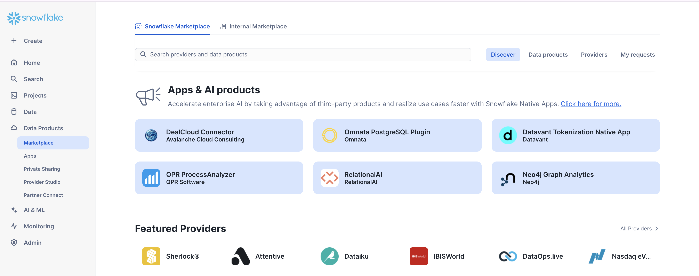
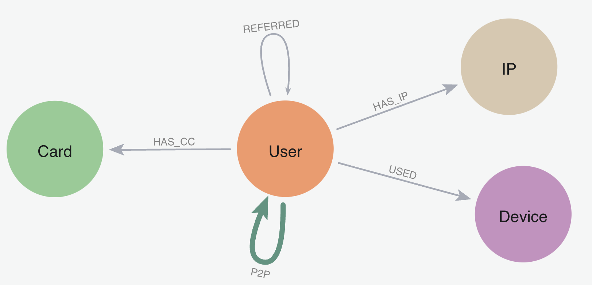
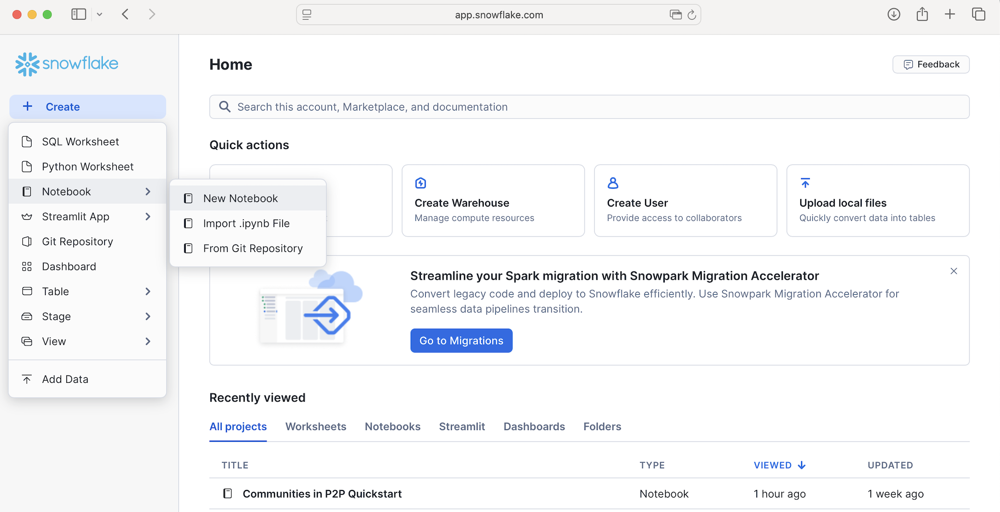
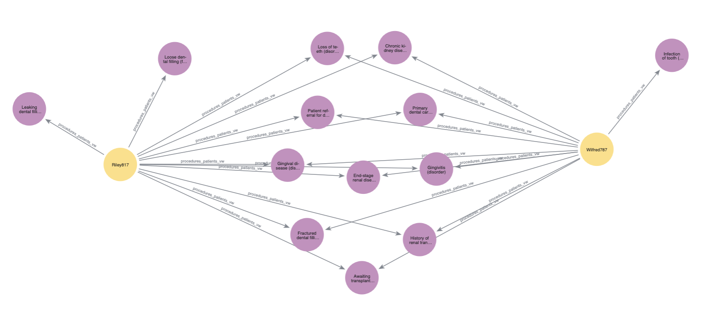

author: corydon baylor
id: neo4j-fraud
categories: snowflake-site:taxonomy/product/analytics, snowflake-site:taxonomy/snowflake-feature/business-intelligence, snowflake-site:taxonomy/industry/financial-services
summary: How to find communities affected by fraud using louvain in Neo4j Graph Analytics for Snowflake 
environments: web
status: Published
feedback link: https://github.com/Snowflake-Labs/sfguides/issues
language: en


# Discover Fraudulent Communities in Financial Services Data with Neo4j Graph Analytics
<!-- ------------------------ -->
## Overview

### What Is Neo4j Graph Analytics For Snowflake? 

Neo4j helps organizations find hidden relationships and patterns across billions of data connections deeply, easily, and quickly. **Neo4j Graph Analytics for Snowflake** brings to the power of graph directly to Snowflake, allowing users to run 65+ ready-to-use algorithms on their data, all without leaving Snowflake! 

### Discovering Communities In P2P Fraud
P2P Fraud Losses are Skyrocketing. 8% of banking customers reported being victims of P2P Scams in the past year, and the average loss to these scams was $176.

Finding different communities within P2P transactions is the first step towards identifying and ultimately ending P2P fraud. 

### Prerequisites
- The Native App [Neo4j Graph Analytics](https://app.snowflake.com/marketplace/listing/GZTDZH40CN) for Snowflake
  
### What You Will Need
- A [Snowflake account](https://signup.snowflake.com/?utm_source=snowflake-devrel&utm_medium=developer-guides&utm_cta=developer-guides) with appropriate access to databases and schemas.
- Neo4j Graph Analytics application installed from the Snowflake marketplace. Access the marketplace via the menu bar on the left hand side of your screen, as seen below:


### What You Will Build
- A method to identify communities that are at high risk of fraud in P2P networks
  
### What You Will Learn
- How to prepare and project your data for graph analytics
- How to use community detection to identify fraud
- How to read and write directly from and to your snowflake tables

<!-- ------------------------ -->
## Loading The Data

Dataset overview : This dataset is modelled to design and analyze a peer to peer transaction network to identify fraudulent activity using graph analytics. 



Let's name our database `P2P_DEMO`. Using the CSVs found [here](https://drive.google.com/drive/u/1/folders/1BnAnRSEfuwDvc4eQH8IRvy3tUkwOeaNf), We are going to add two new tables:

- One called `P2P_TRANSACTIONS` based on the p2p_transactions.csv
- One called `P2P_USERS based` on p2p_users.csv

Follow the steps found [here](https://docs.snowflake.com/en/user-guide/data-load-web-ui) to load in your data.

<!-- ------------------------ -->
## Setting Up

### Import The Notebook
- We’ve provided a Colab notebook to walk you through each SQL and Python step—no local setup required!
- Download the .ipynb found [here](https://github.com/neo4j-product-examples/snowflake-graph-analytics/tree/main/QuickStarts/Python%20Notebooks), and import the notebook into snowflake.
  
- Don't forget to install streamlit and python package before you run.

### Permissions
Before we run our algorithms, we need to set the proper permissions. But before we get started granting different roles, we need to ensure that you are using `accountadmin` to grant and create roles. Lets do that now:

```sql
-- you must be accountadmin to create role and grant permissions
use role accountadmin;
```

Next let's set up the necessary roles, permissions, and resource access to enable Graph Analytics to operate on data within the `p2p_demo.public schema`. It creates a consumer role (gds_user_role) for users and administrators, grants the Neo4j Graph Analytics application access to read from and write to tables and views, and ensures that future tables are accessible. 

It also provides the application with access to the required compute pool and warehouse resources needed to run graph algorithms at scale.

```sql
-- Use a role with the required privileges
USE ROLE ACCOUNTADMIN;

-- Create a consumer role for users of the Graph Analytics application
CREATE ROLE IF NOT EXISTS MY_CONSUMER_ROLE;
GRANT APPLICATION ROLE Neo4j_Graph_Analytics.app_user TO ROLE MY_CONSUMER_ROLE;
SET MY_USER = (SELECT CURRENT_USER());
GRANT ROLE MY_CONSUMER_ROLE TO USER IDENTIFIER($MY_USER);

USE SCHEMA NEO4J_PATIENT_DB.PUBLIC;
CREATE TABLE NODES (nodeId Number);
INSERT INTO NODES VALUES (1), (2), (3), (4), (5), (6);
CREATE TABLE RELATIONSHIPS (sourceNodeId Number, targetNodeId Number);
INSERT INTO RELATIONSHIPS VALUES (1, 2), (2, 3), (4, 5), (5, 6);

-- Grants needed for the app to read consumer data stored in tables and views, using a database role
USE DATABASE NEO4J_PATIENT_DB;
CREATE DATABASE ROLE IF NOT EXISTS MY_DB_ROLE;
GRANT USAGE ON DATABASE NEO4J_PATIENT_DB TO DATABASE ROLE MY_DB_ROLE;
GRANT USAGE ON SCHEMA NEO4J_PATIENT_DB.PUBLIC TO DATABASE ROLE MY_DB_ROLE;
GRANT SELECT ON ALL TABLES IN SCHEMA NEO4J_PATIENT_DB.PUBLIC TO DATABASE ROLE MY_DB_ROLE;
GRANT SELECT ON ALL VIEWS IN SCHEMA NEO4J_PATIENT_DB.PUBLIC TO DATABASE ROLE MY_DB_ROLE;
-- Future tables also include tables that are created by the application itself.
-- This is useful as many use-cases require running algorithms in a sequence and using the output of a prior algorithm as input.
GRANT SELECT ON FUTURE TABLES IN SCHEMA NEO4J_PATIENT_DB.PUBLIC TO DATABASE ROLE MY_DB_ROLE;
GRANT SELECT ON FUTURE VIEWS IN SCHEMA NEO4J_PATIENT_DB.PUBLIC TO DATABASE ROLE MY_DB_ROLE;
GRANT CREATE TABLE ON SCHEMA NEO4J_PATIENT_DB.PUBLIC TO DATABASE ROLE MY_DB_ROLE;
GRANT DATABASE ROLE MY_DB_ROLE TO APPLICATION Neo4j_Graph_Analytics;

-- Ensure the consumer role has access to tables created by the application
GRANT USAGE ON DATABASE NEO4J_PATIENT_DB TO ROLE MY_CONSUMER_ROLE;
GRANT USAGE ON SCHEMA NEO4J_PATIENT_DB.PUBLIC TO ROLE MY_CONSUMER_ROLE;
GRANT SELECT ON FUTURE TABLES IN SCHEMA NEO4J_PATIENT_DB.PUBLIC TO ROLE MY_CONSUMER_ROLE;

-- Use the consumer role to run the algorithm and inspect the output
USE ROLE MY_CONSUMER_ROLE;
```


<!-- ------------------------ -->
## Cleaning Our Data

We need our data to be in a particular format in order to work with Graph Analytics. In general it should be like so:

### For The Table Representing Nodes:

The first column should be called `nodeId`, which represents the ids for the each node in our graph

### For The table Representing Relationships:

We need to have columns called `sourceNodeId` and `targetNodeId`. These will tell Graph Analytics the direction of the transaction, which in this case means:
- Who sent the money (sourceNodeId) and
- Who received it (targetNodeId)
- We also include a total_amount column that acts as the weights in the relationship

We are then going to clean this up into two tables that just have the nodeids for both patient and procedure:

```sql
CREATE OR REPLACE TABLE NEO4J_PATIENT_DB.PUBLIC.PATIENT_NODE_MAPPING (nodeId) AS
SELECT DISTINCT p.ID from NEO4J_PATIENT_DB.PUBLIC.PATIENTS p;

CREATE OR REPLACE TABLE NEO4J_PATIENT_DB.PUBLIC.PROCEDURE_NODE_MAPPING (nodeId) AS
SELECT DISTINCT p.code from NEO4J_PATIENT_DB.PUBLIC.PROCEDURES p;
```

In order to keep this managable, we are just going to look at patients (and what procedures they underwent) in the context of kidney disease. So first we will filter down patients to only include those with kidney disease:

```sql
// create a subset of patients that have had any of the 4 kidney disease codes
CREATE OR REPLACE VIEW KidneyPatients_vw (nodeId) AS
    SELECT DISTINCT PATIENT_NODE_MAPPING.NODEID as nodeId
    FROM PROCEDURES
            JOIN PATIENT_NODE_MAPPING ON PATIENT_NODE_MAPPING.NODEID = PROCEDURES.PATIENT
    WHERE PROCEDURES.REASONCODE IN (431857002,46177005,161665007,698306007)
;
```
<!-- ------------------------ -->
Then we will only look at the procedures that those kidney patients have undergone:
```sql

// There are ~400K procedures - it is doubtful that the kidney patients even have used a small
// fraction of those.  To reduce GDS memory and speed algorithm execution, we want to load
// only those procedures that kidney patients have had.
CREATE OR REPLACE VIEW KidneyPatientProcedures_vw (nodeId) AS
    SELECT DISTINCT PROCEDURE_NODE_MAPPING.NODEID as nodeId
    FROM PROCEDURES
        JOIN PROCEDURE_NODE_MAPPING ON PROCEDURE_NODE_MAPPING.nodeId = PROCEDURES.CODE
        JOIN KIDNEYPATIENTS_VW ON PATIENT = PROCEDURES.PATIENT;

// create the relationship view of kidney patients to the procedures they have had
CREATE OR REPLACE VIEW KidneyPatientProcedure_relationship_vw (sourceNodeId, targetNodeId) AS
    SELECT DISTINCT PATIENT_NODE_MAPPING.NODEID as sourceNodeId, PROCEDURE_NODE_MAPPING.NODEID as targetNodeId
    FROM PATIENT_NODE_MAPPING
         JOIN PROCEDURES ON PROCEDURES.PATIENT = PATIENT_NODE_MAPPING.NODEID
         JOIN PROCEDURE_NODE_MAPPING ON PROCEDURE_NODE_MAPPING.NODEID = PROCEDURES.CODE;

```
## Visualize Your Graph


At this point, you may want to visualize your graph to get a better understanding of how everything fits together. Specifically, you may be interested in better understanding your results. Why exactly are any given two patients considered similar?

Let’s start by filtering down our data to two patients who are considered very similar. They have the following patient ids:

- `a5814a17-303e-1d23-64d3-dd4b54170d16`
- `87069a85-19bf-7d81-0cfe-609b3427d096`

```sql
CREATE OR REPLACE VIEW KidneyPatient_viz_vw (nodeId, title, label) AS
SELECT
    k.nodeId,
    p.first AS title,
    'blue' as label
FROM KidneyPatients_vw k
LEFT JOIN patients p
  ON k.nodeId = p.id
WHERE k.nodeId IN (
  'a5814a17-303e-1d23-64d3-dd4b54170d16',
  '87069a85-19bf-7d81-0cfe-609b3427d096'
);

-- this represents the procedures those patients underwent (and will be our relationship table
-- for the below visualization)
CREATE OR REPLACE VIEW NEO4J_PATIENT_DB.PUBLIC.procedures_patients_vw AS
SELECT DISTINCT
    p.patient as sourcenodeid,
    p.reasoncode as targetnodeid
FROM NEO4J_PATIENT_DB.PUBLIC.PROCEDURES p
JOIN KidneyPatient_viz_vw k
  ON CAST(p.PATIENT AS STRING) = CAST(k.nodeId AS STRING);

-- now we look at the procedures in our example
CREATE OR REPLACE VIEW procedures_viz_vw (nodeId, title, label) AS
SELECT DISTINCT
    pp.targetnodeid AS nodeId,
    p.reasondescription AS caption,
    'red' as label
FROM procedures_patients_vw pp
LEFT JOIN procedures p
    ON pp.targetnodeid = p.reasoncode
WHERE pp.targetnodeid IS NOT NULL
  AND TRIM(pp.targetnodeid) <> '';

```
Now we can use the neo4j_viz python package to create the actual visualization. You can learn more about how it works [here](https://neo4j.com/docs/snowflake-graph-analytics/current/visualization/), but for this example, we are just going to customize two things. First, we will use the “label” property of our nodes (which we defined in the SQL query above) to set the colors. Like so:

```python

from neo4j_viz.snowflake import from_snowflake
from snowflake.snowpark.context import get_active_session

session = get_active_session()

viz_graph = from_snowflake(
    session,
    {
    'nodeTables': ['NEO4J_PATIENT_DB.public.KidneyPatient_viz_vw',
                   'NEO4J_PATIENT_DB.public.procedures_viz_vw'
    ],
    'relationshipTables': {
      'NEO4J_PATIENT_DB.public.procedures_patients_vw': {
        'sourceTable': 'NEO4J_PATIENT_DB.public.KidneyPatient_viz_vw',
        'targetTable': 'NEO4J_PATIENT_DB.public.procedures_viz_vw'
      }
    }
    }
)

viz_graph.color_nodes(property='LABEL', override=True)

for node in viz_graph.nodes:
    node.caption = str(node.properties["TITLE"])

html_object = viz_graph.render()

import streamlit.components.v1 as components

components.html(html_object.data, height=600)
```



## Running Your Algorithms

Now we are finally at the step where we create a projection, run our algorithms, and write back to snowflake. We will run louvain to determine communities within our data. Louvain identifies communities by grouping together nodes that have more connections to each other than to nodes outside the group.

You can find more information about writing this function in our [documentation](https://neo4j.com/docs/snowflake-graph-analytics/current/getting-started/).

You can use this code block as an outline of what you need to fill in:

```
CALL neo4j_graph_analytics.graph.louvain('COMPUTE_POOL', {
    'project': {
        'nodeTables': ['EXAMPLE_DB.DATA_SCHEMA.NODES'],
        'relationshipTables': {
            'EXAMPLE_DB.DATA_SCHEMA.RELATIONSHIPS': {
                'sourceTable': 'EXAMPLE_DB.DATA_SCHEMA.NODES',
                'targetTable': 'EXAMPLE_DB.DATA_SCHEMA.NODES',
                'orientation': 'NATURAL'
            }
        }
    },
    'compute': { 'consecutiveIds': true },
    'write': [{
        'nodeLabel': 'NODES',
        'outputTable': 'EXAMPLE_DB.DATA_SCHEMA.NODES_COMPONENTS'
    }]
});
```

```sql
CALL neo4j_graph_analytics.graph.node_similarity('CPU_X64_L', {
  'project': {
    'defaultTablePrefix': 'neo4j_patient_db.public',
    'nodeTables': ['KidneyPatients_vw','KidneyPatientProcedures_vw'],
    'relationshipTables': {
      'KidneyPatientProcedure_relationship_vw': {
        'sourceTable': 'KidneyPatients_vw',
        'targetTable': 'KidneyPatientProcedures_vw'
      }
    }
  },
  'compute': { 'topK': 10,
                'similarityCutoff': 0.3,
                'similarityMetric': 'JACCARD'
            },
  'write': [
    {
    'sourceLabel': 'KidneyPatients_vw',
    'targetLabel': 'KidneyPatients_vw',
    'relationshipProperty': 'similarity',
    'outputTable':  'neo4j_patient_db.public.PATIENT_PROCEDURE_SIMILARITY'
    }
  ]
});
```
Let’s take a look at the results!

```sql
SELECT SOURCENODEID, TARGETNODEID, SIMILARITY
FROM NEO4J_PATIENT_DB.PUBLIC.PATIENT_PROCEDURE_SIMILARITY
LIMIT 10;
```

You can see the similarity score between one patient and a set of another patients. The higher the similarity score the more similar the patients. From this, we could develop personalize plans based on other patients experiences.

For example, if a patient had undergone 4 out of 5 of another patients procedures, we might predict that they will likely undergo the fifth procedure as well!

### Sort Into Groups
Using the similarity scores we just calculated, we can then sort our patients into groups based on our related patients pairs and their similarity score using louvain:

```sql
CALL Neo4j_Graph_Analytics.graph.louvain('CPU_X64_XS', {
    'defaultTablePrefix': 'neo4j_patient_db.public',
    'project': {
        'nodeTables': [ 'KidneyPatients_vw' ],
        'relationshipTables': {
            'PATIENT_PROCEDURE_SIMILARITY': {
                'sourceTable': 'KidneyPatients_vw',
                'targetTable': 'KidneyPatients_vw',
                'orientation': 'UNDIRECTED'
            }
        }
    },
    'compute': {
        'mutateProperty': 'community_id',
        'relationshipWeightProperty': 'SIMILARITY'

    },
    'write': [{
        'nodeLabel': 'KidneyPatients_vw',
        'outputTable': 'patient_community',
        'nodeProperty': 'community_id'
    }]
});
```

##  Conclusions And Resources

In this quickstart, you learned how to bring the power of graph insights into Snowflake using Neo4j Graph Analytics. 

### What You Learned
By working with a P2P transaction dataset, you were able to:

1. Set up the [Neo4j Graph Analytics](https://app.snowflake.com/marketplace/listing/GZTDZH40CN/neo4j-neo4j-graph-analytics) application within Snowflake.
2. Prepare and project your data into a graph model (users as nodes, transactions as relationships).
3. Ran Louvain community detection to identify clusters of users with high internal interaction.

### Resources

- [Neo4j Graph Analytics Documentation](https://neo4j.com/docs/snowflake-graph-analytics/)
- [Installing Neo4j Graph Analytics on SPCS](https://neo4j.com/docs/snowflake-graph-analytics/installation/)
