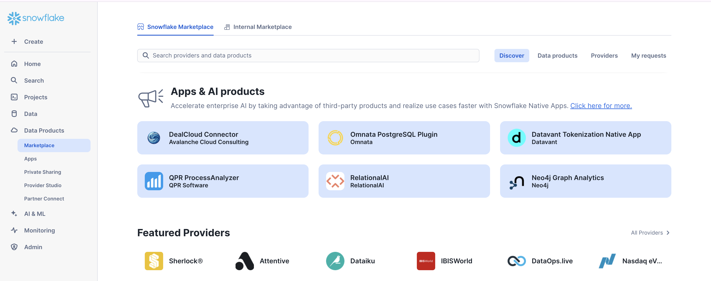

author: Indu Jayapal
id: insurance-fraud
summary: Identify insurance fraud using graph analytics
categories: Getting-Started
environments: web
status: Published 
feedback link: https://github.com/Snowflake-Labs/sfguides/issues
tags: Getting Started, Data Science, Data Engineering 

# Detecting Insurance Fraud Using Graph Algorithms with Neo4j
---
## Overview 

Duration: 2 mins

### What Is Neo4j Graph Analytics For Snowflake?

Neo4j helps organizations find hidden relationships and patterns across billions of data connections deeply, easily, and quickly. Neo4j Graph Analytics for Snowflake brings to the power of graph directly to Snowflake, allowing users to run 65+ ready-to-use algorithms on their data, all without leaving Snowflake!

### Identify Communities of Fraudulent Claims

Insurance fraud is estimated to drain \$308–309 billion annually, affecting all lines—including auto, health, property & casualty, and workers’ compensation. As a result, the average U.S. family pays an extra \$400–\$700 per year in premiums. This highlights the critical need for early detection of fraudulent claims to prevent such substantial financial losses.

### Prerequisites
The Native App [Neo4j Graph Analytics](https://app.snowflake.com/marketplace/listing/GZTDZH40CN/neo4j-neo4j-graph-analytics) for Snowflake

### What You Will Need:
- A [Snowflake account](https://signup.snowflake.com/) with appropriate access to databases and schemas.
- Neo4j Graph Analytics application installed from the Snowflake marketplace. Access the marketplace via the menu bar on the left hand side of your screen, as seen below: 



### What You Will Build:
- A method to compare complex insurance cases to one another and identify the ones that are at risk of being fraudulent.  

### What You Will Learn:

- How to prepare and project your data for graph analytics
- How to use Weakly Connected Components to identify potential clusters of fraudulent activity
- How to create node embeddings to understand the structure of the graph 
- How to use K-nearest neighbors algorithm to find highly similar nodes in the graph
- How to read and write directly from and to your Snowflake tables


## Load the Data

Duration 5 

### Dataset Overview:
This dataset is designed to model and analyze insurance claims for the purpose of identifying fraudulent activity using graph analytics. Given the complexity of the data model, all contextual relationships captured in the graph will be leveraged when comparing claims. This will enable deeper insights beyond isolated data points.

For the purposes of the demo, the database will be named `I_DEMO`. Using the CSV, `insurance_claims_full.csv`, found [here](https://github.com/neo4j-product-examples/snowflake-graph-analytics/blob/main/insurance-fraud/insurance_claims_full.csv), we are going to create a new table called `insurance_claims_full` via the Snowsight data upload method. 

Follow through this Snowflake [documentation](https://docs.snowflake.com/en/user-guide/data-load-web-ui) on creating a table from 'Load data using the web interface'.

In the pop up, 
1. Upload the CSV `insurance_claims_full.csv` using the browse option. 
2. Under `Select or create a database and schema`, please create a database with name `I_DEMO`.
3. Under `Select or create a table`, please click on the '+' symbol and create a new table named `insurance_claims_full`.

Now, a new table named `insurance_claims_full` will be created under `i_demo.public` with the provided CSV.

## Set Up

Duration 5 

### Import the Notebook
- We’ve provided a Colab notebook to walk you through each SQL and Python step—no local setup required!
- Download the .ipynb found [here](https://github.com/neo4j-product-examples/snowflake-graph-analytics/blob/main/insurance-fraud/INSURANCE_SNOWFLAKE_DEMO.ipynb), and import the notebook into snowflake. Just ensure that each cell is read by snowflake as a SQL cell.

### Permissions
One of the most usefull aspects of Snowflake is the ability to have roles with specific permissions, so that you can have many people working in the same database without worrying about security. The Neo4j app requires the creation of a few different roles. But before we get started granting different roles, we need to ensure that you are using `accountadmin` to grant and create roles. Lets do that now:

```
USE ROLE ACCOUNTADMIN;
```
Next we can set up the necessary roles, permissions, and resource access to enable Graph Analytics to operate on the demo data within the `i_demo.public` schema (this schema is where the data will be stored by default). 

We will create a consumer role (gds_role) for users and administrators, grant the gds_role and GDS application access to read from and write to tables and views, and ensure the future tables are accessible. We will also provide the application with access to the compute pool and warehouse resources required to run the graph algorithms at scale.


```
-- Create an account role to manage the GDS application
CREATE ROLE IF NOT EXISTS gds_role;
GRANT APPLICATION ROLE neo4j_graph_analytics.app_user TO ROLE gds_role;
GRANT APPLICATION ROLE neo4j_graph_analytics.app_admin TO ROLE gds_role;

--Grant permissions for the application to use the database
GRANT USAGE ON DATABASE i_demo TO APPLICATION neo4j_graph_analytics;
GRANT USAGE ON SCHEMA i_demo.public TO APPLICATION neo4j_graph_analytics;

--Create a database role to manage table and view access
CREATE DATABASE ROLE IF NOT EXISTS gds_db_role;

GRANT ALL PRIVILEGES ON FUTURE TABLES IN SCHEMA i_demo.public TO DATABASE ROLE gds_db_role;
GRANT ALL PRIVILEGES ON ALL TABLES IN SCHEMA i_demo.public TO DATABASE ROLE gds_db_role;

GRANT ALL PRIVILEGES ON FUTURE VIEWS IN SCHEMA i_demo.public TO DATABASE ROLE gds_db_role;
GRANT ALL PRIVILEGES ON ALL VIEWS IN SCHEMA i_demo.public TO DATABASE ROLE gds_db_role;

GRANT CREATE TABLE ON SCHEMA i_demo.public TO DATABASE ROLE gds_db_role;


--Grant the DB role to the application and admin user
GRANT DATABASE ROLE gds_db_role TO APPLICATION neo4j_graph_analytics;
GRANT DATABASE ROLE gds_db_role TO ROLE gds_role;

GRANT USAGE ON DATABASE I_DEMO TO ROLE GDS_ROLE;
GRANT USAGE ON SCHEMA I_DEMO.PUBLIC TO ROLE GDS_ROLE;

GRANT SELECT, INSERT, UPDATE, DELETE ON ALL TABLES IN SCHEMA I_DEMO.PUBLIC TO ROLE GDS_ROLE;
GRANT CREATE TABLE ON SCHEMA I_DEMO.PUBLIC TO ROLE GDS_ROLE;
GRANT SELECT, INSERT, UPDATE, DELETE ON FUTURE TABLES IN SCHEMA I_DEMO.PUBLIC TO ROLE GDS_ROLE;
```
Now we will switch to the role we just created:


```
use warehouse NEO4J_GRAPH_ANALYTICS_APP_WAREHOUSE;
use role gds_role;
use database i_demo;
use schema public;
```

## Clean Our Data

Duration 5 

We need our data to be in a particular format in order to work with Graph Analytics. In general, it should be like so:

**For the tables representing nodes:**
The first column should be called `nodeId`, which uniquely identifies each node in the graph.

**For the tables representing relationships:**
We need to have columns called `sourceNodeId` and `targetNodeId`, representing the start and end nodes of each relationship.

To get ready for Graph Analytics, reshape your tables as follows:

### **NODES**

* **Policy** — one node for each unique policy (policy_number).
* **PoliceReportAvailability** — represents whether a police report was available.
* **Witnesses** — represents witness status related to claims.
* **VehicleMake** — describes the make of the vehicle involved.
* **PolicyState** — represents the U.S. state where the policy was issued.
* **PolicyCSL** — describes the liability coverage (Combined Single Limit) of the policy.
* **TotalClaimAmountBucket** — categorizes claim severity into Low, Medium, or High.
* **MonthsAsCustomerBucket** — groups policyholders into Short, Medium, or Long tenure.


### **RELATIONSHIPS**

* (Policy)-[:HAS_POLICE_REPORT]->(PoliceReportAvailability) — links each policy to whether a police report was available.
* (Policy)-[:HAS_WITNESSES]->(Witnesses) — links each policy to its witness status.
* (Policy)-[:INVOLVES_VEHICLE]->(VehicleMake) — connects each policy to the vehicle make.
* (Policy)-[:REGISTERED_IN]->(PolicyState) — connects each policy to the issuing state.
* (Policy)-[:HAS_CSL]->(PolicyCSL) — connects each policy to its CSL coverage level.
* (Policy)-[:HAS_CLAIM_AMOUNT_BUCKET]->(TotalClaimAmountBucket) — links each policy to its total claim amount bucket.
* (Policy)-[:HAS_CUSTOMER_TENURE_BUCKET]->(MonthsAsCustomerBucket) — links each policy to its customer tenure bucket.


```
CREATE OR REPLACE TABLE node_policies AS
SELECT DISTINCT policy_number
FROM i_demo.public.insurance_claims_full;


CREATE OR REPLACE TABLE node_police_report_available AS
SELECT DISTINCT police_report_available
FROM i_demo.public.insurance_claims_full;


CREATE OR REPLACE TABLE node_witnesses AS
SELECT DISTINCT witnesses
FROM i_demo.public.insurance_claims_full;


CREATE OR REPLACE TABLE node_auto_make AS
SELECT DISTINCT auto_make
FROM i_demo.public.insurance_claims_full;


CREATE OR REPLACE TABLE node_policy_state AS
SELECT DISTINCT policy_state
FROM i_demo.public.insurance_claims_full;


CREATE OR REPLACE TABLE node_policy_csl AS
SELECT DISTINCT policy_csl
FROM i_demo.public.insurance_claims_full;


CREATE OR REPLACE TABLE policy_states AS
SELECT ROW_NUMBER() OVER (ORDER BY policy_state) AS state_id, policy_state
FROM (
  SELECT DISTINCT policy_state FROM i_demo.public.insurance_claims_full
);

CREATE OR REPLACE TABLE node_total_claim_amount_bucket AS
SELECT DISTINCT
  CASE
    WHEN total_claim_amount < 40000 THEN 'Low'
    WHEN total_claim_amount BETWEEN 40000 AND 70000 THEN 'Medium'
    WHEN total_claim_amount > 70000 THEN 'High'
    ELSE 'Unknown'
  END AS total_claim_amount_bucket
FROM i_demo.public.insurance_claims_full;

CREATE OR REPLACE TABLE node_months_as_customer_bucket AS
SELECT DISTINCT
  CASE
    WHEN months_as_customer < 100 THEN 'Short (<100m)'
    WHEN months_as_customer BETWEEN 100 AND 300 THEN 'Medium (100-300m)'
    WHEN months_as_customer > 300 THEN 'Long (>300m)'
    ELSE 'Unknown'
  END AS months_as_customer_bucket
FROM i_demo.public.insurance_claims_full;

```
Now, we will merge all the node tables to a single `all_nodes_tbl`


```
CREATE OR REPLACE TABLE all_nodes AS
SELECT DISTINCT policy_number::STRING AS nodeid FROM node_policies
UNION
SELECT DISTINCT police_report_available::STRING AS nodeid FROM node_police_report_available
UNION
SELECT DISTINCT witnesses::STRING AS nodeid FROM node_witnesses
UNION
SELECT DISTINCT total_claim_amount_bucket::STRING AS nodeid FROM node_total_claim_amount_bucket
UNION
SELECT DISTINCT auto_make::STRING AS nodeid FROM node_auto_make
UNION
SELECT DISTINCT policy_state::STRING AS nodeid FROM node_policy_state
UNION
SELECT DISTINCT policy_csl::STRING AS nodeid FROM node_policy_csl
UNION
SELECT DISTINCT months_as_customer_bucket::STRING AS nodeid FROM node_months_as_customer_bucket;
```

```
select * from all_nodes
```
| NODEID |
| ------ |
| 798579 |
| 463727 |
| 718428 |
| 439844 |
| 999435 |
| 162004 |

Below we will create the relationship tables.

```
CREATE OR REPLACE TABLE rel_policy_police_report_available AS
SELECT
  policy_number,
  police_report_available
FROM i_demo.public.insurance_claims_full;

CREATE OR REPLACE TABLE rel_policy_witnesses AS
SELECT
  policy_number,
  witnesses
FROM i_demo.public.insurance_claims_full;

CREATE OR REPLACE TABLE rel_policy_auto_make AS
SELECT
  policy_number,
  auto_make
FROM i_demo.public.insurance_claims_full;

CREATE OR REPLACE TABLE rel_policy_policy_state AS
SELECT
  policy_number,
  policy_state
FROM i_demo.public.insurance_claims_full;

CREATE OR REPLACE TABLE rel_policy_policy_csl AS
SELECT
  policy_number,
  policy_csl
FROM i_demo.public.insurance_claims_full;

CREATE OR REPLACE TABLE rel_policy_total_claim_amount_bucket AS
SELECT
  policy_number,
  CASE
    WHEN total_claim_amount < 40000 THEN 'Low'
    WHEN total_claim_amount BETWEEN 40000 AND 70000 THEN 'Medium'
    WHEN total_claim_amount > 70000 THEN 'High'
    ELSE 'Unknown'
  END AS total_claim_amount_bucket
FROM i_demo.public.insurance_claims_full;

CREATE OR REPLACE TABLE rel_policy_months_as_customer_bucket AS
SELECT
  policy_number,
  CASE
    WHEN months_as_customer < 100 THEN 'Short (<100m)'
    WHEN months_as_customer BETWEEN 100 AND 300 THEN 'Medium (100-300m)'
    WHEN months_as_customer > 300 THEN 'Long (>300m)'
    ELSE 'Unknown'
  END AS months_as_customer_bucket
FROM i_demo.public.insurance_claims_full;
```
We will merge all relationships into one big relationship table for easier analyses.

```
CREATE OR REPLACE TABLE all_relationships AS
SELECT policy_number::STRING AS sourcenodeid, police_report_available::STRING AS targetnodeid
FROM rel_policy_police_report_available
UNION
SELECT policy_number::STRING, witnesses::STRING
FROM rel_policy_witnesses
UNION
SELECT policy_number::STRING, total_claim_amount_bucket::STRING
FROM rel_policy_total_claim_amount_bucket
UNION
SELECT policy_number::STRING, auto_make::STRING
FROM rel_policy_auto_make
UNION
SELECT policy_number::STRING, policy_state::STRING
FROM rel_policy_policy_state
UNION
SELECT policy_number::STRING, policy_csl::STRING
FROM rel_policy_policy_csl
UNION
SELECT policy_number::STRING, months_as_customer_bucket::STRING
FROM rel_policy_months_as_customer_bucket;
```
Let's see how our data is present in the relationships table. This table has the policy number as the `sourcenodeid` and different features of the data (like if there was a police report) as `targetnodeid`.

```
select * from all_relationships
```

| SOURCENODEID | TARGETNODEID |
| ------------ | ------------ |
| 786432       | YES          |
| 645723       | YES          |
| 327856       | ?            |
| 737252       | NO           |
| 281388       | YES          |

## Embeddings and Similarity

Duration 10

Uncovering complex fraud patterns in insurance claims requires more than tracing obvious links between entities. To detect subtle signals of collusion or anomalous behavior, we turn to **structural embeddings** — numerical summaries that capture how each claim fits within the broader network.

By transforming the graph structure into a vector space, we can:

- Detect clusters of claims that fulfill similar structural roles
- Surface outliers whose behavior deviates from typical claim patterns
- Flag candidates for further review based on similarity to known fraudulent activity

Our approach leverages two key graph algorithms:

**Fast Random Projection (FastRP):**
  This algorithm generates a concise 16-dimensional vector for each claim, reflecting the shape of its surrounding network. Claims embedded in similar structural contexts — such as being part of a fraud ring — will yield similar vectors.

**K-Nearest Neighbors (KNN):**
  Once embeddings are in place, KNN finds the most structurally similar claims using cosine similarity. This allows us to identify networks of claims that may not be directly connected but exhibit comparable behavior.

By combining structural embeddings with similarity search, we move beyond surface-level connections and begin to model how fraud operates across the entire claims graph.

You can find more information about these algorithms in our [documentation](https://neo4j.com/docs/snowflake-graph-analytics/current/algorithms/).

### Fast Random Projection (FastRP)
Fraud patterns often hide behind complex, indirect relationships. FastRP allows us to translate each claim's graph position into a compact vector — a structural fingerprint that captures its role in the broader claims network.

These embeddings aren't directly interpretable, but when two claims have very similar embeddings, it strongly suggests they occupy comparable positions in the network. They may share the same types of connections to incidents, entities, or locations — potentially indicating coordinated behavior or copycat strategies.

We compute embeddings as follows:


```
CALL Neo4j_Graph_Analytics.graph.fast_rp('CPU_X64_XS', {
  'project': {
    'defaultTablePrefix': 'i_demo.public',
    'nodeTables': ['all_nodes'],
    'relationshipTables': {
      'all_relationships': {
        'sourceTable': 'all_nodes',
        'targetTable': 'all_nodes',
        'orientation': 'UNDIRECTED'

      }
    }
  },
  'compute': {
    'mutateProperty': 'embedding',
    'embeddingDimension': 128,
    'randomSeed': 1234
  },
  'write': [{
    'nodeLabel': 'all_nodes',
    'outputTable': 'i_demo.public.all_nodes_fast_rp',
    'nodeProperty': 'embedding'
  }]
});
```

```
SELECT
  nodeid,
  embedding
FROM i_demo.public.all_nodes_fast_rp;
```
| NODEID | EMBEDDING                                                  |
| ------ | ---------------------------------------------------------- |
| 514065 | [   7.325277477502823e-02,   3.151462972164154e-02, ... ]  |
| 439844 | [   5.895938351750374e-02,   7.617929577827454e-02, ... ]  |
| 999435 | [   4.192613065242767e-02,   9.892148897051811e-03, .... ] |

**Note: The embedding values displayed above are illustrative and truncated as there are 128 dimensions.**

Now that we have generated node embeddings, we can now proceed to use these in KNN similarity detection algorithm.

### K-Nearest Neighbors (KNN)

With embeddings in place, KNN helps us find structurally similar claims — even if they’re not directly connected. It compares the cosine similarity of embeddings to rank the top matches for each node.

This is especially useful in fraud detection, where collusive claims may appear unrelated on the surface but exhibit parallel structural behavior: similar entity relationships, involvement in incidents with mirrored patterns, or indirect ties to the same clusters of providers.

In the context of cosine similarity in the KNN algorithm, a score of:

- 1.0 means the vectors point in exactly the same direction (perfect similarity).

- 0.0 means orthogonal (no similarity).

- –1.0 means completely opposite.

```
CALL Neo4j_Graph_Analytics.graph.knn('CPU_X64_XS', {
  'project': {
    'defaultTablePrefix': 'i_demo.public',
    'nodeTables': [ 'all_nodes_fast_rp' ],
    'relationshipTables': {}
  },
  'compute': {
    'nodeProperties': ['EMBEDDING'],
    'topK': 3,
    'mutateProperty': 'score',
    'mutateRelationshipType': 'SIMILAR_TO'
  },
  'write': [{
    'outputTable': 'i_demo.public.claims_knn_similarity',
    'sourceLabel': 'all_nodes_fast_rp',
    'targetLabel': 'all_nodes_fast_rp',
    'relationshipType': 'SIMILAR_TO',
    'relationshipProperty': 'score'
  }]
});
```

```
SELECT
    score,
    COUNT(*) AS row_count
FROM i_demo.public.claims_knn_similarity
GROUP BY score
ORDER BY score DESC
```
| SCORE              | ROW_COUNT |
| ------------------ | --------- |
| 1                  | 142       |
| 0.9931897281397573 | 2         |
| 0.993044006165392  | 2         |
| 0.9928929161763979 | 2         |

The KNN results show that many nodes have very high structural similarity scores (mostly above 0.92), indicating they occupy very similar positions in the graph. This suggests that these claims or entities may share common patterns or connections, potentially signaling coordinated behavior. High-scoring pairs are good candidates for closer review to detect possible collusion or fraud.

## Visualize Your Graph (Experimental)
Duration 5

Let's visualize how the nodes are similar to one another using the `experimental.visualize` procedure. This interactive tool will help us visually see the similarity score between the nodes.

We will begin by taking the top 50 highly similar nodes, and color them based on if they were tagged fradulent or not in our initial dataset. We will use views to achieve this.

Prepare a nodes view with fraud_reported variable attached to it.

```
CREATE OR REPLACE VIEW i_demo.public.all_nodes_fraud_view AS
SELECT
    an.nodeid   AS NodeId,
    IFF(src.fraud_reported,1,0) :: INTEGER      AS fraud_reported
FROM i_demo.public.all_nodes an
LEFT JOIN i_demo.public.insurance_claims_full src
       ON CAST(src.policy_number AS VARCHAR) = an.nodeid
```
Prepare a knn similarity view for the top 50 highly similar nodes and also prepare an all nodes view for the nodes in the top 50 high similarity.


```
CREATE OR REPLACE VIEW i_demo.public.claims_knn_similarity_top50 AS
SELECT
    *
FROM i_demo.public.claims_knn_similarity
ORDER BY SCORE DESC
LIMIT 50
```

```
CREATE OR REPLACE VIEW i_demo.public.all_nodes_fraud_view_top50 AS
SELECT *
FROM   i_demo.public.all_nodes_fraud_view
WHERE  nodeid IN (
         SELECT SOURCENODEID FROM i_demo.public.claims_knn_similarity_top50
         UNION                 
         SELECT TARGETNODEID FROM i_demo.public.claims_knn_similarity_top50
);

```

```
CALL Neo4j_Graph_Analytics.experimental.visualize(
{
    'nodeTables': ['i_demo.public.all_nodes_fraud_view_top50'],
    'relationshipTables': {
      'i_demo.public.claims_knn_similarity_top50': {
        'sourceTable': 'i_demo.public.all_nodes_fraud_view_top50',
        'targetTable': 'i_demo.public.all_nodes_fraud_view_top50'
      }
    }
  },
  {'nodeColoring': {
  'byColumn': 'fraud_reported',
  'colorSpace': 'discrete'}
  }
);
```
In the below example, we can see that we have pairs of nodes that are highly similar to each other. Purple nodes have previously been labeled as fraud and yellow nodes have not. We may want to consider propagating these fraud labels to these highly similar nodes.

```
import streamlit.components.v1 as components

components.html(
    fraud_knn_viz_top_50.to_pandas().loc[0]["VISUALIZE"],
    height=600
)
```


## Find Additional Fraud

Duration 5
We now have pairwise similarity scores between different claims. Let's take a look at our original table and find claims that appear to be structurally the same as fraudulent claims. We are looking for claims that satisfy two conditions:

1. They are not currently marked as fraudulent
2. They have a knn score of "1" with a claim that has already been marked as fraudulent

This can give us an idea of the universe of potentially missed fraudulent claims.

```
SELECT icf.*
FROM i_demo.public.insurance_claims_full icf
JOIN i_demo.public.claims_knn_similarity knn
  ON CAST(icf.policy_number AS VARCHAR) = knn.targetnodeid
WHERE knn.score >= 1
  AND icf.fraud_reported = 'Y'
  AND NOT EXISTS (
    SELECT 1
    FROM i_demo.public.insurance_claims_full icf_src
    WHERE CAST(icf_src.policy_number AS VARCHAR) = knn.sourcenodeid
      AND icf_src.fraud_reported = 'Y'
  );
```
## Conclusion and Resources

Duration 2 

In this quickstart, you learned how to bring the power of graph insights into Snowflake using Neo4j Graph Analytics.

### What You Learned
By working with a Insurance Claims dataset, you were able to:

1. Set up the Neo4j Graph Analytics application within Snowflake.
2. Prepare and project your data into a graph model (users as nodes, transactions as relationships).
3. Ran Weakly Connected Components to identify potential clusters of fraudulent activity.
4. Ran Node Embeddings and K Nearest Neighbors to identify the structure of nodes in the graph and identify highly similar claims.

### Resources
- [Neo4j Graph Analytics Documentation](https://neo4j.com/docs/snowflake-graph-analytics/)
- [Installing Neo4j Graph Analytics on SPCS](https://neo4j.com/docs/snowflake-graph-analytics/installation/)