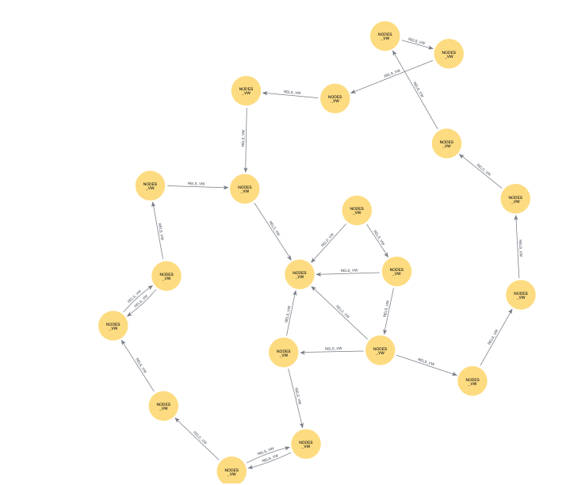

author: laura manor
id: neo4j-manufacturing
summary: How to manage risk in manufacturing using Neo4j Graph Analytics for Snowflake 
categories: snowflake-site:taxonomy/product/analytics, snowflake-site:taxonomy/snowflake-feature/business-intelligence, snowflake-site:taxonomy/industry/manufacturing
status: Published
feedback link: https://github.com/Snowflake-Labs/sfguides/issues
tags: Getting Started, Data Science, Data Engineering, Twitter
language: en


# Manage Risk with a Digital Twin in Manufacturing Data using Neo4j Graph Analytics

## Overview

Duration: 2

### What Is Neo4j Graph Analytics For Snowflake? 

Neo4j helps organizations find hidden relationships and patterns across billions of data connections deeply, easily, and quickly. **Neo4j Graph Analytics for Snowflake** brings to the power of graph directly to Snowflake, allowing users to run 65+ ready-to-use algorithms on their data, all without leaving Snowflake! 


### Manage Risk in a Manufacturing Plant with Neo4j Graph Analytics

This quickstart shows how to model a manufacturing workflow and apply Graph Analytics algorithms to find structural risks, operational bottlenecks, and machine similarities.

### Prerequisites

- The Native App [Neo4j Graph Analytics](https://app.snowflake.com/marketplace/listing/GZTDZH40CN) for Snowflake


### What You Will Need
- A [Snowflake account](https://signup.snowflake.com/?utm_source=snowflake-devrel&utm_medium=developer-guides&utm_cta=developer-guides) with appropriate access to databases and schemas.
- Neo4j Graph Analytics application installed from the Snowflake marketplace. Access the marketplace via the menu bar on the left hand side of your screen, as seen below:


### What You Will Learn

- How to create a **graph projection**, which combines the nodes and their relationships into a single in-memory graph.
- How to conduct a **connectivity analysis**, which utilizes Weakly Connected Components to identify any isolated subsystem.
- How to conduct a **criticality ranking** by using PageRank to find influential machines and Betweenness Centrality to identify bridges that control workflow.
- How to calculate **structural embeddings and similarity**. First generate FastRP embeddings and then run KNN to group machines with similar roles or dependencies.


### What You Will Build

- A mock database modeling machines and their relationships in a manufacturing process
- A notebook covering various graph algorithms and applying them to our mock database

## Create Our Database

Duration: 7

We are going to create a simple database with synthetic data. Let's first create the databse:


```sql
CREATE DATABASE IF NOT EXISTS m_demo;
USE SCHEMA m_demo.public;
```

Then let's add some tables to that database:


```sql
create or replace TABLE NODES (
	MACHINE_ID NUMBER(38,0),
	MACHINE_TYPE VARCHAR(16777216),
	CURRENT_STATUS VARCHAR(16777216),
	RISK_LEVEL VARCHAR(16777216)
);

create or replace TABLE RELS (
	SRC_MACHINE_ID NUMBER(38,0),
	DST_MACHINE_ID NUMBER(38,0),
	THROUGHPUT_RATE NUMBER(38,0)
);
```

Next we are going to create a table that represents our nodes. In this case, that will be 20 machines, including cutters, welders, presses, assemblers, and painters.


```sql
DELETE FROM nodes;

INSERT INTO nodes (machine_id, machine_type, current_status, risk_level) VALUES
(1, 'Cutter', 'active', 'low'),
(2, 'Welder', 'active', 'low'),
(3, 'Press', 'active', 'medium'),
(4, 'Assembler', 'active', 'medium'),
(5, 'Paint', 'active', 'low'),
(6, 'Cutter', 'active', 'low'),
(7, 'Welder', 'active', 'medium'),
(8, 'Press', 'active', 'medium'),
(9, 'Assembler', 'active', 'low'),
(10, 'Paint', 'active', 'low'),
(11, 'Cutter', 'active', 'medium'),
(12, 'Welder', 'active', 'high'),
(13, 'Press', 'active', 'medium'),
(14, 'Assembler', 'active', 'high'),
(15, 'Paint', 'active', 'medium'),
(16, 'Cutter', 'active', 'low'),
(17, 'Welder', 'active', 'medium'),
(18, 'Press', 'active', 'low'),
(19, 'Assembler', 'active', 'medium'),
(20, 'Assembler', 'active', 'high');
```

Next, we will have a table that reflects how those machines connect to eachother:


```sql
DELETE FROM rels;

INSERT INTO rels (SRC_MACHINE_ID, DST_MACHINE_ID, THROUGHPUT_RATE) VALUES
(1, 2, 50),
(2, 3, 50),
(3, 4, 50),
(4, 5, 50),
(5, 6, 50),
(6, 7, 50),
(7, 8, 50),
(8, 9, 50),
(9, 10, 50),
(5, 6, 40),
(6, 5, 40),
(8, 9, 30),
(9, 8, 30),
(1, 20, 200),
(2, 20, 180),
(3, 20, 160),
(4, 20, 140),
(11, 12, 20),
(12, 13, 20),
(13, 14, 20),
(14, 15, 20),
(15, 16, 20),
(16, 17, 20),
(17, 18, 20),
(18, 19, 20),
(19, 20, 20),
(3, 11, 120),
(10, 19, 19);
```


## Set Up

Duration: 5

Now that we have our data, we just need to create a notebook and grant the necessary permissions.

### Import The Notebook


- We’ve provided a notebook to walk you through each SQL and Python step—no local setup required!
- Download the .ipynb found [here](https://github.com/neo4j-product-examples/snowflake-graph-analytics/blob/main/predictive-maintenance-manufacturing/predictive-maintenance-manufacturing.ipynb), and import the notebook into snowflake. **Please ensure that all cells are imported as SQL, except for `viz_display` which should be a python cell**.

### Permissions

Before we run our algorithms, we need to set the proper permissions. But before we get started granting different roles, we need to ensure that you are using `accountadmin` to grant and create roles. Lets do that now:


```sql
-- you must be accountadmin to create role and grant permissions
use role accountadmin;
```

Next we can set up the necessary roles, permissions, and resource access to enable Graph Analytics to operate on data within the `M_DEMO.public schema`. It creates a consumer role (gds_role) for users and administrators, grants the Graph Analytics application access to read from and write to tables and views, and ensures that future tables are accessible. 

It also provides the application with access to the required compute pool and warehouse resources needed to run graph algorithms at scale.


```sql
-- Create an account role to manage the GDS application
CREATE ROLE IF NOT EXISTS gds_role;
GRANT APPLICATION ROLE neo4j_graph_analytics.app_user TO ROLE gds_role;
GRANT APPLICATION ROLE neo4j_graph_analytics.app_admin TO ROLE gds_role;

--Grant permissions for the application to use the database
GRANT USAGE ON DATABASE m_demo TO APPLICATION neo4j_graph_analytics;
GRANT USAGE ON SCHEMA m_demo.public TO APPLICATION neo4j_graph_analytics;

--Create a database role to manage table and view access
CREATE DATABASE ROLE IF NOT EXISTS gds_db_role;

GRANT ALL PRIVILEGES ON FUTURE TABLES IN SCHEMA m_demo.public TO DATABASE ROLE gds_db_role;
GRANT ALL PRIVILEGES ON ALL TABLES IN SCHEMA m_demo.public TO DATABASE ROLE gds_db_role;

GRANT ALL PRIVILEGES ON FUTURE VIEWS IN SCHEMA m_demo.public TO DATABASE ROLE gds_db_role;
GRANT ALL PRIVILEGES ON ALL VIEWS IN SCHEMA m_demo.public TO DATABASE ROLE gds_db_role;

GRANT CREATE TABLE ON SCHEMA m_demo.public TO DATABASE ROLE gds_db_role;


--Grant the DB role to the application and admin user
GRANT DATABASE ROLE gds_db_role TO APPLICATION neo4j_graph_analytics;
GRANT DATABASE ROLE gds_db_role TO ROLE gds_role;

GRANT USAGE ON DATABASE M_DEMO TO ROLE GDS_ROLE;
GRANT USAGE ON SCHEMA M_DEMO.PUBLIC TO ROLE GDS_ROLE;

GRANT SELECT, INSERT, UPDATE, DELETE ON ALL TABLES IN SCHEMA M_DEMO.PUBLIC TO ROLE GDS_ROLE;
GRANT CREATE TABLE ON SCHEMA M_DEMO.PUBLIC TO ROLE GDS_ROLE;
GRANT SELECT, INSERT, UPDATE, DELETE ON FUTURE TABLES IN SCHEMA M_DEMO.PUBLIC TO ROLE GDS_ROLE;
```

Then we need to switch the role we created:


```sql
use warehouse neo4j_graph_analytics_APP_WAREHOUSE;
use role gds_role;
use database m_demo;
use schema public;
```

Next, we are going to do a little clean up. We want our nodes table to just have the node ids.


```sql
CREATE OR REPLACE TABLE NODES_VW AS
SELECT MACHINE_ID AS nodeId
FROM NODES;
```

Your relationship table might have more than one row per machine‐pair, but we need to have exactly one throughput_rate per (source, target). To be safe you should aggregate the data, for example:


```sql
CREATE OR REPLACE TABLE RELS_VW AS
SELECT
  SRC_MACHINE_ID  AS sourceNodeId,
  DST_MACHINE_ID  AS targetNodeId,
  CAST(SUM(THROUGHPUT_RATE) AS FLOAT) AS total_amount
FROM RELS
GROUP BY SRC_MACHINE_ID, DST_MACHINE_ID;

```


## Visualize Our Graph

Duration: 5

At this point, you may want to visuze your graph to get a better understanding of how everything fits together. We can do this in two easy steps. First we are going to create a simplified view that we will use to build our visualization:

```sql
CREATE OR REPLACE VIEW plant_viz (nodeId, machine_type) AS
select machine_id as nodeId, machine_type
from nodes;
```

Next, in a python cell, we are going to create our actual visualization. Similarly to how we will project graphs for our graph algorithms, we need to specify what are the node and relationship tables. We also will also add in some code to specify the color and caption for our nodes.

```sql
from neo4j_viz.snowflake import from_snowflake
from snowflake.snowpark.context import get_active_session

session = get_active_session()

viz_graph = from_snowflake(
    session,
{
    'nodeTables': ['M_DEMO.PUBLIC.plant_viz'],
    'relationshipTables': {
      'M_DEMO.PUBLIC.RELS_VW': {
        'sourceTable': 'M_DEMO.PUBLIC.plant_viz',
        'targetTable': 'M_DEMO.PUBLIC.plant_viz'
      }
    }
  }
)

# specifying which column should be associated with colors. 
viz_graph.color_nodes(property='MACHINE_TYPE', override=True)  

# specifying which column should be associated with captions
for node in viz_graph.nodes:
    node.caption = str(node.properties["MACHINE_TYPE"])
    
# now we render
html_object = viz_graph.render()

import streamlit.components.v1 as components

components.html(html_object.data, height=600)
```


## Structural Connectivity Analysis

Duration: 5

Structural connectivity helps verify whether your production line is truly integrated or split into isolated sections. We use Weakly Connected Components (WCC) to evaluate this.

### Weakly Connected Components (WCC)

WCC treats the graph as undirected and groups machines that can reach each other without considering direction. If the graph splits into multiple components, it may signal siloed operations or disconnected subsystems—both of which could introduce coordination challenges or unmonitored risks.tion.

WCC gives a high-level view of connectivity, highlighting whether your plant functions as one unified system. SCC drills down into specific cycle structures that could be costing efficiency.

**How to Interpret WCC Results**:
A single connected component for our domain is ideal; it suggests an integrated production network. Multiple smaller components imply isolated lines or equipment clusters that may need integration or review.

**Expected result:** The simulated data is designed to form a single significant component, reflecting a unified workflow.


```sql
CALL neo4j_graph_analytics.graph.wcc('CPU_X64_XS', {
  'project': {
    'defaultTablePrefix': 'm_demo.public',
    'nodeTables': ['nodes_vw'],
    'relationshipTables': {
      'rels_vw': {
        'sourceTable': 'nodes_vw',
        'targetTable': 'nodes_vw'
      }
    }
  },
  'compute': {},
  'write': [
    {
      'nodeLabel': 'nodes_vw',
      'outputTable': 'm_demo.public.nodes_vw_wcc'
    }
  ]
});
```


```sql
SELECT
  component,
  COUNT(*) AS count
FROM M_DEMO.PUBLIC.NODES_VW_WCC
GROUP BY component
ORDER BY count DESC
LIMIT 5;
```

| COMPONENT | COUNT |
| --------- | ----- |
| 0         | 20    |

## Criticality Analysis

Duration: 10

Identifying the most critical machines in your workflow can help avoid shutdowns. If these machines slow down or fail, downstream operations halt. We use centrality algorithms to surface high-impact nodes. Both machines concentrate flow (PageRank) and machines that connect key sections of the graph (Betweenness). This gives us a fuller picture of how risk and workload are distributed. With these analyses, we can:

* Prioritize monitoring of the machines whose disruption would ripple through the entire line
* Allocate maintenance resources where they’ll have the most significant effect
* Design redundancy or backup processes around your process hubs
  Plan capacity expansions by understanding which machines handle the most “traffic.”

### PageRank Centrality

Designed initially to rank web pages, PageRank measures a node’s importance by the “quality and quantity” of incoming edges. In our graph, an edge A FEEDS_INTO B means “Machine A feeds into Machine B.” A high PageRank score indicates a machine that receives material from many other well-connected machines.


**How to Interpret Page Rank**:
The highest-performing machines manage the most critical data flow.

**Expected Result**:  Machine 20 has been set up as the processing hub for the simulated data, so it should be at the very top of the list.


```sql
CALL neo4j_graph_analytics.graph.page_rank('CPU_X64_XS', {
  'project': {
    'defaultTablePrefix': 'm_demo.public',
    'nodeTables': ['nodes_vw'],
    'relationshipTables': {
      'rels_vw': {
        'sourceTable': 'nodes_vw',
        'targetTable': 'nodes_vw'
      }
    }
  },
  'compute': {
    'mutateProperty': 'score'
  },
  'write': [
    {
      'nodeLabel': 'nodes_vw',
      'outputTable': 'm_demo.public.nodes_vw_pagerank',
      'nodeProperty': 'score'
    }
  ]
});
```


```sql
SELECT
  nodeid,
  score
FROM m_demo.public.nodes_vw_pagerank
ORDER BY score DESC
LIMIT 5

```

| NODEID | SCORE        |
| ------ | ------------ |
| 20     | 1.510187893  |
| 19     | 1.229185736  |
| 9      | 0.8718395565 |
| 8      | 0.8494144897 |
| 18     | 0.7493853549 |

**Interpretation** As expected, machine 20 ranks highest, confirming its role as a central assembler in the workflow. Its high-risk status makes it a critical point of failure that should be closely monitored.### Betweenness Centrality

PageRank highlights machines with the most influence based on incoming flow, but it doesn’t capture which machines sit between major areas of the workflow. Betweenness Centrality fills that gap by identifying machines that appear frequently on the shortest paths between others, often acting as bridges or single points of failure.

**How to Interpret Betweenness Results:** Machines with high scores connect upstream and downstream sections of the plant. For example, Machine 3 ranks highest not because it handles the most volume but because it links multiple parts of the workflow. If it goes down, it risks disrupting connections across the system.

**Expected Result:** Machines positioned between major steps, especially those that route material across different sections—should have the highest betweenness scores.


```sql
CALL neo4j_graph_analytics.graph.betweenness('CPU_X64_XS', {
   'project': {
    'defaultTablePrefix': 'm_demo.public',
    'nodeTables': ['nodes_vw'],
    'relationshipTables': {
      'rels_vw': {
        'sourceTable': 'nodes_vw',
        'targetTable': 'nodes_vw'
      }
    }
   },
    'compute': {
        'mutateProperty': 'score'
    },
    'write': [{
        'nodeLabel': 'nodes_vw',
        'outputTable': 'm_demo.public.nodes_vw_btwn',
        'nodeProperty': 'score'
    }]
});
```


```sql
SELECT
  nodeid,
  score
FROM m_demo.public.nodes_vw_btwn
ORDER BY score DESC
LIMIT 5

```

| NODEID | SCORE |
| ------ | ----- |
| 3      | 32    |
| 14     | 30    |
| 13     | 29    |
| 15     | 29    |
| 12     | 26    |

**Interpretation** 
Machines 14, 13, 3, and 15 act as structural bridges in the workflow. Their high scores suggest they connect otherwise separate paths, making them key points of potential disruption if taken offline.

##  Structural Embeddings & Similarity

Duration: 10

Getting an even deeper understanding of each machine's workflow requires more than looking at direct connections, as we have done so far. Structural embeddings capture broader patterns by summarizing each machine’s position in the overall operation into a numeric vector. This allows you to:

* Group machines with similar roles or dependencies

* Identify candidates for backup or load-balancing

* Spot unusual machines that behave differently from the rest of the plant

We use embeddings to make these comparisons based on immediate neighbors and overall graph structure.

We’ll use two Graph Analytics algorithms:

* **Fast Random Projection (FastRP)**
  FastRP generates a compact 16-dimensional vector for each machine. These vectors are built by sampling the graph around each node, so two machines with similar surroundings will end up with similar embeddings.

* **K-Nearest Neighbors (KNN)**
  Finds, for each machine, the top K most similar peers based on cosine similarity of their embeddings.

Together, embeddings + KNN surface structural affinities beyond simple degree or centrality measures.


### FastRP Embeddings

The results for FastRP are not immediately interpretable. However, machines with nearly identical embeddings have similar upstream and downstream relationships and likely play the same role in the plant. These embeddings are numerical representations that enable downstream clustering, similarity search, or anomaly detection.


```sql
CALL neo4j_graph_analytics.graph.fast_rp('CPU_X64_XS', {
  'project': {
    'defaultTablePrefix': 'm_demo.public',
    'nodeTables': ['nodes_vw'],
    'relationshipTables': {
      'rels_vw': {
        'sourceTable': 'nodes_vw',
        'targetTable': 'nodes_vw'
      }
    }
  },
    'compute': {
        'mutateProperty': 'embedding',
        'embeddingDimension': 16
    },
  'write': [
    {
      'nodeLabel': 'nodes_vw',
      'outputTable': 'm_demo.public.nodes_vw_fast_rp',
      'nodeProperty': 'embedding'
    }
  ]
});
```


```sql
SELECT
  nodeid as machine,
  embedding
FROM m_demo.public.nodes_vw_fast_rp
LIMIT 5
```

| MACHINE | EMBEDDING                                                    |
| ------- | ------------------------------------------------------------ |
| 1       | [ -0.8355492, 0, 0.28867513, -0.28867513, 0, -0.80507296, 0, 0.28867513, -0.54687405, -0.28867513, 0, 0.25819892, 0, 0, 0.2277227, -0.80507296 ] |
| 2       | [ -0.42722976, -0.16903085, -0.16903085, -0.3380617, 0.50709254, -0.51639783, 0, 0.16903085, -0.25819892, -0.16903085, 0, -0.07986277, 0, -0.3380617, 0.51639783, -1.0234904 ] |
| 3       | [ 0.27818274, 0.05457595, 0.05457595, -0.3380617, 0.9543061, 0, 0, 0.16903085, 0, -0.16903085, 0, -0.7852753, 0.4472136, -0.114454895, 0, -0.7306993 ] |
| 4       | [ 0, -0.16666672, 0.49999997, 0.33333334, 0.33333334, 0, 0, 0, 0, 0, 0, 0.33333334, 0, 0.49999997, -0.33333334, -0.8333333 ] |
| 5       | [ 0, -0.33333334, 0.33333334, 0.33333334, 0, 0, -0.33333334, -0.33333334, 0, 0, 0, 0, -0.33333334, 0.33333334, -0.33333334, -0.6666667 ] |


Our initial graph projection does not include any propery information, so we will have to create a new graph projection that includes the new 'embedding' property we created for any future downstream algorthims.### k-Nearest Neighbors (KNN)
Once we have embeddings for every machine, we can use K-Nearest Neighbors to find the most structurally similar machines based on their vector representations. KNN compares the cosine similarity between embeddings to pull out the top matches for each machine.

**How to Interpret KNN Results**:
Machines with similarity scores close to 1.0 share almost identical structural patterns in the graph. These often appear in mirrored parts of the workflow or play equivalent roles in different lines. They're good candidates for backup coverage, shared scheduling, or synchronized maintenance.

**Expected Result**:
Machines that serve in parallel sections—especially those feeding into similar downstream equipment—should appear as near-duplicates. In this dataset, pairs like (17 and 9) were intentionally structured this way and are expected to rank near the top.


```sql
CALL neo4j_graph_analytics.graph.knn('CPU_X64_XS', {
    'project': {
        'defaultTablePrefix': 'm_demo.public',
        'nodeTables': [ 'nodes_vw_fast_rp' ],
        'relationshipTables': {}
    },
    'compute': {
        'nodeProperties': ['EMBEDDING'],
        'topK': 1,
        'mutateProperty': 'score',
        'mutateRelationshipType': 'SIMILAR'
    },
  'write': [
    {
      'outputTable': 'm_demo.public.nodes_vw_knn',
      'sourceLabel': 'nodes_vw_fast_rp',
      'targetLabel': 'nodes_vw_fast_rp',
      'relationshipType': 'SIMILAR',
      'relationshipProperty': 'score'      
    }
  ]
});
```


```sql
SELECT
    sourcenodeid,
    targetnodeid,
    score
FROM m_demo.public.nodes_vw_knn
ORDER BY score DESC
LIMIT 5
```

| SOURCENODEID | TARGETNODEID | SCORE        |
| ------------ | ------------ | ------------ |
| 18           | 10           | 1            |
| 10           | 18           | 1            |
| 7            | 6            | 0.9304632555 |
| 6            | 7            | 0.9304632555 |
| 13           | 12           | 0.9233394969 |

**Intrepretation**
Even though machines like 10 and 18 do different things (Painter vs Press), their positions in the workflow are nearly identical. They both act as mid-line feeders into multiple downstream machines, and that structural role is what the algorithm captures.

This doesn’t mean they’re functionally interchangeable—but it suggests they share similar dependencies, bottleneck risks, or monitoring needs. In a real plant, this insight could inform:

- Maintenance alignment or shared spares

- Redundancy planning

- Risk modeling and load distribution

Structural similarity gives you a way to surface these patterns automatically—even across machines that don’t look related on paper.

##  Conclusions And Resources

Duration: 2

In this quickstart, you learned how to bring the power of graph insights into Snowflake using Neo4j Graph Analytics. 

### What You Learned

By working with a our simulated manufacturing database, you were able to:

1. Set up the [Neo4j Graph Analytics](https://app.snowflake.com/marketplace/listing/GZTDZH40CN/neo4j-neo4j-graph-analytics) application within Snowflake.
2. Prepare and project your data into a graph model (machines as nodes, connections as relationships).
3. Ran multiple graph algorithms, including embeddings, to manage risk in your manufacturing process

### Resources

- [Neo4j Graph Analytics Documentation](https://neo4j.com/docs/snowflake-graph-analytics/)
- [See it in action!](https://www.youtube.com/watch?v=2rksmcCe_tY&t=425s)
