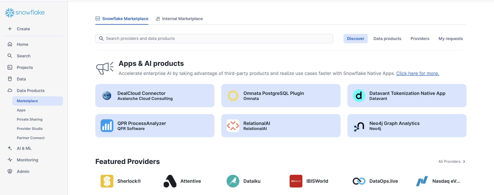
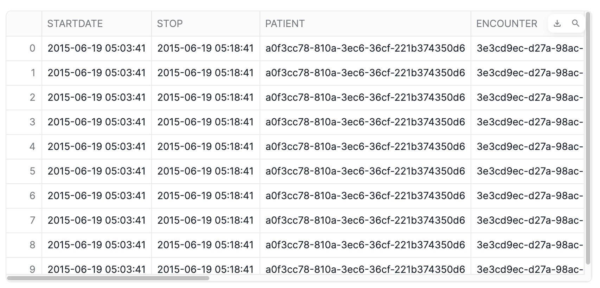
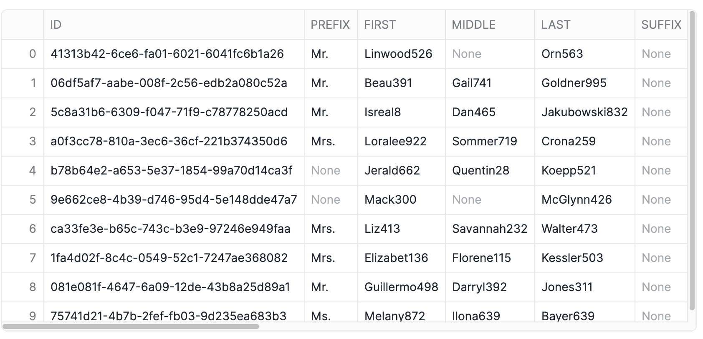
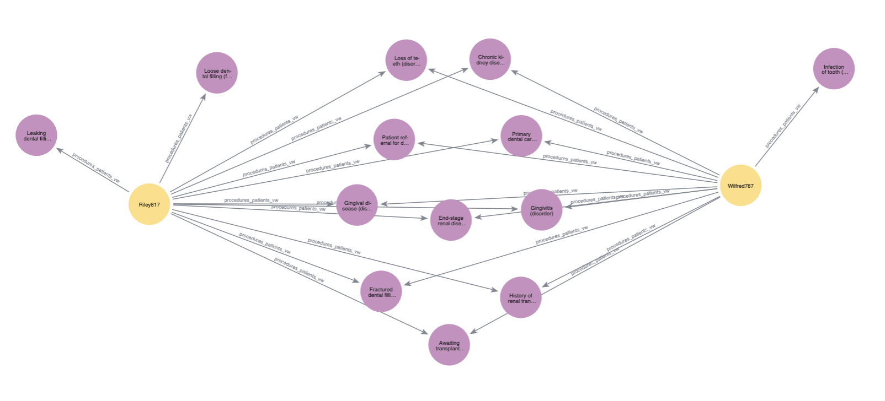

author: corydon baylor
id: neo4j-patient-journey
summary: How to find communities affected by fraud using louvain in Neo4j Graph Analytics for Snowflake 
categories: snowflake-site:taxonomy/industry/healthcare-and-life-sciences, snowflake-site:taxonomy/product/analytics, snowflake-site:taxonomy/snowflake-feature/business-intelligence
status: Published
language: en
feedback link: https://github.com/Snowflake-Labs/sfguides/issues
tags: Getting Started, Data Science, Data Engineering, Twitter


# Identify Similar Patient Journeys in Healthcare Data with Neo4j Graph Analytics

## Overview

Duration: 2

### What Is Neo4j Graph Analytics For Snowflake? 

Neo4j helps organizations find hidden relationships and patterns across billions of data connections deeply, easily, and quickly. **Neo4j Graph Analytics for Snowflake** brings to the power of graph directly to Snowflake, allowing users to run 65+ ready-to-use algorithms on their data, all without leaving Snowflake! 

### Prerequisites

- The Native App [Neo4j Graph Analytics](https://app.snowflake.com/marketplace/listing/GZTDZH40CN) for Snowflake

### What You Will Need

- A [Snowflake account](https://signup.snowflake.com/?utm_source=snowflake-devrel&utm_medium=developer-guides&utm_cta=developer-guides) with appropriate access to databases and schemas.
- Neo4j Graph Analytics application installed from the Snowflake marketplace. Access the marketplace via the menu bar on the left hand side of your screen, as seen below:
  

### What You Will Build

- A method to identify similar patient journeys

### What You Will Learn

- How to prepare and project your data for graph analytics
- How to use node similarity to identify similar nodes
- How to read and write directly from and to your snowflake tables

## Load The Data
Duration: 5

Dataset overview : This dataset is modelled to design and analyze patients and different procedures that they undergo using graph analytics. 

Let's name our database `NEO4J_PATIENT_DB`. Using the CSVs found [here](https://github.com/neo4j-product-examples/aura-graph-analytics/tree/main/patient_journey/data), We are going to add two new tables:

- One called `PROCEDURES` based on the Procedures.csv
- One called `PATIENTS` based on Patients.csv

Follow the steps found [here](https://docs.snowflake.com/en/user-guide/data-load-web-ui) to load in your data.

## Set Up
Duration: 5

### Import The Notebook

- We’ve provided a notebook to walk you through each SQL and Python step—no local setup required!
- Download the .ipynb found [here](https://github.com/neo4j-product-examples/snowflake-graph-analytics/blob/main/patient-journey/finding-similar-patients.ipynb), and import the notebook into snowflake.

### Permissions

Before we run our algorithms, we need to set the proper permissions. But before we get started granting different roles, we need to ensure that you are using `accountadmin` to grant and create roles. Lets do that now:


```sql
USE ROLE accountadmin;
```

Next let's set up the necessary roles, permissions, and resource access to enable Graph Analytics to operate on data within the `NEO4J_PATIENT_DB.PUBLIC.SCHEMA`. It creates a consumer role (gds_user_role) for users and administrators, grants the Neo4j Graph Analytics application access to read from and write to tables and views, and ensures that future tables are accessible. 

It also provides the application with access to the required compute pool and warehouse resources needed to run graph algorithms at scale.


```sql
-- Create a consumer role for users and admins of the GDS application
CREATE ROLE IF NOT EXISTS gds_user_role;
CREATE ROLE IF NOT EXISTS gds_admin_role;
GRANT APPLICATION ROLE neo4j_graph_analytics.app_user TO ROLE gds_user_role;
GRANT APPLICATION ROLE neo4j_graph_analytics.app_admin TO ROLE gds_admin_role;

CREATE DATABASE ROLE IF NOT EXISTS gds_db_role;
GRANT DATABASE ROLE gds_db_role TO ROLE gds_user_role;
GRANT DATABASE ROLE gds_db_role TO APPLICATION neo4j_graph_analytics;

-- Grant access to consumer data
GRANT USAGE ON DATABASE NEO4J_PATIENT_DB TO ROLE gds_user_role;
GRANT USAGE ON SCHEMA NEO4J_PATIENT_DB.PUBLIC TO ROLE gds_user_role;

-- Required to read tabular data into a graph
GRANT SELECT ON ALL TABLES IN DATABASE NEO4J_PATIENT_DB TO DATABASE ROLE gds_db_role;

-- Ensure the consumer role has access to created tables/views
GRANT ALL PRIVILEGES ON FUTURE TABLES IN SCHEMA NEO4J_PATIENT_DB.PUBLIC TO DATABASE ROLE gds_db_role;
GRANT ALL PRIVILEGES ON ALL TABLES IN SCHEMA NEO4J_PATIENT_DB.PUBLIC TO DATABASE ROLE gds_db_role;
GRANT CREATE TABLE ON SCHEMA NEO4J_PATIENT_DB.PUBLIC TO DATABASE ROLE gds_db_role;
GRANT CREATE VIEW ON SCHEMA NEO4J_PATIENT_DB.PUBLIC TO DATABASE ROLE gds_db_role;
GRANT ALL PRIVILEGES ON FUTURE VIEWS IN SCHEMA NEO4J_PATIENT_DB.PUBLIC TO DATABASE ROLE gds_db_role;
GRANT ALL PRIVILEGES ON ALL VIEWS IN SCHEMA NEO4J_PATIENT_DB.PUBLIC TO DATABASE ROLE gds_db_role;

-- Compute and warehouse access
GRANT USAGE ON WAREHOUSE NEO4J_GRAPH_ANALYTICS_APP_WAREHOUSE TO APPLICATION neo4j_graph_analytics;
```

Then we need to switch the role we created:


```sql
USE ROLE gds_user_role;
```

## Clean Our Data

Duration: 5

We need our data to be in a particular format in order to work with Graph Analytics. In general it should be like so:

### For The Table Representing Nodes:

The first column should be called `nodeId`, which represents the ids for the each node in our graph

### For The table Representing Relationships:

We need to have columns called `sourceNodeId` and `targetNodeId`. These will tell Graph Analytics the direction of the transaction, which in this case means:

- Who is the patient (sourceNodeId) and
- What is the procedure (targetNodeId)

Let's take a look at the starting point for our data. We have a table for patients and a table for procedures:


```sql
SELECT * FROM NEO4J_PATIENT_DB.PUBLIC.PROCEDURES LIMIT 10;
```




```sql
SELECT * FROM NEO4J_PATIENT_DB.PUBLIC.PATIENTS LIMIT 10;
```



We are then going to clean this up into two tables that just have the `nodeids` for both patient and procedure:


```sql
CREATE OR REPLACE TABLE NEO4J_PATIENT_DB.PUBLIC.PATIENT_NODE_MAPPING (nodeId) AS
SELECT DISTINCT p.ID from NEO4J_PATIENT_DB.PUBLIC.PATIENTS p;

CREATE OR REPLACE TABLE NEO4J_PATIENT_DB.PUBLIC.PROCEDURE_NODE_MAPPING (nodeId) AS
SELECT DISTINCT p.code from NEO4J_PATIENT_DB.PUBLIC.PROCEDURES p;
```

In order to keep this managable, we are just going to look at patients (and what procedures they underwent) in the context of kidney disease. So first we will filter down patients to only include those with kidney disease:


```sql
// create a subset of patients that have had any of the 4 kidney disease codes
CREATE OR REPLACE VIEW KidneyPatients_vw (nodeId) AS
    SELECT DISTINCT PATIENT_NODE_MAPPING.NODEID as nodeId
    FROM PROCEDURES
            JOIN PATIENT_NODE_MAPPING ON PATIENT_NODE_MAPPING.NODEID = PROCEDURES.PATIENT 
    WHERE PROCEDURES.REASONCODE IN (431857002,46177005,161665007,698306007)
;
```

Then we will only look at the procedures that those kidney patients have undergone:


```sql
// There are ~400K procedures - it is doubtful that the kidney patients even have used a small
// fraction of those.  To reduce GDS memory and speed algorithm execution, we want to load
// only those procedures that kidney patients have had.
CREATE OR REPLACE VIEW KidneyPatientProcedures_vw (nodeId) AS
    SELECT DISTINCT PROCEDURE_NODE_MAPPING.NODEID as nodeId
    FROM PROCEDURES 
        JOIN PROCEDURE_NODE_MAPPING ON PROCEDURE_NODE_MAPPING.nodeId = PROCEDURES.CODE
        JOIN KIDNEYPATIENTS_VW ON PATIENT = PROCEDURES.PATIENT;

// create the relationship view of kidney patients to the procedures they have had
CREATE OR REPLACE VIEW KidneyPatientProcedure_relationship_vw (sourceNodeId, targetNodeId) AS
    SELECT DISTINCT PATIENT_NODE_MAPPING.NODEID as sourceNodeId, PROCEDURE_NODE_MAPPING.NODEID as targetNodeId
    FROM PATIENT_NODE_MAPPING
         JOIN PROCEDURES ON PROCEDURES.PATIENT = PATIENT_NODE_MAPPING.NODEID
         JOIN PROCEDURE_NODE_MAPPING ON PROCEDURE_NODE_MAPPING.NODEID = PROCEDURES.CODE;
```

## Visualize Your Graph
At this point, you may want to visualize your graph to get a better understanding of how everything fits together. Specifically, you may be interested in better understanding your results. Why exactly are any given two patients considered similar?

Let's start by filtering down our data to two patients who are considered very similar. They have the following patient ids:

- `a5814a17-303e-1d23-64d3-dd4b54170d16`
- `87069a85-19bf-7d81-0cfe-609b3427d096`

```sql
CREATE OR REPLACE VIEW KidneyPatient_viz_vw (nodeId, title, label) AS
SELECT 
    k.nodeId, 
    p.first AS title,
    'blue' as label
FROM KidneyPatients_vw k
LEFT JOIN patients p
  ON k.nodeId = p.id
WHERE k.nodeId IN (
  'a5814a17-303e-1d23-64d3-dd4b54170d16',
  '87069a85-19bf-7d81-0cfe-609b3427d096'
);

-- this represents the procedures those patients underwent (and will be our relationship table
-- for the below visualization)
CREATE OR REPLACE VIEW NEO4J_PATIENT_DB.PUBLIC.procedures_patients_vw AS
SELECT DISTINCT
    p.patient as sourcenodeid,
    p.reasoncode as targetnodeid
FROM NEO4J_PATIENT_DB.PUBLIC.PROCEDURES p
JOIN KidneyPatient_viz_vw k
  ON CAST(p.PATIENT AS STRING) = CAST(k.nodeId AS STRING);

-- now we look at the procedures in our example
CREATE OR REPLACE VIEW procedures_viz_vw (nodeId, title, label) AS
SELECT DISTINCT
    pp.targetnodeid AS nodeId,
    p.reasondescription AS caption,
    'red' as label
FROM procedures_patients_vw pp
LEFT JOIN procedures p 
    ON pp.targetnodeid = p.reasoncode
WHERE pp.targetnodeid IS NOT NULL
  AND TRIM(pp.targetnodeid) <> '';
```
Now we can use the `neo4j_viz` python package to create the actual visualization. You can learn more about how it works [here](https://neo4j.com/docs/snowflake-graph-analytics/current/visualization/), but for this example, we are just going to customize two things. First, we will use the "label" property of our nodes (which we defined in the SQL query above) to set the colors. Like so:
```python
viz_graph.color_nodes(property='LABEL', override=True)  
```
Next, we will use the "title" property to set captions. We created that column above as well:

```python
for node in viz_graph.nodes:
    node.caption = str(node.properties["TITLE"])
```

Let's see it all in action. You will notice that we are using the same projection syntax to create our visualization

```python
from neo4j_viz.snowflake import from_snowflake
from snowflake.snowpark.context import get_active_session

session = get_active_session()

viz_graph = from_snowflake(
    session,
    {
    'nodeTables': ['NEO4J_PATIENT_DB.public.KidneyPatient_viz_vw',
                   'NEO4J_PATIENT_DB.public.procedures_viz_vw'
    ],
    'relationshipTables': {
      'NEO4J_PATIENT_DB.public.procedures_patients_vw': {
        'sourceTable': 'NEO4J_PATIENT_DB.public.KidneyPatient_viz_vw',
        'targetTable': 'NEO4J_PATIENT_DB.public.procedures_viz_vw'
      }
    }
    }
)

viz_graph.color_nodes(property='LABEL', override=True)  

for node in viz_graph.nodes:
    node.caption = str(node.properties["TITLE"])
    
html_object = viz_graph.render()

import streamlit.components.v1 as components

components.html(html_object.data, height=600)
```
  

## Find Similar Patients

Duration: 10

Now we are finally at the step where we create a projection, run our algorithms, and write back to snowflake. We will run louvain to determine communities within our data. Louvain identifies communities by grouping together nodes that have more connections to each other than to nodes outside the group.

You can find more information about writing this function in our [documentation](https://neo4j.com/docs/snowflake-graph-analytics/current/getting-started/).

Broadly, you will need a few things:

- A table for nodes, which for us is `neo4j_patient_db.public.KidneyPatients_vw`
- A table for relationships, which for us is `neo4j_patient_db.public.KidneyPatientProcedure_relationship_vw`
- The size of the compute pool you would like to use, which would be `CPU_X64_XS`
- A table to output results, which would be `neo4j_patient_db.public.PATIENT_PROCEDURE_SIMILARITY`
- A node label for our nodes, which would be `KidneyPatients_vw`


```sql
CALL neo4j_graph_analytics.graph.node_similarity('CPU_X64_L', {
  'project': {
    'defaultTablePrefix': 'neo4j_patient_db.public',
    'nodeTables': ['KidneyPatients_vw','KidneyPatientProcedures_vw'], 
    'relationshipTables': {
      'KidneyPatientProcedure_relationship_vw': {
        'sourceTable': 'KidneyPatients_vw',
        'targetTable': 'KidneyPatientProcedures_vw'
      }
    }
  },
  'compute': { 'topK': 10,
                'similarityCutoff': 0.3,
                'similarityMetric': 'JACCARD'
            },
  'write': [
    {
    'sourceLabel': 'KidneyPatients_vw',
    'targetLabel': 'KidneyPatients_vw',
    'relationshipProperty': 'similarity',
    'outputTable':  'neo4j_patient_db.public.PATIENT_PROCEDURE_SIMILARITY'
    }
  ]
});
```

Let's take a look at the results!


```sql
SELECT SOURCENODEID, TARGETNODEID, SIMILARITY
FROM NEO4J_PATIENT_DB.PUBLIC.PATIENT_PROCEDURE_SIMILARITY 
LIMIT 10;
```

| SOURCENODEID                         | TARGETNODEID                         | SIMILARITY   |
| ------------------------------------ | ------------------------------------ | ------------ |
| 00094d82-80de-4444-69cf-cf26fd56b1ac | 87069a85-19bf-7d81-0cfe-609b3427d096 | 0.7555555556 |
| 00094d82-80de-4444-69cf-cf26fd56b1ac | e4dbe477-7ad6-db78-79eb-87a82b448787 | 0.8536585366 |
| 00094d82-80de-4444-69cf-cf26fd56b1ac | fe12b9bd-82c4-de9e-f5fb-1a292dc5020d | 0.8181818182 |
| 00094d82-80de-4444-69cf-cf26fd56b1ac | a08d93d4-8fe9-7cb5-cca3-ecaed719f167 | 0.875        |
| 00094d82-80de-4444-69cf-cf26fd56b1ac | 41078972-c38f-d0e5-b835-5f1ec4b69e58 | 0.9487179487 |
| 00094d82-80de-4444-69cf-cf26fd56b1ac | a1ab30fc-76db-e043-0368-dde512b707d6 | 0.85         |
| 00094d82-80de-4444-69cf-cf26fd56b1ac | 68d9406d-f0f8-a93a-377b-d9ff4be171a5 | 0.8          |
| 00094d82-80de-4444-69cf-cf26fd56b1ac | 9048c50d-cf90-be81-5352-5f11335b6533 | 0.8536585366 |
| 00094d82-80de-4444-69cf-cf26fd56b1ac | 752404e8-efac-b9bb-c9da-e64c5fe3948f | 0.8          |
| 00094d82-80de-4444-69cf-cf26fd56b1ac | e57de607-b7c4-d944-9e72-7d786a8a7058 | 0.85         |

You can see the similarity score between one patient and a set of another patients. The higher the similarity score the more similar the patients. From this, we could develop personalize plans based on other patients experiences. 

For example, if a patient had undergone 4 out of 5 of another patients procedures, we might predict that they will likely undergo the fifth procedure as well!

## Sort Into Groups

Using the similarity scores we just calculated, we can then sort our patients into groups based on our related patients pairs and their similarity score using louvain:

```sql
CALL Neo4j_Graph_Analytics.graph.louvain('CPU_X64_XS', {
    'defaultTablePrefix': 'neo4j_patient_db.public',
    'project': {
        'nodeTables': [ 'KidneyPatients_vw' ],
        'relationshipTables': {
            'PATIENT_PROCEDURE_SIMILARITY': {
                'sourceTable': 'KidneyPatients_vw',
                'targetTable': 'KidneyPatients_vw',
                'orientation': 'UNDIRECTED'
            }
        }
    },
    'compute': {
        'mutateProperty': 'community_id',
        'relationshipWeightProperty': 'SIMILARITY'

    },
    'write': [{
        'nodeLabel': 'KidneyPatients_vw',
        'outputTable': 'patient_community',
        'nodeProperty': 'community_id'
    }]
});
```

We can then take a look at the results like so:

```sql
select * from neo4j_patient_db.public.patient_community
```

| NODEID                               | COMMUNITY_ID |
| ------------------------------------ | ------------ |
| 00094d82-80de-4444-69cf-cf26fd56b1ac | 61           |
| 13ca898b-7ee8-4859-6df5-dd6a37fe5ad2 | 66           |
| 150529c7-3757-5f24-b7ed-4928fcad61cf | 74           |
| 155d21bc-a41a-32f9-eae4-22bb3629ea99 | 74           |
| 1b5c0719-72c0-126e-7959-6bd13e2b9268 | 74           |
| 1c4b63ab-8483-7526-23d7-5e966fd2e6f6 | 74           |

##  Conclusions And Resources

Duration: 2

In this quickstart, you learned how to bring the power of graph insights into Snowflake using Neo4j Graph Analytics. 

### What You Learned

By working with a patient transaction dataset, you were able to:

1. Set up the [Neo4j Graph Analytics](https://app.snowflake.com/marketplace/listing/GZTDZH40CN/neo4j-neo4j-graph-analytics) application within Snowflake.
2. Prepare and project your data into a graph model (patients as nodes, underwent_procedures as relationships).
3. Ran node similarity to identify patients who have a comparable history of medical procedures.

### Resources

- [Neo4j Graph Analytics Documentation](https://neo4j.com/docs/snowflake-graph-analytics/)
