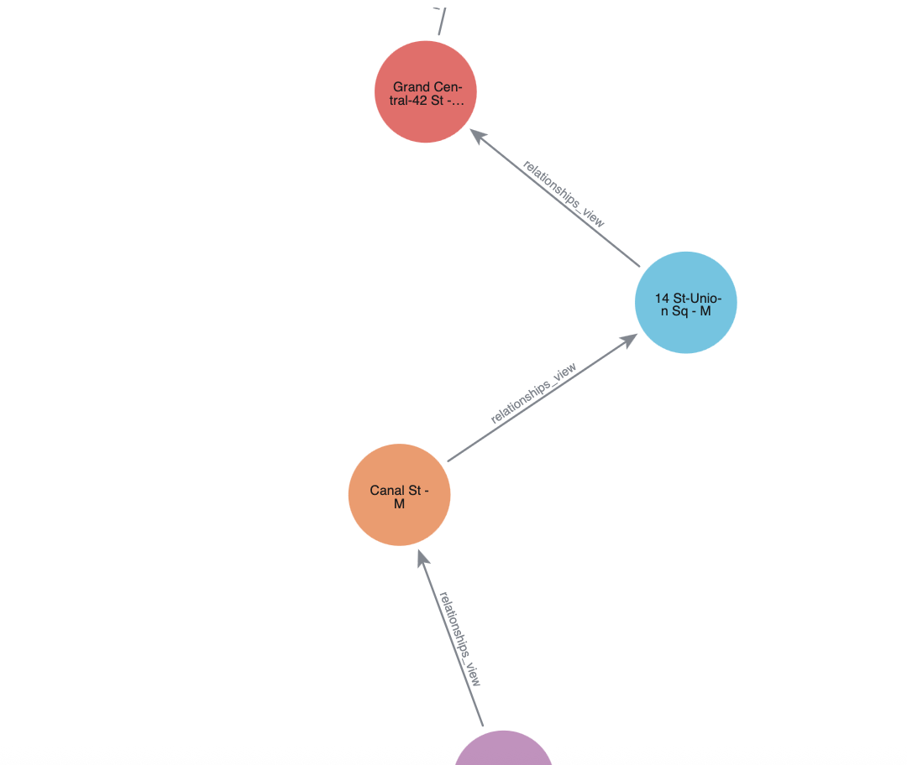

author: corydon baylor
id: neo4j-subways
categories: snowflake-site:taxonomy/product/analytics, snowflake-site:taxonomy/snowflake-feature/business-intelligence, snowflake-site:taxonomy/industry/public-sector
summary: How to model subway disruptions using dijsktra in Neo4j Graph Analytics for Snowflake 
environments: web
status: Published
feedback link: https://github.com/Snowflake-Labs/sfguides/issues
language: en


# Identify Bottlenecks and Model Disruptions using Neo4j Graph Analytics 

## Overview


### What Is Neo4j Graph Analytics For Snowflake? 

Neo4j helps organizations find hidden relationships and patterns across billions of data connections deeply, easily, and quickly. **Neo4j Graph Analytics for Snowflake** brings to the power of graph directly to Snowflake, allowing users to run 65+ ready-to-use algorithms on their data, all without leaving Snowflake! 


### Modeling Disruptions in the MTA Subway

3.6 million Americans ride the New York City subway each day. That's 1.3 million more people than who takes a flight each day in the United States. The New York City Subway is unique in the number of riders, stations, and the level of service it provides.

Using Graph Analytics for Snowflake, we can easily model what would happen if a station was fully closed for repairs. Insights like this can apply not just to transport systems, but to supply chains, manufacturing processes and much more.

### Prerequisites

- The Native App [Neo4j Graph Analytics](https://app.snowflake.com/marketplace/listing/GZTDZH40CN) for Snowflake

### What You Will Need

- A [Snowflake account](https://signup.snowflake.com/?utm_source=snowflake-devrel&utm_medium=developer-guides&utm_cta=developer-guides) with appropriate access to databases and schemas.
- Neo4j Graph Analytics application installed from the Snowflake marketplace. Access the marketplace via the menu bar on the left hand side of your screen, as seen below:
  

### What You Will Build

- A notebook that models subway disruptions in the New York City subway

### What You Will Learn

- How to prepare and project your data for graph analytics
- How to pathfinding to model subway disruptions
- How to read and write directly from and to your snowflake tables

## Loading The Data


Dataset overview : This dataset is a digital twin of the NYC Subway!


Let's name our database `MTA`. Using the CSVs found [here](https://github.com/neo4j-product-examples/aura-graph-analytics/tree/main/mta_subways/data), We are going to add two new tables:

- One called `STATIONS` based on stations.csv
- One called `LINES` on lines.csv

Follow the steps found [here](https://docs.snowflake.com/en/user-guide/data-load-web-ui) to load in your data.

## Setting Up

### Import The Notebook

- We’ve provided a Colab notebook to walk you through each SQL and Python step—no local setup required!
- Download the .ipynb found [here](https://github.com/neo4j-product-examples/snowflake-graph-analytics/tree/main/modeling-disruptions-subways), and import the notebook into snowflake.
- Don't forget to install streamlit and python package before you run.

### Permissions

Before we run our algorithms, we need to set the proper permissions. But before we get started granting different roles, we need to ensure that you are using `accountadmin` to grant and create roles. Lets do that now:


```
USE ROLE accountadmin;
```

Next let's set up the necessary roles, permissions, and resource access to enable Graph Analytics to operate on data within the `mta.public schema`. It creates a consumer role (gds_user_role) for users and administrators, grants the Neo4j Graph Analytics application access to read from and write to tables and views, and ensures that future tables are accessible. 

It also provides the application with access to the required compute pool and warehouse resources needed to run graph algorithms at scale.


```
-- Create a consumer role for users and admins of the GDS application
CREATE ROLE IF NOT EXISTS gds_user_role;
CREATE ROLE IF NOT EXISTS gds_admin_role;
GRANT APPLICATION ROLE neo4j_graph_analytics.app_user TO ROLE gds_user_role;
GRANT APPLICATION ROLE neo4j_graph_analytics.app_admin TO ROLE gds_admin_role;

CREATE DATABASE ROLE IF NOT EXISTS gds_db_role;
GRANT DATABASE ROLE gds_db_role TO ROLE gds_user_role;
GRANT DATABASE ROLE gds_db_role TO APPLICATION neo4j_graph_analytics;

-- Grant access to consumer data
GRANT USAGE ON DATABASE MTA TO ROLE gds_user_role;
GRANT USAGE ON SCHEMA MTA.PUBLIC TO ROLE gds_user_role;

-- Required to read tabular data into a graph
GRANT SELECT ON ALL TABLES IN DATABASE MTA TO DATABASE ROLE gds_db_role;

-- Ensure the consumer role has access to created tables/views
GRANT ALL PRIVILEGES ON FUTURE TABLES IN SCHEMA MTA.PUBLIC TO DATABASE ROLE gds_db_role;
GRANT ALL PRIVILEGES ON ALL TABLES IN SCHEMA MTA.PUBLIC TO DATABASE ROLE gds_db_role;
GRANT CREATE TABLE ON SCHEMA MTA.PUBLIC TO DATABASE ROLE gds_db_role;
GRANT CREATE VIEW ON SCHEMA MTA.PUBLIC TO DATABASE ROLE gds_db_role;
GRANT ALL PRIVILEGES ON FUTURE VIEWS IN SCHEMA MTA.PUBLIC TO DATABASE ROLE gds_db_role;
GRANT ALL PRIVILEGES ON ALL VIEWS IN SCHEMA MTA.PUBLIC TO DATABASE ROLE gds_db_role;

-- Compute and warehouse access
GRANT USAGE ON WAREHOUSE NEO4J_GRAPH_ANALYTICS_APP_WAREHOUSE TO APPLICATION neo4j_graph_analytics;
```

Then we need to switch the role we created:


```
USE ROLE gds_user_role;
```

## Cleaning Our Data


We need our data to be in a particular format in order to work with Graph Analytics. In general it should be like so:

### For The Table Representing Nodes:

The first column should be called `nodeId`, which represents the ids for the each node in our graph

### For The table Representing Relationships:

We need to have columns called `sourceNodeId` and `targetNodeId`. These will tell Graph Analytics the direction of the relationships, which in this case means:

- The starting station (sourceNodeId) and
- The ending station (targetNodeId)


```
CREATE OR REPLACE TABLE mta.public.nodes AS
SELECT 
  id AS nodeid
FROM mta.public.stations;
```


```
CREATE OR REPLACE TABLE mta.public.relationships AS
SELECT 
    sourcenodeid,
    targetnodeid
FROM mta.public.lines;
```

## Running Your Algorithms


Now we are finally at the step where we create a projection, run our algorithms, and write back to snowflake. We will run dijksra to determine the shortest path between subway stations.

You can find more information about writing this function in our [documentation](https://neo4j.com/docs/snowflake-graph-analytics/current/getting-started/).

```
CALL neo4j_graph_analytics.graph.dijkstra('CPU_X64_XS', {
'defaultTablePrefix': 'mta.public',
  'project': {
    'nodeTables': ['nodes'], 
    'relationshipTables': {
      'relationships': {
        'sourceTable': 'nodes',
        'targetTable': 'nodes'
      }
    }
  },
  'compute': { 'sourceNode': 68,
                'targetNode': 24, 
                'sourceNodeTable': 'nodes'
            },
  'write': [
    {
    'sourceLabel': 'nodes',
    'targetLabel': 'nodes',
    'outputTable':  'mta.public.paths'
    }
  ]
});
```


```
select * from mta.public.paths
```

We can then use a simple SQL query to take our numeric nodeids and return the stations in order:


```
WITH flattened AS (
  SELECT 
    VALUE::NUMBER AS nodeid,
    INDEX AS ordering
  FROM mta.public.paths,
       LATERAL FLATTEN(input => nodeids)
),
filtered AS (
  SELECT s.*, f.ordering
  FROM mta.public.stations s
  JOIN flattened f ON s.id = f.nodeid
)
SELECT *
FROM filtered
ORDER BY ordering;
```

| STATION_NAME                  | ID   | ORDERING |
| ----------------------------- | ---- | -------- |
| Bergen St - Bk                | 68   | 0        |
| Atlantic Av-Barclays Ctr - Bk | 67   | 1        |
| Canal St - M                  | 32   | 2        |
| 14 St-Union Sq - M            | 104  | 3        |
| 34 St-Herald Sq - M           | 230  | 4        |
| Times Sq-42 St - M            | 24   | 5        |

## Modeling a Disruption


But what would happen if one of those stations were closed? How can we model what would be the new path? Luckily it will be pretty simple. 

First we need to filter out the station that is closed from our nodes and relationships tables. Let's say that Herald Square is closed:


```
CREATE OR REPLACE TABLE mta.public.nodes_f AS
SELECT *
FROM mta.public.nodes
WHERE nodeid != 230;
```


```
CREATE OR REPLACE TABLE mta.public.relationships_f AS
SELECT *
FROM mta.public.relationships
WHERE sourcenodeid != 230 and targetnodeid != 230;
```

Then we use those new tables when we run our algorithm:


```
CALL neo4j_graph_analytics.graph.dijkstra('CPU_X64_XS', {
'defaultTablePrefix': 'mta.public',
  'project': {
    'nodeTables': ['nodes_f'], 
    'relationshipTables': {
      'relationships_f': {
        'sourceTable': 'nodes_f',
        'targetTable': 'nodes_f'
      }
    }
  },
  'compute': { 'sourceNode': 68,
                'targetNode': 24, 
                'sourceNodeTable': 'nodes_f'
            },
  'write': [
    {
    'sourceLabel': 'nodes_f',
    'targetLabel': 'nodes_f',
    'outputTable':  'mta.public.paths_f'
    }
  ]
});
```

And then we can pull back our results like so:


```
CREATE OR REPLACE VIEW mta.public.filtered_station_captions AS
WITH flattened AS (
  SELECT 
    VALUE::NUMBER AS nodeid,
    INDEX AS ordering
  FROM mta.public.paths_f,
       LATERAL FLATTEN(input => nodeids)
),
filtered AS (
  SELECT 
    s.id AS nodeid,
    s.station_name AS caption, 
    f.ordering,
  FROM mta.public.stations s
  JOIN flattened f ON s.id = f.nodeid
)
SELECT 
    nodeid,
    ordering,
    caption
FROM filtered
ORDER BY ordering;

select * from mta.public.filtered_station_captions
```

| NODEID | ORDERING | CAPTION                       |
| ------ | -------- | ----------------------------- |
| 68     | 0        | Bergen St - Bk                |
| 67     | 1        | Atlantic Av-Barclays Ctr - Bk |
| 32     | 2        | Canal St - M                  |
| 104    | 3        | 14 St-Union Sq - M            |
| 103    | 4        | Grand Central-42 St - M       |
| 186    | 5        | 5 Av - M                      |
| 24     | 6        | Times Sq-42 St - M            |

## Visualize Your Graph 

At this point, you may want to visualize your graph to get a better understanding of how everything fits together. It would be nice to have our new station path represented visually. We already have everything we need for the nodes from our last step, but we also need to create a relationship table, which we do below:

```sql

CREATE OR REPLACE VIEW mta.public.relationships_view AS
WITH ordered_nodes AS (
  SELECT
    nodeid AS sourcenodeid,
    LEAD(nodeid) OVER (ORDER BY ordering) AS targetnodeid
  FROM mta.public.filtered_station_captions
)
SELECT *
FROM ordered_nodes
WHERE targetnodeid IS NOT NULL;

select * from mta.public.relationships_view 
```
We use our `filtered_station_viz` table as our nodes. From here, our syntax will look very familiar to what we have had before when running algorithms. We also need to specify what captions belong to each node in a for loop.

```python
from neo4j_viz.snowflake import from_snowflake
from snowflake.snowpark.context import get_active_session

session = get_active_session()

viz_graph = from_snowflake(
    session,
{
    'nodeTables': ['mta.public.filtered_station_viz'],
    'relationshipTables': {
      'mta.public.relationships_view': {
        'sourceTable': 'mta.public.filtered_station_viz',
        'targetTable': 'mta.public.filtered_station_viz'
      }
    }
  }
)
 

##### specifying which column should be associated with captions
for node in viz_graph.nodes:
    node.caption = str(node.properties["STATION_NAME"])
    
###### now we render
html_object = viz_graph.render()

import streamlit.components.v1 as components

components.html(html_object.data, height=600)
```


##  Conclusions And Resources


In this quickstart, you learned how to bring the power of graph insights into Snowflake using Neo4j Graph Analytics. 

### What You Learned

Using our NYC Subway dataset, you were able to:

1. Set up the [Neo4j Graph Analytics](https://app.snowflake.com/marketplace/listing/GZTDZH40CN/neo4j-neo4j-graph-analytics) application within Snowflake.
2. Prepare and project your data into a graph model (stations as nodes, lines as relationships).
3. Ran dijkstra to find the shortest path between two stations and to model alternative routes if a station was closed

### Resources

- [Neo4j Graph Analytics Documentation](https://neo4j.com/docs/snowflake-graph-analytics/)
- [Installing Neo4j Graph Analytics on SPCS](https://neo4j.com/docs/snowflake-graph-analytics/installation/)
