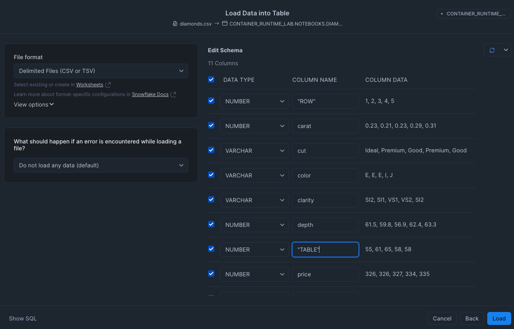

author: Charlie Hammond
id: notebook-container-runtime
summary: This guide will walk show you how to use Snowflake Notebooks with Container Runtime
categories: data-science, data-science-&-ml, Getting-Started, Notebooks
environments: web
status: Published 
feedback link: https://github.com/Snowflake-Labs/sfguides/issues
tags: Getting Started, Data Science

# Getting Started with Snowflake Notebook Container Runtime
<!-- ------------------------ -->
## Overview 
Duration: 1

Snowflake Notebooks in the Container Runtime are a powerful IDE option for building ML workloads at scale. Container Runtime (Public Preview) gives you a flexible container infrastructure that supports building and operationalizing a wide variety of resource-intensive ML workflows entirely within Snowflake. Using Snowflake Notebooks in Container Runtime gives you access to distributed processing on both CPUs and GPUs, optimized data loading from Snowflake, automatic lineage capture and Model Registry integration. Container Runtime also provides flexibility to leverage a set of preinstalled packages or the ability to pip install any open-source package of choice.  

This introductory Quickstart will take you through the steps of running Snowflake Notebooks with Container Runtime. We will install packages, train a model using pre-installed packages, and view logs. 

### Prerequisites
- A non-trial Snowflake account in a supported [AWS commercial region](https://docs.snowflake.com/en/developer-guide/snowpark-container-services/overview#available-regions).
- A Snowflake account login with a role that has the ACCOUNTADMIN role. If not, you will need to work with your ACCOUNTADMIN to perform the initial account setup (e.g. creating the CONTAINER_RUNTIME_LAB_USER role and granting required privileges, as well as creating the EXTERNAL ACCESS INTEGRATION).
- Foundational knowledge of Data Science workflows

### What You Will Learn 
- The key features of Snowflake Notebooks with Container Runtime

### What You’ll Need 
- A [Snowflake](https://app.snowflake.com/) Account

### What You’ll Build 
- A Snowflake Notebook that runs on scalable CPUs or GPUs using any Python package of choice

<!-- ------------------------ -->
## Setup Your Account
Duration: 2

Complete the following steps to setup your account:
- Navigate to Worksheets, click "+" in the top-right corner to create a new Worksheet, and choose "SQL Worksheet".
- Paste and the following SQL in the worksheet 
- Adjust <YOUR_USER> to your user
- Run all commands to create Snowflake objects

```sql
ALTER SESSION SET query_tag = '{"origin":"sf_sit-is", "name":"aiml_notebooks_container_runtime", "version":{"major":1, "minor":0}, "attributes":{"is_quickstart":1, "source":"sql"}}';
USE ROLE accountadmin;

CREATE OR REPLACE DATABASE container_runtime_lab;
CREATE SCHEMA notebooks;

CREATE OR REPLACE ROLE container_runtime_lab_user;
GRANT ROLE container_runtime_lab_user to USER <YOUR_USER>;

GRANT USAGE ON DATABASE container_runtime_lab TO ROLE container_runtime_lab_user;
GRANT ALL ON SCHEMA container_runtime_lab.notebooks TO ROLE container_runtime_lab_user;
GRANT CREATE STAGE ON SCHEMA container_runtime_lab.notebooks TO ROLE container_runtime_lab_user;
GRANT CREATE NOTEBOOK ON SCHEMA container_runtime_lab.notebooks TO ROLE container_runtime_lab_user;
GRANT CREATE SERVICE ON SCHEMA container_runtime_lab.notebooks TO ROLE container_runtime_lab_user;

CREATE OR REPLACE WAREHOUSE CONTAINER_RUNTIME_WH AUTO_SUSPEND = 60;
GRANT ALL ON WAREHOUSE CONTAINER_RUNTIME_WH TO ROLE container_runtime_lab_user;

-- Create and grant access to compute pools
CREATE COMPUTE POOL IF NOT EXISTS cpu_xs_5_nodes
  MIN_NODES = 1
  MAX_NODES = 5
  INSTANCE_FAMILY = CPU_X64_XS;

CREATE COMPUTE POOL IF NOT EXISTS gpu_s_5_nodes
  MIN_NODES = 1
  MAX_NODES = 5
  INSTANCE_FAMILY = GPU_NV_S;

GRANT USAGE ON COMPUTE POOL cpu_xs_5_nodes TO ROLE container_runtime_lab_user;
GRANT USAGE ON COMPUTE POOL gpu_s_5_nodes TO ROLE container_runtime_lab_user;

-- Create and grant access to EAIs
-- Substep #1: create network rules (these are schema-level objects; end users do not need direct access to the network rules)

create network rule allow_all_rule
  TYPE = 'HOST_PORT'
  MODE= 'EGRESS'
  VALUE_LIST = ('0.0.0.0:443','0.0.0.0:80');

-- Substep #2: create external access integration (these are account-level objects; end users need access to this to access the public internet with endpoints defined in network rules)

CREATE OR REPLACE EXTERNAL ACCESS INTEGRATION allow_all_integration
  ALLOWED_NETWORK_RULES = (allow_all_rule)
  ENABLED = true;

CREATE OR REPLACE NETWORK RULE pypi_network_rule
  MODE = EGRESS
  TYPE = HOST_PORT
  VALUE_LIST = ('pypi.org', 'pypi.python.org', 'pythonhosted.org',  'files.pythonhosted.org');

CREATE OR REPLACE EXTERNAL ACCESS INTEGRATION pypi_access_integration
  ALLOWED_NETWORK_RULES = (pypi_network_rule)
  ENABLED = true;

GRANT USAGE ON INTEGRATION allow_all_integration TO ROLE container_runtime_lab_user;
GRANT USAGE ON INTEGRATION pypi_access_integration TO ROLE container_runtime_lab_user;

```

<!-- ------------------------ -->
## Import Data
Next, we will upload the diamonds.csv dataset.

- Download diamonds.csv [here](https://github.com/Snowflake-Labs/sfguide-getting-started-with-snowflake-notebook-container-runtime/blob/main/scripts/diamonds.csv)
- Change role to container_runtime_lab_user
- In Snowsight, navigate to Data >> Databases and select container_runtime_lab.notebooks 
- Select Create >> Table >> From File >> Standard in the top right, and upload the diamonds.csv dataset.
- Add Name of `DIAMONDS`
- Update columns `row` to `"ROW"` and `table` to `"TABLE"`



<!-- ------------------------ -->
## Run the Notebook
Duration: 15

- Download the notebook from this [link](https://github.com/Snowflake-Labs/sfguide-getting-started-with-snowflake-notebook-container-runtime/blob/main/notebooks/0_start_here.ipynb)
- Change role to CONTAINER_RUNTIME_LAB_USER
- Navigate to Projects > Notebooks in Snowsight
- Click Import .ipynb from the + Notebook dropdown
- Create a new notebok with the following settings
  - Notebook Location: CONTAINER_RUNTIME_LAB, NOTEBOOKS
  - Run On Container
  - Snowflake ML Runtime GPU 1.0
  - GPU_S_5_NODES


- Click the three dots in the top right > Notebook Settings
- Enable the PYPI_ACCESS_INTEGRATION


- Run cells in the notebook!


<!-- ------------------------ -->
## Conclusion And Resources
Duration: 1

In conclusion, running Snowflake Notebooks Container Runtime offers a robust and flexible infrastructure for managing large-scale, advanced data science and machine learning workflows directly within Snowflake. With the ability to install external packages and choose optimal compute resources, including GPU machine types, Container Runtime provides a more versatile environment suited to the needs of data science and ML teams. 

Ready for more? After you complete this quickstart, you can try [building an XGBoost model with GPUs in Snowflake Notebooks](https://quickstarts.snowflake.com/guide/train-an-xgboost-model-with-gpus-using-snowflake-notebooks/index.html#0).

### What You Learned
- The key features of Snowflake Notebooks with Container Runtime

### Related Quickstarts
- [Train an XGBoost model with GPUs in Snowflake Notebooks](https://quickstarts.snowflake.com/guide/train-an-xgboost-model-with-gpus-using-snowflake-notebooks/index.html#0)

### Related Resources
- [Snowflake ML Webpage](https://www.snowflake.com/en/data-cloud/snowflake-ml/)
- [Documentation](https://docs.snowflake.com/LIMITEDACCESS/snowsight-notebooks/ui-snowsight-notebooks-runtime)
- [YouTube Tutorials](https://www.youtube.com/playlist?list=PLavJpcg8cl1Efw8x_fBKmfA2AMwjUaeBI)
