author: Matt Harris (Snowflake) and Atalia Horenshtien (DataRobot)
id: operationalizing_ai_with_snowflake_and_datarobot
summary: This is a sample Snowflake Guide!!
categories: Data-Science-&-Ml
environments: web
status: Draft 
feedback link: https://github.com/Snowflake-Labs/sfguides/issues
tags: Getting Started, Data Science, Machine Learning, DataRobot, Automated ML, AI

# Operationalizing AI with Snowflake and DataRobot

## Overview 
Duration: 5

This guide will take you through the process of developing, deploying, and monitoring machine learning models within your Snowflake environment using DataRobot and Snowpark.

The use case for this lab is a fraud detection use case, and we will perform  supervised machine learning by building a binary classification model to help predict whether a transaction is likely to be fraud.

The historical dataset we will be working with today contains details about the transaction.
Here is a description of the features:
<br/><br/>
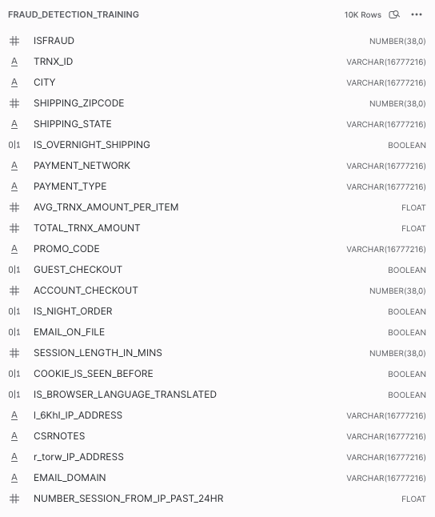
<br/><br/>


### Prerequisites
- Basic knowledge of SQL, and database concepts and objects
- Basic understanding of Snowpark and Python
- Basic understanding of data science and machine learning

### What You’ll Learn 
- Utilizing Snowpark and DataRobot-hosted Notebooks for feature engineering on your Snowflake data
- Applying DataRobot Machine Learning to build, analyze model performance, and transform it into actionable insights.
- Basic understanding of data science and machine learning
- Using DataRobot AI Production capabilities and Snowpark to simplify the deployment and monitoring processes within the Snowflake environment

### What You’ll Need 
- A [Snowflake](https://signup.snowflake.com/) Account (if you are using an enterprise account through your organization, it is unlikely that you will have the privileges to use the `ACCOUNTADMIN` role, which is required for this lab). Be advised to configure it to be 'Enterprise' and on AWS.

- Download the following notebook that we will work on most of the lab
<button>

  [Download the notebook](https://github.com/datarobot-community/ai-accelerators/blob/main/ecosystem_integration_templates/Snowflake_snowpark_template/Native%20integration%20DataRobot%20and%20Snowflake%20Snowpark-Maximizing%20the%20Data%20Cloud.ipynb)
</button>

### What You’ll Build 
- Snowflake objects, including tables and warehouses, to scale and manage your data 
- Acquire a training dataset from a Snowflake table using Snowpark for Python
- Feature engineering: analyze data and create new features using Snowpark
- Build a new DataRobot project with over 50+ machine learning models automatically to measure their performance and interpret
- Analyze and evaluate model performance and explainability using DataRobot predictive experimentation
- Deploy the recommended model to Snowflake using DataRobot AI Production
- Score the model via Snowpark for Java
- Monitor the model with DataRobot AI Production

## Setting up Snowflake
Duration: 5

The first thing you will need to do is download the following .sql file that contains a series of SQL commands we will execute throughout this lab.

<button>

  
  [Download .sql File](https://datarobot.box.com/s/kucpd28zqvz4p38brsghye01ht2bn1bw)
</button>
<br/><br/>

At this point, log into your Snowflake account and open a new `Worksheet`. If you have just created a free trial account, you will land in the `Learn` section. Simply navigate to the `Worksheets` tab on the left and click `+ Worksheet` in the top right hand corner.

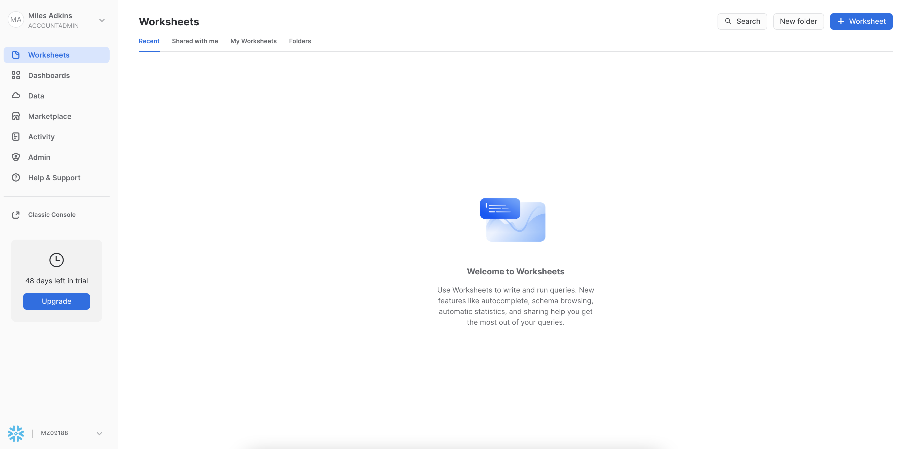
<br/><br/>

To ingest our script in the Snowflake UI, click the down arrow next to the time your notebook was created in the top left hand side of your screen and load our `Snowflake_Datarobot_HOL.sql` script using the `Import SQL from File` button. You can also change the name of this worksheet to "Snowflake-DataRobot VHOL"


<br/><br/>

Snowflake provides "worksheets" as the spot for you to execute your code. For each worksheet you create, you will need to set the “context” so the worksheet knows how to behave. A “context” in Snowflake is made up of 4 distinctions that must be set before we can perform any work: the “role” we want to act as, the “database” and “schema” we want to work with, and the “warehouse” we want to perform the work.

Lets go ahead and set the role we want to act as, which will be `ACCOUNTADMIN` to begin with. This can either be done manually in the UI or programmatically in a worksheet (`ACCOUNTADMIN` is the default role for a first time user). Lets do so programmatically in our worksheet by executing our first line of code:

```sql
USE ROLE accountadmin;
```

To execute this code, all we need to do is place our cursor on the line we wish to run and then either hit the "run" button at the top left of the worksheet or press `Cmd/Ctrl + Enter`.

In addition to traditional SQL statements, Snowflake Data Definition ([DDL](https://docs.snowflake.com/en/sql-reference/sql-ddl-summary.html)) commands, such as setting the worksheet context, we will also execute the following code within the worksheet. The "role": `ACCOUNTADMIN`, we already set earlier. To set our "database", "schema", and "warehouse", execute the following code:

```sql
USE DATABASE SANDBOX;
USE SCHEMA public;
USE WAREHOUSE DEMO_WH;
```

Each step throughout the guide has an associated SQL command to perform the work we are looking to execute, and so feel free to step through each action running the code line by line as we walk through the lab.

<!-- 
## Creating a Snowflake Database
Duration: 2

To get started, we are going to create our first Snowflake object and `CREATE` a database called `SANDBOX` that will be used for loading the structured data for our current example. To get back to our main navigation menu, simply click on the `HOME` button at the top left hand side of the worksheet.

From here, click on the "Data" tab and click `+ Database`, to create a new database object. Every Snowflake trial provides you with two default databases, which is why you already see database objects on your list.

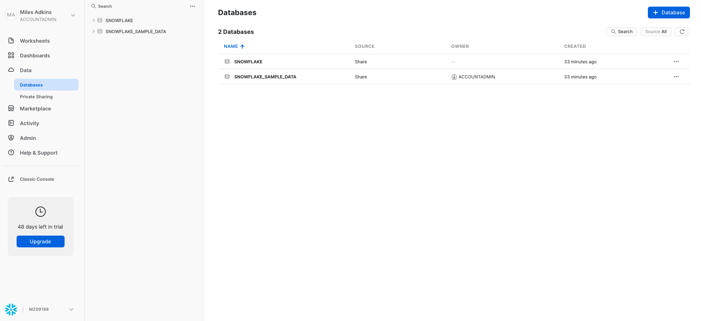
<br/><br/>

Enter `SANDBOX` in the "Name" section, and click "Create".

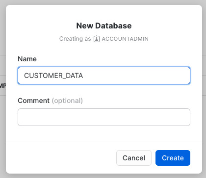
<br/><br/>

You should now see your new database added to the list. Lets navigate back to our `Snowflake-DataRobot VHOL` worksheet. You should see our worksheet with all of the SQL we loaded in the prior step. In the future you can skip this step by executing the following line of code:

```sql
CREATE OR REPLACE DATABASE SANDBOX;
```

We will continue to set the context for our worksheet. The "role": `ACCOUNTADMIN`, we already set earlier. To set our "database", "schema", and "warehouse", execute the following code:

```sql
USE DATABASE SANDBOX;
USE SCHEMA public;
USE WAREHOUSE DEMO_WH;
```

One thing to note is, we already have already executed some SQL commands without a warehouse attached. So why did they work then? Because the only commands executed so far are DDL commands. These commands are free in Snowflake. Only when you start working with data does a warehouse turn on.

Continuing, trial accounts automatically come with `DEMO_WH` created for you. If you already had an account that you are using for this lab, you probably didn't have this warehouse anymore. Whether you did or you didn't have this warehouse, the `OR REPLACE` part of the `CREATE OR REPLACE WAREHOUSE DEMO_WH` command will simply replace the old warehouse object if it already existed.

-->

## Creating a Snowflake Table
Duration: 2

As part of the lab, we are going to create 2 tables:
 - `TRAIN_DATA` -- The dataset that we will use to train our machine learning model 
 - `SCORING_DATA` -- Out of sample data that we will use to score and validate our model
 
 (We will create both both through DataRobot Notebooks)


## Connecting Snowflake with DataRobot
Duration: 5

At this point in time, we have our data sitting in an optimized table within Snowflake that is available for a variety of different downstream functions. Snowflake does not offer machine learning capabilities, and therefore, happily partners with the leading data science and machine learning partners in the industry. We are on a mission to help us figure out which transactions are most likely to be fraud and DataRobot can help us build a machine learning model to answer that question.

Snowflake's Partner Connect feature allows you to seamlessly get started with partner tools and manages most of the connection details for you to get up and running as quickly as possible. To get here, click our "Home" button and then navigate to "Admin" and then "Partner Connect". This should take you to the following screen where you will see many of the Snowflake partners, and through a simple method of setting up an account and integration, allow you to quickly move data into a partner tool. Click the "Data Science & ML" category and click "DataRobot".

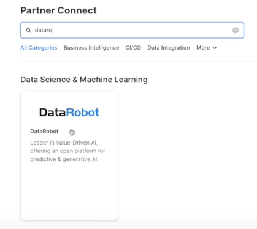
<br/><br/>

We have all the Snowflake objects we need created already, so press "Connect".

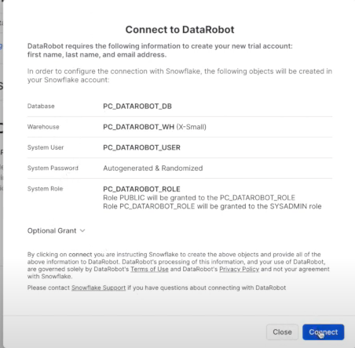

And activate our account, so press "Activate".

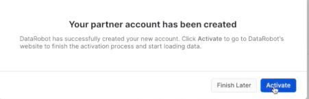

<!-- ------------------------ -->
## Getting Started with DataRobot
Duration: 2

Go ahead and set up a password, and then click "Sign up" for us to proceed.

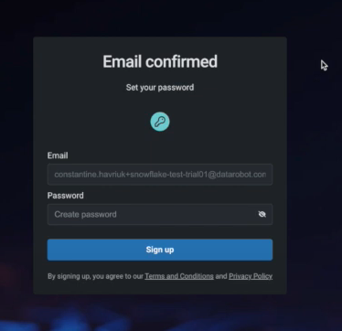
<br/><br/>

DataRobot is software-as-a-service (SaaS) application deployed on the cloud for your convenience, provides all the tools you need to confidently build, deploy, manage, and govern both generative and predictive AI solutions for enterprises.

Click "Get started" for us to proceed.

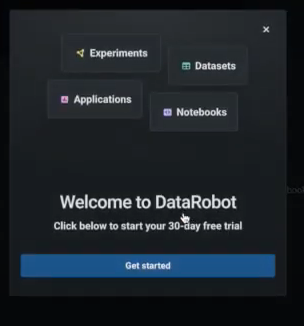
<br/><br/>
<!-- ------------------------ -->
## Setting up a DataRobot Use Case
Duration: 5

This is Workbench, and is the next user interface and a logical update from DataRobot Classic. All new features will be built in the new Workbench.

DataRobot provides easy access to all the necessary resources. Personal and shared projects are displayed, acting as a centralized folder for organized AI assets. It eliminates the need for manual folder management and allows quick access to datasets, experiments, apps, and notebooks. The organized approach facilitates tracking, management, asset consolidation, collaboration, and efficiency for individuals and teams.

Let's create our Fraud Detection use case:
On the top right click '+ Create Use Case' and name it 'Fraud Detection' 

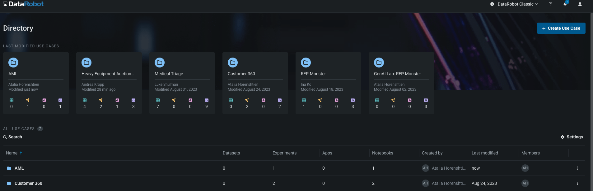
<br/><br/>

Interacting with DataRobot is flexible. You can choose between a low-code option or code-first options. 

In the code-first option, you have the freedom to use DataRobot as an API call within your preferred notebook, similar to any modern data science library. 

Alternatively, you can utilize DataRobot's fully managed and hosted Notebooks to keep everything organized across teams, which is what we are going to do today. 

Now we can bring our Notebook: click on the 'Notebooks' tab and import the notebook from the prerequisites 

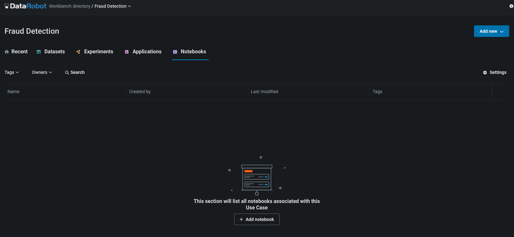
<br/><br/>

<!-- ------------------------ -->
## DataRobot Notebook
Duration: 2

These notebooks support Python and R, letting data scientists easily run code with all essential tools on the platform. They offer built-in revision history for simple checkpointing and version reverting. 

DataRobot's notebooks negate the need for adjusting compute resources and images, allowing focus on work with one click, devoid of handling basic infrastructure tasks. Additionally, they provide common code snippets for time-saving and focus on creative experimentation. 

Integration with OpenAI offers superior Generative AI assistance, automated code generation, enhanced datasets, insights, and optimization, boosting productivity and performance.

<!-- ------------------------ -->
## DataRobot Notebook SetUp
Duration: 5

Before running the notebook or executing any cells, ensure the following environment variable:

1. Make sure the environment is Python 3.8
2. Configure the following environmental variables (with your own Snowflake credentials): 
- 'snowflake_user': Snowflake user name 
- 'snowflake_password': Snowflake password 
- 'snowflake_account': Snowflake account name (You can find it in the confirmation email from Snowflake - from the Dedicated Login URL: https://abcd-ab03384.snowflakecomputing.com - 'abcd-ab03384' is the account name)

Most of this workflow is executed by the notebook, but you will create a deployment and monitor it via the DataRobot GUI. Supporting documentation for these steps are included in the notebook.

<!-- ------------------------ -->
## DataRobot Notebook Experimentation
Duration: 15

Let's move to run cells and the instructions in the notebook. We will come back to the guide before moving to the 'Model Deployment' stage.

<!-- ------------------------ -->
## Create a Snowflake Prediction Environment
Duration: 5

First, we need to change to 'DataRobot Classic'. 'Deployments' and our AI production capabilities are in 'Classic' and will be part of the new experience 11/7, and all functionality available in Classic will eventually migrate into the new experience.

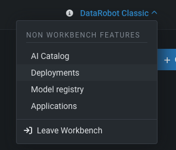
<br/><br/>

Because we would like to deploy a model into the 'Finance' schema we need to create a new data connection.

Click on the top right icon >> 'Data connections' >> Put your credentials + Add parameter - the schema 'FINANCE'

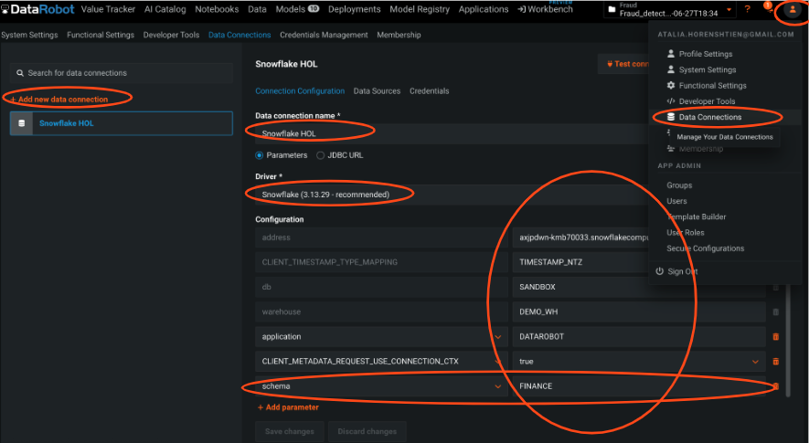
<br/><br/>

Because we are going to deploy the model to Snowflake, we need to set up a Snowflake prediction environment. 

This means that DataRobot will completely manage and automatically control this prediction environment, including model deployment and replacement.

Press on the 'Deployment' Tab >> 'Prediction Environments' tab >>Add prediction environment
1. Create prediction environment 
2. Choose the Snowflake data connection you have
3. Press add environment

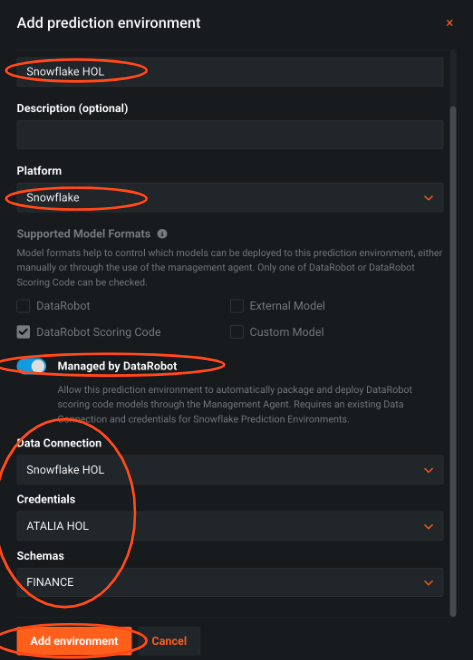
<br/><br/>

<!-- ------------------------ -->
## Register the Model and Create a Snowflake Demployment
Duration: 5

To keep a version of the model we are going to deploy, we will add it to the registry.

Press on the 'Models' tab >> press on the desired model >> press on 'Predict' tab >> press on 'Deploy' tab >> click 'Add to Model Registry'.

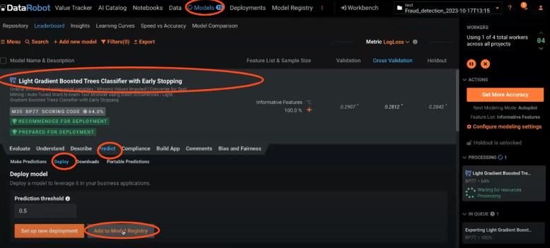
<br/><br/>

Press on the 'Model registry' tab >> press on 'Model Packages' tab >> press on the desired model >> 'Deploy model package'.

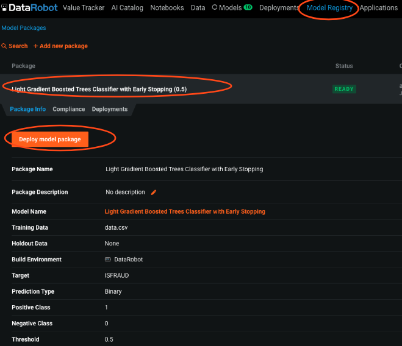
<br/><br/>

You can pick where to deploy it, here we choose Snowflake and choosing the prediction environment we set earlier.

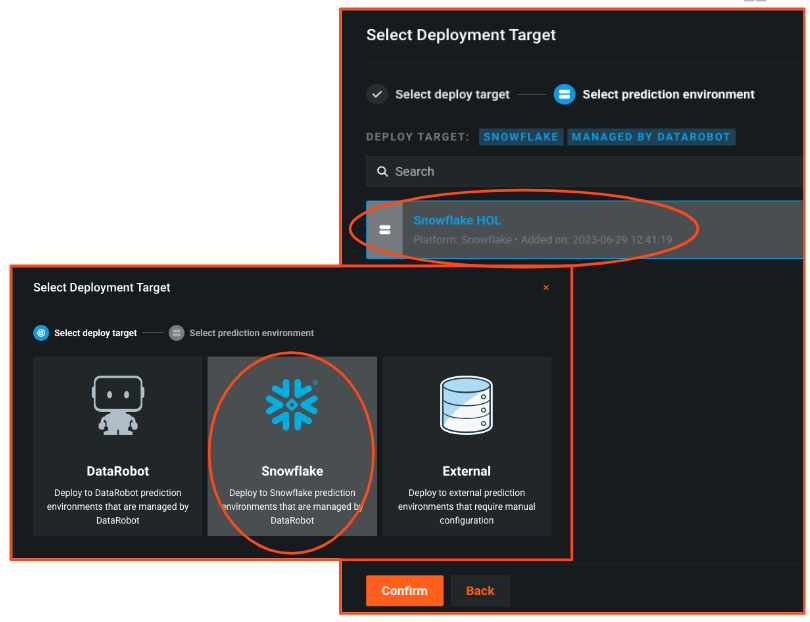
<br/><br/>


We are ready to deploy our model to Snowflake. Create the deployment by clicking 'Deploy model'. The JAVA UDF will be pushed automatically to your Snowflake environment.

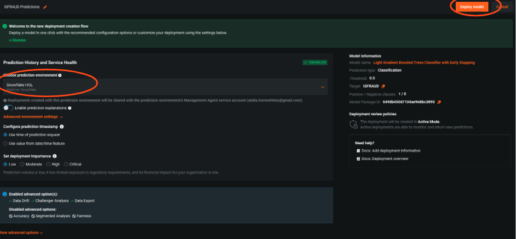
<br/><br/>

<!-- ------------------------ -->
## Check Deployment Status
Duration: 5

To ensure the deployment process was successful, you can go to the 'Deployment' tab and look for the deployment. We can see that the management agent is now running, and we have a health indicator in the GUI.

To ensure the UDF was pushed you can check if the UDF appears in your snowflake account, under your schema.

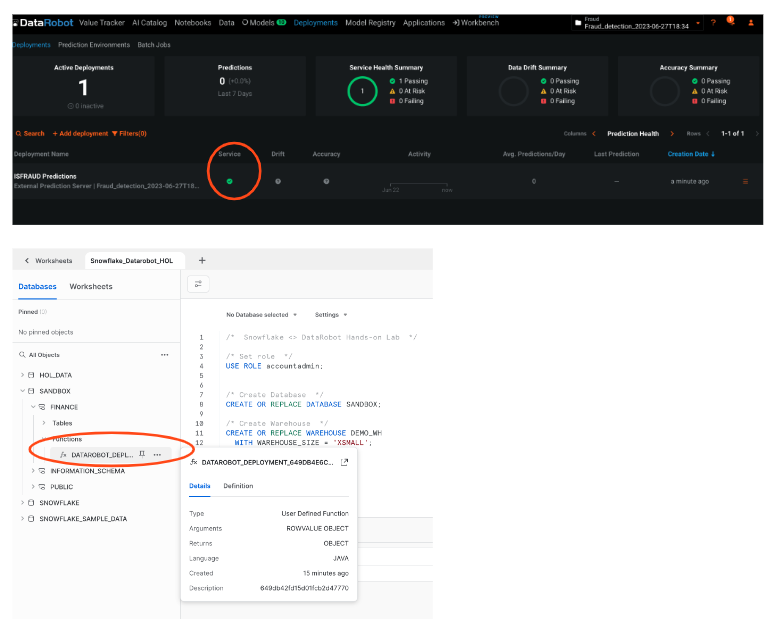
<br/><br/>

Please copy the deployment id from the URL, we will use it with the notebook.

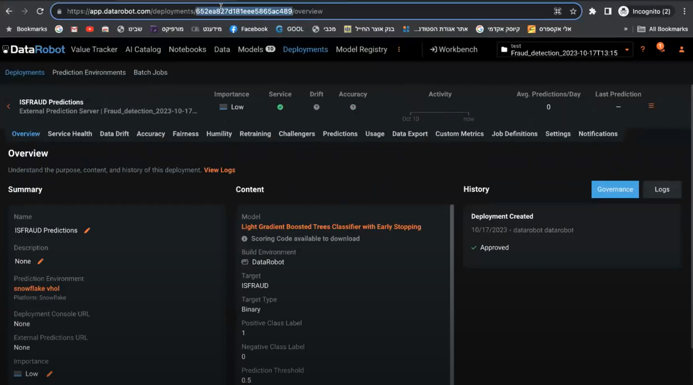
<br/><br/>

Now we can go back to the notebook to score our prediction data with Snowpark, see the results and come back here in the 'Model monitoring' section

<!-- ------------------------ -->
## Create a Monitoring job
Duration: 5

To make sure business decisions are aligned with external and internal factors, you need to monitor the model performance and understand if you need to replace or retrain it. 

DataRobot provides the flexibility to do that with models that are deployed in platforms outside of DataRobot, such as Snowflake.

Let’s define a monitoring job to read past predictions and/or actuals from a database table. 

Press on the 'Deployment' Tab >> Choose the deployed model >> Press on Job Definitions tab >> Add job definition
1. Configure the table and columns to track - we choose the predictions columns 'TRUE_FRAUD' and 'FALSE_FRAUD'.
   
   Optional: track actuals for model accuracy
2. Decide job schedule - you can decide if this job will run immediately or on a scheduled basis. This decision is based on your business rules and how often there is new data. For this lab, let’s choose immediately

Press 'Save and run monitoring job definition'

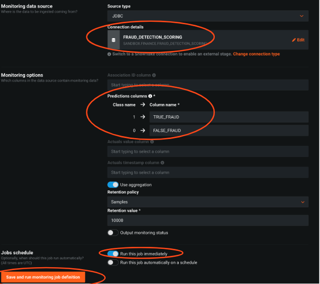
<br/><br/>

We see that the job is being executed and right after that the job has been completed

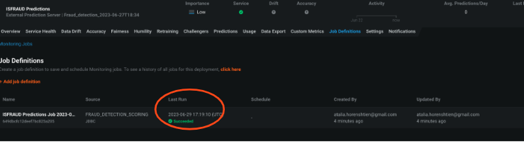
<br/><br/>

<!-- ------------------------ -->
## Track Model Performance
Duration: 2

DataRobot will monitor the predictions and the actual values and organize them over time in our Monitoring Engine to track data drift and accuracy for the model.

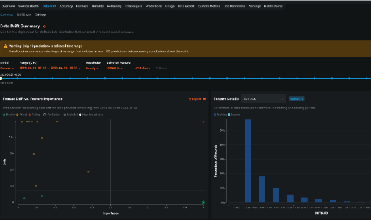
<br/><br/>

These out-of-the-box graphs will change over time and can help determine the model's accuracy.

<!-- ------------------------ -->
## Conclusion
Duration: 3

Together with Snowflake and DataRobot you can:

1. Empower Your Data Capabilities: By merging the power of Snowpark and DataRobot-hosted Notebooks, enhance your feature engineering capabilities on Snowflake data. Dive deep into the world of data science and machine learning to transform raw data into actionable insights seamlessly.

2. Experience Comprehensive Building Tools: Elevate your data management skills by constructing vital Snowflake objects and experience automated machine learning, ensuring optimal performance and understanding.

3. Efficient Deployment & Seamless Monitoring: Simplify and streamline your deployment journey in the Snowflake environment. With the amalgamation of DataRobot AI Production capabilities and Snowpark, ensure not just the deployment but also the scoring and proactive monitoring of your models, ensuring maximum uptime and efficiency.

For more, check our [partnership page](https://www.snowflake.com/en/why-snowflake/partners/technology-partners/DataRobot/)