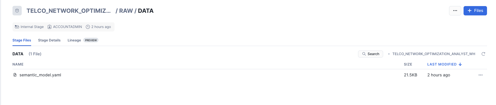
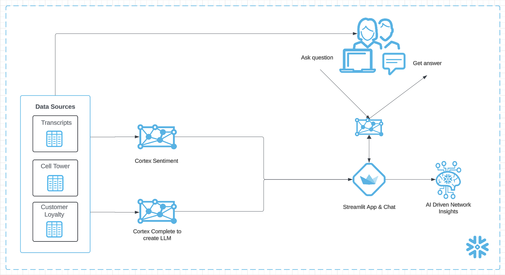

author: Swathi Jasti
id: optimizing-network-operations-with-cortex-ai-call-transcripts-and-tower-data-analysis
categories: snowflake-site:taxonomy/solution-center/certification/quickstart, snowflake-site:taxonomy/product/ai, snowflake-site:taxonomy/product/analytics, snowflake-site:taxonomy/snowflake-feature/cortex-analyst
language: en
summary: Optimizing Network Operations with Cortex AI - Call Transcripts and Tower Data Analysis 
environments: web
status: Published 
feedback link: https://github.com/Snowflake-Labs/sfguides/issues

# Optimizing Network Operations with Snowflake Cortex AI

## Overview

This quickstart helps you develop a streamlit application utilizes cell tower data, support ticket call transcripts, and customer loyalty insights to optimize network operations with Cortex AI. It helps network teams prioritize which cell towers to address when resolving issues and includes a Cortex Analyst chatbot for querying and interacting with the network data.

### Prerequisites
- Privileges necessary to create a user, database, and warehouse in Snowflake
- A Snowflake account login with a role that has the ACCOUNTADMIN role. If not, you will need to work with your ACCOUNTADMIN to perform the initial account setup.

### What You Will Learn
- How to optimize network operations using Cortex AI
- How to use cell tower data, support ticket call transcripts, and customer loyalty insights to prioritize cell tower repairs
- How to interact with network data using the Cortex Analyst chatbot

### What You Will Need
- A [GitHub](https://github.com/) Account
- A [Snowflake](https://app.snowflake.com/) Account with Accountadmin access

### What You Will Build
- A solution that provides an overview of cell tower performance through an interactive map
- A chatbot that enables intuitive interaction with cell tower data

## Setup Environment

In the Snowsight, Navigate to Worksheets, click "+" in the top-right corner to create a new Worksheet, and choose "SQL Worksheet".

Run the SQL from the [file](https://github.com/Snowflake-Labs/sfguide-optimizing-network-operations-with-cortex-ai-call-transcripts-and-tower-data-analysis/blob/main/scripts/setup.sql) in the worksheet to create Snowflake objects (database, schema, tables). 

The above scripts creates sentiment scores for call transcripts using CORTEX SENTIMENT function which will then be used in the Streamlit App. 

## Ingest the Semantic Model YAML

In the Snowsight, Navigate to Data, click on Databases.

- Search for the database TELCO_NETWORK_OPTIMIZATION_PROD and click on it
- Expand RAW schema in the database
- Click on Data stage which was created as part of the SQL script
- Download the [Semantic Model File](https://github.com/Snowflake-Labs/sfguide-optimizing-network-operations-with-cortex-ai-call-transcripts-and-tower-data-analysis/blob/main/streamlit/model/semantic_model.yaml) and upload to the stage.
- Once done, it should look like below

This semantic model file will then be used by the Cortex Analyst Chatbot in the Streamlit App.

## Streamlit App

To run the Streamlit Application,

- Download the [repo](https://github.com/Snowflake-Labs/sfguide-optimizing-network-operations-with-cortex-ai-call-transcripts-and-tower-data-analysis/tree/main)

- From your local Terminal, cd into the streamlit directory `cd sfguide-optimizing-network-operations-with-cortex-ai-call-transcripts-and-tower-data-analysis-main/streamlit/`

- You would need to update the secrets before you run the Streamlit Application. From the same Terminal window, run `vi .streamlit/secrets.toml` and update the account with your snowflake account, user with your snowflake user name and password with your snowflake password. Once updated, hit escape in the keyboard and type `:wq` to update and close the file

- Now, let's install the packages needed to run the application by running `pip3 install -r requirements.txt`

- Now to launch the application Run `streamlit run CellTowerMetrics.py` and the application will be launched in your local browser.

- Once the app is launched, if MFA is enabled in your account, you would need to approve the MFA to connect to the Snowflake.

The Streamlit App has two pages: Cell Tower Metrics and Cortex Analyst Chatbot.

### Cell Tower Metrics
The process of analyzing cell tower performance begins with viewing a visual map that displays the performance of individual cell towers, allowing for the analysis of their failure and success rates. The map automatically highlights the most problematic cells, enabling quick identification. By clicking on a failing cell, users can access detailed metrics, including selection and grid cell success and failure rates. For each cell, additional insights are provided, such as failure rates, customer loyalty status by cell, and sentiment scores derived from call transcripts. These insights empower network engineers to make informed decisions about which cells to prioritize for maintenance. Furthermore, Cortex AI leverages this data to recommend the cells that should be addressed first, considering failure rates, loyalty status, and sentiment scores, to optimize network operations effectively.

### Cortex Analyst Chatbot
The chatbot allows you to ask any questions related to cell tower data using natural language. It retrieves insights directly from the table and provides responses in natural language, making the interaction intuitive and user-friendly. Some sample questions you can ask Chatbot:

- What are the top 3 reasons of failures with their descriptions?
- What are the top 10 cells having release cause 38 as a release code?
- What are the top 10 cells that are congested?
- For the top 10 cells congested, list the 10 most impacted MSISDN.

## Conclusion And Resources

### What You Learned
- How to optimize network operations using Cortex AI
- How to use cell tower data, support ticket call transcripts, and customer loyalty insights to prioritize cell tower repairs
- How to interact with network data using the Cortex Analyst chatbot

### Related Resources
- [Source Code on GitHub](https://github.com/Snowflake-Labs/sfguide-optimizing-network-operations-with-cortex-ai-call-transcripts-and-tower-data-analysis/tree/main)
- [Cortex LLM Functions](https://docs.snowflake.com/en/user-guide/snowflake-cortex/llm-functions)
- [Cortex Analyst](https://docs.snowflake.com/en/user-guide/snowflake-cortex/cortex-analyst)
