author: Sweta
id: oracle-to-snowflake-with-snowpipe-streaming-for-real-time-analytics-using-striim
summary: This is a sample guide on how to use Striim for Snowflake to stream data from Oracle to Snowflake for real time analytics
categories: Getting-Started
environments: web
status: Published 
feedback link: https://github.com/Snowflake-Labs/sfguides/issues
tags: Getting Started, Data Science, Data Engineering 

# Oracle to Snowflake with Snowpipe Streaming for real-time analytics using Striim
<!-- ------------------------ -->
## Overview 
Duration: 1

Striim for Snowflake combines the power of fast data streaming with the simplicity of fully automated ELT (Extract-Load-Transform) data integration to replicate databases to Snowflake in real-time.

Striim for Snowflake is also the only automated data integration product that leverages Snowflake’s [new Snowpipe Streaming API](https://docs.snowflake.com/en/user-guide/data-load-snowpipe-streaming-overview) to provide fast, cost-optimized data ingestion. 

You can try Striim for Snowflake yourself by [signing up for a 14-day free trial with $1,000 worth of free credits included](https://go2.striim.com/trial-snowflake).
 

### Why Striim for Snowflake?

Striim for Snowflake is a revolutionary streaming service that combines real-time data integration with Snowflake's cloud platform. It's designed for everyone, whether you're new to data or an expert. You can create data pipelines without coding, thanks to its user-friendly interface. Plus, it's cost-efficient, as you only pay for what you use. With real-time data insights, you can make faster, more accurate decisions. Striim for Snowflake also supports various data sources, making it versatile for different needs. It's about making data integration easy, and powerful.


### Use Case 

Our Oracle database has hospital complications data that lists different types of complications occurring in various hospitals at a given time. For example “Collapsed lung due to medical treatment”. Data is ingested to the oracle database in real time. The business requirement is to track the number of incidents every minute in each hospital and generate an alert when the count of a particular type of complication is greater than 3 for preventative measures. The data is analyzed on a target Snowflake warehouse by means of a dynamic table. 

You can use the same technique to enrich and process incoming data for real-time analytics. After the source and target are configured, the real-time streaming pipeline is built using [Striim for Snowflake](https://www.striim.com/product/snowflake/), an enterprise product of Striim that offers real-time data integration and streaming as a fully managed SaaS solution optimized for Snowflake


### Prerequisites
- Access to Oracle database
  - Follow this [document](https://striim.com/docs/AWS/StriimForSnowflake/en/prerequisite-checks-oracle.html#basic-oracle-configuration-tasks)  to set up your Oracle Source
- Access to [Snowflake](https://signup.snowflake.com/) account with Key Pair Authentication associated with the role
- A free trial of [Striim for Snowflake](https://go2.striim.com/trial-snowflake)
- Download csv file from [here](https://github.com/striim/recipes/blob/main/Snowflakequickstartdata/HOSPITAL_COMPLICATIONS_202308291244.csv) 
- Python 3 

### What You'll Learn
In this quickstart, you will learn about real-time data integration tool, [Striim’s](https://www.striim.com/) – designed to stream data from over 100 sources with Change Data Capture to Snowflake with Snowpipe Streaming. You will also learn about Dynamic Tables that enable ELT with incremental processing in a few easy steps.


### What You'll Build
An end-to-end pipeline that streams Change Data Capture (CDC) from Oracle tables to the Snowflake warehouse in real-time using [Striim’s](https://www.striim.com/) streaming-SQL platform. The real-time transactional data is then transformed according to business needs using Dynamic tables in Snowflake.
<!-- ------------------------ -->
## Video Walkthrough
<video id="DnKE4Bnh6-Y"></video>


<!-- ------------------------ -->
## Setting up your source schema
For this tutorial we have used a source table, HOSPITAL_COMPLICATIONS. Please find the schema of the table below and create an empty table in your source database.

**Schema**

```
CREATE TABLE "<Database Name>"."HOSPITAL_COMPLICATIONS" 
   (	"COMPLICATION_ID" NUMBER(10,0) NOT NULL ENABLE, 
	"PROVIDER_ID" VARCHAR2(10), 
	"HOSPITAL_NAME" VARCHAR2(50), 
	"ADDRESS" VARCHAR2(50), 
	"CITY" VARCHAR2(50), 
	"STATE" VARCHAR2(40), 
	"ZIP_CODE" VARCHAR2(10), 
	"COUNTY" VARCHAR2(40), 
	"PHONE_NUMBER" VARCHAR2(15), 
	"MEASURE_NAME" VARCHAR2(100), 
	"MEASURE_ID" VARCHAR2(40), 
	"COMPARED_TO_NATIONAL" VARCHAR2(50), 
	"DENOMINATOR" VARCHAR2(20), 
	"SCORE" VARCHAR2(20), 
	"LOWER_ESTIMATE" VARCHAR2(40), 
	"HIGHER_ESTIMATE" VARCHAR2(20), 
	"FOOTNOTE" VARCHAR2(400), 
	"MEASURE_START_DT" DATE, 
	"MEASURE_END_DT" DATE, 
	 PRIMARY KEY ("COMPLICATION_ID"));
```

<!-- ------------------------ -->
## Configure Snowflake target connection

### Enter Snowflake  connection details

- To start building your data pipeline, first name your pipeline, and optionally add a description.
---
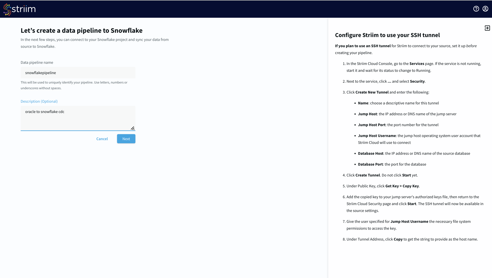

---

- Select an existing connection or add a new connection from scratch by adding hostname or account identifier, username and password for your Snowflake account, target database, role associated with the user id, Snowflake warehouse associated with the specified user, and any additional properties in the jdbc string in <key>=<value> format separated by ‘&’. Name your Snowflake connection. Striim saves these connection details under the connection name for future use.
---
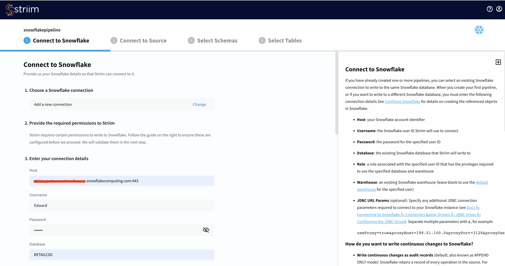

---

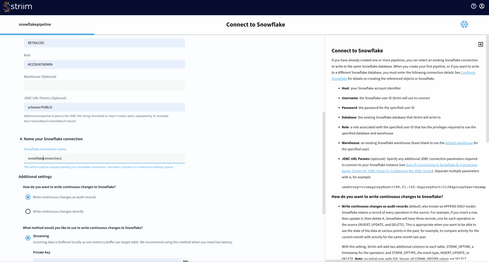

---
- For streaming continuous changes to Snowflake, enter the private key associated with the Snowflake account. Refer to this [documentation](https://docs.snowflake.com/en/user-guide/key-pair-auth) for setting up a key-pair auth for your Snowflake account.


---

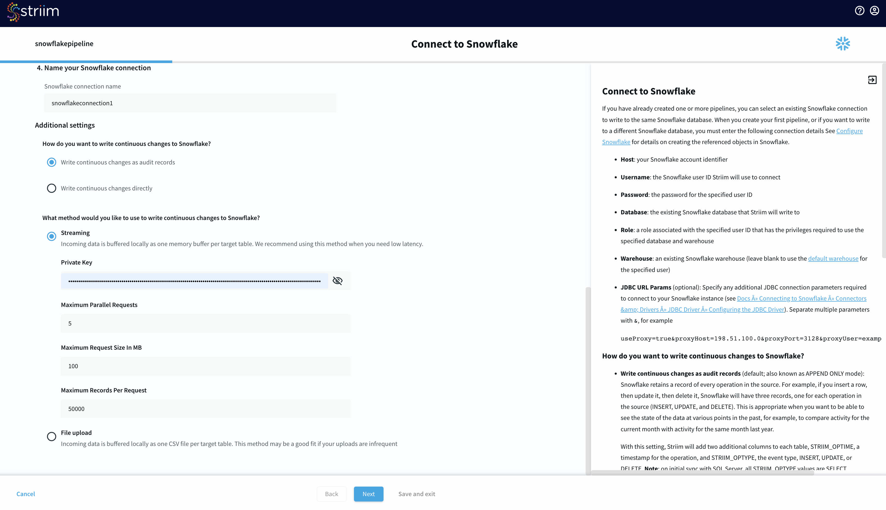

### Run Prerequisite checks
- After you have entered your connection details, click Next. Striim will check if all the prerequisites have been met.
---
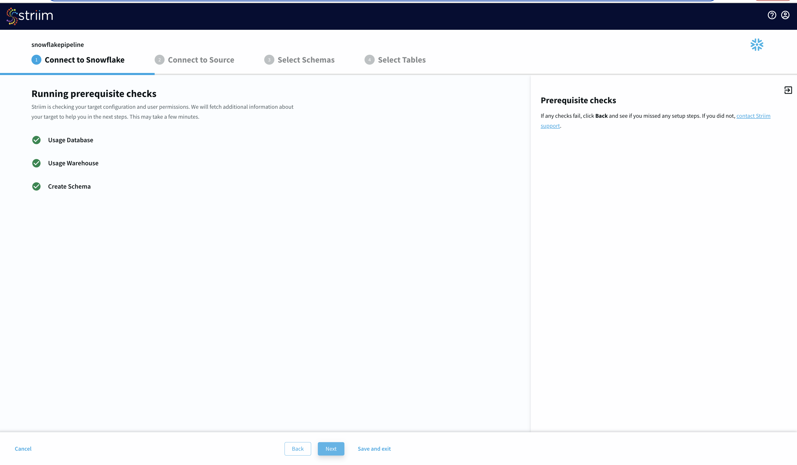

<!-- ------------------------ -->
## Configure Oracle source connection

### Enter Oracle connection details

- Once your target connection is verified, configure your source connection by selecting your source database. Here, we have selected Oracle as our data source.Select an existing connection or add a new connection. If your source is an Amazon RDS for Oracle, select that, otherwise select oracle_onprem. Enter the hostname, port, username, password and database name. You can also connect securely by using an SSH tunnel. For this recipe, we do not propagate schema changes to Snowflake target.

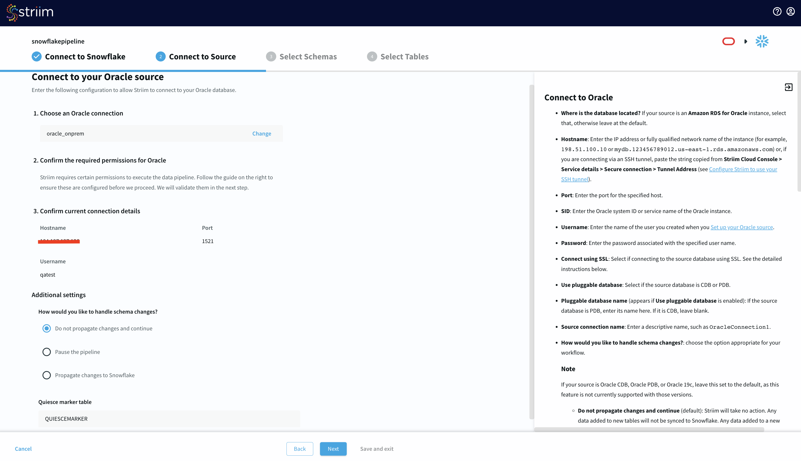

### Run Prerequisite checks

- Now Striim will run prerequisite checks to verify source configuration and user permissions. The setups required for running oracle CDC in Striim has been explained in the extra section at the end of this recipe.

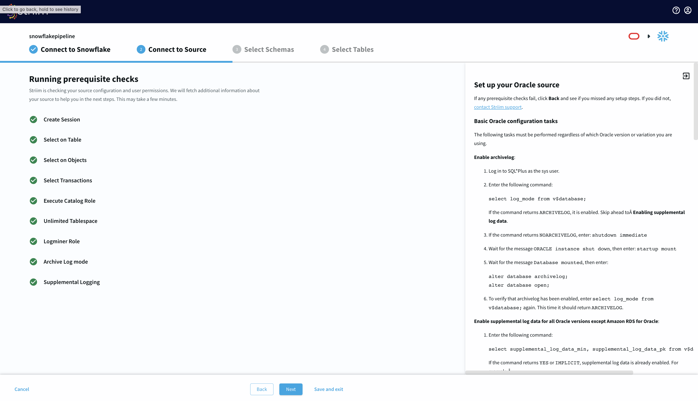

### Select Schema and Tables

- Select the source schema containing the tables you want to sync with Snowflake.
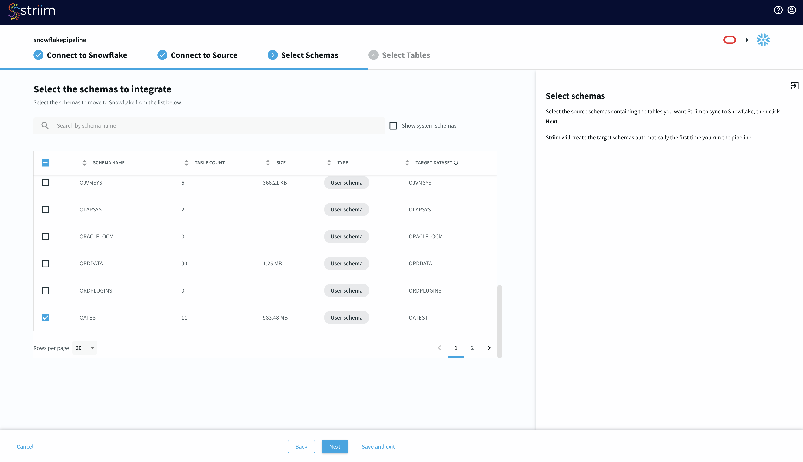

- Next, select the tables, optionally you can mask fields or select key columns.
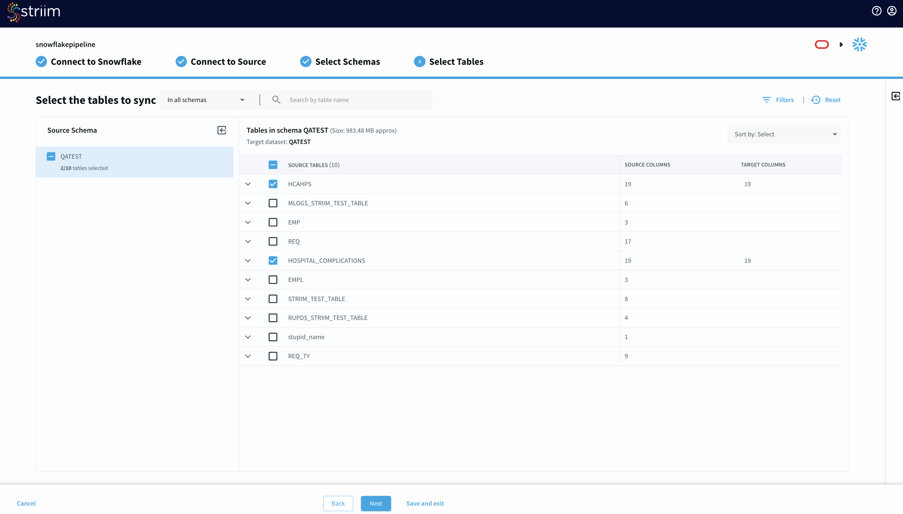

- Striim will now check the target warehouse and give you the option to sync with existing tables or create a new table. New tables would be created with the prefix SFS. You can use existing tables or drop and recreate tables.

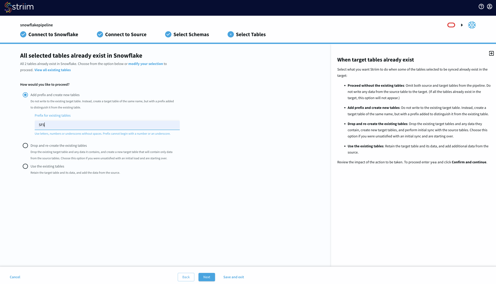

- You have the option to create table groups to isolate tables based on criticality and Data Contracts such as data freshness and schema evolution. 
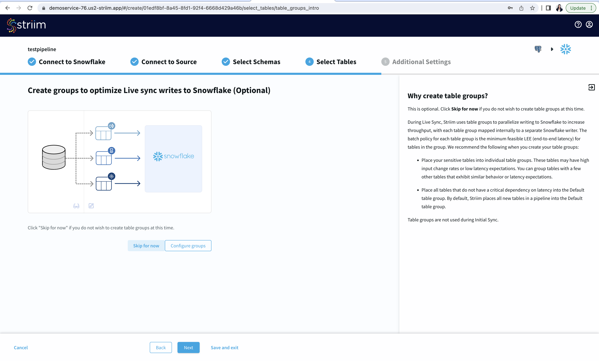

<!-- ------------------------ -->
## Review and Run your Pipeline

### Review the source and target details
- Review your source and target connection before running the pipeline. Make sure that your source and target connection details, selected tables and additional settings are correct.
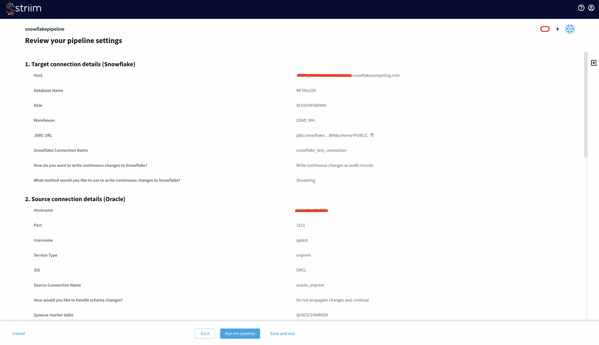

### Run the pipeline
- After you have reviewed your pipeline, run your pipeline to sync the table from your source with the target. For streaming change data capture (CDC), insert new data to your source table. The schema for the table and the shell script to generate new data used in this recipe is shared at the end of this blog. You can monitor the streaming events from UI as shown below:

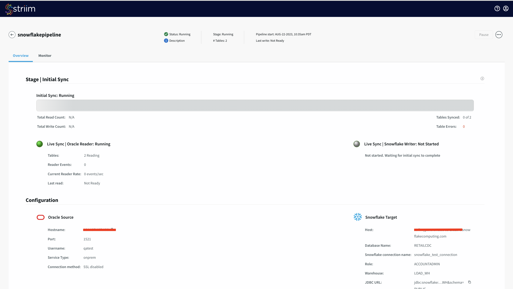

### Add new data to your source
Download the <a href="https://github.com/striim/recipes/blob/main/Snowflakequickstartdata/dataload_script.py" download="dataload_script.py">python script</a>and <a href="https://github.com/striim/recipes/blob/main/Snowflakequickstartdata/HOSPITAL_COMPLICATIONS_202308291244.csv" download="HOSPITAL_COMPLICATIONS_202308291244.csv">csv</a> file here. Enter the username, password and url of your oracle database in line 41 of the python script.Run the script from the directory containing the csv file.
<!-- ------------------------ -->

## Create a Snowflake Dynamic Table
[Dynamic tables](https://docs.snowflake.com/en/user-guide/dynamic-tables-about) play an important role in declarative data transformation pipelines. Snowflake dynamic tables provide a reliable, cost-effective, and automated way to transform data according to business needs. The end state of data transformation can be defined using dynamic tables. A dynamic table materializes the results of a specified query. No insert, update, or delete operations are required in dynamic tables. The automated refresh process materializes the query results into a dynamic table. When creating a dynamic table, you specify the query used to transform the data from one or more base objects or dynamic tables. An automated refresh process executes this query regularly and updates the dynamic table with the changes made to the base objects.

Dynamic tables can be used as the source of a data stream. When we have an incoming raw data stream, we can transform it according to our needs using a dynamic table. To learn more about dynamic tables, please follow this [snowflake documentation](https://docs.snowflake.com/en/user-guide/dynamic-tables-about).

Run the query below in Snowflake to create a Dynamic table from our pipeline:

```
CREATE OR REPLACE DYNAMIC TABLE <Database Name>.COMLICATIONCOUNT
LAG = '1 minute'
WAREHOUSE = 'LOAD_WH'
AS
SELECT * from (
  SELECT PROVIDER_ID, MEASURE_NAME, COUNT(MEASURE_NAME) AS CNT
    FROM QATEST.SFSHOSPITAL_COMPLICATIONS
        GROUP BY PROVIDER_ID, MEASURE_NAME
)
WHERE CNT>3;
```
Once the dynamic table is created, we can query it to see the data in real time as follows:


<!-- ------------------------ -->
## Conclusion
Striim for Snowflake makes it easy to stream data from any number of operational systems to Snowflake in real-time while optimizing ingest costs. Leverage cutting edge Snowflake technology such as Dynamic Tables to transform the way your data team operates.

Try **Striim for Snowflake** by signing up for 14 days free trial [here](https://go2.striim.com/trial-snowflake).
Learn more about data streaming using Striim through our [Tutorials and Recipes](https://www.striim.com/tutorial/).
Get started on your journey with Striim by signing up for free [Striim Developer](http://signup-developer.striim.com) or [Striim Cloud](https://go2.striim.com/demo).
<!-- ------------------------ -->