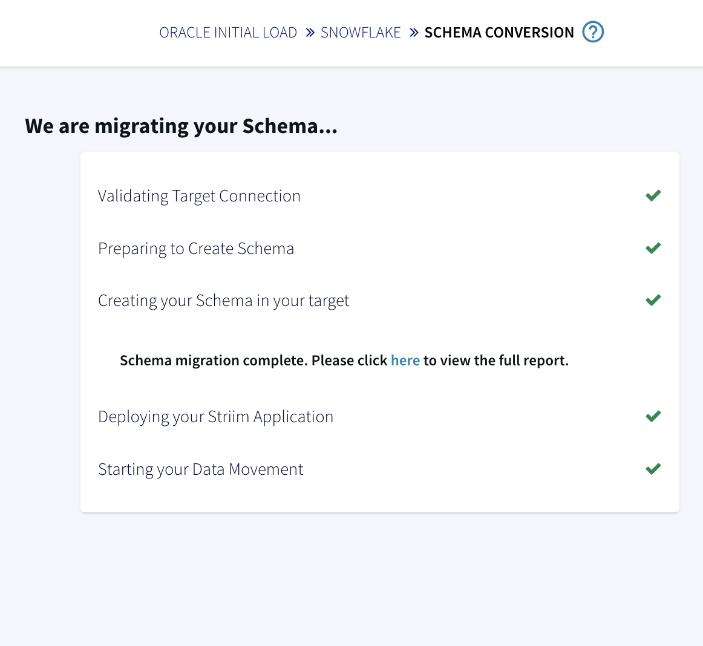
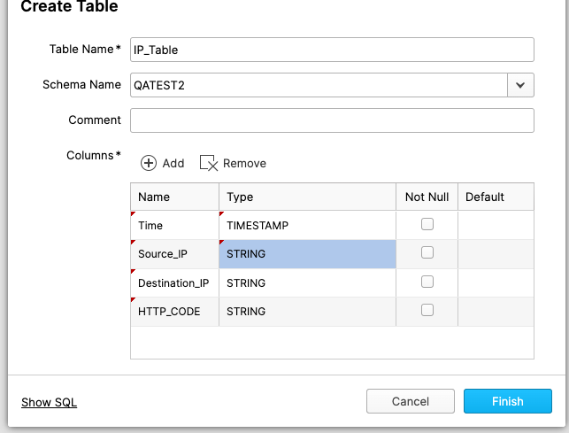

author: Sweta
id: oracle-to-snowflake-with-snowpipe-streaming-for-real-time-analytics-using-striim
summary: This is a sample guide on how to use Striim for Snowflake to stream data from Oracle to Snowflake for real time analytics
categories: Getting-Started
environments: web
status: Published 
feedback link: https://github.com/Snowflake-Labs/sfguides/issues
tags: Getting Started, Data Science, Data Engineering 

# Oracle to Snowflake with Snowpipe Streaming for real-time analytics using Striim
<!-- ------------------------ -->
## Overview 

Striim is a unified data streaming and integration product that offers change data capture (CDC), enabling continuous replication from over 150 operational sources – including Oracle, PostgreSQL, MongoDB, Salesforce, and IoT devices – into Snowflake in real-time. It demonstrates groundbreaking performance harnessing the power of Snowflake's Snowpipe Streaming API enabling use cases such as real-time hospital monitoring, anomaly detection in credit card processing, and AI inference applications.

You can try Striim yourself by signing up for our [free developer version](https://signup-developer.striim.com/), or [signing up for a 14-day free trial of Striim Cloud Enterprise with $1,000 worth of free credits included](https://go2.striim.com/free-trial).

 
### Why Striim?

In a matter of clicks, you can seamlessly turn Snowflake into a real-time source of truth combining massive amounts of enterprise, operational data in seconds. Striim is a revolutionary streaming platform that combines real-time data integration from various [sources to targets](https://www.striim.com/connectors/) with intelligent data pipelines. You can create data pipelines with no code, thanks to its user-friendly interface and serverless deployment options. Plus, it's cost-efficient, as you only pay for what you use and minimize duplicative compute to process data for ingest. With real-time data insights, you can make faster, more accurate decisions. Striim supports various data sources and targets, making it versatile for different business needs. 


### Use Case 

#### If you have access to Oracle database

If you have access to an Oracle database, you can run through this tutorial with sample data representing hospital complications data that lists different types of patient complications occurring in various hospitals at a given time. For example: “Collapsed lung due to medical treatment”. Data is ingested to the Oracle database in real time. The business requirement is to track the number of incidents every minute in each hospital and generate an alert when the count of a particular type of complication is greater than 3 for preventative measures. The data is analyzed on a target, Snowflake warehouse, by means of a dynamic table. 

You can use the same technique to enrich and process incoming data for real-time analytics. After the source and target are configured, the real-time streaming pipeline is built using [Striim Cloud](https://www.striim.com/product/striim-cloud/), an enterprise product of Striim.


#### If you do not have access to Oracle database
If you do not have access to an Oracle database, you can still get a feel of our streaming platform with our built in data-generator component that generates sample test data. Jump to Step 7 to run your Striim app using our data generator.


### Prerequisites

#### With Oracle Database, you need:
- Access to Oracle database
  - Follow this [document](https://striim.com/docs/AWS/StriimForSnowflake/en/prerequisite-checks-oracle.html#basic-oracle-configuration-tasks)  to set up your Oracle Source
- Access to [Snowflake](https://signup.snowflake.com/) account with Key Pair Authentication associated with the role
- A free trial of [Striim Cloud](https://go2.striim.com/free-trial) or [Striim Developer](https://signup-developer.striim.com/)
- Download csv file from [here](https://github.com/striim/recipes/blob/main/Snowflakequickstartdata/HOSPITAL_COMPLICATIONS_202308291244.csv) 
- Python 3 

#### With data generator, you need:
- A free trial of [Striim Cloud](https://go2.striim.com/free-trial) or [Striim Developer](https://signup-developer.striim.com/)
- Access to [Snowflake](https://signup.snowflake.com/) account with Key Pair Authentication associated with the role

### What You'll Learn
In this QuickStart, you will learn about [Striim Cloud](https://www.striim.com/), a real-time data integration tool, designed to stream data from over 100 sources with Change Data Capture to Snowflake. You will also learn about Dynamic Tables that enable ELT with automatic, incremental processing of new data in near real-time with just a few easy steps.


### What You'll Build
An end-to-end pipeline that streams Change Data Capture (CDC) from an Oracle source, or test data, to the Snowflake warehouse in real-time using [Striim’s](https://www.striim.com/) streaming-SQL platform. The real-time transactional data is then transformed according to business needs using Dynamic tables in Snowflake.
<!-- ------------------------ -->

## Setting up your source schema
For this tutorial we have used a source table, HOSPITAL_COMPLICATIONS. Please find the schema of the table below and create an empty table in your source database.

**Schema**

```
CREATE TABLE "<Database Name>"."HOSPITAL_COMPLICATIONS" 
   (	"COMPLICATION_ID" NUMBER(10,0) NOT NULL ENABLE, 
	"PROVIDER_ID" VARCHAR2(10), 
	"HOSPITAL_NAME" VARCHAR2(50), 
	"ADDRESS" VARCHAR2(50), 
	"CITY" VARCHAR2(50), 
	"STATE" VARCHAR2(40), 
	"ZIP_CODE" VARCHAR2(10), 
	"COUNTY" VARCHAR2(40), 
	"PHONE_NUMBER" VARCHAR2(15), 
	"MEASURE_NAME" VARCHAR2(100), 
	"MEASURE_ID" VARCHAR2(40), 
	"COMPARED_TO_NATIONAL" VARCHAR2(50), 
	"DENOMINATOR" VARCHAR2(20), 
	"SCORE" VARCHAR2(20), 
	"LOWER_ESTIMATE" VARCHAR2(40), 
	"HIGHER_ESTIMATE" VARCHAR2(20), 
	"FOOTNOTE" VARCHAR2(400), 
	"MEASURE_START_DT" DATE, 
	"MEASURE_END_DT" DATE, 
	 PRIMARY KEY ("COMPLICATION_ID"));
```

<!-- ------------------------ -->
## Create target Schema (for Oracle users)
### Step 1: Name your schema transfer app

On the Striim home page, click on Create App, then search for and select Source: Oracle Initial load and Target: Snowflake. Select the template and name your application.


### Step 2: Enter the source details 
Configure your source details by entering in the Hostname and Database Name for Oracle.


The wizard will automatically validate the source connection.


Select the tables required, as shown, for schema transfer.


### Step 3: Enter the target details 

Enter the Connection url and Authentication Type of your Target warehouse.


### Step 4: Start schema transfer
Migrate your Source schema to Target database.




<!-- ------------------------ -->
## Create Oracle CDC to Snowflake App (for users with Oracle Database)
### Step 1: Use the wizard to select Oracle CDC to Snowflake template

From the Create App page, search for and select Oracle CDC as your Source, and Snowflake as your Target. Then name your app, and click Save. 


### Step 2: Configure the Oracle CDC source 
To configure your Source, enter in the Hostname, Database, Username and Password.


### Step 3: Validate the connection

The Striim wizard will automatically validate your source connection.


### Step 4: Select your source database and tables


### Step 5: Configure your Snowflake target

Enter the Connection url, Username and Password of your Target, Snowflake warehouse.

The connection url format is: 
jdbc:snowflake://<<snowflake url>>/?db=<<database>>&role=<<role>>&warehouse=<<Warehouse>>&schema=<<schema>>


<!-- ------------------------ -->
## Deploy and Run your Pipeline
### Run the pipeline
- After you have deployed your app, run the streaming application to sync the table from your Source with the Target. For streaming change data capture (CDC), insert new data to your Source table. 


The python script to generate new data used in this recipe is shared in the next section. You can monitor the streaming events from UI as shown below:


### Add new data to your source
Download the <a href="https://github.com/striim/recipes/blob/main/Snowflakequickstartdata/dataload_script.py" download="dataload_script.py">python script</a>and <a href="https://github.com/striim/recipes/blob/main/Snowflakequickstartdata/HOSPITAL_COMPLICATIONS_202308291244.csv" download="HOSPITAL_COMPLICATIONS_202308291244.csv">csv</a> file here. Enter the Username, Password and url of your Oracle database in line 41 of the python script.Run the script from the directory containing the csv file.
<!-- ------------------------ -->

## Create a Snowflake Dynamic Table
[Dynamic tables](https://docs.snowflake.com/en/user-guide/dynamic-tables-about) play an important role in declarative data transformation pipelines. Snowflake dynamic tables provide a reliable, cost-effective, and automated way to transform data according to business needs. The end state of data transformation can be defined using dynamic tables. A dynamic table materializes the results of a specified query. No insert, update, or delete operations are required in dynamic tables. The automated refresh process materializes the query results into a dynamic table. When creating a dynamic table, you specify the query used to transform the data from one or more base objects or dynamic tables. An automated refresh process executes this query regularly and updates the dynamic table with the changes made to the base objects.

Dynamic tables can be used as the source of a data stream. When we have an incoming raw data stream, we can transform it according to our needs using a dynamic table. To learn more about dynamic tables, please review this [snowflake documentation](https://docs.snowflake.com/en/user-guide/dynamic-tables-about).

Run the query below in Snowflake to create a Dynamic table from our pipeline:

```
CREATE OR REPLACE DYNAMIC TABLE <Database Name>.COMLICATIONCOUNT
LAG = '1 minute'
WAREHOUSE = 'LOAD_WH'
AS
SELECT * from (
  SELECT PROVIDER_ID, MEASURE_NAME, COUNT(MEASURE_NAME) AS CNT
    FROM QATEST.SFSHOSPITAL_COMPLICATIONS
        GROUP BY PROVIDER_ID, MEASURE_NAME
)
WHERE CNT>3;
```
Once the dynamic table is created, we can query it to see the data in real time as follows:


<!-- ------------------------ -->
## Using Striim's built-in data generator
 If you do not have access to an Oracle database, you can still stream sample data using our data-generator component. Follow the steps below to create data generator to Snowflake application.

 ### Step 1: Click on Create App followed by Start from Scratch
 
 
 Name your Striim app.


### Step 3: Add auto-generating data source

On the flow designer, click on the link to add an auto-generating data-source for your streaming application.


You can select a simple or advanced source. For this tutorial, we will select a simple source.


The data generator comes with a Continuous Query that outputs data with SQL like queries.


### Create the Target table in Snowflake

Use the Snowflake UI/console to create the target table as shown below:


### Add Snowflake target to your pipeline

Select a Snowflake component from the left and drag it on the Striim flow designer.


Configure your Snowflake target by adding url, Username and Password.

The jdbc url will be in the format: jdbc:snowflake://<<snowflake url>>/?db=<<database>>&role=<<role>>&warehouse=<<Warehouse>>&schema=<<schema>>


### Deploy and Run your Striim App

Once the app is configured, deploy the streaming application.


Run the app to visualize real-time data streaming to Snowflake target.


<!-- ------------------------ -->
## Conclusion
Striim makes it easy to stream data from any number of operational systems to Snowflake in real-time while optimizing ingest costs. Leverage cutting-edge Snowflake technology such as Snowpipe Streaming Dynamic Tables to transform the way your data team operates enabling revenue-generating data products powered by real-time data, and data-driven backend operations with a 360 view of your business. 

Learn more about data streaming using Striim through our [Tutorials and Recipes](https://www.striim.com/tutorial/).
Get started on your journey with Striim by signing up for free [Striim Developer](http://signup-developer.striim.com) or [Striim Cloud](https://go2.striim.com/demo).
<!-- ------------------------>