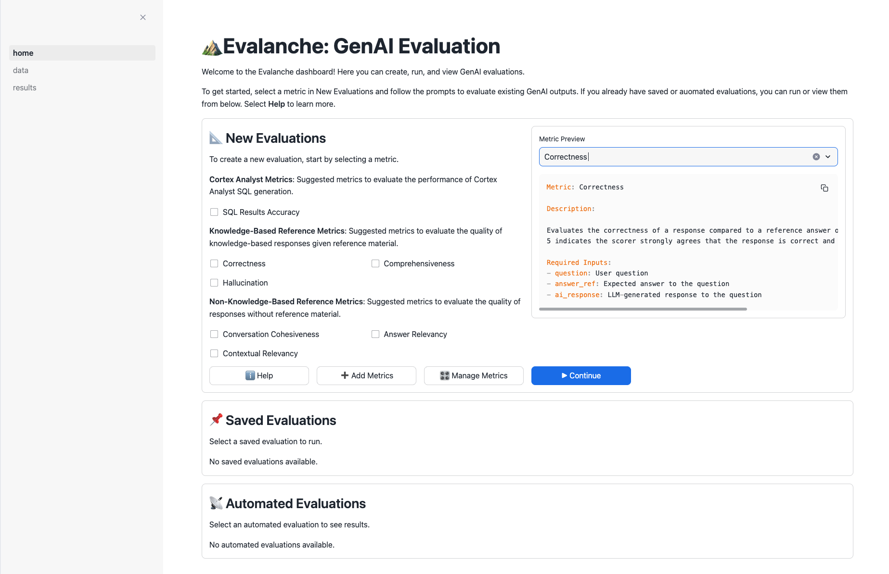
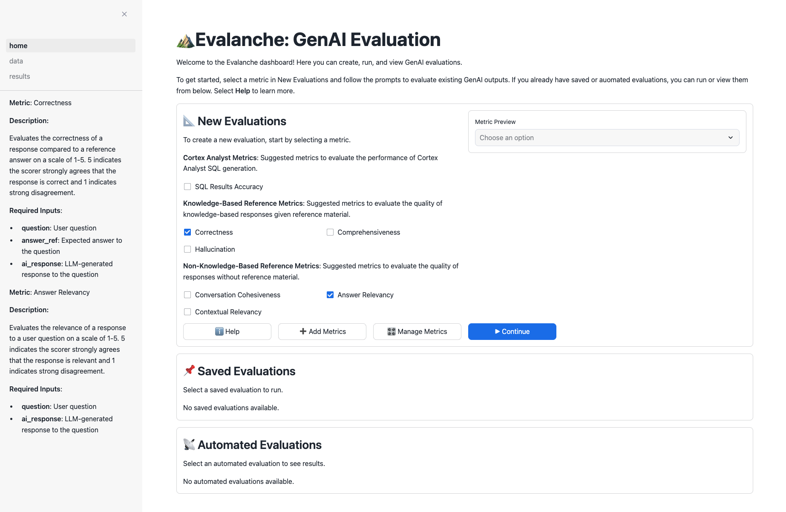
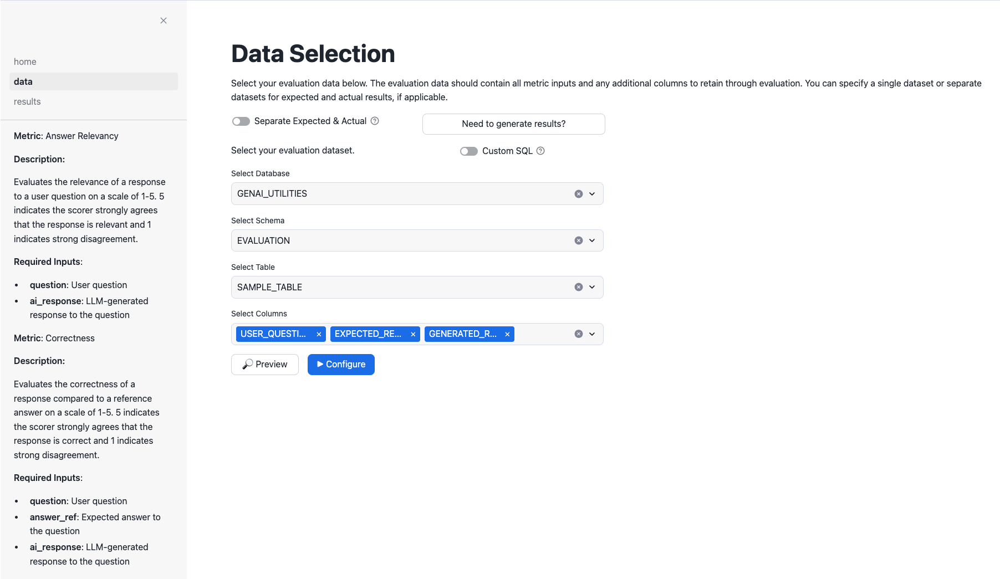
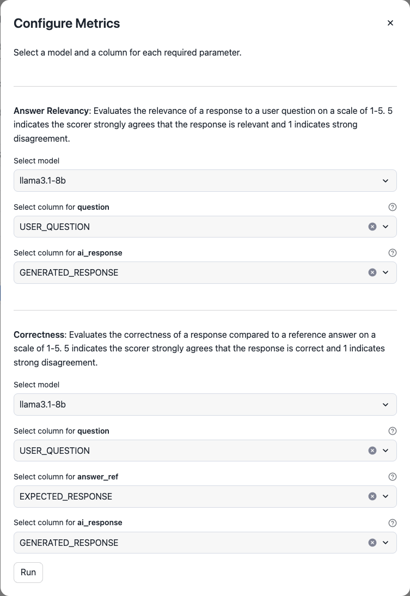
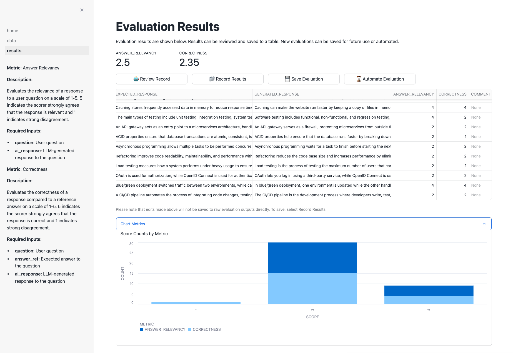
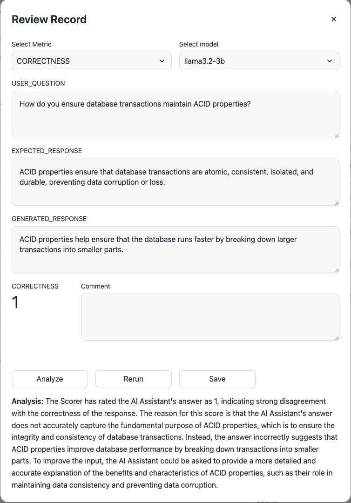
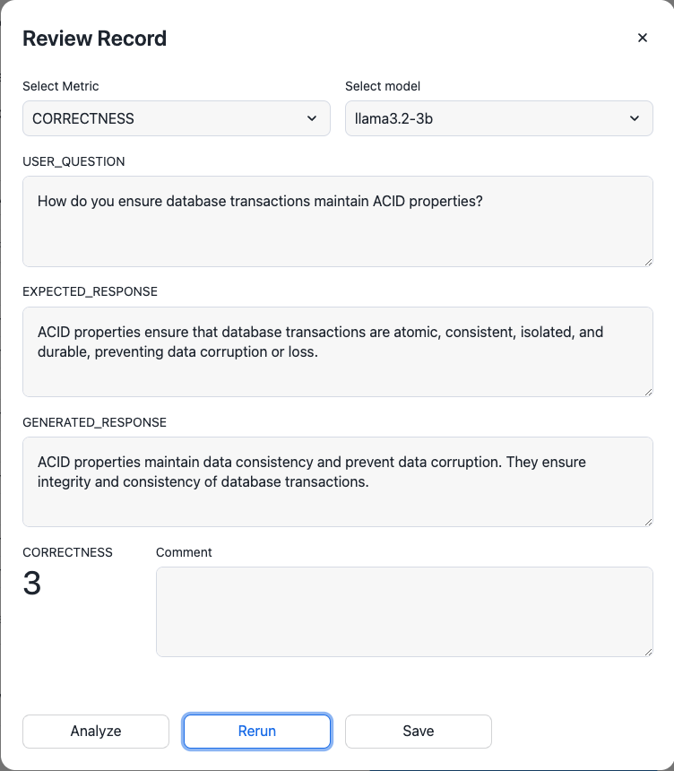
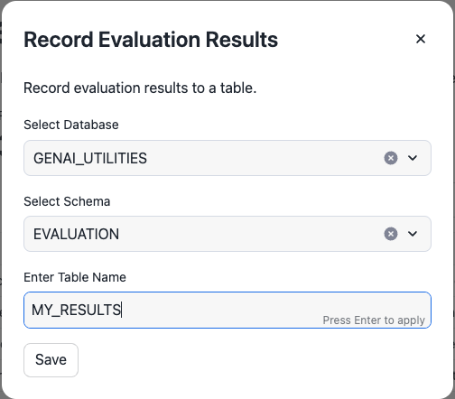
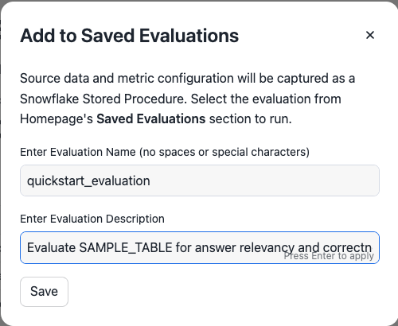
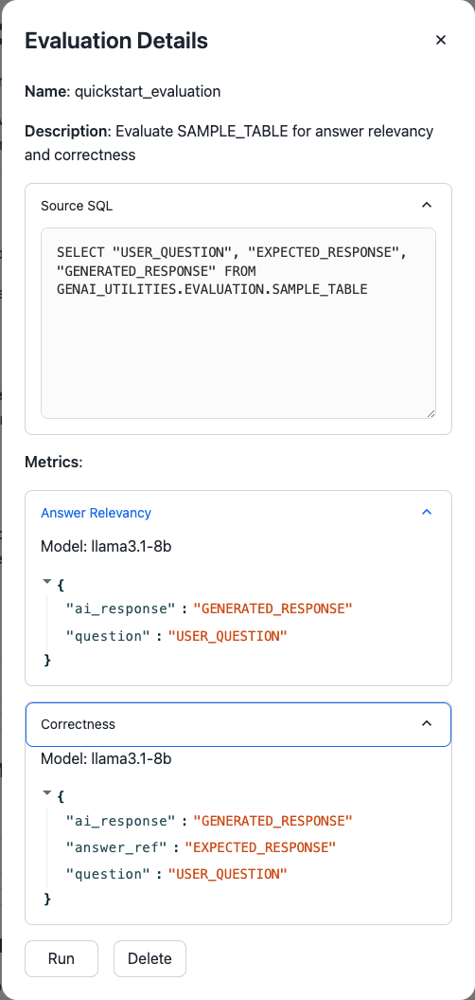

author: Jason Summer
id: orchestrate-llm-evaluations-with-evalanche
categories: snowflake-site:taxonomy/solution-center/certification/quickstart, snowflake-site:taxonomy/solution-center/certification/certified-solution, snowflake-site:taxonomy/solution-center/includes/architecture, snowflake-site:taxonomy/product/ai, snowflake-site:taxonomy/snowflake-feature/ml-functions
language: en
summary: Orchestrate LLM Evaluations in Snowflake with Evalanche 
environments: web
status: Published 
feedback link: https://github.com/Snowflake-Labs/sfguides/issues


# Orchestrate LLM Evaluations in Snowflake with Evalanche
<!-- ------------------------ -->
## Overview 

By completing this guide, you will have deployed the Evalanche application in a Snowflake account and conducted your first LLM use case evaluation.



### Why Conduct Evaluations?
Building and refining LLM use cases can be an arduous process. Differences in models, architectures, prompts, contexts, etc. can all have impactful changes in your results. Using objective, quantitative measurements to compare results is critical to achieving desired results and selecting the best implementation.

### What is Evalanche?
Evalanche is a Streamlit in Snowflake (SiS) app that provides a single location to evaluate and compare LLM use case outputs in a streamlined, on demand, and automated fashion. 

Evalanche's primary structure is based on 2 components: 1) Metrics and 2) Data Sources. 
Together, Metrics and Data Sources can be combined to make an Evaluation. 
In other words, an Evaluation will calculate 1 or more Metrics for every record in a Data Source.

Learn more about [Evalanche](https://medium.com/snowflake/lookout-its-an-evalanche-cac23f983970).

### Metrics
Metrics rely on LLMs to Judge (or score) results.
A Metric mostly consists of required input(s) and a prompt asking the LLM to assess a specific quality of these required input(s).

### Data Sources
Data Sources provide the values to Metrics’ required inputs. Data Sources can be a Snowflake table or a SQL SELECT statement. 

### Prerequisites
- A [Snowflake](https://signup.snowflake.com/?utm_source=snowflake-devrel&utm_medium=developer-guides&utm_cta=developer-guides) account

### What You’ll Learn 
- How to deploy Evalanche to a Snowflake account
- How create and run an LLM Evaluation  
- How to save an LLM Evaluation

### What You’ll Build 
- A Streamlit in Snowflake application
- An LLM Evaluation in Evalanche

<!-- ------------------------ -->
## Deploying Evalanche to Streamlit

1. Copy the entire contents of file [`git_setup.sql`](https://github.com/Snowflake-Labs/emerging-solutions-toolbox/blob/main/framework-evalanche/setup/git_setup.sql).

2. Login to your Snowflake account. Open a new SQL Worksheet by selecting **Projects** > **Worksheets** > **+ SQL Worksheet**. 
Paste the copied contents from #1 into the SQL Worksheet.

3. Select **Run All** in the top right of the SQL Worksheet.

The logic running will:
- Create a database, schema, stage, and several tables
- Create an [API Integration and Git Repository](https://docs.snowflake.com/en/developer-guide/git/git-overview) in Snowflake for the source code in Snowflake-Labs Github
- Copy the source code from the Github repo to Snowflake stage
- Create the [Streamlit in Snowflake application](/en/data-cloud/overview/streamlit-in-snowflake/)

Once competed, Evalanche will be accessible in your Snowflake account under the Streamlit section. 

<!-- ------------------------ -->
## Create Sample Data

Next, we will create hypothetical data for our first Evaluation. Within Snowsight, select the + tab to create a new SQL Worksheet. 

Copy and paste the below SQL into the new SQL Worksheet and select Run All. This SQL will create a new table with hypothetical user questions, reference answers, and LLM-generated responses. Later, we will evaluate various qualities of the LLM-generated responses to the corresponding question, given the ideal reference answers.

```sql
CREATE OR REPLACE TABLE GENAI_UTILITIES.EVALUATION.SAMPLE_TABLE(
    USER_QUESTION TEXT,
    EXPECTED_RESPONSE TEXT,
    GENERATED_RESPONSE TEXT
);

INSERT INTO GENAI_UTILITIES.EVALUATION.SAMPLE_TABLE (USER_QUESTION, EXPECTED_RESPONSE, GENERATED_RESPONSE) VALUES
('What is a common use case for Docker in software engineering?','Docker is commonly used to containerize applications, allowing for consistent environments across development, testing, and production.','Docker is used for creating isolated environments for testing new code, ensuring faster deployment across platforms.'),
('How does a load balancer improve the scalability of a web application?','A load balancer distributes incoming traffic across multiple servers, ensuring that no single server becomes overwhelmed, improving scalability and availability.','Load balancers split the network traffic between servers but might introduce delays if not configured properly.'),
('What is the difference between REST and SOAP APIs?','REST is an architectural style that uses standard HTTP methods, while SOAP is a protocol that defines strict rules for communication between systems.','REST uses simple HTTP requests and is less secure, while SOAP provides built-in security through protocols like WS-Security.'),
('Why would you use microservices architecture over monolithic?','Microservices offer modularity, scalability, and ease of deployment, whereas monolithic architectures can be harder to scale and maintain as the codebase grows.','Microservices are faster and more secure than monolithic architectures, which are generally used for smaller projects.'),
('How does a version control system like Git work?','Git tracks changes to files in a repository, allowing for collaboration, branching, and rollback to previous versions.','Git allows for creating multiple versions of software, which can then be integrated together in a final release.'),
('What is Continuous Integration (CI) in DevOps?','CI is a practice where developers frequently integrate code into a shared repository, with automated tests to catch bugs early.','CI means developers frequently push code changes and perform tests to ensure they integrate smoothly with other changes.'),
('Can you explain the SOLID principles in object-oriented design?','SOLID principles are guidelines for writing maintainable and scalable object-oriented software, including concepts like single responsibility and open-closed principle.','SOLID principles are techniques to ensure that each object is designed correctly in the software development lifecycle.'),
('How is a NoSQL database different from a relational database?','NoSQL databases are schema-less and can handle unstructured data, whereas relational databases use structured schemas and SQL for querying.','NoSQL is faster and more scalable than SQL, making it better suited for large data sets, while relational databases are outdated.'),
('What are the benefits of using Kubernetes in cloud deployment?','Kubernetes automates the deployment, scaling, and management of containerized applications, simplifying the operation of complex distributed systems.','Kubernetes is the main tool for managing cloud deployments, and it can replace virtual machines entirely in many setups.'),
('What is the purpose of unit testing in software development?','Unit testing involves testing individual components or functions of the codebase to ensure they work as expected in isolation.','Unit tests are run after the entire software is complete to check for errors in the final version of the product.'),
('How does caching improve the performance of a web application?','Caching stores frequently accessed data in memory to reduce response time, improving performance and reducing the load on the backend.','Caching can make the website run faster by keeping a copy of files in memory to avoid fetching them each time.'),
('What are the main types of software testing?','The main types of testing include unit testing, integration testing, system testing, and acceptance testing.','Software testing includes functional, non-functional, and regression testing, each ensuring the application meets its requirements.'),
('What is the role of an API gateway in microservices architecture?','An API gateway acts as an entry point to a microservices architecture, handling request routing, rate limiting, and security.','An API gateway serves as a firewall, protecting microservices from outside threats by filtering and blocking malicious requests.'),
('How do you ensure database transactions maintain ACID properties?','ACID properties ensure that database transactions are atomic, consistent, isolated, and durable, preventing data corruption or loss.','ACID properties help ensure that the database runs faster by breaking down larger transactions into smaller parts.'),
('What is the difference between asynchronous and synchronous programming?','Asynchronous programming allows multiple tasks to be performed concurrently, whereas synchronous programming executes tasks one after another.','Asynchronous programming waits for a task to finish before starting the next, while synchronous runs tasks concurrently.'),
('Why is refactoring important in software engineering?','Refactoring improves code readability, maintainability, and performance without changing its external behavior.','Refactoring reduces the code base size and increases performance by eliminating redundant or dead code.'),
('What is the purpose of load testing in software applications?','Load testing measures how a system performs under heavy usage to ensure it can handle expected traffic.','Load testing is the process of testing the maximum number of users that can access a website simultaneously.'),
('How does OAuth differ from OpenID Connect?','OAuth is used for authorization, while OpenID Connect is used for authentication, allowing users to sign in securely.','OAuth lets you log in using a third-party service, while OpenID Connect is used for authorizing access to specific APIs.'),
('What is the difference between blue/green and canary deployment strategies?','Blue/green deployment switches traffic between two environments, while canary deployment gradually introduces changes to a subset of users.','In blue/green deployment, one environment is updated while the other handles traffic; canary deployment releases small updates first.'),
('What is the main function of a CI/CD pipeline?','A CI/CD pipeline automates the process of integrating code changes, testing, and deploying them to production.','The CI/CD pipeline is the development process where developers write, test, and deploy code to a production server.')
;
```

Run the below to view the created table. 

```sql
SELECT * FROM GENAI_UTILITIES.EVALUATION.SAMPLE_TABLE;
```

<!-- ------------------------ -->
## Open Evalanche and Select Metrics

Navigate to the Evalanche app by selecting **Projects** > **Streamlit** > **Evalanche: GenAI Evaluation Application**. For a quick overview of the application, select the Help button.

1. Select `Correctness` in the Metric Preview box to understand the Metric's Description and Required Inputs. 

2. Select `Answer Relevancy` in the Metric Preview. 

3. Select the checkboxes next to `Correctness` and `Answer Relevancy` Metrics. They will display on the left-side panel upon selection.



Click Continue.

<!-- ------------------------ -->
## Select and Configure Data Source

A Data Source should have at least the required input(s) for the select Metric(s). A Data Source can be a single table, 2 tables (if expected and generated results are separate), and/or custom SQL if the data are not readily available as singular tables.

Select the sample dataset we created and select all columns.



Click Configure. In the pop up, select the column that corresponds to each Metric's required inputs as shown below.



Click Run.

<!-- ------------------------ -->
## View Evaluation Results



The Evaluation results are now shown with each record in the Data Source receiving Metric value(s). 

1. Select the checkbox next to a record with a low Metric value
2. Click Review Record. 
3. In the dialog, toggle the Metric to the one corresponding to the low score. 
4. Select Analyze to gain an understanding of why the low score may have been received.



Based on the analysis, can you update the GENERATED_RESPONSE to improve the score? Change the GENERATED_RESPONSE to the below content (if you've selected the record about ACID properties as shown in the screenshot). 

```text
ACID properties maintain data consistency and prevent data corruption. They ensure integrity and consistency of database transactions.
```

Click Rerun. The score should improve. Click Save.



<!-- ------------------------ -->
## Save Results and Evaluation

Evaluation results can be saved to Snowflake table(s) for subsequent analysis if desired. Click Record Results and provide a Snowflake database, schema, and table name. 



Lastly, we can save the Evaluation to run in the future and/or automate the Evaluation moving forward. Saving an Evaluation will enable us to run the same Evaluation directly from the homepage. An automated Evaluation will monitor the Data Source, scoring every new record that arrives and storing the result to a table. Like saved Evaluations, automated Evaluation results are viewable directly from the homepage. 

Click Save Evaluation. Provide an Evaluation name (omitting spaces and special characters) and a description. Click Save.



Return to the homepage by clicking home in the left-side panel. Click the saved Evaluation in the Saved Evaluation section. The collapsed sections contain metadata detailing the Data Source, Metric(s), and configuration. Click Run to re-run the same Evaluation.



<!-- ------------------------ -->
## Conclusion And Resources

Congratulations! You've successfully deployed Evalanche and created your first saved Evaluation using out of the box Metrics. For ongoing evaluations or experimentation, we encourage using Automated Evaluations. 

Have an LLM use case that would benefit from a novel Metric? Check out [Creating Custom Metrics](https://github.com/Snowflake-Labs/emerging-solutions-toolbox/tree/main/framework-evalanche#custom-metrics) or message us with information about your use case!


### What You Learned
- Deploying Evalanche to Streamlit in Snowflake
- Creating an Evalanche Evaluation
- Analyzing Evaluation results
- Saving an Evaluation configuration

### Related Resources
- [Source Code on GitHub](https://github.com/Snowflake-Labs/emerging-solutions-toolbox/tree/main/framework-evalanche)
- [Medium Article](https://medium.com/snowflake/lookout-its-an-evalanche-cac23f983970)
- [Download Reference Architecture](/content/dam/snowflake-site/developers/2024/11/evalanche-snowflake-reference-architecture.pdf)
- [Watch the Demo](https://youtu.be/lanCEOJ-914?list=TLGGEb1eaMM_q78yNDA5MjAyNQ)
