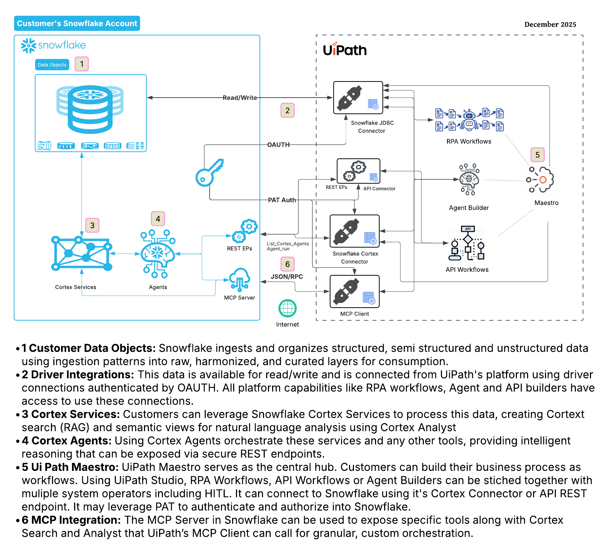

author: Akash Bhatt
id: orchestrate-your-workflows-with-uipath-and-snowflake
language: en
summary: This is a sample Snowflake Template (TBU)
categories: snowflake-site:taxonomy/solution-center/certification/partner-solution, snowflake-site:taxonomy/solution-center/certification/certified-solution, snowflake-site:taxonomy/product/applications-and-collaboration, snowflake-site:taxonomy/snowflake-feature/ingestion/conversational-assistants, snowflake-site:taxonomy/snowflake-feature/external-collaboration, snowflake-site:taxonomy/snowflake-feature/cortex-analyst, snowflake-site:taxonomy/snowflake-feature/cortex-llm-functions
environments: web
status: Published
feedback link: https://github.com/Snowflake-Labs/sfguides/issues
fork repo link: https://github.com/sfc-gh-abhatt/sfquickstarts_abhatt

Imagine a global retailer managing supply chain volatility; this architecture enables you to turn massive datasets into automated business outcomes. While Snowflake acts as the "brains," utilizing Cortex AI to analyze fluctuating demand and identify inventory gaps across thousands of unstructured reports , UiPath serves as the "hands," automatically triggering workflows to reorder stock or update ERP systems the moment a shortfall is identified. By bridging Snowflake’s analytical depth with UiPath’s execution engine, your organization can move beyond static reporting to autonomous action. This integrated approach ensures that every data-driven insight translates directly into a real-time competitive advantage for your operations.

# Overview

<!-- ------------------------ -->
## Snowflake and UiPath

Snowflake provides fast, centralized data analysis. Yet, translating these insights into immediate business actions across the tech stack often involves manual gaps, delays, and inefficiencies. 

UiPath and Snowflake solve this by enabling organizations to operationalize AI and analytics. The seamless connection of Snowflake's AI Data Cloud with UiPath's Agentic Automation platform allows customers to build intelligent, end-to-end automations that act on real-time data insights.

### Related Resources
- https://www.uipath.com/blog/product-and-updates/snowflake-intelligence-and-uipath-agentic-automation
- https://docs.uipath.com/activities/other/latest/integration-service/uipath-snowflake-cortex-interact-agent
- https://docs.uipath.com/studio-web/automation-cloud/latest/user-guide/integrating-snowflake-cortex-api-with-api-workflows
- https://docs.uipath.com/maestro/automation-cloud/latest/user-guide/integrating-systems-and-data#using-agents-in-maestro
- https://docs.uipath.com/activities/other/latest/integration-service/uipath-snowflake-cortex-interact-agent
- https://docs.uipath.com/studio-web/automation-cloud/latest/user-guide/integrating-snowflake-cortex-api-with-api-workflows