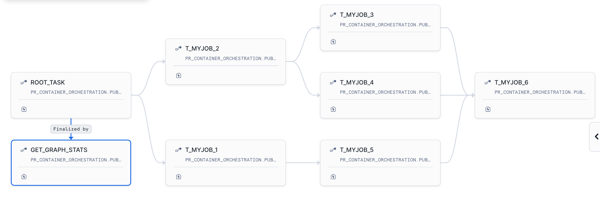
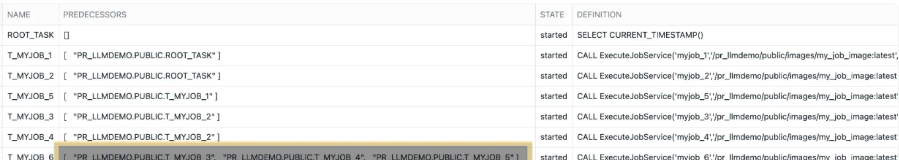
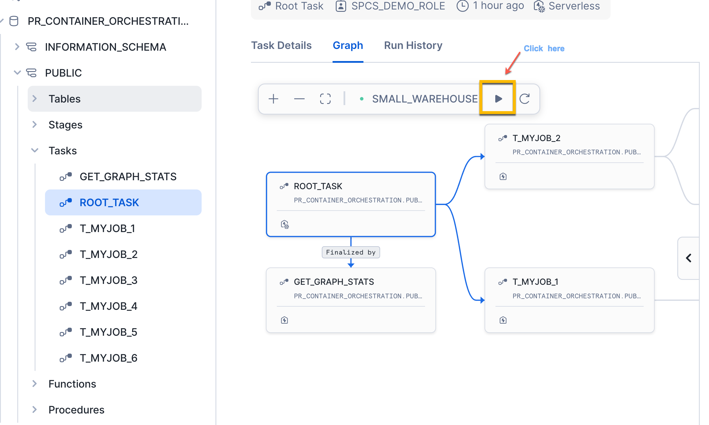
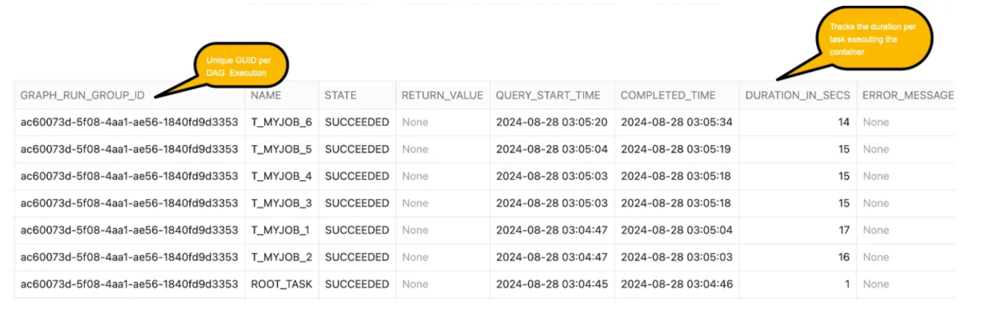
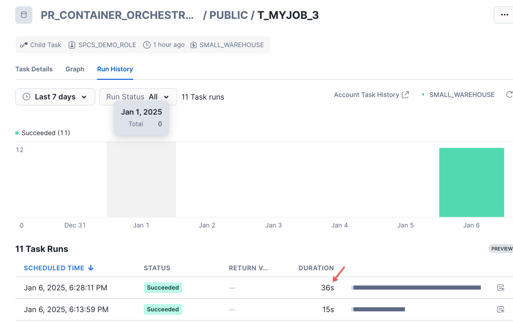
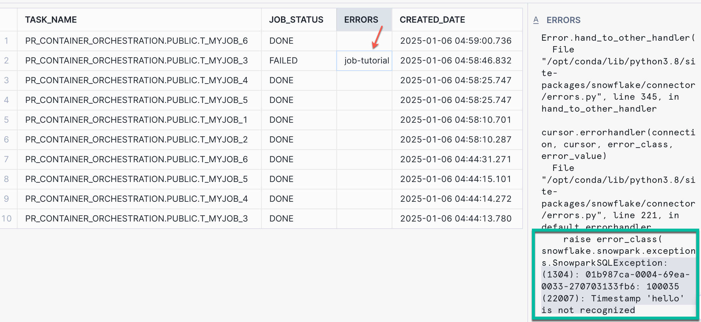

author: Phani Raj
id: orchestration-framework-running-multiple-containerized-jobs-parallel
categories: snowflake-site:taxonomy/solution-center/certification/quickstart, snowflake-site:taxonomy/product/platform
language: en
summary: Building custom orchestration framework for running containerized jobs in parallel 
environments: web
status: Published 
feedback link: https://github.com/Snowflake-Labs/sfguides/issues

# Building Orchestration Framework for Running Containerized Jobs in Parallel
<!-- ------------------------ -->
## Overview 

In the rapidly evolving landscape of containerized workloads for data processing and running ML workloads a, efficient orchestration of containerized workloads running in parallel has become a critical requirement for businesses to streamline their data pipelines. If you’ve been using containers, executing multiple jobs with the help of external tools like Argo, and you’re interested in learning how to run containerised jobs in parallel directly in Snowflake, this quickstart will helps you to build a custom orchestration framework.

<b> Key features of the Custom Orchestration Framework </b>

- Declarative workflow definitions (Fan-Out and Fan-In ) using configuration file.
- Parallel job execution
- Automated resource management
- Built-in error handling and retry mechanisms
- Using Snowflake’s core data platform capabilities.

In this quickstart you will learn how to build a orchestration framework to run multiple containerized jobs in parallel. We will be implemeting custom logging which tracks the job status whether it failed or succeded. If it failed what is the error message and how long it took to complete.


### What You’ll Build 

This lab uses a custom built configuration file in json format which has the details about the docker image location, retry count and other details specific to the image we are running. The config file also has the dependencies mentioned which will be used while creating a DAG.

- You will create a Python Stored which reads the JSON file and creates a DAG using Snowflake task capabilities and runs the container.
- You will create another Python Stored Proc which will run the container and logs the execution details in Snowflake tables which can be later used for any kind of analysis.
- You will create a workflow that will implement fan-out and fan-in scenario using the JSON config file using Snowflake native capabilities like tasks. 
- You will use the same image created as part of the pre-req for all the jobs but you can specify different images for each job in the config JSON file. 

### What You’ll Learn 
- How to build customer orchestration framework to run Snowpark Container Service Jobs.
- How to use tasks and Python Stored Procedures to run mutliple containerized jobs using configuration file.
- How to log the status of the jobs, duration of execution and also implement retry mechanism.
- How to simulate job failures and track the status of the execution along with the error messages.

### Prerequisites
- Familiarity with docker and Snowpark Container Services.
- Non trail Snowflake account (https://app.snowflake.com/)
- Completing the steps mentioned in this [Tutorial](https://docs.snowflake.com/en/developer-guide/snowpark-container-services/tutorials/tutorial-2#introduction). We will be using the image created as part of the mentioned tutorial to run as containerized jobs.
- Clone the [repo](https://github.com/sfc-gh-praj/spcs-orchestration-utility) which will have the jobconfig.json file along with a notebook and readme file. We will use only the jobconfig.json file from the repo.


## Setup

Clone the repo where you will find the notebook with the steps and ojects which needs to be created in one place. This quickstart will describe about all those steps and objects created [spcs-orchestration-utilit](https://github.com/sfc-gh-praj/spcs-orchestration-utility.git).This repo has the jobconfig.json file along with a notebook and readme file. We will use only the jobconfig.json file from the repo.

```shell
git clone https://github.com/sfc-gh-praj/spcs-orchestration-utility.git
```

> Note: Update the image_name path in the config file(jobconfig.json) to the path that you have created by following the tutorial steps which is in pre-requisite section of this lab. Here we are using the same image in the entire DAG to demonstrate the framework and it will work with different images per step. 

```json

[{
    "task_name":"t_myjob_1",
    "image_name":"/tutorial_db/data_schema/tutorial_repository/my_job_image:latest",
    "compute_pool_name":"PR_STD_POOL_XS",
    "job_name":"myjob_1",
    "table_name":"results_1",
    "retry_count":0,
    "after_task_name":"root_task"
   },
   {
       "task_name":"t_myjob_2",
       "image_name":"/tutorial_db/data_schema/tutorial_repository/my_job_image:latest",
       "compute_pool_name":"PR_STD_POOL_S",
       "job_name":"myjob_2",
       "table_name":"results_2",
       "retry_count":0,
       "after_task_name":"root_task"
   },
   {
       "task_name":"t_myjob_3",
       "image_name":"/tutorial_db/data_schema/tutorial_repository/my_job_image:latest",
       "compute_pool_name":"PR_STD_POOL_S",
       "job_name":"myjob_3",
       "table_name":"results_3",
       "retry_count":2,
       "after_task_name":"t_myjob_2"
   },
   {
    "task_name":"t_myjob_4",
    "image_name":"/tutorial_db/data_schema/tutorial_repository/my_job_image:latest",
    "compute_pool_name":"PR_STD_POOL_XS",
    "job_name":"myjob_4",
    "table_name":"results_4",
    "retry_count":1,
    "after_task_name":"t_myjob_2"
},
   {
    "task_name":"t_myjob_5",
    "image_name":"/tutorial_db/data_schema/tutorial_repository/my_job_image:latest",
    "compute_pool_name":"PR_STD_POOL_XS",
    "job_name":"myjob_5",
    "table_name":"results_5",
    "retry_count":0,
    "after_task_name":"t_myjob_1"
},
{
 "task_name":"t_myjob_6",
 "image_name":"/tutorial_db/data_schema/tutorial_repository/my_job_image:latest",
 "compute_pool_name":"PR_STD_POOL_S",
 "job_name":"myjob_6",
 "table_name":"results_6",
 "retry_count":0,
 "after_task_name":"t_myjob_3,t_myjob_4,t_myjob_5"
}

]
```

- task_name — Is the name of the task that will be created for that job which will run a specific container.
- image_name — Name of the image in Snowpark container image repository. This is the image that you have created as part of the pre-requisite. Update the location where you have created the image repository for the image created in the pre-requisite tutorial.
- compute-pool —Compute pool name that you want the container to run on. This compute pool must be already provisioned.
- job_name — Name of the SPCS service job
- table_name — The application in the container will write the result to the table name mentioned in the json file and its only specific to this lab. You can include the required inputs needed by your image if you are using other images.
- retry_count — The framework will automatically attempt to re-execute the failed jobs. It will continue to retry the job up to the number of times specified by the retry_count.
- after_task_name — This fields build the dependency graph. The after_task_name field is particularly powerful in creating fan-out and fan-in scenarios.

Run the following queries to create the objects required for this lab. Here we are using the image from the the tutorial mentioned in the pre-requisite. 

```sql
USE ROLE ACCOUNTADMIN;

CREATE ROLE SPCS_DEMO_ROLE;

CREATE DATABASE IF NOT EXISTS PR_Container_Orchestration;
GRANT OWNERSHIP ON DATABASE PR_Container_Orchestration TO ROLE SPCS_DEMO_ROLE COPY CURRENT GRANTS;
GRANT OWNERSHIP ON ALL SCHEMAS IN DATABASE PR_Container_Orchestration  TO ROLE SPCS_DEMO_ROLE COPY CURRENT GRANTS;

GRANT EXECUTE TASK ON ACCOUNT TO ROLE SPCS_DEMO_ROLE;
GRANT EXECUTE MANAGED TASK ON ACCOUNT TO ROLE SPCS_DEMO_ROLE;

-- We are granting permissions to tutorial DB, Schema and the image repository to the role that you have created as part of the pre-requisite. If you have given a different name to the DB created as part of the tutorial then update the names accordingly in the below grant queries.
GRANT USAGE ON DATABASE tutorial_db to role SPCS_DEMO_ROLE;
GRANT USAGE ON SCHEMA tutorial_db.data_schema to role SPCS_DEMO_ROLE;
GRANT READ ON IMAGE REPOSITORY tutorial_db.data_schema.tutorial_repository to ROLE SPCS_DEMO_ROLE;


-- CREATING X-SMALL WAREHOUSE
CREATE OR REPLACE WAREHOUSE small_warehouse WITH
  WAREHOUSE_SIZE='X-SMALL';

-- Granting permissions on the WH to the role
GRANT USAGE ON WAREHOUSE small_warehouse TO ROLE SPCS_DEMO_ROLE;

-- Creating XS compute pool
CREATE COMPUTE POOL pr_std_pool_xs
  MIN_NODES = 1
  MAX_NODES = 1
  INSTANCE_FAMILY = CPU_X64_XS;


-- Creating S compute pool
CREATE COMPUTE POOL PR_STD_POOL_S
  MIN_NODES = 1
  MAX_NODES = 2
  INSTANCE_FAMILY = CPU_X64_S;

-- Listing the compute pools created
show compute pools like 'PR_STD_POOL_%S';

-- Granting permissions on the pool to the role
GRANT USAGE, MONITOR ON COMPUTE POOL pr_std_pool_xs TO ROLE SPCS_DEMO_ROLE;
GRANT USAGE, MONITOR ON COMPUTE POOL pr_std_pool_s TO ROLE SPCS_DEMO_ROLE;

-- Change the username
GRANT ROLE SPCS_DEMO_ROLE TO USER <user_name>;


USE ROLE SPCS_DEMO_ROLE;
USE DATABASE PR_Container_Orchestration;
USE WAREHOUSE small_warehouse;
USE SCHEMA PUBLIC;

-- Creating image repository
CREATE IMAGE REPOSITORY IF NOT EXISTS IMAGES;

-- List IMAGE RESGITRY URL
SHOW IMAGE REPOSITORIES;

-- Example output for the above query (image repository):
--  <orgname>-<acctname>.registry.snowflakecomputing.com/PR_Container_Orchestration/public/images

-- Upload the jobconfig.json file (from the cloned repo) to this stage from the Snowsight UI
CREATE OR REPLACE STAGE JOBS DIRECTORY = (
    ENABLE = true);
```

We are creating two logging tables and a UDTF to tracke the job status.

- jobs_run_stats table — This table is used to log individual container job status. If there are any errors while running the container then we log those errors in this table. This is used in the SP which is executing the SPC Service Jobs.
- task_logging_stats — This table is used to log the status (success or failure) of every task part of the DAG. This is used in the finalizer task.

```sql

use role SPCS_DEMO_ROLE;

-- logging individual job status. This is used by the SP which is executing the SPCS Service Jobs
create or replace table jobs_run_stats( root_task_name string, task_name string, job_status string,GRAPH_RUN_ID string , graph_start_time timestamp_ltz, errors string, created_date datetime default current_timestamp());

-- Tracking all tasks part of the task graph. Used by the finalizer task
create table task_logging_stats (GRAPH_RUN_GROUP_ID varchar, NAME varchar,  STATE varchar , RETURN_VALUE varchar,QUERY_START_TIME varchar,COMPLETED_TIME varchar, DURATION_IN_SECS INT,ERROR_MESSAGE VARCHAR);

-- UDTF for getting the task status for the graph - TASK_GRAPH_RUN_STATS
create or replace function TASK_GRAPH_RUN_STATS(ROOT_TASK_ID string, START_TIME timestamp_ltz)
 returns table (GRAPH_RUN_GROUP_ID varchar, NAME varchar,  STATE varchar , RETURN_VALUE varchar,QUERY_START_TIME varchar,COMPLETED_TIME varchar, DURATION_IN_SECS INT,
 ERROR_MESSAGE VARCHAR)
as
$$
select
        GRAPH_RUN_GROUP_ID,
        NAME,
        STATE,
        RETURN_VALUE,
        to_varchar(QUERY_START_TIME, 'YYYY-MM-DD HH24:MI:SS') as QUERY_START_TIME,
        to_varchar(COMPLETED_TIME,'YYYY-MM-DD HH24:MI:SS') as COMPLETED_TIME,
        timestampdiff('seconds', QUERY_START_TIME, COMPLETED_TIME) as DURATION,
        ERROR_MESSAGE
    from
        table(INFORMATION_SCHEMA.TASK_HISTORY(
              ROOT_TASK_ID => ROOT_TASK_ID ::string,
              SCHEDULED_TIME_RANGE_START => START_TIME::timestamp_ltz,
              SCHEDULED_TIME_RANGE_END => current_timestamp()
      ))
$$
;
```

## Building Container Orchestration Workflow 


### Creating Containerized Job SP

This is the code which does the heavy lifting of running the container and does the following :

- Accepts the name of the service job to be created, pool name where the service jobs will be executed on and some parameters which are the inputs to the container. It takes retry count which is used to identify how many time should the code should retry executing the container before gracefully terminating incase of errors.
- For every service job execution, we are tracking the status whether Done or Failed and tracking the stats in jobs_run_stats table. It has details about the container service jobs errors if any.
- This SP is invoked from another SP create_job_tasks(created in below section) which creates the task DAG based on the job config json file.

```sql
use role SPCS_PSE_ROLE;

CREATE OR REPLACE PROCEDURE ExecuteJobService(service_name VARCHAR, image_name VARCHAR, pool_name VARCHAR,table_name VARCHAR,retry_count INT)
RETURNS VARCHAR
LANGUAGE PYTHON
RUNTIME_VERSION = '3.9'
PACKAGES = ('snowflake-snowpark-python')
HANDLER = 'create_job_service'
AS
$$
from snowflake.snowpark.functions import col
import uuid
import re
import logging
import sys

logger = logging.getLogger("python_logger")

def get_logger():
    """
    Get a logger for local logging.
    """
    logger = logging.getLogger("service-job")
    logger.setLevel(logging.INFO)
    return logger

# Functions which invokes the execute service job    
def execute_job(session, service_name, image_name,pool_name,table_name):
   # Drop the existing service if it exists
   session.sql(f'''DROP SERVICE if exists {service_name}''').collect()
   sql_qry=f'''
                        EXECUTE JOB SERVICE
                        IN COMPUTE POOL {pool_name}
                        NAME={service_name}
                        FROM SPECIFICATION  
                        '
                        spec:
                         container:
                         - name: main
                           image: {image_name}
                           env:
                             SNOWFLAKE_WAREHOUSE: small_warehouse
                           args:
                           - "--query=select current_time() as time,''hello''"
                           - "--result_table={table_name}"
                        ';
                    '''
   #print(sql_qry)
   
   try: 
    _=session.sql(sql_qry).collect()
    
   except Exception as e:        
    logger.error(f"An error occurred running the app in the container: {e}")
    
   finally:
                
    job_status = session.sql(f''' SELECT    parse_json(SYSTEM$GET_SERVICE_STATUS('{service_name}'))[0]['status']::string as Status 
                                ''').collect()[0]['STATUS']

    return job_status

# This is the main function call invoked in the SP handler
# This functin calls execute_job to run the container with all the parameters required.
def create_job_service(session, service_name, image_name,pool_name,table_name,retry_count):
    import uuid
    logger = get_logger()
    logger.info("job_service")
    job_status = ''
    job_errors = ''
    current_root_task_name = ''
    current_task_name = ''
    current_graph_run_id = ''
    current_graph_start_time = ''
    try:


        cnt = retry_count

        # Execute the job service
        logger.info(
            f"Executing the Job [{service_name}] on pool [{pool_name}]"
        )
        job_status = execute_job(session, service_name,image_name, pool_name,table_name)

        # Implementing retry mechanism. Fetching the retry count value from the config file per job
        if job_status=='FAILED':
            while(cnt >0):
                r_cnt = retry_count+1 - cnt
                logger.info(
                                f"Retrying Executing the Job [{service_name}] on pool [{pool_name}] - [{r_cnt}]  out of {retry_count} times "
                            )
                job_status =  execute_job(session, service_name,image_name, pool_name,table_name)
                if job_status == 'DONE':
                    break
                cnt = cnt - 1
                
        
        if job_status=='FAILED':
            job_errors = re.sub(r"'", r"\\'",session.sql(f'''
            select SYSTEM$GET_SERVICE_LOGS('{service_name}', 0, 'main')::string as logs;
            ''').collect()[0]['LOGS'])
        else:
            job_errors = ''

        # Getting the DAG Task details. SYSTEM$TASK_RUNTIME_INFO can only work inside a task.
        result = session.sql("""select
                                SYSTEM$TASK_RUNTIME_INFO('CURRENT_ROOT_TASK_NAME')
                                root_task_name,
                                SYSTEM$TASK_RUNTIME_INFO('CURRENT_TASK_NAME') 
                                task_name,
                                SYSTEM$TASK_RUNTIME_INFO('CURRENT_TASK_GRAPH_RUN_GROUP_ID')
                                run_id,
                                SYSTEM$TASK_RUNTIME_INFO('CURRENT_TASK_GRAPH_ORIGINAL_SCHEDULED_TIMESTAMP')  dag_start_time
                            
                            """).collect()[0]
                            
        current_root_task_name = result.ROOT_TASK_NAME
        current_task_name = result.TASK_NAME
        current_graph_run_id = result.RUN_ID
        current_graph_start_time = result.DAG_START_TIME
               
        
        # Inserting job status into logging table
        _ = session.sql(f'''
        INSERT INTO jobs_run_stats 
        (root_task_name,task_name,graph_run_id ,job_status,graph_start_time, errors ,created_date)
        SELECT '{current_root_task_name}'
        ,'{current_task_name}'
        ,'{current_graph_run_id}'
        ,'{job_status}'
        ,'{current_graph_start_time}'
        ,'{job_errors}'
        ,current_timestamp()
        ''').collect()

        
        return job_status
    except Exception as e:
        print(f"An error occurred: {e}")
        if job_status=='FAILED':
            job_errors = re.sub(r"'", r"\\'",session.sql(f'''
            select SYSTEM$GET_SERVICE_LOGS('{service_name}', 0, 'main')::string as logs;
            ''').collect()[0]['LOGS'])
        else:
            job_errors = ''
        
        session.sql(f"""
           INSERT INTO jobs_run_stats(task_name,errors,graph_run_id,job_status,created_date)
           SELECT '{service_name}',
           '{job_errors}',
           '{current_graph_run_id}',
           '{job_status}',
           current_timestamp()
            
                    """).collect()
                    
        return f'Error Occured.. Refer the job error column - {e}'
                   
$$;

```

### Creating DAG for Job Execution

The code has the logic which creates the fan-in and fan-out workflow by creating a DAG and does the following tasks:

- Accepts the config file as input and creates the Snowflake task graphs (for fan-out and fan-in scenario) which calls the Python SP *<b>ExecuteJobService</b>* ( created above) passing the parameters fetched from the json config file( which includes the compute pool, image name, retry count etc).

- Every task has the dependency on other task(s) defined in the config file. Example T1 is dependent on root_task, T2 is dependent on root and T3 is dependent on T1 and T2 which implements the dependency workflow that is required.

- The code also creates a finalizer task which tracks the status of all the tasks( failure or Success) and logs it into one of the logging table task_logging_stats.

```sql
use role SPCS_DEMO_ROLE;

CREATE OR REPLACE PROCEDURE create_job_tasks(file_name varchar)
RETURNS string
LANGUAGE PYTHON
RUNTIME_VERSION = '3.9'
PACKAGES = ('snowflake-snowpark-python')
HANDLER = 'create_jobservice_tasks'
AS
$$
from snowflake.snowpark.files import SnowflakeFile
import json

def create_jobservice_tasks(session, file_name):
  parent_task_name = 'root_task'
  parent_task_sql = f'''CREATE OR REPLACE TASK {parent_task_name} 
              USER_TASK_MANAGED_INITIAL_WAREHOUSE_SIZE = 'XSMALL' 
              SCHEDULE = '59 MINUTE' 
      AS
      SELECT CURRENT_TIMESTAMP() ;'''

  session.sql(f'''{parent_task_sql}''').collect()
  print(parent_task_sql)


  with SnowflakeFile.open(file_name) as j:
      json_data= json.load(j)


  for idx, task in enumerate(json_data):
      task_name = task['task_name']
      after_task_name = task['after_task_name']
      task_sql = f"CREATE  OR REPLACE TASK {task_name} "
      task_sql += f"  WAREHOUSE = small_warehouse "
      task_sql += f"  AFTER {after_task_name}  "
      task_sql += f" AS CALL ExecuteJobService('{task['job_name']}','{task['image_name']}','{task['compute_pool_name']}','{task['table_name']}',{task['retry_count']})"
      # logger.info(f'{task_sql}')
      session.sql(f'''{task_sql}''').collect()

      print(task_sql)

  # This is the Finalize task which gets the status for every task part of the DAG and loads into task_logging_stats table
  session.sql(f"""
              create or replace task GET_GRAPH_STATS
  warehouse = 'small_warehouse'
  finalize = 'root_task'
  as
    declare
      ROOT_TASK_ID string;
      START_TIME timestamp_ltz;
      
    begin
      ROOT_TASK_ID := (call SYSTEM$TASK_RUNTIME_INFO('CURRENT_ROOT_TASK_UUID'));

      START_TIME := (call SYSTEM$TASK_RUNTIME_INFO('CURRENT_TASK_GRAPH_ORIGINAL_SCHEDULED_TIMESTAMP'));

      -- Insert into the logging table
      INSERT INTO task_logging_stats(GRAPH_RUN_GROUP_ID , NAME ,  STATE  , RETURN_VALUE ,QUERY_START_TIME ,COMPLETED_TIME , DURATION_IN_SECS ,
                                      ERROR_MESSAGE 
                                    )
      SELECT * FROM TABLE(TASK_GRAPH_RUN_STATS(:ROOT_TASK_ID, :START_TIME))  where NAME !='GET_GRAPH_STATS';

    end;
              """
              ).collect()

  session.sql('alter task GET_GRAPH_STATS resume').collect()
  
  session.sql(f'''SELECT SYSTEM$TASK_DEPENDENTS_ENABLE('root_task')''').collect()

  return 'done'

$$;

```


## Running Container Orchestration Workflow 


Here we are invoking the orchestration workflow SP which accepts the jobconfig json file (uploaded to Snowflake stage) which has all the details required for the tasks to be created for Fan-Out and Fan-In scenarios.

Upload the JSON file to JOBS stage that you have created in setup.sql.

```sql
call create_job_tasks(build_scoped_file_url(@jobs, 'jobconfig.json'));
```

After executing the SP below is the DAG that is created.The Root task is scheduled to run every 59 minutes.



Run the below query to list the tasks part of the DAG created.

```sql
--  Checks the DAG task created for the root_task. You can see the column predecessor which mentions the dependent task name
select *
  from table(information_schema.task_dependents(task_name => 'root_task', recursive => true));
```




<b>Now run the Root Task using SQL or from the UI as shown in the below screenshot.</b>

##### SQL Command
```sql
EXECUTE TASK root_task;
```


##### From Snowsight UI


### Viewing execution Stats using Logging Tables

We have two logging tables that we have created and lets check the status of the each Container Service Job and also the status of every task that is invoking the service job.

```sql
--  View job run status. This is per Service job logging
select top 10 * from jobs_run_stats order by created_date desc;
```


Every service job(which is invoking the container) is having same GUID per DAG execution.
Below query gives additional metrics about the duration per task(which is executing the Container service jobs)

```sql
--  Query task logging status (by the finalizer task)
SELECT top 10 * FROM task_logging_stats ORDER BY CAST(QUERY_START_TIME AS DATETIME) DESC;
```


## Simulating Job Failure


We will simulate a failure usecase where the SPCS job execution will fail and we will validate that the retry happens multiple times before it gracefully exists and logs error details into logging tables we have created.

```sql
--  With the below code we are simulating failure, so that we can tracjk what error are we tracking in the logging tables and to test the retry logic behaviour

-- This should fail the myjob_3 having task name t_myjob_3
ALTER TABLE RESULTS_3 DROP COLUMN "'HELLO'";
ALTER TABLE RESULTS_3 ADD COLUMN CREATEDATE DATETIME ;

```

Let re-run the DAG manually from Snowsight UI or using SQL query and check the log tables. You can see from the cofig file the retry count is 2 which means the code will retry to run the job twice incase of failure and only then exists.

You see in the task history it takes double the time (around 32-35 seconds) before it gracefully exists and you can track the error details from the jobs_run_stats table.



Querying the jobs_run_stats to see the error message logged.

```sql
select top 10 * from jobs_run_stats order by created_date desc;
```



## Cleanup


Below code will create the SP which helps in deleting all the tasks that were created as part of the solution.

```sql
USE ROLE SPCS_DEMO_ROLE;

CREATE OR REPLACE PROCEDURE drop_job_tasks()
RETURNS string
LANGUAGE PYTHON
RUNTIME_VERSION = '3.8'
PACKAGES = ('snowflake-snowpark-python')
HANDLER = 'drop_tasks'
execute as caller
AS
$$
from snowflake.snowpark.files import SnowflakeFile
import json
def drop_tasks(session):
    session.sql('alter task root_task suspend').collect()
    res= session.sql(f''' select name
        from table(information_schema.task_dependents(task_name => 'root_task', recursive => true))''').collect()
    for r in res:
        print(r.NAME)
        session.sql(f'drop task {r.NAME}').collect()
    session.sql('drop task GET_GRAPH_STATS').collect()
    return 'Done'
$$;
```

> Run the SP to delete the tasks.

```sql
-- Deleting the DAG (Task Graphs)

USE ROLE SPCS_DEMO_ROLE;

call drop_job_tasks();

DROP DATABASE PR_Container_Orchestration;

-- As accountadmin delete other resources which was created

USE ROLE ACCOUNTAMDIN;
DROP COMPUTE POOL pr_std_pool_xs;
DROP COMPUTE POOL pr_std_pool_s;
DROP WAREHOUSE SMALL_WAREHOUSE;
DROP ROLE SPCS_DEMO_ROLE;

--  DROP DATABSE AND COMPUTE POOL CREATED AS PART OF THE PRE-REQUISITE SECTIONS
```

## Conclusion & Resources


### Conclusion

Congratulations! You have successfully learnt how create a custom orchestration framework to run the contanerized jobs in parallel all driven through a config file. This allows you to build complex pipelines which uses containers to run you pipelines and define the dependencies and the inputs through a simple configuration. Using this approach you can reduce the dependencies on 3rd party tools and run your containerzed jobs all natively in Snowflake.

### What You Learned

* How to create custom orchestration framework which allows to run multiple containerized jobs in parallel with required dependencies all using a config file.
* How to create custom dependecies and creating fan-out and fan-in scenarios. Implement retry mechanism and simulate a failure scenario.
* Use Python and Snowpark to create logic to execute the containerized jobs and passing the details from the config file.
* How to track job execution along with errors and duration from logging tables that you have created.

### Resources

Want to learn more about the tools and technologies used by your app? Check out the following resources:

* [Source Code on Github](https://github.com/sfc-gh-praj/spcs-orchestration-utility)
* [Blog post](https://medium.com/@phaniraj2112/orchestration-framework-for-running-parallel-containerised-jobs-in-snowflake-457396a404c7)
* [Snowpark Container Services](https://docs.snowflake.com/en/developer-guide/snowpark-container-services/overview)
* [Snowpark Container Services Tutorials](https://docs.snowflake.com/en/developer-guide/snowpark-container-services/overview-tutorials)
* [Snowpark Python Developer Guide](https://docs.snowflake.com/en/developer-guide/snowpark/python/index)
* [Snowpark Guide for Data Engineers](/resource/the-data-engineers-guide-to-python-for-snowflake/)

