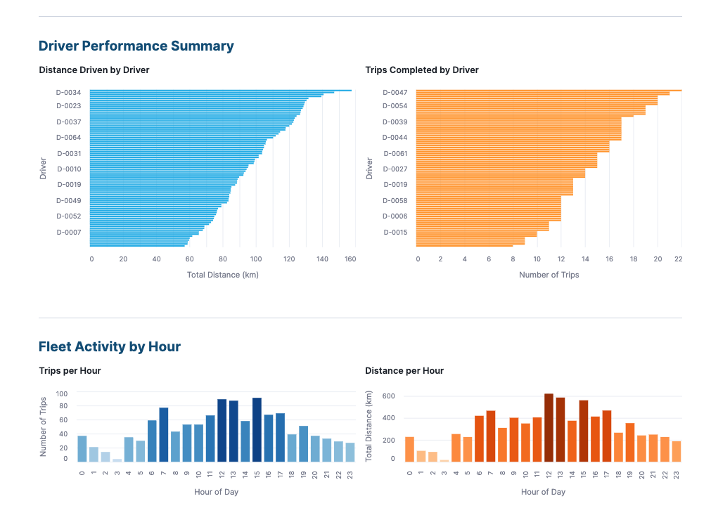
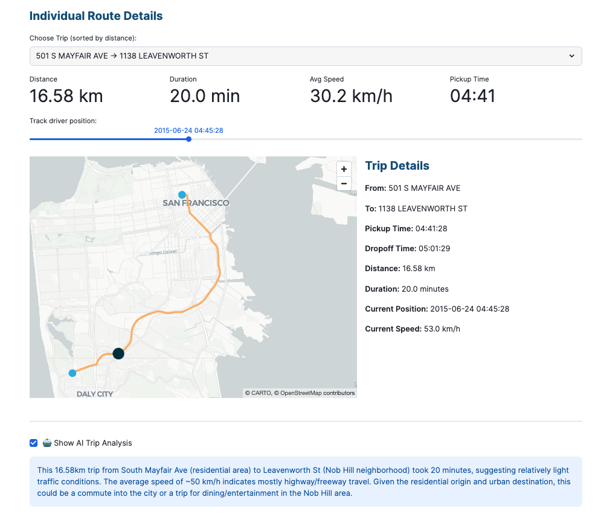
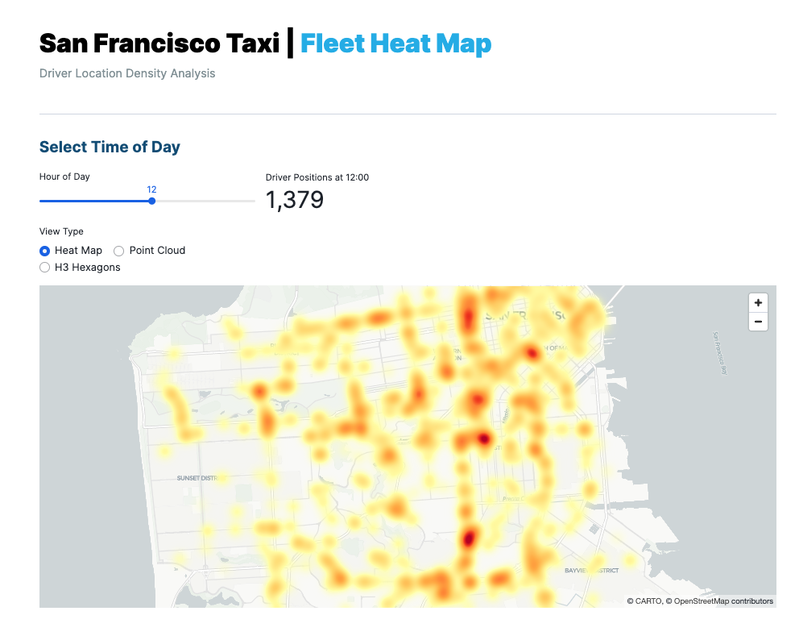

author: Becky O'Connor, Piotr Paczewski, Oleksii Bielov
id: oss-deploy-a-fleet-intelligence-solution-for-taxis
categories: snowflake-site:taxonomy/solution-center/certification/quickstart, snowflake-site:taxonomy/product/ai, snowflake-site:taxonomy/product/applications-and-collaboration, snowflake-site:taxonomy/snowflake-feature/native-apps, snowflake-site:taxonomy/snowflake-feature/snowpark-container-services, snowflake-site:taxonomy/snowflake-feature/geospatial, snowflake-site:taxonomy/snowflake-feature/cortex-llm-functions
language: en
summary: Build a Fleet Intelligence Control Center for taxi operations using OpenRouteService. Deploy a multi-page Streamlit app with real-time driver tracking, route visualization, and H3 heat maps - powered by Snowflake Cortex AI and geospatial analytics.
environments: web
status: Published
feedback link: https://github.com/Snowflake-Labs/sfguides/issues
fork repo link: https://github.com/Snowflake-Labs/sfguide-create-a-route-optimisation-and-vehicle-route-plan-simulator

# Deploy Fleet Intelligence Solution for Taxis

> 🚖 **Track. Analyze. Optimize.** Build a real-time taxi fleet control center with AI-powered insights - powered by OpenRouteService in Snowflake.

<!-- ------------------------ -->
## Overview 


**Build a fully interactive Fleet Intelligence Control Center using the OpenRouteService Native App.**

This quickstart deploys a multi-page Streamlit application that simulates a taxi fleet operations dashboard. Track individual drivers, visualize routes in real-time, and analyze fleet density with interactive heat maps - all powered by Snowflake's geospatial capabilities.

### What You'll Build

🚖 **Fleet Intelligence Control Center** - A multi-page Streamlit dashboard that:
- Tracks individual driver journeys with route visualization
- Provides AI-powered trip analysis using Snowflake Cortex
- Displays fleet density heat maps with H3 hexagon visualization
- Shows driver performance metrics including speed and distance analytics

📊 **Fleet Analytics** - Real-time insights including:
- Driver route tracking with pickup/dropoff locations
- Time-based filtering to analyze trips by hour
- Speed distribution analysis across the fleet
- Interactive maps with pydeck visualization

### Prerequisites

> **_IMPORTANT:_** This demo requires the **OpenRouteService Native App** to be installed and running. If you haven't installed it yet, complete the [Install OpenRouteService Native App](../oss-install-openrouteservice-native-app/) quickstart first.

**Required:**
- OpenRouteService Native App deployed and activated
- Cortex Code CLI installed and configured
- Active Snowflake connection with ACCOUNTADMIN access
- Overture Maps Places and Addresses datasets from Snowflake Marketplace

### What You'll Learn 

- Deploy fleet analytics dashboards using Cortex Code skills
- Work with **Carto Overture Maps** datasets for realistic location data
- Use **Snowflake Cortex AI** to generate sample addresses
- Build multi-layer geospatial visualizations with Pydeck
- Create H3 hexagon heat maps for density analysis
- Track driver states (waiting, pickup, driving, dropoff, idle)

<!-- ------------------------ -->
## Deploy the Fleet Intelligence Solution

Use Cortex Code to deploy the Fleet Intelligence solution including database setup, data generation, and the Streamlit dashboard.

### Run the Deploy Skill

In the Cortex Code CLI, type:

```
use the local skill from oss-deploy-a-fleet-intelligence-solution-for-taxis/skills/deploy-fleet-intelligence
```

> **_NOTE:_** The skill will first verify that the OpenRouteService Native App is installed. If it's not found, it will provide instructions to install it first.

The skill uses interactive prompting to gather required information:

- **Number of drivers**: 20 to 500+ (default: 80)
- **Number of days**: 1 to 30+ (default: 1)
- **City**: San Francisco (default), New York, London, or Paris

Cortex Code will automatically:
- **Verify** OpenRouteService Native App is installed and running
- **Acquire Marketplace Data** - Gets Carto Overture Maps Places and Addresses
- **Create Database** - Sets up `FLEET_INTELLIGENCE` with required schemas
- **Generate Sample Data** - Creates drivers, trips, and routes using ORS
- **Deploy Dashboard** - Creates the Fleet Intelligence Control Center Streamlit app

### What Gets Installed

The deploy skill creates the following Snowflake objects:

**Marketplace Data**
| Component | Name | Description |
|-----------|------|-------------|
| Database | `OVERTURE_MAPS__PLACES` | Carto Overture Maps Places with POI data |
| Database | `OVERTURE_MAPS__ADDRESSES` | Carto Overture Maps Addresses |

**Fleet Intelligence Database**
| Component | Name | Description |
|-----------|------|-------------|
| Database | `FLEET_INTELLIGENCE` | Main fleet database |
| Schema | `FLEET_INTELLIGENCE.PUBLIC` | Core data tables |
| Schema | `FLEET_INTELLIGENCE.ANALYTICS` | Analytics views for Streamlit |
| Warehouse | `DEFAULT_WH` | Compute warehouse (auto-suspend 60s) |
| Stage | `STREAMLIT_STAGE` | Stage for Streamlit files |

**Data Tables**
| Table | Description |
|-------|-------------|
| `SF_ADDRESSES` | AI-generated city addresses (150+ locations) |
| `DRIVERS` | Driver master data with shift patterns |
| `DRIVER_TRIPS` | Trip assignments per driver |
| `DRIVER_ROUTES` | Raw ORS route responses |
| `DRIVER_LOCATIONS` | Interpolated GPS positions with driver states |

**Analytics Views**
| View | Description |
|------|-------------|
| `ANALYTICS.DRIVERS` | Driver display information |
| `ANALYTICS.DRIVER_LOCATIONS` | Location points with LON/LAT and state |
| `ANALYTICS.TRIPS_ASSIGNED_TO_DRIVERS` | Trip routes with geometry |
| `ANALYTICS.ROUTE_NAMES` | Human-readable route descriptions |
| `ANALYTICS.TRIP_SUMMARY` | Trip statistics and metrics |

**Streamlit Application**
| Component | Name | Description |
|-----------|------|-------------|
| Streamlit | `FLEET_INTELLIGENCE_CONTROL_CENTER` | Multi-page fleet dashboard |

<!-- ------------------------ -->
## Explore the Control Center

Once deployment completes, navigate to the Fleet Intelligence Control Center:

1. Go to **Projects > Streamlits** in Snowsight
2. Click on **FLEET_INTELLIGENCE_CONTROL_CENTER**

### Main Dashboard

The main page shows fleet overview statistics:
- **Total Trips** - Number of trips in the simulation
- **Active Drivers** - Drivers with assigned trips
- **Route Plans** - Generated route geometries
- **Data Source** - City being simulated

### Driver Routes Page



Track individual driver journeys:

1. **Select a Driver** from the sidebar dropdown
2. **Choose a Trip** to visualize the route
3. **View the Map** with:
   - Route geometry (blue line)
   - Pickup location (green marker)
   - Dropoff location (red marker)
   - Driver position points along the route

4. **Analyze Trip Details**:
   - Total distance traveled
   - Trip duration
   - Average speed
   - AI-generated trip summary using Cortex



### Fleet Heat Map Page



Analyze driver density across the city:

1. **Select Time of Day** using the hour slider (0-23)
2. **Choose View Type**:
   - **Heat Map** - Traditional heat map visualization
   - **Point Cloud** - Individual driver positions
   - **H3 Hexagons** - Aggregated hexagon bins

3. **Analyze Patterns**:
   - Peak hour driver concentrations
   - Popular pickup/dropoff zones
   - Coverage gaps in the fleet

<!-- ------------------------ -->
## Understanding the Data Model

### Driver States

The simulation tracks realistic driver states throughout each trip:

| Point Index | State | Speed | Description |
|-------------|-------|-------|-------------|
| 0 | waiting | 0 km/h | Waiting for fare (2-8 min before trip) |
| 1 | pickup | 0 km/h | Passenger boarding |
| 2-12 | driving | Variable | En route with traffic simulation |
| 13 | dropoff | 0-3 km/h | Slowing for passenger exit |
| 14 | idle | 0 km/h | Brief idle after dropoff |

### Speed Distribution

Realistic traffic patterns are simulated:

| Speed Band | Percentage | Description |
|------------|------------|-------------|
| 0 km/h (Stationary) | ~23% | Waiting, pickup, dropoff, idle |
| 1-5 km/h (Crawling) | ~11% | Traffic jams, red lights |
| 6-15 km/h (Slow) | ~14% | Heavy traffic |
| 16-30 km/h (Moderate) | ~26% | Normal city driving |
| 31-45 km/h (Normal) | ~20% | Clear roads |
| 46+ km/h (Fast) | ~6% | Late night, highways |

### Shift Patterns

Drivers are distributed across 5 shifts for 24-hour coverage:

| Shift | Hours | % of Fleet | Coverage |
|-------|-------|------------|----------|
| Graveyard | 22:00-06:00 | 10% | Overnight |
| Early | 04:00-12:00 | 22.5% | Morning rush start |
| Morning | 06:00-14:00 | 27.5% | Full morning rush |
| Day | 11:00-19:00 | 22.5% | Midday + evening start |
| Evening | 15:00-23:00 | 17.5% | Evening rush |

<!-- ------------------------ -->
## Customize the Solution

### Change Number of Drivers

Edit the driver count in the shift patterns:

```sql
-- Default: 80 drivers total
SELECT 1 AS shift_id, 'Graveyard' AS shift_name, 22 AS shift_start, 6 AS shift_end, 8 AS driver_count UNION ALL
SELECT 2, 'Early', 4, 12, 18 UNION ALL
SELECT 3, 'Morning', 6, 14, 22 UNION ALL
SELECT 4, 'Day', 11, 19, 18 UNION ALL
SELECT 5, 'Evening', 15, 23, 14
```

### Change City

The solution supports multiple cities. Change the bounding box in the data generation:

| City | Longitude Range | Latitude Range |
|------|-----------------|----------------|
| San Francisco | -122.52 to -122.35 | 37.70 to 37.82 |
| New York City | -74.05 to -73.90 | 40.65 to 40.85 |
| London | -0.20 to 0.05 | 51.45 to 51.55 |
| Paris | 2.25 to 2.42 | 48.82 to 48.90 |

> **_NOTE:_** When changing cities, ensure your OpenRouteService Native App has the corresponding map data installed. See the [Install OpenRouteService Native App](../oss-install-openrouteservice-native-app/) quickstart for location customization.

### Scaling Recommendations

| Drivers | Days | Est. Rows | Warehouse | Est. Time |
|---------|------|-----------|-----------|-----------|
| 20 | 1 | ~4K | SMALL | 2-3 min |
| 80 | 1 | ~18K | MEDIUM | 5-8 min |
| 80 | 7 | ~125K | LARGE | 20-30 min |
| 200 | 1 | ~45K | LARGE | 15-20 min |
| 200 | 7 | ~315K | XLARGE | 45-60 min |
| 500 | 7 | ~800K | XLARGE | 2-3 hours |

<!-- ------------------------ -->
## Generate Additional Data

### Generate Driver Locations Skill

To regenerate driver location data with different parameters:

```
use the local skill from oss-deploy-a-fleet-intelligence-solution-for-taxis/skills/generate-driver-locations
```

This skill will:
- Interpolate GPS points along each route
- Assign realistic driver states
- Apply traffic-based speed variations
- Create time-series location data

<!-- ------------------------ -->
## Uninstall the Solution

To remove the Fleet Intelligence solution:

```
uninstall fleet intelligence
```

This will:
- Remove the `FLEET_INTELLIGENCE` database
- Optionally remove Overture Maps marketplace data
- Optionally remove the warehouse

> **_NOTE:_** The OpenRouteService Native App remains installed. You can uninstall it separately using:
> `use the local skill from oss-install-openrouteservice-native-app/skills/uninstall-route-optimizer`

<!-- ------------------------ -->
## Available Cortex Code Skills

| Skill | Description | Command |
|-------|-------------|---------|
| `deploy-fleet-intelligence` | Deploy the full solution | `use the local skill from oss-deploy-a-fleet-intelligence-solution-for-taxis/skills/deploy-fleet-intelligence` |
| `generate-driver-locations` | Regenerate location data | `use the local skill from oss-deploy-a-fleet-intelligence-solution-for-taxis/skills/generate-driver-locations` |
| `uninstall-fleet-intelligence` | Remove the solution | `use the local skill from oss-deploy-a-fleet-intelligence-solution-for-taxis/skills/uninstall-fleet-intelligence` |

<!-- ------------------------ -->
## Conclusion and Resources

### Conclusion

You've deployed a complete Fleet Intelligence Control Center that demonstrates:
- **OpenRouteService Native App** - Real road-following route generation
- **Carto Overture Maps** - Realistic city locations for simulation
- **Snowflake Cortex AI** - AI-generated addresses and trip summaries
- **Pydeck Visualization** - Interactive maps with multiple layer types
- **H3 Hexagons** - Spatial aggregation for density analysis

### What You Learned

- Deploy fleet analytics solutions using Cortex Code skills
- Generate simulated taxi fleet data with realistic patterns
- Track driver states and positions over time
- Build heat maps with H3 hexagon visualization
- Use AI for generating sample data and trip analysis

### Related Quickstarts

- [Install OpenRouteService Native App](/guide/oss-install-openrouteservice-native-app/) - Install the routing engine (prerequisite)
- [Deploy Route Optimization Demo](/guide/oss-deploy-route-optimization-demo/) - Build a delivery route optimization simulator

### Source Code

- [Source Code on GitHub](https://github.com/Snowflake-Labs/sfguide-Create-a-Route-Optimisation-and-Vehicle-Route-Plan-Simulator) - Skills, scripts, and Streamlit apps

### OpenRouteService Resources

- [OpenRouteService Official Website](https://openrouteservice.org/) - Documentation and API reference
- [VROOM Project](https://github.com/VROOM-Project/vroom) - Vehicle Routing Open-source Optimization Machine

### Cortex Code & Snowflake

- [Snowflake Cortex](https://docs.snowflake.com/en/user-guide/snowflake-cortex/overview) - AI-powered features in Snowflake
- [Carto Overture Maps](https://www.carto.com/blog/overture-maps-data-in-snowflake) - POI and address data
- [H3 in Snowflake](https://docs.snowflake.com/en/sql-reference/functions/h3_latlng_to_cell) - Hexagonal hierarchical geospatial indexing
