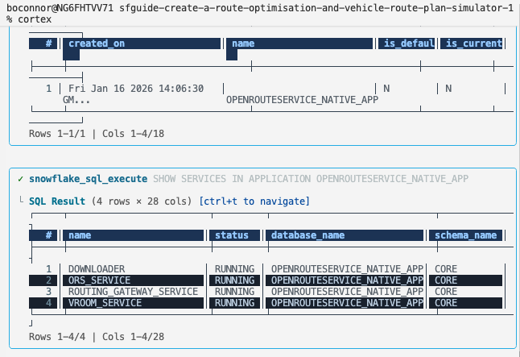
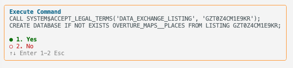
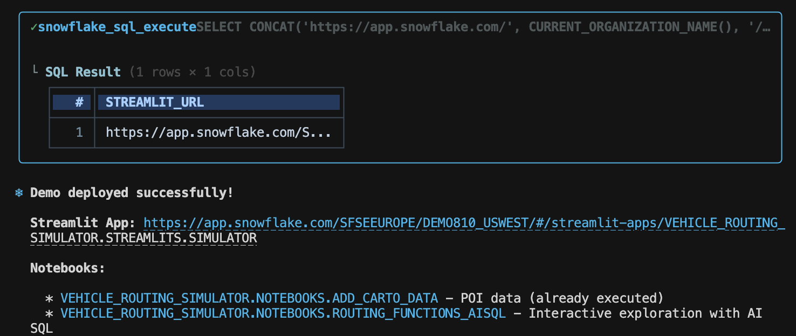
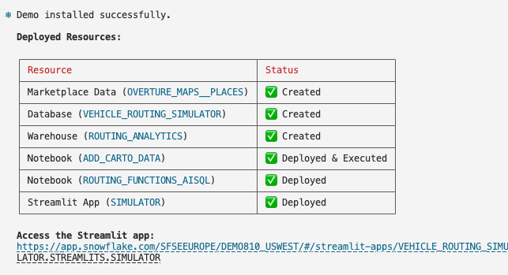
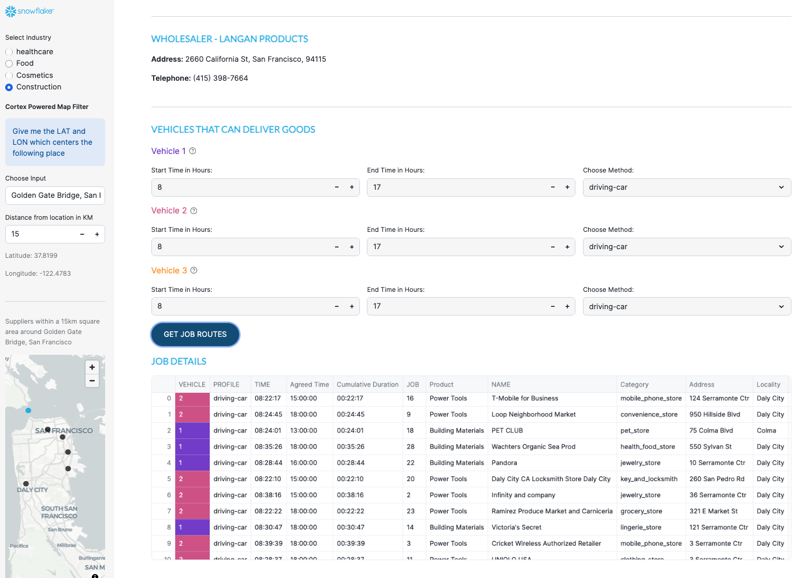
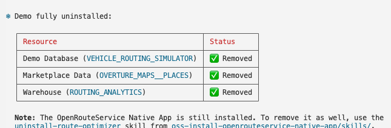
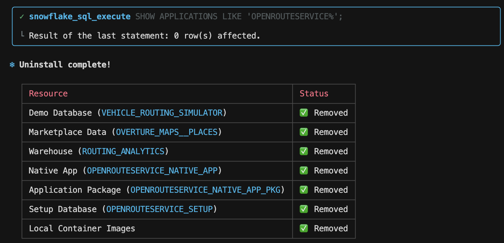

author: Becky O'Connor, Piotr Paczewski, Oleksii Bielov
id: oss-deploy-route-optimization-demo
categories: snowflake-site:taxonomy/solution-center/certification/quickstart, snowflake-site:taxonomy/product/ai, snowflake-site:taxonomy/product/applications-and-collaboration, snowflake-site:taxonomy/snowflake-feature/native-apps, snowflake-site:taxonomy/snowflake-feature/snowpark-container-services, snowflake-site:taxonomy/snowflake-feature/geospatial, snowflake-site:taxonomy/snowflake-feature/cortex-llm-functions
language: en
summary: Build an interactive Route Optimization Simulator using the OpenRouteService Native App. Deploy AISQL notebooks and a Streamlit app that simulates vehicle routing with real-world POI data from Carto Overture Maps - requires ORS Native App as prerequisite.
environments: web
status: Published
feedback link: https://github.com/Snowflake-Labs/sfguides/issues
fork repo link: https://github.com/Snowflake-Labs/sfguide-create-a-route-optimisation-and-vehicle-route-plan-simulator

# Deploy Route Optimization Demo with Cortex Code

> 🚚 **Simulate. Optimize. Deliver.** Build an interactive route optimization demo using real-world business locations - powered by OpenRouteService in Snowflake.

<!-- ------------------------ -->
## Overview 


**Build a fully interactive Route Optimization Simulator using the OpenRouteService Native App.**

This quickstart deploys a demo application that simulates vehicle routing scenarios using real-world business locations from the **Carto Overture Maps** dataset. You'll explore routing functions through an interactive notebook and run a complete Streamlit simulator.

### What You'll Build

🚚 **Route Optimization Simulator** - A fully interactive Streamlit app that:
- Finds potential distributors and customers using AI-powered location search
- Generates catchment areas using isochrones
- Optimizes routes for multiple vehicles with different skills and time windows
- Visualizes routes, delivery points, and vehicle assignments on interactive maps

📓 **AISQL Exploration Notebook** - Learn how to:
- Use AI to generate realistic sample data for your region
- Call the Directions, Optimization, and Isochrones functions
- Visualize routes and catchment areas with Pydeck

### Prerequisites

> **_IMPORTANT:_** This demo requires the **OpenRouteService Native App** to be installed and running. If you haven't installed it yet, complete the [Install OpenRouteService Native App](../oss-install-openrouteservice-native-app/) quickstart first.

**Required:**
- OpenRouteService Native App deployed and activated
- Cortex Code CLI installed and configured
- Active Snowflake connection with ACCOUNTADMIN access

### What You'll Learn 

- Deploy demo notebooks and Streamlit apps using Cortex Code skills
- Work with the **Carto Overture Maps Places** dataset for real-world POI data
- Use **AISQL** functions to generate sample data with Snowflake Cortex
- Build multi-layer geospatial visualizations with Pydeck
- Create vehicle routing simulations with time windows, capacity, and skills

<!-- ------------------------ -->
## Deploy the Demo

Use Cortex Code to deploy the demo including Marketplace data, notebooks, and the Streamlit simulator.

### Run the Deploy Demo Skill

In the Cortex Code CLI, type:

```
use the local skill from oss-deploy-route-optimization-demo/skills/deploy-demo
```

> **_NOTE:_** The skill will first verify that the OpenRouteService Native App is installed. If it's not found, it will provide instructions to install it first.



Cortex Code verifies that the Native App is installed and all four services are running before proceeding with the demo deployment.

The skill then uses interactive prompting to gather required information:



> **_TIP:_** Use your keyboard arrow keys to navigate through options, then press **Enter** to confirm your selection.

Cortex Code will automatically:
- **Verify** OpenRouteService Native App is installed and running
- **Acquire Marketplace Data** - Gets the **Carto Overture Maps Places** dataset with 50+ million POIs worldwide
- **Create Demo Database** - Sets up `VEHICLE_ROUTING_SIMULATOR` with required schemas
- **Deploy Notebooks** - Provisions the AISQL notebook customized for your chosen city
- **Deploy Simulator** - Creates the Route Optimization Streamlit app with real POI data

### What Gets Installed

The demo skill creates the following Snowflake objects:

**Marketplace Data**
| Component | Name | Description |
|-----------|------|-------------|
| Database | `OVERTURE_MAPS__PLACES` | Carto Overture Maps Places dataset with 50M+ POIs worldwide |

**Demo Database & Infrastructure**
| Component | Name | Description |
|-----------|------|-------------|
| Database | `VEHICLE_ROUTING_SIMULATOR` | Main demo database |
| Schema | `VEHICLE_ROUTING_SIMULATOR.DATA` | Prepared POI data for the simulator |
| Schema | `VEHICLE_ROUTING_SIMULATOR.NOTEBOOKS` | Notebook storage and stages |
| Schema | `VEHICLE_ROUTING_SIMULATOR.STREAMLITS` | Streamlit app storage |
| Warehouse | `ROUTING_ANALYTICS` | Compute warehouse for queries (auto-suspend 60s) |
| Stage | `NOTEBOOKS.notebook` | Stage for notebook files |
| Stage | `STREAMLITS.STREAMLIT` | Stage for Streamlit files |

**Notebooks**
| Component | Name | Description |
|-----------|------|-------------|
| Notebook | `NOTEBOOKS.ADD_CARTO_DATA` | Prepares POI data from Carto Overture for the demo |
| Notebook | `NOTEBOOKS.ROUTING_FUNCTIONS_AISQL` | Interactive exploration of Directions, Optimization, and Isochrones |

**Streamlit Application**
| Component | Name | Description |
|-----------|------|-------------|
| Streamlit | `STREAMLITS.SIMULATOR` | Route Optimization Simulator with real POI data |

Once deployment completes successfully, you'll see a summary with direct links to your resources:



Cortex Code confirms all demo components are installed and ready to use:



<!-- ------------------------ -->
## Explore the Routing Functions with AISQL

The AISQL notebook is an interactive exploration of all three routing functions. It uses **Snowflake Cortex AI** to generate realistic sample data - restaurants, delivery jobs, customer addresses - all customized for your configured region.

1. Navigate to **Projects > Notebooks** in Snowsight
2. Open **ROUTING_FUNCTIONS_AISQL**

**What the Notebook Covers:**

| Section | What You'll Learn |
|---------|-------------------|
| **1. Simple Directions** | Generate a hotel and restaurant using AI, then call the `DIRECTIONS` function to get point-to-point routing |
| **2. Cortex Generated Maps** | Let AI write the Pydeck visualization code for you |
| **3. Advanced Directions with Waypoints** | Create a multi-stop route visiting multiple locations |
| **4. Route Optimization (1 Vehicle)** | Use the `OPTIMIZATION` function to assign jobs efficiently |
| **5. Route Optimization (Multiple Vehicles)** | Scale up with 40 customers and 5 vehicles with different skills |
| **6. Isochrones** | Generate catchment polygons showing reachable areas |

<!-- ------------------------ -->
## Run the Streamlit Simulator


Navigate to the Simulator Streamlit app:

1. Go to **Projects > Streamlits** in Snowsight
2. Click on **SIMULATOR**

### Setting the Context

Open the sidebar to configure:
- **Industry Type** - Food, Health, or Cosmetics
- **LLM Model** - For location search (recommend mistral-large2)
- **Search Location** - Free text like "Fisherman's Wharf" or "Golden Gate Bridge"
- **Distance Radius** - How far to search for distributors


### Select a Distributor


Choose from the list of nearby distributors sorted by distance from your search location.

### Configure Vehicles


Configure up to 3 vehicles with:
- **Time Windows** - Start and end hours
- **Vehicle Profile** - Car, HGV, or bicycle
- **Skills** - Each vehicle has a pre-assigned skill level

### Generate Catchment Area


Set the order acceptance catchment time to generate an isochrone showing all reachable delivery locations.

### View Optimized Routes


See which jobs are assigned to which vehicles based on skills and time windows.


View the optimized routes on an interactive map with color-coded paths for each vehicle.

### Vehicle Itinerary


Each vehicle tab shows detailed turn-by-turn instructions for the entire journey.

<!-- ------------------------ -->
## Customize the Demo

You can customize the demo for different industries or regions using the customization skills:

### Change Industries

Simply type a natural language command like:

```
change industry
```

Cortex Code automatically finds the relevant skill and guides you through the options:



You can add a new industry, modify an existing one, or replace one with something different. The skill updates the Streamlit simulator with your customized industry categories (product types, customer types, vehicle skills).

Once the wizard completes, the Streamlit app is automatically refreshed with your new industry:


Alternatively, you can use the full skill path:

```
use the local skill from oss-deploy-route-optimization-demo/skills/customizations/industries
```

### Update Streamlit Apps

```
use the local skill from oss-deploy-route-optimization-demo/skills/customizations/streamlits
```

Update the Simulator with region-specific coordinates.

### Update Notebooks

```
use the local skill from oss-deploy-route-optimization-demo/skills/customizations/aisql-notebook
use the local skill from oss-deploy-route-optimization-demo/skills/customizations/carto-notebook
```

Update the notebooks with city-specific AI prompts and POI data filters.

> **_NOTE:_** To change the map region (e.g., San Francisco to Paris), you need to update the OpenRouteService Native App first. See the [Install OpenRouteService Native App](../oss-install-openrouteservice-native-app/) quickstart for location customization.

<!-- ------------------------ -->
## Uninstall the Demo

Cortex Code makes uninstallation simple with natural language commands.

### Uninstall Demo Only

To remove just the demo resources (notebooks, Streamlit simulator) while keeping the OpenRouteService Native App:

```
uninstall demo
```

This will:
- Remove the demo database (`VEHICLE_ROUTING_SIMULATOR`) including notebooks and Streamlit apps
- Optionally remove the Carto Overture Maps marketplace data (`OVERTURE_MAPS__PLACES`)
- Optionally remove the warehouse (`ROUTING_ANALYTICS`)



> **_NOTE:_** The OpenRouteService Native App remains installed and functional. You can redeploy the demo at any time.

### Uninstall Everything

To remove both the demo AND the OpenRouteService Native App:

```
uninstall demo and optimizer
```

Cortex Code will run both uninstall skills in sequence, removing all resources from your Snowflake account.



> **_TIP:_** You can also use the full skill paths if preferred:
> - `use the local skill from oss-deploy-route-optimization-demo/skills/uninstall-demo`
> - `use the local skill from oss-install-openrouteservice-native-app/skills/uninstall-route-optimizer`

<!-- ------------------------ -->
## Available Cortex Code Skills

For reference, here are the Cortex Code skills for the Route Optimization Demo:

### Demo Skills

| Skill | Description | Command |
|-------|-------------|---------|
| `check-ors-prerequisite` | Verify ORS Native App is installed | `use the local skill from oss-deploy-route-optimization-demo/skills/check-ors-prerequisite` |
| `deploy-demo` | Deploy notebooks and Simulator Streamlit | `use the local skill from oss-deploy-route-optimization-demo/skills/deploy-demo` |
| `uninstall-demo` | Remove demo database, optionally marketplace data | `use the local skill from oss-deploy-route-optimization-demo/skills/uninstall-demo` |

### Customization Sub-Skills

| Sub-Skill | Description | Command |
|-----------|-------------|---------|
| `industries` | Customize industry categories | `use the local skill from oss-deploy-route-optimization-demo/skills/customizations/industries` |
| `streamlits` | Update Simulator with region coordinates | `use the local skill from oss-deploy-route-optimization-demo/skills/customizations/streamlits` |
| `aisql-notebook` | Update AI prompts for your region | `use the local skill from oss-deploy-route-optimization-demo/skills/customizations/aisql-notebook` |
| `carto-notebook` | Update POI data source | `use the local skill from oss-deploy-route-optimization-demo/skills/customizations/carto-notebook` |

### ORS Skills

For OpenRouteService Native App skills (installation, location/vehicle customization, uninstall), see the **[Install OpenRouteService Native App](../oss-install-openrouteservice-native-app/)** quickstart.

<!-- ------------------------ -->
## Conclusion and Resources

### Conclusion

You've deployed a complete Route Optimization Simulator that demonstrates the power of combining:
- **OpenRouteService Native App** - Self-contained routing engine in Snowflake
- **Carto Overture Maps** - Real-world points of interest for authentic simulations
- **Snowflake Cortex AI** - Generate sample data with natural language
- **Streamlit** - Interactive visualization that brings routing scenarios to life

### What You Learned

- Deploy demo applications using Cortex Code skills
- Work with the Carto Overture Places dataset for POI data
- Use AISQL to generate sample data with Snowflake Cortex
- Build vehicle routing simulations with time windows, capacity, and skills
- Visualize routes and catchment areas with Pydeck

### Related Quickstart

- [Install OpenRouteService Native App](/guide/oss-install-openrouteservice-native-app/) - Install and customize the routing engine (prerequisite for this demo)

### Source Code

- [Source Code on GitHub](https://github.com/Snowflake-Labs/sfguide-Create-a-Route-Optimisation-and-Vehicle-Route-Plan-Simulator) - Skills, notebooks, and Streamlit apps

### OpenRouteService Resources

- [OpenRouteService Official Website](https://openrouteservice.org/) - Documentation and API reference
- [VROOM Project](https://github.com/VROOM-Project/vroom) - Vehicle Routing Open-source Optimization Machine

### Cortex Code & Snowflake

- [Snowflake Cortex](https://docs.snowflake.com/en/user-guide/snowflake-cortex/overview) - AI-powered features in Snowflake
- [Carto Overture Maps Places](https://www.carto.com/blog/overture-maps-data-in-snowflake) - POI data for the demo
- [Streamlit](https://streamlit.io/) - Interactive data apps
