author: Becky O'Connor, Piotr Paczewski, Oleksii Bielov
id: oss-deploy-route-optimization-demo
categories: snowflake-site:taxonomy/solution-center/certification/quickstart, snowflake-site:taxonomy/solution-center/certification/certified-solution, snowflake-site:taxonomy/product/ai, snowflake-site:taxonomy/product/applications-and-collaboration, snowflake-site:taxonomy/product/analytics,snowflake-site:taxonomy/snowflake-feature/native-apps, snowflake-site:taxonomy/snowflake-feature/snowpark-container-services, snowflake-site:taxonomy/snowflake-feature/geospatial, snowflake-site:taxonomy/snowflake-feature/cortex-llm-functions
language: en
summary: Build an interactive Route Optimization Simulator using the OpenRouteService Native App. Deploy AISQL notebooks and a Streamlit app that simulates vehicle routing with real-world POI data from Carto Overture Maps - requires ORS Native App as prerequisite.
environments: web
status: Published
feedback link: https://github.com/Snowflake-Labs/sfguides/issues
fork repo link: https://github.com/Snowflake-Labs/sfguide-create-a-route-optimisation-and-vehicle-route-plan-simulator

# Deploy Route Optimization Demo with Cortex Code

> 🚚 **Simulate. Optimize. Deliver.** Build an interactive route optimization demo using real-world business locations - powered by OpenRouteService in Snowflake.

<!-- ------------------------ -->
## Overview 

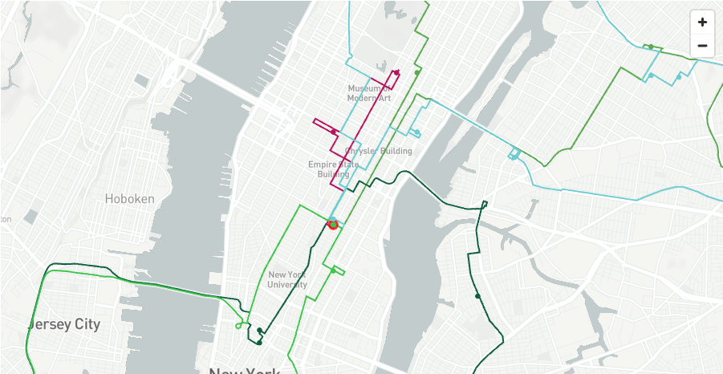

**Build a fully interactive Route Optimization Simulator using the OpenRouteService Native App.**

This quickstart deploys a demo application that simulates vehicle routing scenarios using real-world business locations from the **Carto Overture Maps** dataset. You'll explore routing functions through an interactive notebook and run a complete Streamlit simulator.

### What You'll Build

🚚 **Route Optimization Simulator** - A fully interactive Streamlit app that:
- Finds potential distributors and customers using AI-powered location search
- Generates catchment areas using isochrones
- Optimizes routes for multiple vehicles with different skills and time windows
- Visualizes routes, delivery points, and vehicle assignments on interactive maps

📓 **AISQL Exploration Notebook** - Learn how to:
- Use AI to generate realistic sample data for your region
- Call the Directions, Optimization, and Isochrones functions
- Visualize routes and catchment areas with Pydeck

### Prerequisites

> **_IMPORTANT:_** This demo requires the **OpenRouteService Native App** to be installed and running. If you haven't installed it yet, complete the [Build Routing Solution in Snowflake with Cortex Code](../oss-build-routing-solution-in-snowflake/) quickstart first.

**Required:**
- OpenRouteService Native App deployed and activated
- [Cortex Code CLI](https://docs.snowflake.com/en/user-guide/cortex-code/cortex-code-cli) installed and configured
- Active Snowflake connection with ACCOUNTADMIN access

> **_NOTE:_** The deploy skill enables cross-region Cortex AI access (`CORTEX_ENABLED_CROSS_REGION = 'ANY_REGION'`) on your account to ensure the Claude model used by the AISQL notebook is available in your region. If you prefer not to enable cross-region inference, you can modify the notebook to use a different LLM model that is available locally in your region.

### What You'll Learn 

- Deploy demo notebooks and Streamlit apps using Cortex Code skills
- Work with the **Carto Overture Maps Places** dataset for real-world POI data
- Use **AISQL** functions to generate sample data with Snowflake Cortex
- Build multi-layer geospatial visualizations with Pydeck
- Create vehicle routing simulations with time windows, capacity, and skills

<!-- ------------------------ -->
## Deploy the Demo

Use Cortex Code to deploy the demo including Marketplace data, notebooks, and the Streamlit simulator.

### Clone Repository and Deploy Skill

Clone the repository:

```bash
git clone https://github.com/Snowflake-Labs/sfguide-create-a-route-optimisation-and-vehicle-route-plan-simulator
cd sfguide-create-a-route-optimisation-and-vehicle-route-plan-simulator
```

In the Cortex Code CLI, type:

```
$deploy-route-optimization-demo
```

> **_NOTE:_** The skill will first verify that the OpenRouteService Native App is installed. If it's not found, it will provide instructions to install it first.

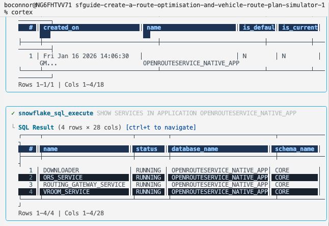

Cortex Code verifies that the Native App is installed and all four services are running before proceeding with the demo deployment.

The skill then uses interactive prompting to gather required information:

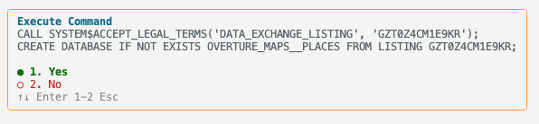

> **_TIP:_** Use your keyboard arrow keys to navigate through options, then press **Enter** to confirm your selection.

Cortex Code will automatically:
- **Verify** OpenRouteService Native App is installed and running
- **Acquire Marketplace Data** - Gets the **Carto Overture Maps Places** dataset with 50+ million POIs worldwide
- **Create Demo Schema** - Sets up `OPENROUTESERVICE_SETUP.VEHICLE_ROUTING_SIMULATOR` schema
- **Deploy Notebooks** - Provisions the AISQL notebook customized for your chosen city
- **Deploy Simulator** - Creates the Route Optimization Streamlit app with real POI data

### What Gets Installed

The demo skill creates the following Snowflake objects:

**Marketplace Data**
| Component | Name | Description |
|-----------|------|-------------|
| Database | `OVERTURE_MAPS__PLACES` | Carto Overture Maps Places dataset with 50M+ POIs worldwide |

**Demo Schemas & Infrastructure**
| Component | Name | Description |
|-----------|------|-------------|
| Database | `OPENROUTESERVICE_SETUP` | Demo database for simulator objects |
| Schema | `OPENROUTESERVICE_SETUP.VEHICLE_ROUTING_SIMULATOR` | Prepared POI data, notebooks, and Streamlit app |
| Warehouse | `ROUTING_ANALYTICS` | Compute warehouse for queries (auto-suspend 60s) |
| Stage | `VEHICLE_ROUTING_SIMULATOR.NOTEBOOK` | Stage for notebook files |
| Stage | `VEHICLE_ROUTING_SIMULATOR.STREAMLIT` | Stage for Streamlit files |

**Notebooks**
| Component | Name | Description |
|-----------|------|-------------|
| Notebook | `VEHICLE_ROUTING_SIMULATOR.ADD_CARTO_DATA` | Prepares POI data from Carto Overture for the demo |
| Notebook | `VEHICLE_ROUTING_SIMULATOR.ROUTING_FUNCTIONS_AISQL` | Interactive exploration of Directions, Optimization, and Isochrones |

**Streamlit Application**
| Component | Name | Description |
|-----------|------|-------------|
| Streamlit | `VEHICLE_ROUTING_SIMULATOR.SIMULATOR` | Route Optimization Simulator with real POI data |

Once deployment completes successfully, you'll see a summary with direct links to your resources:

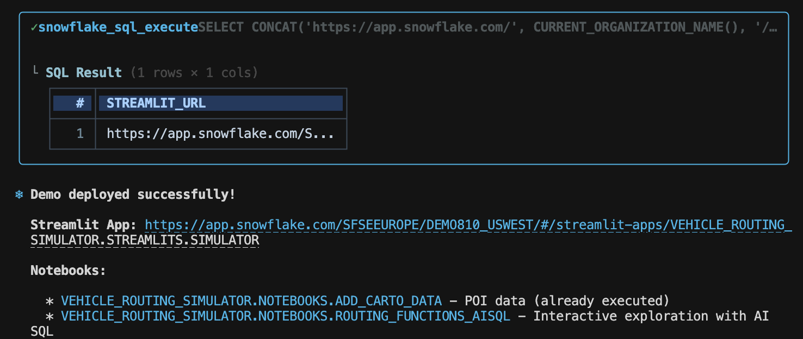

Cortex Code confirms all demo components are installed and ready to use:

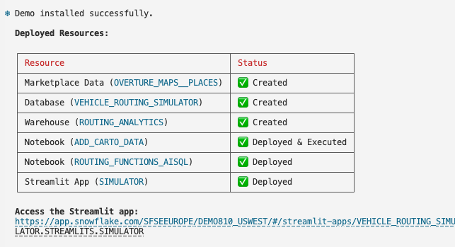

<!-- ------------------------ -->
## Explore the Routing Functions with AISQL

The AISQL notebook is an interactive exploration of all three routing functions. It uses **Snowflake Cortex AI** to generate realistic sample data - restaurants, delivery jobs, customer addresses - all customized for your configured region.

1. Navigate to **Projects > Notebooks** in Snowsight
2. Open **ROUTING_FUNCTIONS_AISQL**

**What the Notebook Covers:**

| Section | What You'll Learn |
|---------|-------------------|
| **1. Simple Directions** | Generate a hotel and restaurant using AI, then call the `DIRECTIONS` function to get point-to-point routing |
| **2. Cortex Generated Maps** | Let AI write the Pydeck visualization code for you |
| **3. Advanced Directions with Waypoints** | Create a multi-stop route visiting multiple locations |
| **4. Route Optimization (1 Vehicle)** | Use the `OPTIMIZATION` function to assign jobs efficiently |
| **5. Route Optimization (Multiple Vehicles)** | Scale up with 40 customers and 5 vehicles with different skills |
| **6. Isochrones** | Generate catchment polygons showing reachable areas |

<!-- ------------------------ -->
## Run the Streamlit Simulator

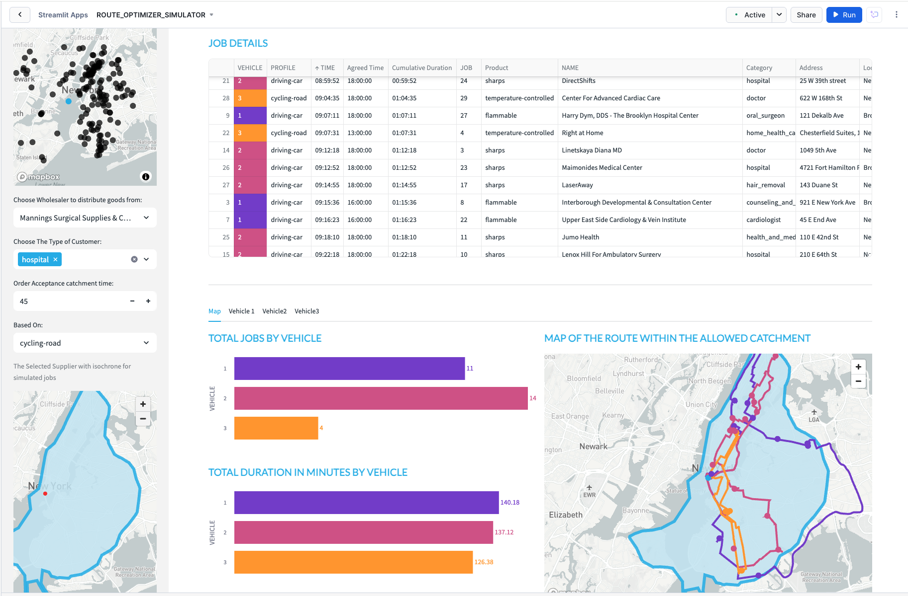

Navigate to the Simulator Streamlit app:

1. Go to **Projects > Streamlits** in Snowsight
2. Click on **SIMULATOR**

### Setting the Context

Open the sidebar to configure:
- **Industry Type** - Food, Health, or Cosmetics
- **Search Location** - Automatically set based on the map region configured in the ORS Native App. Override with free text (e.g., "Fisherman's Wharf")
- **Distance Radius** - How far to search for distributors

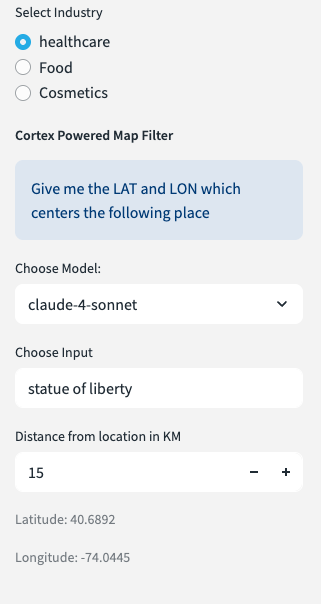

### Select a Distributor

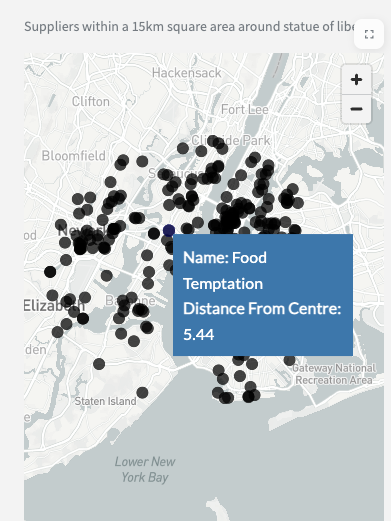

Choose from the list of nearby distributors sorted by distance from your search location.

### Configure Vehicles

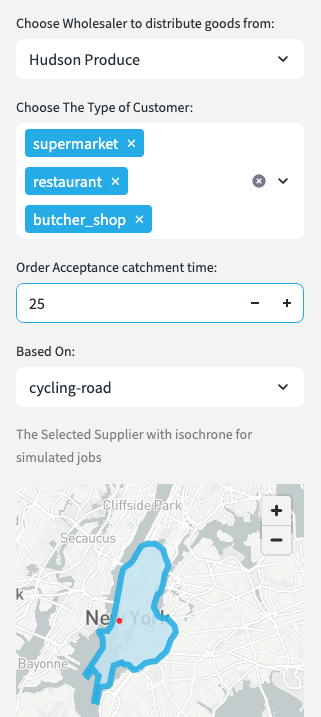

Configure up to 3 vehicles with:
- **Time Windows** - Start and end hours
- **Vehicle Profile** - Car, HGV, or bicycle
- **Skills** - Each vehicle has a pre-assigned skill level

### Generate Catchment Area

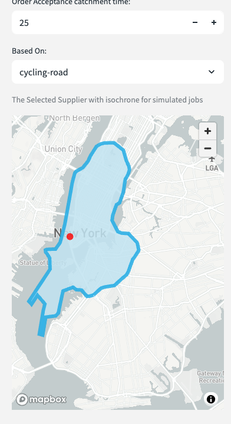

Set the order acceptance catchment time to generate an isochrone showing all reachable delivery locations.

### View Optimized Routes

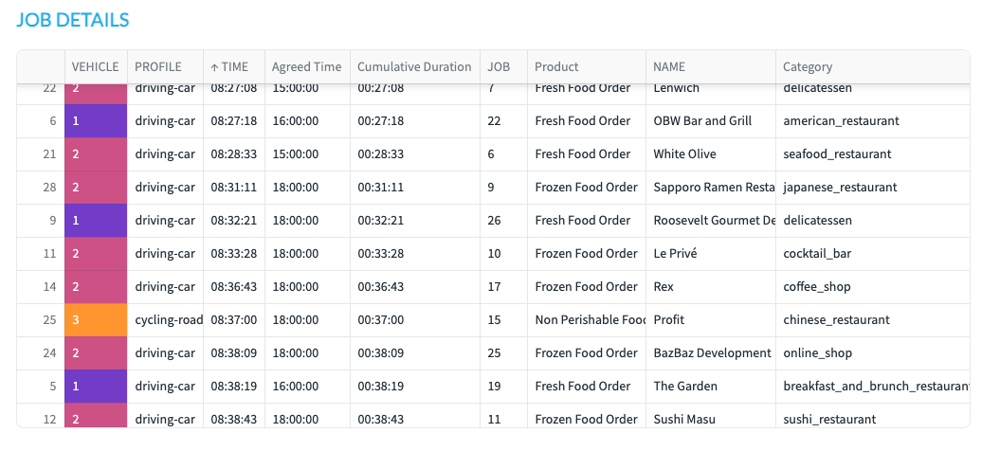

See which jobs are assigned to which vehicles based on skills and time windows.

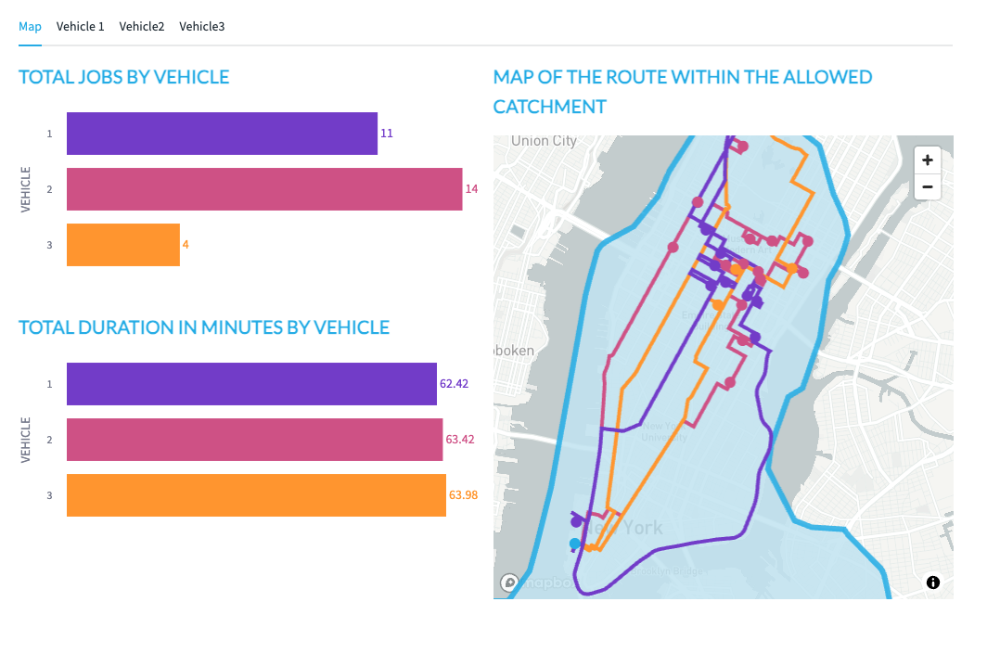

View the optimized routes on an interactive map with color-coded paths for each vehicle.

### Vehicle Itinerary

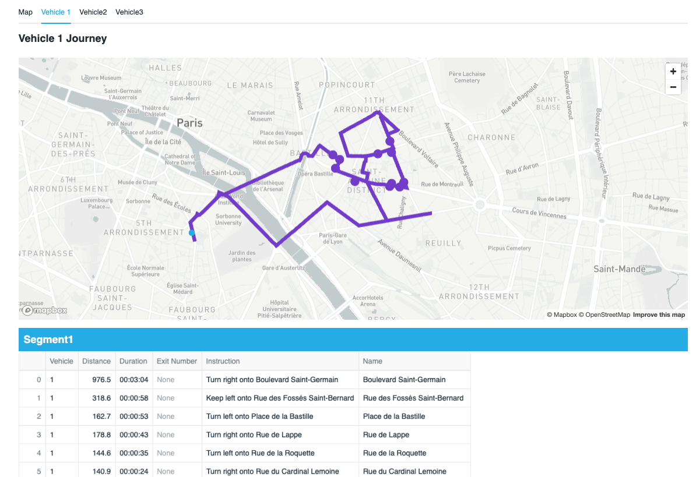

Each vehicle tab shows detailed turn-by-turn instructions for the entire journey.

<!-- ------------------------ -->
## Customize the Demo

You can customize the demo for different regions using the customization skills:

### Change Location or Routing Profiles

In the Cortex Code CLI, type:

```
$customize-main
```
> **_NOTE:_** See the [Build Routing Solution in Snowflake](../oss-build-routing-solution-in-snowflake/) quickstart for more content about location customization.

Cortex Code automatically finds the relevant skill and guides you through the options.

You can change the geographic region (e.g., San Francisco to Paris) or update routing profiles (enable/disable car, truck, bicycle, walking).

### Change Industries

During the initial deployment (`$deploy-route-optimization-demo`), the skill will ask if you want to customize industries. You can re-run the deploy skill to change industries at any time.

> **_NOTE:_** To change the map region or routing profiles, you need to update the OpenRouteService Native App. See the [Build Routing Solution in Snowflake with Cortex Code](../oss-build-routing-solution-in-snowflake/) quickstart for location customization.

<!-- ------------------------ -->
## Uninstall the Solution

To remove the Route Optimization Demo solution execute:

```
DROP SCHEMA OPENROUTESERVICE_SETUP.VEHICLE_ROUTING_SIMULATOR;
```

This will remove the `OPENROUTESERVICE_SETUP.VEHICLE_ROUTING_SIMULATOR` schema and its contents.

> **_NOTE:_** The OpenRouteService Native App remains installed. You can uninstall it separately.

<!-- ------------------------ -->
## Available Cortex Code Skills

For reference, here are the Cortex Code skills for the Route Optimization Demo:

### Demo Skills

| Skill | Description | Command |
|-------|-------------|---------|
| `deploy-route-optimization-demo` | Deploy notebooks and Simulator Streamlit | `$deploy-route-optimization-demo` |

### Customization Skills

| Skill | Description | Command |
|-------|-------------|---------|
| `customize-main` | Route customization requests (location and routing profiles) | `$customize-main` |
| `customize-main/location` | Route customization requests (location and routing profiles)|  Subskill, not to be invoked separately |
| `customize-main/routing-profiles` | Enable/disable vehicle routing profiles (sub-skill, do not invoke separately) | Subskill, not to be invoked separately |
| `customize-main/read-ors-configuration` | Read current ORS configuration (sub-skill, do not invoke separately) | Subskill, not to be invoked separately |

### ORS Skills

For OpenRouteService Native App skills (installation, location/vehicle customization, uninstall), see the **[Build Routing Solution in Snowflake with Cortex Code](../oss-build-routing-solution-in-snowflake/)** quickstart.

<!-- ------------------------ -->
## Conclusion and Resources

### Conclusion

You've deployed a complete Route Optimization Simulator that demonstrates the power of combining:
- **OpenRouteService Native App** - Self-contained routing engine in Snowflake
- **Carto Overture Maps** - Real-world points of interest for authentic simulations
- **Snowflake Cortex AI** - Generate sample data with natural language
- **Streamlit** - Interactive visualization that brings routing scenarios to life

### What You Learned

- Deploy demo applications using Cortex Code skills
- Work with the Carto Overture Places dataset for POI data
- Use AISQL to generate sample data with Snowflake Cortex
- Build vehicle routing simulations with time windows, capacity, and skills
- Visualize routes and catchment areas with Pydeck

### Related Quickstart

- [Build Routing Solution in Snowflake with Cortex Code](../oss-build-routing-solution-in-snowflake/) - Build and customize the routing solution (prerequisite for this demo)
- [Retail Catchment Analysis with Overture Maps](https://www.snowflake.com/en/developers/guides/oss-retail-catchment-overture-maps/) - Build an interactive retail catchment analysis tool using real-world POI data - powered by OpenRouteService in Snowflake.
- [Deploy Fleet Intelligence Solution for Taxis](https://www.snowflake.com/en/developers/guides/oss-deploy-a-fleet-intelligence-solution-for-taxis/) - Track and analyze taxi fleet operations
- [Deploy Snowflake Intelligence Routing Agent](https://www.snowflake.com/en/developers/guides/oss-deploy-snowflake-intelligence-routing-agent/) - Build an AI-powered route planning assistant that understands natural language locations - powered by OpenRouteService and Snowflake Intelligence

### Source Code

- [Source Code on GitHub](https://github.com/Snowflake-Labs/sfguide-Create-a-Route-Optimisation-and-Vehicle-Route-Plan-Simulator) - Skills, notebooks, and Streamlit apps

### OpenRouteService Resources

- [OpenRouteService Official Website](https://openrouteservice.org/) - Documentation and API reference
- [VROOM Project](https://github.com/VROOM-Project/vroom) - Vehicle Routing Open-source Optimization Machine

### Cortex Code & Snowflake

- [Snowflake Cortex](https://docs.snowflake.com/en/user-guide/snowflake-cortex/overview) - AI-powered features in Snowflake
- [Carto Overture Maps Places](https://www.carto.com/blog/overture-maps-data-in-snowflake) - POI data for the demo
- [Streamlit](https://streamlit.io/) - Interactive data apps
