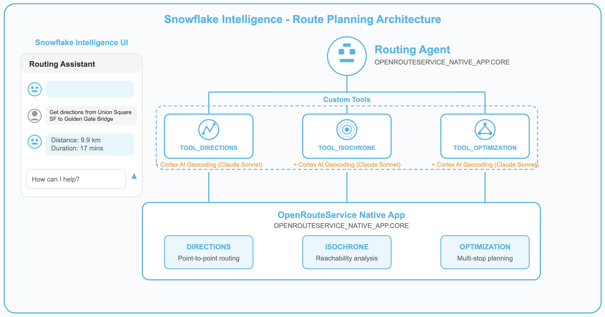
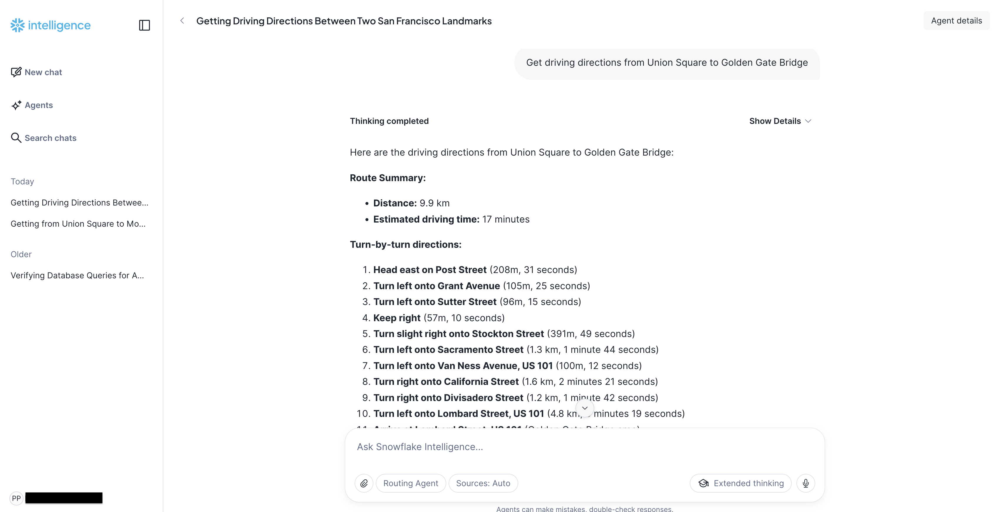
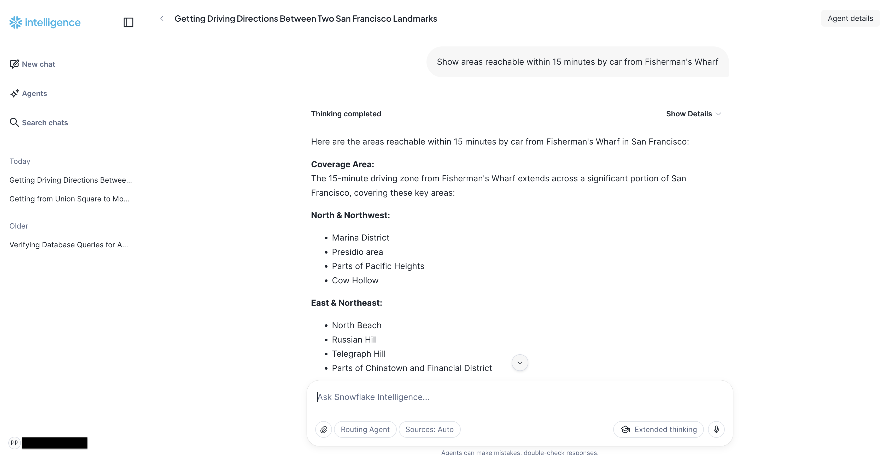
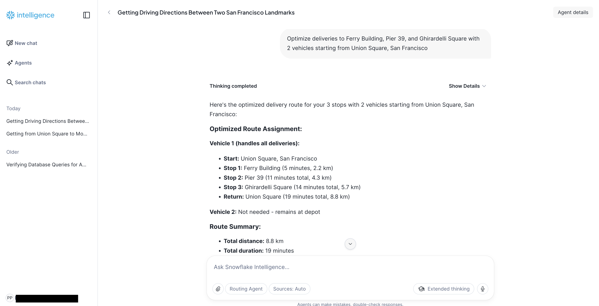

author: Becky O'Connor, Piotr Paczewski, Oleksii Bielov
id: oss-deploy-snowflake-intelligence-routing-agent
categories: snowflake-site:taxonomy/solution-center/certification/quickstart, snowflake-site:taxonomy/product/ai, snowflake-site:taxonomy/product/applications-and-collaboration, snowflake-site:taxonomy/snowflake-feature/native-apps, snowflake-site:taxonomy/snowflake-feature/snowpark-container-services, snowflake-site:taxonomy/snowflake-feature/geospatial, snowflake-site:taxonomy/snowflake-feature/cortex-llm-functions, snowflake-site:taxonomy/snowflake-feature/snowflake-intelligence
language: en
summary: Deploy a Snowflake Intelligence Agent for AI-powered route planning using OpenRouteService. Create a conversational assistant that handles directions, isochrones, and multi-stop delivery optimization - all with natural language location input and Cortex AI geocoding.
environments: web
status: Published
feedback link: https://github.com/Snowflake-Labs/sfguides/issues
fork repo link: https://github.com/Snowflake-Labs/sfguide-create-a-route-optimisation-and-vehicle-route-plan-simulator

# Deploy Snowflake Intelligence Routing Agent

> 🤖 **Ask. Route. Optimize.** Build an AI-powered route planning assistant that understands natural language locations - powered by OpenRouteService and Snowflake Intelligence.

<!-- ------------------------ -->
## Overview 

**Build a conversational AI assistant that provides intelligent route planning using natural language.**

This quickstart deploys a **Snowflake Intelligence Agent** that wraps OpenRouteService routing functions with AI-powered geocoding. Users can ask questions like "Get directions from Union Square San Francisco to Golden Gate Bridge" and the agent automatically converts location names to coordinates, calls the routing functions, and returns formatted results.



### What You'll Build

🤖 **Routing Agent** - A Snowflake Intelligence agent that:
- Accepts natural language location descriptions (no coordinates needed)
- Uses Snowflake Cortex AI for geocoding locations worldwide
- Provides driving, cycling, and walking directions between any locations
- Generates isochrone catchment areas showing reachable zones
- Optimizes multi-stop delivery routes with multiple vehicles

🛠️ **AI-Powered Tool Procedures** - Three stored procedures with built-in geocoding:
- `TOOL_DIRECTIONS` - Get turn-by-turn directions between named locations
- `TOOL_ISOCHRONE` - Generate reachability polygons from any location
- `TOOL_OPTIMIZATION` - Optimize delivery routes for multiple vehicles

### Prerequisites

> **_IMPORTANT:_** This demo requires the **OpenRouteService Native App** to be installed and running. If you haven't installed it yet, complete the [Install OpenRouteService Native App](https://www.snowflake.com/en/developers/guides/oss-install-openrouteservice-native-app/) quickstart first.

**Required:**
- OpenRouteService Native App deployed and activated
- Cortex Code CLI installed and configured
- Active Snowflake connection with ACCOUNTADMIN access
- Cortex AI access (claude-sonnet-4-5 model for geocoding)

### What You'll Learn 

- Deploy a Snowflake Intelligence Agent using Cortex Code skills
- Create stored procedures that combine **Cortex AI geocoding** with routing functions
- Build AI tool wrappers that accept natural language input
- Register agents with Snowflake Intelligence for conversational access
- Test routing capabilities via the Snowflake Intelligence UI

<!-- ------------------------ -->
## Architecture

The Routing Agent architecture combines three key Snowflake technologies:

| Component | Technology | Purpose |
|-----------|------------|---------|
| **Agent Orchestration** | Snowflake Intelligence | Conversational interface and tool selection |
| **Geocoding** | Cortex AI (claude-sonnet-4-5) | Convert location names to coordinates |
| **Routing** | OpenRouteService Native App | Calculate routes, isochrones, and optimizations |

### How It Works

1. **User asks a question** in natural language (e.g., "Directions from the Eiffel Tower to the Louvre")
2. **Agent selects the appropriate tool** based on the question type
3. **Tool procedure extracts locations** and calls Cortex AI for geocoding
4. **Coordinates are passed** to the OpenRouteService function
5. **Results are formatted** and returned to the user

This architecture enables truly conversational route planning - no coordinates, APIs, or technical knowledge required from the user.

<!-- ------------------------ -->
## Deploy the Routing Agent

Use Cortex Code to deploy the Routing Agent including tool procedures and agent registration.

### Run the Deploy Skill

In the Cortex Code CLI, type:

```
use the local skill from oss-deploy-snowflake-intelligence-routing-agent/skills/deploy_snowflake_intelligence_routing_agent
```

> **_NOTE:_** The skill will first verify that the OpenRouteService Native App is installed. 

Cortex Code will automatically:
- **Verify** OpenRouteService functions are available (DIRECTIONS, ISOCHRONES, OPTIMIZATION)
- **Create Tool Procedures** - Deploy 3 AI-enhanced stored procedures with geocoding
- **Create the Agent** - Deploy the Routing Agent with tool configurations
- **Register with Intelligence** - Add the agent to Snowflake Intelligence for UI access
- **Test the Agent** - Verify all tools work correctly

### What Gets Installed

The deploy skill creates the following Snowflake objects:

**Stored Procedures (AI-Enhanced Tools)**
| Procedure | Description |
|-----------|-------------|
| `OPENROUTESERVICE_NATIVE_APP.CORE.TOOL_DIRECTIONS` | Directions with AI geocoding for natural language locations |
| `OPENROUTESERVICE_NATIVE_APP.CORE.TOOL_ISOCHRONE` | Isochrone generation with AI geocoding |
| `OPENROUTESERVICE_NATIVE_APP.CORE.TOOL_OPTIMIZATION` | Multi-vehicle route optimization with AI geocoding |

**Snowflake Intelligence Agent**
| Component | Name | Description |
|-----------|------|-------------|
| Agent | `OPENROUTESERVICE_NATIVE_APP.CORE.ROUTING_AGENT` | Conversational route planning assistant |

<!-- ------------------------ -->
## Understanding the Tool Procedures

Each tool procedure combines Cortex AI geocoding with OpenRouteService functions. This enables natural language input without requiring users to know coordinates.

### TOOL_DIRECTIONS

**Purpose:** Get directions between named locations.

**Parameters:**
| Parameter | Type | Description |
|-----------|------|-------------|
| `LOCATIONS_DESCRIPTION` | VARCHAR | Natural language locations (e.g., "from Union Square San Francisco to Golden Gate Bridge") |
| `PROFILE` | VARCHAR | Transport mode (default: `driving-car`) |

**Example Usage:**
```sql
CALL OPENROUTESERVICE_NATIVE_APP.CORE.TOOL_DIRECTIONS(
    'from Union Square San Francisco to Golden Gate Bridge',
    'driving-car'
);
```

### TOOL_ISOCHRONE

**Purpose:** Generate reachability area from a location.

**Parameters:**
| Parameter | Type | Description |
|-----------|------|-------------|
| `LOCATION_DESCRIPTION` | VARCHAR | Center location (e.g., "Tokyo Station") |
| `RANGE_MINUTES` | NUMBER | Travel time in minutes (1-60) |
| `PROFILE` | VARCHAR | Transport mode (default: `driving-car`) |

**Example Usage:**
```sql
CALL OPENROUTESERVICE_NATIVE_APP.CORE.TOOL_ISOCHRONE(
    'Fisherman''s Wharf San Francisco',
    15,
    'driving-car'
);
```

### TOOL_OPTIMIZATION

**Purpose:** Optimize delivery routes for multiple vehicles.

**Parameters:**
| Parameter | Type | Description |
|-----------|------|-------------|
| `DELIVERY_LOCATIONS` | VARCHAR | All delivery stops (e.g., "Ferry Building, Pier 39, Ghirardelli Square") |
| `DEPOT_LOCATION` | VARCHAR | Vehicle start/end location (e.g., "SFO Airport") |
| `NUM_VEHICLES` | NUMBER | Number of vehicles available |
| `PROFILE` | VARCHAR | Transport mode (default: `driving-car`) |

**Example Usage:**
```sql
CALL OPENROUTESERVICE_NATIVE_APP.CORE.TOOL_OPTIMIZATION(
    'Ferry Building San Francisco, Pier 39 San Francisco, Ghirardelli Square San Francisco',
    'Union Square, San Francisco',
    2,
    'driving-car'
);
```
<!-- ------------------------ -->
## The Routing Agent

The Routing Agent is a Snowflake Intelligence agent configured with three tools that map to the stored procedures.

> **_NOTE:_** Available routing profiles depend on your OpenRouteService configuration. 

<!-- ------------------------ -->
## Using the Routing Agent

Once deployed, you can interact with the Routing Agent through the Snowflake Intelligence UI.

### Access the Agent

1. Navigate to **Snowflake Intelligence** in Snowsight
2. The **Routing Agent** agent will appear in your available agents
3. Click to start a conversation

### Example Conversations

**Getting Directions:**


**Reachability Analysis:**


**Route Optimization:**


### Region Considerations

> **_IMPORTANT:_** The agent works with locations within the region configured in your OpenRouteService Native App.

<!-- ------------------------ -->
## Troubleshooting

### Checking Service Status

If routing functions fail, verify the OpenRouteService services are running:

```sql
SHOW SERVICES IN SCHEMA OPENROUTESERVICE_NATIVE_APP.CORE;
```

All services should show `RUNNING` status. If any are suspended:

```sql
ALTER SERVICE OPENROUTESERVICE_NATIVE_APP.CORE.<service_name> RESUME;
```

### Testing Individual Tools

You can test each tool procedure directly:

```sql
-- Test directions
CALL OPENROUTESERVICE_NATIVE_APP.CORE.TOOL_DIRECTIONS(
    'from Union Square to Fisherman''s Wharf',
    'driving-car'
);

-- Test isochrone
CALL OPENROUTESERVICE_NATIVE_APP.CORE.TOOL_ISOCHRONE(
    'Golden Gate Bridge',
    10,
    'driving-car'
);

-- Test optimization
CALL OPENROUTESERVICE_NATIVE_APP.CORE.TOOL_OPTIMIZATION(
    'Pier 39, Coit Tower, Ferry Building',
    'Union Square',
    2,
    'driving-car'
);
```

<!-- ------------------------ -->
## Customization

### Changing the Map Region

To use the agent with a different city or region, update your OpenRouteService Native App. More details here: [Install OpenRouteService Native App](https://www.snowflake.com/en/developers/guides/oss-install-openrouteservice-native-app/)

After changing the region, the agent will automatically work with locations in the new area.

<!-- ------------------------ -->
## Conclusion and Resources

### Conclusion

You've deployed a Snowflake Intelligence Routing Agent that demonstrates the power of combining:
- **Snowflake Intelligence** - Conversational AI interface with tool orchestration
- **Cortex AI** - Natural language geocoding without external APIs
- **OpenRouteService Native App** - Self-contained routing engine in Snowflake

The agent enables truly natural route planning - users simply describe locations in plain language, and the AI handles coordinate conversion, routing calculations, and result formatting.

### What You Learned

- Deploy a Snowflake Intelligence Agent using Cortex Code skills
- Create AI-enhanced stored procedures with Cortex geocoding
- Build conversational routing agents with natural language input
- Register and access agents through the Snowflake Intelligence UI
- Test and troubleshoot agent tool execution

### Source Code

- [Source Code on GitHub](https://github.com/sfc-gh-ppaczewski/sfguide-create-a-route-optimisation-and-vehicle-route-plan-simulator/tree/main/oss-deploy-snowflake-intelligence-routing-agent/)

### Related Quickstarts

- [Install OpenRouteService Native App](https://www.snowflake.com/en/developers/guides/oss-install-openrouteservice-native-app/) - Install the routing engine (prerequisite)
- [Deploy Route Optimization Demo](https://www.snowflake.com/en/developers/guides/oss-deploy-route-optimization-demo/) - Build a visual route optimization simulator
- [Deploy Fleet Intelligence Solution](https://www.snowflake.com/en/developers/guides/oss-deploy-a-fleet-intelligence-solution-for-taxis/) - Track and analyze taxi fleet operations

### Snowflake Intelligence Resources

- [Snowflake Intelligence Documentation](https://docs.snowflake.com/en/user-guide/snowflake-intelligence) - Official documentation
- [Snowflake Cortex AI](https://docs.snowflake.com/en/user-guide/snowflake-cortex/overview) - AI-powered features in Snowflake
- [Creating Agents](https://docs.snowflake.com/en/user-guide/snowflake-intelligence/agents) - Agent creation guide
